## 一、Docker概述

### (一)、Docker为什么出现？

1、一款产品： 开发–上线 两套环境！应用环境，应用配置！

2、开发 — 运维。 问题：我在我的电脑上可以允许！版本更新，导致服务不可用！对于运维来说考验十分大？

3、环境配置是十分的麻烦，每一个机器都要部署环境(集群Redis、ES、Hadoop…) !费事费力。

4、发布一个项目( jar + (Redis MySQL JDK ES) )，项目能不能带上环境安装打包！

5、之前在服务器配置一个应用的环境 Redis、MySQL、JDK、ES、Hadoop 配置超麻烦了，不能够跨平台。开发环境Windows，最后发布到Linux！

6、传统：开发jar，运维来做！

6、现在：开发打包部署上线，一套流程做完！

7、安卓流程：java — apk —发布（应用商店）—- 张三使用apk一安装即可用！

8、docker流程： java-jar（环境） — 打包项目带上环境（镜像） — ( Docker仓库：商店）——-下载我们发布的镜像 —- 直接运行即可！

8、Docker给以上的问题，提出了解决方案！

9、Docker的思想就来自于集装箱！

10、JRE – 多个应用(端口冲突) – 原来都是交叉的！

11、隔离：Docker核心思想！打包装箱！每个箱子是互相隔离的。

12、Docker通过隔离机制，可以将服务器利用到极致！

13、本质：所有的技术都是因为出现了一些问题，我们需要去解决，才去学习！

### (二)、Dcoker的历史

1、2010年，几个搞IT的年轻人，就在美国成立了一家公司 dotcloud

2、做一些 pass 的云计算服务！LXC（Linux Container容器）有关的容器技术！

3、Linux Container容器是一种内核虚拟化技术，可以提供轻量级的虚拟化，以便隔离进程和资源。

4、他们将自己的技术（容器化技术）命名就是 Docker。

4、Docker刚刚延生的时候，没有引起行业的注意！dotCloud，就活不下去！ 

5、2013年，Docker开源！

6、越来越多的人发现docker的优点！火了。Docker每个月都会更新一个版本！

7、2014年4月9日，Docker1.0发布！

### (三)、**docker**为什么这么火？

1、在容器技术出来之前，我们都是使用虚拟机技术！

2、虚拟机：在window中装一个VMware，通过这个软件我们可以虚拟出来一台或者多台电脑！笨重！

3、虚拟机也属于虚拟化技术，Docker容器技术，也是一种虚拟化技术！

4、vm : linux centos 原生镜像（一个电脑！） 隔离、需要开启多个虚拟机！ 几个G 几分钟

5、docker: 隔离，镜像（最核心的环境 4m + jdk + mysql）十分的小巧，运行镜像就可以了！小巧！
 几个M 秒级启动！

6、Docker基于Go语言开发的！开源项目！

7、docker官网：https://www.docker.com/

8、文档：https://docs.docker.com/ Docker的文档是超级详细的！

9、仓库：https://hub.docker.com/ 相当于 github

### (四)、Docker能做什么？

比较Docker和虚拟机技术的不同：

1、传统虚拟机,虚拟出一条硬件，运行一个完整的操作系统，然后在这个系统上安装和运行软件

容器内的应用直接运行在宿主机的内容，容器是没有自己的内核的，也没有虚拟我们的硬件，所以
 2、就轻便了,每个容器间是互相隔离，每个容器内都有一个属于自己的文件系统，互不影响

### (五)、Docker的基本组成

- 镜像（image)：

docker镜像就好比是一个目标，可以通过这个目标来创建容器服务，tomcat镜像==>run==>容器（提供服务器），通过这个镜像可以创建多个容器（最终服务运行或者项目运行就是在容器中的）。

- 容器(container)：

Docker利用容器技术，独立运行一个或者一组应用，通过镜像来创建的.

启动，停止，删除，基本命令

目前就可以把这个容器理解为就是一个简易的 Linux系统。

- 仓库(repository)：

仓库就是存放镜像的地方！

仓库分为公有仓库和私有仓库。(很类似git)

Docker Hub是国外的。

阿里云…都有容器服务器(配置镜像加速!)

## 二、安装

### (一)、Linux的内核3.10以上


### (二)、清除杂的环境

```shell
  yum remove docker \
    docker-client \
    docker-client-latest \
    docker-common \
    docker-latest \
    docker-latest-logrotate \-
    docker-logrotate \
    docker-engine
```

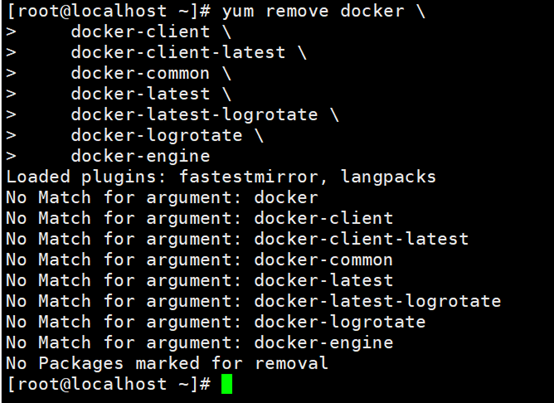

### (三)、虚拟机联网安装应用

```
yum install -y yum-utils
```

 


### (四)、设置镜像仓库  

```shell
yum-config-manager \
    --add-repo \
    https://mirrors.aliyun.com/docker-ce/linux/centos/docker-ce.repo
```


### (五)、更新yum包索引

```
yum makecache fast
```

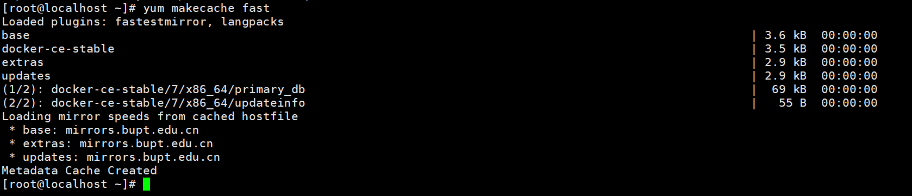

### (六)、安装doker-ce(社区办) dockerEE是企业版

```
yum -y install docker-ce docker-ce-cli containerd.io
```

 


### (七)、启动docker

```
systemctl start docker
```

 

(八)、查看docker版本

```
docker verson
```

 

### (八)、测试

```shell
docker run hello-world
```


### (九)、查看镜像

```
docker images
```

 

## 二、卸载Docker

```
yum remove docker-ce docker-ce-cli containerd.io
rm -rf /var/lib/docker
rm -rf /var/lib/containerd
```

## 三、常用命令

### (一)、帮助命令

```shell
docker verson   	  # 显示docker的版本信息
docker info           # 显示docker的系统信息,包括镜像和容器数量
docker 命令 –help 	 # 帮助命令
```

### (二)、镜像命令

#### 1、查看本机所有镜像

```
docker images 
```

 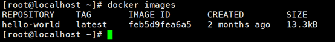

##### 1.1、解释:

```shell
REPOSITORY 		# 镜像的仓库源
TAG 			# 镜像的标签
image ID		# 镜像的ID
CREATED 		# 镜像的创建时间
SIZE 			# 镜像的大小
```

##### 1.2、可选项

```shell
-q, --all      # 列出所有的镜像
-q,--quiet     # 只显示镜像的id
```

#### 2、搜索镜像

```shell
docker search  # 搜索的镜像名
```

 

##### 2.1、可选项

```shell
--filter=选项名=什么  

例:--filter=stars=3000    # 搜索出来镜像大于3000的
```

 

#### 3、下载镜像 

##### 3.1、最新版下载

```
docker pull 镜像名(默认最新版)
```

 

##### 3.2、指定版本下载

```
docker pull mysql:5.7
```

 

#### 4、删除镜像

##### 4.1、删除单个镜像

```
docker rmi –f 镜像id
```

 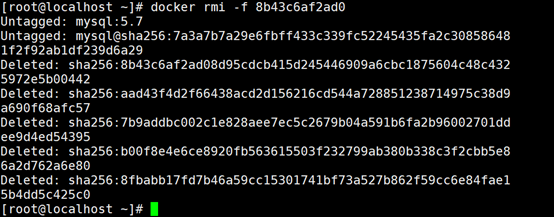

##### 4.2、删除多个镜像

```
docker rmi -f 镜像id 镜像id 镜像id 镜像id
```

##### 4.3、删除全部镜像

```
docker rmi -f $(docker images -aq)
```

 


### (三)、容器操作

#### 1、下载镜像(有镜像才能生成容器)

docker pull centos


#### 2、容器命令总结

```shell
docker run 镜像id 新建容器并启动
docker ps 				 # 列出所有运行的容器 
docker container list
docker rm 容器id 			# 删除指定容器
docker start 容器id 		# 启动容器
docker restart 容器id 	# 重启容器
docker stop 容器id 		# 停止当前正在运行的容器
docker kill 容器id 		# 强制停止当前容器
```

#### 3、新建容器并启动

```shell
docker run [参数] image
```

参数:

```shell
--name=”new Name”    	# 给容器起一个名字
--d                     # 后台方式运行
--it                    # 交互方式运行
--p                     # 制定容器端口
-p ip:主机端口:容器端口    # 容器端口和主机端口映射
-p    主机端口:容器端口
-p    容器端口
--P                     # 随机制定端口
```

```
docker run –it centos /bin/bash
```


#### 4、容器返回主机

```
exit        # 结束容器运行并返回主机
```

 

```
ctrl+p+q    # 退出不停止容器
```

#### 6、查看容器

##### 6.1查看正在运行的容器

```
docker ps
```

 

##### 6.2、查看运行过的容器

```
docker ps -a
```

 

#### 7、启动&停止&强制停止

##### 7.1、启动容器

```
docker start 容器id
```

 

##### 7.2、停止容器

```
docker stop 容器id
```

 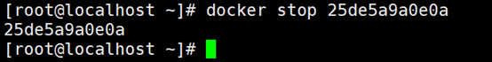

##### 7.3、强制停止

```
docker kill 容器id
```

 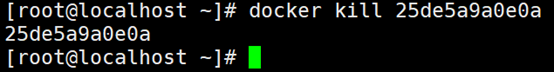

#### 5、删除容器

##### 5.1、删除指定容器,不能删除运行中的容器

```
docker rm 容器id
```


##### 5.2、删除所有容器

```
docker rm -f $(docker ps -aq)
```

或

```
docker ps -a -qlxargs docker rm
```

 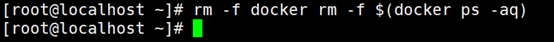

### (四)、其他命令

#### 1、用后台方式启动容器

```
docker run -d centos
docker 容器使用后台运行，就必须要有一个前台进程， docker 发现没有应用，就会自动停止
```

#### 2、查看日志

##### 2.1、首先使用后台启动启动一个容器

```
docker run -d centos /bin/sh -c "while true;do echo 6666;sleep 1;done"
```

 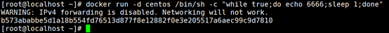

##### 2.2、查看容器日志信息

```
docker logs -tf --tail 查看多少条 容器id
```

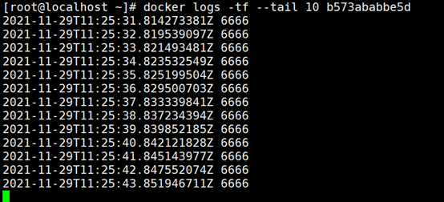

#### 3、查看容器中进程的信息

```
docker top 容器id
```

 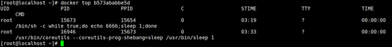

#### 4、查看镜像元数据

```
docker inspect 容器id
```

 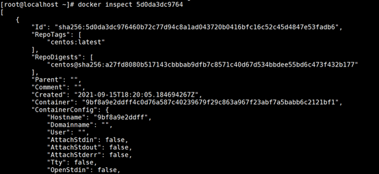

#### 5、进入后台容器(方式一)

```
docker exec -it 容器id /bin/bash
```

 

#### 6、进入后台容器(方式二)

```
docker attach 容器id
```

 

#### 7、2种进入后台命令的区别

```shell
exec        # 开启一个新的终端,可以在里面操作exit不终止容器
attach      # 进入容器正在执行的终端,exit退出终止容器
```

#### 8、从容器中拷贝到主机

##### 8.1、进入容器并创建文件

```
docker run –it –name=”cpTest” centos /bin/bash
```

 

##### 8.2、退出容器不要终止

```
ctrl+p+q
```

 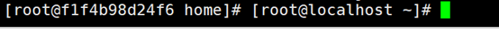

##### 8.3、开始复制

```
docker cp 容器id:容器文件位置 复制到本地的目录
```

 

## 四、安装服务

### (一)、安装nginx

#### 1、搜索镜像

```
docker search nginx
```

 

#### 2、拉取镜像

```
docker pull nginx
```

 

#### 3、创建容器

```
docker run –it 名字 映射本地端口为3344容器中端口为80 使用nginx镜像
docker run –it –name=”one nginx test” –p 3344:80 nginx
```

 

#### 4、测试

 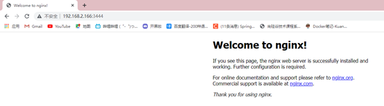

### (二)、安装tomcat

#### 1、搜索镜像

```
docker search tomcat
```

 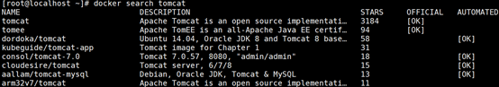

#### 2、安装tomcat

```
docker pull tomcat:9.0
```

#### 3、创建tomcat容器

```
docker run -d --name onTomcat -p3999:80 tomcat
```

#### 4、进入容器

```
docker exec -it onTomcat /bin/bash
```

#### 5、复制tomcat模板到主目录

```
cp webapps.dist/* webapps
```

#### 6、访问

 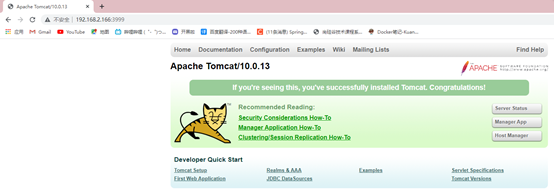

### (三)、Docker可视化

#### 1、安装

```
docker run -d -p 8080:9000 \
--restart=always -v /var/run/docker.sock:/var/run/docker.sock --privileged=true portainer/portainer
```

 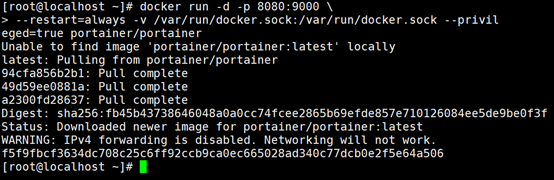

#### 2、测试

 

## 五、打包镜像

### (一)、命令

```
docker commit 提交容器为一个镜像
docker commit –m=”描述信息” –a=”作者” 容器id  目标镜像名:版本
```

### (二)、打包镜像说明

```
一开始的tomcat的webapp下没有东西,webapp的东西在webapp.dict中,我们创建一个官方的tomcat容器,进去把webapp.dict的内容复制一份到webapp中,并打包成为自己的tomcat
```

### (三)、开始打包

#### 1、使用tomcat进入容器

```
docker run -it --name oneTomcat -p 3666:8080 tomcat /bin/bash
```

 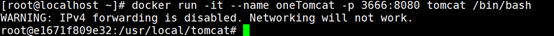

#### 2、复制webapp.dict的文件到webapp中

 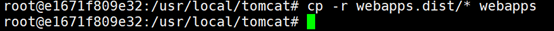

#### 3、退出但不终止容器

```
ctrl+p+q
```

#### 4、打包镜像

```
docker commit -m="my one image" -a="ma" e1671f809e32 onetomcatimage:1.0
```

 

## 六、容器数据卷

### (一)、什么是容器卷

当我们使用容器的时候在容器中创建文件,如果不小心删除了容器就没有了,这时候就需要存储到本地,这就用到了容器卷,使容器中的文件和本地文件相对应

即使容器停止或删除,本地文件还是有的

### (二)、使用数据卷命令

```
docker run -it -v 主机目录:容器内目录
```

### (三)、使用Centos容器做例子

#### 1、使Centos容器中的/home目录和本地的/home/ceshi绑定

```
docker run -it -v /home/ceshi:/home centos /bin/bash
```

 

#### 2、在Centos的/home中创建文件

 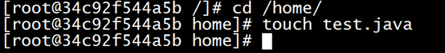

#### 3、退出查看本地的/home/ceshi文件

 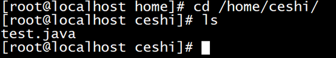

### (四)、使用Mysql做例子

#### 1、下载mysql&开启容器&文件绑定

```
docker run -it -p 3344:3306 -v /home/mysql/conf:/etc/mysql/my.conf -v /home/mysql/data:/var/lib/mysql  -e  MYSQL
```

 

#### 2、查看容器中/var/lib/mysql并查看目录

 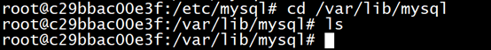

#### 3、创建文件

 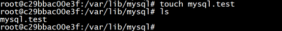

#### 4、退出容器查看本地文件

 

### (五)、具名和匿名挂载

#### 1、匿名挂载

```
docker run -d -P --name nginx01 -v /etc/nginx nginx
```

 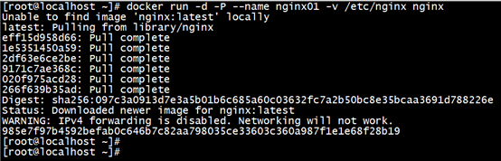

#### 2、查看匿名挂载

 

#### 3、具名挂载

```
docker run -d -P --name nginx02 -v juming-nginx:/etc/nginx nginx
```

#### 4、查看具名挂载

 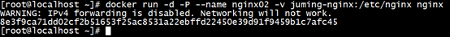

#### 5、说明

匿名挂载:volume没有名字,会生成一个uuid作为卷的名字

具名挂载:volume规定了名字,但没有指定本机的目录,默认是在/var/lib/docker/volume下

 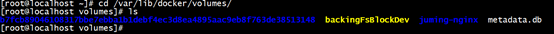

#### 6、分类

```shell
-v 容器内路径          # 匿名挂载
-v 名字:容器内路径      # 具名挂载
-v 本地路径:容器内路径 	# 指定路径挂载
```

### (六)、卷权限设置

```shell
ro readonly    # 只读
rw readwrite   # 可读可写
docker run –d –P –name nginx01 –v name:/etc/nginx:ro nginx
docker run –d –P –name nginx01 –v name:/etc/nginx:rw nginx
```

ro权限:

   当卷设置了ro权限,只能通过本地主机修改文件,容器内对文件无法操作

### (七)、数据卷容器(容器数据同步)

#### 1、首先创建一个用来同步卷的容器

```
docker run -it --name centos01 centos -v /volume1 /bin/bash
```

 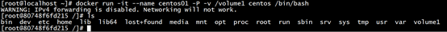

#### 2、退出不终止

#### 3、创建另一个容器实现同步机制

使用参数 --volumes-from 同步卷的容器

 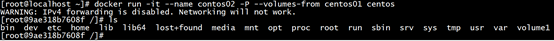

#### 4、进入volume1文件夹创建文件

 

#### 5、退出不终止,进入centos1

 

## 七、DockerFile(创建自己的镜像)

### (一)、介绍

dockerFile是用来构建docker镜像的的文件,命令参数脚本!

### (二)、构建步骤

1、编写一个dockerfile文件

2、docker build构建一个镜像

3、docker run运行一个镜像

4、docker push发布镜像(dockerhub或阿里云仓库)

### (三)、dockerfile的规则

1、每个关键字必须 大写

2、执行从上到下

3、#表示注释

### (四)、dockerfile常用命令

```shell
FROM       		# 基础镜像，一切从这里开始构建
MAINTAINER    	# 镜像是谁写的， 姓名+邮箱
RUN     		# 镜像构建的时候需要运行的命令
ADD     		# 步骤，tomcat镜像，这个tomcat压缩包！添加内容 添加同目录
WORKDIR    		# 镜像的工作目录
VOLUME     		# 挂载的目录
EXPOSE     		# 保留端口配置
CMD     		# 指定这个容器启动的时候要运行的命令，只有最后一个会生效，可被替代。
ENTRYPOINT    	# 指定这个容器启动的时候要运行的命令，可以追加命令
ONBUILD    		# 当构建一个被继承 DockerFile 这个时候就会运行ONBUILD的指令，触发指令。
COPY       		# 类似ADD，将我们文件拷贝到镜像中
ENV     		# 构建的时候设置环境变量！
```

### (五)、创建自己的dockerfile

#### 1、在/home下创建一个dockerfile文件夹储存dockerfile文件

 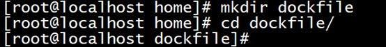

#### 2、编写dockerfile文件

 

```shell
FROM centos      					# 使用centos作为基础环境
MAINTAINER ma<2992455524@qq.com>    # 作者<邮箱>
ENV MYPATH /usr/local   			# 环境变量
WORKDIR $MYPATH    					# 刚进去的工作目录为/usr/local
RUN yum -y install vim  			# 中间执行的命令
RUN yum -y install bind     		# 下载dns服务
EXPOSE 80        					# 暴露端口为80端口
CMD echo $MYPATH    				# 输出$MYPATH环境变量
CMD /bin/bash      					# 以bash的方式运行
```


#### 3、构建这个镜像

```
docker build –f dockerfile文件名 –t 镜像名:版本号
docker build-f dockerfile1 –t mycentos:1.0 . (不要忘了后面还有一个.)
```

 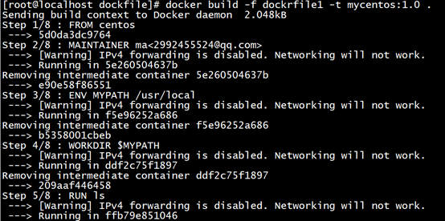

 

#### 4、使用镜像

```
docker run –it mycentos:1.0 /bin/bash
```

 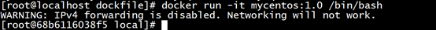

### (六)、制作tomcat镜像

#### 1、准备jdk和tomcat压缩包

 

#### 2、编写dockerfile文件

```shell
FROM centos
MAINTAINER ma<2992455524@qq.com>
ADD java-11-openjdk-11.0.11.9-1.windows.redhat.x86_64.zip /usr/local/
ADD apache-tomcat-8.0.50-windows-x64.zip /usr/local/
ENV MYPATH /usr/local
WORKDIR $MYPATH
ENV JAVA_HOME /usr/local/java-11-openjdk-11.0.11.9-1.windows.redhat.x86_64
ENV CATALINA_HOME /usr/local/apache-tomcat-8.0.50-windows-x64
ENV PATH $PATH:$JAVA_HOME/bin:$CATALINA_HOME/lib
EXPOSE 8080
CMD /usr/local/apache-tomcat-8.0.50-windows-x64/bin/startup.sh && /usr/local/apache-tomcat-8.0.50-windows-x64/logs/catalina.out
```

