# 一、Docker概述

## (一)、Docker为什么出现？

1、一款产品： 开发–上线 两套环境！应用环境，应用配置！

2、开发 — 运维。 问题：我在我的电脑上可以允许！版本更新，导致服务不可用！对于运维来说考验十分大？

3、环境配置是十分的麻烦，每一个机器都要部署环境(集群Redis、ES、Hadoop…) !费事费力。

4、发布一个项目( jar + (Redis MySQL JDK ES) )，项目能不能带上环境安装打包！

5、之前在服务器配置一个应用的环境 Redis、MySQL、JDK、ES、Hadoop 配置超麻烦了，不能够跨平台。开发环境Windows，最后发布到Linux！

6、传统：开发jar，运维来做！

6、现在：开发打包部署上线，一套流程做完！

7、安卓流程：java — apk —发布（应用商店）—- 张三使用apk一安装即可用！

8、docker流程： java-jar（环境） — 打包项目带上环境（镜像） — ( Docker仓库：商店）——-下载我们发布的镜像 —- 直接运行即可！

8、Docker给以上的问题，提出了解决方案！

9、Docker的思想就来自于集装箱！

10、JRE – 多个应用(端口冲突) – 原来都是交叉的！

11、隔离：Docker核心思想！打包装箱！每个箱子是互相隔离的。

12、Docker通过隔离机制，可以将服务器利用到极致！

13、本质：所有的技术都是因为出现了一些问题，我们需要去解决，才去学习！

## (二)、Dcoker的历史

1、2010年，几个搞IT的年轻人，就在美国成立了一家公司 dotcloud

2、做一些 pass 的云计算服务！LXC（Linux Container容器）有关的容器技术！

3、Linux Container容器是一种内核虚拟化技术，可以提供轻量级的虚拟化，以便隔离进程和资源。

4、他们将自己的技术（容器化技术）命名就是 Docker。

4、Docker刚刚延生的时候，没有引起行业的注意！dotCloud，就活不下去！ 

5、2013年，Docker开源！

6、越来越多的人发现docker的优点！火了。Docker每个月都会更新一个版本！

7、2014年4月9日，Docker1.0发布！

## (三)、**docker**为什么这么火？

1、在容器技术出来之前，我们都是使用虚拟机技术！

2、虚拟机：在window中装一个VMware，通过这个软件我们可以虚拟出来一台或者多台电脑！笨重！

3、虚拟机也属于虚拟化技术，Docker容器技术，也是一种虚拟化技术！

4、vm : linux centos 原生镜像（一个电脑！） 隔离、需要开启多个虚拟机！ 几个G 几分钟

5、docker: 隔离，镜像（最核心的环境 4m + jdk + mysql）十分的小巧，运行镜像就可以了！小巧！
 几个M 秒级启动！

6、Docker基于Go语言开发的！开源项目！

7、docker官网：https://www.docker.com/

8、文档：https://docs.docker.com/ Docker的文档是超级详细的！

9、仓库：https://hub.docker.com/ 相当于 github

## (四)、Docker能做什么？

比较Docker和虚拟机技术的不同：

1、传统虚拟机,虚拟出一条硬件，运行一个完整的操作系统，然后在这个系统上安装和运行软件

容器内的应用直接运行在宿主机的内容，容器是没有自己的内核的，也没有虚拟我们的硬件，所以
 2、就轻便了,每个容器间是互相隔离，每个容器内都有一个属于自己的文件系统，互不影响

## (五)、Docker的基本组成

- 镜像（image)：

docker镜像就好比是一个目标，可以通过这个目标来创建容器服务，tomcat镜像==>run==>容器（提供服务器），通过这个镜像可以创建多个容器（最终服务运行或者项目运行就是在容器中的）。

- 容器(container)：

Docker利用容器技术，独立运行一个或者一组应用，通过镜像来创建的.

启动，停止，删除，基本命令

目前就可以把这个容器理解为就是一个简易的 Linux系统。

- 仓库(repository)：

仓库就是存放镜像的地方！

仓库分为公有仓库和私有仓库。(很类似git)

Docker Hub是国外的。

阿里云…都有容器服务器(配置镜像加速!)

# 二、安装

## (一)、Linux的内核3.10以上


## (二)、清除杂的环境

```shell
  yum remove docker \
    docker-client \
    docker-client-latest \
    docker-common \
    docker-latest \
    docker-latest-logrotate \
    docker-logrotate \
    docker-engine
```


## (三)、虚拟机联网安装应用

```
yum install -y yum-utils
```

 

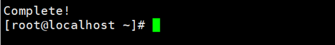、

## (四)、设置镜像仓库  

```shell
yum-config-manager \
    --add-repo \
    https://mirrors.aliyun.com/docker-ce/linux/centos/docker-ce.repo
```

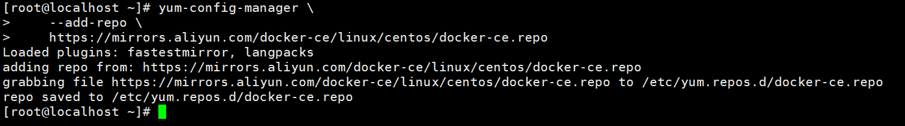

## (五)、更新yum包索引

```
yum makecache fast
```


## (六)、安装doker-ce(社区办) dockerEE是企业版

```
yum -y install wget
cd /etc/yum.repos.d/
wget http://mirrors.aliyun.com/repo/epel-7.repo
wget http://mirrors.163.com/.help/CentOS7-Base-163.repo
yum clean all
yum makecache
yum -y install lrzsz net-tools
yum -y install docker-ce docker-ce-cli containerd.io
```

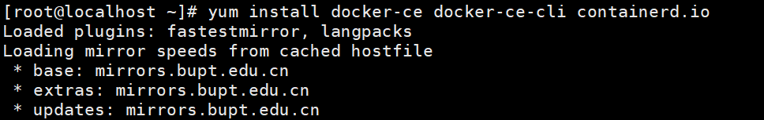

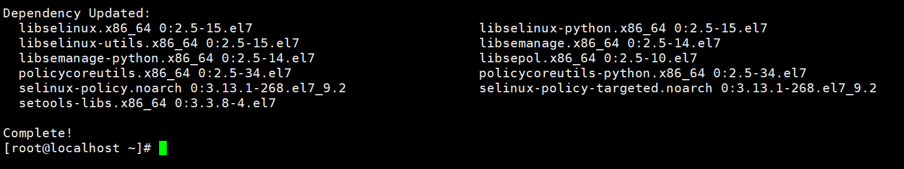

## (七)、启动docker

```
systemctl start docker
```

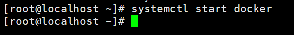

## (八)、查看docker版本

```
docker version
```

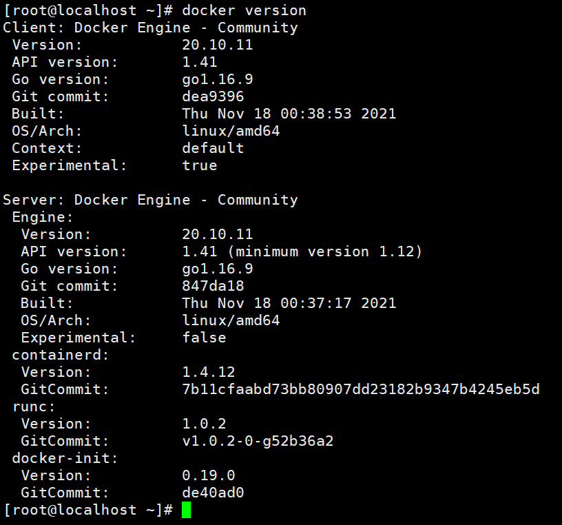

## (八)、测试

```shell
docker run hello-world
```


## (九)、查看镜像

```
docker images
```


## (十)、阿里云镜像加速器

[容器镜像服务 (aliyun.com)](https://cr.console.aliyun.com/cn-hangzhou/instances/mirrors)

```shell
[root@localhost ~]# mkdir -p /etc/docker
[root@localhost ~]# tee /etc/docker/daemon.json <<-'EOF'
{
  "registry-mirrors": ["https://ft4pbe4b.mirror.aliyuncs.com"]
}
EOF
[root@localhost ~]# systemctl daemon-reload
[root@localhost ~]# systemctl restart docker
```

# 三、卸载Docker

## (一)、命令

```
yum remove docker-ce docker-ce-cli containerd.io
rm -rf /var/lib/docker
rm -rf /var/lib/containerd
```

# 四、常用命令

## (一)、帮助命令

```shell
systemctl enable docker 	# 开机自启
systemctl stop docker		# 停止docker
systemctl start docker		# 启动docker
systemctl restart docker	# 重启docker
docker verson   	  		# 显示docker的版本信息
docker info           		# 显示docker的系统信息,包括镜像和容器数量
docker 命令 –help 	 	   # 帮助命令
```

## (二)、镜像命令

### 1、查看本机所有镜像

```shell
# 查看所有镜像
docker images 	 # 参数
-a     			 # 列出所有的镜像
-q 		    	 # 只显示镜像的id
# 注释
REPOSITORY 		 TAG		image ID 	CREATED			SIZE
镜像的仓库源		镜像的标签	  镜像的ID	  镜像的创建时间	  镜像的大小
```

 

### 2、搜索镜像

```shell
docker search  			  # 搜索的镜像名
# 参数
--filter=选项名=什么  
例:--filter=stars=3000    # 搜索出来镜像大于3000的
--limit 5     			  #	筛选出前五个，默认25个
```

 

### 3、下载镜像 

```shell
docker pull 镜像名(默认最新版)
docker pull mysql:5.7			# 指定版本下载
```

### 4、删除镜像

```shell
docker rmi –f 镜像id					    # 删除单个镜像
docker rmi -f 镜像id 镜像id 镜像id 镜像id	# 删除多个镜像
docker rmi -f $(docker images -aq)		 # 删除全部镜像 
```

### 5、查看占用多少空间

```shell
docker system df
```

## (三)、容器命令

### 1、下载镜像

```shell
docker pull centos				# 拉取centos镜像
```

### 2、容器命令总结

```shell
docker run 镜像id 新建容器并启动
docker ps 				 		 # 列出所有运行的容器 
docker container list
docker rm 容器id 					# 删除指定容器
docker start 容器id 				# 启动容器
docker restart 容器id 			# 重启容器
docker stop 容器id 				# 停止当前正在运行的容器
docker kill 容器id 				# 强制停止当前容器
```

### 3、新建容器并启动

```shell
docker run [参数] 镜像名称
# 参数
--name=”new Name”    		# 给容器起一个名字
-d                     		# 后台方式运行
--it                   	 	# 交互方式运行
-p    ip:主机端口:容器端口     # 容器端口和主机端口映射

docker run –it -p 5000:5000 --name mycentos centos /bin/bash		# 启动centos容器,名字为mycentos，端口号为5000，以命令行的方式启动
```

### 4、容器返回主机

```shell
exit        # 结束容器运行并返回主机
ctrl+p+q    # 退出不停止容器
```

### 5、查看容器

```shell
docker ps			# 查看正在运行的容器
docker ps -a		# 查看全部容器
```

### 6、启动&停止&强制停止

```shell
docker start 容器id		# 启动容器
docker stop  容器id		# 停止容器
docker kill  容器id		# 强制停止容器
```

### 7、删除容器

```shell
docker rm 容器id					   # 删除容器
docker rm -f 容器id				   # 强制删除容器
docker rm -f $(docker ps -aq)		# 删除全部容器
或者
docker ps -a -qlxargs docker rm		# 删除全部容器
```

## (四)、其他命令

### 1、用后台方式启动容器

```shell
docker run -d centos
docker 容器使用后台运行，就必须要有一个前台进程， docker 发现没有应用，就会自动停止
```

### 2、查看日志

```shell
docker run -d centos /bin/sh 			# 创建一个容器
docker logs -tf --tail 查看多少条 容器id
```

### 3、查看容器中进程的信息

```shell
docker top 容器id
```

 

### 4、查看镜像元数据

```shell
docker inspect 容器id
```

 

### 5、进入后台容器(方式一)

```shell
docker exec -it 容器id /bin/bash
```

 

### 6、进入后台容器(方式二)

```shell
docker attach 容器id
```

 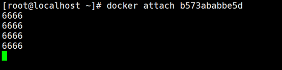

### 7、2种进入后台命令的区别

```shell
exec        # 开启一个新的终端,可以在里面操作exit不终止容器
attach      # 进入容器正在执行的终端,exit退出终止容器
```

### 8、复制容器中的文件

```shell
docker run –it –name=”cpTest” centos /bin/bash		  # 创建文件
ctrl+p+q											  # 退出
docker cp 容器id:容器文件位置 复制到本地的目录				# 复制文件
```

 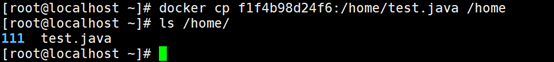

### 9、复制整个容器

```shell
docker run -it centos:7 /bin/bash		# 创建容器
vi aaa.txt								# 在容器里创建文件并输入内容
ctrl+pq 								# 退出容器
docker export 容器id > 新的镜像名		    # 打包

然后用新的镜像启动容器，发现文件还在
```

## (五)、命令总结

```shell
attach    Attach to a running container                 # 当前 shell 下 attach 连接指定运行镜像
build     Build an image from a Dockerfile              # 通过 Dockerfile 定制镜像
commit    Create a new image from a container changes   # 提交当前容器为新的镜像
cp        Copy files/folders from the containers filesystem to the host path   #从容器中拷贝指定文件或者目录到宿主机中
create    Create a new container                        # 创建一个新的容器，同 run，但不启动容器
diff      Inspect changes on a container's filesystem   # 查看 docker 容器变化
events    Get real time events from the server          # 从 docker 服务获取容器实时事件
exec      Run a command in an existing container        # 在已存在的容器上运行命令
export    Stream the contents of a container as a tar archive   # 导出容器的内容流作为一个 tar 归档文件[对应 import ]
history   Show the history of an image                  # 展示一个镜像形成历史
images    List images                                   # 列出系统当前镜像
import    Create a new filesystem image from the contents of a tarball # 从tar包中的内容创建一个新的文件系统映像[对应export]
info      Display system-wide information               # 显示系统相关信息
inspect   Return low-level information on a container   # 查看容器详细信息
kill      Kill a running container                      # kill 指定 docker 容器
load      Load an image from a tar archive              # 从一个 tar 包中加载一个镜像[对应 save]
login     Register or Login to the docker registry server    # 注册或者登陆一个 docker 源服务器
logout    Log out from a Docker registry server         # 从当前 Docker registry 退出
logs      Fetch the logs of a container                 # 输出当前容器日志信息
port      Lookup the public-facing port which is NAT-ed to PRIVATE_PORT    # 查看映射端口对应的容器内部源端口
pause     Pause all processes within a container        # 暂停容器
ps        List containers                               # 列出容器列表
pull      Pull an image or a repository from the docker registry server   # 从docker镜像源服务器拉取指定镜像或者库镜像
push      Push an image or a repository to the docker registry server    # 推送指定镜像或者库镜像至docker源服务器
restart   Restart a running container                   # 重启运行的容器
rm        Remove one or more containers                 # 移除一个或者多个容器
rmi       Remove one or more images       # 移除一个或多个镜像[无容器使用该镜像才可删除，否则需删除相关容器才可继续或 -f 强制删除]
run       Run a command in a new container              # 创建一个新的容器并运行一个命令
save      Save an image to a tar archive                # 保存一个镜像为一个 tar 包[对应 load]
search    Search for an image on the Docker Hub         # 在 docker hub 中搜索镜像
start     Start a stopped containers                    # 启动容器
stop      Stop a running containers                     # 停止容器
tag       Tag an image into a repository                # 给源中镜像打标签
top       Lookup the running processes of a container   # 查看容器中运行的进程信息
unpause   Unpause a paused container                    # 取消暂停容器
version   Show the docker version information           # 查看 docker 版本号
wait      Block until a container stops, then print its exit code   # 截取容器停止时的退出状态值
```

# 五、打包镜像

## (一)、命令

```
docker commit 提交容器为一个镜像
docker commit –m=”描述信息” –a=”作者” 容器id  目标镜像名:版本
```

## (二)、打包镜像说明

```
一开始的tomcat的webapp下没有东西,webapp的东西在webapp.dict中,我们创建一个官方的tomcat容器,进去把webapp.dict的内容复制一份到webapp中,并打包成为自己的tomcat
```

## (三)、开始打包

### 1、使用tomcat进入容器

```
docker run -it --name oneTomcat -p 3666:8080 tomcat /bin/bash
```

 

### 2、复制webapp.dict的文件到webapp中

 

### 3、退出但不终止容器

```
ctrl+p+q
```

### 4、打包镜像

```
docker commit -m="my one image" -a="ma" e1671f809e32 onetomcatimage:1.0
```

 

# 六、配置阿里云镜像仓库

## 1、开启阿里云容器镜像服务

阿里云官网：https://www.aliyun.com/?spm=5176.8351553.top-nav.dlogo.10151991PxPczZ


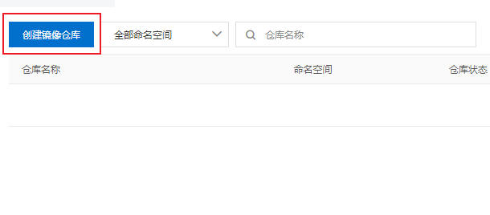


## 2、docker登录到阿里云

2.1、先创建ubantu容器

```shell
docker run -it ubuntu /bin/bash   	# 创建容器
apt-get update						# 更新apt
apt-get -y install vim				# 安装vim
ctrl+pq								# 切到虚拟机
docker ps 							# 查看容器id
docker commit -m="ubuntuStudy" -a="majaisheng" 792e9ca47631 ubuntustudy:01		# 打包镜像
docker login --username=aliyun2921689160 registry.cn-hangzhou.aliyuncs.com/dockerstudytest/dockerimagestudy		
# username自己的账户
# 后面为公网地址
Password: 第一次登录设置密码	
docker tag 打包的镜像id registry.cn-hangzhou.aliyuncs.com/dockerstudytest/dockerimagestudy:版本号		# 打包
docker push registry.cn-hangzhou.aliyuncs.com/dockerstudytest/dockerimagestudy:版本号				   # 上传
docker pull registry.cn-hangzhou.aliyuncs.com/dockerstudytest/dockerimagestudy:[镜像版本号]			  # 拉取
```

# 七、将本地镜像推送到私有库

## (一)、命令

```shell
[root@localhost ~]# docker pull registry							# 拉取私有库
[root@localhost ~]# docker images									# 查看镜像
REPOSITORY   TAG       IMAGE ID       CREATED         SIZE
registry     latest    b8604a3fe854   18 months ago   26.2MB
docker run -d -p 5000:5000 -v /zzyyuse/myregistry/:/tmp/registry --privileged=true registry # 运行私有库，端口为5000
[root@localhost ~]# docker run -it ubuntu /bin/bash					# 运行一个ubuntu
root@5e7ac870fb62:/# apt-get update									# 更新软件包
root@5e7ac870fb62:/# apt-get install net-tools						# 安装网卡服务
root@5e7ac870fb62:/# ifconfig 										# 可以使用了
[root@localhost ~]# curl -XGET http://192.168.1.111:5000/v2/_catalog	# 查看私有库
{"repositories":[]}			# 什么都没有
[root@localhost ~]# docker commit -m="ubuntuStudy" -a="majaisheng" 5e7ac870fb62 ubuntustudy:01	# 将容器打包成镜像
[root@localhost ~]# docker tag  ubuntustudy:01  192.168.1.111:5000/ubuntuStudy:0.1				# 打标签
[root@localhost ~]# vim /etc/docker/daemon.json 					# 修改远程源
{
  "registry-mirrors": ["https://ft4pbe4b.mirror.aliyuncs.com"]
  "insecure-registries": ["192.168.1.111:5000"]"
}
[root@localhost ~]# systemctl restart docker 	# 重启docker更新配置
[root@localhost ~]# docker push 192.168.1.111:5000/ubuntustudy:0.1		#上传镜像
The push refers to repository [192.168.1.111:5000/ubuntustudy]
6dc141c8b644: Pushing [======================>                            ]  19.72MB/44.01MB
6dc141c8b644: Pushed 
9f54eef41275: Pushed 
0.1: digest: sha256:405fa7ce5c91c36654d4cea905c2e695bd321cee08d8dc129192d29cecae3b98 size: 741

[root@localhost ~]# curl -XGET http://192.168.1.111:5000/v2/_catalog		# 查看镜像
{"repositories":["ubuntustudy"]}	# 发现多了一个
```

# 八、容器数据卷

## (一)、什么是容器卷

当我们使用容器的时候在容器中创建文件,如果不小心删除了容器就没有了,这时候就需要存储到本地,这就用到了容器卷,使容器中的文件和本地文件相对应

即使容器停止或删除,本地文件还是有的

## (二)、使用数据卷命令

```shell
docker run -it -v 主机目录:容器内目录 镜像名
```

## (三)、使用Centos容器做例子

### 1、使Centos容器中的/home目录和本地的/home/ceshi绑定

```shell
docker run -it -v /home/ceshi:/home centos /bin/bash
docker run -it -v /home/ceshi:/home:rw centos /bin/bash		# 可读可写（默认）
docker run -it -v /home/ceshi:/home:ro centos /bin/bash		# 只读
docker run -it --volumes-from 父容器名称 --name c2 centos
创建发发现/home如果没有测试这个文件会自动创建
```

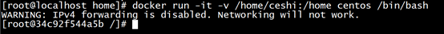

### 2、在Centos的/home中创建文件


### 3、退出查看本地的/home/ceshi文件


## (四)、使用Mysql做例子

### 1、下载mysql&开启容器&文件绑定

```
docker run -it -p 3344:3306 -v /home/mysql/conf:/etc/mysql/my.conf -v /home/mysql/data:/var/lib/mysql MYSQL
```

、																 

### 2、查看容器中/var/lib/mysql并查看目录


### 3、创建文件

​	

、 																 

### 4、退出容器查看本地文件


## (五)、具名和匿名挂载

### 1、说明

匿名挂载:volume没有名字,会生成一个uuid作为卷的名字

具名挂载:volume规定了名字,但没有指定本机的目录,默认是在/var/lib/docker/volume下

### 2、挂载命令

```shell
docker run -d -P --name nginx01 -v /etc/nginx nginx					# 匿名挂载
docker run -d -P --name nginx02 -v juming-nginx:/etc/nginx nginx	# 具名挂载
docker volume ls												 	# 查看挂载

-v 容器内路径          # 匿名挂载
-v 名字:容器内路径      # 具名挂载
-v 本地路径:容器内路径 	# 指定路径挂载
```

# 九、安装服务

## (一)、总体步骤

1、搜索镜像

2、拉取镜像

3、查看镜像

4、启动容器

5、停止容器

6、移除容器

## (二)、安装tomcat

```shell
[root@localhost ~]# docker run -it -d --name mytomcat -p 8080:8080 tomcat	# 启动tomcat，名字为mytomcat，端口8080
本机访问http://192.168.1.111:8080/发现404
因为新版的tomcat将webapp下的文件移除放到了webapp.dist中
[root@localhost ~]# docker exec -it mytomcat /bin/bash		# 进入tomcat容器
root@e0d6b5420531:/usr/local/tomcat# mv webapps.dist/* webapps	# 将webapp.dist中的文件移动到webapp
ctrl+pq
重启tomcat
再次访问
访问成功
```


## (三)、安装mysql

```shell
[root@localhost ~]# docker run -d -p 3306:3306 -v /tmp/mysql/log:/var/mysql -v /tmp/mysql/data:/var/lib/mysql -v /tmp/mysql/conf:/etc/mysql/conf.d -e MYSQL_ROOT_PASSWORD=123456 --name mysql mysql:5.7	  # 启动mysql容器，端口3306，日志映射，数据映射，配置文件映射
[root@localhost ~]# vim /tmp/mysql/conf/my.cnf		# 修改mysql配置文件
[client]
default_character_set=utf8
[mysqld]
collation_server = utf8_general_ci
character_set_server = utf8

[root@localhost ~]# docker restart mysql			# 重启mysql
```

## (四)、安装redis

### 1、redis默认配置文件内容

```
# Redis configuration file example.

#

# Note that in order to read the configuration file, Redis must be

# started with the file path as first argument:

#

# ./redis-server /path/to/redis.conf

 

# Note on units: when memory size is needed, it is possible to specify

# it in the usual form of 1k 5GB 4M and so forth:

#

# 1k => 1000 bytes

# 1kb => 1024 bytes

# 1m => 1000000 bytes

# 1mb => 1024*1024 bytes

# 1g => 1000000000 bytes

# 1gb => 1024*1024*1024 bytes

#

# units are case insensitive so 1GB 1Gb 1gB are all the same.

 

################################## INCLUDES ###################################

 

# Include one or more other config files here.  This is useful if you

# have a standard template that goes to all Redis servers but also need

# to customize a few per-server settings.  Include files can include

# other files, so use this wisely.

#

# Notice option "include" won't be rewritten by command "CONFIG REWRITE"

# from admin or Redis Sentinel. Since Redis always uses the last processed

# line as value of a configuration directive, you'd better put includes

# at the beginning of this file to avoid overwriting config change at runtime.

#

# If instead you are interested in using includes to override configuration

# options, it is better to use include as the last line.

#

# include /path/to/local.conf

# include /path/to/other.conf

 

################################## MODULES #####################################

 

# Load modules at startup. If the server is not able to load modules

# it will abort. It is possible to use multiple loadmodule directives.

#

# loadmodule /path/to/my_module.so

# loadmodule /path/to/other_module.so

 

################################## NETWORK #####################################

 

# By default, if no "bind" configuration directive is specified, Redis listens

# for connections from all the network interfaces available on the server.

# It is possible to listen to just one or multiple selected interfaces using

# the "bind" configuration directive, followed by one or more IP addresses.

#

# Examples:

#

# bind 192.168.1.100 10.0.0.1

# bind 127.0.0.1 ::1

#

# ~~~ WARNING ~~~ If the computer running Redis is directly exposed to the

# internet, binding to all the interfaces is dangerous and will expose the

# instance to everybody on the internet. So by default we uncomment the

# following bind directive, that will force Redis to listen only into

# the IPv4 loopback interface address (this means Redis will be able to

# accept connections only from clients running into the same computer it

# is running).

#

# IF YOU ARE SURE YOU WANT YOUR INSTANCE TO LISTEN TO ALL THE INTERFACES

# JUST COMMENT THE FOLLOWING LINE.

# ~~~~~~~~~~~~~~~~~~~~~~~~~~~~~~~~~~~~~~~~~~~~~~~~~~~~~~~~~~~~~~~~~~~~~~~~

#bind 127.0.0.1

 

# Protected mode is a layer of security protection, in order to avoid that

# Redis instances left open on the internet are accessed and exploited.

#

# When protected mode is on and if:

#

# 1) The server is not binding explicitly to a set of addresses using the

#    "bind" directive.

# 2) No password is configured.

#

# The server only accepts connections from clients connecting from the

# IPv4 and IPv6 loopback addresses 127.0.0.1 and ::1, and from Unix domain

# sockets.

#

# By default protected mode is enabled. You should disable it only if

# you are sure you want clients from other hosts to connect to Redis

# even if no authentication is configured, nor a specific set of interfaces

# are explicitly listed using the "bind" directive.

protected-mode no

 

# Accept connections on the specified port, default is 6379 (IANA #815344).

# If port 0 is specified Redis will not listen on a TCP socket.

port 6379

 

# TCP listen() backlog.

#

# In high requests-per-second environments you need an high backlog in order

# to avoid slow clients connections issues. Note that the Linux kernel

# will silently truncate it to the value of /proc/sys/net/core/somaxconn so

# make sure to raise both the value of somaxconn and tcp_max_syn_backlog

# in order to get the desired effect.

tcp-backlog 511

 

# Unix socket.

#

# Specify the path for the Unix socket that will be used to listen for

# incoming connections. There is no default, so Redis will not listen

# on a unix socket when not specified.

#

# unixsocket /tmp/redis.sock

# unixsocketperm 700

 

# Close the connection after a client is idle for N seconds (0 to disable)

timeout 0

 

# TCP keepalive.

#

# If non-zero, use SO_KEEPALIVE to send TCP ACKs to clients in absence

# of communication. This is useful for two reasons:

#

# 1) Detect dead peers.

# 2) Take the connection alive from the point of view of network

#    equipment in the middle.

#

# On Linux, the specified value (in seconds) is the period used to send ACKs.

# Note that to close the connection the double of the time is needed.

# On other kernels the period depends on the kernel configuration.

#

# A reasonable value for this option is 300 seconds, which is the new

# Redis default starting with Redis 3.2.1.

tcp-keepalive 300

 

################################# GENERAL #####################################

 

# By default Redis does not run as a daemon. Use 'yes' if you need it.

# Note that Redis will write a pid file in /var/run/redis.pid when daemonized.

daemonize no

 

# If you run Redis from upstart or systemd, Redis can interact with your

# supervision tree. Options:

#   supervised no      - no supervision interaction

#   supervised upstart - signal upstart by putting Redis into SIGSTOP mode

#   supervised systemd - signal systemd by writing READY=1 to $NOTIFY_SOCKET

#   supervised auto    - detect upstart or systemd method based on

#                        UPSTART_JOB or NOTIFY_SOCKET environment variables

# Note: these supervision methods only signal "process is ready."

#       They do not enable continuous liveness pings back to your supervisor.

supervised no

 

# If a pid file is specified, Redis writes it where specified at startup

# and removes it at exit.

#

# When the server runs non daemonized, no pid file is created if none is

# specified in the configuration. When the server is daemonized, the pid file

# is used even if not specified, defaulting to "/var/run/redis.pid".

#

# Creating a pid file is best effort: if Redis is not able to create it

# nothing bad happens, the server will start and run normally.

pidfile /var/run/redis_6379.pid

 

# Specify the server verbosity level.

# This can be one of:

# debug (a lot of information, useful for development/testing)

# verbose (many rarely useful info, but not a mess like the debug level)

# notice (moderately verbose, what you want in production probably)

# warning (only very important / critical messages are logged)

loglevel notice

 

# Specify the log file name. Also the empty string can be used to force

# Redis to log on the standard output. Note that if you use standard

# output for logging but daemonize, logs will be sent to /dev/null

logfile ""

 

# To enable logging to the system logger, just set 'syslog-enabled' to yes,

# and optionally update the other syslog parameters to suit your needs.

# syslog-enabled no

 

# Specify the syslog identity.

# syslog-ident redis

 

# Specify the syslog facility. Must be USER or between LOCAL0-LOCAL7.

# syslog-facility local0

 

# Set the number of databases. The default database is DB 0, you can select

# a different one on a per-connection basis using SELECT <dbid> where

# dbid is a number between 0 and 'databases'-1

databases 16

 

# By default Redis shows an ASCII art logo only when started to log to the

# standard output and if the standard output is a TTY. Basically this means

# that normally a logo is displayed only in interactive sessions.

#

# However it is possible to force the pre-4.0 behavior and always show a

# ASCII art logo in startup logs by setting the following option to yes.

always-show-logo yes

 

################################ SNAPSHOTTING  ################################

#

# Save the DB on disk:

#

#   save <seconds> <changes>

#

#   Will save the DB if both the given number of seconds and the given

#   number of write operations against the DB occurred.

#

#   In the example below the behaviour will be to save:

#   after 900 sec (15 min) if at least 1 key changed

#   after 300 sec (5 min) if at least 10 keys changed

#   after 60 sec if at least 10000 keys changed

#

#   Note: you can disable saving completely by commenting out all "save" lines.

#

#   It is also possible to remove all the previously configured save

#   points by adding a save directive with a single empty string argument

#   like in the following example:

#

#   save ""

 

save 900 1

save 300 10

save 60 10000

 

# By default Redis will stop accepting writes if RDB snapshots are enabled

# (at least one save point) and the latest background save failed.

# This will make the user aware (in a hard way) that data is not persisting

# on disk properly, otherwise chances are that no one will notice and some

# disaster will happen.

#

# If the background saving process will start working again Redis will

# automatically allow writes again.

#

# However if you have setup your proper monitoring of the Redis server

# and persistence, you may want to disable this feature so that Redis will

# continue to work as usual even if there are problems with disk,

# permissions, and so forth.

stop-writes-on-bgsave-error yes

 

# Compress string objects using LZF when dump .rdb databases?

# For default that's set to 'yes' as it's almost always a win.

# If you want to save some CPU in the saving child set it to 'no' but

# the dataset will likely be bigger if you have compressible values or keys.

rdbcompression yes

 

# Since version 5 of RDB a CRC64 checksum is placed at the end of the file.

# This makes the format more resistant to corruption but there is a performance

# hit to pay (around 10%) when saving and loading RDB files, so you can disable it

# for maximum performances.

#

# RDB files created with checksum disabled have a checksum of zero that will

# tell the loading code to skip the check.

rdbchecksum yes

 

# The filename where to dump the DB

dbfilename dump.rdb

 

# The working directory.

#

# The DB will be written inside this directory, with the filename specified

# above using the 'dbfilename' configuration directive.

#

# The Append Only File will also be created inside this directory.

#

# Note that you must specify a directory here, not a file name.

dir ./

 

################################# REPLICATION #################################

 

# Master-Replica replication. Use replicaof to make a Redis instance a copy of

# another Redis server. A few things to understand ASAP about Redis replication.

#

#   +------------------+      +---------------+

#   |      Master      | ---> |    Replica    |

#   | (receive writes) |      |  (exact copy) |

#   +------------------+      +---------------+

#

# 1) Redis replication is asynchronous, but you can configure a master to

#    stop accepting writes if it appears to be not connected with at least

#    a given number of replicas.

# 2) Redis replicas are able to perform a partial resynchronization with the

#    master if the replication link is lost for a relatively small amount of

#    time. You may want to configure the replication backlog size (see the next

#    sections of this file) with a sensible value depending on your needs.

# 3) Replication is automatic and does not need user intervention. After a

#    network partition replicas automatically try to reconnect to masters

#    and resynchronize with them.

#

# replicaof <masterip> <masterport>

 

# If the master is password protected (using the "requirepass" configuration

# directive below) it is possible to tell the replica to authenticate before

# starting the replication synchronization process, otherwise the master will

# refuse the replica request.

#

# masterauth <master-password>

 

# When a replica loses its connection with the master, or when the replication

# is still in progress, the replica can act in two different ways:

#

# 1) if replica-serve-stale-data is set to 'yes' (the default) the replica will

#    still reply to client requests, possibly with out of date data, or the

#    data set may just be empty if this is the first synchronization.

#

# 2) if replica-serve-stale-data is set to 'no' the replica will reply with

#    an error "SYNC with master in progress" to all the kind of commands

#    but to INFO, replicaOF, AUTH, PING, SHUTDOWN, REPLCONF, ROLE, CONFIG,

#    SUBSCRIBE, UNSUBSCRIBE, PSUBSCRIBE, PUNSUBSCRIBE, PUBLISH, PUBSUB,

#    COMMAND, POST, HOST: and LATENCY.

#

replica-serve-stale-data yes

 

# You can configure a replica instance to accept writes or not. Writing against

# a replica instance may be useful to store some ephemeral data (because data

# written on a replica will be easily deleted after resync with the master) but

# may also cause problems if clients are writing to it because of a

# misconfiguration.

#

# Since Redis 2.6 by default replicas are read-only.

#

# Note: read only replicas are not designed to be exposed to untrusted clients

# on the internet. It's just a protection layer against misuse of the instance.

# Still a read only replica exports by default all the administrative commands

# such as CONFIG, DEBUG, and so forth. To a limited extent you can improve

# security of read only replicas using 'rename-command' to shadow all the

# administrative / dangerous commands.

replica-read-only yes

 

# Replication SYNC strategy: disk or socket.

#

# -------------------------------------------------------

# WARNING: DISKLESS REPLICATION IS EXPERIMENTAL CURRENTLY

# -------------------------------------------------------

#

# New replicas and reconnecting replicas that are not able to continue the replication

# process just receiving differences, need to do what is called a "full

# synchronization". An RDB file is transmitted from the master to the replicas.

# The transmission can happen in two different ways:

#

# 1) Disk-backed: The Redis master creates a new process that writes the RDB

#                 file on disk. Later the file is transferred by the parent

#                 process to the replicas incrementally.

# 2) Diskless: The Redis master creates a new process that directly writes the

#              RDB file to replica sockets, without touching the disk at all.

#

# With disk-backed replication, while the RDB file is generated, more replicas

# can be queued and served with the RDB file as soon as the current child producing

# the RDB file finishes its work. With diskless replication instead once

# the transfer starts, new replicas arriving will be queued and a new transfer

# will start when the current one terminates.

#

# When diskless replication is used, the master waits a configurable amount of

# time (in seconds) before starting the transfer in the hope that multiple replicas

# will arrive and the transfer can be parallelized.

#

# With slow disks and fast (large bandwidth) networks, diskless replication

# works better.

repl-diskless-sync no

 

# When diskless replication is enabled, it is possible to configure the delay

# the server waits in order to spawn the child that transfers the RDB via socket

# to the replicas.

#

# This is important since once the transfer starts, it is not possible to serve

# new replicas arriving, that will be queued for the next RDB transfer, so the server

# waits a delay in order to let more replicas arrive.

#

# The delay is specified in seconds, and by default is 5 seconds. To disable

# it entirely just set it to 0 seconds and the transfer will start ASAP.

repl-diskless-sync-delay 5

 

# Replicas send PINGs to server in a predefined interval. It's possible to change

# this interval with the repl_ping_replica_period option. The default value is 10

# seconds.

#

# repl-ping-replica-period 10

 

# The following option sets the replication timeout for:

#

# 1) Bulk transfer I/O during SYNC, from the point of view of replica.

# 2) Master timeout from the point of view of replicas (data, pings).

# 3) Replica timeout from the point of view of masters (REPLCONF ACK pings).

#

# It is important to make sure that this value is greater than the value

# specified for repl-ping-replica-period otherwise a timeout will be detected

# every time there is low traffic between the master and the replica.

#

# repl-timeout 60

 

# Disable TCP_NODELAY on the replica socket after SYNC?

#

# If you select "yes" Redis will use a smaller number of TCP packets and

# less bandwidth to send data to replicas. But this can add a delay for

# the data to appear on the replica side, up to 40 milliseconds with

# Linux kernels using a default configuration.

#

# If you select "no" the delay for data to appear on the replica side will

# be reduced but more bandwidth will be used for replication.

#

# By default we optimize for low latency, but in very high traffic conditions

# or when the master and replicas are many hops away, turning this to "yes" may

# be a good idea.

repl-disable-tcp-nodelay no

 

# Set the replication backlog size. The backlog is a buffer that accumulates

# replica data when replicas are disconnected for some time, so that when a replica

# wants to reconnect again, often a full resync is not needed, but a partial

# resync is enough, just passing the portion of data the replica missed while

# disconnected.

#

# The bigger the replication backlog, the longer the time the replica can be

# disconnected and later be able to perform a partial resynchronization.

#

# The backlog is only allocated once there is at least a replica connected.

#

# repl-backlog-size 1mb

 

# After a master has no longer connected replicas for some time, the backlog

# will be freed. The following option configures the amount of seconds that

# need to elapse, starting from the time the last replica disconnected, for

# the backlog buffer to be freed.

#

# Note that replicas never free the backlog for timeout, since they may be

# promoted to masters later, and should be able to correctly "partially

# resynchronize" with the replicas: hence they should always accumulate backlog.

#

# A value of 0 means to never release the backlog.

#

# repl-backlog-ttl 3600

 

# The replica priority is an integer number published by Redis in the INFO output.

# It is used by Redis Sentinel in order to select a replica to promote into a

# master if the master is no longer working correctly.

#

# A replica with a low priority number is considered better for promotion, so

# for instance if there are three replicas with priority 10, 100, 25 Sentinel will

# pick the one with priority 10, that is the lowest.

#

# However a special priority of 0 marks the replica as not able to perform the

# role of master, so a replica with priority of 0 will never be selected by

# Redis Sentinel for promotion.

#

# By default the priority is 100.

replica-priority 100

 

# It is possible for a master to stop accepting writes if there are less than

# N replicas connected, having a lag less or equal than M seconds.

#

# The N replicas need to be in "online" state.

#

# The lag in seconds, that must be <= the specified value, is calculated from

# the last ping received from the replica, that is usually sent every second.

#

# This option does not GUARANTEE that N replicas will accept the write, but

# will limit the window of exposure for lost writes in case not enough replicas

# are available, to the specified number of seconds.

#

# For example to require at least 3 replicas with a lag <= 10 seconds use:

#

# min-replicas-to-write 3

# min-replicas-max-lag 10

#

# Setting one or the other to 0 disables the feature.

#

# By default min-replicas-to-write is set to 0 (feature disabled) and

# min-replicas-max-lag is set to 10.

 

# A Redis master is able to list the address and port of the attached

# replicas in different ways. For example the "INFO replication" section

# offers this information, which is used, among other tools, by

# Redis Sentinel in order to discover replica instances.

# Another place where this info is available is in the output of the

# "ROLE" command of a master.

#

# The listed IP and address normally reported by a replica is obtained

# in the following way:

#

#   IP: The address is auto detected by checking the peer address

#   of the socket used by the replica to connect with the master.

#

#   Port: The port is communicated by the replica during the replication

#   handshake, and is normally the port that the replica is using to

#   listen for connections.

#

# However when port forwarding or Network Address Translation (NAT) is

# used, the replica may be actually reachable via different IP and port

# pairs. The following two options can be used by a replica in order to

# report to its master a specific set of IP and port, so that both INFO

# and ROLE will report those values.

#

# There is no need to use both the options if you need to override just

# the port or the IP address.

#

# replica-announce-ip 5.5.5.5

# replica-announce-port 1234

 

################################## SECURITY ###################################

 

# Require clients to issue AUTH <PASSWORD> before processing any other

# commands.  This might be useful in environments in which you do not trust

# others with access to the host running redis-server.

#

# This should stay commented out for backward compatibility and because most

# people do not need auth (e.g. they run their own servers).

#

# Warning: since Redis is pretty fast an outside user can try up to

# 150k passwords per second against a good box. This means that you should

# use a very strong password otherwise it will be very easy to break.

#

# requirepass foobared

 

# Command renaming.

#

# It is possible to change the name of dangerous commands in a shared

# environment. For instance the CONFIG command may be renamed into something

# hard to guess so that it will still be available for internal-use tools

# but not available for general clients.

#

# Example:

#

# rename-command CONFIG b840fc02d524045429941cc15f59e41cb7be6c52

#

# It is also possible to completely kill a command by renaming it into

# an empty string:

#

# rename-command CONFIG ""

#

# Please note that changing the name of commands that are logged into the

# AOF file or transmitted to replicas may cause problems.

 

################################### CLIENTS ####################################

 

# Set the max number of connected clients at the same time. By default

# this limit is set to 10000 clients, however if the Redis server is not

# able to configure the process file limit to allow for the specified limit

# the max number of allowed clients is set to the current file limit

# minus 32 (as Redis reserves a few file descriptors for internal uses).

#

# Once the limit is reached Redis will close all the new connections sending

# an error 'max number of clients reached'.

#

# maxclients 10000

 

############################## MEMORY MANAGEMENT ################################

 

# Set a memory usage limit to the specified amount of bytes.

# When the memory limit is reached Redis will try to remove keys

# according to the eviction policy selected (see maxmemory-policy).

#

# If Redis can't remove keys according to the policy, or if the policy is

# set to 'noeviction', Redis will start to reply with errors to commands

# that would use more memory, like SET, LPUSH, and so on, and will continue

# to reply to read-only commands like GET.

#

# This option is usually useful when using Redis as an LRU or LFU cache, or to

# set a hard memory limit for an instance (using the 'noeviction' policy).

#

# WARNING: If you have replicas attached to an instance with maxmemory on,

# the size of the output buffers needed to feed the replicas are subtracted

# from the used memory count, so that network problems / resyncs will

# not trigger a loop where keys are evicted, and in turn the output

# buffer of replicas is full with DELs of keys evicted triggering the deletion

# of more keys, and so forth until the database is completely emptied.

#

# In short... if you have replicas attached it is suggested that you set a lower

# limit for maxmemory so that there is some free RAM on the system for replica

# output buffers (but this is not needed if the policy is 'noeviction').

#

# maxmemory <bytes>

 

# MAXMEMORY POLICY: how Redis will select what to remove when maxmemory

# is reached. You can select among five behaviors:

#

# volatile-lru -> Evict using approximated LRU among the keys with an expire set.

# allkeys-lru -> Evict any key using approximated LRU.

# volatile-lfu -> Evict using approximated LFU among the keys with an expire set.

# allkeys-lfu -> Evict any key using approximated LFU.

# volatile-random -> Remove a random key among the ones with an expire set.

# allkeys-random -> Remove a random key, any key.

# volatile-ttl -> Remove the key with the nearest expire time (minor TTL)

# noeviction -> Don't evict anything, just return an error on write operations.

#

# LRU means Least Recently Used

# LFU means Least Frequently Used

#

# Both LRU, LFU and volatile-ttl are implemented using approximated

# randomized algorithms.

#

# Note: with any of the above policies, Redis will return an error on write

#       operations, when there are no suitable keys for eviction.

#

#       At the date of writing these commands are: set setnx setex append

#       incr decr rpush lpush rpushx lpushx linsert lset rpoplpush sadd

#       sinter sinterstore sunion sunionstore sdiff sdiffstore zadd zincrby

#       zunionstore zinterstore hset hsetnx hmset hincrby incrby decrby

#       getset mset msetnx exec sort

#

# The default is:

#

# maxmemory-policy noeviction

 

# LRU, LFU and minimal TTL algorithms are not precise algorithms but approximated

# algorithms (in order to save memory), so you can tune it for speed or

# accuracy. For default Redis will check five keys and pick the one that was

# used less recently, you can change the sample size using the following

# configuration directive.

#

# The default of 5 produces good enough results. 10 Approximates very closely

# true LRU but costs more CPU. 3 is faster but not very accurate.

#

# maxmemory-samples 5

 

# Starting from Redis 5, by default a replica will ignore its maxmemory setting

# (unless it is promoted to master after a failover or manually). It means

# that the eviction of keys will be just handled by the master, sending the

# DEL commands to the replica as keys evict in the master side.

#

# This behavior ensures that masters and replicas stay consistent, and is usually

# what you want, however if your replica is writable, or you want the replica to have

# a different memory setting, and you are sure all the writes performed to the

# replica are idempotent, then you may change this default (but be sure to understand

# what you are doing).

#

# Note that since the replica by default does not evict, it may end using more

# memory than the one set via maxmemory (there are certain buffers that may

# be larger on the replica, or data structures may sometimes take more memory and so

# forth). So make sure you monitor your replicas and make sure they have enough

# memory to never hit a real out-of-memory condition before the master hits

# the configured maxmemory setting.

#

# replica-ignore-maxmemory yes

 

############################# LAZY FREEING ####################################

 

# Redis has two primitives to delete keys. One is called DEL and is a blocking

# deletion of the object. It means that the server stops processing new commands

# in order to reclaim all the memory associated with an object in a synchronous

# way. If the key deleted is associated with a small object, the time needed

# in order to execute the DEL command is very small and comparable to most other

# O(1) or O(log_N) commands in Redis. However if the key is associated with an

# aggregated value containing millions of elements, the server can block for

# a long time (even seconds) in order to complete the operation.

#

# For the above reasons Redis also offers non blocking deletion primitives

# such as UNLINK (non blocking DEL) and the ASYNC option of FLUSHALL and

# FLUSHDB commands, in order to reclaim memory in background. Those commands

# are executed in constant time. Another thread will incrementally free the

# object in the background as fast as possible.

#

# DEL, UNLINK and ASYNC option of FLUSHALL and FLUSHDB are user-controlled.

# It's up to the design of the application to understand when it is a good

# idea to use one or the other. However the Redis server sometimes has to

# delete keys or flush the whole database as a side effect of other operations.

# Specifically Redis deletes objects independently of a user call in the

# following scenarios:

#

# 1) On eviction, because of the maxmemory and maxmemory policy configurations,

#    in order to make room for new data, without going over the specified

#    memory limit.

# 2) Because of expire: when a key with an associated time to live (see the

#    EXPIRE command) must be deleted from memory.

# 3) Because of a side effect of a command that stores data on a key that may

#    already exist. For example the RENAME command may delete the old key

#    content when it is replaced with another one. Similarly SUNIONSTORE

#    or SORT with STORE option may delete existing keys. The SET command

#    itself removes any old content of the specified key in order to replace

#    it with the specified string.

# 4) During replication, when a replica performs a full resynchronization with

#    its master, the content of the whole database is removed in order to

#    load the RDB file just transferred.

#

# In all the above cases the default is to delete objects in a blocking way,

# like if DEL was called. However you can configure each case specifically

# in order to instead release memory in a non-blocking way like if UNLINK

# was called, using the following configuration directives:

 

lazyfree-lazy-eviction no

lazyfree-lazy-expire no

lazyfree-lazy-server-del no

replica-lazy-flush no

 

############################## APPEND ONLY MODE ###############################

 

# By default Redis asynchronously dumps the dataset on disk. This mode is

# good enough in many applications, but an issue with the Redis process or

# a power outage may result into a few minutes of writes lost (depending on

# the configured save points).

#

# The Append Only File is an alternative persistence mode that provides

# much better durability. For instance using the default data fsync policy

# (see later in the config file) Redis can lose just one second of writes in a

# dramatic event like a server power outage, or a single write if something

# wrong with the Redis process itself happens, but the operating system is

# still running correctly.

#

# AOF and RDB persistence can be enabled at the same time without problems.

# If the AOF is enabled on startup Redis will load the AOF, that is the file

# with the better durability guarantees.

#

# Please check http://redis.io/topics/persistence for more information.

 

appendonly no

 

# The name of the append only file (default: "appendonly.aof")

 

appendfilename "appendonly.aof"

 

# The fsync() call tells the Operating System to actually write data on disk

# instead of waiting for more data in the output buffer. Some OS will really flush

# data on disk, some other OS will just try to do it ASAP.

#

# Redis supports three different modes:

#

# no: don't fsync, just let the OS flush the data when it wants. Faster.

# always: fsync after every write to the append only log. Slow, Safest.

# everysec: fsync only one time every second. Compromise.

#

# The default is "everysec", as that's usually the right compromise between

# speed and data safety. It's up to you to understand if you can relax this to

# "no" that will let the operating system flush the output buffer when

# it wants, for better performances (but if you can live with the idea of

# some data loss consider the default persistence mode that's snapshotting),

# or on the contrary, use "always" that's very slow but a bit safer than

# everysec.

#

# More details please check the following article:

# http://antirez.com/post/redis-persistence-demystified.html

#

# If unsure, use "everysec".

 

# appendfsync always

appendfsync everysec

# appendfsync no

 

# When the AOF fsync policy is set to always or everysec, and a background

# saving process (a background save or AOF log background rewriting) is

# performing a lot of I/O against the disk, in some Linux configurations

# Redis may block too long on the fsync() call. Note that there is no fix for

# this currently, as even performing fsync in a different thread will block

# our synchronous write(2) call.

#

# In order to mitigate this problem it's possible to use the following option

# that will prevent fsync() from being called in the main process while a

# BGSAVE or BGREWRITEAOF is in progress.

#

# This means that while another child is saving, the durability of Redis is

# the same as "appendfsync none". In practical terms, this means that it is

# possible to lose up to 30 seconds of log in the worst scenario (with the

# default Linux settings).

#

# If you have latency problems turn this to "yes". Otherwise leave it as

# "no" that is the safest pick from the point of view of durability.

 

no-appendfsync-on-rewrite no

 

# Automatic rewrite of the append only file.

# Redis is able to automatically rewrite the log file implicitly calling

# BGREWRITEAOF when the AOF log size grows by the specified percentage.

#

# This is how it works: Redis remembers the size of the AOF file after the

# latest rewrite (if no rewrite has happened since the restart, the size of

# the AOF at startup is used).

#

# This base size is compared to the current size. If the current size is

# bigger than the specified percentage, the rewrite is triggered. Also

# you need to specify a minimal size for the AOF file to be rewritten, this

# is useful to avoid rewriting the AOF file even if the percentage increase

# is reached but it is still pretty small.

#

# Specify a percentage of zero in order to disable the automatic AOF

# rewrite feature.

 

auto-aof-rewrite-percentage 100

auto-aof-rewrite-min-size 64mb

 

# An AOF file may be found to be truncated at the end during the Redis

# startup process, when the AOF data gets loaded back into memory.

# This may happen when the system where Redis is running

# crashes, especially when an ext4 filesystem is mounted without the

# data=ordered option (however this can't happen when Redis itself

# crashes or aborts but the operating system still works correctly).

#

# Redis can either exit with an error when this happens, or load as much

# data as possible (the default now) and start if the AOF file is found

# to be truncated at the end. The following option controls this behavior.

#

# If aof-load-truncated is set to yes, a truncated AOF file is loaded and

# the Redis server starts emitting a log to inform the user of the event.

# Otherwise if the option is set to no, the server aborts with an error

# and refuses to start. When the option is set to no, the user requires

# to fix the AOF file using the "redis-check-aof" utility before to restart

# the server.

#

# Note that if the AOF file will be found to be corrupted in the middle

# the server will still exit with an error. This option only applies when

# Redis will try to read more data from the AOF file but not enough bytes

# will be found.

aof-load-truncated yes

 

# When rewriting the AOF file, Redis is able to use an RDB preamble in the

# AOF file for faster rewrites and recoveries. When this option is turned

# on the rewritten AOF file is composed of two different stanzas:

#

#   [RDB file][AOF tail]

#

# When loading Redis recognizes that the AOF file starts with the "REDIS"

# string and loads the prefixed RDB file, and continues loading the AOF

# tail.

aof-use-rdb-preamble yes

 

################################ LUA SCRIPTING  ###############################

 

# Max execution time of a Lua script in milliseconds.

#

# If the maximum execution time is reached Redis will log that a script is

# still in execution after the maximum allowed time and will start to

# reply to queries with an error.

#

# When a long running script exceeds the maximum execution time only the

# SCRIPT KILL and SHUTDOWN NOSAVE commands are available. The first can be

# used to stop a script that did not yet called write commands. The second

# is the only way to shut down the server in the case a write command was

# already issued by the script but the user doesn't want to wait for the natural

# termination of the script.

#

# Set it to 0 or a negative value for unlimited execution without warnings.

lua-time-limit 5000

 

################################ REDIS CLUSTER  ###############################

 

# Normal Redis instances can't be part of a Redis Cluster; only nodes that are

# started as cluster nodes can. In order to start a Redis instance as a

# cluster node enable the cluster support uncommenting the following:

#

# cluster-enabled yes

 

# Every cluster node has a cluster configuration file. This file is not

# intended to be edited by hand. It is created and updated by Redis nodes.

# Every Redis Cluster node requires a different cluster configuration file.

# Make sure that instances running in the same system do not have

# overlapping cluster configuration file names.

#

# cluster-config-file nodes-6379.conf

 

# Cluster node timeout is the amount of milliseconds a node must be unreachable

# for it to be considered in failure state.

# Most other internal time limits are multiple of the node timeout.

#

# cluster-node-timeout 15000

 

# A replica of a failing master will avoid to start a failover if its data

# looks too old.

#

# There is no simple way for a replica to actually have an exact measure of

# its "data age", so the following two checks are performed:

#

# 1) If there are multiple replicas able to failover, they exchange messages

#    in order to try to give an advantage to the replica with the best

#    replication offset (more data from the master processed).

#    Replicas will try to get their rank by offset, and apply to the start

#    of the failover a delay proportional to their rank.

#

# 2) Every single replica computes the time of the last interaction with

#    its master. This can be the last ping or command received (if the master

#    is still in the "connected" state), or the time that elapsed since the

#    disconnection with the master (if the replication link is currently down).

#    If the last interaction is too old, the replica will not try to failover

#    at all.

#

# The point "2" can be tuned by user. Specifically a replica will not perform

# the failover if, since the last interaction with the master, the time

# elapsed is greater than:

#

#   (node-timeout * replica-validity-factor) + repl-ping-replica-period

#

# So for example if node-timeout is 30 seconds, and the replica-validity-factor

# is 10, and assuming a default repl-ping-replica-period of 10 seconds, the

# replica will not try to failover if it was not able to talk with the master

# for longer than 310 seconds.

#

# A large replica-validity-factor may allow replicas with too old data to failover

# a master, while a too small value may prevent the cluster from being able to

# elect a replica at all.

#

# For maximum availability, it is possible to set the replica-validity-factor

# to a value of 0, which means, that replicas will always try to failover the

# master regardless of the last time they interacted with the master.

# (However they'll always try to apply a delay proportional to their

# offset rank).

#

# Zero is the only value able to guarantee that when all the partitions heal

# the cluster will always be able to continue.

#

# cluster-replica-validity-factor 10

 

# Cluster replicas are able to migrate to orphaned masters, that are masters

# that are left without working replicas. This improves the cluster ability

# to resist to failures as otherwise an orphaned master can't be failed over

# in case of failure if it has no working replicas.

#

# Replicas migrate to orphaned masters only if there are still at least a

# given number of other working replicas for their old master. This number

# is the "migration barrier". A migration barrier of 1 means that a replica

# will migrate only if there is at least 1 other working replica for its master

# and so forth. It usually reflects the number of replicas you want for every

# master in your cluster.

#

# Default is 1 (replicas migrate only if their masters remain with at least

# one replica). To disable migration just set it to a very large value.

# A value of 0 can be set but is useful only for debugging and dangerous

# in production.

#

# cluster-migration-barrier 1

 

# By default Redis Cluster nodes stop accepting queries if they detect there

# is at least an hash slot uncovered (no available node is serving it).

# This way if the cluster is partially down (for example a range of hash slots

# are no longer covered) all the cluster becomes, eventually, unavailable.

# It automatically returns available as soon as all the slots are covered again.

#

# However sometimes you want the subset of the cluster which is working,

# to continue to accept queries for the part of the key space that is still

# covered. In order to do so, just set the cluster-require-full-coverage

# option to no.

#

# cluster-require-full-coverage yes

 

# This option, when set to yes, prevents replicas from trying to failover its

# master during master failures. However the master can still perform a

# manual failover, if forced to do so.

#

# This is useful in different scenarios, especially in the case of multiple

# data center operations, where we want one side to never be promoted if not

# in the case of a total DC failure.

#

# cluster-replica-no-failover no

 

# In order to setup your cluster make sure to read the documentation

# available at http://redis.io web site.

 

########################## CLUSTER DOCKER/NAT support  ########################

 

# In certain deployments, Redis Cluster nodes address discovery fails, because

# addresses are NAT-ted or because ports are forwarded (the typical case is

# Docker and other containers).

#

# In order to make Redis Cluster working in such environments, a static

# configuration where each node knows its public address is needed. The

# following two options are used for this scope, and are:

#

# * cluster-announce-ip

# * cluster-announce-port

# * cluster-announce-bus-port

#

# Each instruct the node about its address, client port, and cluster message

# bus port. The information is then published in the header of the bus packets

# so that other nodes will be able to correctly map the address of the node

# publishing the information.

#

# If the above options are not used, the normal Redis Cluster auto-detection

# will be used instead.

#

# Note that when remapped, the bus port may not be at the fixed offset of

# clients port + 10000, so you can specify any port and bus-port depending

# on how they get remapped. If the bus-port is not set, a fixed offset of

# 10000 will be used as usually.

#

# Example:

#

# cluster-announce-ip 10.1.1.5

# cluster-announce-port 6379

# cluster-announce-bus-port 6380

 

################################## SLOW LOG ###################################

 

# The Redis Slow Log is a system to log queries that exceeded a specified

# execution time. The execution time does not include the I/O operations

# like talking with the client, sending the reply and so forth,

# but just the time needed to actually execute the command (this is the only

# stage of command execution where the thread is blocked and can not serve

# other requests in the meantime).

#

# You can configure the slow log with two parameters: one tells Redis

# what is the execution time, in microseconds, to exceed in order for the

# command to get logged, and the other parameter is the length of the

# slow log. When a new command is logged the oldest one is removed from the

# queue of logged commands.

 

# The following time is expressed in microseconds, so 1000000 is equivalent

# to one second. Note that a negative number disables the slow log, while

# a value of zero forces the logging of every command.

slowlog-log-slower-than 10000

 

# There is no limit to this length. Just be aware that it will consume memory.

# You can reclaim memory used by the slow log with SLOWLOG RESET.

slowlog-max-len 128

 

################################ LATENCY MONITOR ##############################

 

# The Redis latency monitoring subsystem samples different operations

# at runtime in order to collect data related to possible sources of

# latency of a Redis instance.

#

# Via the LATENCY command this information is available to the user that can

# print graphs and obtain reports.

#

# The system only logs operations that were performed in a time equal or

# greater than the amount of milliseconds specified via the

# latency-monitor-threshold configuration directive. When its value is set

# to zero, the latency monitor is turned off.

#

# By default latency monitoring is disabled since it is mostly not needed

# if you don't have latency issues, and collecting data has a performance

# impact, that while very small, can be measured under big load. Latency

# monitoring can easily be enabled at runtime using the command

# "CONFIG SET latency-monitor-threshold <milliseconds>" if needed.

latency-monitor-threshold 0

 

############################# EVENT NOTIFICATION ##############################

 

# Redis can notify Pub/Sub clients about events happening in the key space.

# This feature is documented at http://redis.io/topics/notifications

#

# For instance if keyspace events notification is enabled, and a client

# performs a DEL operation on key "foo" stored in the Database 0, two

# messages will be published via Pub/Sub:

#

# PUBLISH __keyspace@0__:foo del

# PUBLISH __keyevent@0__:del foo

#

# It is possible to select the events that Redis will notify among a set

# of classes. Every class is identified by a single character:

#

#  K     Keyspace events, published with __keyspace@<db>__ prefix.

#  E     Keyevent events, published with __keyevent@<db>__ prefix.

#  g     Generic commands (non-type specific) like DEL, EXPIRE, RENAME, ...

#  $     String commands

#  l     List commands

#  s     Set commands

#  h     Hash commands

#  z     Sorted set commands

#  x     Expired events (events generated every time a key expires)

#  e     Evicted events (events generated when a key is evicted for maxmemory)

#  A     Alias for g$lshzxe, so that the "AKE" string means all the events.

#

#  The "notify-keyspace-events" takes as argument a string that is composed

#  of zero or multiple characters. The empty string means that notifications

#  are disabled.

#

#  Example: to enable list and generic events, from the point of view of the

#           event name, use:

#

#  notify-keyspace-events Elg

#

#  Example 2: to get the stream of the expired keys subscribing to channel

#             name __keyevent@0__:expired use:

#

  notify-keyspace-events Ex

#

#  By default all notifications are disabled because most users don't need

#  this feature and the feature has some overhead. Note that if you don't

#  specify at least one of K or E, no events will be delivered.

#notify-keyspace-events ""

 

############################### ADVANCED CONFIG ###############################

 

# Hashes are encoded using a memory efficient data structure when they have a

# small number of entries, and the biggest entry does not exceed a given

# threshold. These thresholds can be configured using the following directives.

hash-max-ziplist-entries 512

hash-max-ziplist-value 64

 

# Lists are also encoded in a special way to save a lot of space.

# The number of entries allowed per internal list node can be specified

# as a fixed maximum size or a maximum number of elements.

# For a fixed maximum size, use -5 through -1, meaning:

# -5: max size: 64 Kb  <-- not recommended for normal workloads

# -4: max size: 32 Kb  <-- not recommended

# -3: max size: 16 Kb  <-- probably not recommended

# -2: max size: 8 Kb   <-- good

# -1: max size: 4 Kb   <-- good

# Positive numbers mean store up to _exactly_ that number of elements

# per list node.

# The highest performing option is usually -2 (8 Kb size) or -1 (4 Kb size),

# but if your use case is unique, adjust the settings as necessary.

list-max-ziplist-size -2

 

# Lists may also be compressed.

# Compress depth is the number of quicklist ziplist nodes from *each* side of

# the list to *exclude* from compression.  The head and tail of the list

# are always uncompressed for fast push/pop operations.  Settings are:

# 0: disable all list compression

# 1: depth 1 means "don't start compressing until after 1 node into the list,

#    going from either the head or tail"

#    So: [head]->node->node->...->node->[tail]

#    [head], [tail] will always be uncompressed; inner nodes will compress.

# 2: [head]->[next]->node->node->...->node->[prev]->[tail]

#    2 here means: don't compress head or head->next or tail->prev or tail,

#    but compress all nodes between them.

# 3: [head]->[next]->[next]->node->node->...->node->[prev]->[prev]->[tail]

# etc.

list-compress-depth 0

 

# Sets have a special encoding in just one case: when a set is composed

# of just strings that happen to be integers in radix 10 in the range

# of 64 bit signed integers.

# The following configuration setting sets the limit in the size of the

# set in order to use this special memory saving encoding.

set-max-intset-entries 512

 

# Similarly to hashes and lists, sorted sets are also specially encoded in

# order to save a lot of space. This encoding is only used when the length and

# elements of a sorted set are below the following limits:

zset-max-ziplist-entries 128

zset-max-ziplist-value 64

 

# HyperLogLog sparse representation bytes limit. The limit includes the

# 16 bytes header. When an HyperLogLog using the sparse representation crosses

# this limit, it is converted into the dense representation.

#

# A value greater than 16000 is totally useless, since at that point the

# dense representation is more memory efficient.

#

# The suggested value is ~ 3000 in order to have the benefits of

# the space efficient encoding without slowing down too much PFADD,

# which is O(N) with the sparse encoding. The value can be raised to

# ~ 10000 when CPU is not a concern, but space is, and the data set is

# composed of many HyperLogLogs with cardinality in the 0 - 15000 range.

hll-sparse-max-bytes 3000

 

# Streams macro node max size / items. The stream data structure is a radix

# tree of big nodes that encode multiple items inside. Using this configuration

# it is possible to configure how big a single node can be in bytes, and the

# maximum number of items it may contain before switching to a new node when

# appending new stream entries. If any of the following settings are set to

# zero, the limit is ignored, so for instance it is possible to set just a

# max entires limit by setting max-bytes to 0 and max-entries to the desired

# value.

stream-node-max-bytes 4096

stream-node-max-entries 100

 

# Active rehashing uses 1 millisecond every 100 milliseconds of CPU time in

# order to help rehashing the main Redis hash table (the one mapping top-level

# keys to values). The hash table implementation Redis uses (see dict.c)

# performs a lazy rehashing: the more operation you run into a hash table

# that is rehashing, the more rehashing "steps" are performed, so if the

# server is idle the rehashing is never complete and some more memory is used

# by the hash table.

#

# The default is to use this millisecond 10 times every second in order to

# actively rehash the main dictionaries, freeing memory when possible.

#

# If unsure:

# use "activerehashing no" if you have hard latency requirements and it is

# not a good thing in your environment that Redis can reply from time to time

# to queries with 2 milliseconds delay.

#

# use "activerehashing yes" if you don't have such hard requirements but

# want to free memory asap when possible.

activerehashing yes

 

# The client output buffer limits can be used to force disconnection of clients

# that are not reading data from the server fast enough for some reason (a

# common reason is that a Pub/Sub client can't consume messages as fast as the

# publisher can produce them).

#

# The limit can be set differently for the three different classes of clients:

#

# normal -> normal clients including MONITOR clients

# replica  -> replica clients

# pubsub -> clients subscribed to at least one pubsub channel or pattern

#

# The syntax of every client-output-buffer-limit directive is the following:

#

# client-output-buffer-limit <class> <hard limit> <soft limit> <soft seconds>

#

# A client is immediately disconnected once the hard limit is reached, or if

# the soft limit is reached and remains reached for the specified number of

# seconds (continuously).

# So for instance if the hard limit is 32 megabytes and the soft limit is

# 16 megabytes / 10 seconds, the client will get disconnected immediately

# if the size of the output buffers reach 32 megabytes, but will also get

# disconnected if the client reaches 16 megabytes and continuously overcomes

# the limit for 10 seconds.

#

# By default normal clients are not limited because they don't receive data

# without asking (in a push way), but just after a request, so only

# asynchronous clients may create a scenario where data is requested faster

# than it can read.

#

# Instead there is a default limit for pubsub and replica clients, since

# subscribers and replicas receive data in a push fashion.

#

# Both the hard or the soft limit can be disabled by setting them to zero.

client-output-buffer-limit normal 0 0 0

client-output-buffer-limit replica 256mb 64mb 60

client-output-buffer-limit pubsub 32mb 8mb 60

 

# Client query buffers accumulate new commands. They are limited to a fixed

# amount by default in order to avoid that a protocol desynchronization (for

# instance due to a bug in the client) will lead to unbound memory usage in

# the query buffer. However you can configure it here if you have very special

# needs, such us huge multi/exec requests or alike.

#

# client-query-buffer-limit 1gb

 

# In the Redis protocol, bulk requests, that are, elements representing single

# strings, are normally limited ot 512 mb. However you can change this limit

# here.

#

# proto-max-bulk-len 512mb

 

# Redis calls an internal function to perform many background tasks, like

# closing connections of clients in timeout, purging expired keys that are

# never requested, and so forth.

#

# Not all tasks are performed with the same frequency, but Redis checks for

# tasks to perform according to the specified "hz" value.

#

# By default "hz" is set to 10. Raising the value will use more CPU when

# Redis is idle, but at the same time will make Redis more responsive when

# there are many keys expiring at the same time, and timeouts may be

# handled with more precision.

#

# The range is between 1 and 500, however a value over 100 is usually not

# a good idea. Most users should use the default of 10 and raise this up to

# 100 only in environments where very low latency is required.

hz 10

 

# Normally it is useful to have an HZ value which is proportional to the

# number of clients connected. This is useful in order, for instance, to

# avoid too many clients are processed for each background task invocation

# in order to avoid latency spikes.

#

# Since the default HZ value by default is conservatively set to 10, Redis

# offers, and enables by default, the ability to use an adaptive HZ value

# which will temporary raise when there are many connected clients.

#

# When dynamic HZ is enabled, the actual configured HZ will be used as

# as a baseline, but multiples of the configured HZ value will be actually

# used as needed once more clients are connected. In this way an idle

# instance will use very little CPU time while a busy instance will be

# more responsive.

dynamic-hz yes

 

# When a child rewrites the AOF file, if the following option is enabled

# the file will be fsync-ed every 32 MB of data generated. This is useful

# in order to commit the file to the disk more incrementally and avoid

# big latency spikes.

aof-rewrite-incremental-fsync yes

 

# When redis saves RDB file, if the following option is enabled

# the file will be fsync-ed every 32 MB of data generated. This is useful

# in order to commit the file to the disk more incrementally and avoid

# big latency spikes.

rdb-save-incremental-fsync yes

 

# Redis LFU eviction (see maxmemory setting) can be tuned. However it is a good

# idea to start with the default settings and only change them after investigating

# how to improve the performances and how the keys LFU change over time, which

# is possible to inspect via the OBJECT FREQ command.

#

# There are two tunable parameters in the Redis LFU implementation: the

# counter logarithm factor and the counter decay time. It is important to

# understand what the two parameters mean before changing them.

#

# The LFU counter is just 8 bits per key, it's maximum value is 255, so Redis

# uses a probabilistic increment with logarithmic behavior. Given the value

# of the old counter, when a key is accessed, the counter is incremented in

# this way:

#

# 1. A random number R between 0 and 1 is extracted.

# 2. A probability P is calculated as 1/(old_value*lfu_log_factor+1).

# 3. The counter is incremented only if R < P.

#

# The default lfu-log-factor is 10. This is a table of how the frequency

# counter changes with a different number of accesses with different

# logarithmic factors:

#

# +--------+------------+------------+------------+------------+------------+

# | factor | 100 hits   | 1000 hits  | 100K hits  | 1M hits    | 10M hits   |

# +--------+------------+------------+------------+------------+------------+

# | 0      | 104        | 255        | 255        | 255        | 255        |

# +--------+------------+------------+------------+------------+------------+

# | 1      | 18         | 49         | 255        | 255        | 255        |

# +--------+------------+------------+------------+------------+------------+

# | 10     | 10         | 18         | 142        | 255        | 255        |

# +--------+------------+------------+------------+------------+------------+

# | 100    | 8          | 11         | 49         | 143        | 255        |

# +--------+------------+------------+------------+------------+------------+

#

# NOTE: The above table was obtained by running the following commands:

#

#   redis-benchmark -n 1000000 incr foo

#   redis-cli object freq foo

#

# NOTE 2: The counter initial value is 5 in order to give new objects a chance

# to accumulate hits.

#

# The counter decay time is the time, in minutes, that must elapse in order

# for the key counter to be divided by two (or decremented if it has a value

# less <= 10).

#

# The default value for the lfu-decay-time is 1. A Special value of 0 means to

# decay the counter every time it happens to be scanned.

#

# lfu-log-factor 10

# lfu-decay-time 1

 

########################### ACTIVE DEFRAGMENTATION #######################

#

# WARNING THIS FEATURE IS EXPERIMENTAL. However it was stress tested

# even in production and manually tested by multiple engineers for some

# time.

#

# What is active defragmentation?

# -------------------------------

#

# Active (online) defragmentation allows a Redis server to compact the

# spaces left between small allocations and deallocations of data in memory,

# thus allowing to reclaim back memory.

#

# Fragmentation is a natural process that happens with every allocator (but

# less so with Jemalloc, fortunately) and certain workloads. Normally a server

# restart is needed in order to lower the fragmentation, or at least to flush

# away all the data and create it again. However thanks to this feature

# implemented by Oran Agra for Redis 4.0 this process can happen at runtime

# in an "hot" way, while the server is running.

#

# Basically when the fragmentation is over a certain level (see the

# configuration options below) Redis will start to create new copies of the

# values in contiguous memory regions by exploiting certain specific Jemalloc

# features (in order to understand if an allocation is causing fragmentation

# and to allocate it in a better place), and at the same time, will release the

# old copies of the data. This process, repeated incrementally for all the keys

# will cause the fragmentation to drop back to normal values.

#

# Important things to understand:

#

# 1. This feature is disabled by default, and only works if you compiled Redis

#    to use the copy of Jemalloc we ship with the source code of Redis.

#    This is the default with Linux builds.

#

# 2. You never need to enable this feature if you don't have fragmentation

#    issues.

#

# 3. Once you experience fragmentation, you can enable this feature when

#    needed with the command "CONFIG SET activedefrag yes".

#

# The configuration parameters are able to fine tune the behavior of the

# defragmentation process. If you are not sure about what they mean it is

# a good idea to leave the defaults untouched.

 

# Enabled active defragmentation

# activedefrag yes

 

# Minimum amount of fragmentation waste to start active defrag

# active-defrag-ignore-bytes 100mb

 

# Minimum percentage of fragmentation to start active defrag

# active-defrag-threshold-lower 10

 

# Maximum percentage of fragmentation at which we use maximum effort

# active-defrag-threshold-upper 100

 

# Minimal effort for defrag in CPU percentage

# active-defrag-cycle-min 5

 

# Maximal effort for defrag in CPU percentage

# active-defrag-cycle-max 75

 

# Maximum number of set/hash/zset/list fields that will be processed from

# the main dictionary scan

# active-defrag-max-scan-fields 1000
```

### 2、创建reids容器

```shell
[root@localhost ~]# vi /tmp/redis/redis.conf 
将上方文件复制进去
137 #bind 127.0.0.1
271 daemonize no
1397 appendonly yes

docker run -p 6379:6379 --name myredis 		# 创建redis容器，端口6379，名字myredis
-v /tmp/redis/redis.conf:/etc/redis/redis.conf 	# 映射redis配置
-v /tmp/redis/data:/data -d redis:6.0.8 
redis-server /etc/redis/redis.conf 

```

## (五)、安装mysql主从复制

### 1、启动主容器

```shell
[root@localhost ~]# docker run -p 3307:3306 --name mysql-master \		# 启动一个mysql容器，端口3307，名字为mysql-master
-v /tmp/mysql-master/log:/var/log/mysql \								# 创建日志容器卷
-v /tmp/mysql-master/data:/var/lib/mysql \								# 创建数据容器卷
-v /tmp/mysql-master/conf:/etc/mysql \									# 创建配置容器卷
-e MYSQL_ROOT_PASSWORD=root  \											# 密码使用root
-d mysql:5.7															# 版本为5.7

[root@localhost ~]# cd /tmp/mysql-master/								# 进入容器卷目录
[root@localhost mysql-master]# vi conf/my.cnf							# 编辑配置文件
[mysqld]
server_id=101 															# 设置server_id，同一局域网中需要唯一
binlog-ignore-db=mysql  												# 指定不需要同步的数据库名称
log-bin=mall-mysql-bin  												# 开启二进制日志功能
binlog_cache_size=1M  													# 设置二进制日志使用内存大小（事务）
binlog_format=mixed  													# 设置使用的二进制日志格式（mixed,statement,row）
expire_logs_days=7  													# 二进制日志过期清理时间。默认值为0，表示不自动清理。
slave_skip_errors=1062	# 跳过主从复制中遇到的所有错误或指定类型的错误，避免slave端复制中断。	如：1062错误是指一些主键重复，1032错误是因为主从数据库数据不一致

[root@localhost mysql-master]# docker exec -it mysql-master /bin/bash	# 进入容器
root@c493ffca48e3:/# mysql -uroot -p									# 账号root 密码root
mysql>CREATE USER 'slave'@'%' IDENTIFIED BY '123456';					# 创建salave用户
mysql>GRANT REPLICATION SLAVE, REPLICATION CLIENT ON *.* TO 'slave'@'%';	# 授权
```

### 2、启动从服务器

```shell
[root@localhost ~]# docker run -p 3308:3306 --name mysql-slave \
-v /tmp/mysql-slave/log:/var/log/mysql \
-v /tmp/mysql-slave/data:/var/lib/mysql \
-v /tmp/mysql-slave/conf:/etc/mysql \
-e MYSQL_ROOT_PASSWORD=root  \
-d mysql:5.7

server_id=102
# 指定不需要同步的数据库名称 
binlog-ignore-db=mysql
# 开启二进制日志功能，以备Slave作为其它数据库实例的Master时使用 
log-bin=mall-mysql-slave1-bin
# 设置二进制日志使用内存大小（事务） 
binlog_cache_size=1M
# 设置使用的二进制日志格式（mixed,statement,row） 
binlog_format=mixed
# 二进制日志过期清理时间。默认值为0，表示不自动清理。 
expire_logs_days=7
# 跳过主从复制中遇到的所有错误或指定类型的错误，避免slave端复制中断。
# 如：1062错误是指一些主键重复，1032错误是因为主从数据库数据不一致 
slave_skip_errors=1062
# relay_log配置中继日志 
relay_log=mall-mysql-relay-bin
# log_slave_updates表示slave将复制事件写进自己的二进制日志 
log_slave_updates=1
# slave设置为只读（具有super权限的用户除外） 
read_only=1

[root@localhost ~]# vi /tmp/mysql-slave/conf/my.cnf			# 修改mysql配置文件
[root@localhost ~]# docker restart mysql-slave				# 启动从服务器
[root@localhost ~]# docker exec -it mysql-master /bin/bash	# 启动从服务器
root@c493ffca48e3:/# mysql -uroot -p						# 进入数据库
mysql> show master status;									# 查看信息
+-----------------------+----------+--------------+------------------+-------------------+
| File                  | Position | Binlog_Do_DB | Binlog_Ignore_DB | Executed_Gtid_Set |
+-----------------------+----------+--------------+------------------+-------------------+
| mall-mysql-bin.000002 |      154 |              | mysql            |                   |
+-----------------------+----------+--------------+------------------+-------------------+
[root@localhost ~]# docker exec -it mysql-slave /bin/bash	# 进入从数据库
root@83109ffa8521:/# mysql -uroot -p						# 进入数据库
[root@localhost ~]# change master to master_host='192.168.1.111', master_user='slave', master_password='123456', master_port=3307, master_log_file='mall-mysql-bin.000002', master_log_pos=154, master_connect_retry=30;	# 配置主从复制
参数详解：
master_host：主数据库的IP地址；
master_port：主数据库的运行端口；
master_user：在主数据库创建的用于同步数据的用户账号；
master_password：在主数据库创建的用于同步数据的用户密码；
master_log_file：指定从数据库要复制数据的日志文件，通过查看主数据的状态，获取File参数；
master_log_pos：指定从数据库从哪个位置开始复制数据，通过查看主数据的状态，获取Position参数；
master_connect_retry：连接失败重试的时间间隔，单位为秒。

mysql> show slave status \G;								# 查看主从复制状态
Slave_IO_Running: No
Slave_SQL_Running: No										# 还没有成功
mysql> start slave;											# 启动主从复制
Slave_IO_Running: Yes
Slave_SQL_Running: Yes
```

### 3、测试

```mysql
1、主数据库添加数据
docker exec -it mysql-master /bin/bash
mysql -uroot -proot
create database ceshi;
use ceshi;
create table biao (id int,name varchar(20));
insert into biao values (1,'zhangsan');

2、从数据库查看是否复制
docker exec -it mysql-slave /bin/bash
mysql -uroot -p
show databases;
use ceshi;
select * from biao;
```

## (六)、安装redis集群(分布式存储案例真题)

### 1、场景

1~2亿条数据需要缓存，请问如何设计这个存储案例

### 2、第一种解决方式(哈希取余分区)

2亿条记录就是2亿个k,v，我们单机不行必须要分布式多机，假设有3台机器构成一个集群，用户每次读写操作都是根据公式：

hash(key) % N个机器台数，计算出哈希值，用来决定数据映射到哪一个节点上。

优点：简单粗暴，直接有效，只需要预估好数据规划好节点，例如3台、8台、10台，就能保证一段时间的数据支撑。使用Hash算法让固定的一部分请求落到同一台服务器上，这样每台服务器固定处理一部分请求（并维护这些请求的信息），起到负载均衡+分而治之的作用。

缺点：原来规划好的节点，进行扩容或者缩容就比较麻烦了额，不管扩缩，每次数据变动导致节点有变动，映射关系需要重新进行计算，在服务器个数固定不变时没有问题，如果需要弹性扩容或故障停机的情况下，原来的取模公式就会发生变化：Hash(key)/3会变成Hash(key) /?。此时地址经过取余运算的结果将发生很大变化，根据公式获取的服务器也会变得不可控。

某个redis机器宕机了，由于台数数量变化，会导致hash取余全部数据重新洗牌。


### 3、第二种解决方式(一致性hash算法)

#### 3.1、是什么

一致性哈希算法在1997年由麻省理工学院中提出的，设计目标是为了解决分布式缓存数据变动和映射问题，某个机器宕机了，分母数量改变了，自然取余数不OK了

#### 3.2、能干嘛

提出一致性Hash解决方案。 目的是当服务器个数发生变动时， 尽量减少影响客户端到服务器的映射关系

#### 3.3、一致性哈希环

一致性哈希算法必然有个hash函数并按照算法产生hash值，这个算法的所有可能哈希值会构成一个全量集，这个集合可以成为一个hash空间[0,2^32-1]，这个是一个线性空间，但是在算法中，我们通过适当的逻辑控制将它首尾相连(0 = 2^32),这样让它逻辑上形成了一个环形空间。

它也是按照使用取模的方法，前面笔记介绍的节点取模法是对节点（服务器）的数量进行取模。而一致性Hash算法是对2^32取模，简单来说，一致性Hash算法将整个哈希值空间组织成一个虚拟的圆环，如假设某哈希函数H的值空间为0-2^32-1（即哈希值是一个32位无符号整形），整个哈希环如下图：整个空间按顺时针方向组织，圆环的正上方的点代表0，0点右侧的第一个点代表1，以此类推，2、3、4、……直到2^32-1，也就是说0点左侧的第一个点代表2^32-1， 0和2^32-1在零点中方向重合，我们把这个由2^32个点组成的圆环称为Hash环。


#### 3.4、服务器IP节点映射

将集群中各个IP节点映射到环上的某一个位置。

将各个服务器使用Hash进行一个哈希，具体可以选择服务器的IP或主机名作为关键字进行哈希，这样每台机器就能确定其在哈希环上的位置。假如4个节点NodeA、B、C、D，经过IP地址的哈希函数计算(hash(ip))，使用IP地址哈希后在环空间的位置如下： 


3.5、key落到服务器的落键规则

当我们需要存储一个kv键值对时，首先计算key的hash值，hash(key)，将这个key使用相同的函数Hash计算出哈希值并确定此数据在环上的位置，从此位置沿环顺时针行走，第一台遇到的服务器就是其应该定位到的服务器，并将该键值对存储在该节点上。

如我们有Object A、Object B、Object C、Object D四个数据对象，经过哈希计算后，在环空间上的位置如下：根据一致性Hash算法，数据A会被定为到Node A上，B被定为到Node B上，C被定为到Node C上，D被定为到Node D上。


#### 3.5、优点

**容错性**

假设Node C宕机，可以看到此时对象A、B、D不会受到影响，只有C对象被重定位到Node D。一般的，在一致性Hash算法中，如果一台服务器不可用，则受影响的数据仅仅是此服务器到其环空间中前一台服务器（即沿着逆时针方向行走遇到的第一台服务器）之间数据，其它不会受到影响。简单说，就是C挂了，受到影响的只是B、C之间的数据，并且这些数据会转移到D进行存储。


**扩展性**

数据量增加了，需要增加一台节点NodeX，X的位置在A和B之间，那收到影响的也就是A到X之间的数据，重新把A到X的数据录入到X上即可，

不会导致hash取余全部数据重新洗牌。


#### 3.6、缺点

Hash环的数据倾斜问题

一致性Hash算法在服务**节点太少时**，容易因为节点分布不均匀而造成**数据倾斜**（被缓存的对象大部分集中缓存在某一台服务器上）问题，

例如系统中只有两台服务器：

 

#### 3.7、小总结

为了在节点数目发生改变时尽可能少的迁移数据

将所有的存储节点排列在收尾相接的Hash环上，每个key在计算Hash后会顺时针找到临近的存储节点存放。

而当有节点加入或退出时仅影响该节点在Hash环上顺时针相邻的后续节点。 

优点

加入和删除节点只影响哈希环中顺时针方向的相邻的节点，对其他节点无影响。

缺点 

数据的分布和节点的位置有关，因为这些节点不是均匀的分布在哈希环上的，所以数据在进行存储时达不到均匀分布的效果。

### 4、第三种解决方式(哈希槽分区)

#### 4.1、是什么


哈希槽实质就是一个数组，数组[0,2^14 -1]形成hash slot空间。

#### 4.2、能干什么

解决均匀分配的问题，在数据和节点之间又加入了一层，把这层称为哈希槽（slot），用于管理数据和节点之间的关系，现在就相当于节点上放的是槽，槽里放的是数据。


槽解决的是粒度问题，相当于把粒度变大了，这样便于数据移动。

哈希解决的是映射问题，使用key的哈希值来计算所在的槽，便于数据分配。

#### 4.3、哈希槽

一个集群只能有16384个槽，编号0-16383（0-2^14-1）。这些槽会分配给集群中的所有主节点，分配策略没有要求。可以指定哪些编号的槽分配给哪个主节点。集群会记录节点和槽的对应关系。解决了节点和槽的关系后，接下来就需要对key求哈希值，然后对16384取余，余数是几key就落入对应的槽里。slot = CRC16(key) % 16384。以槽为单位移动数据，因为槽的数目是固定的，处理起来比较容易，这样数据移动问题就解决了。

#### 4.4、哈希槽计算

Redis 集群中内置了 16384 个哈希槽，redis 会根据节点数量大致均等的将哈希槽映射到不同的节点。当需要在 Redis 集群中放置一个 key-value时，redis 先对 key 使用 crc16 算法算出一个结果，然后把结果对 16384 求余数，这样每个 key 都会对应一个编号在 0-16383 之间的哈希槽，也就是映射到某个节点上。如下代码，key之A 、B在Node2， key之C落在Node3上

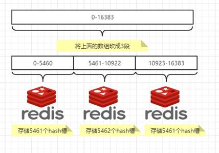

### 5、创建6台reids

#### 5.1、创建机器

```shell
[root@localhost ~]# docker run -d --name redis-node-1 --net host --privileged=true -v /data/redis/share/redis-node-1:/data redis:6.0.8 --cluster-enabled yes --appendonly yes --port 6381
[root@localhost ~]# docker run -d --name redis-node-2 --net host --privileged=true -v /data/redis/share/redis-node-2:/data redis:6.0.8 --cluster-enabled yes --appendonly yes --port 6382
[root@localhost ~]# docker run -d --name redis-node-3 --net host --privileged=true -v /data/redis/share/redis-node-3:/data redis:6.0.8 --cluster-enabled yes --appendonly yes --port 6383
[root@localhost ~]# docker run -d --name redis-node-4 --net host --privileged=true -v /data/redis/share/redis-node-4:/data redis:6.0.8 --cluster-enabled yes --appendonly yes --port 6384
[root@localhost ~]# docker run -d --name redis-node-5 --net host --privileged=true -v /data/redis/share/redis-node-5:/data redis:6.0.8 --cluster-enabled yes --appendonly yes --port 6385
[root@localhost ~]# docker run -d --name redis-node-6 --net host --privileged=true -v /data/redis/share/redis-node-6:/data redis:6.0.8 --cluster-enabled yes --appendonly yes --port 6386

参数介绍
docker run	创建并运行docker容器实例
--name redis-node-6			# 容器名字
--net host					# 使用宿主机的IP和端口，默认
--privileged=true			# 获取宿主机root用户权限
-v /data/redis/share/redis-node-6:/data		# 容器卷，宿主机地址:docker内部地址
redis:6.0.8					#redis镜像和版本号
--cluster-enabled yes		# 开启redis集群
--appendonly yes			# 开启持久化
--port 6386					# redis端口号
```

#### 5.2、查看群集信息

```shell
[root@localhost ~]# docker exec -it redis-node-1 /bin/bash		# 进入容器
root@localhost:/data# redis-cli --cluster create 192.168.1.111:6381 192.168.1.111:6382 192.168.1.111:6383 192.168.1.111:6384 192.168.1.111:6385 192.168.1.111:6386 --cluster-replicas 1		# --cluster-replicas 1  为每个机器分配一个slave
M: 4e6566624e5e3d08718c428d84c0a5dcfb78cce6 192.168.1.111:6381		# M代表master
   slots:[0-5460] (5461 slots) master								# 这个机器的槽
   1 additional replica(s)
M: 476a1e253d60c0c2069230731a6f2a2800c0aff8 192.168.1.111:6383
   slots:[10923-16383] (5461 slots) master
   1 additional replica(s)
S: f449d3729a6792d8a650522627eed5f81c12f3fb 192.168.1.111:6384		# S代表slave
   slots: (0 slots) slave
   replicates 476a1e253d60c0c2069230731a6f2a2800c0aff8
S: ddefe7a97598ec589b76f2dbfbddbeec23f1164c 192.168.1.111:6385
   slots: (0 slots) slave
   replicates 4e6566624e5e3d08718c428d84c0a5dcfb78cce6
S: e27b9344b99cc04de9cd47d3f1e390ad4f850905 192.168.1.111:6386
   slots: (0 slots) slave
   replicates f82f20abd6b4b8b4f232689de31db1314bfccb44
M: f82f20abd6b4b8b4f232689de31db1314bfccb44 192.168.1.111:6382
   slots:[5461-10922] (5462 slots) master
   1 additional replica(s)
root@localhost:/data# redis-cli -p 6381 				# 进入6381查看信息

127.0.0.1:6381> CLUSTER info				# 查看槽位信息
cluster_slots_assigned:16384				# 16384个槽
cluster_known_nodes:6						# 6个节点

127.0.0.1:6381> cluster nodes				# 查看信息
476a1e253d60c0c2069230731a6f2a2800c0aff8 192.168.1.111:6383@16383 master - 0 1684489147984 3 connected 10923-16383
f449d3729a6792d8a650522627eed5f81c12f3fb 192.168.1.111:6384@16384 slave 476a1e253d60c0c2069230731a6f2a2800c0aff8 0 1684489146000 3 connected
ddefe7a97598ec589b76f2dbfbddbeec23f1164c 192.168.1.111:6385@16385 slave 4e6566624e5e3d08718c428d84c0a5dcfb78cce6 0 1684489145000 1 connected
e27b9344b99cc04de9cd47d3f1e390ad4f850905 192.168.1.111:6386@16386 slave f82f20abd6b4b8b4f232689de31db1314bfccb44 0 1684489144961 2 connected
f82f20abd6b4b8b4f232689de31db1314bfccb44 192.168.1.111:6382@16382 master - 0 1684489146977 2 connected 5461-10922
4e6566624e5e3d08718c428d84c0a5dcfb78cce6 192.168.1.111:6381@16381 myself,master - 0 1684489146000 1 connected 0-5460
1	对应	5
3	对应	4
2	对应	6
```

### 6、主从切换迁移

#### 6.1、防止路由失效

```shell
[root@localhost ~]# docker run -it redis-node-1 /bin/bash
# 进入6381添加数据发现
127.0.0.1:6381> set k1 v1					# 添加数据
(error) MOVED 12706 192.168.1.111:6383		# 发现添加错误指向6383
127.0.0.1:6381> set k2 v2					# 添加数据
OK											# 成功
因为是通过hash值来算放入哪个机器，k1应该放在6383上面，所以6381添加不成功，可以通过参数-c防止路由失效
root@localhost:/data# redis-cli -p 6381 -c
127.0.0.1:6381> set k1 v1					# 添加k1数据
-> Redirected to slot [12706] located at 192.168.1.111:6383		# 发现转到了6383
OK
192.168.1.111:6383> set k3 v3				# 添加k3数据
-> Redirected to slot [4576] located at 192.168.1.111:6381		# 发现转到了6381
OK
```

#### 6.2、容错切换迁移

```shell
主6381和从机切换，先停止主机6381
[root@localhost ~]# docker stop redis-node-1
6381主机停了，对应的真实从机上位
查看集群信息
[root@localhost ~]# docker exec -it  redis-node-2 /bin/bash
root@localhost:/data# redis-cli -p 6382 -c 
ddefe7a97598ec589b76f2dbfbddbeec23f1164c 192.168.1.111:6385@16385 master - 0 1684490225000 7 connected 0-5460	# 5成了master
4e6566624e5e3d08718c428d84c0a5dcfb78cce6 192.168.1.111:6381@16381 master,fail - 1684490143841 1684490140000 1 disconnected
e27b9344b99cc04de9cd47d3f1e390ad4f850905 192.168.1.111:6386@16386 slave f82f20abd6b4b8b4f232689de31db1314bfccb44 0 1684490224500 2 connected
f82f20abd6b4b8b4f232689de31db1314bfccb44 192.168.1.111:6382@16382 myself,master - 0 1684490223000 2 connected 5461-10922  # 1挂了
f449d3729a6792d8a650522627eed5f81c12f3fb 192.168.1.111:6384@16384 slave 476a1e253d60c0c2069230731a6f2a2800c0aff8 0 1684490222485 3 connected
476a1e253d60c0c2069230731a6f2a2800c0aff8 192.168.1.111:6383@16383 master - 0 1684490225509 3 connected 10923-16383

重新启动redis-node-1,然后查看信息发现redis-node-1不会获得master了，因为当前被5占用，更换的方式就是再停掉5让master到1上面再启动5
[root@localhost ~]# docker start redis-node-1
[root@localhost ~]# docker stop redis-node-5
[root@localhost ~]# docker start redis-node-5
```

### 7、集群扩容

```shell
创建2台机器
[root@localhost ~]# docker run -d --name redis-node-7 --net host --privileged=true -v /data/redis/share/redis-node-7:/data redis:6.0.8 --cluster-enabled yes --appendonly yes --port 6387
[root@localhost ~]# docker run -d --name redis-node-8 --net host --privileged=true -v /data/redis/share/redis-node-8:/data redis:6.0.8 --cluster-enabled yes --appendonly yes --port 6388
[root@localhost ~]# docker exec -it redis-node-7 /bin/bash
root@localhost:/data# redis-cli --cluster add-node 192.168.1.111:6387 192.168.1.111:6381	# 将7加入群集
root@localhost:/data# redis-cli --cluster check 192.168.1.111:6381			# 查看集群信息
192.168.1.111:6382 (f82f20ab...) -> 0 keys | 5462 slots | 1 slaves.
192.168.1.111:6387 (99d52527...) -> 0 keys | 0 slots | 0 slaves.			# 发现7还没有槽位
192.168.1.111:6385 (ddefe7a9...) -> 2 keys | 5461 slots | 1 slaves.
192.168.1.111:6383 (476a1e25...) -> 1 keys | 5461 slots | 1 slaves.
root@localhost:/data# redis-cli --cluster reshard 19.168.1.111:6381		# 重新分配槽位
How many alots do you want to move (from 1 to 16384)? 4096				# 需要分出来多少
want is the receiving node id? 99d5252790e6054de25399d276aa86ba73380f26 #分配给谁
source node #1 : all													# 设置1分出来多少，all代表其他机器平分出4096个槽位
root@localhost:/data# redis-cli --cluster check 192.168.1.111:6381
192.168.1.111:6382 (f82f20ab...) -> 0 keys | 4096 slots | 1 slaves.
192.168.1.111:6387 (99d52527...) -> 1 keys | 4096 slots | 0 slaves.		# 发现7号机已经有槽位了但是没有从服务器
192.168.1.111:6385 (ddefe7a9...) -> 1 keys | 4096 slots | 1 slaves.
192.168.1.111:6383 (476a1e25...) -> 1 keys | 4096 slots | 1 slaves.
root@localhost:/data# redis-cli --cluster add-node 192.168.1.111:6388 192.168.1.111:6387 --cluster-slave --cluster-master-id 99d5252790e6054de25399d276aa86ba73380f26								 # 将8号机生命为7号机的slave，最后的id为7号机的
```

### 8、集群缩容

```shell
redis-cli --cluster del-node 192.168.1.111:6388 6281b0b1a972a07bf7b6c92d2a54764f012c8bc9	# 从集群删除8号机，最后id为8号机
root@localhost:/data# redis-cli --cluster reshard 192.168.1.111:6381    					# 重新分配槽位
How many slots do you want to move (from 1 to 16384)? 4096									# 分出多少
What is the receiving node ID? f82f20abd6b4b8b4f232689de31db1314bfccb44  					# 分给谁，可以为all
Source node #1: 99d5252790e6054de25399d276aa86ba73380f26									# 谁分出来
Source node #2: done																		# 不分了
root@localhost:/data# redis-cli --cluster del-node 192.168.1.111:6387 99d5252790e6054de25399d276aa86ba73380f26	# 删除7号，后面为7号id
```


# 十、DockerFile(创建自己的镜像)

## (一)、介绍

dockerFile是用来构建docker镜像的的文件,命令参数脚本!

## (二)、构建步骤

1、编写一个dockerfile文件

2、docker build构建一个镜像

3、docker run运行一个镜像

4、docker push发布镜像(dockerhub或阿里云仓库)

## (三)、dockerfile的规则

1、每个关键字必须 大写

2、执行从上到下

3、#表示注释

## (四)、dockerfile常用命令

```shell
FROM       		# 基础镜像，一切从这里开始构建
MAINTAINER    	# 镜像是谁写的， 姓名+邮箱
RUN     		# 镜像构建的时候需要运行的命令
ADD     		# 步骤，tomcat镜像，这个tomcat压缩包！添加内容 添加同目录
WORKDIR    		# 镜像的工作目录
VOLUME     		# 挂载的目录
EXPOSE     		# 保留端口配置
CMD     		# 指定这个容器启动的时候要运行的命令，只有最后一个会生效，可被替代。
ENTRYPOINT    	# 指定这个容器启动的时候要运行的命令，可以追加命令
ONBUILD    		# 当构建一个被继承 DockerFile 这个时候就会运行ONBUILD的指令，触发指令。
COPY       		# 类似ADD，将我们文件拷贝到镜像中
ENV     		# 构建的时候设置环境变量！
```

## (五)、创建自己的dockerfile

### 1、在/home下创建一个dockerfile文件夹储存dockerfile文件

 

### 2、编写dockerfile文件

 

```shell
FROM centos      					# 使用centos作为基础环境
MAINTAINER ma<2992455524@qq.com>    # 作者<邮箱>
ENV MYPATH /usr/local   			# 环境变量
WORKDIR $MYPATH    					# 刚进去的工作目录为/usr/local
RUN yum -y install vim  			# 中间执行的命令
RUN yum -y install bind     		# 下载dns服务
EXPOSE 80        					# 暴露端口为80端口
CMD echo $MYPATH    				# 输出$MYPATH环境变量
CMD /bin/bash      					# 以bash的方式运行
```


### 3、构建这个镜像

```
docker build –f dockerfile文件名 –t 镜像名:版本号
docker build-f dockerfile1 –t mycentos:1.0 . (不要忘了后面还有一个.)
```

 

 

### 4、使用镜像

```
docker run –it mycentos:1.0 /bin/bash
```

 

## (六)、制作tomcat镜像

### 1、准备jdk和tomcat压缩包

 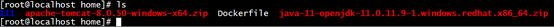

### 2、编写dockerfile文件

```shell
FROM centos
MAINTAINER ma<2992455524@qq.com>
ADD java-11-openjdk-11.0.11.9-1.windows.redhat.x86_64.zip /usr/local/
ADD apache-tomcat-8.0.50-windows-x64.zip /usr/local/
ENV MYPATH /usr/local
WORKDIR $MYPATH
ENV JAVA_HOME /usr/local/java-11-openjdk-11.0.11.9-1.windows.redhat.x86_64
ENV CATALINA_HOME /usr/local/apache-tomcat-8.0.50-windows-x64
ENV PATH $PATH:$JAVA_HOME/bin:$CATALINA_HOME/lib
EXPOSE 8080
CMD /usr/local/apache-tomcat-8.0.50-windows-x64/bin/startup.sh && /usr/local/apache-tomcat-8.0.50-windows-x64/logs/catalina.out
```

## (七)、编写centos的dockerfile文件

#### 1、构建Dockerfile

```shell
下载jdk
https://mirrors.yangxingzhen.com/jdk/
进入虚拟机上传java包
[root@localhost ~]# ls
anaconda-ks.cfg  jdk-8u191-linux-x64.tar.gz
编写Dockerfile文件
[root@localhost ~]# vi Dockerfile
FROM ubuntu
MAINTAINER ma<2992455524@qq.com>
ENV MYPATH /usr/local
WORKDIR $MYPATH
RUN apt-get update					# 更新包
RUN apt-get -y install vim			# 安装vim编辑器
RUN apt-get -y install net-tools	# 安装ifconfig
RUN mkdir /usr/local/java			# 创建java8及lib库
ADD jdk-8u191-linux-x64.tar.gz /usr/local/java/		# 解压.tar.gz包并放在/usr/local/java文件下
ENV JAVA_HOME /usr/local/java/jdk1.8.0_191			# 配置java环境变量
ENV JRE_HOME $JAVA_HOME/jre							
ENV CLASSPATH $JAVA_HOME/lib/dt.jar:$JAVA_HOME/lib/tools.jar:$JRE_HOME/lib:$CLASSPATH
ENV PATH $JAVA_HOME/bin:$PATH			
EXPOSE 80							# 端口号为80
CMD echo $MYPATH					# 打印上面变量
CMD echo "success--------------ok"	# 打印成功
CMD /bin/bash						# 运行容器的时候以/bin/bash运行

[root@localhost ~]# docker build -t myubantu .		# 开始构建
[root@localhost ~]# docker run -it mycentos			# 运行新的镜像发现有vim，ifconfig，java命令了
```

#### 2、虚悬镜像

名字和标签都为none的镜像


```shell
[root@localhost ~]# docker image ls -f dangling=true		# 查看镜像
[root@localhost ~]# docker image prune						# 删除所有虚悬镜像
```

## (八)、Docker微服务实战

### 1、创建springboot程序


### 2、application.perproties

```java
server.port=6001
```

### 3、业务类

```java
package com.example.demo.controller;

import org.springframework.beans.factory.annotation.Value;
import org.springframework.web.bind.annotation.RequestMapping;
import org.springframework.web.bind.annotation.RequestMethod;
import org.springframework.web.bind.annotation.RestController;

import java.util.UUID;

@RestController
public class MyController {

    @Value("${server.port}")
    private String port;

    @RequestMapping("/order/docker")
    public String helloDocker()
    {
        return "hello docker"+"\t"+port+"\t"+ UUID.randomUUID().toString();
    }

    @RequestMapping(value ="/order/index",method = RequestMethod.GET)
    public String index()
    {
        return "服务端口号: "+"\t"+port+"\t"+ UUID.randomUUID().toString();
    }

}
```

### 4、启动服务

### 5、访问http://localhost:6001/order/docker


### 6、使用maven打包


### 7、将jar包放入linux中

```shell
[root@localhost ~]# ls
demo-0.0.1-SNAPSHOT.jar
```

### 8、编写Dockerfile

```dockerfile
FROM ubuntu
MAINTAINER ma<2992455524@qq.com>
RUN mkdir /etc/java
ADD demo-0.0.1-SNAPSHOT.jar /etc/java/demo.jar
ADD jdk-8u191-linux-x64.tar.gz /etc/java
ENV JAVA_HOME /etc/java/jdk1.8.0_191
ENV JRE_HOME $JAVA_HOME/jre
ENV CLASSPATH $JAVA_HOME/lib/dt.jar:$JAVA_HOME/lib/tools.jar:$JRE_HOME/lib:$CLASSPATH
ENV PATH $JAVA_HOME/bin:$PATH
EXPOSE 6001
ENTRYPOINT ["java","-jar","/etc/java/demo.jar"]
```

### 9、构建

```shell
[root@localhost ~]# docker build -t javaubuntu:0.1 .
[root@localhost ~]# docker run -it -p 6001:6001 javaubuntu:0.1

  .   ____          _            __ _ _
 /\\ / ___'_ __ _ _(_)_ __  __ _ \ \ \ \
( ( )\___ | '_ | '_| | '_ \/ _` | \ \ \ \
 \\/  ___)| |_)| | | | | || (_| |  ) ) ) )
  '  |____| .__|_| |_|_| |_\__, | / / / /
 =========|_|==============|___/=/_/_/_/
 :: Spring Boot ::        (v2.2.1.RELEASE)

2023-05-21 02:11:49.111  INFO 1 --- [           main] com.example.demo.DemoApplication         : Starting DemoApplication v0.0.1-SNAPSHOT on de85845552fd with PID 1 (/etc/java/demo.jar started by root in /)
2023-05-21 02:11:49.116  INFO 1 --- [           main] com.example.demo.DemoApplication         : No active profile set, falling back to default profiles: default
2023-05-21 02:11:51.354  INFO 1 --- [           main] o.s.b.w.embedded.tomcat.TomcatWebServer  : Tomcat initialized with port(s): 6001 (http)
2023-05-21 02:11:51.377  INFO 1 --- [           main] o.apache.catalina.core.StandardService   : Starting service [Tomcat]
2023-05-21 02:11:51.377  INFO 1 --- [           main] org.apache.catalina.core.StandardEngine  : Starting Servlet engine: [Apache Tomcat/9.0.27]
2023-05-21 02:11:51.521  INFO 1 --- [           main] o.a.c.c.C.[Tomcat].[localhost].[/]       : Initializing Spring embedded WebApplicationContext
2023-05-21 02:11:51.521  INFO 1 --- [           main] o.s.web.context.ContextLoader            : Root WebApplicationContext: initialization completed in 2226 ms
2023-05-21 02:11:51.978  INFO 1 --- [           main] o.s.s.concurrent.ThreadPoolTaskExecutor  : Initializing ExecutorService 'applicationTaskExecutor'
2023-05-21 02:11:52.133  INFO 1 --- [           main] o.s.b.w.embedded.tomcat.TomcatWebServer  : Tomcat started on port(s): 6001 (http) with context path ''
2023-05-21 02:11:52.136  INFO 1 --- [           main] com.example.demo.DemoApplication         : Started DemoApplication in 3.604 seconds (JVM running for 3.92)
2023-05-21 02:12:05.923  INFO 1 --- [nio-6001-exec-3] o.a.c.c.C.[Tomcat].[localhost].[/]       : Initializing Spring DispatcherServlet 'dispatcherServlet'
2023-05-21 02:12:05.923  INFO 1 --- [nio-6001-exec-3] o.s.web.servlet.DispatcherServlet        : Initializing Servlet 'dispatcherServlet'
2023-05-21 02:12:05.927  INFO 1 --- [nio-6001-exec-3] o.s.web.servlet.DispatcherServlet        : Completed initialization in 3 ms
```

###  10、访问


# 十一、Docker网络

## (一)、介绍

docker不启动，默认网络情况

```shell
[root@localhost ~]# ip ad 							# 查看网卡信息
1: lo: <LOOPBACK,UP,LOWER_UP> mtu 65536 qdisc noqueue state UNKNOWN qlen 1		# lo回环地址 127.0.0.1
    link/loopback 00:00:00:00:00:00 brd 00:00:00:00:00:00
    inet 127.0.0.1/8 scope host lo
       valid_lft forever preferred_lft forever
    inet6 ::1/128 scope host 
       valid_lft forever preferred_lft forever
2: ens33: <BROADCAST,MULTICAST,UP,LOWER_UP> mtu 1500 qdisc pfifo_fast state UP qlen 1000		# 主机使用的网卡
    link/ether 00:0c:29:df:e9:b6 brd ff:ff:ff:ff:ff:ff
    inet 192.168.1.111/24 brd 192.168.1.255 scope global ens33
       valid_lft forever preferred_lft forever
    inet6 fe80::bb96:cb6e:bde6:548/64 scope link 
       valid_lft forever preferred_lft forever
3: docker0: <NO-CARRIER,BROADCAST,MULTICAST,UP> mtu 1500 qdisc noqueue state DOWN 			# docker使用过的网卡
    link/ether 02:42:dc:05:28:d7 brd ff:ff:ff:ff:ff:ff
    inet 172.17.0.1/16 brd 172.17.255.255 scope global docker0
       valid_lft forever preferred_lft forever
    inet6 fe80::42:dcff:fe05:28d7/64 scope link 
       valid_lft forever preferred_lft forever
[root@localhost ~]# docker network ls 				# 查看docker网卡类型
NETWORK ID     NAME      DRIVER    SCOPE
3c4d06d35028   bridge    bridge    local			# 桥接
b01bce8967af   host      host      local			# 仅主机
f980fc8d11f7   none      null      local			# 什么都没有
[root@localhost ~]# docker network --help			# 查看都有哪些命令
      create      Create a network								# 创建一个网卡类型
      inspect     Display detailed information on one or more networks	# 查看网卡信息
      ls          List networks									# 查看全部网卡类型
      prune       Remove all unused networks					# 删除虚悬网卡
      rm          Remove one or more networks					# 删除网卡类型
```

## (二)、网卡介绍

bridge模式：使用--network bridge指定，默认使用docker0

host模式：使用--network host指定

none模式：使用--network none指定

container模式：使用--network container:NAME或者容器ID指定


## (三)、容器内网络IP生产规则

### 1、先启动两个ubuntu容器实例


### 2、docker inspect 容器ID or 容器名字

  

### 3、关闭u2实例，新建u3，查看ip变化

 

### 4、结论

docker容器内部的ip是有可能会发生改变的，会依此递增给容器id，当前面的容器消失，后面会递减

## (四)、三种类型网卡介绍

### 1、bridge

- Docker 服务默认会创建一个 docker0 网桥（其上有一个 docker0 内部接口），该桥接网络的名称为docker0，它在内核层连通了其他的物理或虚拟网卡，这就将所有容器和本地主机都放到同一个物理网络。Docker 默认指定了 docker0 接口 的 IP 地址和子网掩码，让主机和容器之间可以通过网桥相互通信。
- Docker使用Linux桥接，在宿主机虚拟一个Docker容器网桥(docker0)，Docker启动一个容器时会根据Docker网桥的网段分配给容器一个IP地址，称为Container-IP，同时Docker网桥是每个容器的默认网关。因为在同一宿主机内的容器都接入同一个网桥，这样容器之间就能够通过容器的Container-IP直接通信。
- docker run 的时候，没有指定network的话默认使用的网桥模式就是bridge，使用的就是docker0。在宿主机ifconfig,就可以看到docker0和自己create的network(后面讲)eth0，eth1，eth2……代表网卡一，网卡二，网卡三……，lo代表127.0.0.1，即localhost，inet addr用来表示网卡的IP地址
-  网桥docker0创建一对对等虚拟设备接口一个叫veth，另一个叫eth0，成对匹配。
  - 整个宿主机的网桥模式都是docker0，类似一个交换机有一堆接口，每个接口叫veth，在本地主机和容器内分别创建一个虚拟接口，并让他们彼此联通（这样一对接口叫veth pair）；
  - 每个容器实例内部也有一块网卡，每个接口叫eth0；
  - docker0上面的每个veth匹配某个容器实例内部的eth0，两两配对，一一匹配。

- 通过上述，将宿主机上的所有容器都连接到这个内部网络上，两个容器在同一个网络下,会从这个网关下各自拿到分配的ip，此时两个容器的网络是互通的。

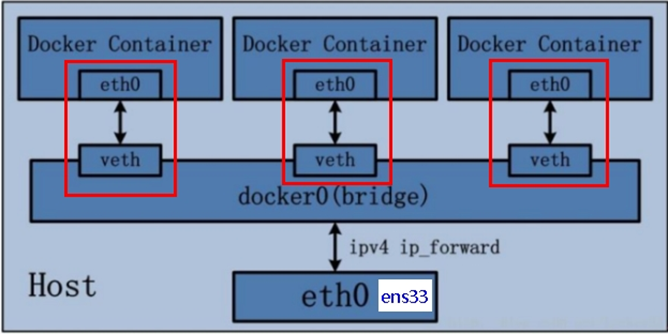

代码

```shell
docker run -d -p 8081:8080  --name tomcat81 billygoo/tomcat8-jdk8
docker run -d -p 8082:8080  --name tomcat82 billygoo/tomcat8-jdk8
```


### 2、host

直接使用宿主机的 IP 地址与外界进行通信，不再需要额外进行NAT 转换。

容器将不会获得一个独立的Network Namespace， 而是和宿主机共用一个Network Namespace。容器将不会虚拟出自己的网卡而是使用宿主机的IP和端口。


docker run -d -p 8083:8080 --network host --name tomcat83 billygoo/tomcat8-jdk8


问题：

   		docke启动时总是遇见标题中的警告

原因：

  docker启动时指定--network=host或-net=host，如果还指定了-p映射端口，那这个时候就会有此警告，并且通过-p设置的参数将不会起到任何作用，端口号会以主机端口号为主，重复时则递增。


没有设置-p的端口映射了，如何访问启动的tomcat83？？

http://宿主机IP:8080/

在CentOS里面用默认的火狐浏览器访问容器内的tomcat83看到访问成功，因为此时容器的IP借用主机的，

所以容器共享宿主机网络IP，这样的好处是外部主机与容器可以直接通信。

### 3、none

在none模式下，并不为Docker容器进行任何网络配置。 也就是说，这个Docker容器没有网卡、IP、路由等信息，只有一个lo需要我们自己为Docker容器添加网卡、配置IP等。禁用网络功能，只有lo标识(就是127.0.0.1表示本地回环)

案例

docker run -d -p 8084:8080 --network none --name tomcat84 billygoo/tomcat8-jdk8

进入容器内部查看


在容器外部查看


命令

```
docker run -d -p 8084:8080 --network none --name tomcat84 billygoo/tomcat8-jdk8
```

### 4、container

container⽹络模式 

新建的容器和已经存在的一个容器共享一个网络ip配置而不是和宿主机共享。新创建的容器不会创建自己的网卡，配置自己的IP，而是和一个指定的容器共享IP、端口范围等。同样，两个容器除了网络方面，其他的如文件系统、进程列表等还是隔离的。


案例

docker run -it  --name alpine1 alpine /bin/sh

docker run -it --network container:alpine1 --name alpine2 alpine /bin/sh

运行结果，验证共用搭桥


假如此时关闭alpine1，再看看alpine2


alpine2的也消失了

### 5、自定义网络

```
docker run -d -p 8081:8080  --name tomcat81 billygoo/tomcat8-jdk8
docker run -d -p 8082:8080  --name tomcat82 billygoo/tomcat8-jdk8
```

上述成功启动并用docker exec进入各自容器实例内部


发现ping对方的ip是可以ping通的，但是ip有的时候会变化，但是容器名是不会变化的，但是容器名ping不通，通过自己创建bridge解决

新建自定义网络


新建容器加入上一步新建的自定义网络

docker run -d -p 8081:8080 --network zzyy_network --name tomcat81 billygoo/tomcat8-jdk8

docker run -d -p 8082:8080 --network zzyy_network --name tomcat82 billygoo/tomcat8-jdk8

互相ping测试


自定义网络本身就维护好了主机名和ip的对应关系（ip和域名都能通）

自定义网络本身就维护好了主机名和ip的对应关系（ip和域名都能通）

自定义网络本身就维护好了主机名和ip的对应关系（ip和域名都能通）

### 6、Docker平台架构图解

从其架构和运行流程来看，Docker 是一个 C/S 模式的架构，后端是一个松耦合架构，众多模块各司其职。 

Docker 运行的基本流程为：

- 用户是使用 Docker Client 与 Docker Daemon 建立通信，并发送请求给后者。
- Docker Daemon 作为 Docker 架构中的主体部分，首先提供 Docker Server 的功能使其可以接受 Docker Client 的请求。
- Docker Engine 执行 Docker 内部的一系列工作，每一项工作都是以一个 Job 的形式的存在。
- Job 的运行过程中，当需要容器镜像时，则从 Docker Registry 中下载镜像，并通过镜像管理驱动 Graph driver将下载镜像以Graph的形式存储。
- 当需要为 Docker 创建网络环境时，通过网络管理驱动 Network driver 创建并配置 Docker 容器网络环境。
- 当需要限制 Docker 容器运行资源或执行用户指令等操作时，则通过 Execdriver 来完成。
- Libcontainer是一项独立的容器管理包，Network driver以及Exec driver都是通过Libcontainer来实现具体对容器进行的操作。


# 十二、Docker-compose容器编排

## (一)、是什么

Compose 是 Docker 公司推出的一个工具软件，可以管理多个 Docker 容器组成一个应用。你需要定义一个 YAML 格式的配置文件docker-compose.yml，写好多个容器之间的调用关系。然后，只要一个命令，就能同时启动/关闭这些容器

Docker-Compose是Docker官方的开源项目， 负责实现对Docker容器集群的快速编排。

## (二)、能干嘛

 docker建议我们每一个容器中只运行一个服务,因为docker容器本身占用资源极少,所以最好是将每个服务单独的分割开来但是这样我们又面临了一个问题？

如果我需要同时部署好多个服务,难道要每个服务单独写Dockerfile然后在构建镜像,构建容器,这样累都累死了,所以docker官方给我们提供了docker-compose多服务部署的工具

例如要实现一个Web微服务项目，除了Web服务容器本身，往往还需要再加上后端的数据库mysql服务容器，redis服务器，注册中心eureka，甚至还包括负载均衡容器等等。。。。。。

Compose允许用户通过一个单独的docker-compose.yml模板文件（YAML 格式）来定义一组相关联的应用容器为一个项目（project）。

可以很容易地用一个配置文件定义一个多容器的应用，然后使用一条指令安装这个应用的所有依赖，完成构建。Docker-Compose 解决了容器与容器之间如何管理编排的问题。

## (三)、下载

```shell
curl -L "https://github.com/docker/compose/releases/download/1.29.2/docker-compose-$(uname -s)-$(uname -m)" -o /usr/local/bin/docker-compose
chmod +x /usr/local/bin/docker-compose
docker-compose --version
```

## (四)、卸载

```shell
rm /usr/local/bin/docker-compose
```

## (五)、Compose核心概念

### 1、文件

docker-compose.yml

### 2、2要素

- 服务（service）
  - 一个个应用容器实例，比如订单微服务、库存微服务、mysql容器、nginx容器或者redis容器

- 工程（project）
  - 由一组关联的应用容器组成的一个完整业务单元，在 docker-compose.yml 文件中定义。

### 3、Compose使用的三个步骤

编写Dockerfile定义各个微服务应用并构建出对应的镜像文件

使用 docker-compose.yml 定义一个完整业务单元，安排好整体应用中的各个容器服务。

最后，执行docker-compose up命令 来启动并运行整个应用程序，完成一键部署上线

## (六)、不使用compose的情况下

### 1、说明

微服务要访问reids和mysql，不适用compose的时候需要一个一个启动，容器间的启停或宕机，有可能导致IP地址对应的容器实例变化，映射出错， 要么生产IP写死(可以但是不推荐)，要么通过服务调用

### 2、修改以前的demo.jar


### 3、创建mysql容器

```shell
[root@localhost ~]# docker run -d -p 3306:3306 -v /tmp/mysql/log:/var/mysql -v /tmp/mysql/data:/var/lib/mysql -v /tmp/mysql/conf:/etc/mysql/conf.d -e MYSQL_ROOT_PASSWORD=123456 --name mysql mysql:5.7	 
[root@localhost ~]# vim /tmp/mysql/conf/my.cnf		
[client]
default_character_set=utf8
[mysqld]
collation_server = utf8_general_ci
character_set_server = utf8

[root@localhost ~]# docker restart mysql
```

### 4、创建redis容器

```shell
[root@localhost ~]# vi /tmp/redis/redis.conf 
将上方文件复制进去
137 #bind 127.0.0.1
271 daemonize no
1397 appendonly yes

docker run -p 6379:6379 --name myredis	
-v /tmp/redis/redis.conf:/etc/redis/redis.conf	
-v /tmp/redis/data:/data -d redis:6.0.8 	
redis-server /etc/redis/redis.conf 
```

### 5、SQL建表建库

```mysql
create database docker;
use docker;
CREATE TABLE `t_user` (
 `id` int(10) unsigned NOT NULL AUTO_INCREMENT,
 `username` varchar(50) NOT NULL DEFAULT '' COMMENT '用户名',
 `password` varchar(50) NOT NULL DEFAULT '' COMMENT '密码',
 `sex` tinyint(4) NOT NULL DEFAULT '0' COMMENT '性别 0=女 1=男 ',
 `deleted` tinyint(4) unsigned NOT NULL DEFAULT '0' COMMENT '删除标志，默认0不删除，1删除',
 `update_time` timestamp NOT NULL DEFAULT CURRENT_TIMESTAMP ON UPDATE CURRENT_TIMESTAMP COMMENT '更新时间',
 `create_time` timestamp NOT NULL DEFAULT CURRENT_TIMESTAMP COMMENT '创建时间',
 PRIMARY KEY (`id`)
) ENGINE=InnoDB AUTO_INCREMENT=1 DEFAULT CHARSET=utf8 COMMENT='用户表'
```

### 6、pom文件

```xml
<?xml version="1.0" encoding="UTF-8"?>
<project xmlns="http://maven.apache.org/POM/4.0.0" xmlns:xsi="http://www.w3.org/2001/XMLSchema-instance"
         xsi:schemaLocation="http://maven.apache.org/POM/4.0.0 https://maven.apache.org/xsd/maven-4.0.0.xsd">
    <modelVersion>4.0.0</modelVersion>
    <parent>
        <groupId>org.springframework.boot</groupId>
        <artifactId>spring-boot-starter-parent</artifactId>
        <version>2.2.1.RELEASE</version>
        <relativePath/> <!-- lookup parent from repository -->
    </parent>

    <groupId>com.example</groupId>
    <artifactId>demo</artifactId>
    <version>0.0.1-SNAPSHOT</version>

    <properties>
        <project.build.sourceEncoding>UTF-8</project.build.sourceEncoding>
        <maven.compiler.source>1.8</maven.compiler.source>
        <maven.compiler.target>1.8</maven.compiler.target>
        <junit.version>4.12</junit.version>
        <log4j.version>1.2.17</log4j.version>
        <lombok.version>1.16.18</lombok.version>
        <mysql.version>5.1.47</mysql.version>
        <druid.version>1.1.16</druid.version>
        <mapper.version>4.1.5</mapper.version>
        <mybatis.spring.boot.version>1.3.0</mybatis.spring.boot.version>
    </properties>

    <dependencies>
        <!--guava Google 开源的 Guava 中自带的布隆过滤器-->
        <dependency>
            <groupId>com.google.guava</groupId>
            <artifactId>guava</artifactId>
            <version>23.0</version>
        </dependency>
        <!-- redisson -->
        <dependency>
            <groupId>org.redisson</groupId>
            <artifactId>redisson</artifactId>
            <version>3.13.4</version>
        </dependency>
        <!--SpringBoot通用依赖模块-->
        <dependency>
            <groupId>org.springframework.boot</groupId>
            <artifactId>spring-boot-starter-web</artifactId>
        </dependency>
        <dependency>
            <groupId>org.springframework.boot</groupId>
            <artifactId>spring-boot-starter-actuator</artifactId>
        </dependency>
        <!--swagger2-->
        <dependency>
            <groupId>io.springfox</groupId>
            <artifactId>springfox-swagger2</artifactId>
            <version>2.9.2</version>
        </dependency>
        <dependency>
            <groupId>io.springfox</groupId>
            <artifactId>springfox-swagger-ui</artifactId>
            <version>2.9.2</version>
        </dependency>
        <!--SpringBoot与Redis整合依赖-->
        <dependency>
            <groupId>org.springframework.boot</groupId>
            <artifactId>spring-boot-starter-data-redis</artifactId>
        </dependency>
        <!--springCache-->
        <dependency>
            <groupId>org.springframework.boot</groupId>
            <artifactId>spring-boot-starter-cache</artifactId>
        </dependency>
        <!--springCache连接池依赖包-->
        <dependency>
            <groupId>org.apache.commons</groupId>
            <artifactId>commons-pool2</artifactId>
        </dependency>
        <!-- jedis -->
        <dependency>
            <groupId>redis.clients</groupId>
            <artifactId>jedis</artifactId>
            <version>3.1.0</version>
        </dependency>
        <!--Mysql数据库驱动-->
        <dependency>
            <groupId>mysql</groupId>
            <artifactId>mysql-connector-java</artifactId>
            <version>5.1.47</version>
        </dependency>
        <!--SpringBoot集成druid连接池-->
        <dependency>
            <groupId>com.alibaba</groupId>
            <artifactId>druid-spring-boot-starter</artifactId>
            <version>1.1.10</version>
        </dependency>
        <dependency>
            <groupId>com.alibaba</groupId>
            <artifactId>druid</artifactId>
            <version>${druid.version}</version>
        </dependency>
        <!--mybatis和springboot整合-->
        <dependency>
            <groupId>org.mybatis.spring.boot</groupId>
            <artifactId>mybatis-spring-boot-starter</artifactId>
            <version>${mybatis.spring.boot.version}</version>
        </dependency>
        <!-- 添加springboot对amqp的支持 -->
        <dependency>
            <groupId>org.springframework.boot</groupId>
            <artifactId>spring-boot-starter-amqp</artifactId>
        </dependency>
        <dependency>
            <groupId>commons-codec</groupId>
            <artifactId>commons-codec</artifactId>
            <version>1.10</version>
        </dependency>
        <!--通用基础配置junit/devtools/test/log4j/lombok/hutool-->
        <!--hutool-->
        <dependency>
            <groupId>cn.hutool</groupId>
            <artifactId>hutool-all</artifactId>
            <version>5.2.3</version>
        </dependency>
        <dependency>
            <groupId>junit</groupId>
            <artifactId>junit</artifactId>
            <version>${junit.version}</version>
        </dependency>
        <dependency>
            <groupId>org.springframework.boot</groupId>
            <artifactId>spring-boot-devtools</artifactId>
            <scope>runtime</scope>
            <optional>true</optional>
        </dependency>
        <dependency>
            <groupId>org.springframework.boot</groupId>
            <artifactId>spring-boot-starter-test</artifactId>
            <scope>test</scope>
        </dependency>
        <dependency>
            <groupId>log4j</groupId>
            <artifactId>log4j</artifactId>
            <version>${log4j.version}</version>
        </dependency>
        <dependency>
            <groupId>org.projectlombok</groupId>
            <artifactId>lombok</artifactId>
            <version>${lombok.version}</version>
            <optional>true</optional>
        </dependency>
        <!--persistence-->
        <dependency>
            <groupId>javax.persistence</groupId>
            <artifactId>persistence-api</artifactId>
            <version>1.0.2</version>
        </dependency>
        <!--通用Mapper-->
        <dependency>
            <groupId>tk.mybatis</groupId>
            <artifactId>mapper</artifactId>
            <version>${mapper.version}</version>
        </dependency>
    </dependencies>

    <build>
        <plugins>
            <plugin>
                <groupId>org.springframework.boot</groupId>
                <artifactId>spring-boot-maven-plugin</artifactId>
            </plugin>
            <plugin>
                <groupId>org.apache.maven.plugins</groupId>
                <artifactId>maven-resources-plugin</artifactId>
                <version>3.1.0</version>
            </plugin>
        </plugins>
    </build>
</project>
```

### 7、properties

```properties
# ========================redis相关配置=====================
spring.redis.host=192.168.1.111
spring.redis.port=6379
spring.redis.lettuce.pool.max-active=8
spring.redis.lettuce.pool.max-wait=-1ms
spring.redis.lettuce.pool.max-idle=8
spring.redis.lettuce.pool.min-idle=0
# ========================端口相关配置=====================
server.port=6001
mybatis-plus.configuration.log-impl=org.apache.ibatis.logging.stdout.StdOutImpl
```

### 8、redis配置类

```java
package com.example.demo.config;

import lombok.extern.slf4j.Slf4j;
import org.springframework.context.annotation.Bean;
import org.springframework.context.annotation.Configuration;
import org.springframework.data.redis.connection.lettuce.LettuceConnectionFactory;
import org.springframework.data.redis.core.RedisTemplate;
import org.springframework.data.redis.serializer.GenericJackson2JsonRedisSerializer;
import org.springframework.data.redis.serializer.StringRedisSerializer;

import java.io.Serializable;

@Configuration
@Slf4j
public class RedisConfig {
    /*
     * redis序列化的工具配置类，下面这个请一定开启配置
     * 127.0.0.1:6379> keys *
     * 1) "ord:102"  序列化过
     * 2) "\xac\xed\x00\x05t\x00\aord:102"   野生，没有序列化过
     */
    @Bean
    public RedisTemplate<String, Serializable> redisTemplate(LettuceConnectionFactory lettuceConnectionFactory)
    {
        RedisTemplate<String,Serializable> redisTemplate = new RedisTemplate<>();
        redisTemplate.setConnectionFactory(lettuceConnectionFactory);
        //设置key序列化方式string
        redisTemplate.setKeySerializer(new StringRedisSerializer());
        //设置value的序列化方式json
        redisTemplate.setValueSerializer(new GenericJackson2JsonRedisSerializer());
        redisTemplate.setHashKeySerializer(new StringRedisSerializer());
        redisTemplate.setHashValueSerializer(new GenericJackson2JsonRedisSerializer());
        redisTemplate.afterPropertiesSet();
        return redisTemplate;
    }
}
```

### 9、yaml

```yaml
## 数据库连接
spring:
  datasource:
    driver-class-name: com.mysql.jdbc.Driver
    url: jdbc:mysql://192.168.1.111:3306/docker?serverTimezone=GMT%2B8&characterEncoding=utf-8&useSSL=false
    username: root
    password: 123456
    type: com.zaxxer.hikari.HikariDataSource

mybatis-plus:
  configuration:
    log-impl: org.apache.ibatis.logging.stdout.StdOutImpl
```

### 10、实体类

```java
package com.example.demo.entity;

import javax.persistence.Column;
import javax.persistence.GeneratedValue;
import javax.persistence.Id;
import javax.persistence.Table;
import java.util.Date;


@Table(name = "user")
public class User {

    @Id
    private Integer id;

    /**
     * 用户名
     */
    private String username;

    /**
     * 密码
     */
    private String password;

    /**
     * 性别 0=女 1=男
     */
    private Byte sex;

    /**
     * 删除标志，默认0不删除，1删除
     */
    private Byte deleted;

    /**
     * 更新时间
     */
    @Column(name = "update_time")
    private Date updateTime;

    /**
     * 创建时间
     */
    @Column(name = "create_time")
    private Date createTime;

    /**
     * @return id
     */
    public Integer getId() {
        return id;
    }

    /**
     * @param id
     */
    public void setId(Integer id) {
        this.id = id;
    }

    /**
     * 获取用户名
     *
     * @return username - 用户名
     */
    public String getUsername() {
        return username;
    }

    /**
     * 设置用户名
     *
     * @param username 用户名
     */
    public void setUsername(String username) {
        this.username = username;
    }

    /**
     * 获取密码
     *
     * @return password - 密码
     */
    public String getPassword() {
        return password;
    }

    /**
     * 设置密码
     *
     * @param password 密码
     */
    public void setPassword(String password) {
        this.password = password;
    }

    /**
     * 获取性别 0=女 1=男
     *
     * @return sex - 性别 0=女 1=男
     */
    public Byte getSex() {
        return sex;
    }

    /**
     * 设置性别 0=女 1=男
     *
     * @param sex 性别 0=女 1=男
     */
    public void setSex(Byte sex) {
        this.sex = sex;
    }

    /**
     * 获取删除标志，默认0不删除，1删除
     *
     * @return deleted - 删除标志，默认0不删除，1删除
     */
    public Byte getDeleted() {
        return deleted;
    }

    /**
     * 设置删除标志，默认0不删除，1删除
     *
     * @param deleted 删除标志，默认0不删除，1删除
     */
    public void setDeleted(Byte deleted) {
        this.deleted = deleted;
    }

    /**
     * 获取更新时间
     *
     * @return update_time - 更新时间
     */
    public Date getUpdateTime() {
        return updateTime;
    }

    /**
     * 设置更新时间
     *
     * @param updateTime 更新时间
     */
    public void setUpdateTime(Date updateTime) {
        this.updateTime = updateTime;
    }

    /**
     * 获取创建时间
     *
     * @return create_time - 创建时间
     */
    public Date getCreateTime() {
        return createTime;
    }

    /**
     * 设置创建时间
     *
     * @param createTime 创建时间
     */
    public void setCreateTime(Date createTime) {
        this.createTime = createTime;
    }
}
```

### 11、DTO

```java
package com.example.demo.DTO;


import lombok.AllArgsConstructor;
import lombok.Data;
import lombok.NoArgsConstructor;

import java.util.Date;

@NoArgsConstructor
@AllArgsConstructor
@Data
public class UserDTO {

    private Integer id;

    private String username;

    private String password;

    private Byte sex;

    private Byte deleted;

    private Date updateTime;

    private Date createTime;

    /**
     * @return id
     */
    public Integer getId() {
        return id;
    }

    /**
     * @param id
     */
    public void setId(Integer id) {
        this.id = id;
    }

    /**
     * 获取用户名
     *
     * @return username - 用户名
     */
    public String getUsername() {
        return username;
    }

    /**
     * 设置用户名
     *
     * @param username 用户名
     */
    public void setUsername(String username) {
        this.username = username;
    }

    /**
     * 获取密码
     *
     * @return password - 密码
     */
    public String getPassword() {
        return password;
    }

    /**
     * 设置密码
     *
     * @param password 密码
     */
    public void setPassword(String password) {
        this.password = password;
    }

    /**
     * 获取性别 0=女 1=男
     *
     * @return sex - 性别 0=女 1=男
     */
    public Byte getSex() {
        return sex;
    }

    /**
     * 设置性别 0=女 1=男
     *
     * @param sex 性别 0=女 1=男
     */
    public void setSex(Byte sex) {
        this.sex = sex;
    }

    /**
     * 获取删除标志，默认0不删除，1删除
     *
     * @return deleted - 删除标志，默认0不删除，1删除
     */
    public Byte getDeleted() {
        return deleted;
    }

    /**
     * 设置删除标志，默认0不删除，1删除
     *
     * @param deleted 删除标志，默认0不删除，1删除
     */
    public void setDeleted(Byte deleted) {
        this.deleted = deleted;
    }

    /**
     * 获取更新时间
     *
     * @return update_time - 更新时间
     */
    public Date getUpdateTime() {
        return updateTime;
    }

    /**
     * 设置更新时间
     *
     * @param updateTime 更新时间
     */
    public void setUpdateTime(Date updateTime) {
        this.updateTime = updateTime;
    }

    /**
     * 获取创建时间
     *
     * @return create_time - 创建时间
     */
    public Date getCreateTime() {
        return createTime;
    }

    /**
     * 设置创建时间
     *
     * @param createTime 创建时间
     */
    public void setCreateTime(Date createTime) {
        this.createTime = createTime;
    }

    @Override
    public String toString() {
        return "User{" +
                "id=" + id +
                ", username='" + username + '\'' +
                ", password='" + password + '\'' +
                ", sex=" + sex +
                '}';
    }
}
```

### 11、mapper&xml

```java
package com.example.demo.mapper;

import com.baomidou.mybatisplus.core.mapper.BaseMapper;
import com.example.demo.entity.User;
import org.apache.ibatis.annotations.Mapper;

@Mapper
public interface UserMapper extends BaseMapper<User> {
}
```

```xml
<?xml version="1.0" encoding="UTF-8"?>
<!DOCTYPE mapper PUBLIC "-//mybatis.org//DTD Mapper 3.0//EN" "http://mybatis.org/dtd/mybatis-3-mapper.dtd">
<mapper namespace="com.example.demo.mapper.UserMapper">

    <resultMap id="BaseResultMap" type="com.example.demo.entity.User">
        <id column="id" jdbcType="INTEGER" property="id" />
        <result column="username" jdbcType="VARCHAR" property="username" />
        <result column="password" jdbcType="VARCHAR" property="password" />
        <result column="sex" jdbcType="TINYINT" property="sex" />
        <result column="deleted" jdbcType="TINYINT" property="deleted" />
        <result column="update_time" jdbcType="TIMESTAMP" property="updateTime" />
        <result column="create_time" jdbcType="TIMESTAMP" property="createTime" />
    </resultMap>
</mapper>
```

### 12、service

```java
package com.example.demo.service;

import com.example.demo.entity.User;
import com.example.demo.mapper.UserMapper;
import lombok.extern.slf4j.Slf4j;
import org.springframework.data.redis.core.RedisTemplate;
import org.springframework.stereotype.Service;

import javax.annotation.Resource;

@Service
@Slf4j
public class UserService{

    public static final String CACHE_KEY_USER = "user:";

    @Resource
    private UserMapper userMapper;
    @Resource
    private RedisTemplate redisTemplate;

    public void addUser(User user)
    {
        //1 先插入mysql并成功
        int i = userMapper.insert(user);

        if(i > 0)
        {
            //2 需要再次查询一下mysql将数据捞回来并ok
            user = userMapper.selectById(user.getId());
            //3 将捞出来的user存进redis，完成新增功能的数据一致性。
            String key = CACHE_KEY_USER+user.getId();
            redisTemplate.opsForValue().set(key,user);
        }
    }


    public User findUserById(Integer id)
    {
        User user = null;
        String key = CACHE_KEY_USER+id;

        //1 先从redis里面查询，如果有直接返回结果，如果没有再去查询mysql
        user = (User) redisTemplate.opsForValue().get(key);

        if(user == null)
        {
            //2 redis里面无，继续查询mysql
            user = userMapper.selectById(id);
            if(user == null)
            {
                //3.1 redis+mysql 都无数据
                //你具体细化，防止多次穿透，我们规定，记录下导致穿透的这个key回写redis
                return user;
            }else{
                //3.2 mysql有，需要将数据写回redis，保证下一次的缓存命中率
                redisTemplate.opsForValue().set(key,user);
            }
        }
        return user;
    }

}
```

### 13、controller

```java
package com.example.demo.controller;

import cn.hutool.core.util.IdUtil;
import com.example.demo.entity.User;
import com.example.demo.service.UserService;
import lombok.extern.slf4j.Slf4j;
import org.springframework.beans.BeanUtils;
import org.springframework.web.bind.annotation.*;

import javax.annotation.Resource;
import java.util.Random;

@RestController
@Slf4j
public class UserController {

    @Resource
    private UserService userService;

    @RequestMapping(value = "/user/add",method = RequestMethod.POST)
    public void addUser()
    {
        for (int i = 1; i <=3; i++) {
            User user = new User();
            user.setId(i);
            user.setUsername("zzyy"+i);
            user.setPassword(IdUtil.simpleUUID().substring(0,6));
            user.setSex((byte) new Random().nextInt(2));

            userService.addUser(user);
        }
    }

    @RequestMapping(value = "/user/find/{id}",method = RequestMethod.GET)
    public User findUserById(@PathVariable Integer id)
    {
        return userService.findUserById(id);
    }
}

```

### 14、打包放在linux目录下

### 15、编写Dockerfile

```
# 基础镜像使用java
FROM java:8
# 作者
MAINTAINER ma
# VOLUME 指定临时文件目录为/tmp，在主机/var/lib/docker目录下创建了一个临时文件并链接到容器的/tmp
VOLUME /tmp
# 将jar包添加到容器中并更名为demo.jar
ADD docker_boot-0.0.1-SNAPSHOT.jar demo.jar
# 运行jar包
RUN bash -c 'touch /demo.jar'
ENTRYPOINT ["java","-jar","/demo.jar"]
#暴露6001端口作为微服务
EXPOSE 6001
```

### 16、测试

使用apipost发送请求：http://localhost:6001/user/add


## (七)、使用compose

### 1、编写compose文件

docker-compose.yml

```yaml
version: "3"									# 使用3版本
 
services:										# 服务
  microService:
    image: demo:1.6								# 镜像为demo:1.6
    container_name: ms01						# 容器名字为ms01
    ports:										# 端口号6001
      - "6001:6001"
    volumes:
      - /app/microService:/data					# 挂载卷
    networks: 									# 使用的网络
      - ma_net
    depends_on:									# 依赖于redis和mysql，先启动这两个 
      - redis
      - mysql
 
  redis:										# 构建redis
    image: redis:6.0.8							# 镜像
    ports:										# 端口
      - "6379:6379"
    volumes:									# 容器卷
      - /app/redis/redis.conf:/etc/redis/redis.conf
      - /app/redis/data:/data
    networks: 									# 使用的网络
      - ma_net
    command: redis-server /etc/redis/redis.conf	# redis配置文件使用本地的
 
  mysql:										# mysql
    image: mysql:5.7							# 起始镜像
    environment:								# mysql参数
      MYSQL_ROOT_PASSWORD: '123456'				# 密码
      MYSQL_ALLOW_EMPTY_PASSWORD: 'no'
      MYSQL_DATABASE: 'db2021'					# 连接的数据库
      MYSQL_USER: 'zzyy'						# 数据库账户
      MYSQL_PASSWORD: 'zzyy123'					# 数据库密码
    ports:										# 端口
       - "3306:3306"
    volumes:									# 容器卷
       - /app/mysql/db:/var/lib/mysql
       - /app/mysql/conf/my.cnf:/etc/my.cnf
       - /app/mysql/init:/docker-entrypoint-initdb.d
    networks:									# 使用的网络
      - ma_net
    command: --default-authentication-plugin=mysql_native_password #解决外部无法访问
networks: 										# 创建以上使用的网络确保容器名能访问
   ma_net: 
```

### 2、修改微服务

```properties
spring.datasource.url=jdbc:mysql://mysql:3306/db2021?useUnicode=true&characterEncoding=utf-8&useSSL=false
spring.redis.host=redis
```

### 3、重新打包

### 4、重新构建Dockerfile

### 5、执行

```shell
docker-compose up 
或者
docker-compose up -d
```

### 6、创建需要的数据库

```shell
docker exec -it 容器实例id /bin/bash
mysql -uroot -p
create database db2021;
CREATE TABLE `t_user` (
 `id` INT(10) UNSIGNED NOT NULL AUTO_INCREMENT,
 `username` VARCHAR(50) NOT NULL DEFAULT '' COMMENT '用户名',
 `password` VARCHAR(50) NOT NULL DEFAULT '' COMMENT '密码',
 `sex` TINYINT(4) NOT NULL DEFAULT '0' COMMENT '性别 0=女 1=男 ',
 `deleted` TINYINT(4) UNSIGNED NOT NULL DEFAULT '0' COMMENT '删除标志，默认0不删除，1删除',
 `update_time` TIMESTAMP NOT NULL DEFAULT CURRENT_TIMESTAMP ON UPDATE CURRENT_TIMESTAMP COMMENT '更新时间',
 `create_time` TIMESTAMP NOT NULL DEFAULT CURRENT_TIMESTAMP COMMENT '创建时间',
 PRIMARY KEY (`id`)
) ENGINE=INNODB AUTO_INCREMENT=1 DEFAULT CHARSET=utf8mb4 COMMENT='用户表';
```

### 7、然后进行测试

我java没起来，没有结果看不见嘻嘻

### 8、常用命令

```shell
docker-compose -h              		# 查看帮助
docker-compose up              		# 启动所有docker-compose服务
docker-compose up -d            	# 启动所有docker-compose服务并后台运行
docker-compose down             	# 停止并删除容器、网络、卷、镜像。
docker-compose exec  yml里面的服务id  # 进入容器实例内部 docker-compose exec docker-compose.yml文件中写的服务id /bin/bash
docker-compose ps           		# 展示当前docker-compose编排过的运行的所有容器
docker-compose top           		# 展示当前docker-compose编排过的容器进程
docker-compose logs  yml里面的服务id  # 查看容器输出日志
docker-compose config   			# 检查配置
docker-compose config -q 			# 检查配置，有问题才有输出
docker-compose restart  			# 重启服务
docker-compose start   				# 启动服务
docker-compose stop   				# 停止服务
```

# 十三、Docker轻量可视化Portainer

## (一)、是什么

Portainer 是一款轻量级的应用，它提供了图形化界面，用于方便地管理Docker环境，包括单机环境和集群环境。

## (二)、安装&启动

```shell
docker run -d -p 8000:8000 -p 9000:9000 --name portainer   
--restart=always   # 跟随docker启动
-v /var/run/docker.sock:/var/run/docker.sock   
-v portainer_data:/data   portainer/portainer
```

## (三)、访问

第一次访问的时候会让你设置密码


# 十四、容器监控之 CAdvisor+InfluxDB+Granfana

## (一)、介绍


CAdvisor监控收集+InfluxDB存储数据+Granfana展示图表

## (二)、CAdvisor


## (三)、InfluxDB

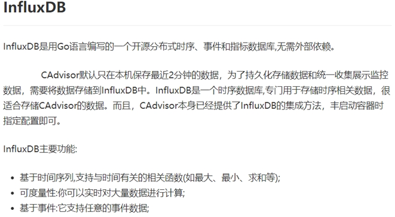

## (四)、Granfana


## (五)、总结


## (六)、使用compose编排一套

### 1、创建新的文件夹

```shell
mkdir /aaa
```

### 2、创建Dockerfile

```yaml
version: '3.1'
 
volumes:
  grafana_data: {}
 
services:
 influxdb:
  image: tutum/influxdb:0.9
  restart: always
  environment:
    - PRE_CREATE_DB=cadvisor
  ports:
    - "8083:8083"
    - "8086:8086"
  volumes:
    - ./data/influxdb:/data
 
 cadvisor:
  image: google/cadvisor
  links:
    - influxdb:influxsrv
  command: -storage_driver=influxdb -storage_driver_db=cadvisor -storage_driver_host=influxsrv:8086
  restart: always
  ports:
    - "8080:8080"
  volumes:
    - /:/rootfs:ro
    - /var/run:/var/run:rw
    - /sys:/sys:ro
    - /var/lib/docker/:/var/lib/docker:ro
 
 grafana:
  user: "104"
  image: grafana/grafana
  user: "104"
  restart: always
  links:
    - influxdb:influxsrv
  ports:
    - "3000:3000"
  volumes:
    - grafana_data:/var/lib/grafana
  environment:
    - HTTP_USER=admin
    - HTTP_PASS=admin
    - INFLUXDB_HOST=influxsrv
    - INFLUXDB_PORT=8086
    - INFLUXDB_NAME=cadvisor
    - INFLUXDB_USER=root
    - INFLUXDB_PASS=root
```


