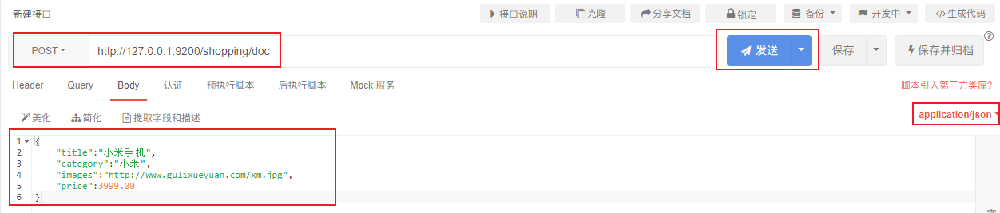

# 一、概述

## 1、开篇

结构化数据（存在关系型数据库）


非结构化数据（非关系型数据库）


半结构化数据（非关系型数据库）


## 2、技术选型

### Elasticsearch 是什么

The Elastic Stack, 包括 Elasticsearch、 Kibana、 Beats 和 Logstash（也称为 ELK Stack）。能够安全可靠地获取任何来源、任何格式的数据，然后实时地对数据进行搜索、分析和可视化。

Elaticsearch，简称为 ES， ES 是一个**开源的高扩展的分布式全文搜索引擎**， 是整个 ElasticStack 技术栈的核心。

它可以近乎实时的存储、检索数据；本身扩展性很好，可以扩展到上百台服务器，处理 PB 级别的数据。

### 全文搜索引擎

Google，百度类的网站搜索，它们都是根据网页中的关键字生成索引，我们在搜索的时候输入关键字，它们会将该关键字即索引匹配到的所有网页返回；还有常见的项目中应用日志的搜索等等。对于这些非结构化的数据文本，关系型数据库搜索不是能很好的支持。

一般传统数据库，全文检索都实现的很鸡肋，因为一般也没人用数据库存文本字段。进行全文检索需要扫描整个表，如果数据量大的话即使对 SQL 的语法优化，也收效甚微。建立了索引，但是维护起来也很麻烦，对于 insert 和 update 操作都会重新构建索引。

基于以上原因可以分析得出，在一些生产环境中，使用常规的搜索方式，性能是非常差的：

- 搜索的数据对象是大量的非结构化的文本数据。
- 文件记录量达到数十万或数百万个甚至更多。
- 支持大量基于交互式文本的查询。
- 需求非常灵活的全文搜索查询。
- 对高度相关的搜索结果的有特殊需求，但是没有可用的关系数据库可以满足。
- 对不同记录类型、非文本数据操作或安全事务处理的需求相对较少的情况。为了解决结构化数据搜索和非结构化数据搜索性能问题，我们就需要专业，健壮，强大的全文搜索引擎 。

这里说到的全文搜索引擎指的是目前广泛应用的主流搜索引擎。它的工作原理是计算机索引程序通过扫描文章中的每一个词，对每一个词建立一个索引，指明该词在文章中出现的次数和位置，当用户查询时，检索程序就根据事先建立的索引进行查找，并将查找的结果反馈给用户的检索方式。这个过程类似于通过字典中的检索字表查字的过程。

### Elasticsearch 应用案例

- GitHub: 2013 年初，抛弃了 Solr，采取 Elasticsearch 来做 PB 级的搜索。 “GitHub 使用Elasticsearch 搜索 20TB 的数据，包括 13 亿文件和 1300 亿行代码”。
- 维基百科：启动以 Elasticsearch 为基础的核心搜索架构
- 百度：目前广泛使用 Elasticsearch 作为文本数据分析，采集百度所有服务器上的各类指标数据及用户自定义数据，通过对各种数据进行多维分析展示，辅助定位分析实例异常或业务层面异常。目前覆盖百度内部 20 多个业务线（包括云分析、网盟、预测、文库、直达号、钱包、 风控等），单集群最大 100 台机器， 200 个 ES 节点，每天导入 30TB+数据。
- 新浪：使用 Elasticsearch 分析处理 32 亿条实时日志。
- 阿里：使用 Elasticsearch 构建日志采集和分析体系。
- Stack Overflow：解决 Bug 问题的网站，全英文，编程人员交流的网站。

## 3、目录

- 第1章 Elasticsearch概述
- 第2章 Elasticsearch入门
- 第3章 Elasticsearch环境
- 第4章 Elasticsearch进阶
- 第5章 Elasticsearch集成
- 第6章 Elasticsearch优化
- 第7章 Elasticsearch面试题

# 二、Elasticsearch入门

## 1、环境准备

[官方网址](https://www.elastic.co/cn/)

[官方文档](https://www.elastic.co/guide/index.html)

[Elasticsearch 7.8.0下载页面](https://www.elastic.co/cn/downloads/past-releases/elasticsearch-7-8-0)

Windows 版的 Elasticsearch 压缩包，解压即安装完毕，解压后的 Elasticsearch 的目录结构如下 ：

| 目录    | 含义           |
| ------- | -------------- |
| bin     | 可执行脚本目录 |
| config  | 配置目录       |
| jdk     | 内置 JDK 目录  |
| lib     | 类库           |
| logs    | 日志目录       |
| modules | 模块目录       |
| plugins | 插件目录       |

解压后，进入 bin 文件目录，点击 elasticsearch.bat 文件启动 ES 服务 。

注意： 9300 端口为 Elasticsearch 集群间组件的通信端口， 9200 端口为浏览器访问的 http协议 RESTful 端口。

打开浏览器，输入地址： http://localhost:9200，测试返回结果，返回结果如下：

```json
{
  "name" : "DESKTOP-LNJQ0VF",
  "cluster_name" : "elasticsearch",
  "cluster_uuid" : "nCZqBhfdT1-pw8Yas4QU9w",
  "version" : {
    "number" : "7.8.0",
    "build_flavor" : "default",
    "build_type" : "zip",
    "build_hash" : "757314695644ea9a1dc2fecd26d1a43856725e65",
    "build_date" : "2020-06-14T19:35:50.234439Z",
    "build_snapshot" : false,
    "lucene_version" : "8.5.1",
    "minimum_wire_compatibility_version" : "6.8.0",
    "minimum_index_compatibility_version" : "6.0.0-beta1"
  },
  "tagline" : "You Know, for Search"
}

```

## 2、RESTful & JSON

REST 指的是一组架构约束条件和原则。满足这些约束条件和原则的应用程序或设计就是 RESTful。 Web 应用程序最重要的 REST 原则是，客户端和服务器之间的交互在请求之间是无状态的。从客户端到服务器的每个请求都必须包含理解请求所必需的信息。如果服务器在请求之间的任何时间点重启，客户端不会得到通知。此外，无状态请求可以由任何可用服务器回答，这十分适合云计算之类的环境。客户端可以缓存数据以改进性能。

在服务器端，应用程序状态和功能可以分为各种资源。资源是一个有趣的概念实体，它向客户端公开。资源的例子有：应用程序对象、数据库记录、算法等等。每个资源都使用 URI(Universal Resource Identifier) 得到一个唯一的地址。所有资源都共享统一的接口，以便在客户端和服务器之间传输状态。使用的是标准的 HTTP 方法，比如 GET、 PUT、 POST 和DELETE。

在 REST 样式的 Web 服务中，每个资源都有一个地址。资源本身都是方法调用的目
标，方法列表对所有资源都是一样的。这些方法都是标准方法，包括 HTTP GET、 POST、PUT、 DELETE，还可能包括 HEAD 和 OPTIONS。简单的理解就是，如果想要访问互联网上的资源，就必须向资源所在的服务器发出请求，请求体中必须包含资源的网络路径， 以及对资源进行的操作(增删改查)。

REST 样式的 Web 服务若有返回结果，大多数以JSON字符串形式返回。

## 3、APIpost客户端工具

如果直接通过浏览器向 Elasticsearch 服务器发请求，那么需要在发送的请求中包含
HTTP 标准的方法，而 HTTP 的大部分特性且仅支持 GET 和 POST 方法。所以为了能方便地进行客户端的访问，可以使用 Postman 软件Postman 是一款强大的网页调试工具，提供功能强大的 Web API 和 HTTP 请求调试。

软件功能强大，界面简洁明晰、操作方便快捷，设计得很人性化。 Postman 中文版能够发送任何类型的 HTTP 请求 (GET, HEAD, POST, PUT…)，不仅能够表单提交，且可以附带任意类型请求体。

## 4、倒排索引

正排索引（传统）

| id   | content              |
| ---- | -------------------- |
| 1001 | my name is zhang san |
| 1002 | my name is li si     |

倒排索引

| keyword | id         |
| ------- | ---------- |
| name    | 1001, 1002 |
| zhang   | 1001       |

Elasticsearch 是**面向文档型数据库**，一条数据在这里就是一个文档。 为了方便大家理解，我们将 Elasticsearch 里存储文档数据和关系型数据库 MySQL 存储数据的概念进行一个类比


ES 里的 Index 可以看做一个库，而 Types 相当于表， Documents 则相当于表的行。这里 Types 的概念已经被逐渐弱化， Elasticsearch 6.X 中，一个 index 下已经只能包含一个type， Elasticsearch 7.X 中, Type 的概念已经被删除了。

## 5、创建索引

对比关系型数据库，创建索引就等同于创建数据库。

在 APIpost中，向 ES 服务器发 PUT 请求 ： http://127.0.0.1:9200/shopping

请求后，服务器返回响应：

```json
{
	"acknowledged": true,			//响应结果
	"shards_acknowledged": true,	//分片结果
	"index": "shopping" 			//索引名称
}
```

如果重复发 PUT 请求 ： http://127.0.0.1:9200/shopping 添加索引，会返回错误信息

```json
{
    "error": {
        "root_cause": [
            {
                "type": "resource_already_exists_exception",
                "reason": "index [shopping/J0WlEhh4R7aDrfIc3AkwWQ] already exists",
                "index_uuid": "J0WlEhh4R7aDrfIc3AkwWQ",
                "index": "shopping"
            }
        ],
        "type": "resource_already_exists_exception",
        "reason": "index [shopping/J0WlEhh4R7aDrfIc3AkwWQ] already exists",
        "index_uuid": "J0WlEhh4R7aDrfIc3AkwWQ",
        "index": "shopping"
    },
    "status": 400
}

```

## 6、索引查询 & 删除

查看所有索引
在 Postman 中，向 ES 服务器发 GET 请求 ： http://127.0.0.1:9200/_cat/indices?v

这里请求路径中的_cat 表示查看的意思， indices 表示索引，所以整体含义就是查看当前 ES服务器中的所有索引，就好像 MySQL 中的 show tables 的感觉，服务器响应结果如下 :

```
health status   index    uuid                    pri  rep  docs.count  docs.deleted    store.size    pri.store.size
yellow open   shopping J0WlEhh4R7aDrfIc3AkwWQ   1   1          0            0            208b           208b
```

| 表头           | 含义                                                         |
| -------------- | ------------------------------------------------------------ |
| health         | 当前服务器健康状态： green(集群完整) yellow(单点正常、集群不完整) red(单点不正常) |
| status         | 索引打开、关闭状态                                           |
| index          | 索引名                                                       |
| uuid           | 索引统一编号                                                 |
| pri            | 主分片数量                                                   |
| rep            | 副本数量                                                     |
| docs.count     | 可用文档数量                                                 |
| docs.deleted   | 文档删除状态（逻辑删除）                                     |
| store.size     | 主分片和副分片整体占空间大小                                 |
| pri.store.size | 主分片占空间大小                                             |

## 7、查看单个索引

在 Postman 中，向 ES 服务器发 GET 请求 ： http://127.0.0.1:9200/索引名 

例： http://127.0.0.1:9200/shopping

```json
{
    "shopping": {//索引名
        "aliases": {},//别名
        "mappings": {},//映射
        "settings": {//设置
            "index": {//设置 - 索引
                "creation_date": "1617861426847",//设置 - 索引 - 创建时间
                "number_of_shards": "1",//设置 - 索引 - 主分片数量
                "number_of_replicas": "1",//设置 - 索引 - 主分片数量
                "uuid": "J0WlEhh4R7aDrfIc3AkwWQ",//设置 - 索引 - 主分片数量
                "version": {//设置 - 索引 - 主分片数量
                    "created": "7080099"
                },
                "provided_name": "shopping"//设置 - 索引 - 主分片数量
            }
        }
    }
}

```

## 8、删除索引

在 Postman 中，向 ES 服务器发 DELETE 请求 ： http://127.0.0.1:9200/shopping

返回结果如下：

```json
{
    "acknowledged": true
}
```

再次查看所有索引，GET http://127.0.0.1:9200/cat/indices?v，返回结果如下：

```
health status index uuid pri rep docs.count docs.deleted store.size pri.store.size
```

成功删除。

## 10、创建文档（Put & Post）

假设索引已经创建好了，接下来我们来创建文档，并添加数据。这里的文档可以类比为关系型数据库中的表数据，添加的数据格式为 JSON 格式

在 Postman 中，向 ES 服务器发 POST 请求 ： http://127.0.0.1:9200/shopping/doc，请求体JSON内容为：



```json
{
    "_index": "shopping",//索引
    "_type": "_doc",//类型-文档
    "_id": "ANQqsHgBaKNfVnMbhZYU",//唯一标识，可以类比为 MySQL 中的主键，随机生成
    "_version": 1,//版本
    "result": "created",//结果，这里的 create 表示创建成功
    "_shards": {//
        "total": 2,//分片 - 总数
        "successful": 1,//分片 - 总数
        "failed": 0//分片 - 总数
    },
    "_seq_no": 0,
    "_primary_term": 1
}

```

上面的数据创建后，由于没有指定数据唯一性标识（ID），默认情况下， ES 服务器会随机生成一个。

如果想要自定义唯一性标识，需要在创建时指定： http://127.0.0.1:9200/shopping/_doc/1，请求体JSON内容为：

```json
{
    "title":"小米手机",
    "category":"小米",
    "images":"http://www.gulixueyuan.com/xm.jpg",
    "price":3999.00
}
```

返回结果如下：

```json
{
    "_index": "shopping",
    "_type": "_doc",
    "_id": "1",//<------------------自定义唯一性标识
    "_version": 1,
    "result": "created",
    "_shards": {
        "total": 2,
        "successful": 1,
        "failed": 0
    },
    "_seq_no": 1,
    "_primary_term": 1
}

```

**此处需要注意：如果增加数据时明确数据主键，那么请求方式也可以为 PUT。**

