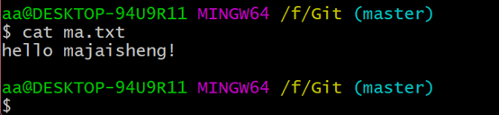

# Git

## 一、安装

安装地址: https://npm.taobao.org/mirrors/git-for-windows/

 


 

 

 

 

 

 

  

 


打开

 

 

## 二、Git 常用命令

| 命令名称                             | 作用           |
| ------------------------------------ | -------------- |
| git config --global user.name 用户名 | 设置用户签名   |
| git config --global user.email 邮箱  | 设置用户签名   |
| git init                             | 初始化本地库   |
| git status                           | 查看本地库状态 |
| git add 文件名                       | 添加到暂存区   |
| git commit -m "日志信息" 文件名      | 提交到本地库   |
| git reflog                           | 查看历史记录   |
| git reset --hard 版本号              | 版本穿梭       |

### (一)、创建用户签名

签名的作用是区分不同操作者身份。用户的签名信息在每一个版本的提交信息中能够看 到，以此确认本次提交是谁做的。Git 首次安装必须设置一下用户签名，否则无法提交代码。

 

在C:\Users\aa\.gitconfig中查看

 

### (二)、初始化本地库

#### 1、进入一个项目中

 

#### 2、右键打开git bashHere

 

#### 3、输入git init会生成一个.git的文件

 

### (三)、查看git状态

#### 1、Git status

 

#### 2、创建一个文件 vi ma.txt

 

#### 3、输入内容保存退出

 

#### 4、再次使用git status命令

 

### (四)、添加删除暂存区

#### 1、git add 文件名

 

#### 2、查看状态

Git status


#### 3、删除暂存区的文件

```
git rm - -cached 文件名
```

 

#### 4、再次查看状态

 

说明删除只是删除了暂存区的文件,而本地的文件没有删除

#### 5、再次提交

```
git add 文件名
```

 

### (五)、提交到远程仓库

#### 1、git commit –m “my one commit” 文件名

 

#### 2、查看状态

 

#### 3、git reflog查看简单信息

 

#### 4、git log查看详细信息

 

### (六)、修改文件

#### 1、vi ma.txt

 

#### 2、添加一列

 

#### 3、查看状态

git status

显示当前有数据更新,并且没被git追踪到

 

#### 4、使用git add 文件名上传到缓存区

 

#### 5、使用git commit –m “my two commit” 文件名

 

#### 6、查看版本

git reflog

 

### (七)、版本穿梭

#### 1、首先查看git中有多少个版本

git reflog

 

#### 2、查看当前版本的文件信息

 

#### 3、git refset –hard 版本号 穿梭到第一个版本

 

#### 4、查看文件信息

 

#### 5、穿梭到最新版本

 

#### 6、查看文件

 

### (八)、分支

#### 1、分支的创建

```
git branch myFenZhi
```

 

#### 2、查看分支

git branch -v

 

#### 3、切换分支

git checkout myFenZhi

 

#### 4、在分支下修改文件

vi ma.txt

 

#### 5、切换到主分支

 

#### 6、查看文件

 

### (九)、合并分支(正常合并)

#### 1、首先进入master主分支

git merge master-1

 

#### 2、查看文件

cat ma.txt

就能看到master-01上传本地仓库中ma.txt中的aaa添加到了mastet的ma.txt中

 

### (十)、合并分支(冲突合并)

#### 1、设置master的文件

 

#### 2、设置master-1文件

 

#### 3、进入master 

 

#### 4、进行合并

此时发现状态是合并中,不是真正的master

 

#### 5、进入ma.txt文件

 

#### 6、删除冲突的地方

 


#### 7、添加到缓存区

 

#### 8、添加到本地仓库不添加文件名

 

这时候就合并好了

## 三、GitHub

### (一)、创建远程库&起别名

#### 1、登录github

地址:https://github.com/

 

#### 2、输入账号密码

 

#### 3、邮箱验证

 


#### 4、创建项目


#### 5、获取http连接

 

#### 6、使用git起别名

Git remote add 别名 github连接

 

#### 7、查看别名

Git remote -v


### (二)、上传远程仓库(最小分支单位)

#### 1、上传

Git push 别名(连接名) 分支名

 

#### 2、使用浏览器登录

 

#### 3、上传成功

 

#### 4、验证

 

### (三)、拉取远程仓库到本地仓库

#### 1、修改远程仓库的文件

 

#### 2、本地仓库拉取

Git pull 别名(连接名) 拉取的分支名

 

#### 3、查看文件

 

### (四)、克隆远程仓库到本地

克隆仓库做了三件事

1:克隆文件

2:创建本地仓库

3:给连接起别名

#### 1、新建一个文件

 

#### 2、进入文件打开git

 

#### 3、克隆远程仓库

Git clone 连接

 

#### 4、查看文件

 

#### 5、查看别名

 

### (五)、团队协作

#### 1、邀请别人加入你的团队

 

#### 2、填入想要合作的人

 

#### 3、复制地址并通过微信等方式发送给该用户

 

#### 4、在被邀请账号中的地址栏复制收到邀请的链接，点击接受邀请

 

#### 5、成功之后可以在被邀请这个账号上看到 git-Test 的远程仓库

 

#### 6、邀请账号修改上传文件

vim hello.txt

 

#### 7、上传缓存区—本地仓库—远程仓库

 

#### 8、主用户拉取文件

 

#### 9、查看文件

 

### (六)、跨团队协作

#### 1、将自己仓库地址发给别人

 

#### 2、使用别人账号打开网址点击fork叉到自己仓库

 

#### 3、插入后查看信息

 

#### 4、别人就可以编辑文件

 

#### 5、编辑后填入信息提交

 

#### 6、点击pull请求创建一个新的请求

 

 

   

#### 7、回到以前的账号就发现一个pull request请求

   


#### 8、可以进入小组进行讨论

   


#### 9、如果代码没问题点击Merge pull reque合并

   


### (七)、SSH免密登录

#### 1、进入家目录打开git

 

#### 2、创建私钥

 

#### 3、查看私钥

 

#### 4、应用到github账户上


#### 5、复制ssh连接

 

#### 6、打开git上传测试

 

## 四、IDEA使用Git

### (一)、配置环境

#### 1、定义配置git提交配置文件

在家目录创建xxxx.ignore的文件,和.gitconfig放在一个目录

 

#### 2、添加配置

```
# Compiled class file
*.class
\# Log file
*.log
\# BlueJ files
*.ctxt
\# Mobile Tools for Java (J2ME)
.mtj.tmp/
\# Package Files #
*.jar
*.war
*.nar
*.ear
*.zip
*.tar.gz
*.rar
\# virtual machine crash logs, see
http://www.java.com/en/download/help/error_hotspot.xml
hs_err_pid*
.classpath
.project
.settings
target
.idea
*.iml
```


#### 3、在.gitconfig中连接这个文件夹

[core]

   excludesfile = C:/Users/asus/git.ignore

 

#### 4、IDEA创建一个普通的Maven工程

#### 5、设置IDEA的Git


### (二)、创建仓库

   


变红说明没有存在缓存区

 

### (三)、添加到缓存区

#### 1、单个文件添加

 

#### 2、多个文件添加

 

### (四)、添加本地库

 

 

### (五)、版本切换

#### 1、首先创建一个类提交到本地库

 

#### 2、修改类再次提交

 

 

 

#### 3、查看全部版本

 

#### 4、切换版本

 

#### 5、查看这个类

 

### (六)、创建分支

#### 1、查看当前分支

 

#### 2、创建分支

 


#### 3、切换分支

 

### (七)、合并分支(正常合并)

#### 1、切换其他分支添加内容,添加了2和3

 

#### 2、存储缓存区,提交本地库

 

#### 3、切换到master分支

 

#### 4、合并master-1分支

 

#### 5、master的类信息变了

 

### (八)、合并分支(冲突合并)

#### 1、首先来到master-1分支修改类信息

多添加一行master-1 test

 

#### 2、master-1提交暂存区和本地库

   

#### 3、切换回master添加类信息

 

#### 4、提交到缓存区和本地库

 

#### 5、双方都添加了一行产生冲突,开始合并

 

#### 6、弹出冲突提示

 

#### 7、冲突解决界面

 

#### 8、将master的添加到合并文件中

 

#### 9、将master-1的添加到master的下面

 

#### 10、提示可以提交

 

#### 11、应用

 

#### 12、查看文件

 

## 五、IDEA使用GitHub

### (一)、IDEA编译器登录GitHub

#### 1、打开设置查看有没有github

 

#### 2、如果没有的话去插件仓库下载

 

#### 3、登录账户

 

#### 4、很难登上,使用token登录

 

#### 5、创建一个token

 

​       


#### 6、复制token,注意一刷新就看不见了

 

#### 7、IDEA使用token登录

 

#### 8、登录成功

 

###  (二)、使用IDEA创建远程库并上传

#### 1、创建并上传

 


#### 2、创建中

 

#### 3、验证

 

 

### (三)、上传到远程库

#### 1、修改现在的类信息

 

#### 2、添加暂存区,本地仓库

 

#### 4、上传到远程仓库

 

#### 5、默认是https登录

 

#### 6、设置ssh免密登录

​     

 


#### 7、添加ssh成功


#### 8、push上传


#### 9、查看

 

### (四)、拉取本地仓库文件

#### 1、修改远程仓库的代码并提交

 

#### 2、使用IDEA拉取远程仓库文件

 

#### 3、拉取窗口

 

#### 4、拉取成功

 

### (五)、克隆远程仓库

#### 1、首先关闭IDEA在本地删除那个项目

 

#### 2、打开IDEA

 

#### 3、使用URL获取

 

#### 4、IDEA根据登录用户自动扫描远程仓库

 

#### 5、克隆成功

 

## 六、Gitee

### (一)、创建远程仓库

 

 

### (二)、上传,拉取,克隆

#### 1、码云的上传,拉取,克隆和github一模一样

### (三)、IDEA集成Gitee

 

### (四)、码云导入github项目

#### 1、点击创建项目

 

#### 2、复制github的Https连接

 

#### 3、添加现有仓库

 

#### 4、输入连接导入

 

#### 5、当github更新后,更新gitee项目

 

## 七、GitLab

### (一)、安装gitlab

#### 1、准备一台差不多配置的Centos

#### 2、将gitlab镜像上传到/opt/module文件中

#### 3、编写脚本

```shell
vim gitlab-install.sh
sudo rpm -ivh /opt/module/gitlab-ce-13.10.2-ce.0.el7.x86_64.rpm
sudo yum install -y curl policycoreutils-python openssh-server cronie
sudo lokkit -s http -s ssh
sudo yum install -y postfix
sudo service postfix start
sudo chkconfig postfix on
curl https://packages.gitlab.com/install/repositories/gitlab/gitlabce/script.rpm.sh | sudo bash
sudo EXTERNAL_URL="http://gitlab.example.com" yum -y install gitlabce
```

#### 4、添加执行权限

```
chmod –x gitlab-install.sh
```

#### 5、执行脚本

```
./gitlab-install.sh
```

#### 6、初始化GitLab服务

```
gitlab-ctl reconfigure
gitlab Reconfigured!  出现这个为成功
```

#### 7、开启&关闭服务

```
gitlab-ctl start
gitlab-ctl stop
```

### (二)、创建项目

#### 1、登录

修改本地host文件即可域名和ip都能访问,默认80端口


Gitlab自己会帮你创建一个root的账户,当你进行浏览器访问的时候会让你添加密码

#### 2、创建项目

 

   


(三)、IDEA集成GitLab

 

#### 3、复制链接

 

#### 4、修改链接(默认给的是一个模板,修改成自己的链接)

 

http://gitlab-server/root/git-test.git

#### 5、IDEA连接GitLab

 

#### 6、自定义连接

 

### (三)、上传,拉取,克隆

#### 1、都和github一模一样