# MySQL

## 一、结构说明:

```mysql
员工信息在myemployees表中 演员在girls中 
```

## 二、登录

```mysql
固定mysql -h 登录的主机 -P 端口号 -u 用户名 -p密码(不能空格) 
mysql -h locahost -P 3306 -u root -pQwer1234 
如果连接本机+默认端口可简写 mysql -u root -pQwer1234 
```

## 三、环境变量

```mysql
直接复制mysql的目录下的bin添加到path里面 
```

## 四、基础语句

```mysql
show database      										//查询所有数据库 
use mysql;        										//进入表 
show table;        										//进入数据库 
show table from mysql;  								//在其他地方查看mysql中的表 
select database();    									//查看当前在哪个表中 
create table stuinfo(id int,name varchar(20)); 			//创建一个stuinfo的表,有2个字段,id为int类型,name为varchar类型 
desc stuinfo;     										//查看stuinfo中表的结构 
select * from stuinfo           						//查看表中所有数据 
insert into stuinfo (id,name) values(1,"rose");    	 	//添加一条数据 
update stuinfo set name="李磊" where id=1;      		   //修改id为1的name为李磊 
delete from stuinfo where id=1;          				//删除id为1的字段 
select version(); 										//查看mysql的版本号 
mysql -V //查看mysql版本号 13.exit        				 //退出mysql 
```

## 五、语法规则

```mysql
不区分大小写,但建议关键字大写,表名列名小写 
每条命令最好用分号结尾 
每天命令根据需要,非常长,可以换行,以分号结尾 
关键字一行,其他一行 
注释 单行注释:#注释文字 多行注释:/* */ 
```

## 六、别名(as)

```mysql
1.使用as关键字
select 100%98 as 结果 

2.使用空格
select 100%98 结果 

3.特殊情况,别名中有空格,使用""
select last_name "xi ng",first_name "mi ng" 
from employees; 
```


## 七.+号的说明

```mysql
1.如果两个都为数值 就运行加法运算
select 90+10 结果为100 

2.如果一个是字符,一个是数值,就会试图将字符转换为数值再做加法运算
select "10"+90 结果为100 

3.如果一个是字符,一个是数值,就会试图将字符转换为数值再做加法运算,如果转换不成功则为0,再运算
select "aaa"+90 结果为90 

4.如果一方为null,不管一方是什么结果都为null
select null+10 结果为null 
```

## 八.安全等于<=>

```mysql
相当于=号,但是可以用于所有类型

例:查询工资为12000的员工信息
select last_name,salary 
from employees 
where salary <=>12000 
```

## 九、查询

### (一)、语法:

```mysql
select 查询的列表 
from 来自于(表名) 
```

### (二)、特点:

```mysql
查询列表可以是:表中的字段,常亮值,表达式,函数 
查询结果是一个虚拟的表格 
```

### (三) 、普通查询:

```mysql
1、询表中单个字段,select后面跟字段名 例:查询myemployees中的姓名字段
select last_name 
from employees; 

2、询表中的多个字段,字段一逗号隔开 例:employees中的姓名,薪资,邮箱
select last_name,salary,email 
from employees; 

3、询表中所有的字段 
select * 
from employees; 

4、去重:在select后面加distinct关键字 例:查询employees中部门编号 
select distinct department_id 
from employees; 

5、连接字段:使用concat函数(str,str,str[]) 例:employees中姓和名连在一起
select concat(last_name,first_name) 
from employees; 

6、判断是否为null IFNULL(字段,返回值) 例:将employees中的奖金率为null的替换为0
select ifnull(commission_pct,0) as 奖金率 
from employees 
```

### (四) 、条件查询

#### 1、语法:

```mysql
select 查询列表 from 表名 where 筛选条件; 
```

#### 2、分类:

```mysql
按照条件表达式筛选:
\> < = !=(<>) >= <=
 
按逻辑表达式筛选:
and or not && || !
作用:用来连接条件表达式的 
    && and:两个条件都是true,反之为false 
    || or:只要有一个为true,结果为true 
    ! not:如果一个为true,结果为false 
    
模糊查询:
like between and in is null
```

#### 3、条件表达式筛选

```mysql
案例一:查询工资大于1200员工的信息
select * 
from employees 
where salary>1200; 

案例二:查询部门编号不等于90的员工名和部门编号
select last_name,department_id 
 from employees 
 where department_id != 90; 
```

#### 4、按照逻辑表达式筛选

```mysql
案例一:查询工资在10000和20000之间的员工名,工资,奖金
select last_name,salary,commssion_pct 
from employees 
where salary >= 10000 || salary<=20000; 

案例二:查询部门编号不是在90和110之间的,或者工资高于15000的
SELECT department_id,salary 
FROM employees 
WHERE department_id <90 OR department_id >=110 || salary>15000 
```

### (五) 、模糊查询

#### 1、like关键字

```mysql
配通配符使用 %(0个或多个) _任意单个字符 

案例一:查询员工名中包含字符a的员工信息 %
select * 
from employees 
where last_name 
like '%a%'; 

案例二:查询员工名中第三个字符为e,第五个字符为a的员工名和工资
select last_name,salary 
from employees 
where last_name lik '___e_a%'; 

案例三:特殊:查询员工名中第二个字符为*的员工名* ***转义字符* *也可以用****escape '*' 来说明_为普通字符
select last_name 
from employees 
where last_name like '_\_%' 
```

#### 2、between and关键字

```mysql
字段 between 几 and 到几 

案例一:查询员工编号在100到120之间的员工信息
以前:
   select * 
   from employees 
   where employee_id>=100 
   and employees <=120; 
使用between band:
   select * 
   from employees 
   where employee_id 
   between 100 and 120 
```

#### 3、in关键字

```mysql
字段 in('匹配的值') 

案例一:查询员工的工种编号是IT*PROG.AD*VP.AD_PRES中的一个员工名和工种编号
原来:
   select last_name,job_id 
   from employees 
   where job_id=IT_PROG or job_id=AD_VP or job_id=AD_PRES 
使用in关键字:
   select last_name,job_id 
   from employees 
   where job_id 
   in('IT_PROG','AD_VP','AD_PRES'); 
```

#### 4、is null关键字

```mysql
是否为null值 

案例一:查询奖金率为null的值
SELECT * 
FROM employees 
WHERE commission_pct IS NULL; 
```

#### 5、is not null关键字

```mysql
查询不为null值 

案例一:查询奖金率不为null的值
select * 
from employees 
where commission_prt is not null; 
```

### (六)、排序查询

#### 1、语法:

```mysql
order by 排序列表 [升序|降序]
select 查询列表 from 表 where 筛选条件 order by 排序列表 [asc|desc] 
```

#### 2 、案例

```mysql
案例一.查询员工信息,要求工资从高到低排序 正序可省略
select * 
from employees 
order by salary desc; 

案例二:查询部门编号>=90的员工信息,按入职时间进行排序[加入筛选]
SELECT * 
FROM employees 
WHERE department_id >=90 
ORDER BY hiredate; 

案例三:按年薪的高低显示员工的信息和年薪[按表达式排序] 三种都能达到效果
SELECT *,salary*12*(1+IFNULL(commission_pct,0)) AS 年薪 
FROM employees ORDER BY salary; 
 
SELECT *,salary AS 年薪 
FROM employees 
ORDER BY salary*12*(1+IFNULL(commission_pct,0)); 
 
SELECT *,salary*12*(1+IFNULL(commission_pct,0)) AS 年薪 
FROM employees 
ORDER BY 年薪; 

案例四:按姓名的长度显示员工的姓名和工资 使用length(字段)返回长度
SELECT * 
FROM employees 
ORDER BY LENGTH(last_name); 

案例五:查询员工信息,要求先按工资升序,再按员工编号降序
select * 
from employees 
order by salary,employee_id desc; 
```

### (七)、分组查询

#### 1、语法:

```mysql
select 分组函数,列(要求出现在group by后面)) from 表 [where 筛选条件] group by 分组列表 [order by排序] 
```

#### 2、按筛选条件分组

```mysql
案例一:查询每个工种的最高工资
SELECT MAX(salary),job_id 
FROM employees 
GROUP BY job_id;

案例二:查询每个位置上的部分个数
SELECT COUNT(`department_id`),`location_id` 
FROM departments 
GROUP BY `location_id` 

案例三:添加筛选条件 例:查询邮箱中包含a字符的,每个部门的平均工资
SELECT department_id,AVG(salary) 
FROM employees 
WHERE email LIKE '%a%' 
GROUP BY department_id; 

案例四:查询有奖金的每个领导手下员工的最高工资
SELECT manager_id,MAX(salary) 
FROM employees 
WHERE `commission_pct` IS NOT NULL 
GROUP BY manager_id 
```

#### 3、having的使用

```mysql
案例:查询哪个部门的员工个数大于

按照使用到having():将having前的的结果进行筛选 
SELECT COUNT(*),department_id,employee_id 
FROM employees 
GROUP BY department_id HAVING COUNT(*)>2 
```

#### 4、按照表达式或函数分组

```mysql
案例:按员工姓名的长度分组,查询每一组的员工个数,筛选员工个数>5的有哪些

SELECT LENGTH(last_name) AS las_name,COUNT(*) AS coun 
FROM employees 
GROUP BY las_name HAVING coun>5 
```

#### 5、按多个字段分组

```
案例:查询每个部门每个工种的平均工资

SELECT AVG(salary),department_id,job_id 
 FROM employees 
 GROUP BY department_id,job_id 
```

#### 6、添加排序

```mysql
案例:查询每个部门每个工种的平均工资,按平均工资排序

SELECT AVG(salary),department_id,job_id 
FROM employees 
GROUP BY department_id,job_id order by avg(salary) 
```

### (八)、连接查询

#### 1、含义:

```mysql
又称多表查询,当查询的字段来自于多个表时,就会用到连接查询 
```

#### 2 、笛卡尔乘积现象:

```mysql
表1 有m行 表2 有n行 结果=m*n行 
```

#### 3 、分类

```mysql
按年代分类: 
   sql92标准:仅支持内连接 
   sql99标准:支持内连接+外连接(左外+右外)+交叉连接 
按功能分类: 
   内连接: 等值连接:就两个表中相同的字段 
   非等值连接:拿第一个表和第二个表的字段比大小 
   自连接:把1张表当成2张表使用 
   外连接:应用于查询一个表有,一个表没有的记录,拿第一个表去匹配第二个表,成功显示,不成功表2返回null 
   右外连接:left左边的表为主表 左外连接:right右边的为主表 
   左外和右外只是表换一下顺序,left改为right 
   全外连接 交叉连接:使用sql99方式实现的笛卡尔乘积 
```

#### 3、注意:

```mysql
当2个表中都有相同的字段,需要加表名.字段 但表名一般都很长,所有一般情况下给表起别名 注意的是如果给表起了别名,原始的查询就不能使用原来的表名
```

#### 4 、sql92标准

##### (1)、等值连接

###### 1.1 、普通的等值连接

```mysql
案例一.查询女演员对应的男演员
SELECT NAME,boyName 
FROM beauty,boys 
WHERE beauty.boyfriend_id = boys.id 

案例二.查询员工名和对应的部门名
SELECT last_name,department_name 
FROM employees,departments 
WHERE employees.`department_id` = departments.`department_id`; 

案例三:查询员工名,工种名,工种号
SELECT last_name,job_title,employees.`job_id` 
FROM employees,jobs 
WHERE employees.`job_id` = jobs.`job_id` 
```

###### 2.2 、添加筛选

```mysql
案例四:查询有奖金的员工名,部门名
SELECT last_name,department_name 
FROM employees AS e,departments AS d 
WHERE e.`department_id` = d.`department_id` 
AND commission_pct IS NOT NULL; 

案例五:查询城市名中第二个字符为o的部门名和城市名
SELECT city,department_name 
FROM departments AS d,locations AS l 
WHERE d.`location_id` = l.`location_id` 
AND city LIKE '_o%' 
```

###### 3.3 、添加分组

```mysql
案例一.查询每个城市的部门个数
SELECT COUNT(department_name),city 
FROM departments d,locations l 
where d.location_id = l.location_id GROUP BY city 

案例二:查询有奖金的每个部门的部门名的领导编号和该部门的最低工资
SELECT d.department_name,d.`manager_id`,MIN(salary) 
FROM employees AS e,departments AS d 
WHERE e.`department_id` = d.`department_id` 
AND e.`commission_pct` IS NOT NULL 
GROUP BY d.department_id 
```

###### 4.4 、添加排序

```mysql
案例一:查询每个工种的工种名和员工的个数,并且按员工个数降序

SELECT j.job_title,COUNT(employee_id) 
FROM employees AS e,jobs AS j 
WHERE e.`job_id` = j.`job_id` 
GROUP BY job_title 
ORDER BY COUNT(employee_id) DESC 
```

###### 5.5、三表连接

```mysql
案例一:查询员工名.部门名.所在城市
SELECT last_name,department_name,city 
FROM employees AS e,departments AS d,locations AS l 
WHERE e.`department_id` = d.`department_id` 
AND d.`location_id` = l.`location_id` 
```

##### (2)、非等值连接

```mysql
案例一:查询员工的工资和工资级别
SELECT salary,grade_level 
FROM employees AS e ,job_grades AS g 
WHERE salary BETWEEN g.`lowest_sal` 
AND g.`highest_sal` 
```

##### (3)、自连接

一张表当2张表用

```mysql
案例一:查询员工名和上级的名称
SELECT a1.`employee_id`,a1.`last_name`,a1.`manager_id`,a2.`last_name` 
FROM employees AS a1,employees AS a2 
WHERE a1.`manager_id` = a2.`employee_id` 
```

#### 5、sql92标准

```mysql
语法:
select 查询列表 from 表1 别名 [连接类型] join 表2 别名 on 连接条件 where 筛选条件 连接类型:内链(inner) 左外(left) 右外(right) 全外(full) 交叉(cross) 
```

##### (1) 、等值连接

```mysql
案例一:查询员工名,部门名(普通连接)
SELECT d.department_name,last_name 
FROM employees AS e 
INNER JOIN departments AS d 
ON e.`department_id` = d.department_id 

案例二:查询名字包含e的员工名和工种名(添加筛选)
SELECT last_name,job_title 
FROM employees e 
INNER JOIN jobs AS j ON e.`job_id` = j.`job_id` 
WHERE last_name LIKE '%e%' 

案例三:查询部门个数>3的城市名和部门个数(添加分组)
SELECT l.`city`,COUNT(*) 
FROM locations l 
INNER JOIN departments d 
ON d.`location_id` = l.`location_id` 
GROUP BY l.city HAVING COUNT(*)>3 

案例四:查询哪个部门员工个数>3的员工部门名和员工个数并按个数降序(添加排序)
SELECT COUNT(*),department_name 
FROM employees e 
INNER JOIN departments d 
ON d.`department_id` = e.`department_id` 
GROUP BY d.`department_id` HAVING COUNT(*)>3 ORDER BY COUNT(*) DESC 

案例五:查询员工名,部门名,工种名,并按部门名降序(三表查询)
SELECT last_name,d.`department_name`,job_title 
FROM employees e 
INNER JOIN departments d 
ON e.`department_id` = d.`department_id` 
INNER JOIN jobs j ON j.`job_id` = e.`job_id` 
ORDER BY d.`department_name` DESC 
```

##### (2) 、非等值连接

```mysql
案例一:查询员工的工资级别
SELECT e.`salary`,j.`grade_level` 
FROM employees e 
JOIN job_grades j ON e.`salary` 
BETWEEN j.`lowest_sal` AND j.`highest_sal` 

案例二:查询员工工资级别,每个工资级别的个数,并且按工资级别降序
SELECT COUNT(*),j.`grade_level` 
FROM employees e 
JOIN job_grades j ON e.`salary` 
BETWEEN j.`lowest_sal` AND j.`highest_sal` 
GROUP BY j.`grade_level` HAVING COUNT(*)>20 ORDER BY j.`grade_level` DESC 
```

##### (3) 、自连接

```mysql
案例一:查询员工的名字、上级的名字
SELECT e.`last_name` '员工姓名',m.`manager_id` '上级id',m.`last_name` '上级名字' 
FROM employees e 
JOIN employees m ON e.`manager_id` = m.`employee_id`

案例二:查询员工字符包含k的员工名字、上级的名字

SELECT e.`last_name` '员工姓名',m.`manager_id` '上级id',m.`last_name` '上级名字' 
FROM employees e 
JOIN employees m ON e.`manager_id` = m.`employee_id` 
WHERE e.`last_name` LIKE '%k%' 
```

##### (4) 、左外连接

```mysql
案例一:查询没有男朋友的女演员
SELECT b.name 
FROM beauty b 
LEFT OUTER JOIN boys bo ON b.`boyfriend_id` = bo.`id` 
WHERE bo.`id` IS NULL 
```

##### (5) 、右外连接

```mysql
案例一:查询没有男朋友的女演员
SELECT b.name 
FROM boys bo right 
OUTER JOIN beauty b ON b.`boyfriend_id` = bo.`id` 
WHERE bo.`id` IS NULL 

案例二:哪个部门没有员工
SELECT d.department_name
FROM departments d 
LEFT OUTER JOIN employees e ON d.`department_id` = e.`department_id` 
WHERE e.`last_name` IS NULL; 
```

##### (6) 、交叉连接

```mysql
案例一:笛卡尔乘积
select b.*,bo.* from beauty b cross join boys bo 
```

### (九)、子查询

#### 1、含义:

```mysql
出现在其他语句中的select语句,称为子查询或内查询 外部的查询语句,成为主查询或外查询
```

#### 2 、分类:

```mysql
按子查询出现的位置: 
select后面 仅仅支持标量子查询 from 后面 仅支持表子查询 
where或having后面 支持标量子查询,列子查询,行子查询 
exists后面 表子查询 按结果集的行列数不通 
   标量字查询(一行一列) 
   列子查询(一列多行) 
   行子查询(一行多列) 
   表子查询(多列多行) 
```

#### 3、where和having后面

```mysql
特点:
①子查询放在小括号内 
②子查询一般放在条件右侧 
③标量子查询一般配合单行操作符使用 > < >= <= <> = 
④列子查询:一般搭配多行操作符使用 in any all in:in(列表) 
    ** 是否等于列表中的其中一个值 any:any(列表) 
    ** 是否大于列表中中的某一个值 all:all(列表) 
    ** 是否大于列表中的全部值 
```

##### 3.1、标量子查询(单行子查询)

```mysql
案例一:谁的工资比Abel高
SELECT * 
FROM employees e 
WHERE salary>( SELECT salary FROM employees WHERE last_name = "Abel"); 

案例二:返回job*id****与\****141****员工相同\****,salary****比\****143****号员工多的员工名字\****,job*id,工资
SELECT last_name,job_id,salary 
FROM employees 
WHERE job_id = ( 
   SELECT job_id 
   FROM employees 
   WHERE employee_id = 141) 
AND salary>( 
   SELECT salary 
   FROM employees 
   WHERE employee_id = 143
) 

案例三:查询公司工资最少的员工的last*name,job*id和salary
SELECT last_name,job_id,salary 
FROM employees 
WHERE salary = ( 
   SELECT MIN(salary) FROM employees 
) 
```

##### 3.2、列子查询(多行子查询)

```mysql
案例一:查询locaion_id为1400或1700的部门中所有员工姓名
SELECT last_name 
FROM employees 
WHERE department_id 
IN( 
   SELECT department_id 
   FROM departments 
   WHERE location_id IN(1400,1700) 
) 

案例二:查询其他员工salary小于job*id****为\****IT*PROG员工的员工名,job_id,salary
SELECT last_name,job_id,salary 
FROM employees 
WHERE salary < ANY ( 
   SELECT salary 
   FROM employees 
   WHERE job_id = 'IT_PROG' 
) 
AND job_id <>'IT_PROG' 

案例三:查询其他工种比job*id****为\****'IT*PROG'工种部门所有工资最低的员工的员工号,姓名,job_id,salary
SELECT employee_id,last_name,job_id,salary 
FROM employees 
WHERE salary<ALL ( 
   SELECT salary FROM employees WHERE job_id = 'IT_PROG' 
) 
```

#### 4、放在having后面

###### 4.1、标量子查询

```mysql
案例一:查询最低工资大于50号部门最低工资的部门id和其他最低工资
SELECT department_id,salary 
FROM employees GROUP BY department_id 
HAVING MIN(salary)>( SELECT MIN(salary) 
FROM employees 
WHERE department_id = 50 ) 
```

###### 4.2、行子查询(一行多列) 要求2个值都等于

```mysql
案例一:查询员工编号最小并且工资最高的员工信息
SELECT * 
FROM employees 
WHERE (employee_id,salary)=( SELECT MIN(employee_id),MAX(salary) 
FROM employees ) 
```

#### 5、放在select后面

```mysql
案例一.查询每个部门的员工个数
SELECT d.*,( 
    SELECT COUNT(*) 
    FROM employees e 
    WHERE e.department_id = d.`department_id` ) 
FROM departments d 

案例二:查询员工号为102的部门名
SELECT ( 
    SELECT d.`department_name` 
    FROM employees e JOIN departments d 
    WHERE e.department_id = d.`department_id` 
    AND e.employee_id = 102) 
```

#### 6、放在from后面

```mysql
把查询后的结果当成一张表,必须起别名

SELECT ag.par,grade_level 
FROM( 
    SELECT department_id AS par,AVG(salary) AS sal 
    FROM employees e 
    GROUP BY department_id )AS ag 
JOIN job_grades j ON ag.sal 
BETWEEN lowest_sal AND j.`highest_sal
```

### (十) 、exists简单使用

```mysql
案例一:查询employees表中有没有employee_id字段
SELECT EXISTS(SELECT employee_id FROM employees) 

案例二:查询有员工的部门名
SELECT department_name 
FROM departments d 
WHERE EXISTS( SELECT * FROM employees e WHERE e.`department_id` = d.`department_id` ) 
```

### (十一) 、分页查询

```mysql
场景:当要显示的数据,一页显示补全,需要分页提交sql请求

语法: select 查询列表 from 表 join 表2 on 连接条件 where 筛选条件 group by 分组 having 分组后的筛选条件 order by 排序字段 limit offset,size; offset(起始索引,从0开始) size(要显示的条目个数)

案例一:查询前五条的员工信息
SELECT * 
FROM employees 
LIMIT 0,5 

案例二:查询第11条到25条
SELECT * 
FROM employees 
LIMIT 10,15 

案例三:有奖金的员工信息,并且工资较高的前10名显示出来
SELECT * 
FROM employees 
WHERE commission_pct IS NOT NULL 
ORDER BY salary DESC LIMIT 10 
```

### (十二) 、联合查询

```mysql
说明:
又名联合、合并 将多条查询语句的结果合并成一个结果 

应用场景:
查询的结果来自多个表,但是多个表中没有直接的关系 

注意点:
多个表查询的字段必须相同,查询结果顺序推荐一致 比如说: 姓名 性别 姓名 性别 姓名 性别 性别 姓名 
联合查询自动去重,如果不想去重,union后面追加all 

案例一:查询部门编号>90或邮箱包含a的员工信息
以前写法: 
    select * 
    from employees 
    where email lik "%a%" 
    and department_id>90 
联合查询: 
    SELECT * FROM employees 
    WHERE email LIKE '%a%' 
    union 
      select * 
      from employees 
      where department_id >90 
```

## 十、函数

### (一)、概念:

```
类似于java的方法
```

### (二) 、字符函数

#### 1、连接字段

```mysql
concat(字段1,字段二):

例:employees中姓和名连在一起
select concat(last_name,first_name) 
from employees; 
```

#### 2、替换为空

```mysql
null IFNULL(字段,返回值):
判断是否为0,如果为0返回返回值

例:将employees中的奖金率为null的替换为0
select ifnull(commission_pct,0) as 奖金率 from employees 
```

#### 3、长度

```mysql
length(字段):
返回字节长度 例:返回join的字节数

select length("join") 
```

#### 4、大写

```mysql
upper()
转换为大写 

例:拼接姓和名,姓为大写,名为小写
SELECT CONCAT(UPPER(first_name),LOWER(last_name)) FROM employees 
```

#### 5、小写

```mysql
lower()
转换为小写 

例:将ABC转换为小写
select lower("ABC"); 
```

#### 6、截取字符串

```mysql
substr()
截取字符串

2个重载方法(pos)从哪里开始 
   substr(str,pos) pos(从哪里开始) 索引从1开始 包括5 select substr("今天天气好晴朗",5);           
   substr(str,start,end) 从哪里开始,从哪里结束 包前包后 select substr("今天天气好晴朗",1,3); 

案例:姓名中首字母大写,其他字符小写,然后用_拼接,显示出来
SELECT CONCAT(UPPER(SUBSTR(last_name,1,1)),'_',LOWER(SUBSTR(last_name,2))) FROM employees 
```

#### 7、返回字符串位置

```mysql
instr(str1,str2)

返回str2在str1中第一次的索引,没有则返回0,
select instr("今天天气好晴朗","好晴朗"); 
```

#### 8、去除空格

```mysql
trim()
去除空格,不显示空格

select trim(" 好晴朗 "); 
```

#### 9、去除字符串

```mysql
trim(str1 from str2)
在str2中去除str1
select trim(a from "aaaaaaa今天天气好晴朗aaaa"); 
```

#### 10、截取前面

```mysql
lpad(str,int,"str2")
指定一个字符串长度为int,如果不够用str2在左边填充,如果够截取str1最前面的
select lpad("好天气",9,"a"); 
```

#### 11、截取后面

```mysql
rpad(str,int,str2)
指定一个字符串长度为int,如果不够用str2在右边边填充,如果够截取str1最钱面的
select rpad("好天气",9,"a"); 
```

#### 12、替换

```mysql
replace(str,str1,str2)
将str中的str1替换为str2,不管有多少个都更改
select replace("今天天气好晴朗","好天气","坏天气"); 
```


### (三)、数学函数

#### 1、四舍五入 

```mysql
round()
select round(-1.55) //返回-2 select round(1.567,2) //返回1.57 保留2位
```

#### 2、向上取整

```mysql
ceil()
select ceil(1.02) //返回2 -1.02返回-1 
```

#### 3、向下取整

```mysql
floor()
select floor(9.9) //返回9 -9.9返回-10 
```

#### 4、保留几位小数

```mysql
truncate()
select truncate(1.65,1); //返回1.6 不考虑四舍五入 
```

#### 5、取模

```mysql
mod()
select mod(10,3) //返回1 
```

### (四)、日期函数

#### 1、当前系统日期+时间

```mysql
now()
select now(); 
```

#### 2、当前系统日期,不包含时间

```mysql
curdate()
select curdate(); 
```

#### 3、返回当前的时间,不包括日期

```mysql
curtime()
select curtime(); 
```

#### 4、截取时间中的年

```mysql
year(now())
select year(now()); 
```

#### 5、截取时间中的月 

```mysql
month()
select monthname(now()); 
也可以获取年,月,日,小时,分钟,秒 select+英文
```

#### 6、将日期转换为一个指定格式的日期 

```mysql
str*to*date()
%Y年 %y2为的年份 %m月(01,01...) %c月份(1,2,3) %d日 %H小时(24小时) %h(12小时) %i 分钟 %s秒 

例子:如果不一样的日期如,4-3 1993的话转换为正常的
select str_to_date("4-3 1992",%c-%d %y) 
```

#### 7、将日期转换为字符

```mysql
date_format()
select date_format(上述转换的日期) 
```

#### 8、日期的加减,日期1-日期2

```mysql
datediff(日期1,日期2)
select datediff('2017-10-5','2017-10-3');
```

### (五) 、其他函数

#### 1、版本号

```mysql
Version()
select version(); 
```

#### 2、查看当前所有数据库

```mysql
database()
select database(); 
```

#### 3、查看当前用户

```mysql
user()
select user(); 
```

### (六)、流程控制函数

#### 1、if(条件,obj1,obj2):

```mysql
如果为true返回obj1,如果false返回obj2
select if(10>5,10,5); 

例子:获取没有奖金的用户
select last_name,commission_pct,if(commission_pct is null,"哈哈","嘎嘎") from employees 
```

#### 2、case():

```mysql
使用一:
格式: 
   case 条件 
   when 常量1 then 要显示的内容; 
   when 常量2 then 要显示的内容; 
   ... 
   else 默认值 
   end 
 
案例:查询员工的工资,要求部门号为30工资乘以1.1 40 1.2 50 1.3 其他源工资 
     SELECT salary,department_id, 
         CASE department_id 
         WHEN 30 THEN salary*1.1 
         WHEN 40 THEN salary*1.2 
         WHEN 50 THEN salary*1.3 
         ELSE salary 
         END 
     FROM employees; 

使用二:
格式: 
    case 
    when 条件1 then 显示的值1 //条件1为true的情况下 
    when 条件2 then 显示的值2 
    ... 
    else 默认值 
    end 
案例:查询员工的工资>20000显示A >15000显示B >10000显示C 其他为c 
     SELECT salary
       CASE 
       WHEN salary>20000 THEN 'A' 
       WHEN salary>15000 THEN 'B' 
       WHEN salary>10000 THEN 'C' 
       ELSE 'D' 
       END 
     FROM employees 
```

### (七) 、分组函数

```mysql
功能:做统计使用,又称为统计函数又称为聚合函数或统计函数或组函数 
分类:
sum(求和) avg(平均值) max(最大值) min(最小值) count(计算个数) 
```

#### 1、求和,忽略null值

```mysql
sum(int集合)
案例:统计工资之和
select sum(slary) 
from employees; 
```

#### 2、平均值,忽略null值

```mysql
avg(int集合)
案例:统计工资平均值
select avg(slary) 
from employees; 
```

#### 3、最大值,忽略null值

```
max(obj集合)
案例:统计工资最大值
select max(slary) 
from employees; 
```

#### 4、最小值,忽略null值

```mysql
min(obj集合)
案例:统计工资最小值
select min(salary) 
from employees; 
```

#### 5、个数,忽略null值

```mysql
count()

count(*)和count(1)比count(字段)效率高 
 
方式一:count(字段) 案例:统计工资个数 
   select count(slary) from employees; 
 
方式二:count(*) 案例:所有行数 
   select count(*) from employees; 
 
 
方式三:count(1) 案例:统计多少行数 
   select count(1) from employees; 

可以和distinct(去重)使用

案例:计算去重后的工资和 
select sum(distinct(salary)),sum(salary) 
from employees;
```

## 十一、插入

### (一)、语法一:

```mysql
优点:可以插入多行,添加子查询
insert into 表明(列名,...) values (值1,...) 

案例一:在beauty表中插入一条数据(普通插入)
INSERT INTO beauty (id,NAME,sex,borndate,phone,photo,boyfriend_id) 
VALUES (13,'玛吉斯','男','1999-09-09','18595926383',NULL,6)

案例二:插入多行数据
INSERT INTO beauty (id,NAME,sex,borndate,phone,photo,boyfriend_id) 
VALUES (16,'玛吉斯','男','1999-09-09','18595926383',NULL,6), 
(17,'玛吉斯','男','1999-09-09','18595926383',NULL,6), 
(18,'玛吉斯','男','1999-09-09','18595926383',NULL,6);

案例三:支持子查询,将查到的内容添加到表中
INSERT INTO beauty(id,NAME,phone) 
SELECT 19,'111','111' 
```

### (二)、语法二:

```mysql
insert into 表明 set 列名=值,列名=值 

案例一:在beauty表中插入一条数据
INSERT INTO beauty SET id=14,NAME='娃哈哈',sex='男',phone='123' 

说明:
列名的个数和值必须相等 不为null的必须添加数据 列名可以省略,默认为所有列,顺序也不能更改 
```

## 十二、修改

### (一) 、修改单表记录

```mysql
updata 表明 set 列=新值,列=新值,列=新值 where 筛选条件; 

案例一:修改beauty中name 娃哈哈为嘻嘻嘻
UPDATE beauty SET NAME='嘻嘻嘻' 
WHERE NAME='娃哈哈' 

案例二:修改beauty中name为111的改为222,电话号111的改为222
UPDATE beauty SET NAME='222',phone='222' 
WHERE NAME='111' AND phone='111'
```

### (二) 、修改多表记录

```mysql
92语法 
   update 表1 别名,表2 别名 set 列=值 where 连接条件 and 筛选条件 
99语法 
   update 表1 别名 join 表2 别名 on 连接条件 set 列=值 where 筛选条件 

案例一:修改张无忌的女朋友的手机号为114
UPDATE boys AS bo JOIN beauty AS b ON bo.`id`=b.`boyfriend_id` SET phone='114' WHERE bo.`boyName`='张无忌' 
```

## 十三、删除

```mysql
delete from 表 where 筛选条件
```

### (一) 、delete关键字删除

#### 1、单表的删除

```mysql
案例一:删除beauty中手机编号最后为9的信息
DELETE FROM beauty WHERE phone LIKE '%9' 
```

#### 2、多表删除(支持92,99语法)

```mysql
案例一:删除张无忌女朋友的信息(删除beauty中的数据)
DELETE b FROM beauty b JOIN boys bo ON bo.`id`=b.`boyfriend_id` WHEREbo.`boyName`='张无忌' 

案例二:删除黄晓明的信息以及他女朋友的信息
DELETE b,bo FROM beauty b JOIN boys bo ON bo.`id`=b.`boyfriend_id` WHERE bo.`boyName`='黄晓明' 
```

### (二) 、truncate关键字删除

```mysql
删除boys表
truncate table boys; 
```

## 十四、库和表的管理

### (一)、库的管理

#### 1、创建

```mysql
创建数据库 
create database 库名

有则创建,无则不动 
create database if not exists books 

案例一:创建一个books库
create database books 

案例二:创建一个books库 如果没则创建,如果有则不动
create database if not exists books 
```

#### 2、修改库

```mysql
修改库的字符集
alter database books character set gbk; 
```

#### 3、删除库

```mysql
drop database if exists books; (有则删除) 
```

### (二) 、表的管理 

#### 1、创建

```mysql
create table 表明(
列名 列的类型[(长度)约束], 
列名 列的类型[(长度)约束], 
..... 
列名 列的类型[(长度)约束]
);

案例一:创建book表
CREATE TABLE book( id INT,#编号 bName VARCHAR(20),#图书名 price DOUBLE,#价格 authorID int,#作者编号 publishDate DATETIME#出版日期 ) 
```

#### 3、删除表

```mysql
drop table 表名 
```

#### 2、修改

##### 2.1、修改列名

```mysql
alter table 表名 changge column 旧列名 新列名 新列名 类型 

案例一:将publishdate修改为pubDate
alter table book change column publishdate pubdate datetime 
```

##### 2.2、修改列的类型

```mysql
alter table 表名 change column 列名 新类型 

案例一:修改pubdate的类型为timestamp
alter table book change column pubdate timestamp 
```

##### 2.3、添加新列

```mysql
alter table 表名 add column 添加的列名 类型 

案例一:在book表中添加年薪
alter table book ad column annual double 
```

##### 2.4、删除列

```mysql
alter table 表名 drop column 列名 

案例一:删除book中的annual列
alter table book drop column annual 
```

##### 2.4、修改表名

```mysql
alter table 表名 rename to 新表名 

案例一:将book表名修改为bookss
alter table book rename to bookss 
```

#### 4、表的复制

##### 4.1、仅仅复制表结构

```mysql
create table 新表名 like 旧表名 

案例一:复制boos表,表名为copy
create table copy like boos 
```

##### 4.2、复制某些字段

```mysql
案例一:仅复制id和bNmae字段 
create table copy2 select id,bName from boos where 0
```

##### 4.3、复制表结构+全部数据

```mysql
create table 新表名 select * from 旧表名 (可加筛选条件复制单个数据) 

案例一:复制boos表和它的数据
create table copy3 select * from boos 
```

##### 4.4、复制表结构+某些数据

```mysql
案例一:仅复制id为1的数据 
create table copy2 select * from boos where id = 1 
```

## 十五、表的数据类型

### (一) 、数值型

#### 1、整型

```mysql
Tinyint -128~127 
Smallint -32768~32767 
Mediumint -8388608~8388607 
int、integer 大
Bigint 更大

特点:
1.创建表设置类型的时候默认是有符号的(有符号支持负数) 如果想无符号,在类型后面加unsigned create table book( id int unsigned ) 
2.如果插入的数据超出范围,会报out of range异常, 然后在表中插入临界值 
3.如果不设置长度,会有默认的长度,长度代表了显示的最大宽度,如果不够会用0填充,但是需要在创建表的时候在类型后面 添加zerofill关键字
```

#### 2、小数

```mysql
M和D的意思: 
M:小数点前+小数点后一共多少位
D:小数点后面保留几位小数 

M和D都可以省略,如果省略的话float和double都没有限制,但是dec默认的是(10,0) 
精度较高使用dec,货币
```

##### 2.1、定点数

```mysql
dec(m,d) 和double的范围相同 
```

##### 2.2、浮点数

```mysql
float(m,d) double(m,d) 
```

### (二) 、字符型

#### 1、短的文本

```mysql
说明: m最大的字符数,char(m)可以省略,默认为1 varchar(m) m不能省略

char(m):固定长度的字符 耗费空间 效率高 
varchar(m):可变长度字符 节省空间 效率低 一个字符的使用char NEUM(a,b) 该类型的字段只能插入a或者b set(a,b) 该类型可以插入多个值 a b a,b 
```

#### 2、较长的文本

```mysql
test blob(大的二进制) 
```

### (三)、日期型

```mysql
date:保存日期,不带时间 1999-9-9 
datetime:带时间 1999-9-9 00:00:00 
timestamp:跟datetime差不多,时间戳 time:只有时间 year:只有年 
```

## 十六、约束

### (一) 、含义:

```mysql
一种限制,用于限制表中的数据,为了保证表中数据的准确和可靠性 
```

### (二) 、语法:

```mysql
create table 表名( 字段名 字段类型 约束 ) 
```

### (三) 、说明

```mysql
1.非空和默认写在字段后面 
2.外键写在表约束中 
3.一个字段可以添加多个约束 
```

### (四) 、六大约束:

```mysql
not null:非空,用于保证该字段的值不能为空 
default:默认,用于该字段有默认值 
primary key:主键,用于保证字段的唯一性,并且费控 
unique:唯一,用于保证该字段的值具有唯一性,可以为空 
foreign key:外键:在从表中使用,外键用来引用主表的值 
check:检查,mysql不支持 
```

### (五) 、添加约束的时间

```mysql
1.创建表时 
2.修改表时 
```

### (六)、约束的添加分类

```mysql
列级约束:在列后面添加的,六大约束都支持,但外键约束没有效果 
表级约束:字段写完后在所有字段写完后写,除了非空和默认都支持 
```

### (七) 、创建表时添加列级约束

#### 1、创建并进入测试数据库

```mysql
create database student; use student;
创建一个外键需要连接的表
   CREATE TABLE major( 
    id INT PRIMARY KEY, 
    majorNmae VARCHAR(20) ) 
开始使用约束 
   CREATE TABLE stuinfo( 
    id INT PRIMARY KEY,#主键约束 
    stuName VARCHAR(20) NOT NULL,#非空约束 
    sex CHAR(1) CHECK(sex='男' OR sex='女'),#检查约束(没效果) 
    seat INT UNIQUE,#唯一约束 
    age INT DEFAULT 18,#默认约束 
    majorId INT REFERENCES major(id) #外键约束(没效果) 
 ) 
```

#### 2、创建表时添加表约束

```mysql
添加列级约束 
   alter table 表名 modify column 字段名 类型 约束 
添加表级约束 
   alter table 表名 add [constraint 约束名] 约束类型(字段名) 
constraint可以省略,默认字段名
CREATE TABLE stuinfos( 
   id INT, stuName VARCHAR(20), 
   sex CHAR(1), seat INT, 
   age INT, 
   majorId INT, 
   CONSTRAINT pk PRIMARY KEY(id),#主键 
   CONSTRAINT uq UNIQUE(seat),#唯一键 
   CONSTRAINT ck CHECK(sex='男' OR sex ='女'),#检查 
   CONSTRAINT fk_stuinfos_major FOREIGN KEY(majorid) REFERENCES major(id)#外键 ) 
SHOW INDEX FROM stuinfos;    //查看键的信息 
```

#### 3、修改表时添加约束

```mysql
创建一个表,什么都不约束 
   CREATE TABLE students( 
    id INT, 
    stuName VARCHAR(20), 
    sex CHAR(1), 
    seat INT, age INT, 
    majorId INT
   ) 
直接在类型后面添加约束,添加非空字段 
   ALTER TABLE students MODIFY COLUMN stuName VARCHAR(20) NOT NULL
添加默认约束 
   alter table students modify column age int default 18 
添加主键 
   alter table students modify column id int primary key 
添加唯一键 
   alter table students modify column seat int unique 
添加外键 
   alter table stuinfo add foreign key(majorId) references major(id)
```

### (八) 、删除约束

#### 1、语法:

```mysql
直接字段类型后面什么都不添加,除了键除外 
```

#### 2、删除非空约束

```mysql
alter table stuinfo modify column stuName varchar (20); 
```

#### 3、删除默认约束

```mysql
alter table stuinfo modify column age int; 
```

#### 4、删除主键

```mysql
alter table stuinfo modify column id int drop primary key; 
```

#### 5、删除唯一键

```mysql
alter table stuinfo drop index seat; 
```

#### 6、删除外键

```mysql
alter table stuinfo drop foreign key 外键名 
```

### (九) 、创建表时设置标识列(自增)

```mysql
说明:
标识列必须和键约一起使用 
一个表最多一个自增长列 
每次添加数据自增长1 
设置默认值 set auto_increment_increment=3 设置默认值后自增长3 
如果想从10开始,就手动添加第一条数据id为10 就从10开始了 6.自增长必须为int类型 

案例一:创建一个stu*zizeng****表\****,id****字段为自增* 
create table stu*ziezeng( 
   id int primary key auto_increment, name varchar(20) 
)
```

### (十) 、修改表时设置标识列(自增)

```mysql
alter table stu_zizeng modify column id primary key auto_increment 
```

### (十一) 、修改表时删除标识列(自增)

```mysql
alter table stu_zizeng modify column id primary key 
```

## 十七、事务

### (一) 、含义:

```mysql
将一多个sql语句组合合起来,一条失败则全部失败,要么全成功,要么全失败 
```

### (二) 、案例讲解:

```mysql
张三丰有1500,郭襄500,张三丰向郭襄转1000 
   update table set salary=500 
   where name=张三丰 
   update table set salary=500 
   where name=郭襄 
如果第一条语句执行完出现未知错误第二个语句因此执行不成 功,张三丰的变为500,而郭襄的还是500,所有使用事务
```

### (三) 、特点

```mysql
1.原子性:不可分割的工作单位,要么全执行,要么什么都不发生 
2.一致性:发生前的数据和发生后的数据要一样 
3.隔离性:一个事务是独立的,并发各个事务之间不能互相干扰 
4.持久性:事务执行结束不能撤销 
```

### (四) 、savepoint的使用(保存点) 

```mysql
ma1先重置1000然后马1向马2转500块钱,在转钱的过程中出现了错误,就要回滚到充值后的状态,我们就可以使用savepoint记录一下保存点,相当于虚拟机的快照 
 
重置1000块 
   update student set salary=1000 where name='ma1'; 
   
创建保存点a 
   savepoint a; 
   UPDATE student SET salary=500 WHERE NAME='ma1'; 
   
发生错误,进行回滚 
   rollback to a; 
   UPDATE student SET salary=1500 WHERE NAME='ma2'; 
```

### (五) 、事务的创建

#### 1、隐式事务

```mysql
隐式事务没有明显开启和结束的标记 以前的update insert delete都是隐式事务,可以单个提交 
```

#### 2、显示事务

```mysql
如果2个update语句,这就是2个事务,需要设置禁用自动提交 
禁用自动提交的功能,只在本次生效,重启恢复
set autocommit=0; 
语法:
set autocommit=0; 
 start transaction; (可写可不写) 
 sql语句: 
   select update delete insert 
   .... 2种结束方式 
     commit; 提交事务 
     rollback; 回滚事务 

案例一:创建student表,设置name和salary字段,添加ma1,1000和ma2,1000,然后马1向马2转500块钱
创建表
   CREATE TABLE student( NAME VARCHAR(20), salary INT ) 
开启事务 
SET autocommit=0; 
sql语句 
   INSERT INTO student (NAME,salary) 
   VALUES ('ma1',1000); 
   INSERT INTO student (NAME,salary) 
   VALUES ('ma2',1000); 
   UPDATE student SET salary=500 
   WHERE NAME='ma1'; 
   UPDATE student SET salary=1500 
   WHERE NAME='ma2'; 
结束事务 COMMIT; 
```

### (六) 、隔离级别

#### 1、设置当前mysql连接的隔离级别

```mysql
set transaction isolation level read committed; 
```

#### 2、设置数据库系统全局隔离级别

```mysql
set global transaction isolation level read committed 
```

#### 3、查看隔离级别

```mysql
select @@tx_isolation; 
```

#### 4、事务的隔离级别 

```mysql
脏读:对于2个事务T1,T2,T1正在修改数据,此时T2读取的就是修改过的数据,如果T1回滚读取到的数据无效 
不可重复读:对于2个事务T1,T2,T1读取一个字段,然后T2修改一个字段,2次读取同一字段,值不一样 
幻读:对于2个事务T1,T2,T1读取一个字段,然后T2插入一个新行,T1再读取就会多出几行 
 
脏读 幻读 不可重复读 
 read uncommitted √ √ √ 
 read committed × √ √ 
 repeatable read × √ × 
 serializable × × × 
```

## 十八、视图

### (一)、说明:

```mysql
查询非常复杂而查询结果频繁使用的时候,就可以给查询结果起一个名字,把查询 结果当作一个临时的表使用,称之为视图,就像java包装类 
```

### (二) 、视图的创建

```mysql
create view 视图名 as 查询语句

案例一:查询邮箱中包含a字符的员工名,部门名和工种名
1、创建视图 
   CREATE VIEW myv1 AS 
		SELECT last_name,department_name,job_title,email 
   		FROM employees e JOIN departments d 
   		ON e.department_id = d.department_id JOIN jobs j ON e.job_id = j.job_id 
2、使用视图 
   	SELECT * FROM myv1 WHERE email LIKE '%a%' 

案例二:查询每个部门平均工资的级别
1、创建视图 
   CREATE VIEW myv2 AS 
		SELECT AVG(salary),department_id 
   		FROM employees GROUP BY department_id 
2、使用视图 
   SELECT myv2.`avg(salary)`,grade_level FROM myv2 
   JOIN job_grades j 
   ON myv2.`avg(salary)` 
   BETWEEN j.lowest_sal AND j.highest_sal 
   
案例三:查询平均工资最低的部门信息
使用上方的myv2 select * from myv2 order by ag limit 1; 

案例四:查询平均工资最低的部门和工资
SELECT * 
FROM myv2 
JOIN departments d 
ON myv2.`department_id` = d.`department_id` 
ORDER BY myv2.`avg(salary)` LIMIT 1; 
```

### (三) 、视图的修改

#### 1、没则创建,有则修改

```mysql
create or replace view 视图名 as 查询语句 
```

#### 2、创建

```mysql
alter view 视图名 as 查询语句 
```

### (四) 、删除视图

```mysql
需要用户有一定的权限 drop view 视图1,视图2,视图3.... 
```

### (五) 、查看视图

```mysql
desc 视图名 
```

### (六) 、视图的更新

#### 1、准备一个视图myv3

```mysql
CREATE VIEW myv3 AS SELECT last_name,email FROM employees 
```

#### 2、插入数据

```mysql
insert into myv3 values('张飞','299@qq.com') 
```

#### 3、修改数据

```mysql
UPDATE myv3 SET last_name='小马' WHERE last_name='张飞' 
```

#### 4、删除数据

```mysql
delete from myv3 where last_name='张无忌' 
```

### (七) 、视图的权限

**具备一下特点的视图不允许更新**

```mysql
包含分组函数和关键字: distinct、group by、having、union、union all 
 常量视图(常量,有确定赋值的值) create view myv1 select name='aa' 
 select中包含子查询 select (select .... from employees) 
 用上join,说白了就是连接查询都不能用 
 视图中包含视图 create view myv1 select * from myv2 5.where子查询用到的表和主查询用到的表相同时 
```

## 十九、变量

### (一) 、系统变量

```mysql
系统变量由系统提供,不是用户定义,属于服务器层面 
```

### (二) 、查看变量

```mysql
查看全局变量 show global variables 
 查看局部变量 show variables 
 查看包含什么什么的变量 show global|variables like "%***%" 
 查看指定的某个系统变量的值 select @@global|session.变量名 5.为某个系统变量复制 set global|session 变量名=值 
```

### (三) 、全局变量

```mysql
服务器每次启动将为所有全局变量赋值默认值 
```

### (四) 、会话变量

```mysql
仅仅针对于当前会话有用 
```

### (五) 、自定义变量

#### 1、用户变量

```mysql
变量是用户自定义的 2.步骤:声明,赋值,使用 
```

##### 1.1、作用域

```mysql
针对于当前会话(连接)有效 
```

##### 1.2、使用

```mysql
如果没有就是声明,如果有就是赋值和java一样 set @变量名:=值 
另一种赋值,将查询的内容赋值给变量,只能一个字段 select 字段 into 变量名 from 表名 
查看变量的值 select @用户变量名 
```

#### 2、局部变量

##### 2.1、作用域

```mysql
仅仅在定义它的begin ned中 
```

##### 2.2使用

```mysql
声明 declare 变量名 类型 default 值; 
赋值查看与用户变量一样 
```

## 二十、存储过程

```mysql
非常重要:使用in的时候必须输入 set names gbk$
```

### (一) 、说明:

```mysql
类似于java的方法 
```

### (二) 、含义:

```mysql
一组预先准备好的sql集合 
```

### (三) 、存储过程格式

```mysql
参数列表分为三部分 
1.参数模式(in out inout) 
2.参数名 
3.参数类型 
   in:需要外面传过来值 
   out:返回值return 
   inout:又输入,又输出 
如果方法体只有一句话,begin end可以省略 
方法体中sql语句以分号(;)结尾 
存储过程结尾可以使用 delimiter设置 delimiter % 设置全部结束符号
 
create procedure 方法名(参数列表) 
begin 方法体 end 
```

### (四) 、使用存储过程

```mysql
需要在控制台使用 call 方法名(实参列表) 
```

### (五) 、案例

```mysql
案例一:插入admin表(girls库)中五条数据 无参的方法
DELIMITER $ CREATE PROCEDURE myp1() 
BEGIN INSERT INTO admin(username,PASSWORD) 
VALUES ('a1','1'), ('a2','2'), ('a3','3'), ('a4','4'); 
END $ CALL myp1()$ 

案例二:创建存储过程实现根据女神名查询男神信息(in参数)
DELIMITER $ CREATE PROCEDURE myp2(IN bName VARCHAR(20)) 
 BEGIN 
   SELECT bo.* 
   FROM boys bo 
   RIGHT JOIN beauty b 
   ON bo.id = b.boyfriend_id 
   WHERE bName = b.name; 
 END $ 
CALL myp2()$ 

案例三:判断用户是否登录成功(双in参数)
DELIMITER $ CREATE PROCEDURE myp3(IN username VARCHAR(20),IN PASSWORD VARCHAR(20)) 
 BEGIN DECLARE result VARCHAR(20) DEFAULT ''; 
 SELECT COUNT(*) INTO result 
 FROM admin 
 WHERE admin.`username` = username AND admin.`password` = PASSWORD; SELECT IF(result >0,'成功','失败'); 
 END $ 
CALL myp3('a2','2') $ 

案例四:根据女神名,返回对应的男神名(out的使用)
DELIMITER $ 
 CREATE PROCEDURE myp4(IN beautyname VARCHAR(20),
 OUT boname VARCHAR(20)) 
 BEGIN S
 ELECT boyName 
 FROM boys bo 
 JOIN beauty b ON bo.`id` = b.`boyfriend_id` 
 WHERE beautyname = b.name; 
 END $ SET @bname:=''; 
CALL myp4('小昭',@bname) $ SELECT @bname $ 

案例五:根据女神名返回对应男神名和魅力值(双out使用)
DELIMITER $ CREATE PROCEDURE myp4(IN beautyname VARCHAR(20),OUT boname VARCHAR(20)) 
 BEGIN SELECT boyName, 
 FROM boys bo JOIN beauty b 
 ON bo.`id` = b.`boyfriend_id` 
 WHERE beautyname = b.name; 
 END $ SET @bname:=''; 
CALL myp4('小昭',@bname) $ SELECT @bname $ 

案例六:传入a和b两个值,最终a和b都翻倍返回过来
DELIMITER $ CREATE PROCEDURE myp6(INOUT a INT,INOUT b INT) 
 BEGIN SET a=a*2; SET b=b*2; 
 END $ SET @a:=2; SET @b:=3; 
CALL myp6(@a,@b) $ SELECT @a,@b $ 
```

### (六) 、删除存储过程

```mysql
drop procedure 方法名 
```

### (七) 、查看存储过程的信心

```mysql
show create procedure 存储名 
```

## 二十一、函数

### (一) 、说明:

```mysql
与存储过程差不多 
```

### (二) 、区别:

```mysql
存储过程可以多个返回,函数只能有一个 
```

### (三) 、创建语法

```mysql
参数列表包括参数名,参数类型 
函数体中必须有return,函数体写完返回 
函数体只有一句,可以省略begin end 
和存储过程一样需要用delimiter设置结束标记 
create founction 函数名(参数列表) 
returns 返回类型 
begin 函数体 end 
```

### (四) 、调用语法

```mysql
select 函数名(参数列表) 
```

### (五) 、案例:

```mysql
案例一.返回公司员工个数(无参)

结束语 
   delimiter$ 
返回变量 
declare c int default 0; 

创建函数 
   CREATE FUNCTION myf1() RETURNS INT BEGIN DECLARE c INT DEFAULT 0; SELECT COUNT(*) INTO @c FROM employees; RETURN c; END $ 
   
使用 
   select myf1()$ 

案例二:根据员工名返回他的工资(有参)
DELIMITER$ 
 CREATE FUNCTION myf3(yname VARCHAR(20)) 
 RETURNS DOUBLE BEGIN SET @d=0; SELECT salary 
 INTO @d FROM employees 
 WHERE yname = last_name; 
 RETURN @d; 
 END $ 
SELECT myf3('Kochhar')$ 

案例三:根据部门名,返回该部门平均工资(有参)
DELIMITER$ 
 CREATE FUNCTION myf4(yname VARCHAR(20)) 
 RETURNS DOUBLE BEGIN SET @d=0; 
 SELECT AVG(salary) INTO @d 
 FROM employees e 
 JOIN departments d 
 ON e.department_id = d.department_id 
 WHERE yname = d.`department_name`; 
 RETURN @d; 
 END $ 
SELECT myf4('IT')$ 
```

### (六) 、查看函数

```mysql
show create function 函数名; 
```

### (七) 、删除函数

```mysql
drop function 函数名; 
```

## 二十二、流程控制结构

```mysql
顺序结构:从上往下
分支结构:选择性执行
循环结构:for while循环
```

### (一) 、分支结构

#### 1、if结构

```mysql
if(表达式1,表达式2,表达式3) 当表达式1成立返回表达式2,不成立返回表达式3

案例:传入成绩,返回等级
DELIMITER$ 
 CREATE FUNCTION myq1(cheng INT) RETURNS CHAR BEGIN 
 IF cheng>=90 THEN RETURN 'A'; 
 IF cheng>=80 THEN RETURN 'B'; 
 IF cheng>=60 THEN RETURN 'C'; 
 ELSE RETURN 'D'; 
 END IF; 
 END $ 
CALL myq1(90)$ 
```

#### 2、case结构

```mysql
可以嵌套在任何地方,上面有案例 
可以单独为表达式使用,但只能在begin end中 
情况一: 
    case 变量|表达式|字段 
    when 要判断的值 then 返回的值1 
    when 要判断的值 then 返回的值2 
    .... 
    else 要返回值的n 
    end 
情况二: 
    case 
    when 要判断的条件一 then 返回的值1 
    when 要判断条件二 then 返回的值2 
    .... 
    else 要返回值的n 
    end 

case放在begin end中案例

语法改变:
case 
 when 要判断条件一 then select 值1; 
 when 要判断条件二 then select 值2;
 .... 
 else 要返回值的n; 
 end case; 

案例:传入成绩,判断等级
DELIMITER$ 
 CREATE PROCEDURE myq1(IN cheng INT) BEGIN 
 CASE 
 WHEN cheng>=90 THEN SELECT 'A'; 
 WHEN cheng>=80 THEN SELECT 'B'; 
 WHEN cheng>=60 THEN SELECT 'C'; 
 ELSE SELECT 'D'; 
 END CASE; 
 END $ 
CALL myq1(80)$ 
```

### (二)、循环结构

#### 1、分类

```mysql
while、loop、repeat 
```

#### 2、循环控制:

```mysql
iterate:结束本次循环,继续下一次 
leave:跳出循环 
```

#### 3、while

```mysql
while 循环条件 
do 循环体; 
end while 名字; 
```

#### 4、loop

```mysql
loop 循环体; 
end loop 名字; 
```

#### 5、repeat(类似于do while首先允许一次)

```mysql
repeat 
循环体 
until 结束条件 
end repeat 名字; 
```

#### 6、whle的使用

```mysql
案例一:像admin中添加3条数据(girl库)
DELIMITER $ 
 CREATE PROCEDURE myq8(IN cheng INT) 
 BEGIN DECLARE i INT DEFAULT 1; 
 WHILE i<=cheng 
 DO INSERT INTO admin(username,PASSWORD) 
 VALUES (CONCAT('aa',i),CONCAT('aa',i)); SET i=i+1 
 END WHILE; END 
$ CALL myq8(3)$ 

案例二:像admin中添加100条数据(leave跳出),到20停止(girl库)
CREATE PROCEDURE myq8(IN cheng INT) 
 BEGIN DECLARE e INT DEFAULT 1; 
 a:WHILE e<=cheng 
 DO INSERT INTO admin(username,PASSWORD) 
 VALUES (CONCAT('aa',e,CONCAT('aa',e)); 
 IF e>=20 THEN LEAVE a; 
 END IF; 
 SET e=e+1; 
 END 
 WHILE 
   a; 
 END $ 
CALL myq8(100)$ 

案例三:插入偶数数据
CREATE PROCEDURE myq7(IN cheng INT) 
 BEGIN DECLARE e INT DEFAULT 0; 
 a:WHILE e<=cheng 
 DO SET e=e+1; 
 IF MOD(e,2)!=0 THEN ITERATE a; 
 END IF; 
 INSERT INTO admin(username,PASSWORD) 
 VALUES (CONCAT('aa',e),CONCAT('aa',e)); 
 END 
 WHILE 
   a; 
 END $
CALL myq7(20)$ 
```

## 二十三、linux安装

### 1、Mysql的4大版本

MySQL Community Server 社区版本，开源免费，自由下载，但不提供官方技术支持，适用于 大多数普通用户。 

MySQL Enterprise Edition 企业版本，需付费，不能在线下载，可以试用30天。提供了更多的 功能和更完备的技术支持，更适合于对数据库的功能和可靠性要求较高的企业客户。 

MySQL Cluster 集群版，开源免费。用于架设集群服务器，可将几个MySQL Server封装成一个 Server。需要在社区版或企业版的基础上使用。 

MySQL Cluster CGE 高级集群版，需付费。

- 截止目前，官方最新版本为 8.0.27 。此前，8.0.0 在 2016.9.12日就发布了。 

- 本课程中主要使用 8.0.25版本 。同时为了更好的说明MySQL8.0新特性，还会安装 MySQL5.7 版 本，作为对比。 

此外，官方还提供了 MySQL Workbench （GUITOOL）一款专为MySQL设计的 ER/数据库建模工具 。它是 著名的数据库设计工具DBDesigner4的继任者。MySQLWorkbench又分为两个版本，分别是 社区版 （MySQL Workbench OSS）、 商用版 （MySQL WorkbenchSE）。

### 2、下载MySQL指定版本

下载地址 官网：https://www.mysql.com

打开官网，点击DOWNLOADS

然后，点击 MySQL Community(GPL) Downloads

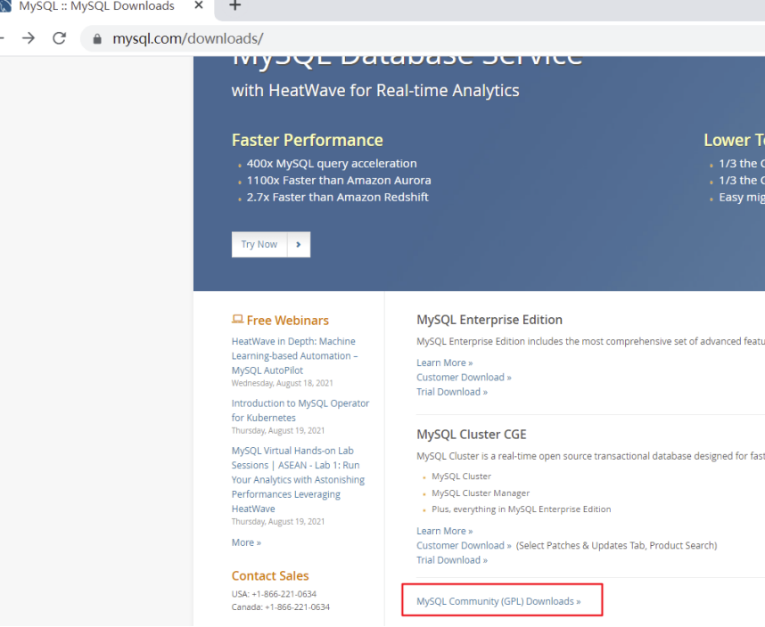

点击 MySQL Community Server

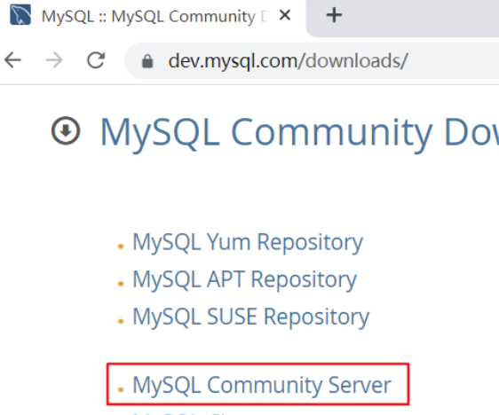

在General Availability(GA) Releases中选择适合的版本

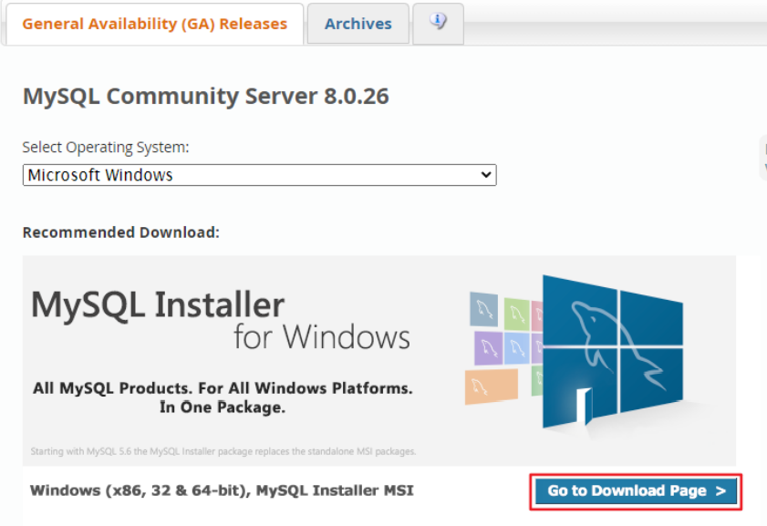

- Windows下的MySQL安装有两种安装程序
  - mysql-installer-web-community-8.0.25.0.msi 下载程序大小：2.4M；安装时需要联网安 装组件。 
  - mysql-installer-community-8.0.25.0.msi 下载程序大小：435.7M；安装时离线安装即 可。推荐。

- 这里不能直接选择CentOS 7系统的版本，所以选择与之对应的 Red Hat Enterprise Linux 

- https://downloads.mysql.com/archives/community/ 直接点Download下载RPM Bundle全量 包。包括了所有下面的组件。不需要一个一个下载了。

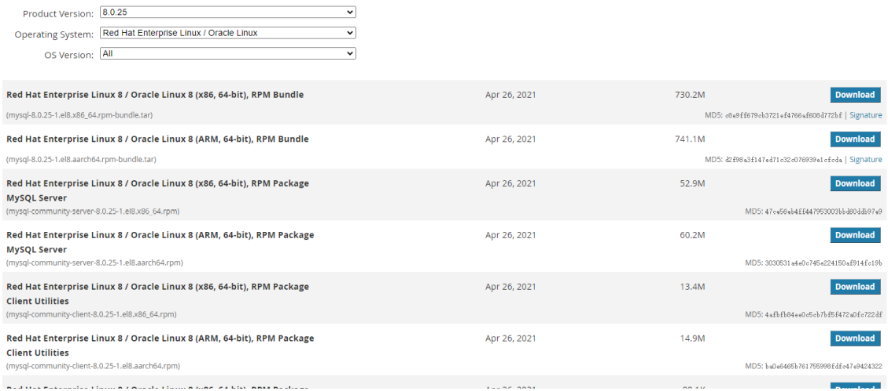

下载的tar包，用压缩工具打开


解压后rpm安装包 （红框为抽取出来的安装包)

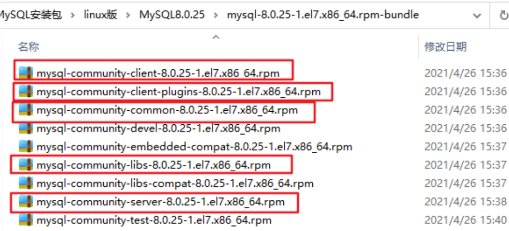

### 3、CentOS7下检查MySQL依赖

检查/tmp临时目录权限（必不可少）

由于mysql安装过程中，会通过mysql用户在/tmp目录下新建tmp_db文件，所以请给/tmp较大的权限。

```
chmod -R 777 /tmp
```

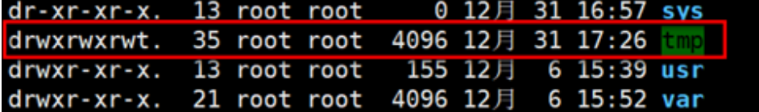

### 4、CentOS7下MySQL安装过程

将安装程序拷贝到/opt目录下

在mysql的安装文件目录下执行：（必须按照顺序执行）

```shell
rpm -ivh mysql-community-common-8.0.25-1.el7.x86_64.rpm 
rpm -ivh mysql-community-client-plugins-8.0.25-1.el7.x86_64.rpm 
rpm -ivh mysql-community-libs-8.0.25-1.el7.x86_64.rpm 
rpm -ivh mysql-community-client-8.0.25-1.el7.x86_64.rpm 
rpm -ivh mysql-community-server-8.0.25-1.el7.x86_64.rpm
```

注意: 如在检查工作时，没有检查mysql依赖环境在安装mysql-community-server会报错 

rpm 是Redhat Package Manage缩写，通过RPM的管理，用户可以把源代码包装成以rpm为扩展名的 文件形式，易于安装。

-i , --install 安装软件包 

-v , --verbose 提供更多的详细信息输出 

-h , --hash 软件包安装的时候列出哈希标记 (和 -v 一起使用效果更好)，展示进度条

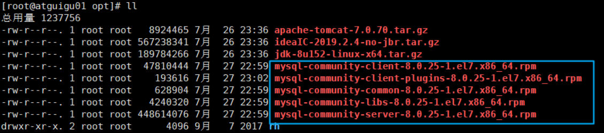

安装过程截图

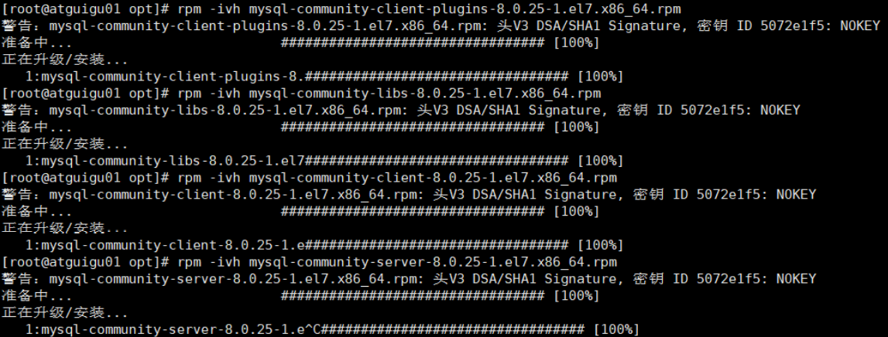

安装过程中可能的报错信息：

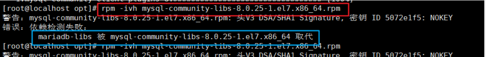

一个命令：yum remove mysql-libs 解决，清除之前安装过的依赖即可

```
测试
mysql --version 
或
mysqladmin --version
```

### 5、服务的初始化

为了保证数据库目录与文件的所有者为 mysql 登录用户，如果你是以 root 身份运行 mysql 服务，需要执 行下面的命令初始化：

mysqld --initialize --user=mysql

说明： --initialize 选项默认以“安全”模式来初始化，则会为 root 用户生成一个密码并将 该密码标记为过 期 ，登录后你需要设置一个新的密码。生成的 临时密码 会往日志中记录一份。

查看密码：

```
cat /var/log/mysqld.log
```

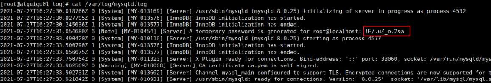

root@localhost: 后面就是初始化的密码

### 6、启动数据库

```shell
#加不加.service后缀都可以 
启动：systemctl start mysqld.service 
关闭：systemctl stop mysqld.service 
重启：systemctl restart mysqld.service 
查看状态：systemctl status mysqld.service
自启动：systemctl enable mysqld
```

### 7、mysql登录

通过 mysql -hlocalhost -P3306 -uroot -p 进行登录，在Enter password：录入初始化密码

修改密码

```mysql
ALTER USER 'root'@'localhost' IDENTIFIED BY 'new_password'；
```

```mysql
# 允许远程连接
update user set host = '%' where user ='root';
```

```mysql
# 重新加载
flush privileges;
```

配置新连接报错：错误号码 2058，分析是 mysql 密码加密方法变了。 解决方法：Linux下 mysql -u root -p 登录你的 mysql 数据库，然后 执行这条SQL：

### 8、修改字符集

```
vim /etc/my.cnf
character_set_server=utf8
systemctl restart mysqld
```

## 二十四、各级别的字符集

### 1、比较规则

MySQL有4个级别的字符集和比较规则，分别是： 

- 服务器级别 
- 数据库级别 
- 表级别 
- 列级别

执行如下SQL语句：

```
show variables like 'character%';
```

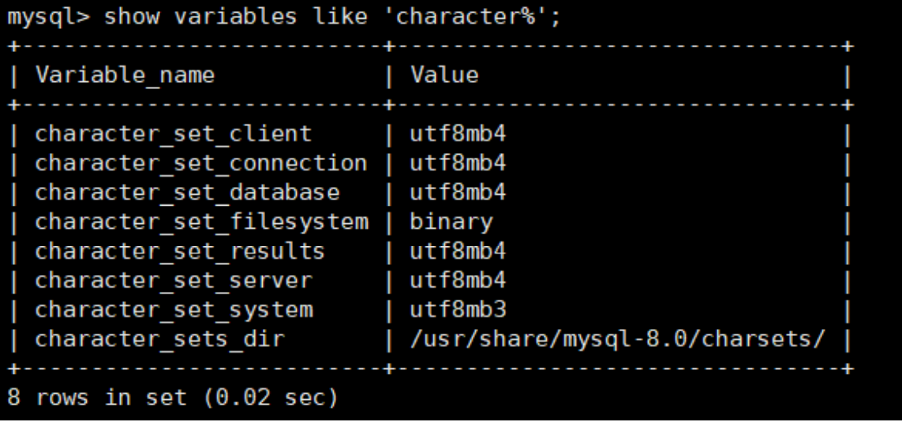

character_set_server：服务器级别的字符集 character_set_database：当前数据库的字符集 character_set_client：服务器解码请求时使用的字符集 character_set_connection：服务器处理请求时会把请求字符串从character_set_client转为 character_set_connection character_set_results：服务器向客户端返回数据时使用的字符集

### 2、服务器级别

- character_set_server ：服务器级别的字符集。 

我们可以在启动服务器程序时通过启动选项或者在服务器程序运行过程中使用 SET 语句修改这两个变量 的值。比如我们可以在配置文件中这样写： 

```shell
[server] 
character_set_server=gbk # 默认字符集 collation_server=gbk_chinese_ci #对应的默认的比较规则
```

当服务器启动的时候读取这个配置文件后这两个系统变量的值便修改了。 

### 3、数据库级别 

character_set_database ：当前数据库的字符集 

我们在创建和修改数据库的时候可以指定该数据库的字符集和比较规则，具体语法如下： 

```mysql
CREATE DATABASE 数据库名
    [[DEFAULT] CHARACTER SET 字符集名称]
    [[DEFAULT] COLLATE 比较规则名称];
ALTER DATABASE 数据库名
    [[DEFAULT] CHARACTER SET 字符集名称]
    [[DEFAULT] COLLATE 比较规则名称];
```

### 4、表级别 

我们也可以在创建和修改表的时候指定表的字符集和比较规则，语法如下： 

```mysql
[server] 
character_set_server=gbk # 默认字符集 collation_server=gbk_chinese_ci #对应的默认的比较规则
```

如果创建和修改表的语句中没有指明字符集和比较规则，将使用该表所在数据库的字符集和比较规则作 为该表的字符集和比较规则。

### 5、列级别

对于存储字符串的列，同一个表中的不同的列也可以有不同的字符集和比较规则。我们在创建和修改列 定义的时候可以指定该列的字符集和比较规则，语法如下：

```mysql
CREATE TABLE 表名(
列名 字符串类型 [CHARACTER SET 字符集名称] [COLLATE 比较规则名称],
其他列...
);
ALTER TABLE 表名 MODIFY 列名 字符串类型 [CHARACTER SET 字符集名称] [COLLATE 比较规则名称];
```

对于某个列来说，如果在创建和修改的语句中没有指明字符集和比较规则，将使用该列所在表的字符集 和比较规则作为该列的字符集和比较规则。

提示 

在转换列的字符集时需要注意，如果转换前列中存储的数据不能用转换后的字符集进行表示会发生 错误。比方说原先列使用的字符集是utf8，列中存储了一些汉字，现在把列的字符集转换为ascii的 话就会出错，因为ascii字符集并不能表示汉字字符。