#  MyBatisPlus

## 一、简介

### (一)、MyBatisPlus 介绍


MyBatis-Plus(简称 MP),是一个 MyBatis 的增强工具包，只做增强不做改变. 为简化开 发工作、提高生产率而生 我们的愿景是成为 Mybatis 最好的搭档，就像 魂斗罗 中的 1P、2P，基友搭配，效率 翻倍。

### (二)、代码及文档发布地址

官方地址: http://mp.baomidou.com 

代码发布地址: 

​	Github: https://github.com/baomidou/mybatis-plus 

​	Gitee: https://gitee.com/baomidou/mybatis-plus 

文档发布地址: http://mp.baomidou.com/#/?id=%E7%AE%80%E4%BB%8B

## 二、搭建环境并测试

### (一)、数据库

```mysql
CREATE DATABASE `mybatis_plus`;
USE `mybatis_plus`;
CREATE TABLE `user` (
	`id` BIGINT(20) NOT NULL COMMENT '主键ID', 
	`name` VARCHAR(30) DEFAULT NULL COMMENT '姓名', 
	`age` INT(11) DEFAULT NULL COMMENT '年龄', 
	`email` VARCHAR(50) DEFAULT NULL COMMENT '邮箱', 
	PRIMARY KEY (`id`)
) ENGINE=INNODB DEFAULT CHARSET=utf8;
INSERT INTO USER (id, NAME, age, email) VALUES
(1, 'Jone', 18, 'test1@baomidou.com'),
(2, 'Jack', 20, 'test2@baomidou.com'),
(3, 'Tom', 28, 'test3@baomidou.com'),
(4, 'Sandy', 21, 'test4@baomidou.com'),
(5, 'Billie', 24, 'test5@baomidou.com');
```

### (二)、创建SpringBoot工程


### (三)、导入依赖

```xml
 <!--MyBatis-plus启动器-->
    <dependency>
        <groupId>com.baomidou</groupId>
        <artifactId>mybatis-plus-boot-starter</artifactId>
        <version>3.5.1</version>
    </dependency>

    <!--lombok用于简化实体类开发-->
    <dependency>
        <groupId>org.projectlombok</groupId>
        <artifactId>lombok</artifactId>
        <optional>true</optional>
    </dependency>

    <!--mysql驱动-->
    <dependency>
        <groupId>mysql</groupId>
        <artifactId>mysql-connector-java</artifactId>
    </dependency>
</dependencies>
```

### (四)、yaml

```yaml
# 数据库连接
spring:
  datasource:
    driver-class-name: com.mysql.cj.jdbc.Driver
    url: jdbc:mysql://localhost:3306/mybatis_plus?serverTimezone=GMT%2B8&characterEncoding=utf-8&useSSL=false
    username: root
    password: Qwer1234
    type: com.zaxxer.hikari.HikariDataSource
```

注意:

#### 1、驱动类driver-class-name

spring boot 2.0(内置jdbc5驱动)，驱动类使用:

driver-class-name: com.mysql.jdbc.Driver

spring boot 2.1及以上(内置jdbc8驱动)，驱动类使用:

driver-class-name: com.mysql.cj.jdbc.Driver

否则运行测试用例的时候会有 WARN 信息

#### 2、连接地址url

MySQL5.7版本的url:

jdbc:mysql://localhost:3306/mybatis_plus?characterEncoding=utf-8&useSSL=false

MySQL8.0版本的url:

jdbc:mysql://localhost:3306/mybatis_plus?serverTimezone=GMT%2B8&characterEncoding=utf-8&useSSL=false

否则运行测试用例报告如下错误:

java.sql.SQLException: The server time zone value 'ÖÐ1ú±ê×1⁄4ʱ1⁄4ä' is unrecognized or represents more

### (五)、实体类

```java
@Data
@AllArgsConstructor
public class User {

    private Long id;
    private String name;
    private Integer age;
    private String email;
}
```

### (六)、创建Mapper继承BaseMapper

```java
@Mapper
public interface UserMapper extends BaseMapper<User> {
}
```

### (七)、加入日志

```yaml
mybatis-plus:
  configuration:
    log-impl: org.apache.ibatis.logging.stdout.StdOutImpl
```

### (八)、测试

```java
@SpringBootTest
class MybatisPlusApplicationTests {

    @Autowired
    private UserMapper userMapper;

    @Test
    void contextLoads() {
        List<User> users = userMapper.selectList(null);
        users.forEach(System.out::println);
    }
}
```


## 三、基本的CRUD

### (一)、增

#### 添加一条数据

```java
@Test
void contextLoads() {
    User user = new User();
    user.setName("张三");
    user.setAge(12);
    user.setEmail("2992455524@qq.com");
    int result = userMapper.insert(user);
    System.out.println("result:"+result);
    System.out.println("id ="  + user.getId());
}
```


### (二)、删

#### 1、根据id条件单个删除

```java
@Test
void contextLoads() {
    User user = new User();
    user.setId(1507938155972530177L);
    int result = userMapper.deleteById(user);
    System.out.println("result:"+result);
}
```


#### 2、删除条件多个删除

```java
@Test
void contextLoads() {
    User user = new User();
    user.setId(1507938155972530177L);
    List<Long> list = Arrays.asList(1L,2L,3L);
    int result = userMapper.deleteBatchIds(list);
    System.out.println("result:"+result);
}
```

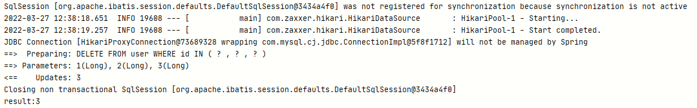

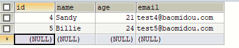

#### 3、通过Map删除

重新添加一次数据

```mysql
INSERT INTO USER (id, NAME, age, email) VALUES
(1, 'Jone', 18, 'test1@baomidou.com'),
(2, 'Jack', 20, 'test2@baomidou.com'),
(3, 'Tom', 28, 'test3@baomidou.com'),
(4, 'Sandy', 21, 'test4@baomidou.com'),
(5, 'Billie', 24, 'test5@baomidou.com');
```

编写java代码

```java
@Test
void contextLoads() {
    Map<String,Object> map = new HashMap<>();
    map.put("name","tom");
    map.put("age", 28);
    int result = userMapper.deleteByMap(map);
    System.out.println("result:"+result);
}
```


### (三)、查

#### 1、根据id查询信息

```java
@Test
void contextLoads() {
    User user1 = userMapper.selectById(1);
    System.out.println("result:"+user1);
}
```

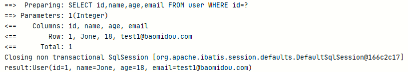

#### 2、根据多个id查询信息

```java
@Test
void contextLoads() {
    List<Long> list = Arrays.asList(1L,2L);
    List<User> users = userMapper.selectBatchIds(list);
    users.forEach(System.out::println);
}
```


#### 3、根据条件查询单个信息

```java
@Test
void contextLoads() {
    Map<String, Object> map = new HashMap<>();
    map.put("name","Jone");
    map.put("age",18);
    List<User> users = userMapper.selectByMap(map);
    users.forEach(System.out::println);
}
```

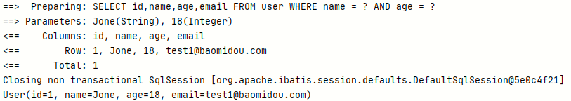

#### 4、查询所有信息

```java
@Test
void contextLoads() {
    List<User> users = userMapper.selectList(null);
    users.forEach(System.out::println);
}
```

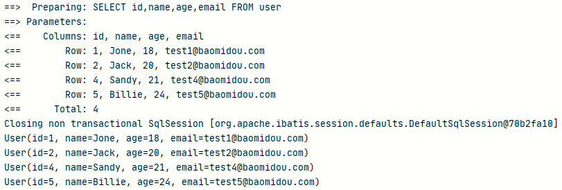

### (四)、改

#### 根据id修改内容

```java
@Test
void contextLoads() {
    User user = new User();
    user.setId(1L);
    user.setName("小马");
    user.setAge(23);
    user.setEmail("2992455524@qq.com");
    int i = userMapper.updateById(user);
    System.out.println(i);
}
```

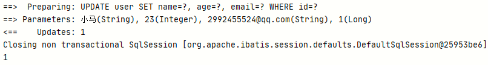

### (五)、自定义SQL语句

#### 1、DAO

```java
@Mapper
public interface UserMapper extends BaseMapper<User> {

    User mySelectById(int id);
}
```

#### 2、Mapper

```xml
<?xml version="1.0" encoding="UTF-8" ?>
<!DOCTYPE mapper PUBLIC "-//mybatis.org//DTD Mapper 3.0//EN" "http://mybatis.org/dtd/mybatis-3-mapper.dtd" >
<mapper namespace="com.ma.mybatisplus.mapper.UserMapper" >

    <select id="mySelectById" parameterType="integer" resultType="com.ma.mybatisplus.pojo.User">
        select id,name,age,email from user where id = #{id}
    </select>
</mapper>
```

#### 3、测试代码

```java
@Test
void contextLoads() {
    User user = userMapper.mySelectById(1);
    System.out.println(user);
}
```


### (六)、实现Service层

#### 1、Service

```java
public interface UserService extends IService<User> {
}
```

#### 2、实现类

```java
public class UserServiceImpl extends ServiceImpl<UserMapper, User> implements UserService {
}
```

#### 3、测试查询总条数

```java
@Autowired
private UserService userService;

@Test
void contextLoads() {
    long count = userService.count();
    System.out.println(count);
}
```


#### 4、测试批量插入数据

```java
@Test
void contextLoads() {
    List<User> list = new ArrayList<>();
    for (int i=0;i<=10;i++){
        User user = new User(10L+i, "张三"+i, 13+i, "aaaaa"+i+"@qq.com");
        list.add(user);
    }

    boolean b = userService.saveBatch(list);
    System.out.println(b);
}
```


## 四、常用注解

### (一)、@TableName

#### 1、概念

此注解解决的问题是:当你的实体类和数据库中的表名不一致时mybatis-plus会报错,然后使用@TableName注解设置Value值为数据库表名就可以解决问题

#### 2、使用

- 先将数据库名改为t_user

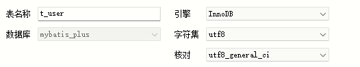

- 然后使用@TableName注解

```java
@Data
@AllArgsConstructor
@NoArgsConstructor
@TableName("t_user")
public class user {

    private Long id;
    private String name;
    private Integer age;
    private String email;
}
```

#### 3、测试

```java
@Test
void contextLoads() {
    List<Admin> admins = userMapper.selectList(null);
    admins.forEach(System.out::println);
}
```

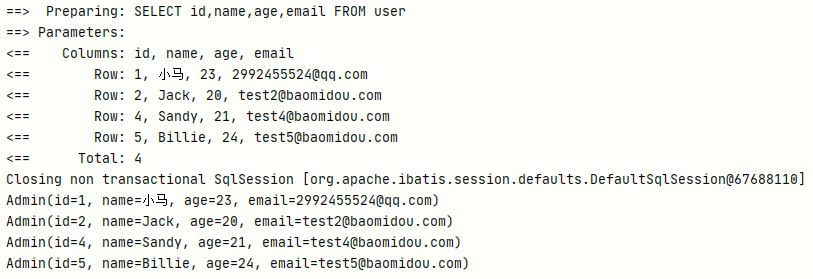

#### 4、使用全局前缀

把实体类的@TableName去掉然后在application中添加

```yaml
mybatis-plus:
  global-config:
    db-config:
      table-prefix: t_
```

再测试


### (二)、@Tableld

#### 1、概念

mybatis-plus默认将id作为主键,通过雪花算法生成id,如果吧id改为uid的话mybatis-plus就不认识了,抛出异常

#### 2、使用

将实体类中的id添加注解

```java
@Data
@AllArgsConstructor
@NoArgsConstructor
public class User {

    @TableId("uid")
    private Long id;
    private String name;
    private Integer age;
    private String email;
}
```

把数据库主键改为uid

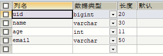

#### 3、测试

```java
@Test
void contextLoads() {
    User user = new User();
    user.setName("张三");
    user.setAge(12);
    user.setEmail("2992455524@qq.com");
    int result = userMapper.insert(user);
    System.out.println("result:"+result);
}
```


#### 4、TableId的2个属性

- value:对应数据库主键的字段

- type:生成的算法是什么
  - IdType.ASSIGN_ID(雪花算法)
  - IdType.AUTO(自增算法)

#### 5、配置全局主键生成策略

```yaml
mybatis-plus:
  global-config:
    db-config:
      # 设置统一的主键生成策略
      id-type: auto
```

### (三)、@TableField

#### 1、概念

解决实体类属性和数据库字段不一致问题

#### 2、使用

将name改为username添加注解

```java
@Data
@AllArgsConstructor
@NoArgsConstructor
public class User {

    @TableId("uid")
    private Long uid;
    @TableField("name")
    private String userName;
    private Integer age;
    private String email;
}
```

#### 3、测试

```java
@Test
void contextLoads() {
    User user = new User();
    user.setUserName("张三");
    user.setAge(12);
    user.setEmail("2992455524@qq.com");
    int result = userMapper.insert(user);
    System.out.println("result:"+result);
}
```


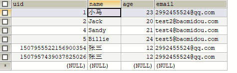

### (四)、@TableLogic

#### 1、概念

有的时候删除不是真的删除,而是将一个数据库中某个字段修改,比如0是未删除1是逻辑删除,当你逻辑删除一条数据的时候,mybatis-plus会自动过滤这个数据,并如果使用mybatis-plus删除数据的时候delete语句会变成updata更新逻辑删除字段

#### 2、使用

数据库添加新列is_deleted

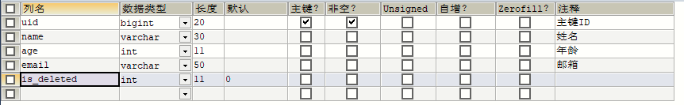

实体类添加新属性

```java
@Data
@AllArgsConstructor
@NoArgsConstructor
public class User {

    @TableId("uid")
    private Long uid;
    @TableField("name")
    private String userName;
    private Integer age;
    private String email;
    private Integer isDeleted;
}
```

#### 3、测试删除并查询数据

```java
@Test
void contextLoads() {
    User user = new User();
    user.setUid(1507957439037825026L);
    int result = userMapper.deleteById(user);
    System.out.println("result:" + result);
}
```

**delete变为了update**

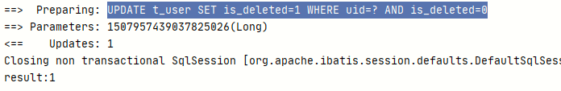

**数据库也为真正删除**


**再次查询所有信息,自动过滤了1的信息**


## 五、条件构造器和常用接口

### (一)、wrapper介绍

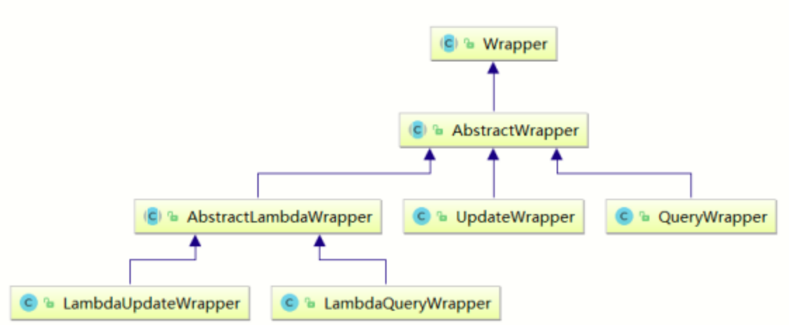

Wrapper ： **条件构造抽象类**，最顶端父类 

- AbstractWrapper ： 用于查询条件封装，生成 sql 的 where 条件 

- - QueryWrapper ： 查询条件封装 
  - UpdateWrapper ： Update 条件封装 
  - AbstractLambdaWrapper ： 使用Lambda 语法 

- - - LambdaQueryWrapper ：用于Lambda语法使用的查询Wrapper 
    - LambdaUpdateWrapper ： Lambda 更新封装Wrapper


### (二)、QueryWrapper

#### 1、组装查询条件

```java
@Test
void contextLoads() {
    //查询用户包含a,年龄在20到30之间，邮箱信息不为null的用户信息
    QueryWrapper<User> queryWrapper = new QueryWrapper<>();
    queryWrapper.like("name","a").between("age", 20, 30).isNotNull("email");
    List<User> users = userMapper.selectList(queryWrapper);
    users.forEach(System.out::println);
}
```

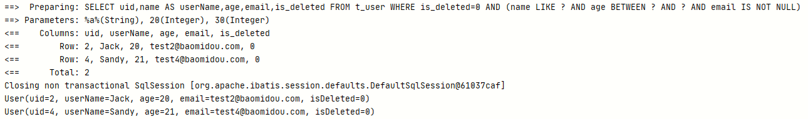

#### 2、组装排序条件

```java
@Test
void contextLoads() {
    //组装排序条件 查询用户信息，按照年龄的降序排序，若年龄相同，则按照id升序排序
    QueryWrapper<User> queryWrapper = new QueryWrapper<>();
    queryWrapper.orderByAsc("age").orderByDesc("uid");
    List<User> users = userMapper.selectList(queryWrapper);
    users.forEach(System.out::println);
}
```


#### 3、组装删除条件

**数据库添加邮箱为空的记录**

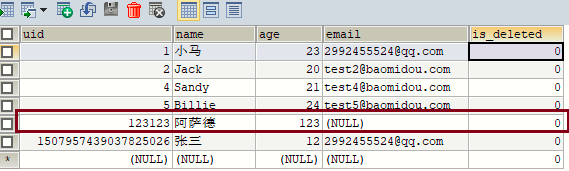

```java
@Test
void contextLoads() {
    //组装删除条件 删除邮箱地址为null的用户信息
    QueryWrapper<User> queryWrapper = new QueryWrapper<>();
    queryWrapper.isNull("email");
    int users = userMapper.delete(queryWrapper);
    System.out.println(users);
}
```


**删除后**

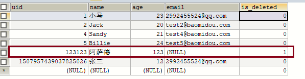

#### 4、组装修改条件

```java
@Test
void contextLoads() {
    // 组装修改条件  将(年龄大于20并且用户名中包含有a)或邮箱为null的用户信息修改
    QueryWrapper<User> queryWrapper = new QueryWrapper<>();
    queryWrapper.between("age", 20, 30).like("name","a").or().isNull("email");
    User user = new User();
    user.setUserName("条件修改名");
    int users = userMapper.update(user, queryWrapper);
    System.out.println(users);
}
```

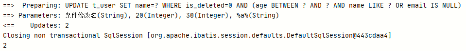

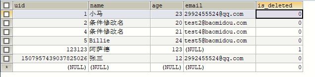

#### 5、条件的优先级

修改数据库添加条件数据


```java
@Test
void contextLoads() {
    //  将用户名中包含a并且(年龄大于20或邮箱为null)的用户信息修改
    QueryWrapper<User> queryWrapper = new QueryWrapper<>();
    queryWrapper.like("name", "a").and(i->i.gt("age", 20).isNull("email"));
    User user = new User();
    user.setUserName("条件修改名");
    int users = userMapper.update(user, queryWrapper);
    System.out.println(users);
}
```


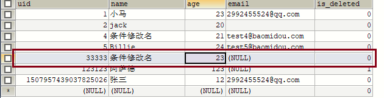

#### 6、组装select子句

```java
@Test
void contextLoads() {
    // 组装select字句 查询用户名的用户名、年龄、邮箱信息
    QueryWrapper<User> queryWrapper = new QueryWrapper<>();
    queryWrapper.select("name","age","email");
    List<Map<String, Object>> users = userMapper.selectMaps(queryWrapper);
    users.forEach(System.out::println);
}
```

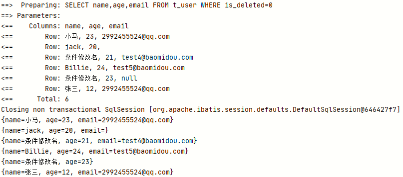

#### 7、实现子查询

```java
@Test
void contextLoads() {
    // 组装select字句 查询用户名的用户名、年龄、邮箱信息
    QueryWrapper<User> queryWrapper = new QueryWrapper<>();
    queryWrapper.inSql("age","select age from t_user where age>20");
    List<User> users = userMapper.selectList(queryWrapper);
    users.forEach(System.out::println);
}
```

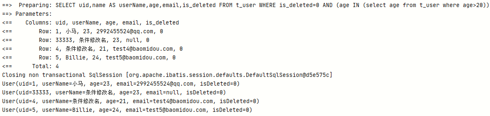

### (三)、UpdataWrapper

**添加数据**


```java
@Test
void contextLoads() {
    UpdateWrapper<User> updateWrapper = new UpdateWrapper<>();
    updateWrapper.like("name", "a")
            .and(i->i.gt("age", 20).or().isNull("email"));
    updateWrapper.set("name", "updateWrapper").set("email", "2992455524@qq.com");
    int update = userMapper.update(null, updateWrapper);
    System.out.println(update);
}
```


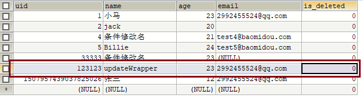

### (四)、Condition

#### 1、概念

在真正开发的过程中，组装条件是常见的功能，**而这些条件数据来源于用户输入，是可选的，因此我们在组装这些条件时，必须先判断用户是否选择了这些条件**，若选择则需要组装该条件，若 

没有选择则一定不能组装，以免影响SQL执行的结果

#### 2、本来的判断

需要一步一步判断然后再操作数据库

```java
@Test
void contextLoads() {
    String username = "a";
    Integer ageBegin = null;
    Integer ageEnd = 30;
    QueryWrapper<User> queryWrapper = new QueryWrapper<>();
    if (StringUtils.isNotBlank(username)) {
        // isNotBlank判断某个字符串是否不为空字符串、不为null、不为空白符
        queryWrapper.like("user_name", username);
    }
    if (ageBegin != null) {
        queryWrapper.gt("age", ageBegin);
    }
    if (ageEnd != null) {
        queryWrapper.le("age", ageEnd);
    }
    List<User> list = userMapper.selectList(queryWrapper);
    list.forEach(System.out::println);
}
```

#### 3、Mybatis的简写

```java
@Test
void contextLoads() {
    String username = "a";
    Integer ageBegin = null;
    Integer ageEnd = 30;
    QueryWrapper<User> queryWrapper = new QueryWrapper<>();
    // 判断是否不为空,null,空白字符,如果都没有就查询是否user_name包含username
    queryWrapper.like(StringUtils.isNotBlank(username), "user_name", username)
        	// 判断ageBegin是否等于空,如果不等于空判断age是否大于ageBegin
            .gt(ageBegin != null, "age", ageBegin)
        	// 判断ageEnd是否为空,如果不为空判断age是否小于ageEnd
            .le(ageEnd != null, "age", ageEnd);
    List<User> list = userMapper.selectList(queryWrapper);
    list.forEach(System.out::println);
}
```

### (五)、LambdaQueryWrapper

为了不手动写数据库字段防止错误,使用lambda表达式获取实体类属性,然后mybatis-plus会自动去数据库寻找对应的字段然后判断

```java
@Test
void contextLoads() {
    String username = "a";
    Integer ageBegin = null;
    Integer ageEnd = 30;
    LambdaQueryWrapper<User> queryWrapper = new LambdaQueryWrapper<>();
    // 判断是否不为空,null,空白字符,如果都没有就查询是否user_name包含username
    queryWrapper.like(StringUtils.isNotBlank(username), User::getUserName, username)
        	// 判断ageBegin是否等于空,如果不等于空判断age是否大于ageBegin
            .gt(ageBegin != null, User::getAge, ageBegin)
        	// 判断ageEnd是否为空,如果不为空判断age是否小于ageEnd
            .le(ageEnd != null, User::getAge, ageEnd);
    List<User> list = userMapper.selectList(queryWrapper);
    list.forEach(System.out::println);
}
```

### (六)、LambdaUpdateWrapper

lambdaUpdateWrapper的意思和lambdaQueryWrapper一样,为了防止写错数据库字段

```java
@Test
void contextLoads() {
    LambdaUpdateWrapper<User> updateWrapper = new LambdaUpdateWrapper<>();
    updateWrapper.like(User::getUserName, "a")
            //lambda表达式内的逻辑优先运算
            .and(i -> i.gt(User::getAge, 20).or().isNull(User::getEmail));
    updateWrapper.set(User::getUserName, "小黑").set(User::getEmail, "abc@atguigu.com");
    int result = userMapper.update(null, updateWrapper);
    System.out.println("result = " + result);
}
```

## 六、插件

### (一)、分页插件

MyBatis Plus自带分页插件，只要简单的配置即可实现分页功能

#### 1、添加配置类

```java
@Configuration
public class MybatisPageConfig {

        @Bean
        public MybatisPlusInterceptor mybatisPlusInterceptor() {
            MybatisPlusInterceptor interceptor = new MybatisPlusInterceptor();
            interceptor.addInnerInterceptor(new PaginationInnerInterceptor(DbType.H2));
            return interceptor;
        }
}
```

#### 2、数据库添加数据

```java
@Test
void contextLoads() {
    List<User> list = new ArrayList<>();
    for (int i=0;i<=10;i++){
        User user = new User(10L+i, "张三"+i, 13+i, "aaaaa"+i+"@qq.com",0);
        list.add(user);
    }
    boolean b = userService.saveBatch(list);
    System.out.println(b);
}
```


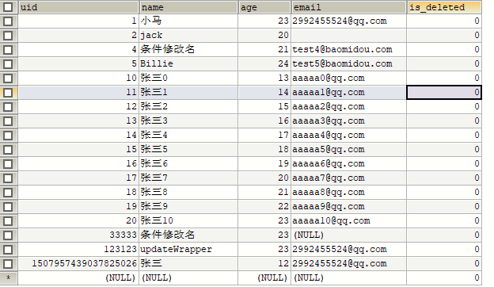

#### 3、测试

```java
@Test
void contextLoads() {
    Page<User> page = new Page<>(2, 3);
    Page<User> userPage = userMapper.selectPage(page, null);
    System.out.println(userPage.getRecords());
    System.out.println("总页数:"  + page.getPages());
    System.out.println("总记录数" + page.getTotal());
    System.out.println("是否有上一页" + page.hasNext());
    System.out.println("是否有下一页:" + page.hasPrevious());
}
```

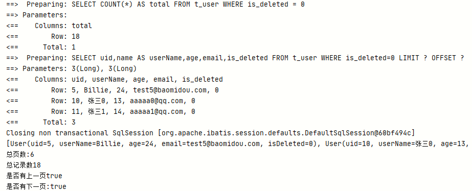

#### 4、自定义分页插件

Dao层

```java
@Mapper
public interface UserMapper extends BaseMapper<User> {
    Page<User> selectPageVo(@Param("page") Page<User> page, @Param("age") Integer age);
}
```

Mapper

```xml
<?xml version="1.0" encoding="UTF-8" ?>
<!DOCTYPE mapper PUBLIC "-//mybatis.org//DTD Mapper 3.0//EN" "http://mybatis.org/dtd/mybatis-3-mapper.dtd" >
<mapper namespace="com.ma.mybatisplus.mapper.UserMapper" >
    <!--Page<User> selectPageVo(@Param("page") Page<User> page, @Param("age") Integer age);-->
    <select id="selectPageVo" resultType="com.ma.mybatisplus.pojo.User">
    select uid ,name ,age,email from t_user where age > #{age}
</select>
</mapper>
```

测试

```java
@Test
void contextLoads() {
    Page<User> page = new Page<>(1, 5);
    userMapper.selectPageVo(page, 20);
    //获取分页数据
    List<User> list = page.getRecords();
    list.forEach(System.out::println);
    System.out.println("当前页:"+page.getCurrent());
    System.out.println("每页显示的条数:"+page.getSize());
    System.out.println("总记录数:"+page.getTotal());
    System.out.println("总页数:"+page.getPages());
    System.out.println("是否有上一页:"+page.hasPrevious());
    System.out.println("是否有下一页:"+page.hasNext());
}
```


### (二)、乐观锁

#### 1、场景

一件商品，成本价是80元，售价是100元。老板先是通知小李，说你去把商品价格增加50元。小 

李正在玩游戏，耽搁了一个小时。正好一个小时后，老板觉得商品价格增加到150元，价格太 

高，可能会影响销量。又通知小王，你把商品价格降低30元。 

此时，小李和小王同时操作商品后台系统。小李操作的时候，系统先取出商品价格100元；小王 

也在操作，取出的商品价格也是100元。小李将价格加了50元，并将100+50=150元存入了数据 

库；小王将商品减了30元，并将100-30=70元存入了数据库。是的，如果没有锁，小李的操作就 

完全被小王的覆盖了。 

现在商品价格是70元，比成本价低10元。几分钟后，这个商品很快出售了1千多件商品，老板亏1 

万多。

#### 2、乐观锁和悲观锁

上面的故事，如果是乐观锁，小王保存价格前，会检查下价格是否被人修改过了。如果被修改过了，则重新取出的被修改后的价格，150元，这样他会将120元存入数据库。 

如果是悲观锁，小李取出数据后，小王只能等小李操作完之后，才能对价格进行操作，也会保证 

最终的价格是120元。

#### 3、创建新的数据表,并添加数据

```mysql
CREATE TABLE t_product
(
	id BIGINT(20) NOT NULL COMMENT '主键ID',
	NAME VARCHAR(30) NULL DEFAULT NULL COMMENT '商品名称', price INT(11) DEFAULT 0 COMMENT '价格',
	VERSION INT(11) DEFAULT 0 COMMENT '乐观锁版本号', PRIMARY KEY (id)
);
INSERT INTO t_product (id, NAME, price) VALUES (1, '外星人笔记本', 100);
```

#### 4、添加实体类

```java
@Data
public class Product {
    private Long id;
    private String name;
    private Integer price;
    private Integer version;
}
```

#### 5、Dao接口

```java
@Repository
public interface ProductMapper extends BaseMapper<Product> {

}
```

#### 6、测试

```java
@Autowired
private ProductMapper productMapper;

@Test
void contextLoads() {
    // 1.小李查询商品价格
    Product productLi = productMapper.selectById(1);
    System.out.println("小李查询的商品价格:" + productLi.getPrice());

    // 2.小王查询商品价格
    Product productWang = productMapper.selectById(1);
    System.out.println("小王查询的商品价格:" + productWang.getPrice());

    // 3.小李商品价格+50
    productLi.setPrice(productLi.getPrice() + 50);
    productMapper.updateById(productLi);

    // 4.小王将商品价格-30
    productWang.setPrice(productWang.getPrice() - 30);
    int result = productMapper.updateById(productWang);

    // 5.老板查询商品价格
    Product productBoss = productMapper.selectById(1);
    System.out.println("老板查询的商品价格:" + productBoss.getPrice());
}
```

最后结果应该是120,由于并发操作所以变为70


#### 7、启动乐观锁

1. 数据库添加version字段

   

2. 实体类添加属性

   ```java
   @Data
   public class Product {
       private Long id;
       private String name;
       private Integer price;
       @Version
       private Integer version;
   }
   ```

3. 添加配置类信息

   ```java
   @Configuration
   public class MybatisPageConfig {
   
           @Bean
           public MybatisPlusInterceptor mybatisPlusInterceptor() {
               MybatisPlusInterceptor interceptor = new MybatisPlusInterceptor();
               interceptor.addInnerInterceptor(new PaginationInnerInterceptor(DbType.H2));
               interceptor.addInnerInterceptor(new OptimisticLockerInnerInterceptor());
               return interceptor;
           }
   }
   ```

4. 运行测试

   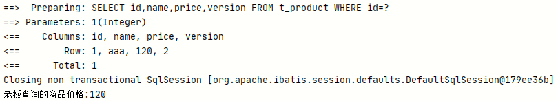

   **乐观锁生效**

## 七、通用枚举

### (一)、概念

表中的有些**字段值是固定的**，例如性别(男或女)，此时我们可以使用MyBatis-Plus的通用枚举 来实现

### (二)、实现

#### 1、数据库添加sex字段


#### 2、创建枚举类

```java
@Getter
public enum SexEnum  {

    MALE(1,"男"),
    FEMALE(2,"女");

    @EnumValue
    private final Integer sex;
    private final String sexName;

    SexEnum(Integer sex, String sexName) {
        this.sex = sex;
        this.sexName = sexName;
    }
}
```

#### 3、包扫描枚举类

```yaml
mybatis-plus:
  configuration:
    log-impl: org.apache.ibatis.logging.stdout.StdOutImpl
  global-config:
    db-config:
      table-prefix: t_
  type-enums-package: com\ma\mybatisplus\enums
```

#### 4、测试

```java
@Test
void contextLoads() {
    User user = new User();
    user.setUserName("admin");
    user.setAge(33);
    user.setSex(SexEnum.MALE);
    int result = userMapper.insert(user);
    System.out.println("result = " + result);
}
```


查询数据

```java
@Test
void contextLoads() {
    User user = userMapper.selectById(1508603118709989377L);
    System.out.println(user);
}
```

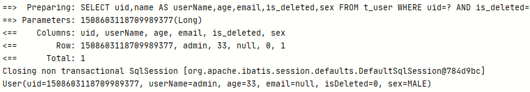

## 八、代码生成器

### (一)、引入依赖

```xml
<!--mybatis代码生成插件-->
<dependency>
    <groupId>com.baomidou</groupId>
    <artifactId>mybatis-plus-generator</artifactId>
    <version>3.5.1</version>
</dependency>
<!--小弟-->
<dependency>
    <groupId>org.freemarker</groupId>
    <artifactId>freemarker</artifactId>
    <version>2.3.31</version>
</dependency>
```

### (二)、创建表

```mysql
CREATE TABLE t_admin(
	id INT,
	username VARCHAR(20),
	PASSWORD VARCHAR(20)
)
```

### (三)、生成类

```java
public class FastAutoGeneratorTest {
    public static void main(String[] args) {
        // 设置我们需要创建在哪的路径
        String xmlPath = "F:\\mybatis-plus\\src\\main\\resources\\mapper";
        String Path = "F:\\mybatis-plus\\src\\main\\java";
        // 数据源
        FastAutoGenerator.create("jdbc:mysql://localhost:3306/mybatis_plus?serverTimezone=GMT%2B8&characterEncoding=utf-8&useSSL=false", "root", "Qwer1234")
                .globalConfig(builder -> {
                    builder.author("ma") // 设置作者
                            // .enableSwagger() // 开启 swagger 模式
                            .fileOverride() // 覆盖已生成文件
                            .outputDir(Path); // 指定输出目录
                })
                .packageConfig(builder -> {
                    builder.parent("com.ma") // 设置父包名
                            .moduleName("mybatisplus") // 设置父包模块名
                            .pathInfo(Collections.singletonMap(OutputFile.mapperXml, xmlPath)); // 设置mapperXml生成路径
                })
                .strategyConfig(builder -> {
                    builder.addInclude("t_admin") // 设置需要生成的表名
                            .addTablePrefix("t_", "c_"); // 设置过滤表前缀
                }).templateEngine(new FreemarkerTemplateEngine()) // 使用Freemarker 引擎模板，默认的是Velocity引擎模板
                .execute();
    }
}
```

### (四)、查看

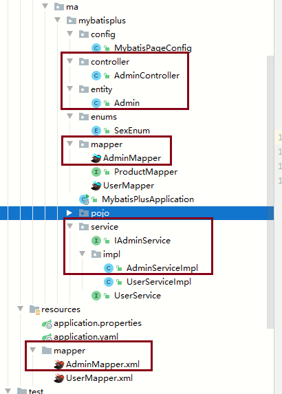

## 九、多数据源

### (一)、创建数据库及表

```mysql
# 创建新的数据库
CREATE DATABASE `mybatis_plus_1`;
# 进入数据库
use `mybatis_plus_1`;
# 创建product表
CREATE TABLE t_product
(
	id BIGINT(20) NOT NULL COMMENT '主键ID',
	name VARCHAR(30) NULL DEFAULT NULL COMMENT '商品名称', price INT(11) DEFAULT 0 COMMENT '价格',
	version INT(11) DEFAULT 0 COMMENT '乐观锁版本号', PRIMARY KEY (id)
);
# 插入数据
INSERT INTO product (id, NAME, price) VALUES (1, '外星人笔记本', 100);
# 删除mybatis-plus表中的product表
use mybatis_plus;
DROP TABLE IF EXISTS product;
```

### (二)、引入依赖

```xml
<!--多数据源依赖-->
<dependency>
    <groupId>com.baomidou</groupId>
    <artifactId>dynamic-datasource-spring-boot-starter</artifactId>
    <version>3.5.0</version>
</dependency>
```

### (三)、application

```yaml
spring:
  datasource:
    # 配置数据源信息 datasource:
    dynamic:
      # 设置默认的数据源或者数据源组,默认值即为master
      primary: master
      # true的话精准查询如果没找到报错,false如果没找到用master
      strict: false
      datasource:
        master:
          url: jdbc:mysql://localhost:3306/mybatis_plus?serverTimezone=GMT%2B8&characterEncoding=utf-8&useSSL=false
          driver-class-name: com.mysql.cj.jdbc.Driver
          username: root
          password: 'Qwer1234'
        slave_1:
          # 我的数据库是8.0.27 5版本的可以使用jdbc:mysql://localhost:3306/mybatis_plus?characterEncoding=utf-8&useSSL=false
          url: jdbc:mysql://localhost:3306/mybatis_plus_1?serverTimezone=GMT%2B8&characterEncoding=utf-8&useSSL=false
          driver-class-name: com.mysql.cj.jdbc.Driver
          username: root
          password: 'Qwer1234'
```

### (四)、Service实现类添加注解

UserServiceImpl

```java
@Component
@DS("master")
public class UserServiceImpl extends ServiceImpl<UserMapper, User> implements UserService {
}
```

ProductServiceImpl

```java
@Component
@DS("slave_1")
public class ProductServiceImpl extends ServiceImpl<ProductMapper, Product> implements ProductService {
}
```

### (五)、测试

```java
@SpringBootTest
class MybatisPlusApplicationTests {

    @Autowired
    private UserService userService;
    @Autowired
    private ProductService productService;

    @Test
    void contextLoads() {
        Product product = productService.getById(1);
        User user = userService.getById(1);
        System.out.println(product);
        System.out.println(user);
    }
}
```


## 十、MybatisX插件


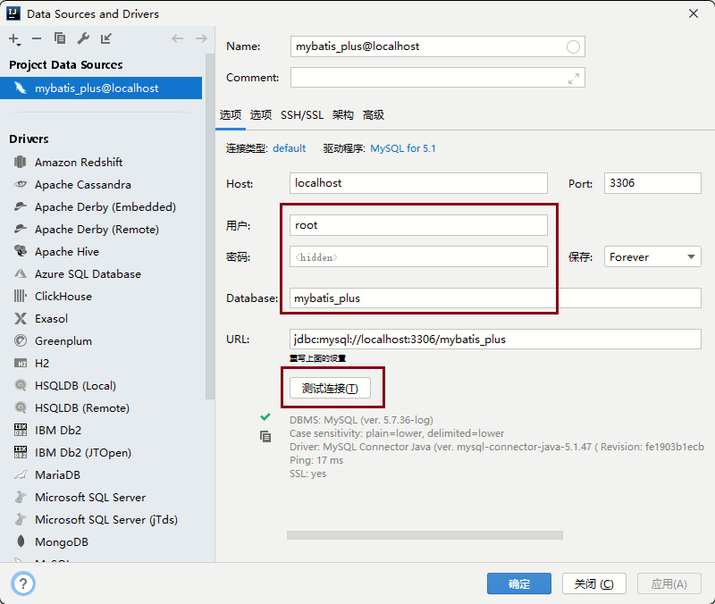


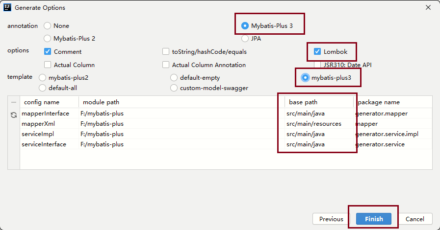

