# Mybatis

## 一、环境配置

### (一)、Mybatis下载:

https://github.com/mybatis/mybatis-3/releases

### (二)、Mybatis的Maven:

```xml
<!-- https://mvnrepository.com/artifact/org.mybatis/mybatis -->
<dependency>
    <groupId>org.mybatis</groupId>
    <artifactId>mybatis</artifactId>
    <version>3.5.7</version>
</dependency>
```

### (三)、中文文档:

https://mybatis.org/mybatis-3/zh/getting-started.html

## 二、第一个Mybatis搭建

### (一) 、搭建数据库

```mysql
CREATE mybatis;
CREATE TABLE `user`(
         `id` INT(20) NOT NULL PRIMARY KEY,
         `name` VARCHAR(30) DEFAULT NULL,
         `pwd` VARCHAR(30) DEFAULT NULL,
 
)ENGINE=INNODB DEFAULT CHARSET=utf8;
INSERT INTO `user` (`id`,`name`,`pwd`) VALUES 
(1,'马佳盛','12345'),
(2,'王子沨','12345'),
(3,'王宝延','12345');
```

### (二)、创建IDEA项目

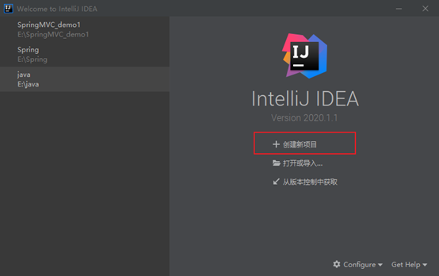

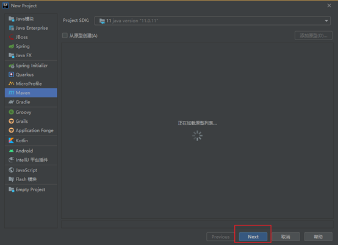

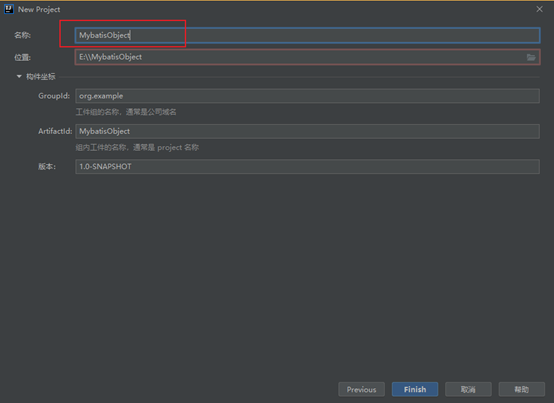

### (三)、pom.xml导入依赖

```xml
<dependencies>
    <!--mysql驱动-->
    <dependency>
        <groupId>mysql</groupId>
        <artifactId>mysql-connector-java</artifactId>
        <version>5.1.37</version>
    </dependency>
    <!--mybatis驱动-->
    <dependency>
        <groupId>org.mybatis</groupId>
        <artifactId>mybatis</artifactId>
        <version>3.5.7</version>
    </dependency>
    <!--junit-->
    <dependency>
        <groupId>junit</groupId>
        <artifactId>junit</artifactId>
        <version>4.11</version>
        <scope>test</scope>
    </dependency>
</dependencies>
<properties>
    <project.build.sourceEncoding>UTF-8</project.build.sourceEncoding>
    <maven.compiler.encoding>UTF-8</maven.compiler.encoding>
    <java.version>11</java.version>
    <maven.compiler.source>11</maven.compiler.source>
    <maven.compiler.target>11</maven.compiler.target>
</properties>

<build>
    <resources>
        <resource>
            <directory>src/main/resources</directory>
            <includes>
                <include>**/*.properties</include>
                <include>**/*.xml</include>
            </includes>
            <filtering>true</filtering>
        </resource>
        <resource>
            <directory>src/main/java</directory>
            <includes>
                <include>**/*.properties</include>
                <include>**/*.xml</include>
            </includes>
            <filtering>true</filtering>
        </resource>
    </resources>
</build>
```

### (四)、创建子项目

 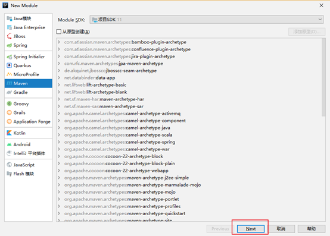

 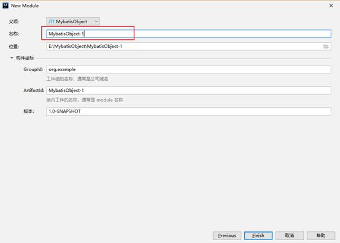

### (五)、在main—resource—创建mybatis-config.xml

 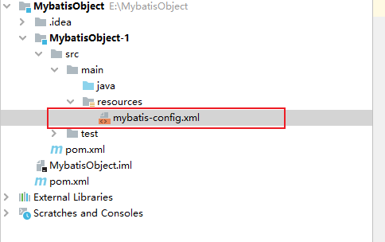

### (六)、Mybatis-config.xml配置

```xml
<!--Mybatis核心配置-->
<configuration>
    <!--环境配置-->
    <environments default="development">
        <environment id="development">
            <!--事务使用的方式-->
            <transactionManager type="JDBC"/>
            <!--数据源-->
            <dataSource type="POOLED">
                <property name="driver" value="com.mysql.jdbc.Driver"/>
                <property name="url" value="jdbc:mysql://localhost:3306/mybatis?useSSL=true&amp;useUniCode&amp;characterEncoding=UTF-8"/>
                <property name="username" value="root"/>
                <property name="password" value="Qwer1234"/>
            </dataSource>
        </environment>
    </environments>
   <mappers>
        <mapper resource="com/ma/dao/UserMappingImpl.xml"/>
    </mappers>
</configuration>
```

### (七)、创建pojo实体类

```java
public class User {

    private Integer id;
    private String name;
    private String pwd;
```

### (八)、创建接口类

```java
package com.ma.dao;

import com.ma.pojo.User;

import java.util.List;

public interface UserMapper {

    /**
     *  查询数据库所有用户信息
     * @return 返回用户信息List
     */
    List<User> getUserAlls();
}
```

### (九)、XML方式实现接口

```xml
<!--创建映射关系指向接口-->
<mapper namespace="com.ma.dao.UserMapper">
    <!--
        查询所有用户信息
            id为接口中的方法名   resultType   为返回值类型 返回一个
                              resultMap   为返回值类型 返回多个
    -->
    <select id="getUserAlls" resultType="com.ma.pojo.User">
        select id,name,pwd from user
  </select>
</mapper>
```

### (十)、测试类

```java
SqlSession sqlSession = ReadFileGetconnect.getSession();

@Test
public void test1(){
    UserMapper mapper = sqlSession.getMapper(UserMapper.class);
    List<User> userAlls = mapper.getUserAlls();
    for (User userAll : userAlls) {
        System.out.println(userAll);
    }
}
```

## 三、增删查改

### (一)接口

```java
public interface UserMapper {

    /**
     *  查询数据库所有用户信息
     * @return 返回用户信息List
     */
    List<User> getUserAlls();

    /**
     * 根据id查询员工信息
     * @param id 员工id
     * @return 返回user
     */
    User getUserById(Integer id);

    /**
     * 添加用户信息
     * @param user 添加的用户
     * @return 成功1 失败0
     */
    int insertUser(User user);

    /**
     * 更新用户信息
     * @param user 用户信息
     * @return 成功1 失败0
     */
    int updateUser(User user);

    /**
     * 根据id删除用户
     * @param id 用户id
     * @return 成功1 失败0
     */
    int delUser(Integer id);
}
```

### (二) 、XML实现接口

```xml
<!--创建映射关系指向接口-->
<mapper namespace="com.ma.dao.UserMapper">
    <!--查询所有用户信息-->
    <select id="getUserAlls" resultType="com.ma.pojo.User">
        select id,name,pwd from mybatis.user;
    </select>

    <!--根据id查询用户信息:parameterType参数类型-->
    <select id="getUserById" parameterType="integer" resultType="com.ma.pojo.User">
        select id,name,pwd from mybatis.user where id = #{id}
    </select>

    <!--插入用户-->
    <insert id="insertUser" parameterType="com.ma.pojo.User">
        insert into mybatis.user (id,name,pwd) values (#{id},#{name},#{pwd})
    </insert>

    <!--更新用户-->
    <update id="updateUser" parameterType="com.ma.pojo.User">
        update mybatis.user set name = #{name},pwd=#{pwd} where id=#{id}
    </update>

    <!--删除用户-->
    <delete id="delUser" parameterType="int">
        delete from mybatis.user where id=#{id}
    </delete>
</mapper>
```

### (三)、测试

```java
public class TextUserMapper {

    SqlSession sqlSession = ReadFileGetconnect.getSession();

    //查询所有信息
    @Test
    public void test1(){
        UserMapper mapper = sqlSession.getMapper(UserMapper.class);
        List<User> userAlls = mapper.getUserAlls();
        for (User userAll : userAlls) {
            System.out.println(userAll);
        }
    }

    //根据id查询信息
    @Test
    public void test2() {
        UserMapper mapper = sqlSession.getMapper(UserMapper.class);
        User userById = mapper.getUserById(1);
        System.out.println(userById);
        sqlSession.close();
    }

    //添加测试
    @Test
    public void test3() {
        UserMapper mapper = sqlSession.getMapper(UserMapper.class);
        int result = mapper.insertUser(new User(4, "哈哈", "123456"));
        if(result > 0){
            System.out.println("添加成功");
        }
        sqlSession.commit();
        sqlSession.close();
    }

    //修改测试
    @Test
    public void test4() {
        UserMapper mapper = sqlSession.getMapper(UserMapper.class);
        int result = mapper.updateUser(new User(4, "hehe", "123123"));
        if(result > 0){
            System.out.println("修改成功");
        }
        sqlSession.commit();
        sqlSession.close();
    }

    //删除测试
    @Test
    public void test5() {
        UserMapper mapper = sqlSession.getMapper(UserMapper.class);
        int result = mapper.delUser(4);
        if(result > 0){
            System.out.println("删除成功");
        }
        sqlSession.commit();
        sqlSession.close();
    }
}
```

## 四、万能的Map,Map作为参数操作

### (一) 、说明

当查询的条件为少数的话就可以使用map,而不用创建对象,这样节省资源

以查询添加为例

### (二)、接口

```java
public interface UserMapper {
 
/**
     * 使用map根据id查询
     * @param map map
     * @return 返回用户信息
     */
    User getUserByIdTwo(Map<String,Object> map);

     /**
     * 使用map添加数据
     * @param map map
     * @return 成功1 失败0
     */
    int insertUserTwo(Map<String,Object> map);
}
```

### (三)、XML实现

```xml
<!--根据id查询用户信息:parameterType参数类型-->
<select id="getUserByIdTwo" parameterType="map" resultType="com.ma.pojo.User">
    select id,name,pwd from mybatis.user where id = #{id}
</select>

<!--插入用户-->
<insert id="insertUserTwo" parameterType="map">
    insert into mybatis.user (id,name,pwd) values (#{id},#{name},#{pwd})
</insert>
```

### (四)、测试

```java
public class TextUserMapper {

    SqlSession sqlSession = ReadFileGetconnect.getSession();

    @Test
    //使用Map根据id查询
    public void test6() {
        UserMapper mapper = sqlSession.getMapper(UserMapper.class);
        Map<String,Object> map = new HashMap<>();
        map.put("id",2);
        User userById = mapper.getUserByIdTwo(map);
        System.out.println(userById);
        sqlSession.close();
    }

    @Test
    //使用map添加数据
    public void test7() {
        UserMapper mapper = sqlSession.getMapper(UserMapper.class);
        Map<String,Object> map = new HashMap<>();
        map.put("id",6);
        map.put("name","匹配");
        map.put("pwd","123444");
        int result = mapper.insertUserTwo(map);
        if(result > 0){
            System.out.println("添加成功");
        }
        sqlSession.commit();
        sqlSession.close();
    }
}
```

## 五、模糊查询

### (一)、接口

```xml
List<User> mohuSel(String name);
```

### (二)、实现XML

```xml
<select id="mohuSel" parameterType="string" resultType="com.ma.pojo.User">
    select * from mybatis.user where name like "%"#{value}"%"
</select>
```

### (三)、测试

```java
@Test
public void mohuSel(){
    UserMapper mapper = sqlSession.getMapper(UserMapper.class);
    List<User> user = mapper.mohuSel("王");
    for (User user1 : user) {
        System.out.println(user1);
    }
    sqlSession.close();
}
```

## 六、Mybatis配置解析

### (一)、环境

Mybatis可以适用于多种环境

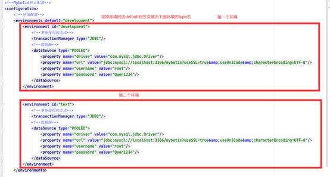

### (二)、默认配置

mybatis默认的事务管理器是jdbc。连接池为pooled

### (三)、提取数据库连接属性

#### 1、创建配置文件

```properties
drive=com.mysql.jdbc.Driver
url=jdbc:mysql://localhost:3306/mybatis?useSSL=true&useUniCode&characterEncoding=UTF-8
username=root
password=Qwer1234
```

#### 2、XML引入配置文件

```xml
<properties resource="jdbcAttributes.properties"/>
```

#### 3、使用${}匹配连接数据库属性

 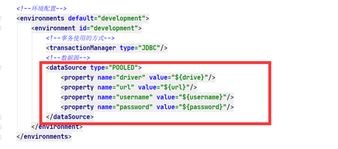

#### 4、可以在< properties >中添加额外的属性

注意点:如果name重名,优先使用配置文件中的属性值

 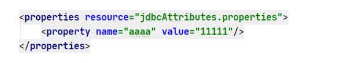

### (四)、别名

有2种起别名的方式:

第一种为指定类分配别名

第二种:为包起别名,包下的类别名为类名首字母小写

#### 1、第一种

```xml
<typeAliases>
  <typeAlias alias="user" type="com.ma.pojo.User "/>
</typeAliases>
```

#### 2、第二种

```xml
<typeAliases>
  <package name="com.ma"/>
</typeAliases>
```

#### 3、第一种使用

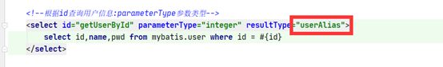

原来的com.ma.pojo.User可以简写为别名形式

#### 4、第二种使用

包下面类名首字母小写

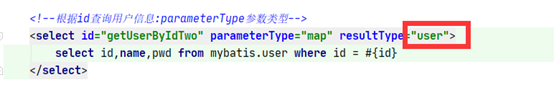

### (六)、设置事务自动提交

在返回连接的时候添加参数true

```java
//返回连接
public static SqlSession getSession(){
  return sqlSessionFactory.openSession(true);
}
```

### (五)、Mybatis属性设置

 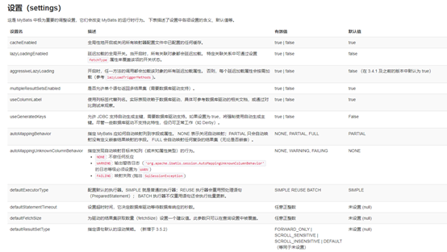

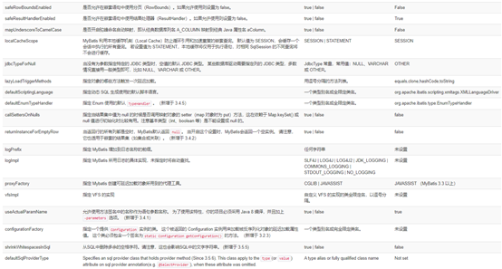

```xml
<settings>
 <setting name="cacheEnabled" value="true"/>
 <setting name="lazyLoadingEnabled" value="true"/>
 <setting name="multipleResultSetsEnabled" value="true"/>
 <setting name="useColumnLabel" value="true"/>
 <setting name="useGeneratedKeys" value="false"/>
 <setting name="autoMappingBehavior" value="PARTIAL"/>
 <setting name="autoMappingUnknownColumnBehavior" value="WARNING"/>
 <setting name="defaultExecutorType" value="SIMPLE"/>
 <setting name="defaultStatementTimeout" value="25"/>
 <setting name="defaultFetchSize" value="100"/>
 <setting name="safeRowBoundsEnabled" value="false"/>
 <setting name="mapUnderscoreToCamelCase" value="false"/>
 <setting name="localCacheScope" value="SESSION"/>
 <setting name="jdbcTypeForNull" value="OTHER"/>
 <setting name="lazyLoadTriggerMethods" value="equals,clone,hashCode,toString"/>
</settings>
```

### (六)、Mybatis的插件

 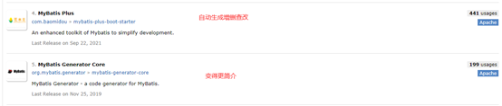

### (七)、映射器(mapper)

#### 1、第一种方式:通过resource

resource指向实现XML的全类名

```xml
<mappers>
    <mapper resource="com/ma/dao/UserMappingImpl.xml"/>
</mappers>
```

#### 2、第二种方式:通过Class查找

Class指向实现接口的全类名

```xml
<mappers>
    <mapper class="com.ma.dao.UserMapper"/>
</mappers>
```

#### 3、第三种方式:通过包扫描

```xml
<mappers>
  <package name="com.ma.dao"/>
</mappers>
```

#### 4、注意点:

   **使用第二种和第三种方式,****接口和实现接口的名字必须和接口同名并且在同一个包下**

### (八)、作用域（Scope）和生命周期

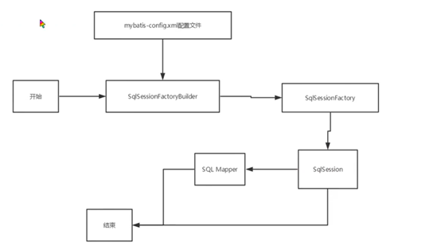

#### 1、SqlSessionFactoryBuilder

为了创建SqlSessionFactory工厂,一旦创建了 SqlSessionFactory，就不再需要它了。

#### 2、SqlSessionFactory

为了创建SqlSession,SqlSessionFactory 一旦被创建就应该在应用的运行期间一直存在，没有任何理由丢弃它或重新创建另一个实例。

#### 3、SqlSession

每个线程都应该有它自己的 SqlSession 实例。SqlSession 的实例不是线程安全的，因此是不能被共享的,一般写在方法中。

#### 4、Mapping

映射器是一些绑定映射语句的接口。映射器接口的实例是从 SqlSession 中获得的。每一个Mapping都是一个业务

 

## 七、解决数据库字段和实体类属性不一致问题

### (一)、第一种方式:起别名

select id,name,pwd as password from user;

### (二)、第二种方式:使用resultMap

```xml
<!--使用映射-->
<select id="getUserById" parameterType="integer" resultMap="MapUser">
    select id,name,pwd from mybatis.user where id = #{id}
</select>
```

**resultMap的属性值设置为映射匹配id**

```xml
<!--设置字段和属性匹配-->
<resultMap id="MapUser" type="user">
     <!—类属性:password   数据库字段:pwd-->
    <result property="password" column="pwd"/>
</resultMap>
```

## 八、日志

 

### (一)、STDOUT_LOGGING:

java自带的日志

#### 1、设置

```xml
<!--标准的日志实现-->
<settings>
    <setting name="logImpl" value="STDOUT_LOGGING"/>
</settings>
```

#### 2、输出

 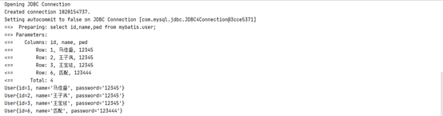

### (二)、Log4J

#### 1、导入依赖

```xml
<!--日志-->
<dependency>
    <groupId>log4j</groupId>
    <artifactId>log4j</artifactId>
    <version>1.2.17</version>
</dependency>
```

#### 2、创建一个log4j的配置文件添加配置

```properties
#将等级为DEBUG的日志信息输出到console和file这两个目的地，console和file的定义在下面的代码
log4j.rootLogger=DEBUG,console,file

#控制台输出的相关设置
log4j.appender.console = org.apache.log4j.ConsoleAppender
log4j.appender.console.Target = System.out
log4j.appender.console.Threshold=DEBUG
log4j.appender.console.layout = org.apache.log4j.PatternLayout
log4j.appender.console.layout.ConversionPattern=[%c]-%m%n

#文件输出的相关设置
log4j.appender.file = org.apache.log4j.RollingFileAppender
log4j.appender.file.File=./log/ma.log
log4j.appender.file.MaxFileSize=10mb
log4j.appender.file.Threshold=DEBUG
log4j.appender.file.layout=org.apache.log4j.PatternLayout
log4j.appender.file.layout.ConversionPattern=[%p][%d{yy-MM-dd}][%c]%m%n

#日志输出级别
log4j.logger.org.mybatis=DEBUG
log4j.logger.java.sql=DEBUG
log4j.logger.java.sql.Statement=DEBUG
log4j.logger.java.sql.ResultSet=DEBUG
log4j.logger.java.sql.PreparedStatement=DEBUG
```

#### 3、Mybatis主配置文件设置

```xml
<!--日志设置-->
<settings>
    <setting name="logImpl" value="LOG4J"/>
</settings>
```

#### 4、输出

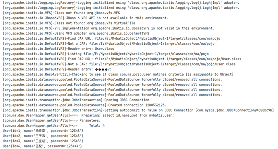

## 九、分页查询

### (一)、接口

```java
/**
 * 分页查询
 * @param pageInt 分页起始位置和查询几个
 * @return 返回User数组
 */
List<User>pageUsers(Map<String,Integer> pageInt);
```

### (二)、XML实现

```xml
<!--分页查询-->
<select id="pageUsers" parameterType="map" resultMap="MapUser">
    select id,name,pwd from mybatis.user limit #{startIndex},#{endIndex}
</select>
```

### (三)、测试

```java
@Test
public void textPageUsers() {
    UserMapper mapper = sqlSession.getMapper(UserMapper.class);
    Map<String,Integer> map = new HashMap<>();
    map.put("startIndex",0);
    map.put("endIndex",2);
    List<User> users = mapper.pageUsers(map);
    for (User user : users) {
        System.out.println(user);
    }
    sqlSession.close();
}
```

## 十、使用注解实现SQl语句增删查改

### (一)、接口

```java
public interface UserMapperOne {

    /**
     * 查询数据库所有用户信息
     *
     * @return 返回用户信息List
     */
    @Select("select id,name,pwd as password from user")
    List<User> getUserAlls();

    /**
     * 根据id查询用户
     *
     * @param id id号
     * @return 成功返回用户  失败null
     */
    @Select("select id,name,pwd as password from user where id = #{id}")
    User getUserById(@Param("id") int id);

    /**
     * 根据id,用户名查询用户
     *
     * @param id   id号
     * @param name 用户名
     * @return 成功返回用户  失败null
     */
    @Select("select id,name,pwd as password from user where id = #{id}")
    User getUserByIdAndName(@Param("id") int id, @Param("name") String name);

    /**
     * 添加用户
     *
     * @param user 用户
     * @return 成功1 失败-1
     */
    @Insert("insert into user (id,name,pwd) values (#{id},#{name},#{password})")
    int addUser(User user);

    /**
     * 更新用户
     * @param user 用户给
     * @return 成功1 失败-1
     */
    @Update("update user set name=#{name},pwd=#{password} where id=#{id}")
    int updateUser(User user);

    /**
     * 根据id删除用户
     * @param id id
     * @return 成功1 失败-1
     */
    @Delete("delete from user where id =#{id}")
    int deleteUser(Integer id);
}
```

### (二)、Mybatis配置文件添加映射

```xml
<mappers>
    <mapper class="com.ma.dao.UserMapper"/>
</mappers>
```

### (三)、测试

```java
public class TextUserMapper {

    SqlSession sqlSession = ReadFileGetconnect.getSession();

    //查询所有信息
    @Test
    public void test1(){
        UserMapperOne mapper = sqlSession.getMapper(UserMapperOne.class);
        List<User> userAlls = mapper.getUserAlls();
        for (User userAll : userAlls) {
            System.out.println(userAll);
        }
    }

    @Test
    public void test2(){
        UserMapperOne mapper = sqlSession.getMapper(UserMapperOne.class);
        User user = mapper.getUserById(1);
        System.out.println(user);
        sqlSession.close();
    }

    @Test
    public void test3(){
        UserMapperOne mapper = sqlSession.getMapper(UserMapperOne.class);
        int user = mapper.addUser(new User(8,"张三","9999"));
        sqlSession.close();
    }

    @Test
    public void test4(){
        UserMapperOne mapper = sqlSession.getMapper(UserMapperOne.class);
        mapper.updateUser(new User(8,"李四","8888"));
        sqlSession.close();
    }

    @Test
    public void test5(){
        UserMapperOne mapper = sqlSession.getMapper(UserMapperOne.class);
        mapper.deleteUser(8);
        sqlSession.close();
    }

}
```

### (四)、@param属性

@param属性如果是基本数据类型或String建议加上,可以规范sql语句中字段的名字

```mysql
@Select("select id,name,pwd as password from user where id = #{id} and name=#{name}")
User getUserByIdAndName(@Param("id") int id, @Param("name") String name);
```

## 十一、LomBok

### (一)、简介

Project Lombok is a java library that automatically plugs into your editor and build tools, spicing up your java.
 Never write another getter or equals method again, with one annotation your class has a fully featured builder, Automate your logging variables, and much more.

### (二)、使用步骤

#### 1、安装插件

 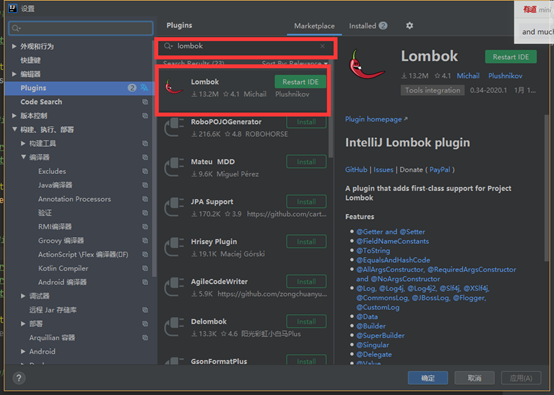

### (二)、导入jar包

```xml
<!—LomBok依赖-->
<dependency>
    <groupId>org.projectlombok</groupId>
    <artifactId>lombok</artifactId>
    <version>1.18.20</version>
</dependency>
```

### (三)、LomBok中的注解

| **注解**                 | **使用的位置**     | **说明**                                                     | **示例**                                                     |
| ------------------------ | ------------------ | ------------------------------------------------------------ | ------------------------------------------------------------ |
| @Getter                  | 属性,类            | 放在属性上生成一个get方法,放在类上都生成                     | @Getter private int  age = 10;                               |
| @Setter                  | 属性,类            | 放在属性上生成一个set方法,放在类上都生成                     | @Setter private int  age = 10;                               |
| @NonNull                 | 属性               | 没有值赋值为空                                               | public NonNullExample(@NonNull  Person person) {             |
| @Data                    | 类                 | 自动生成无参构造,setter/getter、equals、canEqual、hashCode、toString方法，如为final属性，则不会为该属性生成setter方法。 | @Data public class  DataExample {                            |
| @Cleanup                 | 需要关闭的变量前面 | 该注解能帮助我们自动调用close()方法                          | @Cleanup InputStream  in = new FileInputStream(args[0]);     |
| @EqualsAndHashCode       | 类                 | 自动生成EqualsAndHashCode,(exclude)排除属性                  | @EqualsAndHashCode(exclude={"id",  "shape"}) public class EqualsAndHashCodeExample { |
| @ToString                | 类                 | 自动生成toString方法,(exclude)排除属性                       | @ToString(exclude="id")  public class ToStringExample {      |
| @NoArgsConstructor       | 类                 | 无参构造                                                     | @NoArgsConstructor  public static class NoArgsExample {      |
| @RequiredArgsConstructor | 类                 | 部分属性构造                                                 | @RequiredArgsConstructor  public static class NoArgsExample { |
| @AllArgsConstructor      | 类                 | 全部属性构造                                                 | @AllArgsConstructor  public static class NoArgsExample {     |

### (四)、使用

```java
 @Data
 @AllArgsConstructor
 public class User {
 
     private Integer id;
     private String name;
     private String password;
 }
```

## 十二、一对多,多对一

### (一)、说明

多个学生对应一个老师        多对一

一个老师对应多个学生        一对多

### (二)、环境搭建

#### 1、搭建数据库

```mysql
 CREATE TABLE `teacher` (
   `id` INT(10) NOT NULL,
   `name` VARCHAR(30) DEFAULT NULL,
   PRIMARY KEY (`id`)
 ) ENGINE=INNODB DEFAULT CHARSET=utf8
 
 INSERT INTO teacher(`id`, `name`) VALUES (1, "秦老师"); 
 
 CREATE TABLE `student` (
   `id` INT(10) NOT NULL,
   `name` VARCHAR(30) DEFAULT NULL,
   `tid` INT(10) DEFAULT NULL,
   PRIMARY KEY (`id`),
   KEY `fktid` (`tid`),
   CONSTRAINT `fktid` FOREIGN KEY (`tid`) REFERENCES `teacher` (`id`)
 ) ENGINE=INNODB DEFAULT CHARSET=utf8;
 INSERT INTO `student` (`id`, `name`, `tid`) VALUES (1, "小明", 1); 
 INSERT INTO `student` (`id`, `name`, `tid`) VALUES (2, "小红", 1); 
 INSERT INTO `student` (`id`, `name`, `tid`) VALUES (3, "小张", 1); 
 INSERT INTO `student` (`id`, `name`, `tid`) VALUES (4, "小李", 1); 
 INSERT INTO `student` (`id`, `name`, `tid`) VALUES (5, "小王", 1);
```

#### 2、创建工程

#### 3、创建pojo类

(1)、Teacher

```java
 @Data
 public class Teacher {
  //多对一
     private Integer id;
     private String name;
     
     //一对多
     private Integer id;
     private String name;
     private List<Student> student;
 }
```

(2)、Student

```java
 @Data
 public class Student {
  //多对一
     private Integer id;
     private String name;
     private Teacher teacher;
     
     //一对多
     private Integer id;
     private String name;
     private Intege teacher;
 }
```

#### 4、创建对应pojo接口

#### 5、创建对应实现XML,并添加头文件

**Student**

```xml
 <?xml version="1.0" encoding="UTF8" ?>
 <!DOCTYPE mapper
         PUBLIC "-//mybatis.org//DTD Config 3.0//EN"
         "http://mybatis.org/dtd/mybatis-3-mapper.dtd">
 <!--Mybatis核心配置-->
 <mapper namespace="com.ma.dao.TeacherMapping">
 
 </mapper>
```

**Teacher**

```xml
 <?xml version="1.0" encoding="UTF8" ?>
 <!DOCTYPE mapper
         PUBLIC "-//mybatis.org//DTD Config 3.0//EN"
         "http://mybatis.org/dtd/mybatis-3-mapper.dtd">
 <!--Mybatis核心配置-->
 <mapper namespace="com.ma.dao.StudentMapping">
 
 </mapper>
```

#### 6.Mybatis中映射XML

```xml
 <!--映射实现方式-->
 <mappers>
     <mapper resource="com/ma/dao/StudentMapping.xml"/>
     <mapper resource="com/ma/dao/TeacherMapping.xml"/>
 </mappers>
```

#### 7.测试

(1)、接口

```java
 public interface TeacherMapping {
 
     @Select("select * from teacher where id = #{id}")
     Teacher getTeacher(@Param("id") Integer id);
 }
```

(2)、Test

```java
 public class text {
     
     public static void main(String[] args) {
         SqlSession session = ReadFileGetconnect.getSession();
         TeacherMapping mapper = session.getMapper(TeacherMapping.class);
         Teacher teacher = mapper.getTeacher(1);
         System.out.println(teacher);
         session.close();
    }
 }
```

### (三)、多对一查询

#### 1、方式一:子查询标签嵌套方式

(1)、接口

```java
 public interface StudentMapping {
 
     List<Student> getStudentsAndTeacherNames();
 
     Teacher getTeacherById(Integer id);
 }
```

(二)、XML

```xml
 <!--映射-->
 <resultMap id="StudentAndTeacher" type="Student">
     <result property="id" column="id"/>
     <result property="name" column="name"/>
     <!--对象属性使用association   集合使用Collection-->
     <!--javaType:java的类   select:子查询-->
     <association property="teacher" column="tid" javaType="Teacher" select="getTeacherById"/>
 </resultMap>
 
 <!--使用Map映射属性-->
 <select id="getStudentsAndTeacherNames" resultMap="StudentAndTeacher">
    select * from student;
 </select>
 
 <select id="getTeacherById" resultType="Teacher">
    select id,name from teacher where id = #{tid}
 </select>
```

#### 2、方式二:联表查询

(一)、接口

```java
 public interface StudentMapping {
 
     List<Student> getStudentsAndTeacherNames();
 
     Teacher getTeacherById(Integer id);
 }
```

(二)、XML

```xml
 <!--映射-->
 <resultMap id="StudentAndTeacher" type="Student">
      <result property="id" column="sid"/>
      <result property="name" column="sname"/>
      <!--对象属性使用association   集合使用Collection-->
      <!--javaType:java的类   select:子查询-->
      <association property="teacher" javaType="Teacher">
           <result property="name" column="tname"/>
      </association>
 </resultMap>
 
 <!--使用Map映射属性-->
 <select id="getStudentsAndTeacherNames" resultMap="StudentAndTeacher">
      SELECT s.id AS sid,s.name AS sname,t.name tname
      FROM student AS s,teacher AS t
      WHERE s.tid=t.id;
 </select>
```

### (四)、一对多

#### 1、方式一:子查询标签嵌套方式

(1)、接口

```java
 public interface TeacherMapping {
 
     List<Teacher> getStudentAndTeachers(@Param("id") Integer id);
 
     Student getStudentInfo();
 
 }
```

(2)、XML

```xml
 <!--Mybatis核心配置-->
 <mapper namespace="com.ma.dao.TeacherMapping">
     <select id="getStudentAndTeachers" resultMap="getStudentAndTeachersMapping">
        select * from teacher where id=#{id};
     </select>
     <resultMap id="getStudentAndTeachersMapping" type="Teacher">
         <collection property="student" javaType="ArrayList" ofType="Student" select="getStudentInfo" column="id"/>
     </resultMap>
     <select id="getStudentInfo" resultType="Student">
        select * from student where tid=#{id};
     </select>
 </mapper>
```

(3)、测试

```java
 public class aa {
 
     @Test
     public void test1(){
         SqlSession session = ReadFileGetconnect.getSession();
         TeacherMapping mapper = session.getMapper(TeacherMapping.class);
         List<Teacher> studentAndTeachers = mapper.getStudentAndTeachers(1);
         for (Teacher studentAndTeacher : studentAndTeachers) {
             System.out.println(studentAndTeacher);
        }
         session.close();
    }
 }
```

#### 2、方式二:联表查询

(1)、接口

```java
 public interface TeacherMapping {
 
     List<Teacher> getStudentAndTeachers(@Param("id") Integer id);
     
 }
```

(2)、XML

```xml
 <select id="getStudentAndTeachers" resultMap="getStudentAndTeacherMapping">
    select s.id sid,s.name sname,t.name tname,t.id tid
    from student as s,teacher t
    where s.tid = t.id and t.id=#{id}
 </select>
 <resultMap id="getStudentAndTeacherMapping" type="Teacher">
     <result property="id" column="tid"/>
     <result property="name" column="tname"/>
     <collection property="student" ofType="Student">
         <result property="id" column="sid"/>
         <result property="name" column="sname"/>
         <result property="tid" column="tid"/>
     </collection>
  </resultMap>
```

(3)、测试

```java
 public class aa {
 
     @Test
     public void test1(){
         SqlSession session = ReadFileGetconnect.getSession();
         TeacherMapping mapper = session.getMapper(TeacherMapping.class);
         List<Teacher> studentAndTeachers = mapper.getStudentAndTeachers(1);
         for (Teacher studentAndTeacher : studentAndTeachers) {
             System.out.println(studentAndTeacher);
        }
         session.close();
    }
 }
```

## 十三、动态SQL

### (一)、概念

根据不通的条件生成不通的动态SQL语句,其中有4中标签

```
 - if 判断
 - choose (when, otherwise)     switch
 - trim (where, set) 尽量不让sql出错
 - foreach 循环
```

### (二)、环境搭建

#### 1、数据库

```mysql
 CREATE TABLE `blog`(
  `id` VARCHAR(50) NOT NULL COMMENT '博客id',
  `title` VARCHAR(100) NOT NULL COMMENT '博客标题',
  `author` VARCHAR(30) NOT NULL COMMENT '博客作者',
  `create_time` DATETIME NOT NULL COMMENT '创建时间',
  `views` INT(30) NOT NULL COMMENT '浏览量'
 
 )ENGINE=INNODB DEFAULT CHARSET=utf8
```

#### 2、创建对应的pojo

```java
 @Data
 public class Blog {
 
     private String id;
     private String title;
     private String author;
     private Date createTime;
     private Integer views;
 }
```

#### 3、创建接口

```java
 public interface BlogMapping {
      int addBlog(Blog blog);
 }
```

#### 4、创建接口对应XML

```xml
 <?xml version="1.0" encoding="UTF8" ?>
 <!DOCTYPE mapper
         PUBLIC "-//mybatis.org//DTD Config 3.0//EN"
         "http://mybatis.org/dtd/mybatis-3-mapper.dtd">
 <!--Mybatis核心配置-->
 <mapper namespace="com.ma.dao.BlogMapping">
      <insert id="addBlog" parameterType="com.ma.pojo.Blog">
        insert into blog (id,title,author,create_time,views)
        values (#{id},#{title},#{author},#{createTime},#{views})
     </insert>
 </mapper>
```

#### 5、Mybatis配置文件添加映射

```xml
 <!--映射实现方式-->
 <mappers>
     <mapper resource="com/ma/dao/BlogMapping.xml"/>
 </mappers>
```

添加字段转换 如:数据库中 user_name java中userName这样形式的自动转换

```xml
 <settings>
     <setting name="mapUnderscoreToCamelCase" value="true"/>
 </settings>
```

#### 6、添加一个工具类生成不同的编号

```java
 public class GenerateUUIDUtils {
 
     public static String getUUID(){
         return UUID.randomUUID().toString().replaceAll("-","");
    }
 }
```

#### 7、数据库注入数据

```java
 @Test
 public void test6() {
     SqlSession sqlSession = ReadFileGetconnect.getSession();
     com.ma.dao.BlogMapping mapper = sqlSession.getMapper(com.ma.dao.BlogMapping.class);
     Blog blog = new Blog();
     blog.setId(GenerateUUIDUtils.getUUID());
     blog.setTitle("Mybatis");
     blog.setAuthor("狂神说");
     blog.setCreateTime(new Date());
     blog.setViews(9999);
 
     mapper.addBlog(blog);
 
     blog.setId(GenerateUUIDUtils.getUUID());
     blog.setTitle("Java");
     mapper.addBlog(blog);
 
     blog.setId(GenerateUUIDUtils.getUUID());
     blog.setTitle("Spring");
     mapper.addBlog(blog);
 
     blog.setId(GenerateUUIDUtils.getUUID());
     blog.setTitle("微服务");
     mapper.addBlog(blog);
 
     sqlSession.close();
 }
```

### (三)、标签

#### 1、if标签

##### (1)、语法:

```xml
 <if title=""></if>
```

##### (2)、使用

​    接口

```xml
 public interface BlogMapping {
  
     List<Blog> queryBlog(Map<String,Object> map);
 }
 XML
 <select id="queryBlog" parameterType="map" resultType="Blog">
     <!--查询所有语句-->
    select * from blog where 1=1
     <!--如果title有值的话拼接if中语句-->
     <if test="title != null">
        and title = #{title}
     </if>
     <!--如果author有值的话拼接if中语句-->
     <if test="author != null">
        and author = #{author}
     </if>
 </select>
 测试
 @Test
 public void test1(){
     SqlSession session = ReadFileGetconnect.getSession();
     BlogMapping mapper = session.getMapper(BlogMapping.class);
     Map<String, Object> map  = new HashMap<>();
     map.put("title","java");
     //如果map中没有值查询全部,有title查找关于title的值
     List<Blog> blogs = mapper.queryBlog(map);
     for (Blog blog : blogs) {
         System.out.println(blog);
    }
     session.close();
 }
```

#### 2、where标签

##### (1)、说明

​       sql语句后面添加where标签,当满足第一个条件的时候自动添加where,当满足第二个条件的时候and自动转换为where

##### (2)、语法

```xml
 <where>
  代码块
 </where>
```

##### (3)、使用

```xml
 <select id="queryBlog" parameterType="map" resultType="Blog">
     <!--查询所有语句-->
    select * from blog
     <where>
         <!--满足第一个条件在连接的时候往前面添加where-->
         <if test="title != null">
            title = #{title}
         </if>
         <!--满足第二个条件连接的时候自动将and转换为where-->
         <if test="author != null">
            and author = #{author}
         </if>
     </where>
     <!--如果title有值的话拼接if中语句-->
 </select>
```

#### 3、choose (when, otherwise)

##### (1)、说明

​       相当于java的switch当一个满足就不执行一下个

##### (2)、语法

```xml
 <choose>
        <when test="title != null">
            title = #{title}
        </when>
        <when test="author">
            and author = #{author}
        </when>
        <!--如果添加otherwise就必须一个满足-->
        <otherwise>
            and views = #{views}
        </otherwise>
 </choose>
```

##### (3)、使用

```xml
 <select id="queryBlog" parameterType="map" resultType="Blog">
    select * from blog
     <where>
         <choose>
             <when test="title != null">
                title = #{title}
             </when>
             <when test="author">
                and author = #{author}
             </when>
             <otherwise>
                and views = #{views}
             </otherwise>
         </choose>
     </where>
 </select>
```

#### 4、set标签

##### (1)、说明

​           和where差不错,set用于update,会在首次判断成功添加set,自动去掉末尾逗号

##### (2)、语法

```xml
 <set>
     <if test="title != null">title = #{title},</if>
     <if test="author != null">author = #{author},</if>
 </set>
```

##### (3)、使用

```xml
 <update id="updateBlog" parameterType="map">
    update blog
     <set>
         <if test="title != null">title = #{title},</if>
         <if test="author != null">author = #{author},</if>
     </set>
    where id = #{id};
 </update>
```

#### 4、foreach标签

##### (1)、语法

```xml
 <!--collection:循环名   item:赋值项   open:开始   separator:中间 close:结尾-->
 <foreach collection="listBlog" item="id" open="(" separator="or" close=")">
     <!--判断-->
    id = #{id}
 </foreach>
```

##### (2)、使用

```xml
 <select id="queryBlog" parameterType="map" resultType="Blog">
    select * from blog
    <where>
        <foreach collection="listBlog" item="id" open="(" separator="or" close=")">
            id = #{id}
        </foreach>
    </where>
 </select>
```

### (四)、SQL片段(抽取公共部分)

1、使用sql标签把公共部分写入标签内

```xml
 <sql id="title_author">
     <if test="title != null">title = #{title},</if>
     <if test="author != null">author = #{author},</if>
 </sql>
```

2、然后再使用的地方添加include标签

```xml
 <include refid="title_author"></include>
```

## 十四、缓存

### (一)、简介

#### 1、默认情况

只启用了本地的会话缓存，它仅仅对一个会话中的数据进行缓存。 要启用全局的二级缓存，只需要在你的 SQL 映射文件中添加一行

#### 2、缓存的方式

select 语句的结果将会被缓存。

insert、update 和 delete 语句会刷新缓存。

缓存会使用最近最少使用算法（LRU, Least Recently Used）算法来清除不需要的缓存。

缓存不会定时进行刷新

#### 3、策略

可用的清除策略有：

·     `LRU` – 最近最少使用：移除最长时间不被使用的对象。

·     `FIFO` – 先进先出：按对象进入缓存的顺序来移除它们。

·     `SOFT` – 软引用：基于垃圾回收器状态和软引用规则移除对象。

·     `WEAK` – 弱引用：更积极地基于垃圾收集器状态和弱引用规则移除对象。

默认的清除策略是 LRU。

### (二)、一级缓存(默认缓存)

默认开启,声明周期为每一个SQLsession的开启到关闭

#### 1、测试

##### (1)、开启日志功能

```xml
 <settings>
     <setting name="logImpl" value="STDOUT_LOGGING"/>
 </settings>
```

##### (2)、测试中查询23

```java
 @Test
 public void test2(){
     UserMapperOne mapper = sqlSession.getMapper(UserMapperOne.class);
     User user1 = mapper.getUserById(1);
     User user2 = mapper.getUserById(1);
     User user3 = mapper.getUserById(1);
     System.out.println(user1);
     System.out.println(user2);
     System.out.println(user3);
     sqlSession.close();
 }
```

##### (3)、结果

 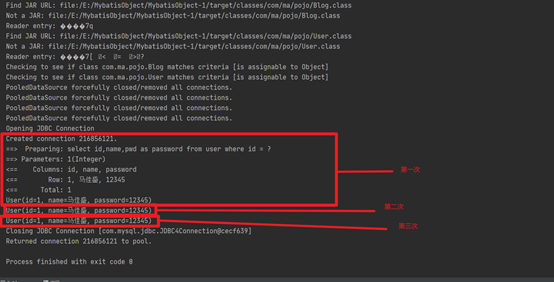

### (三)、二级缓存

​     

##### 1、说明

二级缓存也叫全局缓存,一级缓存作用太低了,所以诞生了二级缓存,基于namespace级别的缓存,一个名称空间,对应一个二级缓存

##### 2、工作机制

(1)、一个会话查询一条数据,这个数据就会被放在当前会话的一级缓存中;

(2)、如果会话关闭,一级缓存流没了,但是我们想要的是,会话关闭了,一级缓存中的数据就会保存到二级缓存中;

(3)、新的会话查询信息,就可以从二级缓存中获取内容;

(4)、不同的mapper查出的数据会放在自己对应的缓存中;

##### 3、开启步骤

(1)、在Mybatis配置文件显示开启全局缓存

```xml
 <settings>
     <setting name="cacheEnabled" value="true"/>
 </settings>
```

(2)、Mapper中开启二级缓存

```xml
 <mapper namespace="com.ma.dao.UserMapping">
 
     <!--开启二级缓存-->
     <cache/> //如果不设置eviction的话pojo类需要序列化,实现Serializable接口
 </mapper>
```

也可以自定义一些参数

```xml
 <!--开启二级缓存-->
 <cache eviction="FIFO" //先进先出,如果不设置的话pojo类需要序列化,实现Serializable接口
        flushInterval="60000" //60秒刷新
        size="512" //最多512个引用
        readOnly="true"/> //只读开启
```

##### 4、测试

```java
 @Test
 public void test2(){
     //session1
     SqlSession sqlSession1 = ReadFileGetconnect.getSession();
     UserMapperOne mapper1 = sqlSession1.getMapper(UserMapperOne.class);
     User user1 = mapper1.getUserById(1);
     System.out.println(user1);
     //session1关闭,将缓存存入二级缓存
     sqlSession1.close();
 
     //session2
     SqlSession sqlSession2 = ReadFileGetconnect.getSession();
     UserMapperOne mapper2 = sqlSession2.getMapper(UserMapperOne.class);
     //直接去二级缓存取数据
     User user2 = mapper2.getUserById(1);
     System.out.println(user2);
     sqlSession2.close();
 }
```

### (四)、缓存的流程

​     

 

 