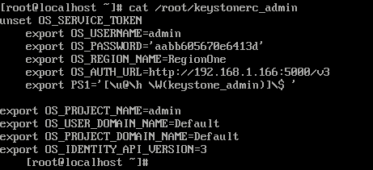
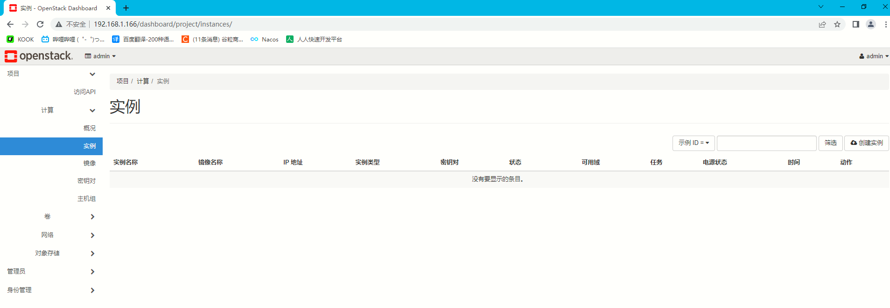

# 一、准备环境

## 1、一键部署


## 2、修改网卡可上网

## 3、环境配置

```shell
cd /etc/yum.repos.d/   			# 进入yum源配置文件
rm -f *							# 删除原来的系统源
mount /dev/cdrom /mnt			# 挂载镜像
vi a.repo						# 创建自己的yum源

[a]
name=a
baseurl=file:///mnt
gpgcheck=0
enabled=1

systemctl stop firewalld		# 关闭防火墙
systemctl disable firewalld		# 关闭开机自启防火墙
setenforce 0					# 关闭selinux
vi /etc/sysconfig/selinux		# 关闭selinux的开机自启

SELINUX=disabled				# 修改为disabled

systemctl disable NetworkManager	# 关闭NetworkManager服务
systemctl stop NetworkManager		# 关闭开机自启NetworkManager服务

yum install -y https://www.rdoproject.org/repos/rdo-release.rpm		# 获取yum源
curl -o /etc/yum.repos.d/CentOS-Base.repo http://mirrors.aliyun.com/repo/Centos-7.repo # 获取yum源
yum clean all						# 清空
yum update -y						# 更新yum
yum install -y openstack-packstack	# 安装一键部署包
packstack --allinone				# 开始一键部署
```

# 二、查看&修改密码

## 1、查看密码

```shell
cat /root/keystonerc_admin 			# 查看账号密码
```



## 2、修改密码

```shell
vi admin-openrc.sh									# 创建一个认证文件，随机目录即可
export OS_USERNAME=admin							# 登录账号
export OS_PASSWORD=aabb605670e6413d					#登录密码
export OS_PROJECT_NAME=admin
export OS_USER_DOMAIN_NAME=Default
export OS_PROJECT_DOMAIN_NAME=Default
export OS_AUTH_URL=http://192.168.1.166:5000/v3		# 云平台地址
export OS_IDENTITY_API_VERSION=3
:wq
source  admin-openrc.sh 
openstack user set --password dcncloud admin		# 修改密码为dcncloud
然后修改admin-openrc.sh	密码改为dcncloud
source  admin-openrc.sh 

```



# 三、镜像服务

## 1、查看全部镜像

```shell
openstack image list
```

## 2、上传镜像

```shell
openstack image create "镜像名字" --file 镜像路径 --disk-format qcow2 --container-format bare --public --progress

--disk-format 			# 镜像磁盘格式，默认格式为raw，可用的格式还有qcow2，vmdk，iso等。
--container-format		# 镜像容器格式，默认格式为bare，可用的格式还有ova，ovf等。
--disk-format  			# 镜像磁盘格式，默认格式为raw，可用的格式还有qcow2，vmdk，iso等
--public				# 权限
```

## 3、删除镜像

```shell
openstack image delete 镜像id
```

# 四、实例类型

## 1、查看全部规格

```
openstack flavor list
```

## 2、创建规格

```shell
openstack flavor create --id=id号 --ram=内存 --disk=磁盘 --vcpus=cup数量 规格名称
```

# 五、网络

## 1、查看全部网络

```shell
neutron net-list						 # 查看网络列表
neutron subnet-list					
neutron net-show 网络名                   # 查看网络详细信息
neutron subnet-list			       		 # 查看子网列表
neutron subnet-show 子网名         	   # 查看子网详细信息
```

## 2、创建网络

```shell
neutron net-create 网络名称 --shared --router:external=True			# 创建外部网络
neutron subnet-create --name 子网名称 --gateway 网关 --allocation-pool start=DHCP开始地址,end=DHCP结束地址 在哪个网络下 ip/掩码位 # 创建子网
```

## 3、删除网络

```shell
neutron net-delete 网络名称					# 删除网络
neutron subnet-delete 删除子网	    	    # 删除子网
```

# 六、容器卷

