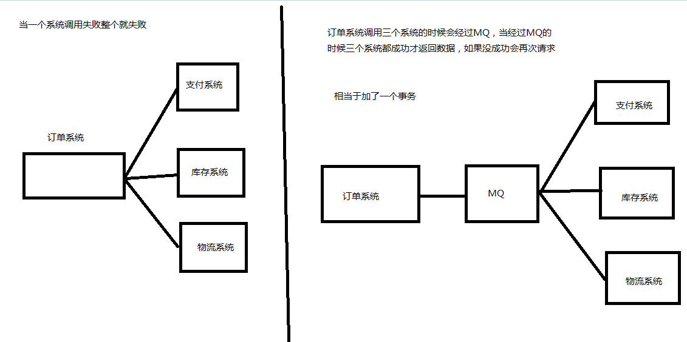
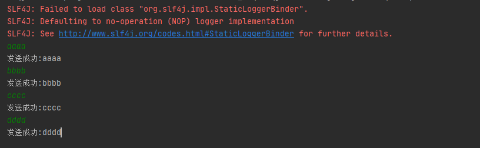
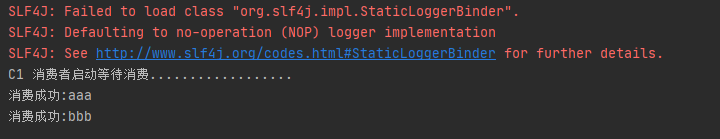

# RabbitMQ

## 一、MQ的相关概念

### (一)、什么是MQ

MQ(message queue)，从字面意思上看，本质是个队列，FIFO先入先出，只不过队列中存放的内容是message而已，还是一种跨进程的通信机制，用于上下游传递消息。在互联网架构中,MQ是一种非常常见的上下游“逻辑解耦+物理解耦”的消息通信服务。使用了MQ之后，消息发送上游只需要依赖MQ，不用依赖其他服务。

### (二)、为什么要用MQ

#### 1、流量消峰

举个例子，如果订单系统最多能处理一万次订单，这个处理能力应付正常时段的下单时绰绰有余，正常时段我们下单一秒后就能返回结果。但是在高峰期，如果有两万次下单操作系统是处理不了的，只能限制订单超过一万后不允许用户下单。使用消息队列做缓冲，我们可以取消这个限制，把一秒内下的订单分散成一段时间来处理，这时有些用户可能在下单十几秒后才能收到下单成功的操作，但是比不能下单的体验要好。


#### 2、应用解耦

以电商应用为例，应用中有订单系统、库存系统、支付系统。用户创建订单后，如果耦合调用库存系统、物流系统、支付系统，任何一个子系统出了故障，都会造成下单操作异常。当转变成基于消息队列的方式后，系统间调用的问题会减少很多，比如物流系统因为发生故障，需要几分钟来修复。在这几分钟的时间里，物流系统要处理的内存被缓存在消息队列中，用户的下单操作可以正常完成。当物流系统恢复后，继续处理订单信息即可 ，中单用户感受不到物流系统的故障，提升系统的可用性。



#### 3、异步处理

当A调用B的时候，A不需要等待B返回结果，当B得到结果会通知MQ，然后MQ通知A服务器获取，这样A服务器就不用一直通过API查询B是否执行完存在结果返回


### (三)、MQ的分类

#### 1、ActiveMQ:

- 优点：单机吞吐量万级，时效性ms级，可用性高，基于主从架构实现高可用性，消息可靠性较低的概率丢失数据
- 缺点：维护越来越少，高吞吐量场景较少使用

#### 2、Kafaka:

大数据的杀手锏，谈到大数据领域内的消息传输，则绕不开Kafka，这款为大数据而生的消息中间件,以其百万级TPS的吞吐量名声大噪，迅速成为大数据领域的宠儿，在数据采集、传输存储的过程中发挥着举足轻重的作用。目前已经被LinkedIn，Uber,Twitter,Netflix等大公司所采纳。

- 优点：性能卓越，单机写入TPS约在百万条/秒，最大的优点，就是吞吐量高。时效性ms级可用性非常高，kafka是分布式的，一个数据多个副本，少数机器宕机，不会丢失数据，不会导致不可用,消费者采用Pull方式获取消息，消息有序，通过控制能够保证所有消息被消费且仅被消费一次;有优秀的第三方Kafka Web管理界面Kafka-Manager;在日志领域比较成熟，被多家公司和多个开源项目使用;功能支持:功能较为简单，主要支持简单的MQ功能，在大数据领域的实时计算以及日志采集被大规模使用


- 缺点：Kafka单机超过64个队列/分区，Load会发生明显的飙高现象，队列越多，load越高，发送消息响应时间变长，使用短轮询方式，实时性取决于轮询间隔时间，消费失败不支持重试;支持消息顺序，但是一台代理宕机后，就会产生消息乱序，社区更新较慢;


#### 3、RocketMQ

出自阿里巴巴的开源产品，用Java语言实现，在设计时参考了Kafka，并做出了自己的一些改进。被阿里巴巴广泛应用在订单，交易，充值，流计算，消息推送，日志流式处理binglog分发等场景。

- 优点：单机吞吐量十万级,可用性非常高，分布式架构,消息可以做到0丢失,MQ功能较为完善，还是分布式的，扩展性好,支持10亿级别的消息堆积，不会因为堆积导致性能下降,源码是java我们可以自己阅读源码，定制自己公司的MQ


- 缺点：支持的客户端语言不多，目前是java及c++，其中c++不成熟;社区活跃度一般,没有在MQ核心中去实现JMS等接口,有些系统要迁移需要修改大量代码


#### 4、RabbitMQ

2007年发布，是一个在AMQP(高级消息队列协议)基础上完成的，可复用的企业消息系统，是当前最主流的消息中间件之一。

- 优点：由于erlang语言的高并发特性，性能较好;吞吐量到万级，MQ功能比较完备,健壮、稳定、易用、跨平台、支持多种语言如: Python、Ruby、.NET、 Java、JMS、C、PHP、ActionScript、XMPP、STOMP等，支持AJAX文档齐全;开源提供的管理界面非常棒，用起来很好用,社区活跃度高;更新频率相当高


- 缺点：商业版需要收费,学习成本较高

### (四)、MQ的选择

| MQ       | 介绍                                                         |
| -------- | ------------------------------------------------------------ |
| Kafka    | Kafka主要特点是基于Pull的模式来处理消息消费，追求高吞吐量，一开始的目的就是用于日志收集和传输，适合产生`大量数据`的互联网服务的数据收集业务。`大型公司`建议可以选用，如果有`日志采集`功能,肯定是首选kafka了。 |
| RocketMQ | 天生为`金融互联网`领域而生，对于可靠性要求很高的场景，尤其是电商里面的订单扣款，以及业务削峰，在大量交易涌入时，后端可能无法及时处理的情况。RoketMQ在稳定性上可能更值得信赖，这些业务场景在阿里双11已经经历了多次考验，如果你的业务有上述并发场景，建议可以选择RocketMQ。 |
| RabbitMQ | 结合erlang语言本身的并发优势，`性能好时效性微秒级`，`社区活跃度也比较高`，管理界面用起来十分方便，如果你的`数据量没有那么大`，中小型公司优先选择功能比较完备的RabbitMO |

## 二、RabbitMQ

### (一)、概念

RabbitMQ是一个消息中间件:它接受并转发消息。你可以把它当做一个快递站点，当你要发送一个包裹时，你把你的包裹放到快递站，快递员最终会把你的快递送到收件人那里，按照这种逻辑RabbitMQ是一个快递站，一个快递员帮你传递快件。RabbitMQ.与快递站的主要区别在于，它不处理快件而是接收，存储和转发消息数据。

### (二)、四大核心概念

|  概念  |                             介绍                             |
| :----: | :----------------------------------------------------------: |
| 生产者 |                产生数据发送消息的程序是生产者                |
| 交换机 | 交换机是RabbitMQ非常重要的一个部件，一方面它接收来自生产者的消息，另一方面它将消息推送到队列中。交换机必须确切知道如何处理它接收到的消息，是将这些消息推送到特定队列还是推关到多个队列，亦或者是把消息丢弃，这个得有交换机类型决定 |
|  队列  | 队列是RabbitMQ内部使用的一种数据结构，尽管消息流经RabbitMQ和应用程序但它们只能存储在队列中。队列仅受主机的内存和磁盘限制的约束，本质上是一个大的消息缓冲区。许多生产者可以将消息发送到一个队列，许多消费者可以尝试从一个队列接收数据。这就是我们使用队列的方式 |
| 消费者 | 消费与接收具有相似的含义。消费者大多时候是一个等待接收消息的程序。请注意生产者，消费者和消息中间件很多时候并不在同一机器上。同一个应用程序既可以是生产者又是可以是消费者。 |

### (三)、核心部分

| 部分         | 功能                                                         |
| ------------ | ------------------------------------------------------------ |
| Borker       | 接受和分发消息的应用，RabbitMQ Server就是Message Broker      |
| Virtual host | 出于多租户和安全因素设计的，把AMQP 的基本组件划分到一个虚拟的分组中，类似于网络中的namespace.概念。当多个不同的用户使用同一个RabbitMQ server提供的服务时，可以划分出多个vhost，每个用户在自己的vhost创建exchange / queue 等 |
| Connection   | publisher / consumer和broker之间的TCP连接                    |
| Channel      | 如果每一次访问 RabbitMQ 都建立一个Connection，在消息量大的时候建立TCPConnection的开销将是巨大的，效率也较低。Channel是在connection 内部建立的逻辑连接，如果应用程序支持多线程，通常每个thread 创建单独的channel进行通讯，AMQP method包含了channel id 帮助客户端和message broker识别 channel，所以channel之间是完全隔离的。Channel作为轻量级的Connection极大减少了操作系统建立TCP connection的开销 |
| Exchange     | message 到达 broker 的第一站，根据分发规则，匹配查询表中的 routing key，分发消息到queue 中去。常用的类型有: direct (point-to-point), topic (publish-subscribe) and fanout(multicast) |
| Queue        | 消息最终被送到这里等到consumer取走                           |
| Binding      | exchange和queue之间的虚拟连接，binding中可以包含routing key，Binding消息被保存到exchange中的查询表中，用于message的分发依据 |


### (四)、安装

#### 1、安装Erlang:

https://github.com/rabbitmq/erlang-rpm/releases/download/v23.2.6/erlang-23.2.6-1.el7.x86_64.rpm

```shell
rpm -ivh erlang-23.2.6-1.el7.x86_64.rpm

# 测试
erl -version
```

#### 2、安装依赖

```shell
yum -y install socat 
```

#### 3、安装RabbitMQ

https://github.com/rabbitmq/rabbitmq-server/releases/download/v3.8.12/rabbitmq-server-3.8.12-1.el7.noarch.rpm

```shell
rpm -ivh rabbitmq-server-3.8.12-el7.noarch.rpm
```

#### 4、RabbitMQ命令:

```shell
# 添加开机启动RabbitmMQ服务
chkconfig rabbitmq-server on

# 启动服务
/sbin/service rabbitmq-server start

# 查看服务状态
/sbin/service rabbitmq-server status

# 停止服务
/sbin/service rabbitmq-servr stop

# 开启可视化管理插件
rabbitmq-plugins enable rabbitmq_management

# 查看端口
netstart -tunlp

# 创建一个新的用户
rabbitmqctl add_user admin 123

# 设置用户角色为管理员
rabbitmqctl set_user_tags admin administrator

# 设置用户权限 具有所有资源配置 admin 可读可写
rabbitmqctl set_permissions -p "/" admin ".*" ".*" ".*"

# 查看用户和角色
rabbitmqctl list_users

# 关闭网页插件
rabbitmqctl list_users

# 重新启动命令
rabbitmqctl start_app

# 清除命令
rabbitmqctl reset
```

测试可视化管理插件  192.168.2.177:15672


## 三、Hello World

### (一)、创建工程

创建空项目--->创建maven


### (二)、添加依赖

```xml
<!--指定 jdk 编译版本-->
<build>
    <plugins>
        <plugin>
            <groupId>org.apache.maven.plugins</groupId>
            <artifactId>maven-compiler-plugin</artifactId>
            <configuration>
                <source>11</source>
                <target>11</target>
            </configuration>
        </plugin>
    </plugins>
</build>
<dependencies>
    <!--rabbitmq 依赖客户端-->
    <dependency>
        <groupId>com.rabbitmq</groupId>
        <artifactId>amqp-client</artifactId>
        <version>5.8.0</version>
    </dependency>
    <!--操作文件流的一个依赖-->
    <dependency>
        <groupId>commons-io</groupId>
        <artifactId>commons-io</artifactId>
        <version>2.6</version>
    </dependency>
</dependencies>
```

### (三)、创建生产者

```java
package com;

import com.rabbitmq.client.Channel;
import com.rabbitmq.client.Connection;
import com.rabbitmq.client.ConnectionFactory;

public class Producer {
    private final static String QUEUE_NAME = "hello";

    public static void main(String[] args) throws Exception {
        //创建一个连接工厂
        ConnectionFactory factory = new ConnectionFactory();
        //rabbitMQ服务器地址
        factory.setHost("192.168.2.177");
        //账户
        factory.setUsername("admin");
        //密码
        factory.setPassword("123");
        // 创建连接
        Connection connection = factory.newConnection();
        // 创建信道
        Channel channel = connection.createChannel();
        /*
            生成一个队列
                1.队列名称
                2.队列里面的小时是否持久化
                3.该队列是否只提供一个消费者进行消费,是否进行共享true可以多个消费者消费
                4.是否自动删除,最后一个消费者断开连接是否删除队列
         */
        channel.queueDeclare(QUEUE_NAME,false,false,true, null);
        // 发送的消息
        String msg = "hello world!!!";
        /*
            发送消息
                1.发送到哪个交换机
                2.路由的key是哪个
                3.其他参数信息
                5.发送的内容
         */
        channel.basicPublish("", QUEUE_NAME, null, msg.getBytes());
        System.out.println("发送成功");
    }
}
```

### (四)、创建消费者

```java
package com;

import com.rabbitmq.client.*;

public class Consumer {
    //创建一个和发送一样的key
    private final static String Queue_NAME = "hello";

    public static void main(String[] args) throws Exception{
        //创建一个工厂
        ConnectionFactory connectionFactory = new com.rabbitmq.client.ConnectionFactory();
        //设置服务器ip地址
        connectionFactory.setHost("192.168.2.177");
        //账户名
        connectionFactory.setUsername("admin");
        //密码
        connectionFactory.setPassword("123");
        //获取连接
        Connection connection = connectionFactory.newConnection();
        //创建信道
        Channel channel = connection.createChannel();
        //信息消费接口
        DeliverCallback deliverCallback = (var1,var2) -> {
          String msg = new String(var2.getBody());
            System.out.println(msg);
        };

        CancelCallback cancelCallback = (var1) ->{
            System.out.println("消息中断");
        };
        channel.basicConsume(Queue_NAME, true,deliverCallback,cancelCallback);
    }
}
```

## 四、Work Queues(工作队列)

### (一)、概念			

生产者生产了数据送给队列,队列给消费者,但是因为数据多,一个消费者消费不过来,就需要增加消费者,比如增加2个消费者现在变为3个,但是因为消息只处理一次就好了,不需要发送给3个消费者,所以使用轮训方式,当一个消费者抢到数据,其他的消费者就抢不到数据了


### (二)、创建一个连接rabbit的工具类

```java
package com.utils;

import com.rabbitmq.client.Channel;
import com.rabbitmq.client.Connection;
import com.rabbitmq.client.ConnectionFactory;

public class RabbitUtils {

    public static Channel getChannel() throws Exception{
        //创建一个工厂
        ConnectionFactory connectionFactory = new com.rabbitmq.client.ConnectionFactory();
        //设置服务器ip地址
        connectionFactory.setHost("192.168.2.177");
        //账户名
        connectionFactory.setUsername("admin");
        //密码
        connectionFactory.setPassword("123");
        //获取连接
        Connection connection = connectionFactory.newConnection();
        //创建信道
        Channel channel = connection.createChannel();
        return channel;
    }
}
```

### (三)、生产者

```java
package com;

import com.rabbitmq.client.Channel;
import com.utils.RabbitUtils;

import java.util.Scanner;

public class Producer {
    private final static String QUEUE_NAME = "hello";

    public static void main(String[] args) throws Exception {
        Channel channel = RabbitUtils.getChannel();
        Scanner scanner = new Scanner(System.in);
        while(scanner.hasNext()){
            String msg = scanner.next();
            channel.basicPublish("", QUEUE_NAME, null, msg.getBytes());
            System.out.println("发送成功:"+msg);
        }
    }
}
```

### (四)、消费者1

```java
package com;

import com.rabbitmq.client.*;
import com.utils.RabbitUtils;

public class Consumer {
    //创建一个和发送一样的key
    private final static String Queue_NAME = "hello";

    public static void main(String[] args) throws Exception{
        Channel channel = RabbitUtils.getChannel();
        //信息消费接口
        DeliverCallback deliverCallback = (var1,var2) -> {
          String msg = new String(var2.getBody());
            System.out.println(msg);
        };

        CancelCallback cancelCallback = (var1) ->{
            System.out.println("消息中断");
        };
        System.out.println("C1 消费者启动等待消费.................. ");
        channel.basicConsume(Queue_NAME, true,deliverCallback,cancelCallback);
    }
}
```

### (五)、消费者2

```java
package com;

import com.rabbitmq.client.*;
import com.utils.RabbitUtils;

public class Consumer {
    //创建一个和发送一样的key
    private final static String Queue_NAME = "hello";

    public static void main(String[] args) throws Exception{
        Channel channel = RabbitUtils.getChannel();
        //信息消费接口
        DeliverCallback deliverCallback = (var1,var2) -> {
          String msg = new String(var2.getBody());
            System.out.println(msg);
        };

        CancelCallback cancelCallback = (var1) ->{
            System.out.println("消息中断");
        };
        System.out.println("C2 消费者启动等待消费.................. ");
        channel.basicConsume(Queue_NAME, true,deliverCallback,cancelCallback);
    }
}
```

### (六)、演示成果

#### 1、生产者



#### 2、消费者1


#### 3、消费者2


## 五、消息应答

### (一)、概念

消费者完成一个任务可能需要一段时间，如果其中一个消费者处理一个长的任务并仅只完成了部分突然它挂掉了，会发生什么情况。RabbitMQ 一旦向消费者传递了一条消息，便立即将该消息标记为删除。在这种情况下，突然有个消费者挂掉了，我们将丢失正在处理的消息。以及后续发送给该消费这的消息，因为它无法接收到。


为了保证消息在发送过程中不丢失，引入消息应答机制，消息应答就是：**消费者在接收到消息并且处理完消息之后，告诉 RabbitMQ 它已经处理了，RabbitMQ 可以把该消息删除了**

### (二)、自动应答

消息发送后立即被认为已经传送成功，这种模式需要在**高吞吐量和数据传输安全性方面做权衡**,因为这种模式如果消息在接收到之前，消费者那边出现连接或者 channel 关闭，那么消息就丢失 了,当然另一方面这种模式消费者那边可以传递过载的消息，**没有对传递的消息数量进行限制**，当然这样有可能使得消费者这边由于接收太多还来不及处理的消息，导致这些消息的积压，最终使 得内存耗尽，最终这些消费者线程被操作系统杀死，**所以这种模式仅适用在消费者可以高效并以 某种速率能够处理这些消息的情况下使用。**

### (三)、手动应答的方法

- Channel.basicAck(用于肯定确认)

  RabbitMQ 已知道该消息并且成功的处理消息，可以将其丢弃了

- Channel.basicNack(用于否定确认)

- Channel.basicReject(用于否定确认)

  与 Channel.basicNack 相比少一个参数，不处理该消息了直接拒绝，可以将其丢弃了

### (四)、批量应答Multiple的解释

手动应答的好处是可以批量应答并且减少网络拥堵


- true 代表批量应答 channel 上未应答的消息

  比如说 channel 上有传送 tag 的消息 5,6,7,8 当前 tag 是8 那么此时5-8 的这些还未应答的消息都会被确认收到消息应答

- false 同上面相比只会应答 tag=8 的消息 5,6,7 这三个消息依然不会被确认收到消息应答


**推荐手动应答**😊

### (五)、消息自动重新入队

如果消费者由于某些原因失去连接(其通道已关闭，连接已关闭或 TCP 连接丢失)，导致消息未发送 ACK 确认，RabbitMQ 将了解到消息未完全处理，并将对其重新排队。如果此时其他消费者可以处理，它将很快将其重新分发给另一个消费者。这样，即使某个消费者偶尔死亡，也可以确保不会丢失任何消息。


### (六)、消息手动应答代码

#### 1、生产者代码

```java
package com;

import com.rabbitmq.client.Channel;
import com.utils.RabbitUtils;

import java.nio.charset.StandardCharsets;
import java.util.Scanner;

public class Producer {
    private final static String QUEUE_NAME = "hello";

    public static void main(String[] args) throws Exception {
        Channel channel = RabbitUtils.getChannel();
        Scanner scanner = new Scanner(System.in);
        channel.queueDeclare(QUEUE_NAME,false,false,true, null);
        System.out.println("请输入消息:");
        while(scanner.hasNext()){
            String msg = scanner.next();
            channel.basicPublish("", QUEUE_NAME, null, msg.getBytes(StandardCharsets.UTF_8));
            System.out.println("发送成功:"+msg);
        }
    }
}
```

#### 2、消费者1

```java
package com;

import com.rabbitmq.client.*;
import com.utils.RabbitUtils;

public class Consumer {
    //创建一个和发送一样的key
    private final static String Queue_NAME = "hello";

    public static void main(String[] args) throws Exception{
        Channel channel = RabbitUtils.getChannel();
        //信息消费接口
        DeliverCallback deliverCallback = (var1,var2) -> {
          String msg = new String(var2.getBody());
            try {
                Thread.sleep(1000);
            } catch (InterruptedException e) {
                e.printStackTrace();
            }
            //用于肯定  获取这个tag  是否批量应答
            channel.basicAck(var2.getEnvelope().getDeliveryTag(), false);
        };

        CancelCallback cancelCallback = (var1) ->{
            System.out.println("消息中断");
        };
        System.out.println("C1 消费者启动等待消费.................. ");
        // 第二个值改为false为手动应答
        channel.basicConsume(Queue_NAME, false,deliverCallback,cancelCallback);
    }
}
```

#### 3、消费者2

```java
package com;

import com.rabbitmq.client.*;
import com.utils.RabbitUtils;

public class Consumer2 {
    //创建一个和发送一样的key
    private final static String Queue_NAME = "hello";

    public static void main(String[] args) throws Exception {
        Channel channel = RabbitUtils.getChannel();
        //信息消费接口
        DeliverCallback deliverCallback = (var1, var2) -> {
            String msg = new String(var2.getBody());
            try {
                Thread.sleep(30000);
            } catch (InterruptedException e) {
                e.printStackTrace();
            }
            //用于肯定  获取这个tag  是否批量应答
            channel.basicAck(var2.getEnvelope().getDeliveryTag(), false);
        };

        CancelCallback cancelCallback = (var1) -> {
            System.out.println("消息中断");
        };
        System.out.println("C2 消费者启动等待消费.................. ");
        // 第二个值改为false为手动应答
        channel.basicConsume(Queue_NAME, false, deliverCallback, cancelCallback);
    }
}
```

#### 4、演示成果

生产者发送aaa    消费者1收到    生产者发送bbb   消费2收到,但是消费者2消费时间长,这个时候停掉消费者2,结果消息bbb就又重新给消费者2收到

------

​																													**生产者**


​																												 **消费者1**



​																											   **消费者2**


## 六、持久化

### (一)、概念

当 RabbitMQ 服务停掉以后，消息生产者发送过来的消息不丢失要如何保障？默认情况下 RabbitMQ 退出或由于某种原因崩溃时，它忽视队列和消息，除非告知它不要这样做。确保消息不会丢失需要做两件事：**我们需要将队列和消息都标记为持久化。**

### (二)、队列持久化

之前我们创建的队列都是非持久化的，rabbitmq 如果重启的化，该队列就会被删除掉，如果要队列实现持久化需要在声明队列的时候把 durable 参数设置为持久化

```java
//让队列持久化
boolean durable = true;
//声明队列
channel.queueDeclare(TASK_QUEUE_NAME, durable, false, false, null);
```

注意：如果之前声明的队列不是持久化的，需要把原先队列先删除，或者重新创建一个持久化的队列，不然就会出现错误


以下为控制台中持久化与非持久化队列的 UI 显示区,其中有D的就是说明已经持久化了


### (三)、消息持久化

需要在生产者发送消息的时候第三个参数为MessageProperties.PERSISTENT_TEXT_PLAIN


将消息标记为持久化并不能完全保证不会丢失消息。尽管它告诉 RabbitMQ 将消息保存到磁盘，但是这里依然存在当消息刚准备存储在磁盘的时候 但是还没有存储完，消息还在缓存的一个间隔点。此时并没 有真正写入磁盘。持久性保证并不强，但是对于我们的简单任务队列而言，这已经绰绰有余了。

如果需要更强有力的持久化策略，参考后边课件**发布确认**章节。

## 七、不公平分发

### (一)、概念

在最开始的时候我们学习到 RabbitMQ 分发消息采用的轮训分发，但是在某种场景下这种策略并不是很好，比方说有两个消费者在处理任务，其中有个**消费者 1** 处理任务的速度非常快，而另外一个**消费者 2** 处理速度却很慢，这个时候我们还是采用轮训分发的化就会到这处理速度快的这个消费者很大一部分时间处于空闲状态，而处理慢的那个消费者一直在干活，这种分配方式在这种情况下其实就不太好，但是 RabbitMQ 并不知道这种情况它依然很公平的进行分发。

为了避免这种情况，**在消费者接收消息之前**，我们可以设置参数 `channel.basicQos(1);`

### (二)、设置

在2个消费者接收消息之前设置不公平分发

```java
//不公平分发
int prefetchCount = 1;
channel.basicQos(prefetchCount);
//采用手动应答
boolean autoAck = false;
channel.basicConsume(TASK_QUEUE_NAME, autoAck, deliverCallback, cancelCallback);
```

### (二)、演示

​																											**生产者**


​																											**消费者1**


​																											**消费者2**


- 因为我们切换了队列的分配模式,由轮训(一人一个)变为不公平分发,消费者2消费慢,消费者1消费块,所以在消费者2还没处理一个信息的时候把其他的信息都给了消费者1进行了处理

## 八、预取值分发

### (一)、概念

带权的消息分发


### (二)、设置

```java
//设置消息接收的数量
int prefetchCount = 3;
channel.basicQos(prefetchCount);
```

### (三)、演示

​																										**生产者**


​																										**消费者1**

​														

​																										**消费者2**


## 九、发布确认

### (一)、概念

生产者将信道设置成 confirm 模式，一旦信道进入 confirm 模式，所有在该信道上面发布的消息都将会被指派一个唯一的 ID(从 1 开始)，生产者发送一个消息给队列,队列接收到后会返回一个确认消息(broker)给生产者,如果消息和队列是要持久化的,就会存储磁盘后再返回消息,如果存储失败也会返回一个消息(nack)告诉生产者储存失败

### (二)、开启发布确认

发布确认默认是没有开启的，如果要开启需要调用方法 confirmSelect，每当你要想使用发布确认，都需要在 channel 上调用该方法

```java
//在创建信道后,开启发布确认
channel.confirmSelect();
```

### (三)、单个确认发布

#### 1、概念

这是一种简单的确认方式，它是一种**同步确认发布**的方式，也就是发布一个消息之后只有它被确认发布，后续的消息才能继续发布，`waitForConfirmsOrDie(long)` 这个方法只有在消息被确认的时候才返回，如果在指定时间范围内这个消息没有被确认那么它将抛出异常。

这种确认方式有一个最大的缺点就是：**发布速度特别的慢**，因为如果没有确认发布的消息就会阻塞所有后续消息的发布，这种方式最多提供每秒不超过数百条发布消息的吞吐量。当然对于某些应用程序来说这可能已经足够了。

#### 2、单个发布代码

```java
package com;

import com.rabbitmq.client.Channel;
import com.utils.RabbitUtils;

import java.util.UUID;

public class Producer {
    private final static String QUEUE_NAME = "hello";

    public static void main(String[] args) throws Exception {
        // 创建信道
        Channel channel = RabbitUtils.getChannel();
        // 开启发布确认
        channel.confirmSelect();
        // 因为设置发布确认,一个队列匹配一个信息
        String uuid = UUID.randomUUID().toString();
        // 创建信道
        channel.queueDeclare(uuid, true, false, false,null);
        // 记录开始时间
        long l = System.currentTimeMillis();
        // 发送消息个数
        int count = 1000;
        for (int i = 0; i < count; i++){
            // 发送的信息
            String msg = i+"";
            // 发送
            channel.basicPublish("", uuid, null, msg.getBytes());
            // 消息确认,确认为true,失败false
            boolean b = channel.waitForConfirms();
            if(b){
                System.out.println("消息发送成功");
            }
        }
        long l1 = System.currentTimeMillis();
        System.out.println("发布"+count+"条单独确认消息,耗时为:"+(l1-l));
    }
}
```

#### 3、结果


### (四)、批量确认发布

#### 1、概念

上面那种方式非常慢，与单个等待确认消息相比，先发布一批消息然后一起确认可以极大地提高吞吐量，当然这种方式的缺点就是：当发生故障导致发布出现问题时，不知道是哪个消息出 问题了，我们必须将整个批处理保存在内存中，以记录重要的信息而后重新发布消息。当然这种方案仍然是同步的，也一样阻塞消息的发布。

#### 2、代码

```java
package com;

import com.rabbitmq.client.Channel;
import com.utils.RabbitUtils;

import java.util.UUID;

public class Producer {
    private final static String QUEUE_NAME = "hello";

    public static void main(String[] args) throws Exception {
        // 创建信道
        Channel channel = RabbitUtils.getChannel();
        // 开启发布确认
        channel.confirmSelect();
        // 因为设置发布确认,一个队列匹配一个信息
        String uuid = UUID.randomUUID().toString();
        // 创建信道
        channel.queueDeclare(uuid, true, false, false,null);
        // 记录开始时间
        long l = System.currentTimeMillis();
        // 发送消息个数
        int count = 1000;
        for (int i = 0; i < count; i++){
            // 发送的信息
            String msg = i+"";
            // 发送
            channel.basicPublish("", uuid, null, msg.getBytes());
            // 每100条消息确认一次
            if(i%100==0){
                // 消息确认,确认为true,失败false
                boolean b = channel.waitForConfirms();
                if(b){
                    System.out.println("消息发送成功");
                }
            }

        }
        long l1 = System.currentTimeMillis();
        System.out.println("发布"+count+"条批量确认消息,耗时为:"+(l1-l));
    }
}
```

#### 3、结果


### (五)、异步确认发布

#### 1、概念 

异步确认虽然编程逻辑比上两个要复杂，但是性价比最高，无论是可靠性还是效率都没得说， 他是利用回调函数来达到消息可靠性传递的，这个中间件也是通过函数回调来保证是否投递成功， 下面就让我们来详细讲解异步确认是怎么实现的

#### 2、代码

```java
package com;

import com.rabbitmq.client.CancelCallback;
import com.rabbitmq.client.Channel;
import com.rabbitmq.client.ConfirmCallback;
import com.utils.RabbitUtils;

import java.util.UUID;

public class Producer {
    private final static String QUEUE_NAME = "hello";

    public static void main(String[] args) throws Exception {
        // 创建信道
        Channel channel = RabbitUtils.getChannel();
        // 开启发布确认
        channel.confirmSelect();
        // 因为设置发布确认,一个队列匹配一个信息
        String uuid = UUID.randomUUID().toString();
        // 创建信道
        channel.queueDeclare(uuid, true, false, false,null);
        // 记录开始时间
        long l = System.currentTimeMillis();
        // 发送消息个数
        int count = 1000;
        // 成功
        ConfirmCallback success= (var1,var2) ->{
            System.out.println("成功的消息是:"+var1);
        };
        // 失败
        ConfirmCallback shibai= (var1,var2) ->{
            System.out.println("失败的消息是:"+var1);
        };
        // 使用消息监听器,监听哪些成功哪些失败
        channel.addConfirmListener(success,shibai);
        for (int i = 0; i < count; i++){
            // 发送的信息
            String msg = i+"";
            // 发送
            channel.basicPublish("", uuid, null, msg.getBytes());
        }
        long l1 = System.currentTimeMillis();
        System.out.println("发布"+count+"条批量确认消息,耗时为:"+(l1-l));
    }
}
```

#### 3、结果


### (六)、处理异步未确认消息

```java
package com;

import com.rabbitmq.client.CancelCallback;
import com.rabbitmq.client.Channel;
import com.rabbitmq.client.ConfirmCallback;
import com.utils.RabbitUtils;

import java.util.UUID;
import java.util.concurrent.ConcurrentHashMap;
import java.util.concurrent.ConcurrentNavigableMap;
import java.util.concurrent.ConcurrentSkipListMap;

public class Producer {
    private final static String QUEUE_NAME = "hello";

    public static void main(String[] args) throws Exception {
        // 创建信道
        Channel channel = RabbitUtils.getChannel();
        // 开启发布确认
        channel.confirmSelect();
        // 因为设置发布确认,一个队列匹配一个信息
        String uuid = UUID.randomUUID().toString();
        // 创建信道
        channel.queueDeclare(uuid, true, false, false,null);
        // 创建一个记录消息的hash表
        ConcurrentSkipListMap<Long,Object> listMap = new ConcurrentSkipListMap<>();
        // 记录开始时间
        long l = System.currentTimeMillis();
        // 发送消息个数
        int count = 1000;
        /*
            成功返回的消息
                1.消息的序列号
                2.true 可以确认小于等于当前序列号的消息 false 确认当前序列号消息
         */
        ConfirmCallback success= (var1,var2) ->{
            if(var2){
                // 获取小于等于确认的信息
                ConcurrentNavigableMap<Long, Object> newListMap = listMap.headMap(var1, true);
                // 清空确认的信息
                newListMap.clear();
            }else{
                // 移除当前确认的信息
                listMap.remove(var1);
            }
            System.out.println("成功的消息是:"+var1);
        };
        // 失败
        ConfirmCallback shibai= (var1,var2) ->{
            System.out.println("失败的消息是:"+var1);
        };
        // 使用消息监听器,监听哪些成功哪些失败
        channel.addConfirmListener(success,shibai);
        for (int i = 0; i < count; i++){
            // 发送的信息
            String msg = i+"";
            // 将消息添加到map中
            listMap.put(channel.getNextPublishSeqNo()-1, msg);
            // 发送
            channel.basicPublish("", uuid, null, msg.getBytes());
        }
        long l1 = System.currentTimeMillis();
        System.out.println("发布"+count+"条批量确认消息,耗时为:"+(l1-l));
    }
}
```

## 十、交换机

### (一)、概念

RabbitMQ 消息传递模型的核心思想是: **生产者生产的消息从不会直接发送到队列**。实际上，通常生产者甚至都不知道这些消息传递传递到了哪些队列中。

相反，**生产者只能将消息发送到交换机(exchange)**，交换机工作的内容非常简单，一方面它接收来自生产者的消息，另一方面将它们推入队列。交换机必须确切知道如何处理收到的消息。是应该把这些消息放到特定队列还是说把他们到许多队列中还是说应该丢弃它们。这就的由交换机的类型来决定


- **Exchanges 的类型：**

 直接(direct), 主题(topic) ,标题(headers) , 扇出(fanout)

- **无名exchange：**

在前面部分我们对 exchange 一无所知，但仍然能够将消息发送到队列。之前能实现的 原因是因为我们使用的是默认交换，我们通过空字符串(“”)进行标识。


第一个参数是交换机的名称。空字符串表示默认或无名称交换机：消息能路由发送到队列中其实是由 routingKey(bindingkey)绑定 key 指定的，如果它存在的话

### (二)、临时队列

每当我们连接到 Rabbit 时，我们都需要一个全新的空队列，为此我们可以创建一个具有**随机名称的队列**，或者能让服务器为我们选择一个随机队列名称那就更好了。其次一旦我们断开了消费者的连接，队列将被自动删除。

创建临时队列的方式如下:

```java
String queueName = channel.queueDeclare().getQueue();
```

### (三)、绑定 binding

什么是 bingding 呢，binding 其实是 exchange 和 queue 之间的桥梁，它告诉我们 exchange 和那个队列进行了绑定关系。比如说下面这张图告诉我们的就是 X 与 Q1 和 Q2 进行了绑定


### (四)、Fanout模式

#### 1、概念

Fanout 这种类型非常简单。正如从名称中猜到的那样，它是将接收到的所有**消息广播**到它知道的 所有队列中。系统中默认有些 exchange 类型


#### 2、代码

- **生产者**

  ```java
  package com;
  
  import com.rabbitmq.client.Channel;
  import com.utils.RabbitUtils;
  
  import java.util.Scanner;
  
  public class Producer {
      private final static String SW = "sw1";
  
      public static void main(String[] args) throws Exception {
          // 创建信道
          Channel channel = RabbitUtils.getChannel();
          // 创建交换机名字为SW,模式为fanout
          channel.exchangeDeclare(SW, "fanout");
          // 创建输入对象
          Scanner scanner = new Scanner(System.in);
          while(scanner.hasNext()){
              String msg = scanner.next();
              // 使用交换机SW,队列为空,参数为空,信息为msg
              channel.basicPublish(SW, "",null ,msg.getBytes() );
              System.out.println("发布消息:"+msg+"成功");
          }
  
      }
  }
  ```

- **消费者1**

  ```java
  package com;
  
  import com.rabbitmq.client.*;
  import com.utils.RabbitUtils;
  
  import java.nio.charset.StandardCharsets;
  import java.util.Arrays;
  
  public class Consumer {
      //创建一个和发送一样的key
      private final static String SW = "sw1";
  
      public static void main(String[] args) throws Exception{
          Channel channel = RabbitUtils.getChannel();
          channel.exchangeDeclare(SW,"fanout");
          // 获取随机队列
          String queue = channel.queueDeclare().getQueue();
          channel.queueBind(queue, SW, "");
          System.out.println("消费者1等待接收消息");
          DeliverCallback deliverCallback = (var1,var2)->{
              String s = new String(var2.getBody(), StandardCharsets.UTF_8);
              System.out.println("消费者1接收到的消息为:"+ s);
          };
  
          channel.basicConsume(queue, true,deliverCallback, CancelCallback->{});
      }
  }
  ```

- **消费者2**

```java
package com;

import com.rabbitmq.client.*;
import com.utils.RabbitUtils;

import java.nio.charset.StandardCharsets;
import java.util.Arrays;

public class Consumer2 {
    //创建一个和发送一样的交换机key
    private final static String SW = "sw1";

    public static void main(String[] args) throws Exception {
        Channel channel = RabbitUtils.getChannel();
        channel.exchangeDeclare(SW,"fanout");
        // 获取随机队列
        String queue = channel.queueDeclare().getQueue();
        channel.queueBind(queue,SW, "");
        System.out.println("消费者2等待接收消息");
        DeliverCallback deliverCallback = (var1,var2)->{
            String s = new String(var2.getBody(), StandardCharsets.UTF_8);
            System.out.println("消费者2接收到的消息为:"+ s);
        };

        channel.basicConsume(queue, true,deliverCallback, CancelCallback->{});
    }
}
```

#### 3、结果

- 生产者

  

- 消费者1

  

- 消费者2

  

### (五)、Direct模式

#### 1、概念

上一节中的我们的日志系统将所有消息广播给所有消费者，对此我们想做一些改变，例如我们希 望将日志消息写入磁盘的程序仅接收严重错误(errros)，而不存储哪些警告(warning)或信息(info)日志 消息避免浪费磁盘空间。Fanout 这种交换类型并不能给我们带来很大的灵活性-它只能进行无意识的 广播，在这里我们将使用 direct 这种类型来进行替换，这种类型的工作方式是，消息只去到它绑定的 routingKey 队列中去。

总结:根据路由key发送消息


在上面这张图中，我们可以看到 X 绑定了两个队列，绑定类型是 direct。队列Q1 绑定键为 orange， 队列 Q2 绑定键有两个:一个绑定键为 black，另一个绑定键为 green.

在这种绑定情况下，生产者发布消息到 exchange 上，绑定键为 orange 的消息会被发布到队列 Q1。绑定键为 blackgreen 和的消息会被发布到队列 Q2，其他消息类型的消息将被丢弃。

#### 2、多重绑定


当然如果 exchange 的绑定类型是direct，**但是它绑定的多个队列的 key 如果都相同**，在这种情况下虽然绑定类型是 direct **但是它表现的就和 fanout 有点类似了**，就跟广播差不多，如上图所示。

#### 3、代码实现             

- 生产者

```java
package com;

import com.rabbitmq.client.BuiltinExchangeType;
import com.rabbitmq.client.Channel;
import com.utils.RabbitUtils;

import java.util.Scanner;

public class Producer {
    private final static String SW = "sw2";

    public static void main(String[] args) throws Exception {
        // 创建信道
        Channel channel = RabbitUtils.getChannel();
        // 创建交换机名字为SW,模式为DIRECT
        channel.exchangeDeclare(SW, BuiltinExchangeType.DIRECT);
        // 创建输入对象
        Scanner scanner = new Scanner(System.in);
        while(scanner.hasNext()){
            String msg = scanner.next();
            // 使用交换机SW,给路由为info的key发,参数为空,信息为msg
            channel.basicPublish(SW, "info",null ,msg.getBytes() );
            System.out.println("发布消息:"+msg+"成功");
        }

    }
}
```

- 消费者1

```java
package com;

import com.rabbitmq.client.*;
import com.utils.RabbitUtils;

import java.nio.charset.StandardCharsets;

public class Consumer {
    //创建一个和发送一样的key
    private final static String SW = "sw2";

    public static void main(String[] args) throws Exception{
        Channel channel = RabbitUtils.getChannel();
        channel.exchangeDeclare(SW,BuiltinExchangeType.DIRECT);
        // 获取随机队列
        String queue = channel.queueDeclare().getQueue();
        channel.queueBind(queue, SW, "error");
        System.out.println("error等待接收消息");
        DeliverCallback deliverCallback = (var1,var2)->{
            String s = new String(var2.getBody(), StandardCharsets.UTF_8);
            System.out.println("error接收到的消息为:"+ s);
        };

        channel.basicConsume(queue, true,deliverCallback, CancelCallback->{});
    }
}
```

- 消费者2

```java
package com;

import com.rabbitmq.client.*;
import com.utils.RabbitUtils;

import java.nio.charset.StandardCharsets;
import java.util.Arrays;

public class Consumer2 {
    //创建一个和发送一样的交换机key
    private final static String SW = "sw2";

    public static void main(String[] args) throws Exception {
        Channel channel = RabbitUtils.getChannel();
        // 创建交换机
        channel.exchangeDeclare(SW,BuiltinExchangeType.DIRECT);
        // 获取随机队列
        String queue = channel.queueDeclare().getQueue();
        // 绑定信道和路由key
        channel.queueBind(queue,SW, "info");
        channel.queueBind(queue,SW, "warning");
        System.out.println("info和warning等待接收消息");
        DeliverCallback deliverCallback = (var1,var2)->{
            String s = new String(var2.getBody(), StandardCharsets.UTF_8);
            System.out.println("info和warning接收到的消息为:"+ s);
        };

        channel.basicConsume(queue, true,deliverCallback, CancelCallback->{});
    }
}
```

#### 4、结果演示

- 生产者


- 消费者1

  

- 消费者2


### (六)、Topic模式

#### 1、概念

在上一个小节中，我们改进了日志记录系统。我们没有使用只能进行随意广播的 fanout 交换机，而是使用了 direct 交换机，从而有能实现有选择性地接收日志。

尽管使用 direct 交换机改进了我们的系统，但是它仍然存在局限性——比方说我们想接收的日志类型有 info.base 和 info.advantage，某个队列只想 info.base 的消息，那这个时候direct 就办不到了。这个时候就只能使用 **topic** 类型

#### 2、topic格式要求 

发送到类型是 topic 交换机的消息的 routing_key 不能随意写，必须满足一定的要求，它必须是**一个单词列表**，**以点号分隔开**。这些单词可以是任意单词

比如说："stock.usd.nyse", "nyse.vmw", "quick.orange.rabbit".这种类型的。

当然这个单词列表最多不能超过 255 个字节。

在这个规则列表中，其中有两个替换符是大家需要注意的：

- ***(星号)可以代替一个单词**
- **#(井号)可以替代零个或多个单词**

#### 3、格式匹配案例


- Q1-->绑定的是
  - 中间带 orange 带 3 个单词的字符串 `(*.orange.*)`
- Q2-->绑定的是
  - 最后一个单词是 rabbit 的 3 个单词 `(*.*.rabbit)`
  - 第一个单词是 lazy 的多个单词 `(lazy.#)`

上图是一个队列绑定关系图，我们来看看他们之间数据接收情况是怎么样的

| 例子                     | 说明                                       |
| ------------------------ | ------------------------------------------ |
| quick.orange.rabbit      | 被队列 Q1Q2 接收到                         |
| azy.orange.elephant      | 被队列 Q1Q2 接收到                         |
| quick.orange.fox         | 被队列 Q1 接收到                           |
| lazy.brown.fox           | 被队列 Q2 接收到                           |
| lazy.pink.rabbit         | 虽然满足两个绑定但只被队列 Q2 接收一次     |
| quick.brown.fox          | 不匹配任何绑定不会被任何队列接收到会被丢弃 |
| quick.orange.male.rabbit | 是四个单词不匹配任何绑定会被丢弃           |
| lazy.orange.male.rabbit  | 是四个单词但匹配 Q2                        |


注意：

- 当一个队列绑定键是#，那么这个队列将接收所有数据，就有点像 fanout 了
- 如果队列绑定键当中没有#和*出现，那么该队列绑定类型就是 direct 了

#### 4、实现代码

- 生产者

  ```java
  package com;
  
  import com.rabbitmq.client.BuiltinExchangeType;
  import com.rabbitmq.client.Channel;
  import com.utils.RabbitUtils;
  
  import java.nio.charset.StandardCharsets;
  import java.util.HashMap;
  import java.util.Map;
  
  public class Producer {
      private final static String SW = "sw3";
  
      public static void main(String[] args) throws Exception {
          // 创建信道
          Channel channel = RabbitUtils.getChannel();
          // 创建交换机名字为SW,模式为DIRECT
          channel.exchangeDeclare(SW, BuiltinExchangeType.TOPIC);
          //创建一个发送消息的map
          HashMap<String, String> msgList = new HashMap<>();
          msgList.put("quick.orange.rabbit", "被队列 Q1Q2 接收到");
          msgList.put("lazy.orange.elephant", "被队列 Q1Q2 接收到");
          msgList.put("quick.orange.fox", "被队列 Q1 接收到");
          msgList.put("lazy.brown.fox", "被队列 Q2 接收到");
          msgList.put("lazy.pink.rabbit", "虽然满足两个绑定但只被队列 Q2 接收一次");
          msgList.put("quick.brown.fox", "不匹配任何绑定不会被任何队列接收到会被丢弃");
          msgList.put("quick.orange.male.rabbit", "是四个单词不匹配任何绑定会被丢弃");
          msgList.put("lazy.orange.male.rabbit", "是四个单词但匹配 Q2");
          for (Map.Entry<String, String> list : msgList.entrySet()) {
              String key = list.getKey();
              String msg = list.getValue();
              channel.basicPublish(SW, key, null, msg.getBytes(StandardCharsets.UTF_8));
          }
      }
  }
  ```

- 消费者1

  ```java
  package com;
  
  import com.rabbitmq.client.*;
  import com.utils.RabbitUtils;
  
  import java.nio.charset.StandardCharsets;
  
  public class Consumer {
      //创建一个和发送一样的key
      private final static String SW = "sw3";
  
      public static void main(String[] args) throws Exception{
          Channel channel = RabbitUtils.getChannel();
          // 创建交换机
          channel.exchangeDeclare(SW,BuiltinExchangeType.TOPIC);
          //声明一个队列
          channel.queueDeclare("Q1", false, false, false, null);
          // 绑定信道和路由key
          channel.queueBind("Q1",SW, "*.orange.*");
          System.out.println("消费者1等待接收消息");
          DeliverCallback deliverCallback = (var1,var2)->{
              String s = new String(var2.getBody(), StandardCharsets.UTF_8);
              System.out.println("消费者1接收到的消息为:"+ s);
          };
  
          channel.basicConsume("Q1", true,deliverCallback, CancelCallback->{});
      }
  }
  ```

- 消费者2

  ```
  package com;
  
  import com.rabbitmq.client.*;
  import com.utils.RabbitUtils;
  
  import java.nio.charset.StandardCharsets;
  import java.util.Arrays;
  
  public class Consumer2 {
      //创建一个和发送一样的交换机key
      private final static String SW = "sw3";
  
      public static void main(String[] args) throws Exception {
          Channel channel = RabbitUtils.getChannel();
          // 创建交换机
          channel.exchangeDeclare(SW,BuiltinExchangeType.TOPIC);
          //声明一个队列
          channel.queueDeclare("Q2", false, false, false, null);
          // 绑定信道和路由key
          channel.queueBind("Q2",SW, "*.*.rabbit");
          channel.queueBind("Q2",SW, "lazy.#");
          System.out.println("消费者2等待接收消息");
          DeliverCallback deliverCallback = (var1,var2)->{
              String s = new String(var2.getBody(), StandardCharsets.UTF_8);
              System.out.println("消费者2接收到的消息为:"+ s);
          };
  
          channel.basicConsume("Q2", true,deliverCallback, CancelCallback->{});
      }
  }
  ```

#### 5、结果演示

- 生产者

  

- 消费者1

  

- 消费者2


## 十一、死信队列

### (一)、死信的概念

先从概念解释上搞清楚这个定义，死信，顾名思义就是无法被消费的消息，字面意思可以这样理 解，一般来说，producer 将消息投递到 broker 或者直接到queue 里了，consumer 从 queue 取出消息 进行消费，但某些时候由于特定的原因**导致 queue 中的某些消息无法被消费**，这样的消息如果没有后续的处理，就变成了死信，有死信自然就有了死信队列。

应用场景：为了保证订单业务的消息数据不丢失，需要使用到 RabbitMQ 的死信队列机制，当消息消费发生异常时，将消息投入死信队列中。还有比如说：用户在商城下单成功并点击去支付后在指定时间未支付时自动失效

### (二)、死信的产生

- 消息 TTL 过期

  TTL是Time To Live的缩写, 也就是生存时间

- 队列达到最大长度

  队列满了，无法再添加数据到 mq 中

- 消息被拒绝

  (basic.reject 或 basic.nack) 并且 requeue=false.

### (三)、死信的过期时间

#### 1、图解 


#### 2、代码 

- 生产者

  ```java
  package com;
  
  import com.rabbitmq.client.AMQP;
  import com.rabbitmq.client.BuiltinExchangeType;
  import com.rabbitmq.client.Channel;
  import com.utils.RabbitUtils;
  
  public class Producer {
      private final static String normal_exchange = "normal_exchange";
  
      public static void main(String[] args) throws Exception {
          // 创建信道
          Channel channel = RabbitUtils.getChannel();
          //创建交换机
          channel.exchangeDeclare(normal_exchange, BuiltinExchangeType.DIRECT);
          //设置ttl(消息存活时间)
          AMQP.BasicProperties properties = new AMQP.BasicProperties().builder().expiration("10000").build();
          for (int i=1;i<=10;i++){
              String msg = "info:"+i;
              channel.basicPublish(normal_exchange, "zhangsan", properties, msg.getBytes());
              System.out.println("生产者发送消息:"+msg);
          }
      }
  }
  ```

- 消费者1

  ```java
  package com;
  
  import com.rabbitmq.client.*;
  import com.utils.RabbitUtils;
  
  import java.nio.charset.StandardCharsets;
  import java.util.HashMap;
  
  public class Consumer {
  
      //普通交换机名字
      private final static String normal = "normal_exchange";
      //死信交换机名字
      private final static String dead = "dead_exchange";
      //普通队列名
      private final static String normal_queue = "normal_queue";
      //死信队列名
      private final static String dead_queue = "dead_queue";
  
      public static void main(String[] args) throws Exception{
          //创建信道
          Channel channel = RabbitUtils.getChannel();
          //创建死信交换机
          channel.exchangeDeclare(dead, BuiltinExchangeType.DIRECT);
          //创建死信队列
          channel.queueDeclare(dead_queue, false, false, false, null);
          //绑定死信交换机
          channel.queueBind(dead_queue,dead,"lisi");
  
          //设置正常队列绑定死信交换机的信息
          HashMap<String, Object> exchangeBind = new HashMap<>();
          //设置绑定的交换机是什么
          exchangeBind.put("x-dead-letter-exchange", dead);
          //设置绑定交换的路由key是什么
          exchangeBind.put("x-dead-letter-routing-key", "lisi");
  
          //创建普通交换机
          channel.exchangeDeclare(normal, BuiltinExchangeType.DIRECT);
          //创建普通队列
          channel.queueDeclare(normal_queue, false, false, false, exchangeBind);
          //普通队列列绑定交换机
          channel.queueBind(normal_queue, normal, "zhangsan");
  
  
          //接受消息
          System.out.println("正在等待接受消息.....");
          DeliverCallback deliverCallback = (var1,var2) ->{
              System.out.println("接受到的消息是:"+var2);
          };
          channel.basicConsume(normal_queue, true, deliverCallback,CancelCallback->{});
      }
  }
  ```

- 消费者2

  

```java
package com;

import com.rabbitmq.client.*;
import com.utils.RabbitUtils;

import java.nio.charset.StandardCharsets;
import java.util.Arrays;

public class Consumer2 {
    //死信交换机名字
    private final static String dead = "dead_exchange";

    public static void main(String[] args) throws Exception {
        Channel channel = RabbitUtils.getChannel();
        // 创建交换机
        channel.exchangeDeclare(dead,BuiltinExchangeType.DIRECT);
        //声明一个队列
        channel.queueDeclare("dead_queue", false, false, false, null);
        // 绑定信道和路由key
        channel.queueBind("dead_queue",dead, "lisi");
        System.out.println("消费者2等待接收消息");
        DeliverCallback deliverCallback = (var1,var2)->{
            String s = new String(var2.getBody(), StandardCharsets.UTF_8);
            System.out.println("消费者2接收到的消息为:"+ s);
        };

        channel.basicConsume("dead_queue", true,deliverCallback, CancelCallback->{});
    }
}
```

#### 3、结果演示

首先启动消费者1,消费者2,再关闭消费者1,启动生产者,停10秒,当消息经过10秒消费者1没有消费,消费者2接收到消息

- 生产者

  

- 消费者1

  

- 消费者2

  


### (四)、死信的最大长度

#### 1、代码

在过期时间代码的基础上在生产者删除过期时间,消费者1添加最大长度,消费者2不变 

- 生产者

  

- 消费者1

  

#### 2、结果演示

启动顺序和过期时间一样,消费者1启动直接停止,然后启动生产者和消费者2

- 生产者

  

- 消费者 1

  

- 消费者2


### (五)、死信的消息拒绝

#### 1、代码

生产者和消费者2在最大长度代码的基础上没有改变

- 消费者1

  ```java
  package com;
  
  import com.rabbitmq.client.*;
  import com.utils.RabbitUtils;
  
  import java.nio.charset.StandardCharsets;
  import java.util.HashMap;
  
  public class Consumer {
  
      //普通交换机名字
      private final static String normal = "normal_exchange";
      //死信交换机名字
      private final static String dead = "dead_exchange";
      //普通队列名
      private final static String normal_queue = "normal_queue";
      //死信队列名
      private final static String dead_queue = "dead_queue";
  
      public static void main(String[] args) throws Exception{
          //创建信道
          Channel channel = RabbitUtils.getChannel();
          //创建死信交换机
          channel.exchangeDeclare(dead, BuiltinExchangeType.DIRECT);
          //创建死信队列
          channel.queueDeclare(dead_queue, false, false, false, null);
          //绑定死信交换机
          channel.queueBind(dead_queue,dead,"lisi");
  
          //设置正常队列绑定死信交换机的信息
          HashMap<String, Object> exchangeBind = new HashMap<>();
          //设置绑定的交换机是什么
          exchangeBind.put("x-dead-letter-exchange", dead);
          //设置绑定交换的路由key是什么
          exchangeBind.put("x-dead-letter-routing-key", "lisi");
  
          //创建普通交换机
          channel.exchangeDeclare(normal, BuiltinExchangeType.DIRECT);
          //创建普通队列
          channel.queueDeclare(normal_queue, false, false, false, exchangeBind);
          //普通队列列绑定交换机
          channel.queueBind(normal_queue, normal, "zhangsan");
  
  
          //接受消息
          System.out.println("正在等待接受消息.....");
          DeliverCallback deliverCallback = (var1,var2) ->{
              String info = new String(var2.getBody(), StandardCharsets.UTF_8);
              if("info:5".equals(info)){
                  //当消息是info5的时候拒绝接受var2.getEnvelope().getDeliveryTag()这个标签,是否重新发送到队列:fasel
                  channel.basicReject(var2.getEnvelope().getDeliveryTag(), false);
                  System.out.println("被拒绝的消息是:"+info);
              }else{
                  //确认信息,是否批量确认:false
                  channel.basicAck(var2.getEnvelope().getDeliveryTag(), false);
                  System.out.println("接收到的消息是:"+info);
              }
          };
          //自动应答改为false
          channel.basicConsume(normal_queue, false, deliverCallback,CancelCallback->{});
      }
  }
  ```


#### 2、结果演示

- 生产者

  

- 消费者1

  

- 消费者2

  

## 十二、整合SpringBoot

### (一)、创建工程


### (二)、添加依赖

```xml
<!--RabbitMQ 依赖-->
<dependency>
    <groupId>org.springframework.boot</groupId>
    <artifactId>spring-boot-starter-amqp</artifactId>
</dependency>
<dependency>
    <groupId>org.springframework.boot</groupId>
    <artifactId>spring-boot-starter-web</artifactId>
</dependency>
<dependency>
    <groupId>com.alibaba</groupId>
    <artifactId>fastjson</artifactId>
    <version>1.2.47</version>
</dependency>
<dependency>
    <groupId>org.projectlombok</groupId>
    <artifactId>lombok</artifactId>
</dependency>
<!--swagger-->
<dependency>
    <groupId>io.springfox</groupId>
    <artifactId>springfox-swagger2</artifactId>
    <version>3.0.0</version>
</dependency>
<dependency>
    <groupId>io.springfox</groupId>
    <artifactId>springfox-swagger-ui</artifactId>
    <version>3.0.0</version>
</dependency>
<!--RabbitMQ 测试依赖-->
<dependency>
    <groupId>org.springframework.amqp</groupId>
    <artifactId>spring-rabbit-test</artifactId>
    <scope>test</scope>
</dependency>
```

### (三)、配置连接参数

```shell
spring.rabbitmq.host=192.168.2.177
spring.rabbitmq.port=5672
spring.rabbitmq.username=admin
spring.rabbitmq.password=123
```

### (四)、添加Swagger工具类(不用也可以)

```java
package com.oddfar.config;

import org.springframework.context.annotation.Bean;
import org.springframework.context.annotation.Configuration;
import springfox.documentation.builders.ApiInfoBuilder;
import springfox.documentation.service.ApiInfo;
import springfox.documentation.service.Contact;
import springfox.documentation.spi.DocumentationType;
import springfox.documentation.spring.web.plugins.Docket;
import springfox.documentation.swagger2.annotations.EnableSwagger2;


@Configuration
@EnableSwagger2
public class SwaggerConfig {

    @Bean
    public Docket webApiConfig() {
        return new Docket(DocumentationType.SWAGGER_2)
                .groupName("webApi")
                .apiInfo(webApiInfo())
                .select()
                .build();
    }

    private ApiInfo webApiInfo() {
        return new ApiInfoBuilder()
                .title("rabbitmq 接口文档")
                .description("本文档描述了 rabbitmq 微服务接口定义")
                .version("1.0")
                .contact(new Contact("zhiyuan", "http://oddfar.com", "test@qq.com"))
                .build();
    }

}
```

## 十三、延迟队列

### (一)、延迟队列介绍

#### 1、延迟队列概念

延时队列,队列内部是有序的，最重要的特性就体现在它的延时属性上，延时队列中的元素是希望 在指定时间到了以后或之前取出和处理，简单来说，延时队列就是用来存放需要在指定时间被处理的 元素的队列。

#### 2、延迟队列使用场景

1.订单在十分钟之内未支付则自动取消 

2.新创建的店铺，如果在十天内都没有上传过商品，则自动发送消息提醒。 

3.用户注册成功后，如果三天内没有登陆则进行短信提醒。 

4.用户发起退款，如果三天内没有得到处理则通知相关运营人员。 

5.预定会议后，需要在预定的时间点前十分钟通知各个与会人员参加会议


这些场景都有一个特点，需要在某个事件发生之后或者之前的指定时间点完成某一项任务，如： 发生订单生成事件，在十分钟之后检查该订单支付状态，然后将未支付的订单进行关闭；那我们一直轮询数据，每秒查一次，取出需要被处理的数据，然后处理不就完事了吗？


如果数据量比较少，确实可以这样做，比如：对于“如果账单一周内未支付则进行自动结算”这样的需求， 如果对于时间不是严格限制，而是宽松意义上的一周，那么每天晚上跑个定时任务检查一下所有未支付的账单，确实也是一个可行的方案。但对于数据量比较大，并且时效性较强的场景，如：“订单十分钟内未支付则关闭“，短期内未支付的订单数据可能会有很多，活动期间甚至会达到百万甚至千万级别，对这么庞大的数据量仍旧使用轮询的方式显然是不可取的，很可能在一秒内无法完成所有订单的检查，同时会给数据库带来很大压力，无法满足业务要求而且性能低下。

### (二)、RabbitMQ中的TTL

#### 1、概念

TTL 是什么呢？TTL 是 RabbitMQ 中一个消息或者队列的属性，表明一条消息或者该队列中的所有消息的最大存活时间，单位是毫秒。

换句话说，如果一条消息设置了 TTL 属性或者进入了设置TTL 属性的队列，那么这条消息如果在 TTL 设置的时间内没有被消费，则会成为"死信"。如果同时配置了队列的TTL 和消息的 TTL，那么较小的那个值将会被使用，有两种方式设置 TTL。

#### 2、队列设置TTL

在创建队列的时候设置队列的“x-message-ttl”属性


#### 3、消息设置TTL

是针对每条消息设置TTL


#### 4、两者的区别

如果设置了队列的 TTL 属性，那么一旦消息过期，就会被队列丢弃(如果配置了死信队列被丢到死信队列中)，而第二种方式，消息即使过期，也不一定会被马上丢弃，因为消息是否过期是在即将投递到消费者之前判定的，如果当前队列有严重的消息积压情况，则已过期的消息也许还能存活较长时间；

另外，还需要注意的一点是，如果不设置 TTL，表示消息永远不会过期，如果将 TTL 设置为 0，则表示除非此时可以直接投递该消息到消费者，否则该消息将会被丢弃。

### (三)、队列TTL

#### 1、代码架构图

创建两个队列 QA 和 QB，两者队列 TTL 分别设置为 10S 和 40S，然后在创建一个交换机 X 和死信交 换机 Y，它们的类型都是direct，创建一个死信队列 QD，它们的绑定关系如下：


原先配置队列信息，写在了生产者和消费者代码中，现在可写咋配置类中，生产者只发消息，消费者只接受消息

#### 2、代码

- 交换机队列配置类

```java
package com.rabbitmq1.demo.config;

import org.springframework.amqp.core.*;
import org.springframework.beans.factory.annotation.Qualifier;
import org.springframework.context.annotation.Bean;
import org.springframework.context.annotation.Configuration;

import java.util.HashMap;
import java.util.Map;

@Configuration
public class ExchangeAndQueue {

    //普通交换机和队列名
    private static final String exchange_x = "X";
    private static final String queue_a = "QA";
    private static final String queue_b  = "QB";
    //死信交换机队列名
    private static final String exchange_dead_y ="Y";
    private static final String queue_dead_qd ="QD";

    //创建普通交换机
    @Bean("exchangeX")
    public DirectExchange exchangeX(){
        return new DirectExchange(exchange_x);
    }

    //创建死信交换机
    @Bean("exchangeDeadY")
    public DirectExchange exchangeDeadY(){
        return new DirectExchange(exchange_dead_y);
    }

    //创建普通队列A
    @Bean("queueA")
    public Queue queueA(){
        Map<String, Object> queueArgs = new HashMap<>();
        //设置队列绑定的交换机
        queueArgs.put("x-dead-letter-exchange", exchange_dead_y);
        //绑定死信交换机的routing-key
        queueArgs.put("x-dead-letter-routing-key", "YD");
        //设置存活时间
        queueArgs.put("x-message-ttl", 2000);
        //创建普通队列
        return QueueBuilder.durable(queue_a).withArguments(queueArgs).build();
    }

    //普通队列A绑定普通交换机X
    @Bean
    public Binding queueABinding(@Qualifier("queueA")Queue AQueue,
                                 @Qualifier("exchangeX")DirectExchange XExchange){
        return BindingBuilder.bind(AQueue).to(XExchange).with("XA");
    }

    //创建普通队列B
    @Bean("queueB")
    public Queue queueB(){
        Map<String, Object> queueArgs = new HashMap<>();
        //设置队列绑定的交换机
        queueArgs.put("x-dead-letter-exchange", exchange_dead_y);
        //绑定死信交换机的routing-key
        queueArgs.put("x-dead-letter-routing-key", "YD");
        //设置存活时间
        queueArgs.put("x-message-ttl", 10000);
        //创建普通队列
        return QueueBuilder.durable(queue_b).withArguments(queueArgs).build();
    }

    //普通队列B绑定普通交换机X
    @Bean
    public Binding queueBBinding(@Qualifier("queueB")Queue BQueue,
                                 @Qualifier("exchangeX")DirectExchange XExchange){
        return BindingBuilder.bind(BQueue).to(XExchange).with("XB");
    }

    //创建死信队列
    @Bean("deadQueue")
    public Queue deadQueue(){
        return new Queue(queue_dead_qd);
    }

    //绑定死信队列和死信交换机
    @Bean
    public Binding queueDeadBinding(@Qualifier("deadQueue")Queue deadQueue,
                                    @Qualifier("exchangeDeadY")DirectExchange deadExchange){
        return BindingBuilder.bind(deadQueue).to(deadExchange).with("YD");
    }
}
```

- 生产者

```java
package com.rabbitmq1.demo.Controller;

import lombok.extern.slf4j.Slf4j;
import org.springframework.amqp.rabbit.core.RabbitTemplate;
import org.springframework.beans.factory.annotation.Autowired;
import org.springframework.web.bind.annotation.GetMapping;
import org.springframework.web.bind.annotation.PathVariable;
import org.springframework.web.bind.annotation.RequestMapping;
import org.springframework.web.bind.annotation.RestController;

import java.util.Date;

@Slf4j
@RequestMapping("ttl")
@RestController
public class SendMassage {

    @Autowired
    private  RabbitTemplate rabbit;

    @GetMapping("/sendMsg/{massage}")
    public void sendMsg(@PathVariable String massage){
        log.info("当前时间{},发送一条消息给两个队列:{}",new Date(),massage);
        rabbit.convertAndSend("X","XA","消息来自XA队列为2秒的队列"+massage);
        rabbit.convertAndSend("X","XB","消息来自XB队列为10秒的队列"+massage);
    }
}
```

- 消费者

```java
package com.rabbitmq1.demo.Controller;


import com.rabbitmq.client.Channel;
import lombok.extern.slf4j.Slf4j;
import org.springframework.amqp.core.Message;
import org.springframework.amqp.rabbit.annotation.RabbitListener;
import org.springframework.stereotype.Component;

import java.util.Date;

@Slf4j
@Component
public class GetMassage {

    @RabbitListener(queues = "QD")
    public void getMassage(Message message, Channel channel) throws Exception{
        String msg = new String(message.getBody());
        log.info("当前时间：{},收到死信队列信息{}", new Date().toString(), msg);
    }
}
```

#### 3、结果演示

访问http://localhost:8080/ttl/sendMsg/%E5%98%BB%E5%98%BB%E5%98%BB


### (四)、延迟队列TTL优化

#### 1、优化说明

现在只有2个队列,一个是10秒一个是40秒,但是如果又出现了新的延迟时间,比如说50,60秒要一个一个添加吗?所以要进行优化,添加一个不设置TTL的队列,TTL由生产者来决定


#### 2、代码

- 配置类添加代码

  ```java
  //创建无TTL的队列
  private static final String queue_C = "QC";
  
  //创建无TTL队列
  @Bean("queueC")
  public Queue queueC(){
      Map<String, Object> queueArgs = new HashMap<>();
      queueArgs.put("x-dead-letter-exchange", exchange_dead_y);
      queueArgs.put("x-dead-letter-routing-key", "YD");
      return QueueBuilder.durable(queue_C).withArguments(queueArgs).build();
  }
  
  //无TTL队列绑定交换机
  @Bean
  public Binding queueCBinding(@Qualifier("queueC")Queue queueC,
                               @Qualifier("exchangeX")DirectExchange exchangeX){
       return BindingBuilder.bind(queueC).to(exchangeX).with("XC");
  }
  ```

- 生产者代码

  ```java
  @GetMapping("/sendTTLMsg/{massage}/{ttl}")
  public void sendTTLMsg(@PathVariable String massage,
                         @PathVariable String ttl){
      rabbit.convertAndSend("X","XC",massage,var1->{
          var1.getMessageProperties().setExpiration(ttl);
          return var1;
      });
      log.info("当前时间{},发送一条TTL为{},的队列,消息为{}",new Date(),ttl,massage);
  }
  ```

消费者的代码不变

#### 3、演示结果

访问:

[http://localhost:8080/ttl/sendExpirationMsg/你好1/20000](http://localhost:8080/ttl/sendExpirationMsg/你好1/20000)

http://localhost:8080/ttl/sendExpirationMsg/你好2/2000


看起来似乎没什么问题，但是在最开始的时候，就介绍过如果使用在消息属性上设置 TTL 的方式，消息可能并不会按时“死亡“

因为 RabbitMQ 只会检查第一个消息是否过期，如果过期则丢到死信队列， 如果第一个消息的延时时长很长，而第二个消息的延时时长很短，第二个消息并不会优先得到执行。

这也就是为什么第二个延时2秒，却后执行。

### (五)、RabbitMQ插件实现延迟队列

#### 1、安装插件 


复制进虚拟机

```shell
[root@localhost ~]# ll
总用量 33620
-rw-------. 1 root root     1257 12月 24 14:23 anaconda-ks.cfg
-rw-r--r--. 1 root root 18850824 6月  15 2021 erlang-21.3-1.el7.x86_64.rpm
-rw-r--r--. 1 root root    43377 6月  15 2021 rabbitmq_delayed_message_exchange-3.8.0.ez
-rw-r--r--. 1 root root 15520399 6月  15 2021 rabbitmq-server-3.8.8-1.el7.noarch.rpm
# 移动到RabbitMQ主配置文件
[root@localhost ~]# cp rabbitmq_delayed_message_exchange-3.8.0.ez /usr/lib/rabbitmq/lib/rabbitmq_server-3.8.8/plugins
#安装
[root@localhost ~]# rabbitmq-plugins enable rabbitmq_delayed_message_exchange
#重启服务
[root@localhost ~]# systemctl restart rabbitmq-server
```

网页查看


#### 2、演示案例体系展示


#### 3、代码

配置类代码

```java
package com.rabbitmq1.demo.config;

import org.springframework.amqp.core.*;
import org.springframework.beans.factory.annotation.Qualifier;
import org.springframework.context.annotation.Bean;
import org.springframework.context.annotation.Configuration;

import java.util.HashMap;
import java.util.Map;

@Configuration
public class DelayedMassage {

    //交换机名字
    private static final String delayed_exchange = "delayedExchange";
    //队列名字
    public static final String delayed_queue = "delayedQueue";

    //自定义交换机
    @Bean
    public CustomExchange directExchange(){
        Map<String, Object> exchangeArgs = new HashMap<>();
        //设置交换机的类型是直接
        exchangeArgs.put("x-delayed-type", "direct");
        //自定义交换机类型,交换机类型为x-delayed-message,是否持久化,是否自动删除,参数
        return new CustomExchange(delayed_exchange, "x-delayed-message",true,false,exchangeArgs);
    }

    //自定义队列
    @Bean
    public Queue delayedQueue(){
        return new Queue(delayed_queue);
    }

    //队列交换机绑定
    @Bean
    public Binding bindQueueAndExchange(@Qualifier("directExchange")CustomExchange delayedExchange,
                                        @Qualifier("delayedQueue")Queue delayedQueue){
        return BindingBuilder.bind(delayedQueue).to(delayedExchange).with("delayed_routingkey").noargs();
    }
}
```

生产者

```java
package com.rabbitmq1.demo.Controller;

import lombok.extern.slf4j.Slf4j;
import org.springframework.amqp.rabbit.core.RabbitTemplate;
import org.springframework.beans.factory.annotation.Autowired;
import org.springframework.web.bind.annotation.GetMapping;
import org.springframework.web.bind.annotation.PathVariable;
import org.springframework.web.bind.annotation.RequestMapping;
import org.springframework.web.bind.annotation.RestController;

import java.util.Date;

@Slf4j
@RequestMapping("ttl")
@RestController
public class SendMassage {

    @Autowired
    private  RabbitTemplate rabbit;

    @GetMapping("/sendMsg/{massage}")
    public void sendMsg(@PathVariable String massage){
        log.info("当前时间{},发送一条消息给两个队列:{}",new Date(),massage);
        rabbit.convertAndSend("X","XA","消息来自XA队列为2秒的队列"+massage);
        rabbit.convertAndSend("X","XB","消息来自XB队列为10秒的队列"+massage);
    }

    @GetMapping("/sendTTLMsg/{massage}/{ttl}")
    public void sendTTLMsg(@PathVariable String massage,
                           @PathVariable Integer ttl){
        rabbit.convertAndSend("delayedExchange","delayed_routingkey",massage,var1->{
            var1.getMessageProperties().setDelay(ttl);
            return var1;
        });
        log.info("当前时间{},发送一条TTL为{},的队列,消息为{}",new Date(),ttl,massage);
    }
}
```

消费者

```java
package com.rabbitmq1.demo.Controller;


import com.rabbitmq.client.Channel;
import lombok.extern.slf4j.Slf4j;
import org.springframework.amqp.core.Message;
import org.springframework.amqp.rabbit.annotation.RabbitListener;
import org.springframework.stereotype.Component;

import java.util.Date;

@Slf4j
@Component
public class GetMassage {

    @RabbitListener(queues = "delayedQueue")
    public void getMassage(Message message) throws Exception{
        String msg = new String(message.getBody());
        log.info("当前时间：{},收到死信队列信息{}", new Date().toString(), msg);
    }
}
```

#### 4、结果演示

正常了


### (六)、总结

延时队列在需要延时处理的场景下非常有用，使用 RabbitMQ 来实现延时队列可以很好的利用 RabbitMQ 的特性，如：消息可靠发送、消息可靠投递、死信队列来保障消息至少被消费一次以及未被正确处理的消息不会被丢弃。另外，通过 RabbitMQ 集群的特性，可以很好的解决单点故障问题，不会因为 单个节点挂掉导致延时队列不可用或者消息丢失。

当然，延时队列还有很多其它选择，比如利用 Java 的 DelayQueue，利用 Redis 的 zset，利用 Quartz 或者利用 kafka 的时间轮，这些方式各有特点,看需要适用的场景

## 十四、发布确认高级

### (一)、概念 

在生产环境中由于一些不明原因，导致 RabbitMQ 重启，在 RabbitMQ 重启期间生产者消息投递失败， 导致消息丢失，需要手动处理和恢复。于是，我们开始思考，如何才能进行 RabbitMQ 的消息可靠投递呢？让交换机收到消息后确认一下 ,如果成功删除消息,如果失败进行回退消息等待重新发送

### (二)、确认机制方案


### (三)、代码架构图


### (四)、相关设置

配置文件添加

```properties
spring.rabbitmq.publisher-confirm-type=correlated
```

- `NONE` 值是禁用发布确认模式，是默认值
- `CORRELATED` 值是发布消息成功到交换器后会触发回调方法
- `SIMPLE` 值经测试有两种效果，其一效果和 CORRELATED 值一样会触发回调方法，其二在发布消息成功后使用 rabbitTemplate 调用 waitForConfirms 或 waitForConfirmsOrDie 方法等待 broker 节点返回发送结果，根据返回结果来判定下一步的逻辑，要注意的点是 waitForConfirmsOrDie 方法如果返回 false 则会关闭 channel，则接下来无法发送消息到 broker;

### (五)、消息不回退代码

#### 1、配置类

```java
package com.rabbitmq1.demo.config;


import lombok.extern.slf4j.Slf4j;
import org.springframework.amqp.core.*;
import org.springframework.beans.factory.annotation.Qualifier;
import org.springframework.context.annotation.Bean;
import org.springframework.context.annotation.Configuration;

@Slf4j
@Configuration
public class ConfirmConfig {

    //交换机名字
    public static final String confirmExchange = "confirm.exchange";
    //队列名字
    public static final String confirmQueue = "confirm.queue";
    //routingKey
    public static final String confirmRoutingKey = "confirm.routing";

    //创建交换机
    @Bean
    public DirectExchange createExchange(){
        return new DirectExchange(confirmExchange);
    }

    //创建队列
    @Bean
    public Queue createQueue(){
        return QueueBuilder.durable(confirmQueue).build();
    }

    //绑定
    @Bean
    public Binding ExchangeBindingQueue(@Qualifier("createExchange")DirectExchange exchange,
                                        @Qualifier("createQueue")Queue queue){
        return BindingBuilder.bind(queue).to(exchange).with(confirmRoutingKey);
    }

}
```

#### **2、回调接口实现类**

```java
package com.rabbitmq1.demo.intface;

import lombok.extern.slf4j.Slf4j;
import org.springframework.amqp.rabbit.connection.CorrelationData;
import org.springframework.amqp.rabbit.core.RabbitTemplate;
import org.springframework.stereotype.Component;

@Component
@Slf4j
public class MyCallBack implements RabbitTemplate.ConfirmCallback {

    /**
     * 交换机是否收到回复信息
     * @param correlationData  消息相关数据
     * @param ack              是否收到消息
     * @param cause            失败的原因是是什么
     */
    @Override
    public void confirm(CorrelationData correlationData, boolean ack, String cause) {
        String id = correlationData != null?correlationData.getId():"";
        if(ack){
            log.info("交换机已收到id为:{}的信息",id);
        }else{
            log.info("交换机接受id为:{}的信息失败,原因是:{}",id,cause);
        }
    }
}
```

#### 3、生产者

```java
package com.rabbitmq1.demo.Controller;


import com.rabbitmq1.demo.intface.MyCallBack;
import lombok.extern.slf4j.Slf4j;
import org.springframework.amqp.rabbit.connection.CorrelationData;
import org.springframework.amqp.rabbit.core.RabbitTemplate;
import org.springframework.beans.factory.annotation.Autowired;
import org.springframework.web.bind.annotation.GetMapping;
import org.springframework.web.bind.annotation.PathVariable;
import org.springframework.web.bind.annotation.RequestMapping;
import org.springframework.web.bind.annotation.RestController;

import javax.annotation.PostConstruct;

import static com.rabbitmq1.demo.config.ConfirmConfig.confirmExchange;
import static com.rabbitmq1.demo.config.ConfirmConfig.confirmRoutingKey;

@Slf4j
@RestController
@RequestMapping("confirm")
public class ConfirmController {

    @Autowired
    private RabbitTemplate rabbitTemplate;

    @Autowired
    private MyCallBack myCallBack;

    @PostConstruct
    public void init(){
        rabbitTemplate.setConfirmCallback(myCallBack);
    }
    
    @GetMapping("/sendConfirmMsg/{message}")
    public void sendConfirmMsg(@PathVariable("message")String msg){
        CorrelationData correlationData1 = new CorrelationData("1");
        //发送消息夹带correlationDate方便交换机回调的时候有消息的相关信息
        rabbitTemplate.convertAndSend(confirmExchange,confirmRoutingKey,msg+"1",correlationData1);
        log.info("生产者发送消息内容为:{},routingKey为:{}",msg+"1",confirmRoutingKey);

        CorrelationData correlationData2 = new CorrelationData("2");
        //发送消息夹带correlationDate方便交换机回调的时候有消息的相关信息
        rabbitTemplate.convertAndSend(confirmExchange,confirmRoutingKey+"123",msg+"2",correlationData2);
        log.info("生产者发送消息内容为:{},routingKey为:{}",msg+"2",confirmRoutingKey+"123");
    }
}
```

#### 4、消费者

```java
package com.rabbitmq1.demo.Controller;

import lombok.extern.slf4j.Slf4j;
import org.springframework.amqp.core.Message;
import org.springframework.amqp.rabbit.annotation.RabbitListener;
import org.springframework.stereotype.Component;

import static com.rabbitmq1.demo.config.ConfirmConfig.confirmQueue;

@Slf4j
@Component
public class GetConfirmController {

    @RabbitListener(queues = confirmQueue)
    public void getMessage(Message message){
        String msg = new String(message.getBody());
        log.info("接收到队列:{}发送的消息:{}",confirmQueue,msg);
    }
}
```

#### 5、演示结果

虽然发送了2条消息,但只接受到了1条,因为第二条的routingkey错了,所以信息直接被丢弃了

丢弃的消息交换机是不知道的，需要解决告诉生产者消息传送失败


### (六)、回退消息

#### 1、概念

在仅开启了生产者确认机制的情况下，交换机接收到消息后，会直接给消息生产者发送确认消息，如果发现该消息发送不到队列 ，那么消息会被直接丢弃，此时生产者是不知道消息被丢弃这个事件的。

那么如何让无法被发送到队列的消息帮我想办法处理一下？最起码通知我一声，我好自己处理啊。通过设置 mandatory 参数可以在当消息传递过程中不可达目的地时将消息返回给生产者。

#### 2、添加配置

```properties
#消息退回
spring.rabbitmq.publisher-returns=true
```

#### 3、回调接口实现类

```java
//当消息无法发送给队列回调的方法
@Override
public void returnedMessage(Message message, int replyCode, String replyText, String exchange, String routingKey) {
    log.info("消息:{}被服务器退回，退回原因:{}, 交换机是:{}, 路由 key:{}", new String(message.getBody()),replyText, exchange, routingKey);
}
```

#### 4、生产者

```java
@PostConstruct
public void init(){
    rabbitTemplate.setConfirmCallback(myCallBack);
    rabbitTemplate.setReturnCallback(myCallBack);
}
```

其他不变 

#### 5、结果演示


### (七)、备份交换机

#### 1、概念

有了 mandatory 参数和回退消息，我们获得了对无法投递消息的感知能力，在生产者的消息无法被投递时发现并处理。但有时候，我们并不知道该如何处理这些无法路由的消息，最多打个日志，然后触发报警，再来手动处理。而通过日志来处理这些无法路由的消息是很不优雅的做法，特别是当生产者所在的服务有多台机器的时候，手动复制日志会更加麻烦而且容易出错。而且设置 mandatory 参数会增加生产者的复杂性，需要添加处理这些被退回的消息的逻辑。如果既不想丢失消息，又不想增加生产者的复杂性，该怎么做呢？

前面在设置死信队列的文章中，我们提到，可以为队列设置死信交换机来存储那些处理失败的消息，可是这些不可路由消息根本没有机会进入到队列，因此无法使用死信队列来保存消息。 在 RabbitMQ 中，有一种备份交换机的机制存在，可以很好的应对这个问题。

什么是备份交换机呢？备份交换机可以理解为 RabbitMQ 中交换机的“备胎”，当我们为某一个交换机声明一个对应的备份交换机时，就是为它创建一个备胎，当交换机接收到一条不可路由消息时，将会把这条消息转发到备份交换机中，由备份交换机来进行转发和处理，通常备份交换机的类型为 Fanout ，这样就能把所有消息都投递到与其绑定的队列中，然后我们在备份交换机下绑定一个队列，这样所有那些原交换机无法被路由的消息，就会都进 入这个队列了。当然，我们还可以建立一个报警队列，用独立的消费者来进行监测和报警。

#### 2、代码架构图


#### 3、代码

修改配置类添加备份交换机及2个队列

```java
package com.rabbitmq1.demo.config;

import lombok.extern.slf4j.Slf4j;
import org.springframework.amqp.core.*;
import org.springframework.beans.factory.annotation.Qualifier;
import org.springframework.context.annotation.Bean;
import org.springframework.context.annotation.Configuration;

@Slf4j
@Configuration
public class ConfirmConfig {

    //交换机名字
    public static final String confirmExchange = "confirm.exchange";
    //队列名字
    public static final String confirmQueue = "confirm.queue";
    //routingKey
    public static final String confirmRoutingKey = "confirm.routing";
    //备份交换机名字
    public static final String backupExchange = "backup.exchange";
    //备份和警告队列
    public static final String backupQueue = "backup.queue";
    public static final String warningQueue = "warning.queue";

    //创建普通交换机
    @Bean
    public DirectExchange createConfirmExchange(){
        ExchangeBuilder exchange = ExchangeBuilder.directExchange(confirmExchange).durable(true).withArgument("alternate-exchange", backupExchange);
        return exchange.build();
    }

    //创建备份交换机
    @Bean
    public FanoutExchange createBackupExchange(){
        return new FanoutExchange(backupExchange);
    }

    //创建队列
    @Bean
    public Queue createConfirmQueue(){
        return QueueBuilder.durable(confirmQueue).build();
    }

    //创建队列
    @Bean
    public Queue createBackupQueue(){
        return QueueBuilder.durable(backupQueue).build();
    }

    //创建队列
    @Bean
    public Queue createWaringQueue(){
        return QueueBuilder.durable(warningQueue).build();
    }


    //绑定
    @Bean
    public Binding ExchangeBindingQueue(@Qualifier("createConfirmExchange")DirectExchange exchange,
                                        @Qualifier("createConfirmQueue")Queue queue){
        return BindingBuilder.bind(queue).to(exchange).with(confirmRoutingKey);
    }

    //绑定
    @Bean
    public Binding ExchangeBindingBackupQueue(@Qualifier("createBackupExchange")FanoutExchange exchange,
                                        @Qualifier("createBackupQueue")Queue queue){
        return BindingBuilder.bind(queue).to(exchange);
    }

    //绑定
    @Bean
    public Binding ExchangeBindingWaringQueue(@Qualifier("createBackupExchange")FanoutExchange exchange,
                                        @Qualifier("createWaringQueue")Queue queue){
        return BindingBuilder.bind(queue).to(exchange);
    }

}
```

添加警告消费者

```java
package com.rabbitmq1.demo.Controller;

import lombok.extern.slf4j.Slf4j;
import org.springframework.amqp.core.Message;
import org.springframework.amqp.rabbit.annotation.RabbitListener;
import org.springframework.stereotype.Component;

import java.util.Date;

@Slf4j
@Component
public class BackMessageController {

    @RabbitListener(queues = "warning.queue")
    public void getMassage(Message message) throws Exception{
        String msg = new String(message.getBody());
        log.info("当前时间：{},无法到达队列的消息为:{}", new Date().toString(), msg);
    }
}
```

删掉原来的确认交换机ConfirmExchange

#### 4、结果演示


mandatory 参数与备份交换机可以一起使用的时候，如果两者同时开启，消息究竟何去何从？谁优先级高，经过上面结果显示答案是**备份交换机优先级高**。

## 十五、幂等性、优先级、惰性

### (一)、幂等性

#### 1、概念

用户对于同一操作发起的一次请求或者多次请求的结果是一致的，不会因为多次点击而产生了副作用。 举个最简单的例子，那就是支付，用户购买商品后支付，支付扣款成功，但是返回结果的时候网络异常， 此时钱已经扣了，用户再次点击按钮，此时会进行第二次扣款，返回结果成功，用户查询余额发现多扣钱 了，流水记录也变成了两条。在以前的单应用系统中，我们只需要把数据操作放入事务中即可，发生错误立即回滚，但是再响应客户端的时候也有可能出现网络中断或者异常等等

#### 2、消息重复消费

消费者在消费 MQ 中的消息时，MQ 已把消息发送给消费者，消费者在给 MQ 返回 ack 时网络中断， 故 MQ 未收到确认信息，该条消息会重新发给其他的消费者，或者在网络重连后再次发送给该消费者，但实际上该消费者已成功消费了该条消息，造成消费者消费了重复的消息。

#### 3、解决思路

MQ 消费者的幂等性的解决一般使用全局 ID 或者写个唯一标识比如时间戳 或者 UUID 或者订单消费者消费 MQ 中的消息也可利用 MQ 的该 id 来判断，或者可按自己的规则生成一个全局唯一 id，每次消费消息时用该 id 先判断该消息是否已消费过。

#### 4、消费端的幂等性保障

在海量订单生成的业务高峰期，生产端有可能就会重复发生了消息，这时候消费端就要实现幂等性， 这就意味着我们的消息永远不会被消费多次，即使我们收到了一样的消息。

业界主流的幂等性有两种操作:a. 唯一 ID+指纹码机制,利用数据库主键去重, b.利用 redis 的原子性去实现

- 唯一ID+指纹码机制

指纹码：我们的一些规则或者时间戳加别的服务给到的唯一信息码,它并不一定是我们系统生成的，基本都是由我们的业务规则拼接而来，但是一定要保证唯一性，然后就利用查询语句进行判断这个 id 是否存在数据库中，优势就是实现简单就一个拼接，然后查询判断是否重复；劣势就是在高并发时，如果是单个数据库就会有写入性能瓶颈当然也可以采用分库分表提升性能，但也不是我们最推荐的方式。

- note Redis 原子性

利用 redis 执行 setnx 命令，天然具有幂等性。从而实现不重复消费

### (二)、优先级队列

#### 1、使用场景

在我们系统中有一个订单催付的场景，我们的客户在天猫下的订单，淘宝会及时将订单推送给我们，如果在用户设定的时间内未付款那么就会给用户推送一条短信提醒，很简单的一个功能对吧。

但是，tmall 商家对我们来说，肯定是要分大客户和小客户的对吧，比如像苹果，小米这样大商家一年起码能给我们创造很大的利润，所以理应当然，他们的订单必须得到优先处理，而曾经我们的后端系统是使用 redis 来存放的定时轮询，大家都知道 redis 只能用 List 做一个简简单单的消息队列，并不能实现一个优先级的场景，所以订单量大了后采用 RabbitMQ 进行改造和优化，如果发现是大客户的订单给一个相对比较高的优先级， 否则就是默认优先级。

#### 2、如何添加优先级

- 控制台页面添加

  

- 代码中添加 


队列添加

```java
Map<String, Object> params = new HashMap();
params.put("x-max-priority", 10);
channel.queueDeclare("hello", true, false, false, params);
```

消息添加

```java
AMQP.BasicProperties properties = new AMQP.BasicProperties().builder().priority(10).build();
```

注意事项:

要让队列实现优先级需要做的事情有如下事情：队列需要设置为优先级队列，消息需要设置消息的优先级，消费者需要等待消息已经发送到队列中才去消费因为，这样才有机会对消息进行排序

#### 3、实战

- 生产者

```java
public class PriorityProducer {
    private static final String QUEUE_NAME = "hello";

    public static void main(String[] args) throws Exception {
        Channel channel = RabbitMqUtils.getChannel();

        //给消息赋予一个 priority 属性
        AMQP.BasicProperties properties = new AMQP.BasicProperties().builder().priority(10).build();

        for (int i = 1; i < 11; i++) {
            String message = "info" + i;
            if (i == 5) {
                channel.basicPublish("", QUEUE_NAME, properties, message.getBytes());
            } else {
                channel.basicPublish("", QUEUE_NAME, null, message.getBytes());
            }
            System.out.println("发送消息完成:" + message);
        }
    }
}
```

- 消费者

```java
public class PriorityConsumer {
    private final static String QUEUE_NAME = "hello";

    public static void main(String[] args) throws Exception {
        Channel channel = RabbitMqUtils.getChannel();

        //设置队列的最大优先级 最大可以设置到 255 官网推荐 1-10 如果设置太高比较吃内存和 CPU
        Map<String, Object> params = new HashMap();
        params.put("x-max-priority", 10);
        channel.queueDeclare(QUEUE_NAME, true, false, false, params);

        //推送的消息如何进行消费的接口回调
        DeliverCallback deliverCallback = (consumerTag, delivery) -> {
            String message = new String(delivery.getBody());
            System.out.println(message);
        };
        //取消消费的一个回调接口 如在消费的时候队列被删除掉了
        CancelCallback cancelCallback = (consumerTag) -> {
            System.out.println("消息消费被中断");
        };

        channel.basicConsume(QUEUE_NAME, true, deliverCallback, cancelCallback);
    }

}
```

#### 4、结果


### (三)、惰性队列

#### 1、使用场景

RabbitMQ 从 3.6.0 版本开始引入了惰性队列的概念。惰性队列会尽可能的将消息存入磁盘中，而在消费者消费到相应的消息时才会被加载到内存中，它的一个重要的设计目标是能够支持更长的队列，即支持更多的消息存储。当消费者由于各种各样的原因(比如消费者下线、宕机亦或者是由于维护而关闭等)而致使长时间内不能消费消息造成堆积时，惰性队列就很有必要了。

默认情况下，当生产者将消息发送到 RabbitMQ 的时候，队列中的消息会尽可能的存储在内存之中， 这样可以更加快速的将消息发送给消费者。即使是持久化的消息，在被写入磁盘的同时也会在内存中驻留一份备份。当RabbitMQ 需要释放内存的时候，会将内存中的消息换页至磁盘中，这个操作会耗费较长的时间，也会阻塞队列的操作，进而无法接收新的消息。虽然 RabbitMQ 的开发者们一直在升级相关的算法， 但是效果始终不太理想，尤其是在消息量特别大的时候。

#### 2、RabbitMQ的2种模式

队列具备两种模式：default 和 lazy。默认的为default 模式，在3.6.0 之前的版本无需做任何变更。lazy 模式即为惰性队列的模式，可以通过调用 channel.queueDeclare 方法的时候在参数中设置，也可以通过 Policy 的方式设置，如果一个队列同时使用这两种方式设置的话，那么 Policy 的方式具备更高的优先级。 如果要通过声明的方式改变已有队列的模式的话，那么只能先删除队列，然后再重新声明一个新的。

在队列声明的时候可以通过“x-queue-mode”参数来设置队列的模式，取值为“default”和“lazy”。下面示例中演示了一个惰性队列的声明细节：

```java
Map<String, Object> args = new HashMap<String, Object>();
args.put("x-queue-mode", "lazy");
channel.queueDeclare("myqueue", false, false, false, args);
```

#### 3、内存开销对比


在发送 1 百万条消息，每条消息大概占 1KB 的情况下，普通队列占用内存是 1.2GB，而惰性队列仅仅 占用 1.5MB


