# Redis6

## 一、安装

### (一)、进入官网

https://redis.io/

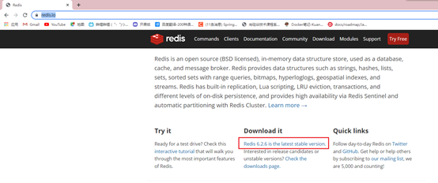

### (二)、Centos7准备环境

安装C 语言的编译环境

```
yum install –y centos-release-scl scl-utils-build
yum install -y devtoolset-8-toolchain
scl enable devtoolset-8 bash
gcc –verson
```

 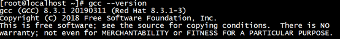

### (三)、上传压缩包

```
ctrl+p
cd /opt
```

 

### (三)、解压文件

```
tar –zxvf redis-6.2.6.tar.gz
cd redis-6.2.6
make
```

### (四)、安装

```
make install
```

### (五)、进入/usr/local/bin查看文件

```
cd /usr/local/bin
ls
```

 

安装成功

### (六)、目录介绍

```
查看默认安装目录：
redis-benchmark:性能测试工具，可以在自己本子运行，看看自己本子性能如何
redis-check-aof：修复有问题的AOF文件，rdb和aof后面讲
redis-check-dump：修复有问题的dump.rdb文件
redis-sentinel：Redis集群使用
redis-server：Redis服务器启动命令
redis-cli：客户端，操作入口
```

### (七)、后台启动

```
编辑/opt/redis-6.2.6/下的redis.conf
第257行修改为yes,支持后台启动
```

 

```
使用redis-server加这个路径文件名就能后台启动了
redis-server redis.conf
```

 

### (八)、测试连接

 

### (九)、停止redis

进去服务器

 

shutdown

 

## 二、常用五大数据类型

### (一)、Redis键(key)操作

```shell
keys *      	# 查看当前库所有key  (匹配：keys *1)
exists key      # 判断某个key是否存在
type key       	# 查看你的key是什么类型
del key     	# 删除指定的key数据
unlink key      # 根据value选择非阻塞删除
仅将keys从keyspace元数据中删除，真正的删除会在后续异步操作。
expire key 10   # 10秒钟：为给定的key设置过期时间
ttl key         # 查看还有多少秒过期，-1表示永不过期，-2表示已过期
select       	# 命令切换数据库
dbsize      	# 查看当前数据库的key的数量
flushdb        	# 清空当前库
flushall        # 通杀全部库
```

### (二)、Redis字符串(String)

#### 1、简介

String是Redis最基本的类型，一个key对应一个value。

String类型是二进制安全的。意味着Redis的string可以包含任何数据。比如jpg图片或者序列化的对象。

String类型是Redis最基本的数据类型，一个Redis中字符串value最多可以是512M

#### 2、String常用命令

```shell
set key value           	# 如果不存在则创建一个key value,如果key已存在修改value的值
get key              		# 获取key的value值
strlen key           		# 获取key的长度
setnx key value       		# 创建一个key value,如果key已存在报错
incr key             		# 将key中储存的值+1,value必须为数字类型
decr key             		# 将key中储存的值-1,value必须为数字类型
incr key 步长           	   # 将key中储存的值+步长,value必须为数字类型
decr key 步长          	   # 将key中储存的值-步长,value必须为数字类型
mset key value key value    # 创建多个key value
mget key value key value    # 获取多个key的value值
msetnx key value key vale	# 创建多个key value值,key不存在情况下
getrange key 3 4        	# 获取一个key的第三个字符到第四个字符,包前包后
setrange key 3 value     	# 在第三个字符后面插入一个value
setex key 过期时间 value   	  # 规定一个key过期时间
getset key value         	# 查看一个key的value,但随后被替换为新的value
```

### (三)、Redis列表(List)

#### 1、简介

Redis 列表是简单的字符串列表，按照插入顺序排序。你可以添加一个元素到列表的头部（左边）或者尾部（右边）。

它的底层实际是个双向链表，对两端的操作性能很高，通过索引下标的操作中间的节点性能会较差。

 

#### 2、常用命令

```
lpush key value1 value2 valu3           # 在左边插入值,结果是 value3 value2 value1
rpush key value1 value2 valu3        	# 在右边插入值,结果是 value1 value2 value3
rpoplpush key1 key2             		# 从key1的右边吐出一个值,就像迭代器一样,每执行一次吐出一个值加到key2后面
lrange key value start stop           	# 取出这个key的start stop的值,0 -1是取出全部
lindex key index               			# 根据index取出value的值
llen key                      			# 获取key的长度
linsert key before value newvalue       # 在本来的value值后面插入一个值
lrem key n value                 		# 从左边删除n个value
lset key index value              		# 将key下标为index的value替换为新的value
```

### (四)、Redis集合(Set)

#### 1、简介

无序集合

#### 2、常用命令

```shell
sadd key value value            # 创建一个新的集合
smembers key                   	# 取出该集合所有的值
sismember key value             # 判断该集合是否含有value值 有1 无0
scard key                    	# 返回该集合的元素个数
srem key value1 value2          # 删除集合中的value元素
spop   key                      # 随机吐出集合的一个值,吐出就删除了
srandmember key n              	# 随机从集合中取出n个值,不删除
smove key1 key2 value           # 从key1中取出value添加到key2中
sinter key1 key2              	# 返回两个集合交集的元素,2个集合都有的值
sunion key1 key2                # 返回两个集合并集的元素,2个集合全部的值
sdiff key1 key2                 # 返回两个集合差集的元素,key1中没有key2的值
```

### (五)、Redis哈希(Hash)

#### 1、简介

Redis hash是一个string类型的field和value的映射表，hash特别适合用于存储对象。

 

#### 2、常用命令

```shell
hset key field value         # 添加一个哈希集合,添加一个值 hset user id 1
hget key field               # 获取key中field的value值
hmset key field value1 field value2 # 添加一个哈希结合,添加多个值 hmset user id 1 name zhangsan
hexists key field            # 查看哈希表key中,field是否存在
hkeys key              		 # 列出该hash集合所有的value
hincrby key field increment  # 为哈希表key中field的value值加步长
hsetnx key field value       # 在哈希表key中添加一列firld-value
```

### (六)、Redis有序集合(sorted set)

#### 1、简介

Redis有序集合zset与普通集合set非常相似，是一个没有重复元素的字符串集合。

不同之处是有序集合的每个成员都关联了一个**评分（score）**,这个评分（score）被用来按照从最低分到最高分的方式排序集合中的成员。集合的成员是唯一的，但是评分可以是重复了 。

#### 2、常用命令

```shell
zadd key 评分 value 评分 value          		# 创建一个有序集合,根据评分选择先后
zrange key start end withscores           	  # 返回下标为几到几的,withscores显示评分
zrangebyscore key 评分~评分 [withscores]    	# 返回评分几到几,withscores显示评分
zrevrangebyscore key 评分~评分 [withscores] 	# 返回key中频分几到几的值,withscores显示评分,从大到小排列
zincrby key 步长 value                	 	 # 为key中的value评分加步长
zrem key value                  			  # 删除指定的值
zcount key min max                    		  # 评分几到几的个数
zrank key value                     		  # 返回该值在集合中的排名,从0开始
```

## 三、配置文件介绍

### (一)、units单位

配置大小单位,开头定义了一些基本的度量单位，只支持bytes，不支持bit

大小写不敏感

 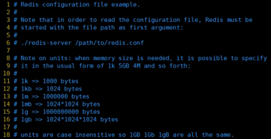

### (二)、Incloud包含

类似jsp中的include，多实例的情况可以把公用的配置文件提取出来

 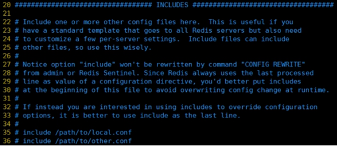

### (三)、网络相关配置

#### 1、bind

默认情况bind=127.0.0.1只能接受本机的访问请求

不写的情况下，无限制接受任何ip地址的访问

生产环境肯定要写你应用服务器的地址；服务器是需要远程访问的，所以需要将其注释掉

如果开启了protected-mode，那么在没有设定bind ip且没有设密码的情况下，Redis只允许接受本机的响应

 

#### 2、protected-mod

将本机访问保护模式设置no

 

#### 3、post

端口号，默认 6379

 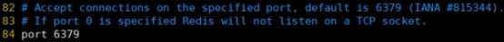

#### 4、tcp-backlog

设置tcp的backlog，backlog其实是一个连接队列，backlog队列总和=未完成三次握手队列 + 已经完成三次握手队列。

在高并发环境下你需要一个高backlog值来避免慢客户端连接问题。

 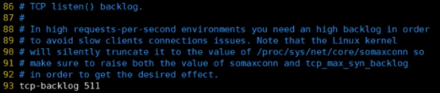

#### 5、timeout

当客户端连接停止多少秒不操作停止关闭连接, 0表示关闭该功能。即永不关闭。

 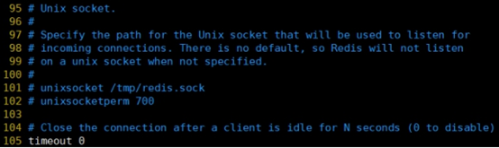

#### 6、tcp-keepalive

时隔多少秒对客户端进行检测是否存活

对访问客户端的一种心跳检测，每个n秒检测一次。

单位为秒，如果设置为0，则不会进行Keepalive检测，建议设置成60 

 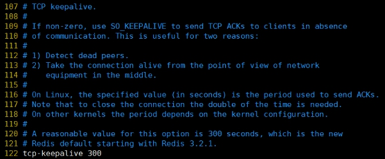

### (四)、General

#### 1、daemonize

是否为后台进程，设置为yes

 

#### 2、pidfile

存放pid文件的位置，每个实例会产生一个不同的pid文件

 

#### 3、loglevel

指定日志记录级别，Redis总共支持四个级别：debug、verbose、notice、warning，默认为**notice**

四个级别根据使用阶段来选择，生产环境选择notice 或者warning

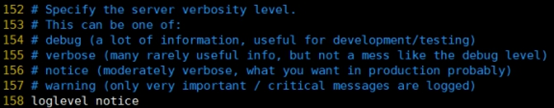

#### 4、database 16

设定库的数量 默认16，默认数据库为0，可以使用SELECT <dbid>命令在连接上指定数据库id

 

### (五)、security安全

#### 1、设置密码

 

访问密码的查看、设置和取消

在命令中设置密码，只是临时的。重启redis服务器，密码就还原了。

永久设置，需要再配置文件中进行设置。

 

### (六)、limits限制

#### 1、maxclients

设置redis同时可以与多少个客户端进行连接。

默认情况下为10000个客户端。

如果达到了此限制，redis则会拒绝新的连接请求，并且向这些连接请求方发出“max number of clients reached”以作回应。

 

#### 2、maxmemory

建议**必须设置**，否则，将内存占满，造成服务器宕机

设置redis可以使用的内存量。一旦到达内存使用上限，redis将会试图移除内部数据，移除规则可以通过maxmemory-policy来指定。

如果redis无法根据移除规则来移除内存中的数据，或者设置了“不允许移除”，那么redis则会针对那些需要申请内存的指令返回错误信息，比如SET、LPUSH等。

但是对于无内存申请的指令，仍然会正常响应，比如GET等。如果你的redis是主redis（说明你的redis有从redis），那么在设置内存使用上限时，需要在系统中留出一些内存空间给同步队列缓存，只有在你设置的是“不移除”的情况下，才不用考虑这个因素。

 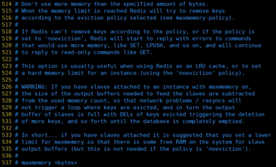

#### 3、maxmemory-policy

volatile-lru：使用LRU算法移除key，只对设置了过期时间的键；（最近最少使用）

allkeys-lru：在所有集合key中，使用LRU算法移除key

volatile-random：在过期集合中移除随机的key，只对设置了过期时间的键

allkeys-random：在所有集合key中，移除随机的key

volatile-ttl：移除那些TTL值最小的key，即那些最近要过期的key

noeviction：不进行移除。针对写操作，只是返回错误信息

 

#### 4、maxmemory-samples

设置样本数量，LRU算法和最小TTL算法都并非是精确的算法，而是估算值，所以你可以设置样本的大小，redis默认会检查这么多个key并选择其中LRU的那个。

一般设置3到7的数字，数值越小样本越不准确，但性能消耗越小。


##   四、Redis的发布和订阅

### (一)、什么是发布和订阅

Redis 发布订阅 (pub/sub) 是一种消息通信模式：发送者 (pub) 发送消息，订阅者 (sub) 接收消息。

 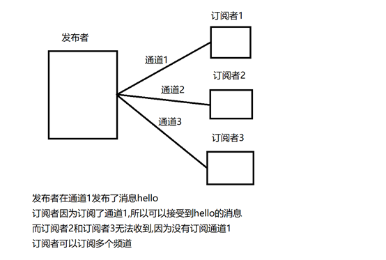

Redis 客户端可以订阅任意数量的 

### (二)、发布和订阅的实现

#### 1、打开一个客户端订阅通道一

```
subscribe channel1
```

 

#### 2、再打开一个客户端在channel1发布消息

```
publish channel1 hello
```

 

返回的1是订阅者数量

#### 3、打开第一个客户端可以看到发送的信息

 

## 五、Redis新数据类型

### (一)、BitMaps

#### 1、   简介

Bitmaps本身不是一种数据类型，实际上它就是把字符串(key-value),但是它可以对字符串的位进行操作

Bitmaps是一个位单位的数组，数组的每个单元只能存储0和1，数组下标bitmaps中叫做偏移量

 

#### 2、   命令

```
Setbit key offset value         # 创建一个Bitmaps中某个偏移量的值 0 或 1
```

演示案例：

当某某用户访问网站的时候就把他的偏移量变为1

设置1 6 11 15 19号用户访问过网站

 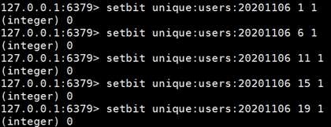

```
Getbit key offset           # 获取bitmaps中的某个偏移量
```

演示案例：

获取id为8的用户是否在某天访问过，返回0说明没有访问过：

 

```
Bitcount key               	 # 获取这个key中为1的数量
Bitcount key start end       # 计算start*8到end*8中1的个数
```

举例： K1 【01000001 01000000 00000000 00100001】，对应【0，1，2，3】

Bitop and(or/not/xor) destkey key # bitop是一个复合操作， 它可以做多个Bitmaps的and(交集)、 or、(并集) 、 not(非) 、 xor(异或) 操作并将结果保存在destkey中。

演示案例：

2020-11-04 日访问网站的userid=1,2,5,9。

setbit unique:users:20201104 1 1

setbit unique:users:20201104 2 1

setbit unique:users:20201104 5 1

setbit unique:users:20201104 9 1

 

2020-11-03 日访问网站的userid=0,1,4,9。

setbit unique:users:20201103 0 1

setbit unique:users:20201103 1 1

setbit unique:users:20201103 4 1

setbit unique:users:20201103 9 1

 

计算出两天都访问过网站的用户数量

bitop and unique:users:and:20201104_03 unique:users:20201103 unique:users:20201104

Bitop 并集  暂时存储的集合      20201103号     20201104号

#### 3、   说明

用户多的时候用bitmaps 用户少的时候使用key-value

### (二)、HyperLogLog

#### 1、简介

用于记录不重复的数据,比如说在这个类型中的一个key中存储了java,再存java就失败了

#### 2、命令

```
pfadd key 值1 值2            # 创建一个set差不多的数据类型
```

 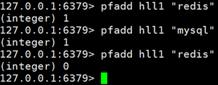

```
pfcount key [key…]            # 统计1个或多个key中不重复的数据
```

 

```
pfmerge key3 key2 key1             # 将key1和key2的值合并到key3中
```

 

### (三)、Geospatial

#### 1、简介

对地理位置的操作

#### 2、命令

```
**geoadd** key 经度 纬度 名称         # 添加一个或多个地理位置坐标
```

 

两极无法直接添加，一般会下载城市数据，直接通过 Java 程序一次性导入。

有效的经度从 -180 度到 180 度。有效的纬度从 -85.05112878 度到 85.05112878 度。

当坐标位置超出指定范围时，该命令将会返回一个错误。

已经添加的数据，是无法再次往里面添加的。

```
**geopos** key 城市名                 # 返回地理位置的经度,纬度
```

 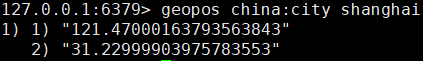

```
**geodist** key 地理位置 地理位置 [m|km|ft|mi] # 获取2个位置之间的直线距离
```

 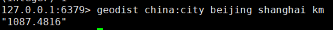

单位：

m 表示单位为米[默认值]。

km 表示单位为千米。

mi 表示单位为英里。

ft 表示单位为英尺。

如果用户没有显式地指定单位参数， 那么 GEODIST 默认使用米作为单位

**georadius** key 经度 纬度 距离 单位    # 找出经度纬度半径距离画圆之内的城市

## 六、Redis_Jedis

### (一)、环境配置

#### 1、   Jedis需要的jar包

创建一个普通的Maven---导入jar包

```xml
<dependencies>
  <dependency>
    <groupId>redis.clients</groupId>
    <artifactId>jedis</artifactId>
    <version>3.2.0</version>
  </dependency>
</dependencies>
```

#### 2、   linux开启对外开放

```
vi /opt/redis-6.2.6/redis.conf
```

75行注释

 

94行改为no

 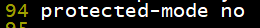

关闭防火墙和selinux

 

#### 3、   创建测试类

```java
@Test
public void test1(){
    Jedis jedis = new Jedis("192.168.2.166", 6379);
    String pong = jedis.ping();
    System.out.println("连接成功:"+pong);
    jedis.close();
}
```

### (二)、key

```java
@Test
public void test2(){
    //设置第一个key值
    jedis.set("k1","value1");
    //设置第二个key值
    jedis.set("k2","value2");
    //获取对应key的value
    jedis.get("k1");
    //获取所有的key
    Set<String> keys = jedis.keys("*");
    for (String key : keys) {
        System.out.println(key);
    }
    //查看这个key是否有值
    System.out.println(jedis.exists("k1"));
    //查看这个key的存活时间
    System.out.println(jedis.ttl("k2"));
    jedis.close();
}
```

### (三)、String

```java
@Test
public void test3(){
    //添加多个值
    jedis.mset("k1","value1","k2","value2");
    //获取多个key的value值
    System.out.println(jedis.mget("k1","k2"));
    jedis.close();
}
```

### (四)、List

```java
@Test
public void test4(){
    //创建一个list,存放2个值
    jedis.rpush("myList","aaa","bbb");
    //获取mylist的value
    List<String> myList = jedis.lrange("myList", 0, -1);
    for (String s : myList) {
        System.out.println(s);
    }
}
```

### (五)、Set

```java
@Test
public void test5(){
    //创建一个set添加值
    jedis.sadd("myset","aaa");
    jedis.sadd("myset","bbb");
    jedis.sadd("myset","ccc");
    //获取值
    Set<String> myset = jedis.smembers("myset");
    for (String s : myset) {
        System.out.println(s);
    }
    //查看value在set的哪一个位置
    System.out.println(jedis.srem("myset", "aaa"));
}
```

### (六)、Hash

```java
@Test
public void test6(){
    //创建一个hash的person并赋值
    jedis.hset("person", "id","1" );
    jedis.hset("person", "name", "zhangsan");
    //获取pserson的name中的value
    System.out.println(jedis.hget("person", "name"));
    //声明一个map
    Map<String, String> map = new HashMap<>();
    map.put("dianhua", "18595926383");
    map.put("address", "192.168.1.1");
    map.put("email", "299@qq.cm");
    //创建一个set把map信息装进去
    jedis.hmset("personInfo", map);
    //获得一个key中属性的值
    List<String> hmget = jedis.hmget("personInfo", "dianhua", "address");
    for (String s : hmget) {
        System.out.println(s);
    }
}
```

### (七)、zset

```java
@Test
public void test7(){
    jedis.zadd("myZadd", 100, "a");
    jedis.zadd("myZadd", 90, "b");
    jedis.zadd("myZadd", 80, "c");
    Set<String> zadd = jedis.zrange("myZadd", 0, -1);
    for (String s : zadd) {
        System.out.println(s);
    }
}
```

## 七、SpringBoot整合Redis

### (一)、导入jar包

```xml
<!-- redis -->
<dependency>
    <groupId>org.springframework.boot</groupId>
    <artifactId>spring-boot-starter-data-redis</artifactId>
</dependency>
```

### (二)、application配置redis

```properties
#Redis服务器地址
spring.redis.host=192.168.2.166
#Redis服务器连接端口
spring.redis.port=6379
#Redis数据库索引（默认为0）
spring.redis.database=0
#连接超时时间（毫秒）
spring.redis.timeout=1800000
#连接池最大连接数（使用负值表示没有限制）
spring.redis.lettuce.pool.max-active=20
#最大阻塞等待时间(负数表示没限制)
spring.redis.lettuce.pool.max-wait=-1
#连接池中的最大空闲连接
spring.redis.lettuce.pool.max-idle=5
#连接池中的最小空闲连接
spring.redis.lettuce.pool.min-idle=0
```

### (三)、导入配置类(固定写法)

```java
@EnableCaching
@Configuration
public class RedisConfig {

    @Bean
    public RedisTemplate<String, Object> redisTemplate(RedisConnectionFactory factory) {
        RedisTemplate<String, Object> template = new RedisTemplate<>();
        RedisSerializer<String> redisSerializer = new StringRedisSerializer();
        Jackson2JsonRedisSerializer jackson2JsonRedisSerializer = new Jackson2JsonRedisSerializer(Object.class);
        ObjectMapper om = new ObjectMapper();
        om.setVisibility(PropertyAccessor.ALL, JsonAutoDetect.Visibility.ANY);
        om.enableDefaultTyping(ObjectMapper.DefaultTyping.NON_FINAL);
        jackson2JsonRedisSerializer.setObjectMapper(om);
        template.setConnectionFactory(factory);
        //key序列化方式
        template.setKeySerializer(redisSerializer);
        //value序列化
        template.setValueSerializer(jackson2JsonRedisSerializer);
        //value hashmap序列化
        template.setHashValueSerializer(jackson2JsonRedisSerializer);
        return template;
    }

    @Bean
    public CacheManager cacheManager(RedisConnectionFactory factory) {
        RedisSerializer<String> redisSerializer = new StringRedisSerializer();
        Jackson2JsonRedisSerializer jackson2JsonRedisSerializer = new Jackson2JsonRedisSerializer(Object.class);
        //解决查询缓存转换异常的问题
        ObjectMapper om = new ObjectMapper();
        om.setVisibility(PropertyAccessor.ALL, JsonAutoDetect.Visibility.ANY);
        om.enableDefaultTyping(ObjectMapper.DefaultTyping.NON_FINAL);
        jackson2JsonRedisSerializer.setObjectMapper(om);
        // 配置序列化（解决乱码的问题）,过期时间600秒
        RedisCacheConfiguration config = RedisCacheConfiguration.defaultCacheConfig()
                .entryTtl(Duration.ofSeconds(600))
                .serializeKeysWith(RedisSerializationContext.SerializationPair.fromSerializer(redisSerializer))
                .serializeValuesWith(RedisSerializationContext.SerializationPair.fromSerializer(jackson2JsonRedisSerializer))
                .disableCachingNullValues();
        RedisCacheManager cacheManager = RedisCacheManager.builder(factory)
                .cacheDefaults(config)
                .build();
        return cacheManager;
    }
    
}
```

### (四)、创建Controller进行测试

 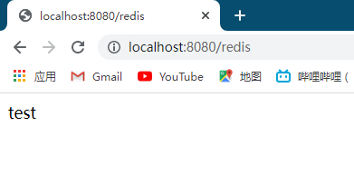

## 八、事务锁秒杀

### (一)、事务的定义

Redis事务是一个单独的隔离操作：事务中的所有命令都会序列化、按顺序地执行。事务在执行的过程中，不会被其他客户端发送来的命令请求所打断。

Redis事务的主要作用就是串联多个命令防止别的命令插队。

### (二)、Multi(组队)、Exec(执行)、discard(取消组队)

#### 1、介绍

从输入Multi命令开始，输入的命令都会依次进入命令队列中，但不会执行，直到输入Exec后，Redis会将之前的命令队列中的命令依次执行。

 

#### 2、案例

##### 2.1、三种情况:

   组队执行成功----------顺利执行

   组队失败,执行成功---所有失败

   组队成功,执行失败---就执行失败的哪一条失败

##### 2.2、组队执行成功

 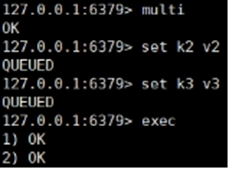

##### 2.2、组队阶段失败,全部失败

 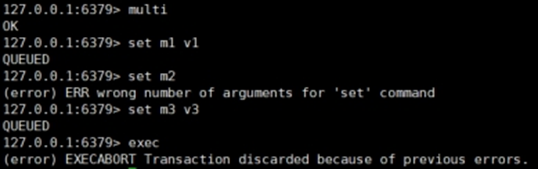

##### 2.3、组队成功,执行失败

 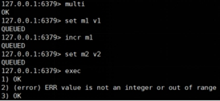

### (三)、事务冲突问题

一个请求想给金额减8000

一个请求想给金额减5000

一个请求想给金额减1000

 

### (四)、锁

#### 1、悲观锁

 

当一个去操作数据是给数据上锁,其他人不能使用该数据,当使用完释放锁

传统的关系型数据库里边就用到了很多这种锁机制，比如行锁，表锁等，读锁，写锁等，都是在做操作之前先上锁。

#### 2、乐观锁

 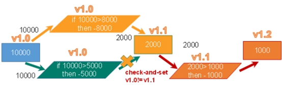

当一个人去操作数据的时候不会上锁,其他人也可以拿数据,但是当一个人修改完数据,其他人操作的时候会去检测是否有人修改了数据,如果有人修改了数据,则进行更新

**乐观锁适用于多读的应用类型，这样可以提高吞吐量**。Redis就是利用这种check-and-set机制实现事务的。

### (五)、乐观锁演示

#### 1、第一个客户端

```java
set blance 100       //创建一个key
watch blance         //监视这个key
multi         		 //开启事务组队模式
decrby blance 10     //给这个key+10
exec             	 //执行+10操作
```

#### 2、第二个客户端

```java
watch blance         //第二个也监视这个key
multi          		 //开启事务组队
decrby blance 10     //同样进行+10操作
exec             	 //开始执行
(null)          	 //执行失败,因为第一个客户端已经修改了这个值
```

### (六)、unwatch

1、取消 WATCH 命令对所有 key 的监视。

2、如果在执行 [WATCH](http://doc.redisfans.com/transaction/watch.html#watch) 命令之后， [EXEC](http://doc.redisfans.com/transaction/exec.html#exec) 命令或 [DISCARD](http://doc.redisfans.com/transaction/discard.html#discard) 命令先被执行了的话，那么就不需要再执行 [UNWATCH](http://doc.redisfans.com/transaction/unwatch.html#unwatch) 了。

3、因为 [EXEC](http://doc.redisfans.com/transaction/exec.html#exec) 命令会执行事务，因此 [WATCH](http://doc.redisfans.com/transaction/watch.html#watch) 命令的效果已经产生了；而 [DISCARD](http://doc.redisfans.com/transaction/discard.html#discard) 命令在取消事务的同时也会取消所有对 key 的监视，因此这两个命令执行之后，就没有必要执行 [UNWATCH](http://doc.redisfans.com/transaction/unwatch.html#unwatch) 了。

### (七)、Redis事务三特性

Ø 单独的隔离操作 

​		事务中的所有命令都会序列化、按顺序地执行。事务在执行的过程中，不会被其他客户端发送来的命令请求所打断。 

Ø 没有隔离级别的概念 

 		队列中的命令没有提交之前都不会实际被执行，因为事务提交前任何指令都不会被实际执行

Ø 不保证原子性 

​		事务中如果有一条命令执行失败，其后的命令仍然会被执行，没有回滚 

### (八)、Redis事务--秒杀并发模拟

使用工具ab模拟测试

CentOS6 默认安装

CentOS7需要手动安装

#### 1、准备处理业务程序

```java
//秒杀过程
public static boolean doSecKill(String uid, String prodid) throws IOException {
    //判断参数是否为空
    if (uid == null && prodid == null) {
        return false;
    }
    //连接数据库
    Jedis jedis = new Jedis("192.168.2.166", 6379);


    //拼接字符串
    String kckey = "sk:" + prodid + ":qt";
    String userkey = "sk:" + prodid + ":user";
    //判断秒杀是否开始
    String kc = jedis.get(kckey);
    if (kc == null) {
        System.out.println("秒杀还没有开始");
        jedis.close();
        return false;
    }
    //判断用户是否秒杀成功过
    if (jedis.sismember(userkey, uid)) {
        System.out.println("您已经秒杀过了");
        jedis.close();
        return false;
    }
    //判断商品是否为空
    if(Integer.parseInt(kc)<=0){
        System.out.println("商品已被抢空");
        jedis.close();
        return false;
    }
    //库存-1
    jedis.decr(kckey);
    System.out.println("秒杀成功");
    //添加抢购成功用户id
    jedis.sadd(userkey, uid);
    return true;
}
```

#### 2、联网安装

```
yum –y install httpd-tools
```

#### 3、在当前文件夹下创建一个postfile文件

```
vi postfile
prodid=0101&
```

#### 4、在redis中创建商品的key

```
set sk:0101:qt 10
```

#### 5、并发测试

```shell
2000连接数   200个位并发请求
ab -n 2000 -c 200 -k -p ~/postfile -T application/x-www-form-urlencoded http://192.168.2.115:8081/Seckill/doseckill
```

#### 6、发现商品溢出

 

### (九)、乐观锁解决超卖问题

```java
//秒杀过程
public static boolean doSecKill(String uid, String prodid) throws IOException {
    //判断参数是否为空
    if (uid == null && prodid == null) {
        return false;
    }
    //连接数据库
    Jedis jedis = new Jedis("192.168.2.166", 6379);

    //拼接字符串
    String kckey = "sk:" + prodid + ":qt";
    String userkey = "sk:" + prodid + ":user";

    //增加乐观锁
    jedis.watch(kckey);

    //判断秒杀是否开始
    String kc = jedis.get(kckey);
    if (kc == null || "".equals(kc.trim())) {
        System.out.println("秒杀还没有开始");
        jedis.close();
        return false;
    }
    //判断用户是否秒杀成功过
    if (jedis.sismember(userkey, uid)) {
        System.out.println("您已经秒杀过了");
        jedis.close();
        return false;
    }
    //判断商品是否为空
    if(Integer.parseInt(kc)<=0){
        System.out.println("商品已被抢空");
        jedis.close();
        return false;
    }

    //增加事务
    Transaction multi = jedis.multi();
    //库存-1
    multi.decr(kckey);
    //添加抢购成功用户id
    multi.sadd(userkey, uid);
    List<Object> exec = multi.exec();
    if(exec==null||exec.size()==0){
        System.out.println("秒杀失败");
        jedis.close();
        return false;
    }
    System.err.println("秒杀成功");
    jedis.close();
    return true;
}
```

## 九、连接池

节省每次连接redis服务带来的消耗，把连接好的实例反复利用。

通过参数管理连接的行为

代码见项目中

- 链接池参数
  - MaxTotal：控制一个pool可分配多少个jedis实例，通过pool.getResource()来获取；如果赋值为-1，则表示不限制；如果pool已经分配了MaxTotal个jedis实例，则此时pool的状态为exhausted。
  - maxIdle：控制一个pool最多有多少个状态为idle(空闲)的jedis实例；
  - MaxWaitMillis：表示当borrow一个jedis实例时，最大的等待毫秒数，如果超过等待时间，则直接抛JedisConnectionException；
  - testOnBorrow：获得一个jedis实例的时候是否检查连接可用性（ping()）；如果为true，则得到的jedis实例均是可用的；

```java
public static JedisPool getJedisPoolInstance() {
   if (null == jedisPool) {
      synchronized (JedisPoolUtil.class) {
         if (null == jedisPool) {
            JedisPoolConfig poolConfig = new JedisPoolConfig();
            poolConfig.setMaxTotal(200);
            poolConfig.setMaxIdle(32);
            poolConfig.setMaxWaitMillis(100*1000);
            poolConfig.setBlockWhenExhausted(true);
            poolConfig.setTestOnBorrow(true);  // ping  PONG
            jedisPool = new JedisPool(poolConfig, "192.168.44.168", 6379, 60000 );
         }
      }
   }
   return jedisPool;
} 

public static void release(JedisPool jedisPool, Jedis jedis) {
   if (null != jedis) {
      jedisPool.returnResource(jedis);
   }
}
```

 

 