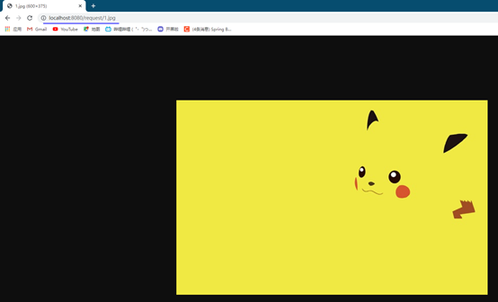
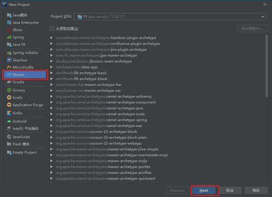

# SpringBoot2

## 一、创建一个简单的工程

### （一）、HelloWored


### （二）、在POM中添加依赖

```xml
 <parent>
     <groupId>org.springframework.boot</groupId>
     <artifactId>spring-boot-starter-parent</artifactId>
     <version>2.3.4.RELEASE</version>
 </parent>
 
 <dependencies>
     <dependency>
         <groupId>org.springframework.boot</groupId>
         <artifactId>spring-boot-starter-web</artifactId>
     </dependency>
 </dependencies>
```

### （三）、创建主程序

​     

### （四）、使用@SpringBootApplication注解声明这是一个SpringBoot程序

```java
@SpringBootApplication
public class MyMain {
     
}
```

### （五）、创建main方法让主程序跑起来

```java
@SpringBootApplication
public class MyMain {
 
    public static void main(String[] args) {
        SpringApplication.run(MyMain.class,args);
    }
}
```

### （六）、创建控制层类

```java
//Controller和RequestBody的合体
@RestController
public class MyController {
 
     //创建一个控制器
     @RequestMapping("/hello")
     public String test1(){
         return "hello";
    }
}
```

### （七）、创建配置文件application.properties

```properties
# 设置端口号
server.port=8888
```

### （八）、一键打包设置

```xml
 <build>
     <plugins>
         <plugin>
             <groupId>org.springframework.boot</groupId>
             <artifactId>spring-boot-maven-plugin</artifactId>
         </plugin>
     </plugins>
 </build>
```

### （九）、打包

​    

### （十）、修改自己需要的版本依赖（如mysql）

```xml
 <properties>
          <mysql.version>8.0.21</mysql.version>
 </properties>
```

### （十一）、扩展包扫描范围

```java
@SpringBootApplication(scanBasePackages = "com.ma")
public class MyMain {
 
     public static void main(String[] args) {
         SpringApplication.run(MyMain.class,args);
    }
}
```

## 二、注解

### (一)、@configuration注解

- 说明：

该注解用于类上，表明该类是一个Spring管理器

- proxyBeanMethods属性：

​           当proxyBeanMethods为false的时候就不是单例模式了
​           当为true的时候都是从容器中获取的一个对象

```java
@Configuration(proxyBeanMethods = true)
public class MyController {

    /**
     * 当@Bean后面每值的时候ioc中容器的名字为方法名
     * 当@Bean中有名字的时候ioc中容器名字为value值
     * @return
     */
    @Bean("user")
    public User user1(){
        return new User(18,"小马");
    }

    @Bean
    public Pat cat(){
        return new Pat("小猫","吃老鼠");
    }
```

- **使用：**

```java
//调用启动器获取对象
ConfigurableApplicationContext run = SpringApplication.run(MyMain.class, args);
 
//获得ioc容器中user对象
//测试@Bean中带名字
User user = run.getBean("user", User.class);
System.out.println(user);

//获得ioc容器中cat
//测试@Bean中不带名字
Pat cat = run.getBean("cat", Pat.class);
System.out.println(cat);
```

### (二)、@imput注解（”User.class”）

- 说明：

​      导入特定的组件，默认是类的全类名

```java
@Import({User.class})
```

- 测试：

```java
//获取全部组件
String[] beanNamesForType = run.getBeanNamesForType(User.class);
for (String s : beanNamesForType) {
    System.out.println(s);
}
```

- 结果：

 

### (三)、@conditional注解

- 说明：  

​      当达成某个条件的时候才向ioc中注册组件

- 使用：

```java
//当容器中有cat组件的时候才注册user
@ConditionalOnBean(name = "user")
@Bean("user")
public User user1(){
    return new User(18,"小马");
}
 
//当容器中有cat的时候注册MyController中的所有方法
@Import({User.class})
@Configuration
@ConditionalOnBean(name = "user")  
public class MyController {
```

### (四)、@InportResource注解

- 说明：

​      将XML中的所有Bean注册到容器中

- XML:

```xml
<?xml version="1.0" encoding="UTF-8"?>
<beans xmlns="http://www.springframework.org/schema/beans"
       xmlns:xsi="http://www.w3.org/2001/XMLSchema-instance"
       xsi:schemaLocation="http://www.springframework.org/schema/beans http://www.springframework.org/schema/beans/spring-beans.xsd">
    
        <beans>
            <bean id="haha" class="com.ma.boot.pojo.User">
                <property name="name" value="zhangsan"/>
                <property name="age" value="19"/>
            </bean>
        </beans> 
</beans>
```

- Spring配置类

```java
@ImportResource(classPath:beans.xml)
Public class MyConfig     
```

### (五)、@ConfigurationProperties(prefix = "person")

- 说明:

读取配置文件注入属性,但pojo类必须在容器中

### (六)、第一种方式:pojo加入容器

- 配置文件:

```properties
# person属性注入
person.age=18
person.name=马佳盛
person.gender=男
```

- Pojo类:

```java
@Data
@AllArgsConstructor
@NoArgsConstructor
@Component                                                       //加入容器
@ConfigurationProperties(prefix = "person")      //开启文件配置注入前缀为person
public class Person {
    private int age;
    private String name;
    private String gender;
}
```

- 控制器测试:

```java
@RestController
public class MyController {

    @Autowired                                  //自动装配
    private Person person;

    /**
     * 创建一个控制器
     */
    @RequestMapping("/hello")
    public String test1(){
        return "hello";
    }

    @RequestMapping("/hello1")
    public Person test2(){
        return person;
    }
}
```

### (七)、第二种方式:使用EnableConfigurationProperties

- 控制器测试:

```java
@RestController
@EnableConfigurationProperties(Person.class)   //开启配置文件注入并加入容器
public class MyController {

    @Autowired
    private Person person;

    /**
     * 创建一个控制器
     */
    @RequestMapping("/hello")
    public String test1(){
        return "hello";
    }

    @RequestMapping("/hello1")
    public Person test2(){
        return person;
    }
}
```

## 三、SpringBoot的自动配置

### (一)、自动配置【源码分析】-自动包规则原理

#### 1、Spring Boot启动类

```java
@SpringBootApplication                      //声明该类为SpringBoot配置类
public class MainApplication {
    public static void main(String[] args) {
        SpringApplication.run(MainApplication.class, args);
    }
}
```

#### 2、SpringBootApplication底层

```java
@Target(ElementType.TYPE)
@Retention(RetentionPolicy.RUNTIME)
@Documented
@Inherited
@SpringBootConfiguration                  //配置类
@EnableAutoConfiguration                 //开启自动装配
@ComponentScan(                                                             //包扫描
    excludeFilters = {@Filter(
    type = FilterType.CUSTOM,
    classes = {TypeExcludeFilter.class}
), @Filter(
    type = FilterType.CUSTOM,
    classes = {AutoConfigurationExcludeFilter.class}
)}
)
public @interface SpringBootApplication {
    ...
}
```

重点分析`@SpringBootConfiguration`，`@EnableAutoConfiguration`，`@ComponentScan`

#### 3、@SpringBootConfiguration

只是一个配置类

#### 4、@ComponentScan

只是一个扫描类

#### 5、@EnableAutoConfiguration

```java
@Target(ElementType.TYPE)
@Retention(RetentionPolicy.RUNTIME)
@Documented
@Inherited
@AutoConfigurationPackage
@Import(AutoConfigurationImportSelector.class)
public @interface EnableAutoConfiguration {
    String ENABLED_OVERRIDE_PROPERTY = "spring.boot.enableautoconfiguration";
    Class<?>[] exclude() default {};
    String[] excludeName() default {};
}
```

重点分析: @AutoConfigurationPackage,@Import(AutoConfigurationImportSelector.class)

#### 6、@AutoConfigurationPackage

自动配置包，指定了默认的包规则。

```java
@Target(ElementType.TYPE)
@Retention(RetentionPolicy.RUNTIME)
@Documented
@Inherited
@Import(AutoConfigurationPackages.Registrar.class)//给容器中导入一个组件
public @interface AutoConfigurationPackage {
    String[] basePackages() default {};
    Class<?>[] basePackageClasses() default {};
}
```

1. 利用Registrar给容器中导入一系列组件

2. 将指定的一个包下的所有组件导入进MainApplication所在包下。

### (二)、自动配置【源码分析】-初始加载自动配置类

##### @Import(AutoConfigurationImportSelector.class)

(1)、利用getAutoConfigurationEntry(annotationMetadata);给容器中批量导入一些组件

(2) 、调用List<String> configurations = getCandidateConfigurations(annotationMetadata, attributes)获取到所有需要导入到容器中的配置类

(3) 、利用工厂加载 Map<String, List<String>> loadSpringFactories(@Nullable ClassLoader classLoader);得到所有的组件

(4) 、从META-INF/spring.factories位置来加载一个文件。

​		4.1、默认扫描我们当前系统里面所有META-INF/spring.factories位置的文件

​		4.2 、spring-boot-autoconfigure-2.3.4.RELEASE.jar包里面也有META-INF/spring.factories

```properties
# 文件里面写死了spring-boot一启动就要给容器中加载的所有配置类
# spring-boot-autoconfigure-2.3.4.RELEASE.jar/META-INF/spring.factories
# Auto Configure
org.springframework.boot.autoconfigure.EnableAutoConfiguration=\
org.springframework.boot.autoconfigure.admin.SpringApplicationAdminJmxAutoConfiguration,\
org.springframework.boot.autoconfigure.aop.AopAutoConfiguration,\
...
```

虽然我们127个场景的所有自动配置启动的时候默认全部加载，但是`xxxxAutoConfiguration`按照条件装配规则（`@Conditional`），最终会按需配置。

### (三)、总结:

1.SpringBoot先加载所有的自动配置类 xxxxxAutoConfiguration

2.每个自动配置类按照条件进行生效，默认都会绑定配置文件指定的值。（xxxxProperties里面读取，xxxProperties和配置文件进行了绑定）

3.生效的配置类就会给容器中装配很多组件

4.只要容器中有这些组件，相当于这些功能就有了

5.定制化配置

​	5.1 用户直接自己@Bean替换底层的组件

​	5.2 用户去看这个组件是获取的配置文件什么值就去修改。

## 四、yaml的用法

### (一)、基本语法

·     key: value；kv之间有空格

·     大小写敏感

·     使用缩进表示层级关系

·     缩进不允许使用tab，只允许空格

·     缩进的空格数不重要，只要相同层级的元素左对齐即可

·     '#'表示注释

·     字符串无需加引号，如果要加，单引号’’、双引号""表示字符串内容会被 转义、不转义

### (二)、数据类型

#### 1、基础类型

K: v  如:name: 张三

#### 2、对象类型

2.1、行内写法

​      K: {k1:k1,k2:k2,k3:k3}

2.2、多行写法

​      K:

​         K1:k1

​         K2:k2

​         K3:k3

#### 3、数组

3.1、行内写法

K: [k1,k2,k3]

3.2、多行写法

​      K:

​			\-     K1

​			\-     K2

​			\-     K3

### (三)、实例:

#### 1、创建一个yaml文件

 

#### 2、创建实体类

2.1、创建person类

```java
@Data
@AllArgsConstructor
@NoArgsConstructor
@Component
@ConfigurationProperties(prefix = "person")
public class Person {

        private String userName;
        private Boolean boss;
        private Date birth;
        private Integer age;
        private Pet pet;
        private String[] interests;
        private List<String> animal;
        private Map<String, Object> score;
        private Set<Double> salarys;
        private Map<String, List<Pet>> allPets;
}
```

   2.2、创建Pet类

```java
@Data
@AllArgsConstructor
public class Pet {

    private String name;
    private Double weight;
}
```

#### 3、注入属性

```yaml
person:
  userName: zhangsan
  boss: true
  birth: 2021/10/25
  age: 18
  pet:
    name: 阿狗
    weight: 52.1
  interests: [篮球,rap]
  animal:  [小狗,小猫]
  score: {语文:90,数学:30}
  salarys: [19999.9,15555.5]
  allPets:
    shengbing:
      - {name: 小狗,weight: 30.3}
      - {name: 小猫,weight: 40.2}
    meishengbing:
      - {name: 小花,weight: 52.2}
      - {name: 小明,weight: 30.4}
```

#### 4、测试:

```java
@RequestMapping("/hello1")
public Person test2(){
    return person;
}
```


附加:Yaml中单引号和双引号的区别

单引号:纯纯字符串

双引号:\n代表换行

### (四)、提示插件

1、添加依赖

```xml
<dependency>
    <groupId>org.springframework.boot</groupId>
    <artifactId>spring-boot-configuration-processor</artifactId>
    <optional>true</optional>
</dependency>
```

2、打包时不打包


## 五、创建一个简单的web工程

### (一)、创建项目


### (二)、创建文件夹

 

### (三)、访问直接网址/资源名

  

## 六、静态资源的处理

### (一)、更改访问位置

#### 1、在控制类中添加名字相同的资源名

```java
@org.springframework.stereotype.Controller
@ResponseBody
public class Controller {

    @RequestMapping("1.jpg")
    public String test1(){
        return "aaa";
    }
}
```

#### 2、测试

 

#### 3、原理

默认访问的资源名拦截请求是/**,默认在全部位置查找

RequestMapping也是/**,默认全部查找

所以先找动态资源(RequestMapping),再找静态资源

### (二)、更改默认资源访问位置

在application.properites中添加

Spring.mvc.static-path-pattern=访问路径


测试


### (三)、更改静态资源访问路径

在application.properties中添加

Spring.web.resources.static-locations=路径名


测试



## 七、欢迎页

### (一)、静态资源模式

直接在几个静态资源目录中存放index.html


然后进行网页访问


### (二)、控制层方法模式

在控制层类中添加index的映射,访问主目录的时候就会自动查找

### (三)、小图标显示

在静态资源下添加Favicon.ico就会默认将网页小图标替换为Favicon.ico图标,没有网,凑和看,修改的就是这东西


## 八、PUT和DELETE请求的处理

### (一)、HTML网页

```html
<h1>欢迎来到我的网页</h1>
<form action="/user" method="get">
    <input type="submit" value="get方式提交"/>
</form>
<form action="/user" method="post">
    <input type="submit" value="post提交"/>
</form>
<form action="/user" method="post">
    <input type="hidden" name="_method" value="DELETE">
    <input type="submit" value="delete提交"/>
</form>
<form action="/user" method="post">
    <input type="hidden" name="_method" value="put">
    <input type="submit" value="put提交"/>
</form>
```

### (二)、Controller

```java
@org.springframework.stereotype.Controller
@ResponseBody
public class Controller {
    @RequestMapping("2.jpg")
    public String test1(){
        return "aaa";
    }
    @RequestMapping(value = "/user",method = RequestMethod.GET)
    public String getUser(){
        return "GET-张三";
    }
    @RequestMapping(value = "/user",method = RequestMethod.POST)
    public String saveUser(){
        return "POST-张三";
    }
    @RequestMapping(value = "/user",method = RequestMethod.PUT)
    public String putUser(){
        return "PUT-张三";
    }
    @RequestMapping(value = "/user",method = RequestMethod.DELETE)
    public String deleteUser(){
        return "DELETE-张三";
    }
}
```

### (三)、开启拦截器拦截请求更改提交方式

```yaml
spring:
  mvc:
    hiddenmethod:
      filter:
        enabled: true
```

### (四)、Rest原理

表单提交会带上**_method=PUT**

**请求过来被**HiddenHttpMethodFilter拦截

请求是否正常，并且是POST

获取到**_method**的值。

兼容以下请求；**PUT**.**DELETE**.**PATCH**

**原生request（post），包装模式requesWrapper重写了getMethod方法，返回的是传入的值。**

**过滤器链放行的时候用wrapper。以后的方法调用getMethod是调用requesWrapper的。**

### (五)、修改默认Rest请求name

#### 1.创建一个web配置类


#### 2.添加注解,代理模式为false

```java
@Configuration(proxyBeanMethods = false)
public class WebConfig {
```

#### 3.创建自己的HiddenHttpMethodFilter

```java
@Bean
public HiddenHttpMethodFilter hiddenHttpMethodFilter(){
    HiddenHttpMethodFilter methodFilter = new HiddenHttpMethodFilter();
    methodFilter.setMethodParam("_met");        //返回自己识别的name
    return methodFilter;
}
```

## 九、接受参数

@PathVariable(restful风格获取参数)

@RequestHeader(获取请求头)

@RequestParam(获取请求参数 ? 的形式)

@CookieValue(获取cookie的值)

@RequestBody(获取请求体 非get请求)

@RequestAttribute(获取request域的值)

@MatrixVariable(矩阵变量)

### (一)、接受简单的参数

```java
@GetMapping("/person/{id}/zhangsan/{xuhao}")
public Map<String, Object> getPerson(@PathVariable("id") String id,
                                     @PathVariable("xuhao") Integer xuhao,
                                     @PathVariable Map<String,Object> parMap,
                                     @RequestHeader("Host")String hosts,
                                     @RequestHeader Map<String, Object> mapHead){
    Map<String,Object> map = new HashMap<>();
    map.put("id",id);
    map.put("suhao",xuhao);
    map.put("parMap",parMap);
    map.put("Host",hosts);
    map.put("mapHead",mapHead);
    return map;
}
```

### (二)、接受请求域的值

```java
@RequestMapping("/textAtbt")
public String setRequestAtbt(HttpServletRequest request){
    request.setAttribute("name","张三");
    request.setAttribute("age",18);
    return "forward:success";
}

@ResponseBody
@RequestMapping("/success")
public Map<String,Object> getRequestAtbt(@RequestAttribute("name")String name,
                                         @RequestAttribute("age")Integer age,
                                         HttpServletRequest request){
    Map<String, Object> map = new HashMap<>();
    map.put("name",name);
    map.put("age",age);
    String name1 = request.getParameter("name");
    System.out.println(name1);
    return map;
}
```

### (三)、接受矩阵变量

#### 1、语法： 

请求路径：/cars/sell;low=34;brand=byd,audi,yd

​    变量以;隔开,如果有多个值使用,隔开

#### 2、开启矩阵变量功能

实现WebMvcConfigurer接口：手动开启：原理。对于路径的处理。UrlPathHelper的removeSemicolonContent设置为false，让其支持矩阵变量的。

​    手动开启矩阵变量

```java
 @Configuration(proxyBeanMethods = false)
 public class WebConfig implements WebMvcConfigurer {
    @Override
    public void configurePathMatch(PathMatchConfigurer configurer) {
        UrlPathHelper urlPathHelper = new UrlPathHelper();
        // 不移除；后面的内容。矩阵变量功能就可以生效
        urlPathHelper.setRemoveSemicolonContent(false);
        configurer.setUrlPathHelper(urlPathHelper);
    }
}
```

#### 3、矩阵变量必须有url路径才能解析

#### 4、案例:

映射器

```java
@GetMapping("ren/{da}/{xiao}")
public Map<String, Object> ren(@MatrixVariable(value = "name", pathVar = "da") String daName,
               @MatrixVariable(value = "name", pathVar = "xiao")String xiaoName,
               @MatrixVariable(value = "age",pathVar = "da")Integer daAge,
               @MatrixVariable(value = "age",pathVar = "xiao")Integer xiaoAge){

    Map<String, Object> map = new HashMap<>();
    map.put("大姓名",daName);
    map.put("小姓名",xiaoName);
    map.put("大年龄",daAge);
    map.put("小年龄",xiaoAge);
    return map;
}
```

访问地址+结果

 

### (四)、Map、Model参数原理

Map和Model的数据会存放在request请求与中

案例:

```java
@org.springframework.stereotype.Controller
public class Controller {

    @GetMapping("/params")
    public String testParams(Map<String,Object> map,
                             Model model,
                             HttpServletRequest request,
                             HttpServletResponse response){

        map.put("putMap","putMap");
        model.addAttribute("putModel","putModel");
        request.setAttribute("putRequest","putRequest");
        return "forward:/success";
    }

    @ResponseBody
    @GetMapping("/success")
    public Map<String, Object> success (@RequestAttribute(value = "putMap",required = false)String msg,
                                        @RequestAttribute(value = "putRequest",required = false)String myRequest,
                                        @RequestAttribute(value = "putModel",required = false)String myModel,
                                        HttpServletRequest request){
        Map<String, Object> map = new HashMap<>();
        map.put("getMap",msg);
        map.put("getRequest",myRequest);
        map.put("getModel",myModel);

        Object map1 = request.getAttribute("putMap");
        Object request1 = request.getAttribute("putRequest");
        Object model1 = request.getAttribute("putModel");
        map.put("map1",map1);
        map.put("request1",request1);
        map.put("model1",model1);
        return map;
    }
}
```

### (五)、使用自己的JavaBean接收参数并赋值

#### 1、自定义JavaBean

Person

```java
@Data
public class Person {

    private String name;
    private Integer age;
    private Pat pat;
}
```

Pat

```java
@Data
public class Pat {
    private String name;
    private Integer age;
}
```

#### 2、HTML

```html
<form action="/person" method="get">
    姓名:<input type="text" value="张三" name="name">
    年龄:<input type="text" value="15" name="age">
    宠物名:<input type="text" value="小猫" name="pat.name">
    宠物年龄:<input type="text" value="14" name="pat.age">
    <input type="submit" value="提交">
</form>
```

#### 3、控制器

```java
@ResponseBody
@GetMapping("/person")
public Person getPerson(Person person){
    return person;
}
```

### (六)、使用逗号隔开参数接收(如:猫,15)

#### 1、自定义JavaBean

Person

```java
@Data
public class Person {

    private String name;
    private Integer age;
    private Pat pat;
}
```

Pat

```java
@Data
public class Pat {
    private String name;
    private Integer age;
}
```

#### 2、HTML

```html
<form action="/person" method="get">
    姓名:<input type="text" value="张三" name="name">
    年龄:<input type="text" value="15" name="age">
    宠物:<input type="text" value="小猫,15" name="pat">
    <input type="submit" value="提交">
</form>
```

#### 3、开启分割参数设置

在WebConfiguration注解下的控制器中添加

```java
@Bean
public WebMvcConfigurer webMvcConfigurer(){
    return new WebMvcConfigurer() {

        @Override
        public void addFormatters(FormatterRegistry registry) {
            registry.addConverter(new Converter<String, Pat>() {

                @Override
                public Pat convert(String source) {
                    if(!StringUtils.isEmpty(source)){
                        Pat pat = new Pat();
                        String [] split = source.split(",");
                        pat.setName(split[0]);
                        pat.setAge(Integer.valueOf(split[1]));
                        return pat;
                    }
                    return null;
                }
            });
        }
    };
}
```

#### 4、控制器

```java
@ResponseBody
@GetMapping("/person")
public Person getPerson(Person person){
    return person;
}
```

## 十、响应数据

### (一)、基于请求头的内容协商

#### 1、导入支持返回JSON包

```xml
<dependency>
    <groupId>org.springframework.boot</groupId>
    <artifactId>spring-boot-starter-json</artifactId>
    <version>2.3.4.RELEASE</version>
    <scope>compile</scope>
</dependency>
```

#### 2、导入支持返回XML包

```xml
<dependency>
     <groupId>com.fasterxml.jackson.dataformat</groupId>
     <artifactId>jackson-dataformat-xml</artifactId>
</dependency>
```

#### 3、控制层返回对象

```java
@Controller
public class ResponseTestController {
 @ResponseBody  //利用返回值处理器里面的消息转换器进行处理
    @GetMapping(value = "/test/person")
    public Person getPerson(){
        Person person = new Person();
        person.setAge(28);
        person.setBirth(new Date());
        person.setUserName("zhangsan");
        return person;
    }
}
```

#### 4、 内容协商

客户端发送数据的时候会发送请求头Accept,告诉服务器自己能接受什么的类型(类型根据权重判断优先级),然后服务器根据权重向客户端发送数据,如果不支持大的权重会往下走,知道匹配到最佳的返回方式

### (二)、基于请求参数的内容协商

#### 1、在yaml中添加配置

```yaml
spring:
  mvc:
    contentnegotiation:
      favor-parameter: true 
```

#### 2、请求参数中携带format请求=返回方式

```html
http://localhost:8080/test/person?format=json                                      //返回JSON
http://localhost:8080/test/person?format=xml                                       //返回XML
```


### (三)、自定义请求头And参数内容协商

#### 1、创建自己的MessageConverters

```java
public class MyConverter implements HttpMessageConverter<Person> {

    //是否支持读
    @Override
    public boolean canRead(Class<?> clazz, MediaType mediaType) {
        return false;
    }

    //是否支持写
    @Override
    public boolean canWrite(Class<?> clazz, MediaType mediaType) {
        return clazz.isAssignableFrom(Person.class);
    }

    //返回支持的格式名
    @Override
    public List<MediaType> getSupportedMediaTypes() {
        return MediaType.parseMediaTypes("application/x-ma");
    }


    @Override
    public Person read(Class<? extends Person> clazz, HttpInputMessage inputMessage) throws IOException, HttpMessageNotReadableException {
        return null;
    }

    //发送客户端数据形式
    @Override
    public void write(Person person, MediaType contentType, HttpOutputMessage outputMessage) throws IOException, HttpMessageNotWritableException {
        String date = person.getName()+";"+person.getAge();
        OutputStream body = outputMessage.getBody();
        body.write(date.getBytes());
    }
}
```

#### 2、添加到底层WebConfiguration设置

```java
@Configuration(proxyBeanMethods = false)
public class WebConfig implements WebMvcConfigurer {

    @Bean
    public WebMvcConfigurer webMvcConfigurer() {
        return new WebMvcConfigurer() {

            //覆盖底层的MessageMyConverter
            @Override
            public void configureContentNegotiation(ContentNegotiationConfigurer configurer) {

                Map<String, MediaType> mediaType = new HashMap<>();
                mediaType.put("json", MediaType.APPLICATION_JSON);                       //json方式
                mediaType.put("xml", MediaType.APPLICATION_XML);                         //xml方式
                mediaType.put("aaa", MediaType.parseMediaType("application/x-ma"));        //将自己的装入底层
                ParameterContentNegotiationStrategy parameterContentNegotiationStrategy = new ParameterContentNegotiationStrategy(mediaType);       //参数形式
                HeaderContentNegotiationStrategy headerContentNegotiationStrategy = new HeaderContentNegotiationStrategy();     //请求头方式

                configurer.strategies(Arrays.asList(parameterContentNegotiationStrategy, headerContentNegotiationStrategy));
            }

            
            //参数可以以,分开赋值
            @Override
            public void addFormatters(FormatterRegistry registry) {
                registry.addConverter(new Converter<String, Pat>() {

                    @Override
                    public Pat convert(String source) {
                        if (!StringUtils.isEmpty(source)) {
                            Pat pat = new Pat();
                            String[] split = source.split(",");
                            pat.setName(split[0]);
                            pat.setAge(Integer.valueOf(split[1]));
                            return pat;
                        }
                        return null;
                    }
                });
            }
            
            //添加自己的方法
            @Override
            public void extendMessageConverters(List<HttpMessageConverter<?>> converters) {
                converters.add(new MyConverter());
            }
        };
    }
}
```

## 十一、Thymeleaf

### (一)、简单实用

#### 1、基础语法

| **表达式名字** | **语法** | **用途**                           |
| -------------- | -------- | ---------------------------------- |
| 变量取值       | ${…}     | 获取请求域、session域、对象等值    |
| 选择变量       | *{…}     | 获取上下文对象值                   |
| 消息           | #{…}     | 获取国际化等值                     |
| 链接           | @{…}     | 生成链接                           |
| 片段表达式     | ~{…}     | jsp:include 作用，引入公共页面片段 |

#### 2、设置属性值-th:attr

·     设置单个值

```html
<input type="submit" value="Subscribe!"th:attr="value=#{subscribe.submit}"/>
```

·     设置多个值

```html

```

#### 3、循环

```html
<tr th:each="prod : ${prods}">
    <td th:text="${prod.name}">Onions</td>
    <td th:text="${prod.price}">2.41</td>
    <td th:text="${prod.inStock}? #{true} : #{false}">yes</td>
</tr>
```

#### 4、条件

If

```html
<a href="comments.html"
 th:href="@{/product/comments(prodId=${prod.id})}"
 th:if="${not #lists.isEmpty(prod.comments)}">view
</a>
```

switch

```html
<div th:switch="${user.role}">
      <p th:case="'admin'">User is an administrator</p>
      <p th:case="#{roles.manager}">User is a manager</p>
      <p th:case="*">User is some other thing</p>
</div>
```

### (二)、Thymeleaf初体验

#### 1、导入Thymeleaf依赖

```html
<dependency>
    <groupId>org.springframework.boot</groupId>
    <artifactId>spring-boot-starter-thymeleaf</artifactId>
</dependency>
```

#### 2、只需要根据底层的设置创建网页即可

底层

```java
public static final String DEFAULT_PREFIX = "classpath:/templates/";       //模板放置处
public static final String DEFAULT_SUFFIX = ".html";                   //文件的后缀名
```

创建网页文件

 

#### 2、     控制层链接

```java
@org.springframework.stereotype.Controller
public class Controller {

    @GetMapping("/testThymeleaf")
    public String testThymeleaf(Model model){
        model.addAttribute("msg","欢迎使用Thymeleaf");
        model.addAttribute("url","www.fanyi.com");
        return "success";
    }
```

#### 4、网页代码

```java
<body>
<h1 th:text="${msg}">Hello World</h1>

<a th:href="@{url}">www.baidu.com</a>
</body>
```

## 十二、后台管理系统

### (一)创建项目


 


### (二)、登录和主页名字配置

#### 1、复制login.html和index.html到templates目录,index.html改为main.html

 

#### 2、Controller设置

 

#### 3、Controller代码

```java
@Controller
public class IndexController {

    //设置访问目录,如果是/或/login跳转到login目录
    @GetMapping(value = {"/","/login"})
    public String indexPage(){
        return "login";
    }

    //登录时判断是否登录成功,成功重定向主页,防止不断提交,不成功返回并提示
    @PostMapping("/login")
    public String mainPage(User user, Model model,HttpServletRequest request){
        if(StringUtils.hasLength(user.getUserName()) && "123456".equals(user.getPassWord())){
            request.getSession().setAttribute("loginUser",user);
            return "redirect:/main.html";
        }else {
            model.addAttribute("loginMsg","登录失败");
            return "login";
        }
    }

    //判断是否登录过,登陆过跳转,没登录跳转到登录页面
    @GetMapping(value ="main.html")
    public String mainPage(HttpServletRequest request){
        Object loginUser = request.getSession().getAttribute("loginUser");
        if(loginUser != null){
            return "main";
        }else {
            request.setAttribute("loginMsg","请先登录");
            return "login";
        }
    }
}
```

#### 4、登录表单提交设置

```html
<form class="form-signin" action="/login" method="post">
```

#### 5、修改主页为登录的用户名

```html

[[${session.loginUser.userName}]]
<span class="caret"></span>
```

### (三)、抽取公共页面

#### 1、抽取左菜单

 


#### 2、抽取个人信息栏


#### 3、抽取头部js.css导入


#### 4、抽取底部js.css导入


#### 5、网页加入抽取部分


#### 6、修改所有连接为类路径(根据需求改)

 

### (四)、遍历网页数据

#### 1、装入域数据

```java
@GetMapping("/dynamic_table")
 public String dynamic_table(Model model){
   List<User> users = Arrays.*asList*(new User("zhangsan","123456"),
                   new User("lisi","222333"),
                   new User("haha","333222"),
                   new User("hehe","222222"));
   model.addAttribute("users",users);
   return "table/dynamic_table";
 }
```

#### 2、网页遍历域数据

```html
<tr class="gradeX" th:each="user,stats : ${users} ">
   <td th:text="${stats.count}">Win 95+</td>
   <td th:text="${user.getUserName()}"></td>
   <td th:text="${user.getPassWord()}"></td>
 </tr>
```

### (五)、拦截器

#### 1、创建一个拦截器类(实现HanderlInterceptor)

```java
@Slf4j
public class LoginInterceptor implements HandlerInterceptor {

    //访问数据处理业务之前
    @Override
    public boolean preHandle(HttpServletRequest request, HttpServletResponse response, Object handler) throws Exception {

        //获得session
        HttpSession session = request.getSession();
        //取出session中用户的值
        Object loginUser = session.getAttribute("loginUser");
        //判断用户是否为空
        if(loginUser != null){
            //不为空放行
            return true;
        }

        //为空添加域信息返回给客户端并显示
        request.setAttribute("loginMsg","请先登录");
        //转发到登录页面
        request.getRequestDispatcher("/").forward(request,response);
        return false;
    }

    //访问数据处理业务之后
    @Override
    public void postHandle(HttpServletRequest request, HttpServletResponse response, Object handler, ModelAndView modelAndView) throws Exception {

    }

    //视图渲染之后
    @Override
    public void afterCompletion(HttpServletRequest request, HttpServletResponse response, Object handler, Exception ex) throws Exception {

    }
}
```

#### 2、将自定义拦截器添加到容器中

```java
@Configuration
public class LoginInterceptorConfig implements WebMvcConfigurer {

    @Override
    public void addInterceptors(InterceptorRegistry registry) {
        //添加的自定义拦截器
        registry.addInterceptor(new LoginInterceptor())
                //拦截什么规则
                .addPathPatterns("/**")
                //排除规则
                .excludePathPatterns("/","/login","/css/**","fonts/**","/images/**","/js/**");
    }
}
```

#### 3、拦截器机制原理

1. 根据当前请求，找到HandlerExecutionChain（可以处理请求的handler以及handler的所有 拦截器）

2. 先来顺序执行 所有拦截器的 preHandle()方法。

3. 如果当前拦截器preHandle()返回为true。则执行下一个拦截器的preHandle()

   ​	a)   如果当前拦截器返回为false。直接倒序执行所有已经执行了的拦截器的 afterCompletion();。

   ​	b)   如果任何一个拦截器返回false，直接跳出不执行目标方法。

   ​	c)    所有拦截器都返回true，才执行目标方法。

4. 倒序执行所有拦截器的postHandle()方法。
5. 前面的步骤有任何异常都会直接倒序触发 afterCompletion()。
6. 页面成功渲染完成以后，也会倒序触发 afterCompletion()。

 

假如第二个preHandle错误,就不会执行第三个的preHandle,直接执行第二个的afterCompletion,再执行第一个afterCompletion。

## 十三、文件上传

#### (一)、复制网页进IDEA

 

#### (二)、添加访问的Controller

```java
@GetMapping("/form_layouts")
public String form_layouts(){
    return "form/form_layouts";
}
```

#### (三)、修改公共页的跳转路径

 

#### (四)、修改表单提交为上传表单

 

#### (五)、Controller接受文件

```java
@PostMapping("/upload")
public String requestFile(@RequestParam("email") String email,
                          @RequestParam("username")String username,
                          @RequestPart("headerImg")MultipartFile headerImg,
                          @RequestPart("photos") MultipartFile[] photos) throws IOException {
    //打印接受的参数信息
    log.info("上传的信息：email={}，username={}，headerImg={}，photos={}",
            email,username,headerImg.getSize(),photos.length);
    //判断是否为空
    if(!headerImg.isEmpty()){
        //获取上传的文件名
        String originalFilename = headerImg.getOriginalFilename();
        //储存到本地路径
        headerImg.transferTo(new File("F:\\SpringBootFileTest\\"+originalFilename));
    }
    if(photos.length>0){
        for (MultipartFile photo : photos) {
            if(!photo.isEmpty()){
                String originalFilename = photo.getOriginalFilename();
                photo.transferTo(new File("F:\\SpringBootFileTest\\shengh\\"+originalFilename));
            }
        }
    }
    return "redirect:/form_layouts";
}
```

#### (六)、设置SpringBoot接受文件的大小

 

## 十四、异常处理

#### (一)、SpringBoot默认机制

   在templates下创建/error放入错误页4xx,5xx,底层自动处理400,500的错误跳转到4xx,5xx的错误页

#### (二)、SpringBoot返回数据的方式

   如果客户端使用浏览器发生错误,返回SpringBoot默认的错误页,如果客户端是机器访问,自动返回json数据

```json
{
 	"timestamp": "2020-11-22T05:53:28.416+00:00",
 	"status": 404,
 	"error": "Not Found",
	 "message": "No message available",
	 "path": "/asadada"
}
```

#### (三)、自定义异常处理

#### 1、类头加@ControllerAdvice,方法头加@ExceptionHandler

@ExceptionHandler({添加预想的异常})

当服务器出现预想的异常的时候就会自动跳转到此方法处理

```java
@ControllerAdvice
public class GlobalExceptionHandler {
 
   //当发生计算错误和空指针错误的时候抛出此异常
   @ExceptionHandler({ArithmeticException.class,NullPointerException.class})
   public String handleArithException(){
     //发生异常跳转到登录页面
     return "login";
   }
 }
```

#### 2、自定义抛出的异常

类头添加@ResponseStatus注解

```java
//状态码异常注解 value = 状态码,报错信息
@ResponseStatus(value = HttpStatus.*FORBIDDEN*,reason = "用户数量过多")
public class UserTooManyException extends RuntimeException{
 
   public UserTooManyException(){}
}
```

当用户超过3个的时候抛出自定义异常

```java
@GetMapping("/dynamic_table")
public String dynamic_table(Model model) {
   List<User> users = Arrays.*asList*(new User("zhangsan", "123456"),
       new User("lisi", "222333"),
       new User("haha", "333222"),
       new User("hehe", "222222"));
   model.addAttribute("users", users);
 
   if(users.size()>3){
     throw new UserTooManyException();
   }
   return "table/dynamic_table";
}
```

#### 3、定义自己的异常状态码和信息

当发生错误的时候,由于优先级的问题,首先使用这个异常,这个中的方法返回ModelAndView的时候异常不再循环,直接返回方法中定义的错误

```java
//优先级最小  越小越优先
@Order(value = Ordered.*HIGHEST_PRECEDENCE*)
//添加到容器中
@Component
public class CustomerHandlerExceptionResolver implements HandlerExceptionResolver {
   @Override
   public ModelAndView resolveException(HttpServletRequest request, HttpServletResponse response, Object handler, Exception ex) {
     	try {
       	//定义状态码,错误信息
       		response.sendError(333,"我喜欢的错误");
     	} catch (IOException e) {
       		e.printStackTrace();
     	}
     	return new ModelAndView();
   }
 }
```

## 十五、原生组件注入

### (一)、使用原生注解方式添加原生组件

使用原生组件都要在启动类中添加@ServletComponenScan注解

```java
//开启Servlet扫描
 @ServletComponentScan
```

#### 1、添加原生的Servlet

配置Servlet类继承HttpServlet

```java
//声明为原生的Servlet(urlPattern = 配置路径)

@WebServlet(urlPatterns = "/MyServlet")
public class PrimordialServlet extends HttpServlet {
 
   @Override
   protected void doGet(HttpServletRequest req, HttpServletResponse resp) throws ServletException, IOException {
     resp.getWriter().write("我是原生的Servlet组件");
   }
} 
```

#### 2、添加原生的filter

创建Filter类实现Filter接口

```java
@Slf4j
@WebFilter
public class PrimordialFilter implements Filter {
   @Override
   public void init(FilterConfig filterConfig) throws ServletException {
     *log*.info("Filter初始化");
   }

   @Override
   public void doFilter(ServletRequest request, ServletResponse response, FilterChain chain) throws IOException, ServletException {
     *log*.info("Filter处理业务");
   }

   @Override
   public void destroy() {
     *log*.info("Filter销毁");
   }
 }
```

 访问不到,拦截器拦截

 


因在IDEA中停止程序相当于拔电源,所以无法测试销毁方法

#### 3、添加原生的Listener

创建类继承ServletContextListener

```java
@WebListener
@Slf4j
public class PrimordialListener implements ServletContextListener {

   //初始化方法
   @Override
   public void contextInitialized(ServletContextEvent sce) {
     *log*.info("服务器启动");
   }

   //销毁方法
   @Override
   public void contextDestroyed(ServletContextEvent sce) {
     *log*.info("服务器关闭");
   }
 }
```

 

因在IDEA中停止程序相当于拔电源,所以无法测试销毁方法

### (二)、使用WebConfiguration注册原生的Servlet

#### 1、创建三个基础类


- Filter

```java
@Slf4j
public class PrimordialFilter implements Filter {
   @Override
   public void init(FilterConfig filterConfig) throws ServletException {
     *log*.info("Filter初始化");
   }
 
   @Override
   public void doFilter(ServletRequest request, ServletResponse response, FilterChain chain) throws IOException, ServletException {
     *log*.info("Filter处理业务");
   }
 
   @Override
   public void destroy() {
     *log*.info("Filter销毁");
   }
 }
```

- Servlet

```java
public class PrimordialServlet extends HttpServlet {
 
   @Override
   protected void doGet(HttpServletRequest req, HttpServletResponse resp) throws ServletException, IOException {
     resp.getWriter().write("我是原生的Servlet组件");
   }
 }
```

- Listener

```java
@Slf4j
public class PrimordialListener implements ServletContextListener {
 
   //初始化方法
   @Override
   public void contextInitialized(ServletContextEvent sce) {
     *log*.info("服务器启动");
   }
 
   //销毁方法
   @Override
   public void contextDestroyed(ServletContextEvent sce) {
     *log*.info("服务器关闭");
   }
 }
```

#### 2、使用Webconfiguration注册三个组件

```java
@Configuration
public class RegistAssemblyConfig {
 
   @Bean
   public ServletRegistrationBean myServler(){
     PrimordialServlet primordialServlet = new PrimordialServlet();
     return new ServletRegistrationBean(primordialServlet,"/my","my2");
   }
 
   @Bean
   public FilterRegistrationBean myFilter(){
     PrimordialFilter primordialFilter = new PrimordialFilter();
     FilterRegistrationBean filterRegistrationBean = new FilterRegistrationBean(primordialFilter);
     filterRegistrationBean.setUrlPatterns(Arrays.*asList*("/my","/my2"));
     return filterRegistrationBean;
 
   }
 
   @Bean
   public ServletListenerRegistrationBean myListener(){
     PrimordialListener primordialListener = new PrimordialListener();
     return new ServletListenerRegistrationBean(primordialListener);
   }
 
 }
```

### (三)定制化Servlet容器

1.WebServerFactoryCustomizer<ConfigurableServletWebServerFactory>

把配置文件的值和ServletWebServerFactory进行绑定

2.使用配置文件修改

3.直接定义ConfigurableServletWebServerFactory,XxxCustomizer:定制器,可以改变xxx的默认规则


## 十七、定制化SpringBoot组件的几种方式

(1)、修改配置文件

(2)、编写自定义配置类xxxConfiguration+@Bean替换或添加容器的默认组件,视图解析器

(3)、Web应用编写一个配置类实现WebMvcConfigurer即可定制化web功能+@Bean扩展一些组件

 

(4)、@EnableWebMvc+WebMvcConfighurer+@Bean可以完全接管SpringMVC,所有的规则自己配置(新手劝退,我直接tm的不学)

 

## 十八、切换WEB服务器

```xml
<dependency>
	<groupId>org.springframework.boot</groupId>
	<artifactId>spring-boot-starter-web</artifactId>
	<exclusions>
    	<!--排除tomcat启动器-->
     	<exclusion>        
      		<groupId>org.springframework.boot</groupId>         
      		<artifactId>spring-boot-starter-tomcat</artifactId>     
      		</exclusion> 
      	</exclusions> 
</dependency> 
<!--添加jetty服务器 -->
<dependency> 
	<groupId>org.springframework.boot</groupId> 
	<artifactId>spring-boot-starter-jetty</artifactId> 
</dependency>
```

## 十九、数据库连接操作

### (一)、数据库场景配置

#### 1、导入JDBC依赖

```xml
<dependency>
   <groupId>org.springframework.boot</groupId>
   <artifactId>spring-boot-starter-data-jdbc</artifactId>
</dependency>
```

#### 2、导入MySQL驱动依赖

```xml
<dependency>
   <groupId>mysql</groupId>
   <artifactId>mysql-connector-java</artifactId>
</dependency>
```

#### 3、相关数据源配置类

```shell
# 数据源的自动配置。
DataSourceAutoConfiguration

# 修改数据源相关的配置,数据库连接池的配置，是自己容器中没有DataSource才自动配置的。底层配置好的连接池是：HikariDataSource。
spring.datasource

# 事务管理器的自动配置。
DataSourceTransactionManagerAutoConfiguration

# JdbcTemplate的自动配置，可以来对数据库进行CRUD。可以修改前缀为spring.jdbc的配置项来修改JdbcTemplate。
JdbcTemplateAutoConfiguration：

# Spring容器中有这个JdbcTemplate组件，使用@Autowired。
@Bean @Primary JdbcTemplate：

# JNDI的自动配置。
JndiDataSourceAutoConfiguration： 

# 分布式事务相关的。
XADataSourceAutoConfiguration： 
```

### (二)、添加数据源

#### 1、引入依赖

```xml
<dependency>
	<groupId>com.alibaba</groupId>
	<artifactId>druid-spring-boot-starter</artifactId>
 	<version>1.1.17</version>
</dependency>
```

#### 2、yaml文件添加配置(这样就能进入数据访问控制页)

```yaml
spring:
  datasource:
   url: jdbc:mysql://localhost:3306/db_account
   username: root
   password: 123456
   driver-class-name: com.mysql.jdbc.Driver
 
   druid:
    aop-patterns: com.atguigu.admin.*    # 监控SpringBean
    filters: stat,wall   				 # 底层开启功能，stat（sql监控），wall（防火墙）
 
    stat-view-servlet:  				 # 配置监控页功能
     enabled: true
     login-username: admin
     login-password: admin
     resetEnable: false
 
    web-stat-filter: 					 # 监控web
     enabled: true
     urlPattern: /*
     exclusions: '*.js,*.gif,*.jpg,*.png,*.css,*.ico,/druid/*'
 
 
    filter:
     stat:  							# 对上面filters里面的stat的详细配置
      slow-sql-millis: 1000
      logSlowSql: true
      enabled: true
     wall:
      enabled: true
      config:
       drop-table-allow: false
```

#### 3、进入http://localhost: 8080/druid/sql.html进行访问

### (三)、整合MyBatis

#### 1、导入Mybatis的依赖

```xml
<dependency>
   <groupId>org.mybatis.spring.boot</groupId>
   <artifactId>mybatis-spring-boot-starter</artifactId>
   <version>2.1.4</version>
</dependency>
```

#### 2、设置Mybatis的sql映射文件

```yaml
mybatis:
  mapper-locations: classpath:mybatis/*.xml
```

#### 3、创建数据库实体类

```java
@Data
 @AllArgsConstructor
 public class User {
 
   private String userName;
   private String passWord;
 }
```

#### 4、创建操作实体的接口

```java
@Mapper
 public interface UserMapper {
   public User getUserById(Integer id);
 }
```

#### 5、接口对应的mapper文件

```xml
<?xml version="1.0" encoding="UTF-8" ?>
 <!DOCTYPE mapper
     PUBLIC "-//mybatis.org//DTD Mapper 3.0//EN"
     "http://mybatis.org/dtd/mybatis-3-mapper.dtd">
 <mapper namespace="com.myspringboot.houtai.mapper.UserMapper">
   <select id="getUserById" resultType="com.myspringboot.houtai.pojo.User">
     select * from user where id=#{id}
   </select>
</mapper>
```

#### 6、创建Service操作接口

```java
@Service
public class UserService {
 
   @Autowired
   private UserMapper userMapper;
 
   public User getUserById(Integer id){
     return userMapper.getUserById(1);
   }
}
```

#### 7、设置Controller进行测试

```java
@ResponseBody
@GetMapping("/userTest")
public User getUserTest(){
   return userService.getUserById(1);
}
```

#### 8、测试结果


#### 9、总结

导入MyBatis官方Starter。

编写Mapper接口，需@Mapper注解。

编写SQL映射文件并绑定Mapper接口。

在application.yaml中指定Mapper配置文件的所处位置，以及指定全局配置文件的信息 （建议：配置在mybatis.configuration）。

### (四)、整合MybatisPlus

#### 1、创建数据库

```mysql
CREATE TABLE USER
(
   id BIGINT(20) NOT NULL COMMENT '主键ID',
   NAME VARCHAR(30) NULL DEFAULT NULL COMMENT '姓名',
   age INT(11) NULL DEFAULT NULL COMMENT '年龄',
   email VARCHAR(50) NULL DEFAULT NULL COMMENT '邮箱',
   PRIMARY KEY (id)
);
```

注意创建完设置id为自增

#### 2、添加数据

```mysql
INSERT INTO USER (id, NAME, age, email) VALUES
(1, 'Jone', 18, 'test1@baomidou.com'),
(2, 'Jack', 20, 'test2@baomidou.com'),
(3, 'Tom', 28, 'test3@baomidou.com'),
(4, 'Sandy', 21, 'test4@baomidou.com'),
(5, 'Billie', 24, 'test5@baomidou.com');
```

#### 3、导入依赖

```xml
<dependency>
   <groupId>com.baomidou</groupId>
   <artifactId>mybatis-plus-boot-starter</artifactId>
   <version>3.4.1</version>
</dependency>
```

#### 4、排除依赖(因为MyBatisplus里面有jdbc和mybatis所以以前导入的就不要了)


#### 5、MybatisPlus中的自动配置

MybatisPlus自动配置好了mapper的映射路径,默认为:classpath*:/mapper/**/*xml

在类路径所有子文件下只要存在mapper文件,就把mapper下的xml文件都变为映射文件@Mapper 标注的接口也会被自动扫描，直接 @MapperScan("com.lun.boot.mapper")批量扫描。

#### 6、MybatisPlus的优点就是mapper接口直接继承BaseMapper就可以进行简单的增删查改

#### 5、开启SpringBoot的Mapper注解扫描

```java
//开启Mapper扫描
@MapperScan("com.myspringboot.houtai.mapper")
public class HoutaiApplication {
 
   public static void main(String[] args) {
     SpringApplication.run(HoutaiApplication.class, args);
   }
 }
```

#### 7、编写实体类User

```java
@Data
@AllArgsConstructor
public class User {
 
   //@TableField注解在添加数据库的时候排除的属性
   @TableField(exist = false)
   private String userName;
   @TableField(exist = false)
   private String passWord;
   private Long id;
   private String name;
   private Integer age;
   private String email;
}
```

#### 8、创建mapper类

```java
@Mapper
public interface UserMapper extends BaseMapper<User> {
}
```

#### 9、测试

```java
@SpringBootTest
@Slf4j
class HoutaiApplicationTests {

    @Autowired
    private UserMapper userMapper;

    @Test
    void contextLoads() {

        List<User> userList = userMapper.selectList(null);
        userList.forEach(System.out::println);
    }
}
```

### (五)、CRUD

##### 1、分页功能

###### Service层

接口实现Iservice<操作的实体类>(官方Service)里面有很多数据库方法

```java
public interface UserService extends IService<User> {
}
```


Service类继承ServiceImpl<操作的实体类> 实现 UserService接口,里面有调用UserService实现的IService接口中的方法

```java
@Service
public class UserServiceImpl extends ServiceImpl<UserMapper,User> implements UserService {
}
```


###### Controller层

```java
@GetMapping("/dynamic_table")
public String dynamic_table(@RequestParam(value = "pg",defaultValue = "1")int pg ,Model model) {
   //从第几页开始,一页多少数据
   Page<User> page = new Page<>(pg,2);
   Page<User> userPage = userService.page(page, null);
   model.addAttribute("users", userPage);
   return "table/dynamic_table";
}
```

现在虽然分页了,分页了,但是不能用,需要开启

###### 开启分页功能

```java
// 最新版
@Bean
public MybatisPlusInterceptor mybatisPlusInterceptor() {
   MybatisPlusInterceptor interceptor = new MybatisPlusInterceptor();
   interceptor.addInnerInterceptor(new PaginationInnerInterceptor(DbType.*H2*));
   return interceptor;
}
```

###### HTML设置

```html
<ul>
    <li class="prev disabled"><a th:href="@{/dynamic_table(pg=users.current-1)}">← Prev</a></li>
    <li th:class="${num==users.current?'active':''}" th:each="num : ${#numbers.sequence(1,users.pages)}">
        <a th:href="@{/dynamic_table(pg=${num})}">[[${num}]]</a></li>
    <li class="next disabled"><a th:href="@{/dynamic_table(pg=users.current+1)}">Next → </a></li>
</ul>
```

###### 测试


#### 2、删除功能

Controller

```java
@GetMapping("/user/delete/{id}")
public String deleteUser(@PathVariable("id")Long id,
                         @RequestParam(value = "pg",defaultValue = "1")Integer pg,
                         RedirectAttributes ra){
    //根据id删除用户
    userService.removeById(id);
    //重定向的时候往后添加数据
    ra.addAttribute("pg",pg);
    return "redirect:/dynamic_table";
}
```

HTML

```html
<td>
    <a th:href="@{/user/delete/{id}(id=${user.id},pg=${users.current})}" class="btn btn-danger btn-sm" type="button">删除</a></td>
```

## 二十、JUnit5

### (一)、简介

1、Spring Boot 2.2.0 版本开始引入 JUnit 5 作为单元测试默认库

2、作为最新版本的JUnit框架，JUnit5与之前版本的JUnit框架有很大的不同。由三个不同子项目的几个不同模块组成。

**JUnit 5 = JUnit Platform + JUnit Jupiter + JUnit Vintage**

**2.1**、JUnit Platform: Junit Platform是在JVM上启动测试框架的基础，不仅支持Junit自制的测试引擎，其他测试引擎也都可以接入。

​     2.2、**JUnit Jupiter**: JUnit Jupiter提供了JUnit5的新的编程模型，是JUnit5新特性的核心。内部包含了一个**测试引擎**，用于在Junit Platform上运行。

​     2.3、**JUnit Vintage**: 由于JUint已经发展多年，为了照顾老的项目，JUnit Vintage提供了兼容JUnit4.x，JUnit3.x的测试引擎。

3、注意: SpringBoot 2.4 以上版本移除了默认对 Vintage 的依赖。如果需要兼容JUnit4需要自行引入（不能使用JUnit4的功能 @Test）

### (二)、导入依赖

```xml
<dependency>
    <groupId>org.springframework.boot</groupId>
    <artifactId>spring-boot-starter-test</artifactId>
    <scope>test</scope>
</dependency>
```

### (三)、想要使用Junit4功能就需要导入Vintage

```xml
<dependency>
    <groupId>org.junit.vintage</groupId>
    <artifactId>junit-vintage-engine</artifactId>
    <scope>test</scope>
    <exclusions>
        <exclusion>
            <groupId>org.hamcrest</groupId>
            <artifactId>hamcrest-core</artifactId>
        </exclusion>
    </exclusions>
</dependency>
```

### (四)、常用的注解

@Test：表示方法是测试方法。但是与JUnit4的@Test不同，他的职责非常单一不能声明任何属性，拓展的测试将会由Jupiter提供额外测试

@ParameterizedTest：表示方法是参数化测试。

@RepeatedTest：表示方法可重复执行。

@DisplayName：为测试类或者测试方法设置展示名称。

@BeforeEach：表示在每个单元测试之前执行。

@AfterEach：表示在每个单元测试之后执行。

@BeforeAll：表示在所有单元测试之前执行。

@AfterAll：表示在所有单元测试之后执行。

@Tag：表示单元测试类别，类似于JUnit4中的@Categories。

@Disabled：表示测试类或测试方法不执行，类似于JUnit4中的@Ignore。

@Timeout：表示测试方法运行如果超过了指定时间将会返回错误。

@ExtendWith：为测试类或测试方法提供扩展类引用。


### (五)、断言

#### 1、简单断言

| 方法            | 说明                                 |
| --------------- | ------------------------------------ |
| assertEquals    | 判断两个对象或两个原始类型是否相等   |
| assertNotEquals | 判断两个对象或两个原始类型是否不相等 |
| assertSame      | 判断两个对象引用是否指向同一个对象   |
| assertNotSame   | 判断两个对象引用是否指向不同的对象   |
| assertTrue      | 判断给定的布尔值是否为 true          |
| assertFalse     | 判断给定的布尔值是否为 false         |
| assertNull      | 判断给定的对象引用是否为 null        |
| assertNotNull   | 判断给定的对象引用是否不为 null      |


#### 2、数组断言

通过 assertArrayEquals 方法来判断两个对象或原始类型的数组是否相等。

 

#### 3、组合断言

`assertAll()`方法接受多个 `org.junit.jupiter.api.Executable` 函数式接口的实例作为要验证的断言，可以通过 lambda 表达式很容易的提供这些断言。

 

#### 4、异常断言

方法中出异常顺利执行


#### 5、超时断言

Assertions.assertTimeout()为测试方法设置了超时时间。


#### 6、快速失败(直接退出程序)


### (六)、前置条件

Unit 5 中的前置条件（assumptions【假设】）类似于断言，不同之处在于不满足的**断言****assertions**会使得测试方法失败，而**不满足的前置条件只会使得测试方法的执行终止**。

前置条件可以看成是测试方法执行的前提，当该前提不满足时，就没有继续执行的必要。


assumeTrue 和 assumFalse 确保给定的条件为 true 或 false，不满足条件会使得测试执行终止。

assumingThat 的参数是表示条件的布尔值和对应的 Executable 接口的实现对象。只有条件满足时，Executable 对象才会被执行；当条件不满足时，测试执行并不会终止。

### (七)、嵌套测试

JUnit 5 可以通过 Java 中的内部类和`@Nested` 注解实现嵌套测试，从而可以更好的把相关的测试方法组织在一起。在内部类中可以使用`@BeforeEach` 和`@AfterEach`注解，而且嵌套的层次没有限制。

类里面包装类


类中包括


### (八)、参数化测试

利用@ValueSource等注解

@ValueSource: 为参数化测试指定入参来源，支持八大基础类以及String类型,Class类型

@NullSource: 表示为参数化测试提供一个null的入参

@EnumSource: 表示为参数化测试提供一个枚举入参

@CsvFileSource：表示读取指定CSV文件内容作为参数化测试入参

@MethodSource：表示读取指定方法的返回值作为参数化测试入参(注意方法返回需要是一个流)

 

### (九)、Junit4升级

在进行迁移的时候需要注意如下的变化：

·     注解在 org.junit.jupiter.api 包中，断言在 org.junit.jupiter.api.Assertions 类中，前置条件在 org.junit.jupiter.api.Assumptions 类中。

·     把@Before 和@After 替换成@BeforeEach 和@AfterEach。

·     把@BeforeClass 和@AfterClass 替换成@BeforeAll 和@AfterAll。

·     把@Ignore 替换成@Disabled。

·     把@Category 替换成@Tag。

·     把@RunWith、@Rule 和@ClassRule 替换成@ExtendWith。

## 二十一、监控功能

### (一)、说明

未来每一个微服务在云上部署以后，我们都需要对其进行监控、追踪、审计、控制等。SpringBoot就抽取了Actuator场景，使得我们每个微服务快速引用即可获得生产级别的应用监控、审计等功能。

### (二)、SpringBoot1和SpringBoot2监控的不同

#### 1、SpringBoot Actuator 1.x

·     支持SpringMVC

·     基于继承方式进行扩展

·     层级Metrics配置

·     自定义Metrics收集

·     默认较少的安全策略

#### 2、SpringBoot Actuator 2.x

·     支持SpringMVC、JAX-RS以及Webflux

·     注解驱动进行扩展

·     层级&名称空间Metrics

·     底层使用MicroMeter，强大、便捷默认丰富的安全策略

### (三)、使用

#### 1、导入依赖

```xml
<dependency>
    <groupId>org.springframework.boot</groupId>
    <artifactId>spring-boot-starter-actuator</artifactId>
</dependency>
```

默认只启动shutdown如果开启其他需要配置开启

#### 2、开启全部功能

```yaml
management:
  endpoints:
    enabled-by-default: true #暴露所有端点信息
    web:
      exposure:
        include: '*'  #以web方式暴露
```

访问http://localhost:8080/actuator


#### 3、监控列表

有一些监控端点存在二级监控端点

测试例子

http://localhost:8080/actuator/beans

http://localhost:8080/actuator/configprops

http://localhost:8080/actuator/metrics

http://localhost:8080/actuator/metrics/jvm.gc.pause

http://localhost:8080/actuator/metrics/endpointName/detailPath

#### 4、端点的开启与禁用


如果要开启单个功能需要将全部功能注释

#### 5、定制Endpoint(以Health为例)

```yaml
management:
  endpoints:
    enabled-by-default: false #禁止暴露所有端点信息
    web:
      exposure:
        include: '*'  #以web方式暴露
  endpoint:
    health:
      enabled: true   # 开启health端点
      show-details: always # 显示信息为全部

    info:
      enabled: true # 开启info端点
```

现在只开启了health和info端点


### (四)、Web页面数据显示

#### 1、首先建一个带web工程的项目

 

#### 2、导入Server依赖

```xml
<dependency>
    <groupId>de.codecentric</groupId>
    <artifactId>spring-boot-admin-starter-server</artifactId>
    <version>2.3.1</version>
</dependency>
```

#### 3、启动类添加注解

```
@EnableAutoConfiguration
@EnableAdminServer
```

#### 4、修改tomcat端口以免和主服务端口冲突

```properties
server.port=8888
```

#### 5、主服务添加客户端依赖

```xml
<dependency>
    <groupId>de.codecentric</groupId>
    <artifactId>spring-boot-admin-starter-client</artifactId>
    <version>2.3.1</version>
</dependency>
```

#### 6、添加服务器地址

```yaml
boot:
  admin:
    client:
      url: http://localhost:8888  # 访问监控web服务器地址
      instance:
        prefer-ip: true # 使用ip注册客户端
application:
  name: houtai
```

## 二十二、profile环境切换

### (一)、说明

- 为了方便多环境适配，Spring Boot简化了profile功能。

- 默认配置文件application.properites任何时候都会加载。

- 指定环境配置文件application-{xxx}.yaml 

- 激活指定环境
  - 配置文件激活：spring.profiles.active=xxx
  - 命令行激活：java -jar sprigboot.jar     --spring.profiles.active=xxx --person.name=value（修改配置文件的任意值，**命令行优先**）

-  默认配置与环境配置同时生效

- 同名配置项，profile配置优先

### (二)、使用

#### 1、准备环境

1.1、首先创建2个application-xxx.yaml的文件,这里创建的是application-test.yaml和application-shengchan.yaml

 

1.2、实体类Person

```java
//装入容器
@Component
//使用配置文件自动装入
@ConfigurationProperties("person")
//生成基础方法
@Data
public class Person {
   
   private String name;
   private Integer age;
}
```

1.3、设置配置文件application-shengchan.yaml

```yaml
person:
  name: shengchan-李四
  age: 18
 
 server:
  port: 9999         #端口号
```

1.4、设置配置文件application-test.yaml

```yaml
person:
  name: test-张三
  age: 18
 
 server:
  port: 8989
```

#### 2、配置文件模式切换

2.1、主配置文件,当前设置为test

```properties
spring.profiles.active=test
```

2.2、启动测试


2.3、主配置文件设置为shengchan

```properties
spring.profiles.active=shengchan
```

2.4、启动测试


#### 3、命令行切换(在active后面加上环境名称就行)

 

### (三)、@Profile注解

```java
@Profile注解可以标注在类上,也可以标注在方法上

//装入容器
@Component
//使用配置文件自动装入
@ConfigurationProperties("person")
//生成基础方法
@Data
//当前环境为test的时候该类才生效
@Profile("test")
public class Person {
 
   private String name;
   private Integer age;
 
   //当前环境为test才生效此方法
   @Profile("test")
   void haha(){
     System.*out*.println("haha");
   }
}
```

### (四)、环境组

主配置文件

将huanjing和test添加到myHuanjing组中

```properties
spring.profiles.group.myHuanjing[0]=test
spring.profiles.group.myHuanjing[1]=shengchan
```

使用myHuanjing组

```properties
spring.profiles.active=myHuanjing
```

此时application-test.yaml和application-shengchan.yaml变为

Application-shengchan.yaml

```yaml
person:
  name: shengchan-李四


```

application-test.yaml

```yaml
person:
  age: 18
```

组合来给Person实体类赋值

开始测试


## 二十三、配置文件加载优先级

### (一)、外部配置源

1、java属性文件(application.properties)

2、YAML文件(application.yaml)

3、环境变量

4、命令行参数(java –jar xxx.jar -- 参数值)

### (二)、配置文件查找位置

1、越往下越优先

2、classpath跟路径

 

3、根路径下的config目录

 

4、jar包当前前目录

 

5、jar包当前config目录

 

6、jar包当前config目录下的字目录

 

### (三)、配置文件的加载顺序

1、当前jar包内部的application.proerties和application.yaml

2、当前jar包内部的application-{profile}.properties和application-{profile}.yaml

3、打包jar包目录下的application.proerties和application.yaml

4、打包jar包目录下的application-{profile}.properties和application-{profile}.yaml

## 二十四、自定义starter

### (一)、创建一个空的工程


### (二)、添加一个普通的Maven




### (二)、创建一个SpringBoot工程


### (三)、普通Maven引入SpringBoot的依赖使其导入Maven自动导入SpringBoot

```xml
<dependency>
    <groupId>com.example</groupId>
    <artifactId>boot-starter-autoconfigure</artifactId>
    <version>0.0.1-SNAPSHOT</version>
</dependency>
```

### (四)、AutoConfiguration项目创建四个文件自动配置文件


### (五)、配置HelloServiceAutoConfiguration类

```java
//Spring配置类
@Configuration
//绑定类并注册到容器中
@EnableConfigurationProperties(HelloProperties.class)
public class HelloServiceAutoConfiguration {

    //如果容器中没有该类就添加
    @ConditionalOnMissingBean(HelloService.class)
    @Bean
    public HelloService helloService(){
        return new HelloService();
    }
}
```

### (六)、HelloProperties类(用于绑定配置文件装入值)

```java
@ConfigurationProperties("hello")
public class HelloProperties {

    private String qianzhi;
    private String houzhi;

    public String getQianzhi() {
        return qianzhi;
    }

    public HelloProperties(String qianzhi) {
        this.qianzhi = qianzhi;
    }

    public String getHouzhi() {
        return houzhi;
    }

    public void setHouzhi(String houzhi) {
        this.houzhi = houzhi;
    }
}
```

### (七)、HelloService(主要功能是给容器中添加组件实现业务)

```java
public class HelloService {

    @Autowired
    private HelloProperties helloProperties;
    public String sayHello(String name){
        return helloProperties.getQianzhi()+name+helloProperties.getHouzhi();
    }
}
```

### (八)、设置其他项目导入依赖自动启动autoConfiguration类

在META-INF下的spring.factories中添加

```properties
org.springframework.boot.autoconfigure.EnableAutoConfiguration=\
com.example.bootstarterautoconfigure.auto.HelloServiceAutoConfiguration.java
```

### (九)、普通Maven和自动配置类打包在本地仓库

 

### (十)、创建一个SpringBoot测试

 

   

   


### (十一)、测试SpringBoot导入普通Maven依赖

```xml
<dependency>
    <groupId>org.example</groupId>
    <artifactId>hello-spring-boot-starter</artifactId>
    <version>1.0-SNAPSHOT</version>
</dependency>
```

 

### (十二)、给自己的starter的Helloproperties赋值

```properties
hello.qianzhi=aaa
hello.houzhi=bbb
```

### (十三)、使用Controller测试是否成功

```java
@Controller
public class StartTestController {
 
   @Autowired
   HelloService helloService;
 
   @ResponseBody
   @GetMapping("/startertest")
   public String login(){
 
     String a = "aa";
     return helloService.sayHello("张三");
   }
}
```

### (十四)、网页测试

 

## 二十五、Springboot2创建启动流程

### (一)、创建过程

底层的一个方法会去spring.factories文件找引导器,初始化器监听器,然后通过

```java
private Class<?> deduceMainApplicationClass() {
   try {
     StackTraceElement[] stackTrace = new RuntimeException().getStackTrace();
     for (StackTraceElement stackTraceElement : stackTrace) {
       if ("main".equals(stackTraceElement.getMethodName())) {
         return Class.*forName*(stackTraceElement.getClassName());
       }
     }
}
```

循环遍历栈找到第一个main方法找到启动器

## 二十六、Springboot日志

### (一)、SpringBoot日志级别

trace             都输出

debug           调试中输出

info               一些想要的信息

warn             警告

error             报错

### (二)、SpringBoot默认级别

SpringBoot默认级别为info


### (三)、修改日志默认级别

在配置文件配置com.myspringboot下的类日志级别为trace

```properties
logging.level.com.myspringboot=trace
```


### (四)、日志的其他设置

```properties
logging.level.com.myspringboot=trace
logging.pattern.console=控制台输出格式
logging.pattern.file=日志输出到文件设置
logging.file.name=指定日志输出的文件(可以绝对路径,也可以相对路径)
logging.file.path=和file.name差不多,同时存在使用file.name
```

### (五)、指定日志配置文件

在根路径下创建对应的文件名


如果配置配置文件不加-spring就被日志框架解析,没有spring的功能

比如说:logback日志,你配置文件是logback.xml就没有springboot的功能,如果配置文件名为:logback-spring.xml就会被SpringBoot解析,就可以使用springboot的强大功能

## 二十七、集成redis

### (一)、 添加依赖

```xml
<dependency>
  <groupId>org.springframework.boot</groupId>
  <artifactId>spring-boot-starter-data-redis</artifactId>
</dependency>
```

### (二)、配置连接源

```properties
#Redis服务器地址
spring.redis.host=192.168.2.166
#Redis服务器连接端口
spring.redis.port=6379
#Redis数据库索引（默认为0）
spring.redis.database=0
#连接超时时间（毫秒）
spring.redis.timeout=1800000
#连接池最大连接数（使用负值表示没有限制）
spring.redis.lettuce.pool.max-active=20
#最大阻塞等待时间(负数表示没限制)
spring.redis.lettuce.pool.max-wait=-1
#连接池中的最大空闲连接
spring.redis.lettuce.pool.max-idle=5
#连接池中的最小空闲连接
spring.redis.lettuce.pool.min-idle=0
```

### (三)、存取值

```java
@Controller
public class RedisController {

    @Autowired
    private RedisTemplate<Object,Object> redisTemplate;

    //装入值
    @GetMapping(value = "/put")
    @ResponseBody
    public String putDate(String key,String value){
        redisTemplate.opsForValue().set(key, value);
        return "值已存入redis中";
    }

    //取值
    @GetMapping(value = "/get")
    @ResponseBody
    public Object getDate(String key){
        return  "值="+key+"---------value="+redisTemplate.opsForValue().get(key);
    }
```