# SpringCloud

## 一、零基础微服务架构理论入门

### (一)、什么是微服务

简言之，微服务体系结构风格是一种将单个应用程序开发为一套小型服务的方法，每个服务都在自己的流程中运行，并与轻量级机制（通常是HTTP资源API）通信。这些服务是围绕业务能力构建的，可通过完全自动化的部署机制独立部署。对这些服务的集中管理是最低限度的，这些服务可以用不同的编程语言编写，并使用不同的数据存储技术--詹姆斯·刘易斯和马丁·福勒（2014）

- 微服务是一种架构风格
- 一个应用拆分为一组小型服务
- 每个服务运行在自己的进程内，也就是可独立部署和升级
- 服务之间使用轻量级HTTP交互
- 服务围绕业务功能拆分
- 可以由全自动部署机制独立部署
- 去中心化，服务自治。服务可以使用不同的语言、不同的存储技术

### (二)、满足什么才是微服务

- 服务调用
- 服务降级
- 服务注册与发先
- 服务熔断
- 负载均衡
- 服务消息队列
- 服务网关
- 配置中心管理
- 自动化构建部署
- 服务监控
- 全链路追踪
- 服务定时任务
- 调度操作

### (三)、SpringCloud简介

**SpringCloud=分布式微服务架构的站式解决方案，是多种微服务架构落地技术的集合体，俗称微服务全家桶**

SpringCloud俨然已成为微服务开发的主流技术栈，在国内开发者社区非常火爆。

**“微”力十足，互联网大厂微服务架构案例**

京东的：


阿里的:


### (四)、**Spring Cloud技术栈**


### (五)、Boot和Cloud版本选型

- **Spring Boot 2.X 版**

- **SpringCloud H版**

官网:https://spring.io/projects/spring-cloud

- **Spring Boot 与 Spring Cloud 兼容性查看**

文档:https://spring.io/projects/spring-cloud#adding-spring-cloud-to-an-existing-spring-boot-application

- **版本要求:**

​	Cloud - Hoxton.SR1
​	Boot - 2.2.2.RELEASE
​	Cloud Alibaba - 2.1.0.RELEASE
​	Java - Java 8
​	Maven - 3.5及以上
​	MySQL - 5.7及以上

### (六)、Cloud组件停更说明

- 停更引发的“升级惨案”
  - 停更不停用
  - 被动修复bugs
  - 不再接受合并请求
  - 不再发布新版本
- Cloud升级
  - 服务注册中心
    - × Eureka
    - √ Zookeeper
    - √ Consul
    - √ Nacos
  - 服务调用
    - √ Ribbon
    - √ LoadBalancer
  - 服务调用2
    - × Feign
    - √ OpenFeign
  - 服务降级
    - × Hystrix
    - √ resilience4j
    - √ sentienl
  - 服务网关
    - × Zuul
    - ! Zuul2
    - √ gateway
  - 服务配置
    - × Config
    - √ Nacos
  - 服务总线
    - × Bus
    - √ Nacos

### (七)、MySQL5.7安装

#### 1、下载链接

https://dev.mysql.com/downloads/windows/installer/5.7.html


#### 2、开始安装


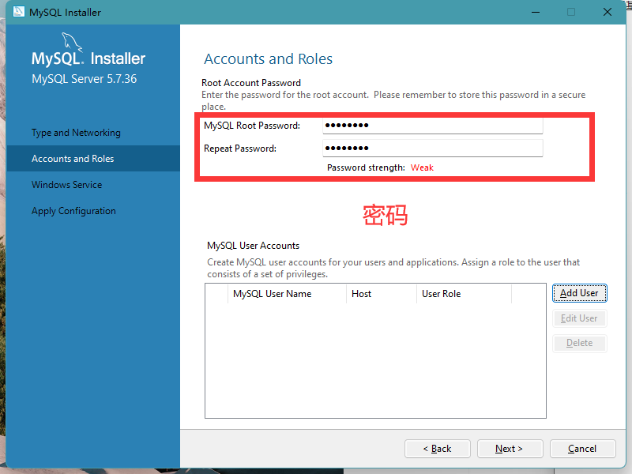


### (八)、官方文档

SpringCloud中文文档:https://www.bookstack.cn/read/spring-cloud-docs/docs-index.md

SpringCloud官方文档:https://cloud.spring.io/spring-cloud-static/Hoxton.SR1/reference/htmlsingle/

SpringBoot官方文档:https://docs.spring.io/spring-boot/docs/2.2.2.RELEASE/reference/htmlsingle/

## 二、入门小案例(支付和订单模块)

### (一)、创建父工程

#### 1、创建项目


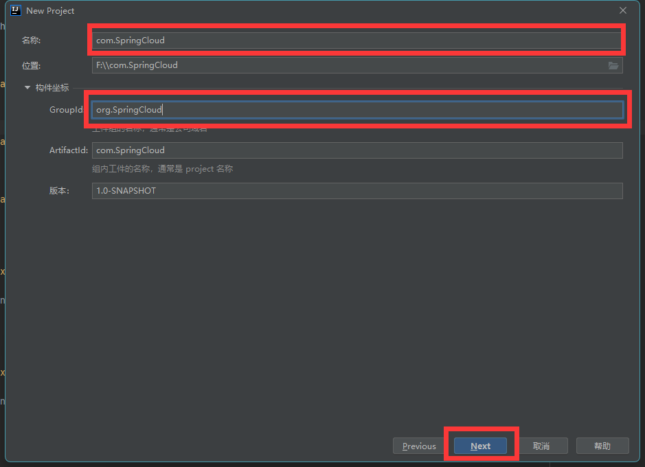


#### 2、添加依赖

```xml
<?xml version="1.0" encoding="UTF-8"?>

<project xmlns="http://maven.apache.org/POM/4.0.0" xmlns:xsi="http://www.w3.org/2001/XMLSchema-instance"
  xsi:schemaLocation="http://maven.apache.org/POM/4.0.0 http://maven.apache.org/xsd/maven-4.0.0.xsd">
  <modelVersion>4.0.0</modelVersion>

  <groupId>org.cloud</groupId>
  <artifactId>SpringCloud-01</artifactId>
  <version>1.0-SNAPSHOT</version>
  <packaging>pom</packaging>

  <name>Maven</name>
  <!-- FIXME change it to the project's website -->
  <url>http://maven.apache.org/</url>
  <inceptionYear>2001</inceptionYear>

  <!-- 统一管理jar包版本 -->
  <properties>
    <project.build.sourceEncoding>UTF-8</project.build.sourceEncoding>
    <maven.compiler.source>1.8</maven.compiler.source>
    <maven.compiler.target>1.8</maven.compiler.target>
    <junit.version>4.12</junit.version>
    <log4j.version>1.2.17</log4j.version>
    <lombok.version>1.16.18</lombok.version>
    <mysql.version>5.1.47</mysql.version>
    <druid.version>1.1.16</druid.version>
    <mybatis.spring.boot.version>1.3.0</mybatis.spring.boot.version>
  </properties>

  <!-- 子模块继承之后，提供作用：
        锁定版本+子modlue不用写groupId和version -->
  <dependencyManagement>
    <dependencies>
      <!--spring boot 2.2.2-->
      <dependency>
        <groupId>org.springframework.boot</groupId>
        <artifactId>spring-boot-dependencies</artifactId>
        <version>2.2.2.RELEASE</version>
        <type>pom</type>
        <scope>import</scope>
      </dependency>
      <!--spring cloud Hoxton.SR1-->
      <dependency>
        <groupId>org.springframework.cloud</groupId>
        <artifactId>spring-cloud-dependencies</artifactId>
        <version>Hoxton.SR1</version>
        <type>pom</type>
        <scope>import</scope>
      </dependency>
      <!--spring cloud alibaba 2.1.0.RELEASE-->
      <dependency>
        <groupId>com.alibaba.cloud</groupId>
        <artifactId>spring-cloud-alibaba-dependencies</artifactId>
        <version>2.1.0.RELEASE</version>
        <type>pom</type>
        <scope>import</scope>
      </dependency>
      <dependency>
        <groupId>mysql</groupId>
        <artifactId>mysql-connector-java</artifactId>
        <version>${mysql.version}</version>
      </dependency>
      <dependency>
        <groupId>com.alibaba</groupId>
        <artifactId>druid</artifactId>
        <version>${druid.version}</version>
      </dependency>
      <dependency>
        <groupId>org.mybatis.spring.boot</groupId>
        <artifactId>mybatis-spring-boot-starter</artifactId>
        <version>${mybatis.spring.boot.version}</version>
      </dependency>
      <dependency>
        <groupId>junit</groupId>
        <artifactId>junit</artifactId>
        <version>${junit.version}</version>
      </dependency>
      <dependency>
        <groupId>log4j</groupId>
        <artifactId>log4j</artifactId>
        <version>${log4j.version}</version>
      </dependency>
      <dependency>
        <groupId>org.projectlombok</groupId>
        <artifactId>lombok</artifactId>
        <version>${lombok.version}</version>
        <optional>true</optional>
      </dependency>
    </dependencies>
  </dependencyManagement>

  <distributionManagement>
    <site>
      <id>website</id>
      <url>scp://webhost.company.com/www/website</url>
    </site>
  </distributionManagement>


  <build>
    <pluginManagement><!-- lock down plugins versions to avoid using Maven defaults (may be moved to parent pom) -->
      <plugins>
        <plugin>
          <artifactId>maven-clean-plugin</artifactId>
          <version>3.1.0</version>
        </plugin>
        <plugin>
          <artifactId>maven-site-plugin</artifactId>
          <version>3.7.1</version>
        </plugin>
        <plugin>
          <artifactId>maven-project-info-reports-plugin</artifactId>
          <version>3.0.0</version>
        </plugin>
      </plugins>
    </pluginManagement>
    <plugins>
      <plugin>
        <groupId>org.apache.maven.plugins</groupId>
        <artifactId>maven-site-plugin</artifactId>
        <configuration>
          <locales>en,fr</locales>
        </configuration>
      </plugin>
    </plugins>
  </build>

  <reporting>
    <plugins>
      <plugin>
        <artifactId>maven-project-info-reports-plugin</artifactId>
      </plugin>
    </plugins>
  </reporting>
</project>

```

#### 3、测试


#### 4、DependencyManagement

Maven使用dependencyManagement元素来提供了一种管理依赖版本号的方式。

通常会在一个组织或者项目的最顶层的父POM中看到dependencyManagement元素。

使用pom.xml中的dependencyManagement元素能让所有在子项目中引用个依赖而不用显式的列出版本量。

Maven会沿着父子层次向上走，直到找到一个拥有dependencyManagement元素的项目，然后它就会使用这个
dependencyManagement元素中指定的版本号。

```xml
<dependencyManagement>
    <dependencies>
        <dependency>
        <groupId>mysq1</groupId>
        <artifactId>mysql-connector-java</artifactId>
        <version>5.1.2</version>
        </dependency>
    <dependencies>
</dependencyManagement>
```

然后在子项目里就可以添加`mysql-connector`时可以不指定版本号，例如：

```xml
<dependencies>
    <dependency>
    <groupId>mysq1</groupId>
    <artifactId>mysql-connector-java</artifactId>
    </dependency>
</dependencies>
```

这样做的好处就是：如果有多个子项目都引用同一样依赖，则可以避免在每个使用的子项目里都声明一个版本号，这样当想升级或切换到另一个版本时，只需要在顶层父容器里更新，而不需要一个一个子项目的修改；另外如果某个子项目需要另外的一个版本，只需要声明version就可。

dependencyManagement里只是声明依赖，并不实现引入，因此子项目需要显示的声明需要用的依赖。
如果不在子项目中声明依赖，是不会从父项目中继承下来的；只有在子项目中写了该依赖项,并且没有指定具体版本，才会从父项目中继承该项，并且version和scope都读取自父pom。
如果子项目中指定了版本号，那么会使用子项目中指定的jar版本。

### (二)、支付模块构建

#### 1、创建模块基本步骤

1. 建Module
2. 改POM
3. 写YML
4. 主启动
5. 业务类

#### 2、创建模块


#### 3、目录结构


#### 4、添加依赖

```xml
<dependencies>
    <dependency>
        <groupId>org.springframework.boot</groupId>
        <artifactId>spring-boot-starter-web</artifactId>
    </dependency>
    <dependency>
        <groupId>org.springframework.boot</groupId>
        <artifactId>spring-boot-starter-actuator</artifactId>
    </dependency>
    <dependency>
        <groupId>org.mybatis.spring.boot</groupId>
        <artifactId>mybatis-spring-boot-starter</artifactId>
    </dependency>
    <dependency>
        <groupId>com.alibaba</groupId>
        <artifactId>druid-spring-boot-starter</artifactId>
        <version>1.1.10</version>
    </dependency>
    <!--mysql-connector-java-->
    <dependency>
        <groupId>mysql</groupId>
        <artifactId>mysql-connector-java</artifactId>
    </dependency>
    <!--jdbc-->
    <dependency>
        <groupId>org.springframework.boot</groupId>
        <artifactId>spring-boot-starter-jdbc</artifactId>
    </dependency>
    <dependency>
        <groupId>org.springframework.boot</groupId>
        <artifactId>spring-boot-devtools</artifactId>
        <scope>runtime</scope>
        <optional>true</optional>
    </dependency>
    <dependency>
        <groupId>org.projectlombok</groupId>          
        <artifactId>lombok</artifactId>
        <optional>true</optional>
    </dependency>
    <dependency>
        <groupId>org.springframework.boot</groupId>
        <artifactId>spring-boot-starter-test</artifactId>
        <scope>test</scope>
    </dependency>
</dependencies>
```

#### 5、添加yaml配置

```yaml
server:
  port: 8001

spring:
  application:
    name: zhifu-service
  datasource:
    type: com.alibaba.druid.pool.DruidDataSource
    driver-class-name: com.mysql.jdbc.Driver               # mysql驱动包
    url: jdbc:mysql://localhost:3306/springcloud?useUnicode=true&characterEncoding=utf-8&useSSL=false
    username: root
    password: Qwer1234

mybatis:
  mapperLocations: classpath:mapper/*.xml
  type-aliases-package: com.lun.springcloud.pojo    # 所有Entity别名类所在包
```

#### 6、添加启动类


```java
package com.springcloud;

import org.springframework.boot.SpringApplication;
import org.springframework.boot.autoconfigure.SpringBootApplication;

@SpringBootApplication
public class RunMain {
    public static void main(String[] args) {
        SpringApplication.run(RunMain.class,args);
    }
}
```

#### 7、创建数据库添加数据

```mysql
CREATE DATABASE springcloud;
USE springcloud;
CREATE TABLE `payment`(
    `id` BIGINT(20) NOT NULL AUTO_INCREMENT COMMENT 'ID',
    `serial` VARCHAR(200) DEFAULT '',
     PRIMARY KEY (id)
)ENGINE=INNODB AUTO_INCREMENT=1 DEFAULT CHARSET=utf8mb4;
INSERT INTO payment VALUES (1,"测试数据");
```

#### 8、实体类和返回JSON类

实体类

```
package com.springcloud.pojo;

import lombok.AllArgsConstructor;
import lombok.Data;
import lombok.NoArgsConstructor;

@Data
@AllArgsConstructor
@NoArgsConstructor

public class Payment {
    private Integer id;
    private String serial;
}
```

返回JSON类

```java
package com.springcloud.utils;

import lombok.Data;
import lombok.NoArgsConstructor;

@Data
@NoArgsConstructor
public class ReturnJson<T> {

    private Integer num;
    private String  message;
    private T       data;

    public ReturnJson(Integer num, String message){
        this(num,message,null);
    }

    public ReturnJson(Integer num, String message, T t){
        this.num=num;
        this.message=message;
        this.data=t;
    }
}
```

#### 9、DAO层

PaymentDAO

```java
package com.springcloud.dao;

import com.springcloud.pojo.Payment;
import org.apache.ibatis.annotations.Mapper;

@Mapper
public interface PaymentDAO {

    int create(Payment payment);

    Payment getPaymentById(Integer id);
}
```

Payment.xml

```xml
<?xml version="1.0" encoding="UTF-8" ?>
<!DOCTYPE mapper PUBLIC "-//mybatis.org//DTD Mapper 3.0//EN" "http://mybatis.org/dtd/mybatis-3-mapper.dtd" >

<mapper namespace="com.springcloud.dao.PaymentDAO">


    <insert id="create" parameterType="com.springcloud.pojo.Payment" useGeneratedKeys="true" keyProperty="id">
        insert into parment (serial) values (#{serial});
    </insert>

    <resultMap id="selPaymentMap" type="com.springcloud.pojo.Payment">
        <id column="id" property="id" jdbcType="BIGINT"/>
        <id column="serial" property="serial" jdbcType="VARCHAR"/>
    </resultMap>
    <select id="getPaymentById" parameterType="integer" resultMap="selPaymentMap">
        select * from payment where id=#{id};
    </select>
</mapper>
```

#### 10、service层

接口

```java
package com.springcloud.service;

import com.springcloud.pojo.Payment;

public interface PaymentService {

    int create(Payment payment);

    Payment getPaymentById(Integer id);
}
```

实现类

```java
package com.springcloud.service.impl;


import com.springcloud.dao.PaymentDAO;
import com.springcloud.pojo.Payment;
import com.springcloud.service.PaymentService;
import org.springframework.stereotype.Service;

import javax.annotation.Resource;

@Service
public class PaymentServiceImpl implements PaymentService {

    @Resource
    private PaymentDAO paymentDAO;

    @Override
    public int create(Payment payment) {
        return paymentDAO.create(payment);
    }

    @Override
    public Payment getPaymentById(Integer id) {
        return paymentDAO.getPaymentById(id);
    }
}
```

#### 11、控制层

```java
package com.springcloud.controller;

import com.springcloud.pojo.Payment;
import com.springcloud.service.PaymentService;
import com.springcloud.utils.ReturnJson;
import org.springframework.beans.factory.annotation.Autowired;
import org.springframework.web.bind.annotation.*;

@RestController
public class PaymentController {

    @Autowired
    private PaymentService paymentService;

    @GetMapping("/Payment/get/{id}")
    @ResponseBody
    public ReturnJson<Payment> getPaymentById(@PathVariable("id")Integer id){
        Payment payment = paymentService.getPaymentById(id);
        if(payment != null){
            return new ReturnJson(200, "数据获取成功",payment);
        }else{
            return new ReturnJson(200, "数据获取失败");
        }
    }

    @PostMapping("/Payment/create")
    public ReturnJson createPayment(@RequestBody Payment payment){
        int i = paymentService.create(payment);
        if(i > 0){
            return new ReturnJson(200, "数据添加成功",payment);
        }else{
            return new ReturnJson(200, "数据添加失败");
        }
    }
}
```

#### 12、测试

访问:http://localhost:8001/Payment/get/1


使用apipost:http://localhost:8001/Payment/create?id=2&serial="test2"


数据库查看


### (三)、订单模块创建

#### 1、创建项目


#### 2、添加依赖

```xml
<dependencies>
    <dependency>
        <groupId>org.springframework.boot</groupId>
        <artifactId>spring-boot-starter-web</artifactId>
    </dependency>
    <dependency>
        <groupId>org.springframework.boot</groupId>
        <artifactId>spring-boot-starter-actuator</artifactId>
    </dependency>
    <dependency>
        <groupId>org.projectlombok</groupId>
        <artifactId>lombok</artifactId>
        <optional>true</optional>
    </dependency>
    <dependency>
        <groupId>org.springframework.boot</groupId>
        <artifactId>spring-boot-starter-test</artifactId>
        <scope>test</scope>
    </dependency>
</dependencies>
```

#### 3、添加配置文件

```properties
server:
  port: 80
```

#### 4、主启动类

```java
package com.springcloud;

import org.springframework.boot.SpringApplication;
import org.springframework.boot.autoconfigure.SpringBootApplication;

@SpringBootApplication
public class DingDanMain {
    public static void main(String[] args) {
        SpringApplication.run(DingDanMain.class, args);
    }
}
```

#### 5、实体类(pojo)和返回JSON类

```java
package com.springcloud.utils;

import lombok.Data;
import lombok.NoArgsConstructor;

@Data
@NoArgsConstructor
public class ReturnJson<T> {

    private Integer num;
    private String  message;
    private T       data;

    public ReturnJson(Integer num, String message){
        this(num,message,null);
    }

    public ReturnJson(Integer num, String message, T t){
        this.num=num;
        this.message=message;
        this.data=t;
    }
}
```

#### 6、RestTemplate介绍

**1、概念**

RestTemplate提供了多种便捷访问远程Http服务的方法， 

是一种简单便捷的访问restful服务模板类，是Spring提供的用于访问Rest服务的客户端模板工具集

官网地址

https://docs.spring.io/spring-framework/docs/5.2.2.RELEASE/javadoc-api/org/springframework/web/client/RestTemplate.html

**2、使用**

使用restTemplate访问restful接口非常的简单粗暴无脑。(url, requestMap, ResponseBean.class)这三个参数分别代表 REST请求地址、请求参数、HTTP响应转换被转换成的对象类型。

#### 7、配置类向容器注入RestTemplate

```java
package com.springcloud.config;

import org.springframework.context.annotation.Bean;
import org.springframework.context.annotation.Configuration;
import org.springframework.web.client.RestTemplate;

@Configuration
public class ApplicationContextConfig {

    @Bean
    public RestTemplate getRestTemplate(){
        return new RestTemplate();
    }
}
```

#### 8、控制层调用支付接口的Controller完成功能

```java
package com.springcloud.controller;

import com.springcloud.pojo.Payment;
import com.springcloud.utils.ReturnJson;
import lombok.extern.slf4j.Slf4j;
import org.springframework.beans.factory.annotation.Autowired;
import org.springframework.web.bind.annotation.GetMapping;
import org.springframework.web.bind.annotation.PathVariable;
import org.springframework.web.bind.annotation.RequestBody;
import org.springframework.web.bind.annotation.RestController;
import org.springframework.web.client.RestTemplate;

@RestController
@Slf4j
public class OderController {

    @Autowired
    private RestTemplate restTemplate;

    private final static String url = "http://localhost:8001";

    @GetMapping("/order/payment/create")
    public ReturnJson createPayment(Payment payment){

        return restTemplate.postForObject(url+"/payment/create", payment, ReturnJson.class);
    }

    @GetMapping("/order/payment/get/{id}")
    public ReturnJson getOnePayment(@PathVariable("id") Integer id){
        return restTemplate.getForObject(url+"/payment/get/"+id,ReturnJson.class);
    }
}
```

#### 9、访问测试

访问:http://localhost/order/payment/get/1


访问:http://localhost/order/payment/create?serial=123123     使用get方式测试


## 三、抽取公共类

我们发现支付模块和订单模块的pojo实体类重复了,造成了 代码的冗余,我们需要建一个工程打包让其他工程调用 ,实现高可用

### 1、创建公共项目

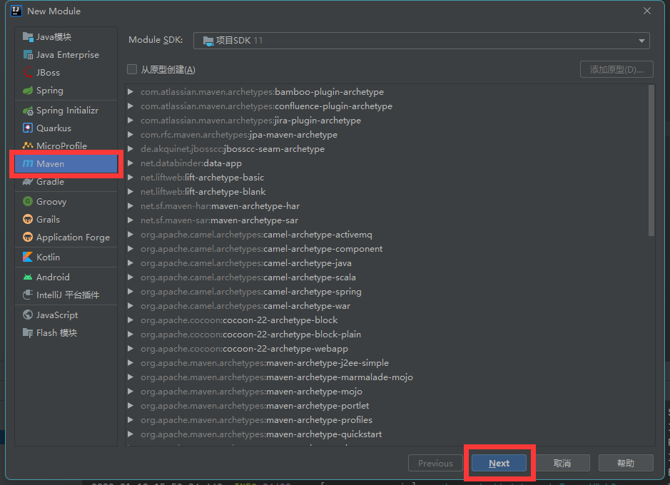


### 2、添加依赖

```xml
<dependencies>
    <dependency>
        <groupId>org.projectlombok</groupId>
        <artifactId>lombok</artifactId>
        <optional>true</optional>
    </dependency>
    <dependency>
        <groupId>cn.hutool</groupId>
        <artifactId>hutool-all</artifactId>
        <version>5.1.0</version>
    </dependency>
</dependencies>
```

### 3、粘贴pojo类和返回JSON类


### 4、删除支付和订单模块的类


### 5、清空公共模块的Maven并install


### 6、支付和订单模块引入依赖

```java
<dependency>
    <groupId>org.cloud</groupId>
    <artifactId>cloud-api-commons</artifactId>
    <version>1.0-SNAPSHOT</version>
</dependency>
```

### 7、测试

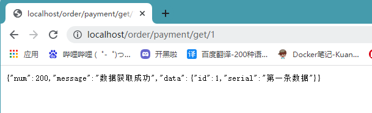

## 四、Eureka

### (一)、Eureka基础知识

####  1、什么是服务治理 

   Spring Cloud 封装了 Netflix 公司开发的 Eureka 模块来实现服务治理

   在传统的rpc远程调用框架中，管理每个服务与服务之间依赖关系比较复杂，管理比较复杂，所以需要使用服务治理，管理服务于服务之间依赖关系，可以实现服务调用、负载均衡、容错等，实现服务发现与注册。

#### 2、什么是服务注册与发现

什么是服务注册与发现

Eureka采用了CS的设计架构，Eureka Server 作为服务注册功能的服务器，它是服务注册中心。而系统中的其他微服务，使用 Eureka的客户端连接到 Eureka Server并维持心跳连接。这样系统的维护人员就可以通过 Eureka Server 来监控系统中各个微服务是否正常运行。

在服务注册与发现中，有一个注册中心。当服务器启动的时候，会把当前自己服务器的信息 比如 服务地址通讯地址等以别名方式注册到注册中心上。另一方（消费者|服务提供者），以该别名的方式去注册中心上获取到实际的服务通讯地址，然后再实现本地RPC调用RPC远程调用框架核心设计思想：在于注册中心，因为使用注册中心管理每个服务与服务之间的一个依赖关系(服务治理概念)。在任何rpc远程框架中，都会有一个注册中心(存放服务地址相关信息(接口地址))

#### 3、Eureka的两大组件

**Eureka Server提供服务注册服务**

各个微服务节点通过配置启动后，会在EurekaServer中进行注册，这样EurekaServer中的服务注册表中将会存储所有可用服务节点的信息，服务节点的信息可以在界面中直观看到。

**EurekaClient通过注册中心进行访问**

是一个Java客户端，用于简化Eureka Server的交互，客户端同时也具备一个内置的、使用轮询(round-robin)负载算法的负载均衡器。在应用启动后，将会向Eureka Server发送心跳(默认周期为30秒)。如果Eureka Server在多个心跳周期内没有接收到某个节点的心跳，EurekaServer将会从服务注册表中把这个服务节点移除（默认90秒）

### (二)、单节点Eureka

#### 1、Server服务端创建

##### 1.1、创建项目


##### 1.2、添加依赖

```xml
<dependencies>
    <!--eureka-server-->
    <dependency>
        <groupId>org.springframework.cloud</groupId>
        <artifactId>spring-cloud-starter-netflix-eureka-server</artifactId>
    </dependency>
    <!-- 引入自己定义的api通用包，可以使用Payment支付Entity -->
    <dependency>
        <groupId>org.cloud</groupId>
        <artifactId>cloud-api-commons</artifactId>
        <version>1.0-SNAPSHOT</version>
    </dependency>
    <!--boot web actuator-->
    <dependency>
        <groupId>org.springframework.boot</groupId>
        <artifactId>spring-boot-starter-web</artifactId>
    </dependency>
    <dependency>
        <groupId>org.springframework.boot</groupId>
        <artifactId>spring-boot-starter-actuator</artifactId>
    </dependency>
    <dependency>
        <groupId>org.projectlombok</groupId>
        <artifactId>lombok</artifactId>
    </dependency>
    <dependency>
        <groupId>org.springframework.boot</groupId>
        <artifactId>spring-boot-starter-test</artifactId>
        <scope>test</scope>
    </dependency>
    <dependency>
        <groupId>junit</groupId>
        <artifactId>junit</artifactId>
    </dependency>
</dependencies>
```

##### 1.3、添加配置文件

```properties
server:
  port: 7001

eureka:
  instance:
    hostname: locathost
  client:
  	# 不将自己注册进注册中心,因为自己就是
    register-with-eureka: false
    # 不扫描检测
    fetch-registry: false
    # 声明查询地址
    service-url:
      defaultZone: http://${eureka.instance.hostname}:${server.port}/eureka/
```

##### 1.4、主启动类

```java
package com.springcloud;

import org.springframework.boot.SpringApplication;
import org.springframework.boot.autoconfigure.SpringBootApplication;
import org.springframework.cloud.netflix.eureka.server.EnableEurekaServer;

@SpringBootApplication
@EnableEurekaServer
public class Eureka01RunMain {

    public static void main(String[] args) {
        SpringApplication.run(Eureka01RunMain.class, args);
    }
}
```

##### 1.5、测试

访问:http://localhost:7001/


#### 2、将支付模块添加到注册中心

##### 2.1、支付模块pom添加Eureka客户端依赖

```xml
<dependency>
    <groupId>org.springframework.cloud</groupId>
    <artifactId>spring-cloud-starter-netflix-eureka-client</artifactId>
</dependency>
```

##### 2.2、添加配置文件配置 

```yaml
eureka:
  client:
    # 是否注册:是
    register-with-eureka: true
    # 是否扫描检索:是
    fetchRegistry: true
    # 服务中心的地址
    service-url:
      defaultZone: http://localhost:7001/eureka
```

##### 2.3、主启动添加客户端注解

```java
@SpringBootApplication
@EnableEurekaClient
public class ZhiFuRunMain {
    public static void main(String[] args) {
        SpringApplication.run(ZhiFuRunMain.class,args);
    }
}
```

##### 2.4、测试

启动Eureka模块,再启动支付模块


访问:http://localhost:7001进行查看


#### 3、将订单模块添加到注册中心

##### 3.1、添加依赖

```xml
<dependency>
    <groupId>org.springframework.cloud</groupId>
    <artifactId>spring-cloud-starter-netflix-eureka-client</artifactId>
</dependency>
```

##### 3.2、配置文件添加配置

```properties
server:
  port: 80

spring:
  application:
    name: DingDan-service

eureka:
  client:
    register-with-eureka: true
    fetchRegistry: true
    service-url:
      defaultZone: http://localhost:7001/eureka
```

##### 3.3、主启动

```java
@SpringBootApplication
@EnableEurekaClient
public class DingDanMain {
    public static void main(String[] args) {
        SpringApplication.run(DingDanMain.class, args);
    }
}
```

##### 3.4、测试

启动服务中心,启动订单模块


访问:http://localhost:7001进行查看


自我保护机制

EMERGENCY! EUREKA MAY BE INCORRECTLY CLAIMING INSTANCES ARE UP WHEN THEY’RE NOT. RENEWALS ARELESSER THAN THRESHOLD AND HENCFT ARE NOT BEING EXPIRED JUST TO BE SAFE.

紧急情况！EUREKA可能错误地声称实例在没有启动的情况下启动了。续订小于阈值，因此实例不会为了安全而过期。

#### 4、注意点

application.yml配置中层次缩进和空格，两者不能少，否则，会抛出异常Failed to bind properties under 'eureka.client.service-url' to java.util.Map <java.lang.String, java.lang.String>。

### (三)、Eureka群集

#### 1、原理说明


服务注册：将服务信息注册进注册中心

服务发现：从注册中心上获取服务信息

实质：存key服务命取value闭用地址

1.先启动eureka注主册中心

2.启动服务提供者payment支付服务

3.支付服务启动后会把自身信息(比服务地址L以别名方式注朋进eureka

4.消费者order服务在需要调用接口时，使用服务别名去注册中心获取实际的RPC远程调用地址

5.消去者导调用地址后，底屋实际是利用HttpClient技术实现远程调用

6.消费者实癸导服务地址后会缓存在本地jvm内存中，默认每间隔30秒更新—次服务调用地址

问题:微服务RPC远程服务调用最核心的是什么
高可用，试想你的注册中心只有一个only one，万一它出故障了，会导致整个为服务环境不可用。

解决办法：搭建Eureka注册中心集群，实现负载均衡+故障容错。

**互相注册，相互守望**。

#### 2、新建cloud-eureka-server7002(步骤和eureka1一样)

- 创建项目

- 添加pom

- yum配置

- 主启动

#### 3、修改7001和7002的yaml

- 7001

```yaml
server:
  port: 7001

eureka:
  instance:
    hostname: eureka7001.com
  client:
    register-with-eureka: false
    fetch-registry: false
    service-url:
      defaultZone: http://eureka7002.com:7002/eureka
```

- 7002

```yaml
server:
  port: 7002

eureka:
  instance:
    hostname: eureka7002.com
  client:
    register-with-eureka: false
    fetch-registry: false
    service-url:
      defaultZone: http://eureka7001.com:7001/eureka
```

#### 4、添加host文件

```tex
127.0.0.1	eureka7001.com
127.0.0.1	eureka7002.com
```

#### 5、测试

启动7001启动7002


访问:http://eureka7001.com:7001/ 和 http://eureka7002.com:7002/


这就说明集群搭建好了

#### 6、将支付模块和订单模块添加到集群

修改支付模块和订单模块的

```
defaultZone: http://eureka7001.com:7001/eureka/
```

为

```
defaultZone: http://eureka7001.com:7001/eureka,http://eureka7002.com:7002/eureka
```

启动支付和订单模块

访问:http://eureka7001.com:7001/ 和 http://eureka7002.com:7002/


### (四)、支付模块集群环境搭建

#### 1、根据zhifu-service搭建zhifu-service8002

- 创项目

- 改pom

- 配置yaml

  ```yaml
  server:
    port: 8002
  
  spring:
    application:
      name: zhifu-service
    datasource:
      type: com.alibaba.druid.pool.DruidDataSource
      driver-class-name: com.mysql.jdbc.Driver               # mysql驱动包
      url: jdbc:mysql://localhost:3306/springcloud?useUnicode=true&characterEncoding=utf-8&useSSL=false
      username: root
      password: Qwer1234
  
  mybatis:
    mapperLocations: classpath:mapper/*.xml
    type-aliases-package: com.lun.springcloud.pojo    # 所有Entity别名类所在包
  
  eureka:
    client:
      register-with-eureka: true
      fetchRegistry: true
      service-url:
        defaultZone: http://eureka7001.com:7001/eureka,http://eureka7002.com:7002/eureka
  ```

- 主启动

- 业务类(复制粘贴)

#### 2、**修改2个支付模块的controller添加信息端口号**

```java
package com.springcloud.controller;

import com.springcloud.pojo.Payment;
import com.springcloud.service.PaymentService;
import com.springcloud.utils.ReturnJson;
import org.springframework.beans.factory.annotation.Autowired;
import org.springframework.beans.factory.annotation.Value;
import org.springframework.web.bind.annotation.*;

@RestController
public class PaymentController {

    @Autowired
    private PaymentService paymentService;

    @Value("${server.port}")
    private String serverPost;

    @GetMapping("/payment/get/{id}")
    @ResponseBody
    public ReturnJson<Payment> getPaymentById(@PathVariable("id")Integer id){
        Payment payment = paymentService.getPaymentById(id);
        if(payment != null){
            return new ReturnJson(200, "数据获取成功,端口号为:"+serverPost,payment);
        }else{
            return new ReturnJson(200, "数据获取失败");
        }
    }

    @PostMapping("/payment/create")
    public ReturnJson createPayment(@RequestBody Payment payment){
        int i = paymentService.create(payment);
        if(i > 0){
            return new ReturnJson(200, "数据添加成功,端口号为:"+serverPost,payment);
        }else{
            return new ReturnJson(200, "数据添加失败");
        }
    }
}
```

#### 3、修改订单Comtroller调用支付模块的地址

根据Eureka名字获取地址

```java
private final static String url = "http://zhifu-service";
```

使用@LoadBalanced注解赋予RestTemplate负载均衡能力

```java
@Configuration
public class ApplicationContextConfig {

    @Bean
    @LoadBalanced
    public RestTemplate getRestTemplate(){
        return new RestTemplate();
    }
}
```

#### 4、测试

启动7001,7002

启动8001,8002

启动80

访问:http://eureka7001.com:7001/


访问:http://localhost/order/payment/get/1

一开始是8001


刷新为8002(默认状态为轮训)


### (五)、网页信息完善

#### 1、为什么要这么做


可以看出信息现实不简洁,所以要修改显示信息

#### 2、修改yaml

支付模块8001

```yaml
eureka:
  client:
    register-with-eureka: true
    fetchRegistry: true
    service-url:
      defaultZone: http://eureka7001.com:7001/eureka,http://eureka7002.com:7002/eureka
  instance:
    instance-id: payment8001
    prefer-ip-address: true
```

支付模块8002

```yaml
eureka:
  client:
    register-with-eureka: true
    fetchRegistry: true
    service-url:
      defaultZone: http://eureka7001.com:7001/eureka,http://eureka7002.com:7002/eureka
  instance:
    instance-id: payment8002
    prefer-ip-address: true
```

#### 3、重新按顺序启动服务


### (六)、服务发现

#### 1、概念

对于注册进Eureka的微服务,可以通过服务发现来获取该服务的信息

#### 2、添加支付模块8001的controller

```java
@GetMapping("/payment/discovery")
public Object discovery(){
    //获取全部注册进服务中心的服务名
    List<String> services = discoveryClient.getServices();
    for (String service : services) {
        log.info("注册中心的服务都有:"+service);
    }
    //获取注册中心为zhifu-service都有哪些信息
    List<ServiceInstance> instances = discoveryClient.getInstances("zhifu-service");
    for (ServiceInstance instance : instances) {
        log.info("服务的id为{},服务的host为{},服务的端口为{}",instance.getInstanceId(),instance.getHost(),instance.getPort());
    }
    return this.discoveryClient;
}
```

#### 3、添加主启动开启服务发现注解

```java
@SpringBootApplication
@EnableEurekaClient
@EnableDiscoveryClient
public class ZhiFuRunMain {
    public static void main(String[] args) {
        SpringApplication.run(ZhiFuRunMain.class,args);
    }
}
```

#### 4、按顺序启动测试

访问:http://localhost:8001/payment/discovery


### (七)、Eureka自我保护 

#### 1、故障现象 

保护模式主要用于一组客户端和Eureka Server之间存在网络分区场景下的保护。一旦进入保护模式，

Eureka Server将会尝试保护其服务注册表中的信息，不再删除服务注册表中的数据，也就是不会注销任何微服务。

如果在Eureka Server的首页看到以下这段提示，则说明Eureka进入了保护模式：

EMERGENCY! EUREKA MAY BE INCORRECTLY CLAIMING INSTANCES ARE UP WHEN THEY'RE NOT. 

RENEWALS ARE LESSER THAN THRESHOLD AND HENCE THE INSTANCES ARE NOT BEING EXPIRED JUST TO BE SAFE 

#### 2、故障原因

- *为什么会产生Eureka自我保护机制？*

为了防止EurekaClient可以正常运行，但是 与 EurekaServer网络不通情况下，EurekaServer不会立刻将EurekaClient服务剔除

- *什么是自我保护模式？*

默认情况下，如果EurekaServer在一定时间内没有接收到某个微服务实例的心跳，EurekaServer将会注销该实例（默认90秒）。但是当网络分区故障发生(延时、卡顿、拥挤)时，微服务与EurekaServer之间无法正常通信，以上行为可能变得非常危险了——因为微服务本身其实是健康的，此时本不应该注销这个微服务。Eureka通过“自我保护模式”来解决这个问题——当EurekaServer节点在短时间内丢失过多客户端时（可能发生了网络分区故障），那么这个节点就会进入自我保护模式。在自我保护模式中，Eureka Server会保护服务注册表中的信息，不再注销任何服务实例。

它的设计哲学就是宁可保留错误的服务注册信息，也不盲目注销任何可能健康的服务实例。一句话讲解：**好死不如赖活着**

综上，自我保护模式是一种应对网络异常的安全保护措施。它的架构哲学是宁可同时保留所有微服务（健康的微服务和不健康的微服务都会保留）也不盲目注销任何健康的微服务。使用自我保护模式，可以让Eureka集群更加的健壮、稳定。

- *属于CAP里面的AP分支*

#### 3、禁止自我保护

服务端配置文件添加配置 

```yaml
eureka:
  instance:
    hostname: eureka7001.com
  client:
    register-with-eureka: false
    fetch-registry: false
    service-url:
      defaultZone: http://eureka7002.com:7002/eureka
  server:
    enable-self-preservation: false	# 关闭自我保护 
    eviction-interval-timer-in-ms: 2000	# 超时2秒删除服务
```

支付模块配置文件添加配置

```yaml
eureka:
  client:
    register-with-eureka: true
    fetchRegistry: true
    service-url:
      defaultZone: http://eureka7001.com:7001/eureka,http://eureka7002.com:7002/eureka
  instance:
    instance-id: payment8001
    prefer-ip-address: true
    lease-renewal-interval-in-seconds: 1		# 一秒发送一次心跳
    lease-expiration-duration-in-seconds: 2		# 服务端收到最后一次的等待时间上线,超时剔除服务
```

## 五、Zookeeper

### (一)、准备linux环境安装zookeeper:3.4.9

#### 1、安装JDK

```shell
yum install -y java-1.8.0-openjdk
```

#### 2、安装zookeeper

- 下载zookeeper安装包

https://archive.apache.org/dist/zookeeper/                  3.4.9

- 上传linux

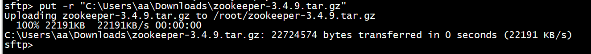

```shell
# 解压压缩包
tar -zxvf zookeeper-3.4.9.tar.gz
# 修改文件位置
mv zookeeper-3.4.9 /usr/local/zookeeper/
# 进入主配置文件
cd /usr/local/zookeeper/zookeeper-3.4.9
# 创建存放数据的地方
mkdir /usr/local/zookeeper/zookeeper-3.4.9/dataDir
# 创建存放日志的地方
mkdir /usr/local/zookeeper/zookeeper-3.4.9/dataLogDir
# 复制配置文件模板
cp conf/zoo_sample.cfg conf/zoo.cfg
# 修改配置文件
vi conf/zoo.cfg
# 设置数据和日志存放位置
dataDir=/usr/local/zookeeper/zookeeper-3.4.9/dataDir
dataLogDir=/usr/local/zookeeper/zookeeper-3.4.9/dataLogDir
# 添加环境变量
vi /etc/profile
# 环境变量
ZOOKEEPER_HOME=/usr/local/zookeeper/zookeeper-3.4.9
PATH=$PATH:$ZOOKEEPER_HOME/bin
export PATH ZOOKEEPER_HOME PATH
# 环境变量生效
source /etc/profile
# 启动zookeeper
/usr/local/zookeeper/zookeeper-3.4.9/bin/zkServer.sh start
# 关闭防火墙
systemctl stop firewalld
# 关闭selinux
setenforce 0
# 查看端口是否起来
[root@localhost ~]# netstat -nltp           
Active Internet connections (only servers)
Proto Recv-Q Send-Q Local Address           Foreign Address         State       PID/Program name    
tcp        0      0 0.0.0.0:22              0.0.0.0:*               LISTEN      983/sshd            
tcp        0      0 127.0.0.1:25            0.0.0.0:*               LISTEN      1191/master         
tcp6       0      0 :::22                   :::*                    LISTEN      983/sshd            
tcp6       0      0 ::1:25                  :::*                    LISTEN      1191/master         
tcp6       0      0 :::44286                :::*                    LISTEN      1296/java           
tcp6       0      0 :::2181                 :::*                    LISTEN      1296/java
```

### (二)、创建支付模块8004

- 创建项目:zhifu-service8004

- 改pom

  ```xml
     <dependencies>
          <!-- SpringBoot整合Web组件 -->
          <dependency>
              <groupId>org.springframework.boot</groupId>
              <artifactId>spring-boot-starter-web</artifactId>
          </dependency>
          <dependency><!-- 引入自己定义的api通用包，可以使用Payment支付Entity -->
              <groupId>com.lun.springcloud</groupId>
              <artifactId>cloud-api-commons</artifactId>
              <version>${project.version}</version>
          </dependency>
          <!-- SpringBoot整合zookeeper客户端 -->
          <dependency>
              <groupId>org.springframework.cloud</groupId>
              <artifactId>spring-cloud-starter-zookeeper-discovery</artifactId>
              <!--先排除自带的zookeeper3.5.3 防止与3.4.9起冲突-->
              <exclusions>
                  <exclusion>
                      <groupId>org.apache.zookeeper</groupId>
                      <artifactId>zookeeper</artifactId>
                  </exclusion>
              </exclusions>
          </dependency>
          <!--添加zookeeper3.4.9版本-->
          <dependency>
              <groupId>org.apache.zookeeper</groupId>
              <artifactId>zookeeper</artifactId>
              <version>3.4.9</version>
          </dependency>
          <dependency>
              <groupId>org.springframework.boot</groupId>
              <artifactId>spring-boot-devtools</artifactId>
              <scope>runtime</scope>
              <optional>true</optional>
          </dependency>
          <dependency>
              <groupId>org.projectlombok</groupId>
              <artifactId>lombok</artifactId>
              <optional>true</optional>
          </dependency>
          <dependency>
              <groupId>org.springframework.boot</groupId>
              <artifactId>spring-boot-starter-test</artifactId>
              <scope>test</scope>
          </dependency>
      </dependencies>
  ```

- 配置yaml

  ```yaml
  #8004表示注册到zookeeper服务器的支付服务提供者端口号
  server:
    port: 8004
  #服务别名----注册zookeeper到注册中心名称
  spring:
    application:
      name: cloud-provider-payment8004
    cloud:
      zookeeper:
        connect-string: 192.168.2.177:2181
  ```

- 主启动

  ```java
  package com.springcloud;
  
  import org.springframework.boot.SpringApplication;
  import org.springframework.boot.autoconfigure.SpringBootApplication;
  import org.springframework.cloud.client.discovery.EnableDiscoveryClient;
  
  @SpringBootApplication
  @EnableDiscoveryClient
  public class RunMain8004 {
  
      public static void main(String[] args) {
          SpringApplication.run(RunMain8004.class, args);
      }
  }
  ```

- controller

```java
package com.springcloud.controller;

import lombok.extern.slf4j.Slf4j;
import org.springframework.beans.factory.annotation.Autowired;
import org.springframework.beans.factory.annotation.Value;
import org.springframework.cloud.client.discovery.DiscoveryClient;
import org.springframework.web.bind.annotation.GetMapping;
import org.springframework.web.bind.annotation.RestController;

import java.util.UUID;

@RestController
@Slf4j
public class ZkPayment {

    @Value("${server.port}")
    private String serverPort;
    @GetMapping("/zkpayment/serverport")
    public String zkServiceInfo(){
        return "springcloud zookeeper payment" + serverPort + UUID.randomUUID().toString();
    }
}
```

- 测试

启动8004

访问:http://localhost:8004/zkpayment/serverport


查看注册中心服务


### (三)、创建消费模块

- 创项目:dingdanZK-service

- 改pom:

```xml
<dependencies>
    <!-- SpringBoot整合Web组件 -->
    <dependency>
        <groupId>org.springframework.boot</groupId>
        <artifactId>spring-boot-starter-web</artifactId>
    </dependency>
    <!-- SpringBoot整合zookeeper客户端 -->
    <dependency>
        <groupId>org.springframework.cloud</groupId>
        <artifactId>spring-cloud-starter-zookeeper-discovery</artifactId>
        <!--先排除自带的zookeeper-->
        <exclusions>
            <exclusion>
                <groupId>org.apache.zookeeper</groupId>
                <artifactId>zookeeper</artifactId>
            </exclusion>
        </exclusions>
    </dependency>
    <!--添加zookeeper3.4.9版本-->
    <dependency>
        <groupId>org.apache.zookeeper</groupId>
        <artifactId>zookeeper</artifactId>
        <version>3.4.9</version>
    </dependency>
    <dependency>
        <groupId>org.projectlombok</groupId>
        <artifactId>lombok</artifactId>
        <optional>true</optional>
    </dependency>
    <dependency>
        <groupId>org.springframework.boot</groupId>
        <artifactId>spring-boot-starter-test</artifactId>
        <scope>test</scope>
    </dependency>
</dependencies>
```

- 配置yaml

```yaml
server:
  port: 80
spring:
  application:
    name: dingdanZK-server80
  cloud:
    zookeeper:
      connect-string: 192.168.2.177:2181
```

- 主启动

```java
@SpringBootApplication
@EnableDiscoveryClient
public class DingDanZKRunMain {

    public static void main(String[] args) {
        SpringApplication.run(DingDanZKRunMain.class, args);
    }
}
```

- config

```java
@Configuration
public class ApplicationContextBean {

    @Bean
    @LoadBalanced
    public RestTemplate getRestTemplate(){
        return new RestTemplate();
    }
}
```

- controller

```java
@RestController
@Slf4j
public class DingDanZkController {

    private final String serviceUrl="http://cloud-provider-payment8004";

    @Autowired
    private RestTemplate restTemplate;

    @GetMapping("dingdan/payment/info")
    public String getServiceInfo(){
        return restTemplate.getForObject(serviceUrl+"/zkpayment/serverport", String.class);
    }
}
```

- 测试

访问:http://localhost/dingdan/payment/info


进注册中心查看:

```
cd /usr/local/zookeeper/zookeeper-3.4.9/bin/
./zkCli.sh 
ls /services
```


## 六、Consul

### (一)、安装启动Consul

下载地址:https://www.consul.io/downloads

解压缩后在当前文件夹下打开cmd执行

```
.\consul agent -dev
```


访问:http://localhost:8500/ui/dc1/services


安装启动成功

### (二)、创建支付模块

- 创项目:zhifu-consul-service

- 改pom

```xml
<dependencies>
    <!-- 引入自己定义的api通用包，可以使用Payment支付Entity -->
    <dependency>
        <groupId>org.cloud</groupId>
        <artifactId>cloud-api-commons</artifactId>
        <version>1.0-SNAPSHOT</version>
    </dependency>
    <!--SpringCloud consul-server -->
    <dependency>
        <groupId>org.springframework.cloud</groupId>
        <artifactId>spring-cloud-starter-consul-discovery</artifactId>
    </dependency>
    <!-- SpringBoot整合Web组件 -->
    <dependency>
        <groupId>org.springframework.boot</groupId>
        <artifactId>spring-boot-starter-web</artifactId>
    </dependency>
    <dependency>
        <groupId>org.springframework.boot</groupId>
        <artifactId>spring-boot-starter-actuator</artifactId>
    </dependency>
    <dependency>
        <groupId>org.projectlombok</groupId>
        <artifactId>lombok</artifactId>
        <optional>true</optional>
    </dependency>
    <dependency>
        <groupId>org.springframework.boot</groupId>
        <artifactId>spring-boot-starter-test</artifactId>
        <scope>test</scope>
    </dependency>
    <dependency>
        <groupId>cn.hutool</groupId>
        <artifactId>hutool-all</artifactId>
        <version>RELEASE</version>
        <scope>test</scope>
    </dependency>
    <dependency>
        <groupId>cn.hutool</groupId>
        <artifactId>hutool-all</artifactId>
        <version>RELEASE</version>
        <scope>test</scope>
    </dependency>
</dependencies>
```

- 配置yaml

```yaml
###consul服务端口号
server:
  port: 8005

spring:
  application:
    name: zhifu-consul-service8005
  cloud:
    consul:
      host: localhost
      port: 8500
      discovery:
        service-name: ${spring.application.name}
```

- 主启动

```java
@SpringBootApplication
@EnableDiscoveryClient
public class ZhifuConsulRunMain8005 {

    public static void main(String[] args) {
        SpringApplication.run(ZhifuConsulRunMain8005.class, args);
    }
}
```

- controller

```java
package com.springcloud.controller;

import org.springframework.beans.factory.annotation.Value;
import org.springframework.web.bind.annotation.GetMapping;
import org.springframework.web.bind.annotation.RestController;

@RestController
public class ZhifuConsulController {

    @Value("{server.port}")
    private String serverPort;

    @GetMapping("/consul/payment")
    public String ConsulPayment(){
        return "Spring Consul" + serverPort;
    }
}
```

- 测试
  访问:http://localhost:8005/consul/payment


​	访问:http://localhost:8500/ui/dc1/services


### (三)、创建消费模块

- 创项目:dingdan-consul-service

- 改pom

```xml
<dependencies>
    <!-- 引入自己定义的api通用包，可以使用Payment支付Entity -->
    <dependency>
        <groupId>org.cloud</groupId>
        <artifactId>cloud-api-commons</artifactId>
        <version>1.0-SNAPSHOT</version>
    </dependency>
    <!--SpringCloud consul-server -->
    <dependency>
        <groupId>org.springframework.cloud</groupId>
        <artifactId>spring-cloud-starter-consul-discovery</artifactId>
    </dependency>
    <!-- SpringBoot整合Web组件 -->
    <dependency>
        <groupId>org.springframework.boot</groupId>
        <artifactId>spring-boot-starter-web</artifactId>
    </dependency>
    <dependency>
        <groupId>org.springframework.boot</groupId>
        <artifactId>spring-boot-starter-actuator</artifactId>
    </dependency>
    <dependency>
        <groupId>org.projectlombok</groupId>
        <artifactId>lombok</artifactId>
        <optional>true</optional>
    </dependency>
    <dependency>
        <groupId>org.springframework.boot</groupId>
        <artifactId>spring-boot-starter-test</artifactId>
        <scope>test</scope>
    </dependency>
    <dependency>
        <groupId>cn.hutool</groupId>
        <artifactId>hutool-all</artifactId>
        <version>RELEASE</version>
        <scope>test</scope>
    </dependency>
    <dependency>
        <groupId>cn.hutool</groupId>
        <artifactId>hutool-all</artifactId>
        <version>RELEASE</version>
        <scope>test</scope>
    </dependency>
</dependencies>
```

- 配置yaml

```yaml
server:
  port: 80

spring:
  application:
    name: dingdan-consul-service
  cloud:
    consul:
      host: localhost
      port: 8500
      discovery:
        service-name: ${spring.application.name}
```

- 主启动

```java
@SpringBootApplication
@EnableDiscoveryClient
public class DingDanConsulRunMain {

    public static void main(String[] args) {
        SpringApplication.run(DingDanConsulRunMain.class, args);
    }
}
```

- config

```java
@Configuration
public class ApplicationContextBean {

    @Bean
    @LoadBalanced
    public RestTemplate getRestTemplate(){
        return new RestTemplate();
    }
}
```

- controlle

```java
package com.springcloud.controller;

import org.springframework.beans.factory.annotation.Autowired;
import org.springframework.web.bind.annotation.GetMapping;
import org.springframework.web.bind.annotation.RestController;
import org.springframework.web.client.RestTemplate;

@RestController
public class DingDanConsulController {

    private String serviceName = "http://zhifu-consul-service8005";

    @Autowired
    private RestTemplate restTemplate;

    @GetMapping("/dingdan/consul/payment")
    public String getServiceName(){
        return restTemplate.getForObject(serviceName+"/consul/payment", String.class);
    }
}
```

- 测试

访问:http://localhost/dingdan/consul/payment


访问:http://localhost:8500/ui/dc1/services


## 七、Ribbon

### (一)、Ribbon入门介绍

Spring Cloud Ribbon是基于Netflix Ribbon实现的一套客户端负载均衡的工具。

简单的说，Ribbon是Netflix发布的开源项目，主要功能是提供客户端的软件负载均衡算法和服务调用。Ribbon客户端组件提供一系列完善的配置项如连接超时，重试等。

简单的说，就是在配置文件中列出Load Balancer(简称LB)后面所有的机器，Ribbon会自动的帮助你基于某种规则(如简单轮询，随机连接等）去连接这些机器。我们很容易使用Ribbon实现自定义的负载均衡算法。

Ribbon目前也进入维护模式。

Ribbon未来可能被Spring Cloud LoadBalacer替代。

- **LB负载均衡(Load Balance)是什么**

简单的说就是将用户的请求平摊的分配到多个服务上，从而达到系统的HA (高可用)。

常见的负载均衡有软件Nginx，LVS，硬件F5等。

- **Ribbon本地负载均衡客户端VS Nginx服务端负载均衡区别**

Nginx是服务器负载均衡，客户端所有请求都会交给nginx，然后由nginx实现转发请求。即负载均衡是由服务端实现的。
Ribbon本地负载均衡，在调用微服务接口时候，会在注册中心上获取注册信息服务列表之后缓存到JVM本地，从而在本地实现RPC远程服务调用技术。

- **集中式LB**

即在服务的消费方和提供方之间使用独立的LB设施(可以是硬件，如F5, 也可以是软件，如nginx)，由该设施负责把访问请求通过某种策略转发至服务的提供方

- **进程内LB**

将LB逻辑集成到消费方，消费方从服务注册中心获知有哪些地址可用，然后自己再从这些地址中选择出一个合适的服务器。

**Ribbon就属于进程内LB**，它只是一个类库，集成于消费方进程，消费方通过它来获取到服务提供方的地址。

- **一句话**

Ribbon是:负载均衡 + RestTemplate调用

### (二)、Ribbon的负载均衡和Rest调用

#### 1、**架构说明**

总结：Ribbon其实就是一个软负载均衡的客户端组件，它可以和其他所需请求的客户端结合使用，和Eureka结合只是其中的一个实例。

#### 2、Ribbon在工作时分成两步

- 第一步先选择EurekaServer ,它优先选择在同一个区域内负载较少的server。
- 第二步再根据用户指定的策略，在从server取到的服务注册列表中选择一个地址。

其中Ribbon提供了多种策略：比如轮询、随机和根据响应时间加权。

### (三)、Ribbon的依赖

先前工程项目没有引入spring-cloud-starter-ribbon也可以使用ribbon。

```xml
<dependency>    
	<groupld>org.springframework.cloud</groupld>    
	<artifactld>spring-cloud-starter-netflix-ribbon</artifactid> 
</dependency>
```

这是因为spring-cloud-starter-netflix-eureka-client自带了spring-cloud-starter-ribbon引用。

### (四)、再说RestTemplate

getForObject() / getForEntity() - GET请求方法

getForObject()：返回对象为响应体中数据转化成的对象，基本上可以理解为Json。

getForEntity()：返回对象为ResponseEntity对象，包含了响应中的一些重要信息，比如响应头、响应状态码、响应体等。

```java
@GetMapping("/consumer/payment/getForEntity/{id}")
public CommonResult<Payment> getPayment2(@PathVariable("id") Integer id)
{
    ResponseEntity<CommonResult> entity = restTemplate.getForEntity(PAYMENT_URL+"/payment/get/"+id,CommonResult.class);
	if(entity.getStatusCode().is2xxSuccessful()){
    	return entity.getBody();//getForObject()
	}else{
    	return new CommonResult<>(444,"操作失败");
	}
}
```

**postForObject() / postForEntity()** - POST请求方法

### (五)、Ribbon默认自带的负载规则

lRule：根据特定算法中从服务列表中选取一个要访问的服务


- RoundRobinRule:轮询
- RandomRule:随机
- RetryRule:先按照RoundRobinRule的策略获取服务，如果获取服务失败则在指定时间内会进行重
- WeightedResponseTimeRule对RoundRobinRule的扩展，响应速度越快的实例选择权重越大，越容易被选择
- BestAvailableRule会先过滤掉由于多次访问故障而处于断路器跳闸状态的服务，然后选择一个并发量最小的服务
- AvailabilityFilteringRule先过滤掉故障实例,再选择并发较小的实例
- ZoneAvoidanceRule默认规则,复合判断server所在区域的性能和server的可用性选择服务器

### (六)、Ribbon负载规则替换

#### 1.修改dingdan-service

#### 2.注意配置细节

官方文档明确给出了警告:

这个自定义配置类不能放在@ComponentScan所扫描的当前包下以及子包下，

否则我们自定义的这个配置类就会被所有的Ribbon客户端所共享，达不到特殊化定制的目的了。

（也就是说不要将Ribbon配置类与主启动类同包）

#### 3.新建package - com.irule

#### 4.在com.irule下新建MySelfRule规则类

```java
import com.netflix.loadbalancer.IRule;
import com.netflix.loadbalancer.RandomRule;
import org.springframework.context.annotation.Bean;
import org.springframework.context.annotation.Configuration;

@Configuration
public class MySelfRule {

	@Bean
	public IRule myRule(){
    	return new RandomRule();
	}
}
```

#### 5.主启动类添加@RibbonClient

```java
import com.lun.myrule.MySelfRule;
import org.springframework.boot.SpringApplication;
import org.springframework.boot.autoconfigure.SpringBootApplication;
import org.springframework.cloud.netflix.eureka.EnableEurekaClient;
import org.springframework.cloud.netflix.ribbon.RibbonClient;

@SpringBootApplication
@EnableEurekaClient
//添加到此处
@RibbonClient(name = "CLOUD-PAYMENT-SERVICE", configuration = MySelfRule.class)
public class OrderMain80
{
    public static void main( String[] args ){
        SpringApplication.run(OrderMain80.class, args);
    }
}
```

#### 6.测试

开启cloud-eureka-server7001，dingdan-service，cloud-provider-payment8001，zhifu-service

浏览器-输入http://localhost/order/payment/get/1

返回结果中的serverPort在8001与8002两种间反复横跳。

### (七)、Ribbon默认负载轮询算法原理

**默认负载轮训算法: rest接口第几次请求数 % 服务器集群总数量 = 实际调用服务器位置下标，每次服务重启动后rest接口计数从1开始**。

```java
List<Servicelnstance> instances = discoveryClient.getInstances("CLOUD-PAYMENT-SERVICE");
```

如:

- List [0] instances = 127.0.0.1:8002
- List [1] instances = 127.0.0.1:8001

8001+ 8002组合成为集群，它们共计2台机器，集群总数为2，按照轮询算法原理：

当总请求数为1时:1%2=1对应下标位置为1，则获得服务地址为127.0.0.1:8001
当总请求数位2时:2%2=О对应下标位置为0，则获得服务地址为127.0.0.1:8002
当总请求数位3时:3%2=1对应下标位置为1，则获得服务地址为127.0.0.1:8001
当总请求数位4时:4%2=О对应下标位置为0，则获得服务地址为127.0.0.1:8002
如此类推…

## 八、OpenFeign

### (一)、什么是openfeign

官方地址:https://cloud.spring.io/spring-cloud-static/Hoxton.SR1/reference/htmlsingle/#spring-cloud-openfeign

github地址:https://github.com/spring-cloud/spring-cloud-openfeign

#### 1、openfeign能干什么

Feign旨在使编写Java Http客户端变得更容易。

前面在使用Ribbon+RestTemplate时，利用RestTemplate对http请求的封装处理，形成了一套模版化的调用方法。但是在实际开发中，由于对服务依赖的调用可能不止一处，往往一个接口会被多处调用，所以通常都会针对每个微服务自行封装一些客户端类来包装这些依赖服务的调用。所以，Feign在此基础上做了进一步封装，由他来帮助我们定义和实现依赖服务接口的定义。在Feign的实现下，我们只需创建一个接口并使用注解的方式来配置它(以前是Dao接口上面标注Mapper注解,现在是一个微服务接口上面标注一个Feign注解即可)，即可完成对服务提供方的接口绑定，简化了使用Spring cloud Ribbon时，自动封装服务调用客户端的开发量。

#### 2、**Feign集成了Ribbon**

利用Ribbon维护了Payment的服务列表信息，并且通过轮询实现了客户端的负载均衡。而与Ribbon不同的是，通过feign只需要定义服务绑定接口且以声明式的方法，优雅而简单的实现了服务调用。

#### 3、Feign和OpenFeign两者区别

Feign是Spring Cloud组件中的一个轻量级RESTful的HTTP服务客户端Feign内置了Ribbon，用来做客户端负载均衡，去调用服务注册中心的服务。Feign的使用方式是:使用Feign的注解定义接口，调用这个接口，就可以调用服务注册中心的服务。

```xml
<dependency>
    <groupId>org.springframework.cloud</groupId>
    <artifactId>spring-cloud-starter-feign</artifactId>
</dependency>
```

OpenFeign是Spring Cloud在Feign的基础上支持了SpringMVC的注解，如@RequesMapping等等。OpenFeign的@Feignclient可以解析SpringMVc的@RequestMapping注解下的接口，并通过动态代理的方式产生实现类，实现类中做负载均衡并调用其他服务。

```xml
<dependency>
    <groupId>org.springframework.cloud</groupId>
    <artifactId>spring-cloud-starter-openfeign</artifactId>
</dependency>
```

### (二)、OpenFeign服务调用

接口+注解：微服务调用接口 + @FeignClient

- 创建cloud-consumer-feign-order80

- 改pom

```xml
<dependencies>
    <!--openfeign-->
    <dependency>
        <groupId>org.springframework.cloud</groupId>
        <artifactId>spring-cloud-starter-openfeign</artifactId>
    </dependency>
    <!--eureka client-->
    <dependency>
        <groupId>org.springframework.cloud</groupId>
        <artifactId>spring-cloud-starter-netflix-eureka-client</artifactId>
    </dependency>
    <!-- 引入自己定义的api通用包，可以使用Payment支付Entity -->
    <dependency>
        <groupId>org.cloud</groupId>
        <artifactId>cloud-api-commons</artifactId>
        <version>1.0-SNAPSHOT</version>
    </dependency>
    <!--web-->
    <dependency>
        <groupId>org.springframework.boot</groupId>
        <artifactId>spring-boot-starter-web</artifactId>
    </dependency>
    <dependency>
        <groupId>org.springframework.boot</groupId>
        <artifactId>spring-boot-starter-actuator</artifactId>
    </dependency>
    <!--一般基础通用配置-->
    <dependency>
        <groupId>org.projectlombok</groupId>
        <artifactId>lombok</artifactId>
        <optional>true</optional>
    </dependency>
    <dependency>
        <groupId>org.springframework.boot</groupId>
        <artifactId>spring-boot-starter-test</artifactId>
        <scope>test</scope>
    </dependency>
</dependencies>
```

- 配置yaml

```yaml
server:
  port: 80

eureka:
  client:
    register-with-eureka: false
    service-url:
      defaultZone: http://eureka7001.com:7001/eureka/,http://eureka7002.com:7002/eureka/
```

- 主启动

```java
@SpringBootApplication
@EnableFeignClients
public class DingDanFeignRunMain {

    public static void main(String[] args) {
        SpringApplication.run(DingDanFeignRunMain.class,args);
    }
}
```

- 远程调用接口

```java
@FeignClient(value = "ZHIFU-SERVICE")
public interface MyOrderFeignService {

    @GetMapping("/payment/get/{id}")
    public ReturnJson<Payment> getPaymentById(@PathVariable("id")Integer id);
}
```

- controller

```java
package com.springcloud.controller;

import com.springcloud.pojo.Payment;
import com.springcloud.service.MyOrderFeignService;
import com.springcloud.utils.ReturnJson;
import org.springframework.beans.factory.annotation.Autowired;
import org.springframework.web.bind.annotation.GetMapping;
import org.springframework.web.bind.annotation.PathVariable;
import org.springframework.web.bind.annotation.ResponseBody;
import org.springframework.web.bind.annotation.RestController;

import javax.annotation.Resource;

@RestController
public class OrderFeignController{

    @Autowired
    private MyOrderFeignService service;

    @GetMapping("/order/payment/get/{id}")
    @ResponseBody
    public ReturnJson<Payment> getPaymentById(@PathVariable("id")Integer id){
        return service.getPaymentById(id);

    }

}
```

- 测试

启动7001,7002,8001,8002,和dingdan-feign-service

访问:http://localhost/order/payment/get/1


### (三)、OpenFeign超时控制

#### 1、8001,8002的controller估计暂停3秒

```java
@GetMapping("/payment/get/{id}")
public ReturnJson<Payment> getPaymentById(@PathVariable("id")Integer id){
    try {
        Thread.sleep(3000);
    } catch (InterruptedException e) {
        e.printStackTrace();
    }
    Payment payment = paymentService.getPaymentById(id);
    if(payment != null){
        return new ReturnJson(200, "数据获取成功,端口号为:"+serverPort,payment);
    }else{
        return new ReturnJson(200, "数据获取失败");
    }
}
```

#### 2、重新启动8001,8002,80

访问:http://localhost/order/payment/get/1


#### 3、说明

openfeign的默认超时时间为1秒,我们设置了3秒,所有超出响应时间,抛出异常

#### 4、增加响应时间

配置文件添加配置

```java
feign:
  client:
    config:
      default:
        connectTimeout: 5000
        readTimeout: 6000
```

测试

访问:http://localhost/order/payment/get/1


### (四)、日志增强

#### 1、**日志打印功能**

Feign提供了日志打印功能，我们可以通过配置来调整日恙级别，从而了解Feign 中 Http请求的细节。

说白了就是对Feign接口的调用情况进行监控和输出

#### 2、**日志级别**

- NONE：默认的，不显示任何日志;
- BASIC：仅记录请求方法、URL、响应状态码及执行时间;
- HEADERS：除了BASIC中定义的信息之外，还有请求和响应的头信息;
- FULL：除了HEADERS中定义的信息之外，还有请求和响应的正文及元数据。

#### 3、使用

配置日志Bean

```java
import feign.Logger;
import org.springframework.context.annotation.Bean;
import org.springframework.context.annotation.Configuration;

@Configuration
public class FeignLogBean {

    @Bean
    Logger.Level feignLogLevel(){
        return Logger.Level.FULL;
    }
}
```

yaml配置日志级别

```yaml
logging:
  level:
    com.springcloud.service.MyOrderFeignService: debug
```

启动运行并访问:http://localhost/order/payment/get/1


## 九、Hystrix断路器

### (一)、Hystrix是什么

#### 1、**分布式系统面临的问题**

复杂分布式体系结构中的应用程序有数十个依赖关系，每个依赖关系在某些时候将不可避免地失败。

#### 2、**服务雪崩**

多个微服务之间调用的时候，假设微服务A调用微服务B和微服务C，微服务B和微服务C又调用其它的微服务，这就是所谓的“扇出”。如果扇出的链路上某个微服务的调用响应时间过长或者不可用，对微服务A的调用就会占用越来越多的系统资源，进而引起系统崩溃，所谓的“雪崩效应”.
对于高流量的应用来说，单一的后避依赖可能会导致所有服务器上的所有资源都在几秒钟内饱和。比失败更糟糕的是，这些应用程序还可能导致服务之间的延迟增加，备份队列，线程和其他系统资源紧张，导致整个系统发生更多的级联故障。这些都表示需要对故障和延迟进行隔离和管理，以便单个依赖关系的失败，不能取消整个应用程序或系统。

所以，通常当你发现一个模块下的某个实例失败后，这时候这个模块依然还会接收流量，然后这个有问题的模块还调用了其他的模块，这样就会发生级联故障，或者叫雪崩。

#### 3、简介

Hystrix是一个用于处理分布式系统的延迟和容错的开源库，在分布式系统里，许多依赖不可避免的会调用失败，比如超时、异常等，Hystrix能够保证在一个依赖出问题的情况下，不会导致整体服务失败，避免级联故障，以提高分布式系统的弹性。

"断路器”本身是一种开关装置，当某个服务单元发生故障之后，通过断路器的故障监控（类似熔断保险丝)，向调用方返回一个符合预期的、可处理的备选响应（FallBack)，而不是长时间的等待或者抛出调用方无法处理的异常，这样就保证了服务调用方的线程不会被长时间、不必要地占用，从而避免了故障在分布式系统中的蔓延，乃至雪崩。

### (二)、Hystrix停更进维

#### 1、能干嘛

- 服务降级
- 服务熔断
- 接近实对的监控
- …

#### 2、官网资料

https://github.com/Netflix/Hystrix/wiki/How-To-Use

#### 3、官网停更说明

https://github.com/Netflix/Hystrix

- 被动修bugs
- 不再接受合并请求
- 不再发布新版本

### (三)、Hystrix服务降级熔断限流概念初讲

#### 1、服务降级

服务器忙，请稍后再试，不让客户端等待并立刻返回一个友好提示，fallback

#### 2、**哪些情况会出发降级**

- 程序运行导常
- 超时
- 服务熔断触发服务降级
- 线程池/信号量打满也会导致服务降级

#### 3、**服务熔断**

**类比保险丝**达到最大服务访问后，直接拒绝访问，拉闸限电，然后调用服务降级的方法并返回友好提示。

服务的降级 -> 进而熔断 -> 恢复调用链路

#### 4、服务限流

秒杀高并发等操作，严禁一窝蜂的过来拥挤，大家排队，一秒钟N个，有序进行。

### (四)、Hystrix支付模块构建

- 创项目:cloud-hystrix-payment8001

- 改pom

```xml
<dependencies>
    <!--hystrix-->
    <dependency>
        <groupId>org.springframework.cloud</groupId>
        <artifactId>spring-cloud-starter-netflix-hystrix</artifactId>
    </dependency>
    <!--eureka client-->
    <dependency>
        <groupId>org.springframework.cloud</groupId>
        <artifactId>spring-cloud-starter-netflix-eureka-client</artifactId>
    </dependency>
    <!--web-->
    <dependency>
        <groupId>org.springframework.boot</groupId>
        <artifactId>spring-boot-starter-web</artifactId>
    </dependency>
    <dependency>
        <groupId>org.springframework.boot</groupId>
        <artifactId>spring-boot-starter-actuator</artifactId>
    </dependency>
    <dependency><!-- 引入自己定义的api通用包，可以使用Payment支付Entity -->
        <groupId>org.cloud</groupId>
        <artifactId>cloud-api-commons</artifactId>
        <version>1.0-SNAPSHOT</version>
    </dependency>
    <dependency>
        <groupId>org.projectlombok</groupId>
        <artifactId>lombok</artifactId>
        <optional>true</optional>
    </dependency>
    <dependency>
        <groupId>org.springframework.boot</groupId>
        <artifactId>spring-boot-starter-test</artifactId>
        <scope>test</scope>
    </dependency>
</dependencies>
```

- 配置yaml

```yaml
server:
  port: 8001
spring:
  application:
    name: cloud-fystrix-paryment8001

eureka:
  client:
    register-with-eureka: true
    fetch-registry: true
    service-url:
      defaultZone: http://eureka7001.com:7001/eureka
```

- 主配置

```java
@SpringBootApplication
@EnableEurekaClient
public class PaymentHystrixRunMain {

    public static void main(String[] args) {
        SpringApplication.run(PaymentHystrixRunMain.class, args);
    }
}
```

- service

```java
@Service
public class PaymentHystrixService {

    public String printIdOk(Integer id){
        return "当前线程为"+Thread.currentThread().getName()+"访问的是:printOk"+"id为:"+id;
    }

    public String printIdTimeOut(Integer id){
        try {
            Thread.sleep(3000);
        } catch (InterruptedException e) {
            e.printStackTrace();
        }
        return "当前线程为"+Thread.currentThread().getName()+"访问的是:timeOut"+"id为:"+id;
    }
}
```

- controller

```java
@RestController
public class PaymentHystrixController {

    @Autowired
    private PaymentHystrixService paymentHystrixService;

    @GetMapping("/payment/ok/{id}")
    public String printIdOk(@PathVariable("id") Integer id){
        return paymentHystrixService.printIdOk(id);
    }

    @GetMapping("/payment/timeout/{id}")
    public String printIdTimeOut(@PathVariable("id") Integer id){
        return paymentHystrixService.printIdTimeOut(id);
    }
}
```

- 测试

访问:http://localhost:8001/payment/ok/1


访问:http://localhost:8001/payment/timeout/2


### (五)、高并发测试

#### 1、下载高并发测试软件

https://jmeter.apache.org/download_jmeter.cgi


解压后运行bin文件中的jmeter


设置中文


#### 2、创建线程组


#### 3、结果

此时发现秒回应的请求也变得卡顿了

原因：tomcat的默认的工作线程数被打满了，没有多余的线程来分解压力和处理。


#### 4、**Jmeter压测结论**

上面还是服务提供者8001自己测试，假如此时外部的消费者80也来访问，那消费者只能干等，最终导致消费端80不满意，服务端8001直接被拖慢。

### (六)、添加消费模块

- 创项目:cloud-hystrix-Order80

- 改pom

```xml
<dependencies>
    <!--openfeign-->
    <dependency>
        <groupId>org.springframework.cloud</groupId>
        <artifactId>spring-cloud-starter-openfeign</artifactId>
    </dependency>
    <!--hystrix-->
    <dependency>
        <groupId>org.springframework.cloud</groupId>
        <artifactId>spring-cloud-starter-netflix-hystrix</artifactId>
    </dependency>
    <!--eureka client-->
    <dependency>
        <groupId>org.springframework.cloud</groupId>
        <artifactId>spring-cloud-starter-netflix-eureka-client</artifactId>
    </dependency>
    <!-- 引入自己定义的api通用包，可以使用Payment支付Entity -->
    <dependency>
        <groupId>org.cloud</groupId>
        <artifactId>cloud-api-commons</artifactId>
        <version>1.0-SNAPSHOT</version>
    </dependency>
    <!--web-->
    <dependency>
        <groupId>org.springframework.boot</groupId>
        <artifactId>spring-boot-starter-web</artifactId>
    </dependency>
    <dependency>
        <groupId>org.springframework.boot</groupId>
        <artifactId>spring-boot-starter-actuator</artifactId>
    </dependency>
    <!--一般基础通用配置-->
    <dependency>
        <groupId>org.projectlombok</groupId>
        <artifactId>lombok</artifactId>
        <optional>true</optional>
    </dependency>
    <dependency>
        <groupId>org.springframework.boot</groupId>
        <artifactId>spring-boot-starter-test</artifactId>
        <scope>test</scope>
    </dependency>
</dependencies>
```

- 配置yaml

```yaml
server:
  port: 80

spring:
  application:
    name: cloud-hytrix-order80
eureka:
  client:
    register-with-eureka: false
    service-url:
      defaultZone: http://eureka7001.com:7001/eureka/

feign:
  client:
    config:
      default:
        connectTimeout: 5000
        readTimeout: 6000
```

- 主启动

```java
@SpringBootApplication
@EnableFeignClients
public class OrderHystrixRunMain {

    public static void main(String[] args) {
        SpringApplication.run(OrderHystrixRunMain.class, args);
    }
}
```

- service

```java
@Component
@FeignClient(value = "CLOUD-FYSTRIX-PARYMENT8001")
public interface OrderHystrixService {

    @GetMapping("/payment/ok/{id}")
    String printIdOk(@PathVariable("id") Integer id);

    @GetMapping("/payment/timeout/{id}")
    String printIdTimeOut(@PathVariable("id") Integer id);
}
```

- controller

```java
@RestController
public class OrderHystrixController {

    @Autowired
    private OrderHystrixService orderHystrixService;

    @GetMapping("/order/payment/ok/{id}")
    public String getPrintIdOk(@PathVariable("id")Integer id){
        return orderHystrixService.printIdOk(id);
    }

    @GetMapping("/order/payment/timeout/{id}")
    public String getPrintIdTimeOut(@PathVariable("id")Integer id){
        return orderHystrixService.printIdTimeOut(id);
    }
}
```

- 测试

访问:http://localhost/order/payment/ok/1


访问:http://localhost/order/payment/timeout/2


- 高并发测试

2W个线程压8001

消费端80微服务再去访问正常的Ok微服务8001地址

http://localhost/order/payment/hystrix/ok/32

消费者80被拖慢

原因：8001同一层次的其它接口服务被困死，因为tomcat线程池里面的工作线程已经被挤占完毕。

正因为有上述故障或不佳表现才有我们的降级/容错/限流等技术诞生。

### (七)、降级容错解决的维度要求

超时导致服务器变慢(转圈) - 超时不再等待

出错(宕机或程序运行出错) - 出错要有兜底

解决：

- 对方服务(8001)超时了，调用者(80)不能一直卡死等待，必须有服务降级。
- 对方服务(8001)down机了，调用者(80)不能一直卡死等待，必须有服务降级。
- 对方服务(8001)OK，调用者(80)自己出故障或有自我要求(自己的等待时间小于服务提供者)，自己处理降级。

### (八)、服务模块降级

#### 1、service的改动

```java
@HystrixCommand(fallbackMethod = "exceptionMethod",commandProperties = {
        @HystrixProperty(name = "execution.isolation.thread.timeoutInMilliseconds",value="2000")
})
public String printIdTimeOut(Integer id){
    try {
        Thread.sleep(3000);
    } catch (InterruptedException e) {
        e.printStackTrace();
    }
    return "当前线程为"+Thread.currentThread().getName()+",访问的是:timeOut,"+"id为:"+id;
}

public String exceptionMethod(Integer id){
    return "当前访问的服务出现了些问题,请稍后尝试.......,id:"+id;
}
```

#### 2、主启动类添加开启功能注解功能

```java
@SpringBootApplication
@EnableEurekaClient
@EnableCircuitBreaker
public class PaymentHystrixRunMain {

    public static void main(String[] args) {
        SpringApplication.run(PaymentHystrixRunMain.class, args);
    }
}
```

#### 3、测试

访问:http://localhost:8001/payment/timeout/1


### (九)、消费模块降级

#### 1、增加8001的时长为5秒

```java
@HystrixCommand(fallbackMethod = "exceptionMethod",commandProperties = {
        @HystrixProperty(name = "execution.isolation.thread.timeoutInMilliseconds",value="5000")
})
```

#### 2、消费模块的controller

```java
//如果此方法出现异常或者没有按规定时间响应就运行exceptionMethod方法
@HystrixCommand(fallbackMethod = "exceptionMethod",commandProperties = {
        @HystrixProperty(name = "execution.isolation.thread.timeoutInMilliseconds",value="1000")
})
@GetMapping("/order/payment/timeout/{id}")
public String getPrintIdTimeOut(@PathVariable("id")Integer id){
    return orderHystrixService.printIdTimeOut(id);
}

//一对一的服务降级必须要和出错降级方法的参数一致
public String exceptionMethod(Integer id){
    return "当前访问的服务出现了些问题,请稍后尝试.......,id:"+id;
}
```

#### 3、主配置类

```java
@SpringBootApplication
@EnableFeignClients
@EnableHystrix
public class OrderHystrixRunMain {

    public static void main(String[] args) {
        SpringApplication.run(OrderHystrixRunMain.class, args);
    }
}
```

#### 4、yaml文件

```yaml
feign:
  hystrix:
    enabled: true
  client:
    config:
      default:
        connectTimeout: 5000
        readTimeout: 6000
```

#### 5、测试

启动7001,8001,80

访问:http://localhost/order/payment/timeout/3

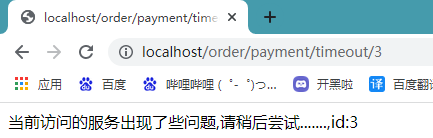

服务端一切正常,但是消费端我们设置只给服务端1秒的响应时间,如果不响应降级,因为访问的是timeout方法,方法中暂停了3秒,所以响应超时,返回降级结果

### (十)、解决兜底方法的冗余

#### 1、使用@DefaultProperties

**目前问题1** 每个业务方法对应一个兜底的方法，代码膨胀

**1:1**每个方法配置一个服务降级方法，技术上可以，但是不聪明

**1:N**除了个别重要核心业务有专属，其它普通的可以通过@DefaultProperties(defaultFallback = “”)统一跳转到统一处理结果页面

通用的和独享的各自分开，避免了代码膨胀，合理减少了代码量

```java
@RestController
// 使用这个注解当方法头上有@HystrixCommand注解时如果方法报错统一去找defaultFallback方法
@DefaultProperties(defaultFallback = "exceptionMethod")
public class OrderHystrixController {

    @Autowired
    private OrderHystrixService orderHystrixService;

    // 使用统一的兜底方法
    @HystrixCommand
    @GetMapping("/order/payment/ok/{id}")
    public String getPrintIdOk(@PathVariable("id")Integer id){
        return orderHystrixService.printIdOk(id);
    }

    // 使用自己特定的兜底方法
    @HystrixCommand(fallbackMethod = "exceptionMethod",commandProperties = {
            @HystrixProperty(name = "execution.isolation.thread.timeoutInMilliseconds",value="1000")
    })
    @GetMapping("/order/payment/timeout/{id}")
    public String getPrintIdTimeOut(@PathVariable("id")Integer id){
        return orderHystrixService.printIdTimeOut(id);
    }

    public String exceptionMethod(Integer id){
        return "当前访问的服务出现了些问题,请稍后尝试.......,id:"+id;
    }
}
```

#### 2、兜底方法和业务类在同一类中,代码混乱

**服务降级，客户端去调用服务端，碰上服务端宕机或关闭**

本次案例服务降级处理是在客户端80实现完成的，与服务端8001没有关系，只需要为[Feign](https://so.csdn.net/so/search?q=Feign&spm=1001.2101.3001.7020)客户端定义的接口添加一个服务降级处理的实现类即可实现解耦

- 首先创建一个service的实体类,实现service

```java
@Component
public class OrderHystrixServiceImpl implements OrderHystrixService{
    @Override
    public String printIdOk(Integer id) {
        return "数据访问失败,请稍后重试............";
    }

    @Override
    public String printIdTimeOut(Integer id) {
        return "数据访问失败,请稍后重试............";
    }
}
```

- yaml文件功能开启

```yaml
feign:
  hystrix:
    enabled: true
```

- service添加属性

```java
@Component
@FeignClient(value = "CLOUD-FYSTRIX-PARYMENT8001",fallback = OrderHystrixServiceImpl.class)
public interface OrderHystrixService {

    @GetMapping("/payment/ok/{id}")
    String printIdOk(@PathVariable("id") Integer id);

    @GetMapping("/payment/timeout/{id}")
    String printIdTimeOut(@PathVariable("id") Integer id);
}
```

- 测试

启动7001,8001,80

首先正常访问:http://localhost/order/payment/timeout/1


- controller增加时长

```java
@HystrixCommand(fallbackMethod = "exceptionMethod",commandProperties = {
        @HystrixProperty(name = "execution.isolation.thread.timeoutInMilliseconds",value="80000")
})
```


- 总结

可以看出如果满足@HystrixCommand的注解的时候优先@HystrixCommand注解,然后再是service fullback实现类

### (十一)、服务熔断

#### 1、理论


当访问服务器,如果访问次数在一定时间内都是失败的话服务器会关闭并降级,阻止消费端的访问,当过了规定时间会对新的请求尝试访问服务,此时服务处于半闭合状态,如果尝试的请求成功,则重新恢复,如果失败继续停止访问

#### 2、**熔断类型**

- 熔断打开：请求不再进行调用当前服务，内部设置时钟一般为MTTR(平均故障处理时间)，当打开时长达到所设时钟则进入半熔断状态。
- 熔断关闭：熔断关闭不会对服务进行熔断。
- 熔断半开：部分请求根据规则调用当前服务，如果请求成功且符合规则则认为当前服务恢复正常，关闭熔断。

#### 3、支付端添加熔断方法

- 服务端service添加熔断方法

```java
//=========服务熔断
@HystrixCommand(fallbackMethod = "paymentCircuitBreaker_fallback",commandProperties = {
        @HystrixProperty(name = "circuitBreaker.enabled",value = "true"),    // 开启断路器
        @HystrixProperty(name = "circuitBreaker.requestVolumeThreshold",value = "10"),	// 访问十次
        @HystrixProperty(name = "circuitBreaker.sleepWindowInMilliseconds",value = "10000"), // 10秒之内
        @HystrixProperty(name = "circuitBreaker.errorThresholdPercentage",value = "60"),  // 失败率为百分之60
    	// 总结,在10秒内访问10次中如果有6次的话开启断路器,停止服务
})
public String paymentCircuitBreaker(@PathVariable("id") Integer id)
{
    if(id < 0)
    {
        throw new RuntimeException("******id 不能负数");
    }
    String serialNumber = IdUtil.simpleUUID();

    return Thread.currentThread().getName()+"\t"+"调用成功，流水号: " + serialNumber;
}
public String paymentCircuitBreaker_fallback(@PathVariable("id") Integer id)
{
    return "id 不能负数，请稍后再试，/(ㄒoㄒ)/~~   id: " +id;
}
```

**涉及到断路器的三个重要参数：**

快照时间窗：断路器确定是否打开需要统计一些请求和错误数据，而统计的时间范围就是快照时间窗，默认为最近的10秒。
请求总数阀值：在快照时间窗内，必须满足请求总数阀值才有资格熔断。默认为20，意味着在10秒内，如果该hystrix命令的调用次数不足20次7,即使所有的请求都超时或其他原因失败，断路器都不会打开。
错误百分比阀值：当请求总数在快照时间窗内超过了阀值，比如发生了30次调用，如果在这30次调用中，有15次发生了超时异常，也就是超过50%的错误百分比，在默认设定50%阀值情况下，这时候就会将断路器打开。

**断路器开启或者关闭的条件**

到达以下阀值，断路器将会开启：

当满足一定的阀值的时候（默认10秒内超过20个请求次数)
当失败率达到一定的时候（默认10秒内超过50%的请求失败)
当开启的时候，所有请求都不会进行转发

一段时间之后（默认是5秒)，这个时候断路器是半开状态，会让其中一个请求进行转发。如果成功，断路器会关闭，若失败，继续开启。

**断路器打开之后**

1：再有请求调用的时候，将不会调用主逻辑，而是直接调用降级fallback。通过断路器，实现了自动地发现错误并将降级逻辑切换为主逻辑，减少响应延迟的效果。

2：原来的主逻辑要如何恢复呢？

对于这一问题，hystrix也为我们实现了自动恢复功能。

当断路器打开，对主逻辑进行熔断之后，hystrix会启动一个休眠时间窗，在这个时间窗内，降级逻辑是临时的成为主逻辑，当休眠时间窗到期，断路器将进入半开状态，释放一次请求到原来的主逻辑上，如果此次请求正常返回，那么断路器将继续闭合，主逻辑恢复，如果这次请求依然有问题，断路器继续进入打开状态，休眠时间窗重新计时。
- controller

```java
/************************************/
@GetMapping("/payment/circuit/{id}")
public String paymentCircuitBreaker(@PathVariable("id") Integer id)
{
    String result = paymentHystrixService.paymentCircuitBreaker(id);
    return result;
}
```

#### 4、测试

启动7001,8001

访问:http://localhost:8001/payment/circuit/31


访问:http://localhost:8001/payment/circuit/-31


然后一直刷新错误的页面,刷新多次后再次访问正确的页面


然后停几秒访问再刷新


这样就自动恢复了

#### 5、所有配置选项

```java
@HystrixCommand(fallbackMethod = "fallbackMethod", 
                groupKey = "strGroupCommand", 
                commandKey = "strCommand", 
                threadPoolKey = "strThreadPool",            
				commandProperties = {
                	// 设置隔离策略，THREAD 表示线程池 SEMAPHORE：信号池隔离
                	@HystrixProperty(name = "execution.isolation.strategy", value = "THREAD"),
                	// 当隔离策略选择信号池隔离的时候，用来设置信号池的大小（最大并发数）
                	@HystrixProperty(name = "execution.isolation.semaphore.maxConcurrentRequests", value = "10"),
                	// 配置命令执行的超时时间
                	@HystrixProperty(name = "execution.isolation.thread.timeoutinMilliseconds", value = "10"),
                	// 是否启用超时时间
                	@HystrixProperty(name = "execution.timeout.enabled", value = "true"),
                	// 执行超时的时候是否中断
                	@HystrixProperty(name = "execution.isolation.thread.interruptOnTimeout", value = "true"),
                	// 执行被取消的时候是否中断
                	@HystrixProperty(name = "execution.isolation.thread.interruptOnCancel", value = "true"),
                	// 允许回调方法执行的最大并发数
                	@HystrixProperty(name = "fallback.isolation.semaphore.maxConcurrentRequests", value = "10"),
                	// 服务降级是否启用，是否执行回调函数
                	@HystrixProperty(name = "fallback.enabled", value = "true"),
                	// 是否启用断路器
                	@HystrixProperty(name = "circuitBreaker.enabled", value = "true"),
                	// 该属性用来设置在滚动时间窗中，断路器熔断的最小请求数。例如，默认该值为 20 的时候，如果滚动时间窗（默认10秒）内仅收到了19个请求， 即使这19个请求都失败了，断路器也不会打开。
                	@HystrixProperty(name = "circuitBreaker.requestVolumeThreshold", value = "20"),
                	// 该属性用来设置在滚动时间窗中，表示在滚动时间窗中，在请求数量超过 circuitBreaker.requestVolumeThreshold 的情况下，如果错误请求数的百分比超过50, 就把断路器设置为 "打开" 状态，否则就设置为 "关闭" 状态。
                	@HystrixProperty(name = "circuitBreaker.errorThresholdPercentage", value = "50"),
                	// 该属性用来设置当断路器打开之后的休眠时间窗。 休眠时间窗结束之后，会将断路器置为 "半开" 状态，尝试熔断的请求命令，如果依然失败就将断路器继续设置为 "打开" 状态，如果成功就设置为 "关闭" 状态。
                	@HystrixProperty(name = "circuitBreaker.sleepWindowinMilliseconds", value = "5000"),
                	// 断路器强制打开
                	@HystrixProperty(name = "circuitBreaker.forceOpen", value = "false"),
                	// 断路器强制关闭
                	@HystrixProperty(name = "circuitBreaker.forceClosed", value = "false"),
                	// 滚动时间窗设置，该时间用于断路器判断健康度时需要收集信息的持续时间
                	@HystrixProperty(name = "metrics.rollingStats.timeinMilliseconds", value = "10000"),
                	// 该属性用来设置滚动时间窗统计指标信息时划分"桶"的数量，断路器在收集指标信息的时候会根据设置的时间窗长度拆分成多个 "桶" 来累计各度量值，每个"桶"记录了一段时间内的采集指标。
                	// 比如 10 秒内拆分成 10 个"桶"收集这样，所以 timeinMilliseconds 必须能被 numBuckets 整除。否则会抛异常
                	@HystrixProperty(name = "metrics.rollingStats.numBuckets", value = "10"),
                	// 该属性用来设置对命令执行的延迟是否使用百分位数来跟踪和计算。如果设置为 false, 那么所有的概要统计都将返回 -1。
                	@HystrixProperty(name = "metrics.rollingPercentile.enabled", value = "false"),
               	 	// 该属性用来设置百分位统计的滚动窗口的持续时间，单位为毫秒。
               	 	@HystrixProperty(name = "metrics.rollingPercentile.timeInMilliseconds", value = "60000"),
                	// 该属性用来设置百分位统计滚动窗口中使用 “ 桶 ”的数量。
                	@HystrixProperty(name = "metrics.rollingPercentile.numBuckets", value = "60000"),
                	// 该属性用来设置在执行过程中每个 “桶” 中保留的最大执行次数。如果在滚动时间窗内发生超过该设定值的执行次数，
                	// 就从最初的位置开始重写。例如，将该值设置为100, 滚动窗口为10秒，若在10秒内一个 “桶 ”中发生了500次执行，
                	// 那么该 “桶” 中只保留 最后的100次执行的统计。另外，增加该值的大小将会增加内存量的消耗，并增加排序百分位数所需的计算时间。
                	@HystrixProperty(name = "metrics.rollingPercentile.bucketSize", value = "100"),
                	// 该属性用来设置采集影响断路器状态的健康快照（请求的成功、 错误百分比）的间隔等待时间。
                	@HystrixProperty(name = "metrics.healthSnapshot.intervalinMilliseconds", value = "500"),
                	// 是否开启请求缓存
                	@HystrixProperty(name = "requestCache.enabled", value = "true"),
                	// HystrixCommand的执行和事件是否打印日志到 HystrixRequestLog 中
                	@HystrixProperty(name = "requestLog.enabled", value = "true"),
            },
            threadPoolProperties = {
                // 该参数用来设置执行命令线程池的核心线程数，该值也就是命令执行的最大并发量
                @HystrixProperty(name = "coreSize", value = "10"),
                // 该参数用来设置线程池的最大队列大小。当设置为 -1 时，线程池将使用 SynchronousQueue 实现的队列，否则将使用 LinkedBlockingQueue 实现的队列。
                @HystrixProperty(name = "maxQueueSize", value = "-1"),
                // 该参数用来为队列设置拒绝阈值。 通过该参数， 即使队列没有达到最大值也能拒绝请求。
                // 该参数主要是对 LinkedBlockingQueue 队列的补充,因为 LinkedBlockingQueue 队列不能动态修改它的对象大小，而通过该属性就可以调整拒绝请求的队列大小了。
                @HystrixProperty(name = "queueSizeRejectionThreshold", value = "5"),
            }
           )
public String doSomething() {
	...
}
```

### (十二)、Hystrix执行流程总结

**步骤说明**

1. 创建HystrixCommand （用在依赖的服务返回单个操作结果的时候）或HystrixObserableCommand（用在依赖的服务返回多个操作结果的时候）对象。
   命令执行。
   其中 HystrixCommand实现了下面前两种执行方式
   execute()：同步执行，从依赖的服务返回一个单一的结果对象或是在发生错误的时候抛出异常。

2. queue()：异步执行，直接返回一个Future对象，其中包含了服务执行结束时要返回的单一结果对象。
3. 而 HystrixObservableCommand实现了后两种执行方式：
    obseve()：返回Observable对象，它代表了操作的多个统
    果，它是一个Hot Observable （不论“事件源”是否有“订阅者”，都会在创建后对事件进行发布，所以对于Hot Observable的每一个“订阅者”都有可能是从“事件源”的中途开始的，并可能只是看到了整个操作的局部过程）。
4. toObservable()：同样会返回Observable对象，也代表了操作的多个结果，但它返回的是一个Cold Observable（没有“订间者”的时候并不会发布事件，而是进行等待，直到有“订阅者"之后才发布事件，所以对于Cold Observable 的订阅者，它可以保证从一开始看到整个操作的全部过程）。
5. 若当前命令的请求缓存功能是被启用的，并且该命令缓存命中，那么缓存的结果会立即以Observable对象的形式返回。
6. 检查断路器是否为打开状态。如果断路器是打开的，那么Hystrix不会执行命令，而是转接到fallback处理逻辑(第8步)；如果断路器是关闭的，检查是否有可用资源来执行命令(第5步)。
7. 线程池/请求队列信号量是否占满。如果命令依赖服务的专有线程地和请求队列，或者信号量（不使用线程的时候）已经被占满，那么Hystrix也不会执行命令，而是转接到fallback处理理辑(第8步) 。
8. Hystrix会根据我们编写的方法来决定采取什么样的方式去请求依赖服务。
    HystrixCommand.run()：返回一个单一的结果，或者抛出异常。
    HystrixObservableCommand.construct()：返回一个Observable对象来发射多个结果，或通过onError发送错误通知。
9. Hystix会将“成功”、“失败”、“拒绝”、“超时” 等信息报告给断路器，而断路器会维护一组计数器来统计这些数据。断路器会使用这些统计数据来决定是否要将断路器打开，来对某个依赖服务的请求进行"熔断/短路"。
10. 当命令执行失败的时候，Hystix会进入fallback尝试回退处理，我们通常也称波操作为“服务降级”。而能够引起服务降级处理的情况有下面几种：
  1. 第4步∶当前命令处于“熔断/短路”状态，断洛器是打开的时候。
  2. 第5步∶当前命令的钱程池、请求队列或者信号量被占满的时候。
  3. 第6步∶HystrixObsevableCommand.construct()或HytrixCommand.run()抛出异常的时候。

  11.当Hystrix命令执行成功之后，它会将处理结果直接返回或是以Observable的形式返回。

tips：如果我们没有为命令实现降级逻辑或者在降级处理逻辑中抛出了异常，Hystrix依然会运回一个Obsevable对象，但是它不会发射任结果数惯，而是通过onError方法通知命令立即中断请求，并通过onError方法将引起命令失败的异常发送给调用者。

### (十三)、hystrix图形化Dashboard搭建与实战

#### 1、创项目:cloud-hystrix-dashboard9001

#### 2、改pom

```xml
<dependencies>
    <dependency>
        <groupId>org.springframework.cloud</groupId>
        <artifactId>spring-cloud-starter-netflix-hystrix-dashboard</artifactId>
    </dependency>
    <dependency>
        <groupId>org.springframework.boot</groupId>
        <artifactId>spring-boot-starter-actuator</artifactId>
    </dependency>
    <dependency>
        <groupId>org.projectlombok</groupId>
        <artifactId>lombok</artifactId>
        <optional>true</optional>
    </dependency>
    <dependency>
        <groupId>org.springframework.boot</groupId>
        <artifactId>spring-boot-starter-test</artifactId>
        <scope>test</scope>
    </dependency>
</dependencies>
```

#### 3、配置yaml

```yaml
server:
  port: 9001
```

#### 4、主启动

```java
@SpringBootApplication
@EnableHystrixDashboard
public class HystrixDashboard9001 {

    public static void main(String[] args) {
        SpringApplication.run(HystrixDashboard9001.class, args);
    }
}
```

#### 5、检查客户端是否引入依赖

```xml
<dependency>    
	<groupId>org.springframework.boot</groupId>    
	<artifactId>spring-boot-starter-actuator</artifactId> 
</dependency>
```

#### 6、客户端主启动添加(以hystix8001为例)

```java
/**
	*此配置是为了服务监控而配置，与服务容错本身无关，springcloud升级后的坑
	*ServletRegistrationBean因为springboot的默认路径不是"/hystrix.stream"，
	*只要在自己的项目里配置上下面的servlet就可以了
  	*否则，Unable to connect to Command Metric Stream 404
*/
@Bean
public ServletRegistrationBean getServlet() {
    HystrixMetricsStreamServlet streamServlet = new HystrixMetricsStreamServlet();
    ServletRegistrationBean registrationBean = new ServletRegistrationBean(streamServlet);
    registrationBean.setLoadOnStartup(1);
    registrationBean.addUrlMappings("/hystrix.stream");
    registrationBean.setName("HystrixMetricsStreamServlet");
    return registrationBean;
}
```
#### 7、测试

启动7001,9001,8001

访问:http://localhost:9001/hystrix


地址栏填写8001的监控地址,http://localhost:8001/hystrix.stream


然后访问:http://localhost:8001/payment/circuit/1   一直刷新,然后到监控页面就能看到访问量


访问:http://localhost:8001/payment/circuit/-1   就可以看到失败的信息


#### 8、信息查看说明

- 7色


- 1圈

实心圆：共有两种含义。它通过颜色的变化代表了实例的健康程度，它的健康度从绿色<黄色<橙色<红色递减。

该实心圆除了颜色的变化之外，它的大小也会根据实例的请求流量发生变化，**流量越大该实心圆就越大**。所以通过该实心圆的展示，就可以在大量的实例中快速的发现故障实例和高压力实例。

- 1线

曲线：用来记录2分钟内流量的相对变化，可以通过它来观察到流量的上升和下降趋势。

## 十、GateWay

### (一)、GateWay和Zuul课程说明

Zuul开发人员窝里斗，实属明日黄花

重点关注Gate Way

### (二)、GateWay是什么

zuul 1.x官网:https://github.com/Netflix/zuul/wiki

Gateway官网:https://cloud.spring.io/spring-cloud-static/spring-cloud-gateway/2.2.1.RELEASE/reference/html/

Cloud全家桶中有个很重要的组件就是网关，在1.x版本中都是采用的Zuul网关;

但在2.x版本中，zuul的升级一直跳票，SpringCloud最后自己研发了一个网关替代Zuul，那就是SpringCloud Gateway—句话：gateway是原zuul1.x版的替代


Gateway是在Spring生态系统之上构建的API网关服务，基于Spring 5，Spring Boot 2和Project Reactor等技术。

Gateway旨在提供一种简单而有效的方式来对API进行路由，以及提供一些强大的过滤器功能，例如:熔断、限流、重试等。

SpringCloud Gateway是Spring Cloud的一个全新项目，基于Spring 5.0+Spring Boot 2.0和Project Reactor等技术开发的网关，它旨在为微服务架构提供—种简单有效的统一的API路由管理方式。

SpringCloud Gateway作为Spring Cloud 生态系统中的网关，目标是替代Zuul，在Spring Cloud 2.0以上版本中，没有对新版本的Zul 2.0以上最新高性能版本进行集成，仍然还是使用的Zuul 1.x非Reactor模式的老版本。而为了提升网关的性能，SpringCloud Gateway是基于WebFlux框架实现的，而WebFlux框架底层则使用了高性能的Reactor模式通信框架Netty。

Spring Cloud Gateway的目标提供统一的路由方式且基于 Filter链的方式提供了网关基本的功能，例如:安全，监控/指标，和限流。

**作用**

- 方向代理
- 鉴权
- 流量控制
- 熔断
- 日志监控
- …

**微服务架构中网关的位置**


### (三)、GateWay非阻塞异步模型

有Zuull了怎么又出来Gateway？**我们为什么选择Gateway?**

1. netflix不太靠谱，zuul2.0一直跳票，迟迟不发布。
   1. 一方面因为Zuul1.0已经进入了维护阶段，而且Gateway是SpringCloud团队研发的，是亲儿子产品，值得信赖。而且很多功能Zuul都没有用起来也非常的简单便捷。
   2. Gateway是基于异步非阻塞模型上进行开发的，性能方面不需要担心。虽然Netflix早就发布了最新的Zuul 2.x，但Spring Cloud貌似没有整合计划。而且Netflix相关组件都宣布进入维护期；不知前景如何?
   3. 多方面综合考虑Gateway是很理想的网关选择。

2. SpringCloud Gateway具有如下特性
   1. 基于Spring Framework 5，Project Reactor和Spring Boot 2.0进行构建；
   2. 动态路由：能够匹配任何请求属性；
   3. 可以对路由指定Predicate (断言)和Filter(过滤器)；
   4. 集成Hystrix的断路器功能；
   5. 集成Spring Cloud 服务发现功能；
   6. 易于编写的Predicate (断言)和Filter (过滤器)；
   7. 请求限流功能；
   8. 支持路径重写。

3. SpringCloud Gateway与Zuul的区别
   1. 在SpringCloud Finchley正式版之前，Spring Cloud推荐的网关是Netflix提供的Zuul。
   2. Zuul 1.x，是一个基于阻塞I/O的API Gateway。
   3. Zuul 1.x基于Servlet 2.5使用阻塞架构它不支持任何长连接(如WebSocket)Zuul的设计模式和Nginx较像，每次I/О操作都是从工作线程中选择一个执行，请求线程被阻塞到工作线程完成，但是差别是Nginx用C++实现，Zuul用Java实现，而JVM本身会有第-次加载较慢的情况，使得Zuul的性能相对较差。
   4. Zuul 2.x理念更先进，想基于Netty非阻塞和支持长连接，但SpringCloud目前还没有整合。Zuul .x的性能较Zuul 1.x有较大提升。在性能方面，根据官方提供的基准测试,Spring Cloud Gateway的RPS(每秒请求数)是Zuul的1.6倍。
   5. Spring Cloud Gateway建立在Spring Framework 5、Project Reactor和Spring Boot2之上，使用非阻塞API。
   6. Spring Cloud Gateway还支持WebSocket，并且与Spring紧密集成拥有更好的开发体验

**Zuul1.x模型**

Springcloud中所集成的Zuul版本，采用的是Tomcat容器，使用的是传统的Serviet IO处理模型。

Servlet的生命周期？servlet由servlet container进行生命周期管理。

- container启动时构造servlet对象并调用servlet init()进行初始化；
- container运行时接受请求，并为每个请求分配一个线程（一般从线程池中获取空闲线程）然后调用service)；
- container关闭时调用servlet destory()销毁servlet。


**上述模式的缺点：**

Servlet是一个简单的网络IO模型，当请求进入Servlet container时，Servlet container就会为其绑定一个线程，在并发不高的场景下这种模型是适用的。但是一旦高并发(如抽风用Jmeter压)，线程数量就会上涨，而线程资源代价是昂贵的（上线文切换，内存消耗大）严重影响请求的处理时间。在一些简单业务场景下，不希望为每个request分配一个线程，只需要1个或几个线程就能应对极大并发的请求，这种业务场景下servlet模型没有优势。

所以Zuul 1.X是基于servlet之上的一个阻塞式处理模型，即Spring实现了处理所有request请求的一个servlet (DispatcherServlet)并由该servlet阻塞式处理处理。所以SpringCloud Zuul无法摆脱servlet模型的弊端。

**Gateway模型**

WebFlux是什么？官方文档:https://docs.spring.io/spring/docs/current/spring-framework-reference/web-reactive.html#spring-webflux

传统的Web框架，比如说: Struts2，SpringMVC等都是基于Servlet APl与Servlet容器基础之上运行的。

但是在Servlet3.1之后有了异步非阻塞的支持。而WebFlux是一个典型非阻塞异步的框架，它的核心是基于Reactor的相关API实现的。相对于传统的web框架来说，它可以运行在诸如Netty，Undertow及支持Servlet3.1的容器上。非阻塞式+函数式编程(Spring 5必须让你使用Java 8)。

Spring WebFlux是Spring 5.0 引入的新的响应式框架，区别于Spring MVC，它不需要依赖Servlet APl，它是完全异步非阻塞的，并且基于Reactor来实现响应式流规范。

### (四)、Gateway工作流程

#### 1、**三大核心概念**

1. Route(路由) - 路由是构建网关的基本模块,它由ID,目标URI,一系列的断言和过滤器组成,如断言为true则匹配该路由；
2. Predicate(断言) - 参考的是Java8的java.util.function.Predicate，开发人员可以匹配HTTP请求中的所有内容(例如请求头或请求参数),如果请求与断言相匹配则进行路由；
3. Filter(过滤) - 指的是Spring框架中GatewayFilter的实例,使用过滤器,可以在请求被路由前或者之后对请求进行修改。


web请求，通过一些匹配条件，定位到真正的服务节点。并在这个转发过程的前后，进行一些精细化控制。

predicate就是我们的匹配条件；而fliter，就可以理解为一个无所不能的拦截器。有了这两个元素，再加上目标uri，就可以实现一个具体的路由了

#### 2、**Gateway工作流程**


客户端向Spring Cloud Gateway发出请求。然后在Gateway Handler Mapping 中找到与请求相匹配的路由，将其发送到GatewayWeb Handler。

Handler再通过指定的过滤器链来将请求发送到我们实际的服务执行业务逻辑，然后返回。

过滤器之间用虚线分开是因为过滤器可能会在发送代理请求之前(“pre”)或之后(“post"）执行业务逻辑。

Filter在“pre”类型的过滤器可以做参数校验、权限校验、流量监控、日志输出、协议转换等，在“post”类型的过滤器中可以做响应内容、响应头的修改，日志的输出，流量监控等有着非常重要的作用。

**核心逻辑**：路由转发 + 执行过滤器链。

### (五)、Gateway9527搭建

#### 1、创项目

cloud-gateway-gateway9527

#### 2、改pom

```xml
<dependencies>
    <!--gateway-->
    <dependency>
        <groupId>org.springframework.cloud</groupId>
        <artifactId>spring-cloud-starter-gateway</artifactId>
    </dependency>
    <!--eureka-client-->
    <dependency>
        <groupId>org.springframework.cloud</groupId>
        <artifactId>spring-cloud-starter-netflix-eureka-client</artifactId>
    </dependency>
    <!-- 引入自己定义的api通用包，可以使用Payment支付Entity -->
    <dependency>
        <groupId>org.cloud</groupId>
        <artifactId>cloud-api-commons</artifactId>
        <version>1.0-SNAPSHOT</version>
    </dependency>
    <!--一般基础配置类-->
    <dependency>
        <groupId>org.projectlombok</groupId>
        <artifactId>lombok</artifactId>
        <optional>true</optional>
    </dependency>
    <dependency>
        <groupId>org.springframework.boot</groupId>
        <artifactId>spring-boot-starter-test</artifactId>
        <scope>test</scope>
    </dependency>
</dependencies>
```

#### 3、yaml配置

```yaml
server:
  port: 9527

spring:
  application:
    name: cloud-gateway

eureka:
  instance:
    hostname: cloud-gateway-service
  client: #服务提供者provider注册进eureka服务列表内
    service-url:
      register-with-eureka: true
      fetch-registry: true
      defaultZone: http://eureka7001.com:7001/eureka
```

#### 4、主启动 

```java
@SpringBootApplication
@EnableEurekaClient
public class GatewayRunMain9527 {

    public static void main(String[] args) {
        SpringApplication.run(GatewayRunMain9527.class, args);
    }
}
```

### (六)、Gateway配置路由的2种方式

#### 1、yaml配置 

```yaml
spring:
  application:
    name: cloud-gateway
  cloud:
    gateway:
      routes:
      	# 用的是最开始的支付模块
        - id: payment_routh 			    	#路由的ID，没有固定规则但要求唯一，建议配合服务名
          uri: http://localhost:8001          	#匹配后提供服务的路由地址
          predicates:
            - Path=/payment/get/**         		# 断言，路径相匹配的进行路由

        - id: payment_routh2 				   	#路由的ID，没有固定规则但要求唯一，建议配合服务名
          uri: http://localhost:8001          	#匹配后提供服务的路由地址
          predicates:
            - Path=/payment/lb/**         		# 断言，路径相匹配的进行路由
```

#### 2、自己编写配置类

```java
@Configuration
public class GateWayConfig
{
    @Bean
    public RouteLocator customRouteLocator(RouteLocatorBuilder routeLocatorBuilder)
    {
        RouteLocatorBuilder.Builder routes = routeLocatorBuilder.routes();
        // 路由id为path_route_atguigu,本地访问路径为,http://localhost9527/guonei,访问此地址跳转到http://news.baidu.com/guonei
    	routes.route("path_route_atguigu",
            r -> r.path("/guonei")
                    .uri("http://news.baidu.com/guonei")).build();
    	return routes.build();
	}
}
```
#### 3、测试

- 启动7001

- 启动8001-cloud-provider-payment8001

- 启动9527网关

- 访问说明
  - 添加网关前 - http://localhost:8001/payment/get/1

    

  - 添加网关后 - http://localhost:9527/payment/get/1

    

  - 两者访问成功，返回相同结果

### (七)、GateWay配置动态路由(根据注册中心名动态转发) 

默认情况下Gateway会根据注册中心注册的服务列表，以注册中心上微服务名为路径创建**动态路由进行转发，从而实现动态路由的功能**（不写死一个地址）。

#### 1、yaml

需要注意的是uri的协议为lb，表示启用Gateway的负载均衡功能。

lb://serviceName是spring cloud gateway在微服务中自动为我们创建的负载均衡uri。

```yaml
spring:
  application:
    name: cloud-gateway
  cloud:
    gateway:
      discovery:
        locator:
          enabled: true                        # 开启从注册中心动态创建路由的功能，利用微服务名进行路由
      routes:
        - id: payment_routh                    # 路由的ID，没有固定规则但要求唯一，建议配合服务名
          uri: lb://ZHIFU-SERVICE		       # 注册中心的服务名
          predicates:
            - Path=/payment/get/**             # 断言，路径相匹配的进行路由

        - id: payment_routh2                   # 路由的ID，没有固定规则但要求唯一，建议配合服务名
          uri: lb://ZHIFU-SERVICE		       # 注册中心的服务名
          predicates:
            - Path=/payment/lb/**              # 断言，路径相匹配的进行路由
```

#### 2、测试 

**启动**

- eureka7001
- payment8001/8002

访问:http://localhost:9527/payment/lb


### (八)、GateWay常用的Predicate(断言)

#### 1、**Route Predicate Factories这个是什么**

Spring Cloud Gateway将路由匹配作为Spring WebFlux HandlerMapping基础架构的一部分。

Spring Cloud Gateway包括许多内置的Route Predicate工厂。所有这些Predicate都与HTTP请求的不同属性匹配。多个RoutePredicate工厂可以进行组合。

Spring Cloud Gateway创建Route 对象时，使用RoutePredicateFactory 创建 Predicate对象，Predicate 对象可以赋值给Route。Spring Cloud Gateway包含许多内置的Route Predicate Factories。
所有这些谓词都匹配HTTP请求的不同属性。多种谓词工厂可以组合，并通过逻辑and。

#### 2、常用的Route Predicate Factory

1. The After Route Predicate Factory
2. The Before Route Predicate Factory
3. The Between Route Predicate Factory
4. The Cookie Route Predicate Factory
5. The Header Route Predicate Factory
6. The Host Route Predicate Factory
7. The Method Route Predicate Factory
8. The Path Route Predicate Factory
9. The Query Route Predicate Factory
10. The RemoteAddr Route Predicate Factory
11. The weight Route Predicate Factory

#### 3、**The After Route Predicate Factory**(日期)

```yaml
spring:
  cloud:
    gateway:
      routes:
      - id: after_route
        uri: https://example.org
        predicates:
        # 2017-1-20号17.42.47以后才生效
        - After=2017-01-20T17:42:47.789-07:00[America/Denver]
```

可以通过下述方法获得上述格式的时间戳字符串

```java
public class T2
{
    public static void main(String[] args)
    {
        ZonedDateTime zbj = ZonedDateTime.now(); // 默认时区
        System.out.println(zbj);
   		//2021-02-22T15:51:37.485+08:00[Asia/Shanghai]
	}
}
```

#### 4、**The Cookie Route Predicate Factory**(Cookie)

```yaml
spring:
  cloud:
    gateway:
      routes:
      - id: cookie_route
        uri: https://example.org
        predicates:
        - Cookie=chocolate, ch.p
```

**测试**

```shell
打开cmd

# 该命令相当于发get请求，且没带cookie
curl http://localhost:9527/payment/lb 

# 带cookie的
curl http://localhost:9527/payment/lb --cookie "chocolate=chip"
```

#### 5、**The Header Route Predicate Factory**(请求头)

```yaml
spring:
  cloud:
    gateway:
      routes:
      - id: header_route
        uri: https://example.org
        predicates:
        - Header=X-Request-Id, \d+
```

测试

```shell
# 带指定请求头的参数的CURL命令* 
curl http://localhost:9527/payment/lb -H "X-Request-Id:123"
```

#### 6、Host Route Predicate(请求头中主机信息)

```
 *Host=**.atguigu.com*
```

测试

```shell
正确：curl http://localhost:9527/payment/lb -H "Host: www.atguigu.com"
正确：curl http://localhost:9527/payment/lb -H "Host: java.atguigu.com"
错误：curl http://localhost:9527/payment/lb -H "Host: java.atguigu.net"
```

#### 7、Method Route Predicate(请求方式)

```
- Method=GET
```

#### 8、Path Route Predicate(请求地址路径)

```
- Path=/payment/lb/**
```

#### 9、Query Route Predicate(带什么=表达式的)

```shell
# 要有参数名username并且值还要是整数才能路由
- Query=username, \d+ 
```

测试

http://localhost:9527/payment/lb?username=31

http://localhost:9527/payment/lb?username=-31

#### 10、**小结**

说白了，Predicate就是为了实现一组匹配规则，让请求过来找到对应的Route进行处理。

### (九)、GateWay的Filter

#### 1、概念

路由过滤器可用于修改进入的HTTP请求和返回的HTTP响应，路由过滤器只能指定路由进行使用。Spring Cloud Gateway内置了多种路由过滤器，他们都由GatewayFilter的工厂类来产生。

Spring Cloud Gateway的Filter:

- 生命周期：
  - pre
  - post

- 种类（具体看官方文档）：
  - GatewayFilter - 有31种
  - GlobalFilter - 有10种

常用的GatewayFilter：AddRequestParameter GatewayFilter

自定义全局GlobalFilter：

两个主要接口介绍：

- GlobalFilter
- Ordered

能干什么：

1. 全局日志记录
2. 统一网关鉴权
3. …

#### 2、自定义filter

GateWay9527项目添加MyLogGateWayFilter类：


```java
@Component
@Slf4j
public class MyLogGateWayFilter implements GlobalFilter,Ordered
{
	@Override
	public Mono<Void> filter(ServerWebExchange exchange, GatewayFilterChain chain)
	{
        // 打印日志
    	log.info("***********come in MyLogGateWayFilter:  "+new Date());
        // 获取参数中的uname信息
    	String uname = exchange.getRequest().getQueryParams().getFirst("uname");
        // 是否为空
    	if(uname == null)
    	{
            // 打印为空
        	log.info("*******用户名为null，非法用户，o(╥﹏╥)o");
            // 返回客户端服务器码
        	exchange.getResponse().setStatusCode(HttpStatus.NOT_ACCEPTABLE);
            // 返回客户端状态
        	return exchange.getResponse().setComplete();
    	}
        // 都成功交由下一个filter或成功访问
    	return chain.filter(exchange);
	}

	@Override
	public int getOrder()
	{
        // 优先级  越小越优先
    	return 0;
	}
}
```
测试：

启动：

- EurekaMain7001
- PaymentMain8001
- GateWayMain9527
- PaymentMain8002

浏览器输入：

- http://localhost:9527/payment/lb - 反问异常
- http://localhost:9527/payment/lb?uname=abc - 正常反问

## 十一、Config

### (一)、Config分布式配置中心介绍

#### 1、**分布式系统面临的配置问题**

微服务意味着要将单体应用中的业务拆分成一个个子服务，每个服务的粒度相对较小，因此系统中会出现大量的服务。由于每个服务都需要必要的配置信息才能运行，所以一套集中式的、动态的配置管理设施是必不可少的。

SpringCloud提供了ConfigServer来解决这个问题，我们每一个微服务自己带着一个application.yml，上百个配置文件的管理.……

#### 2、是什么


SpringCloud Config为微服务架构中的微服务提供集中化的外部配置支持，配置服务器为各个不同微服务应用的所有环境提供了一个中心化的外部配置。

#### 3、**怎么玩**

SpringCloud Config分为服务端和客户端两部分。

- 服务端也称为分布式配置中心，它是一个独立的微服务应用，用来连接配置服务器并为客户端提供获取配置信息，加密/解密信息等访问接口。


- 客户端则是通过指定的配置中心来管理应用资源，以及与业务相关的配置内容，并在启动的时候从配置中心获取和加载配置信息配置服务器默认采用git来存储配置信息，这样就有助于对环境配置进行版本管理，并且可以通过git客户端工具来方便的管理和访问配置内容。

#### 4、**能干嘛**

- 集中管理配置文件
- 不同环境不同配置，动态化的配置更新，分环境部署比如dev/test/prod/beta/release
- 运行期间动态调整配置，不再需要在每个服务部署的机器上编写配置文件，服务会向配置中心统一拉取配置自己的信息
- 当配置发生变动时，服务不需要重启即可感知到配置的变化并应用新的配置
- 将配置信息以REST接口的形式暴露 - post/crul访问刷新即可…

#### 5、**与GitHub整合配置**

由于SpringCloud Config默认使用Git来存储配置文件(也有其它方式,比如支持SVN和本地文件)，但最推荐的还是Git，而且使用的是http/https访问的形式。

官网:https://cloud.spring.io/spring-cloud-static/spring-cloud-config/2.2.1.RELEASE/reference/html/

### (二)、Config配置总控中心搭建

用你自己的账号在GitHub上新建一个名为springcloud-config的新Repository。

****

由上一步获得刚新建的git地址 - `git@github.com:abc/springcloud-config.git`。

本地硬盘目录上新建git仓库并clone。

- 工作目录为F:\Git/configfile/     注意:不能和项目文件在一起

  `git clone git@github.com:abc/springcloud-config.git`

此时在工作目录会创建名为springcloud-config的文件夹。

在springcloud-config的文件夹种创建三个配置文件,随后git add .，git commit -m "sth"等一系列上传操作上传到springcloud-config的新Repository。

- config-dev.yml

```yaml
config:  
	info: "master branch,springcloud-config/config-dev.yml version=7"
```

- config-prod.yml

```yaml
config:  
	info: "master branch,springcloud-config/config-prod.yml version=1"
```

- config-test.yml

```yaml
config:  
	info: "master branch,springcloud-config/config-test.yml version=1" 
```

#### 1、新建Module模块cloud-config-center-3344

它即为Cloud的配置中心模块CloudConfig Center

#### 2、pom

```xml
<dependencies>
        <!--添加消息总线RabbitMQ支持-->
        <dependency>
            <groupId>org.springframework.cloud</groupId>
            <artifactId>spring-cloud-starter-bus-amqp</artifactId>
        </dependency>
        <dependency>
            <groupId>org.springframework.cloud</groupId>
            <artifactId>spring-cloud-config-server</artifactId>
        </dependency>
        <dependency>
            <groupId>org.springframework.cloud</groupId>
            <artifactId>spring-cloud-starter-netflix-eureka-client</artifactId>
        </dependency>
        <dependency>
            <groupId>org.springframework.boot</groupId>
            <artifactId>spring-boot-starter-web</artifactId>
        </dependency>

        <dependency>
            <groupId>org.springframework.boot</groupId>
            <artifactId>spring-boot-starter-actuator</artifactId>
        </dependency>
        <dependency>
            <groupId>org.springframework.boot</groupId>
            <artifactId>spring-boot-devtools</artifactId>
            <scope>runtime</scope>
            <optional>true</optional>
        </dependency>
        <dependency>
            <groupId>org.projectlombok</groupId>
            <artifactId>lombok</artifactId>
            <optional>true</optional>
        </dependency>
        <dependency>
            <groupId>org.springframework.boot</groupId>
            <artifactId>spring-boot-starter-test</artifactId>
            <scope>test</scope>
        </dependency>
</dependencies>
```
#### 3、YML

```yaml
server:
  port: 3344

spring:
  application:
    name:  cloud-config-center #注册进Eureka服务器的微服务名
  cloud:
    config:
      server:
        git:
          uri: git@github.com:zzyybs/springcloud-config.git #GitHub上面的git仓库名字
        ####搜索目录
          search-paths:
            - springcloud-config
      ####读取分支
      label: master

#服务注册到eureka地址
eureka:
  client:
    service-url:
      defaultZone: http://localhost:7001/eureka
```

#### 4、主启动类

```java
@SpringBootApplication
@EnableConfigServer
public class ConfigServer3344 {

    public static void main(String[] args) {
        SpringApplication.run(ConfigServer3344.class, args);
    }
}
```

windows下修改hosts文件，增加映射

127.0.0.1 config-3344.com

测试通过Config微服务是否可以从GitHub上获取配置内容

- 启动ConfigCenterMain3344
- 浏览器防问 - http://config-3344.com:3344/master/config-dev.yml
- 页面返回结果：

```
config:  
	info: "master branch,springcloud-config/config-dev.yml version=7"
```

配置读取规则

- 官方文档：https://cloud.spring.io/spring-cloud-static/spring-cloud-config/2.2.1.RELEASE/reference/html/#_quick_start

- /{label}/{application}-{profile}.yml（推荐）
  - master分支
    - http://config-3344.com:3344/master/config-dev.yml
    - http://config-3344.com:3344/master/config-test.yml
    - http://config-3344.com:3344/master/config-prod.yml
  - dev分支
    - http://config-3344.com:3344/dev/config-dev.yml
    - http://config-3344.com:3344/dev/config-test.yml
    - http://config-3344.com:3344/dev/config-prod.yml

- /{application}-{profile}.yml
  - http://config-3344.com:3344/config-dev.yml
  - http://config-3344.com:3344/config-test.yml
  - http://config-3344.com:3344/config-prod.yml
  - http://config-3344.com:3344/config-xxxx.yml(不存在的配置)

- /{application}/{profile}[/{label}]
  - http://config-3344.com:3344/config/dev/master
  - http://config-3344.com:3344/config/test/master
  - http://config-3344.com:3344/config/test/dev

- 重要配置细节总结
  - /{name}-{profiles}.yml
  - /{label}-{name}-{profiles}.yml
  - label：分支(branch)
  - name：服务名
  - profiles：环境(dev/test/prod)

成功实现了用SpringCloud Config通过GitHub获取配置信息

### (三)、Config客户端配置与测试

#### 1、**新建cloud-config-client-3355**

#### 2、**POM**

```xml
<dependencies>
        <!--添加消息总线RabbitMQ支持-->
        <dependency>
            <groupId>org.springframework.cloud</groupId>
            <artifactId>spring-cloud-starter-bus-amqp</artifactId>
        </dependency>
        <dependency>
            <groupId>org.springframework.cloud</groupId>
            <artifactId>spring-cloud-starter-config</artifactId>
        </dependency>
        <dependency>
            <groupId>org.springframework.cloud</groupId>
            <artifactId>spring-cloud-starter-netflix-eureka-client</artifactId>
        </dependency>
        <dependency>
            <groupId>org.springframework.boot</groupId>
            <artifactId>spring-boot-starter-web</artifactId>
        </dependency>
        <dependency>
            <groupId>org.springframework.boot</groupId>
            <artifactId>spring-boot-starter-actuator</artifactId>
        </dependency>
    <dependency>
        <groupId>org.springframework.boot</groupId>
        <artifactId>spring-boot-devtools</artifactId>
        <scope>runtime</scope>
        <optional>true</optional>
    </dependency>
    <dependency>
        <groupId>org.projectlombok</groupId>
        <artifactId>lombok</artifactId>
        <optional>true</optional>
    </dependency>
    <dependency>
        <groupId>org.springframework.boot</groupId>
        <artifactId>spring-boot-starter-test</artifactId>
        <scope>test</scope>
    </dependency>
</dependencies>
```
#### 3、**bootstrap.yml**

applicaiton.yml是用户级的资源配置项

bootstrap.yml是系统级的，优先级更加高

Spring Cloud会创建一个Bootstrap Context，作为Spring应用的Application Context的父上下文。

初始化的时候，BootstrapContext负责从外部源加载配置属性并解析配置。这两个上下文共享一个从外部获取的Environment。

Bootstrap属性有高优先级，默认情况下，它们不会被本地配置覆盖。Bootstrap context和Application Context有着不同的约定，所以新增了一个bootstrap.yml文件，保证Bootstrap Context和Application Context配置的分离。

要将Client模块下的application.yml文件改为bootstrap.yml,这是很关键的，因为bootstrap.yml是比application.yml先加载的。bootstrap.yml优先级高于application.yml。

```yaml
server:
  port: 3355

spring:
  application:
    name: config-client
  cloud:
    #Config客户端配置
    config:
      label: master #分支名称
      name: config #配置文件名称
      profile: dev #读取后缀名称   上述3个综合：master分支上config-dev.yml的配置文件被读取http://config-3344.com:3344/master/config-dev.yml
      uri: http://localhost:3344 #配置中心地址k

#服务注册到eureka地址
eureka:
  client:
    service-url:
      defaultZone: http://localhost:7001/eureka
```

#### 4、**修改**github并数据测试

**config-dev.yml配置并提交到GitHub中，比如加个变量age或者版本号version**

**主启动**

```java
@EnableEurekaClient
@SpringBootApplication
public class ConfigClientMain3355
{
    public static void main(String[] args) {
            SpringApplication.run(ConfigClientMain3355.class, args);
    }
}
```

**业务类**

```java
@RestController
@RefreshScope
public class ConfigClientController
{
    @Value("${config.info}")
    private String configInfo;

	@GetMapping("/configInfo")
	public String getConfigInfo()
	{
    	return configInfo;
	}
}
```

**测试**

- 启动Config配置中心3344微服务并自测
  - http://config-3344.com:3344/master/config-prod.yml
  - http://config-3344.com:3344/master/config-dev.yml

- 启动3355作为Client准备访问
  - http://localhost:3355/configlnfo

**成功实现了客户端3355访问SpringCloud Config**3344通过GitHub获取配置信息可题随时而来

### (四)、分布式配置的动态刷新问题

- Linux运维修改GitHub上的配置文件内容做调整
- 刷新3344，发现ConfigServer配置中心立刻响应
- 刷新3355，发现ConfigClient客户端没有任何响应
- 3355没有变化除非自己重启或者重新加载
- 难到每次运维修改配置文件，客户端都需要重启??噩梦

### (五)、Config动态刷新之手动版

避免每次更新配置都要重启客户端微服务3355

**动态刷新步骤**：

#### 修改3355模块

POM引入actuator监控

```xml
<dependency>    
	<groupId>org.springframework.boot</groupId>    
	<artifactId>spring-boot-starter-actuator</artifactId> 
</dependency>
```

修改YML，添加暴露监控端口配置：

```yaml
# 暴露监控端点
management:
  endpoints:
    web:
      exposure:
        include: "*"
```

@RefreshScope业务类Controller修改

```java
import org.springframework.cloud.context.config.annotation.RefreshScope;
...

@RestController
@RefreshScope//<-----
public class ConfigClientController
{
	...
}
```

运维人员发送Post请求刷新3355

```shell
curl -X POST "http://localhost:3355/actuator/refresh"
```

#### 测试

http://localhost:3355/configInfo

成功实现了客户端3355刷新到最新配置内容，避免了服务重启

想想还有什么问题?

- 假如有多个微服务客户端3355/3366/3377
- 每个微服务都要执行—次post请求，手动刷新?
- 可否广播，一次通知，处处生效?
- 我们想大范围的自动刷新，求方法

## 十二、Bus

### (一)、**上—讲解的加深和扩充**

一言以蔽之，分布式自动刷新配置功能。

Spring Cloud Bus配合Spring Cloud Config使用可以实现配置的动态刷新。

**是什么**

Spring Cloud Bus 配合Spring Cloud Config 使用可以实现配置的动态刷新。


Spring Cloud Bus是用来将分布式系统的节点与轻量级消息系统链接起来的框架，它整合了Java的事件处理机制和消息中间件的功能。Spring Clud Bus目前支持RabbitMQ和Kafka。

**能干嘛**

Spring Cloud Bus能管理和传播分布式系统间的消息，就像一个分布式执行器，可用于广播状态更改、事件推送等，也可以当作微服务间的通信通道。

**为何被称为总线**

什么是总线

在微服务架构的系统中，通常会使用轻量级的消息代理来构建一个共用的消息主题，并让系统中所有微服务实例都连接上来。由于该主题中产生的消息会被所有实例监听和消费，所以称它为消息总线。在总线上的各个实例，都可以方便地广播一些需要让其他连接在该主题上的实例都知道的消息。

基本原理

ConfigClient实例都监听MQ中同一个topic(默认是Spring Cloud Bus)。当一个服务刷新数据的时候，它会把这个信息放入到Topic中，这样其它监听同一Topic的服务就能得到通知，然后去更新自身的配置。

### (二)、Bus之RabbitMQ环境配置

安装见RabbitMQ笔记

### (三)、Bus动态刷新全局广播的设计思想和选型

必须先具备良好的RabbitMQ环境先

演示广播效果，增加复杂度，再以3355为模板再制作一个3366

#### 1.新建cloud-config-client-3366

#### 2、改pom

```xml
<dependencies>
    <!--添加消息总线RabbitMQ支持-->
    <dependency>
        <groupId>org.springframework.cloud</groupId>
        <artifactId>spring-cloud-starter-bus-amqp</artifactId>
    </dependency>
    <dependency>
        <groupId>org.springframework.cloud</groupId>
        <artifactId>spring-cloud-starter-config</artifactId>
    </dependency>
    <dependency>
        <groupId>org.springframework.cloud</groupId>
        <artifactId>spring-cloud-starter-netflix-eureka-client</artifactId>
    </dependency>
    <dependency>
        <groupId>org.springframework.boot</groupId>
        <artifactId>spring-boot-starter-web</artifactId>
    </dependency>
    <dependency>
        <groupId>org.springframework.boot</groupId>
        <artifactId>spring-boot-starter-actuator</artifactId>
    </dependency>
  	<dependency>
        <groupId>org.springframework.boot</groupId>
        <artifactId>spring-boot-devtools</artifactId>
        <scope>runtime</scope>
        <optional>true</optional>
    </dependency>
    	<dependency>
        <groupId>org.projectlombok</groupId>
        <artifactId>lombok</artifactId>
        <optional>true</optional>
    </dependency>
    <dependency>
        <groupId>org.springframework.boot</groupId>
        <artifactId>spring-boot-starter-test</artifactId>
        <scope>test</scope>
    </dependency>
</dependencies>
```

#### 3、yaml

```yaml
server:
  port: 3366

spring:
  application:
    name: config-client
  cloud:
    #Config客户端配置
    config:
      label: master #分支名称
      name: config #配置文件名称
      profile: dev #读取后缀名称   上述3个综合：master分支上config-dev.yml的配置文件被读取http://config-3344.com:3344/master/config-dev.yml
      uri: http://localhost:3344 #配置中心地址

  #rabbitmq相关配置 15672是Web管理界面的端口；5672是MQ访问的端口
  rabbitmq:
    host: localhost
    port: 5672
    username: guest
    password: guest

#服务注册到eureka地址
eureka:
  client:
    service-url:
      defaultZone: http://localhost:7001/eureka

# 暴露监控端点
management:
  endpoints:
    web:
      exposure:
        include: "*"
```

#### 4.主启动

```
@EnableEurekaClient
@SpringBootApplication
public class ConfigClientMain3366
{
    public static void main(String[] args)
    {
        SpringApplication.run(ConfigClientMain3366.class,args);
    }
}
```

#### 5.controller

```java
@RestController
@RefreshScope
public class ConfigClientController
{
    @Value("${server.port}")
    private String serverPort;

	@Value("${config.info}")
	private String configInfo;

	@GetMapping("/configInfo")
	public String configInfo()
	{
  	  return "serverPort: "+serverPort+"\t\n\n configInfo: "+configInfo;
	}
}
```

#### 6、**设计思想**

6.1、利用消息总线触发一个客户端/bus/refresh,而刷新所有客户端的配置


6.2、利用消息总线触发一个服务端ConfigServer的/bus/refresh端点，而刷新所有客户端的配置


图二的架构显然更加适合，图—不适合的原因如下：

- 打破了微服务的职责单一性，因为微服务本身是业务模块，它本不应该承担配置刷新的职责。


- 破坏了微服务各节点的对等性。


- 有一定的局限性。例如，微服务在迁移时，它的网络地址常常会发生变化，此时如果想要做到自动刷新，那就会增加更多的修改。

### (四)、Bus动态刷新全局广播配置实现

#### 1、**给cloud-config-center-3344配置中心服务端添加消息总线支持**

POM

```xml
<!--添加消息总线RabbitNQ支持-->
<dependency>
	<groupId>org.springframework.cloud</groupId>
	<artifactId>spring-cloud-starter-bus-amap</artifactId>
</dependency>
<dependency>
	<groupId>org-springframework.boot</groupId>
	<artifactId>spring-boot-starter-actuator</artifactId>
</dependency>
```

YML

```yaml
server:
  port: 3344

spring:
  application:
    name:  cloud-config-center #注册进Eureka服务器的微服务名
  cloud:
    config:
      server:
        git:
          uri: git@github.com:zzyybs/springcloud-config.git #GitHub上面的git仓库名字
        ####搜索目录
          search-paths:
            - springcloud-config
      ####读取分支
      label: master
#rabbitmq相关配置<--------------------------
rabbitmq:
    host: localhost
    port: 5672
    username: guest
    password: guest

#服务注册到eureka地址
eureka:
  client:
    service-url:
      defaultZone: http://localhost:7001/eureka

##rabbitmq相关配置,暴露bus刷新配置的端点<--------------------------
management:
  endpoints: #暴露bus刷新配置的端点
    web:
      exposure:
        include: 'bus-refresh'
```

#### 2、**给cloud-config-client-3355客户端添加消息总线支持**

POM

```xml
<!--添加消息总线RabbitNQ支持-->
<dependency>
	<groupId>org.springframework.cloud</groupId>
	<artifactId>spring-cloud-starter-bus-amap</artifactId>
</dependency>
<dependency>
	<groupId>org-springframework.boot</groupId>
	<artifactId>spring-boot-starter-actuator</artifactId>
</dependency>
```

YML

```yaml
server:
  port: 3355

spring:
  application:
    name: config-client
  cloud:
    #Config客户端配置
    config:
      label: master #分支名称
      name: config #配置文件名称
      profile: dev #读取后缀名称   上述3个综合：master分支上config-dev.yml的配置文件被读取http://config-3344.com:3344/master/config-dev.yml
      uri: http://localhost:3344 #配置中心地址k

#rabbitmq相关配置 15672是Web管理界面的端口；5672是MQ访问的端口<----------------------
  rabbitmq:
    host: localhost
    port: 5672
    username: guest
    password: guest

#服务注册到eureka地址
eureka:
  client:
    service-url:
      defaultZone: http://localhost:7001/eureka

# 暴露监控端点
management:
  endpoints:
    web:
      exposure:
        include: "*"
```

#### 3、**给cloud-config-client-3366客户端添加消息总线支持**

POM

```xml
<!--添加消息总线RabbitNQ支持-->
<dependency>
	<groupId>org.springframework.cloud</groupId>
	<artifactId>spring-cloud-starter-bus-amap</artifactId>
</dependency>
<dependency>
	<groupId>org-springframework.boot</groupId>
	<artifactId>spring-boot-starter-actuator</artifactId>
</dependency>
```

YML

```yaml
server:
  port: 3366

spring:
  application:
    name: config-client
  cloud:
    #Config客户端配置
    config:
      label: master #分支名称
      name: config #配置文件名称
      profile: dev #读取后缀名称   上述3个综合：master分支上config-dev.yml的配置文件被读取http://config-3344.com:3344/master/config-dev.yml
      uri: http://localhost:3344 #配置中心地址

#rabbitmq相关配置 15672是Web管理界面的端口；5672是MQ访问的端口<-----------------------
  rabbitmq:
    host: localhost
    port: 5672
    username: guest
    password: guest

#服务注册到eureka地址
eureka:
  client:
    service-url:
      defaultZone: http://localhost:7001/eureka

# 暴露监控端点
management:
  endpoints:
    web:
      exposure:
        include: "*"
```

**测试**

- 启动
  - EurekaMain7001
  - ConfigcenterMain3344
  - ConfigclientMain3355
  - ConfigclicntMain3366

- 运维工程师
  - 修改Github上配置文件内容，增加版本号
  - 发送POST请求
  - curl -X POST "http://localhost:3344/actuator/bus-refresh"
  - —次发送，处处生效

配置中心

- http://config-3344.com:3344/config-dev.yml

客户端

- http://localhost:3355/configlnfo
- http://localhost:3366/configInfo
- 获取配置信息，发现都已经刷新了

**—次修改，广播通知，处处生效**

### (五)、Bus动态刷新定点通知

不想全部通知，只想定点通知

- 只通知3355
- 不通知3366

简单一句话 - 指定具体某一个实例生效而不是全部

- 公式：http://localhost:3344/actuator/bus-refresh/{destination}

- /bus/refresh请求不再发送到具体的服务实例上，而是发给config server通过destination参数类指定需要更新配置的服务或实例

**案例**

- 我们这里以刷新运行在3355端口上的config-client（配置文件中设定的应用名称）为例，只通知3355，不通知3366
- `curl -X POST "http://localhost:3344/actuator/bus-refresh/config-client:3355`

通知总结


## 十三、Stream

### (一)、Stream为什么被引入

常见MQ(消息中间件)：

- ActiveMQ
- RabbitMQ
- RocketMQ
- Kafka

有没有一种新的技术诞生，让我们不再关注具体MQ的细节，我们只需要用一种适配绑定的方式，自动的给我们在各种MQ内切换。（类似于Hibernate）

Cloud Stream是什么？屏蔽底层消息中间件的差异，降低切换成本，统一消息的**编程模型**。

### (二)、Stream是什么及Binder介绍

官方介绍:https://spring.io/projects/spring-cloud-stream#overview

使用中文手册:https://m.wang1314.com/doc/webapp/topic/20971999.html

**什么是Spring Cloud Stream？**

官方定义Spring Cloud Stream是一个构建消息驱动微服务的框架。

应用程序通过inputs或者 outputs 来与Spring Cloud Stream中binder对象交互。

通过我们配置来binding(绑定)，而Spring Cloud Stream 的binder对象负责与消息中间件交互。所以，我们只需要搞清楚如何与Spring Cloud Stream交互就可以方便使用消息驱动的方式。

通过使用Spring Integration来连接消息代理中间件以实现消息事件驱动。
Spring Cloud Stream为一些供应商的消息中间件产品提供了个性化的自动化配置实现，引用了发布-订阅、消费组、分区的三个核心概念。

目前仅支持RabbitMQ、 Kafka。

### (三)、Stream的设计思想

**标准MQ**


- 生产者/消费者之间靠消息媒介传递信息内容
- 消息必须走特定的通道 - 消息通道 Message Channel
- 消息通道里的消息如何被消费呢，谁负责收发处理 - 消息通道MessageChannel的子接口SubscribableChannel，由MessageHandler消息处理器所订阅。

### (四)、**为什么用Cloud Stream？**

比方说我们用到了RabbitMQ和Kafka，由于这两个消息中间件的架构上的不同，像RabbitMQ有exchange，kafka有Topic和Partitions分区。


这些中间件的差异性导致我们实际项目开发给我们造成了一定的困扰，我们如果用了两个消息队列的其中一种，后面的业务需求，我想往另外一种消息队列进行迁移，这时候无疑就是一个灾难性的，一大堆东西都要重新推倒重新做，因为它跟我们的系统耦合了，这时候Spring Cloud Stream给我们提供了—种解耦合的方式。

#### 1、**Stream凭什么可以统一底层差异？**

在没有绑定器这个概念的情况下，我们的SpringBoot应用要直接与消息中间件进行信息交互的时候，由于各消息中间件构建的初衷不同，它们的实现细节上会有较大的差异性通过定义绑定器作为中间层，完美地实现了应用程序与消息中间件细节之间的隔离。通过向应用程序暴露统一的Channel通道，使得应用程序不需要再考虑各种不同的消息中间件实现。

通过定义绑定器Binder作为中间层，实现了应用程序与消息中间件细节之间的隔离。

#### 2、Binder:

- INPUT对应于消费者
- OUTPUT对应于生产者


#### 3、**Stream中的消息通信方式遵循了发布-订阅模式**

Topic主题进行广播

- 在RabbitMQ就是Exchange
- 在Kakfa中就是Topic

### (五)、Stream编码常用注解简介

#### 1、**Spring Cloud Stream标准流程套路**


Binder - 很方便的连接中间件，屏蔽差异。

Channel - 通道，是队列Queue的一种抽象，在消息通讯系统中就是实现存储和转发的媒介，通过Channel对队列进行配置。

Source和Sink - 简单的可理解为参照对象是Spring Cloud Stream自身，从Stream发布消息就是输出，接受消息就是输入。

#### 2、**编码API和常用注解**

| 组成            | 说明                                                         |
| --------------- | ------------------------------------------------------------ |
| Middleware      | 中间件，目前只支持RabbitMQ和Kafka                            |
| Binder          | Binder是应用与消息中间件之间的封装，目前实行了Kafka和RabbitMQ的Binder，通过Binder可以很方便的连接中间件，可以动态的改变消息类型(对应于Kafka的topic,RabbitMQ的exchange)，这些都可以通过配置文件来实现 |
| @Input          | 注解标识输入通道，通过该输乎通道接收到的消息进入应用程序     |
| @Output         | 注解标识输出通道，发布的消息将通过该通道离开应用程序         |
| @StreamListener | 监听队列，用于消费者的队列的消息接收                         |
| @EnableBinding  | 指信道channel和exchange绑定在一起                            |

#### 3、**案例说明**

准备RabbitMQ环境

工程中新建三个子模块

- cloud-stream-provider8801，作为生产者进行发消息模块
- cloud-stream-consumer8802，作为消息接收模块
- cloud-stream-consumer8803，作为消息接收模块

### (六)、Stream消息驱动之生产者

#### 1、新建Module：cloud-stream-provider8801

#### 2、pom

```xml
<dependencies>
    <dependency>
        <groupId>org.springframework.boot</groupId>
        <artifactId>spring-boot-starter-web</artifactId>
    </dependency>
    <dependency>
        <groupId>org.springframework.boot</groupId>
        <artifactId>spring-boot-starter-actuator</artifactId>
    </dependency>
    <dependency>
        <groupId>org.springframework.cloud</groupId>
        <artifactId>spring-cloud-starter-netflix-eureka-client</artifactId>
    </dependency>
    <dependency>
        <groupId>org.springframework.cloud</groupId>
        <artifactId>spring-cloud-starter-stream-rabbit</artifactId>
    </dependency>
    <!--基础配置-->
    <dependency>
        <groupId>org.projectlombok</groupId>
        <artifactId>lombok</artifactId>
        <optional>true</optional>
    </dependency>
    <dependency>
        <groupId>org.springframework.boot</groupId>
        <artifactId>spring-boot-starter-test</artifactId>
        <scope>test</scope>
    </dependency>
</dependencies>
```

#### 3、yaml

```yaml
server:
  port: 8801

spring:
  application:
    name: cloud-stream-server
  rabbitmq:
    host: 192.168.2.177
    port: 5672
    username: admin
    password: 123
  cloud:
    stream:
      binders: # 在此处配置要绑定的rabbitmq的服务信息；
        defaultRabbit: # 表示定义的名称，用于于binding整合
          type: rabbit # 消息组件类型
      bindings: # 服务的整合处理
        output: # 这个名字是一个通道的名称
          destination: studyExchange # 表示要使用的Exchange名称定义
          content-type: application/json # 设置消息类型，本次为json，文本则设置“text/plain”
          binder: defaultRabbit # 设置要绑定的消息服务的具体设置

eureka:
  client: # 客户端进行Eureka注册的配置
    service-url:
      defaultZone: http://localhost:7001/eureka
  instance:
    lease-renewal-interval-in-seconds: 2 # 设置心跳的时间间隔（默认是30秒）
    lease-expiration-duration-in-seconds: 5 # 如果现在超过了5秒的间隔（默认是90秒）
    instance-id: send-8801.com  # 在信息列表时显示主机名称
    prefer-ip-address: true     # 访问的路径变为IP地址
```

#### 4、主启动

```java
@SpringBootApplication
public class SteamServer8801 {

    public static void main(String[] args) {
        SpringApplication.run(SteamServer8801.class, args);
    }
}
```

#### 5、业务类 

发送信息接口

```java
public interface SendMessageService {

    void SendMessage();
}
```

实现类

```java
@EnableBinding(Source.class)
public class SendMessageServiceImpl implements SendMessageService {

    @Qualifier("output")
    @Autowired
    private MessageChannel outPut;

    @Override
    public void SendMessage() {
        String uuid = UUID.randomUUID().toString();
        outPut.send(MessageBuilder.withPayload(uuid).build());
        System.out.println("成功发送消息:"+uuid);
    }
}
```

#### 6、Controller

```java
@RestController
public class SendMessageController {

    @Value("${server.port}")
    private String serverPort;

    @Resource
    private SendMessageService sendMessageService;

    @GetMapping("/send/message")
    public String sendMessage(){
        String message = sendMessageService.SendMessage();
        return message;
    }
}
```

#### 7、测试

启动7001,8801和RabbitMq的服务器

访问:http://localhost:8801/send/message


### (七)、Stream消息消费者1

#### 1、创建项目:cloud-stream-consumer8802

#### 2、pom

```xml
<dependencies>
    <dependency>
        <groupId>org.springframework.boot</groupId>
        <artifactId>spring-boot-starter-web</artifactId>
    </dependency>
    <dependency>
        <groupId>org.springframework.cloud</groupId>
        <artifactId>spring-cloud-starter-netflix-eureka-client</artifactId>
    </dependency>
    <dependency>
        <groupId>org.springframework.cloud</groupId>
        <artifactId>spring-cloud-starter-stream-rabbit</artifactId>
    </dependency>
    <dependency>
        <groupId>org.springframework.boot</groupId>
        <artifactId>spring-boot-starter-actuator</artifactId>
    </dependency>
    <!--基础配置-->
    <dependency>
        <groupId>org.projectlombok</groupId>
        <artifactId>lombok</artifactId>
        <optional>true</optional>
    </dependency>
    <dependency>
        <groupId>org.springframework.boot</groupId>
        <artifactId>spring-boot-starter-test</artifactId>
        <scope>test</scope>
    </dependency>
</dependencies>
```

#### 3、yaml

```yaml
server:
  port: 8802

spring:
  application:
    name: cloud-stream-consumer
  rabbitmq:
    host: 192.168.2.177
    port: 5672
    username: admin
    password: 123
  cloud:
    stream:
      binders: # 在此处配置要绑定的rabbitmq的服务信息；
        defaultRabbit: # 表示定义的名称，用于于binding整合
          type: rabbit # 消息组件类型
      bindings: # 服务的整合处理
        input: # 这个名字是一个通道的名称
          destination: studyExchange # 表示要使用的Exchange名称定义
          content-type: application/json # 设置消息类型，本次为对象json，如果是文本则设置“text/plain”
          binder: defaultRabbit # 设置要绑定的消息服务的具体设置

eureka:
  client: # 客户端进行Eureka注册的配置
    service-url:
      defaultZone: http://localhost:7001/eureka
  instance:
    lease-renewal-interval-in-seconds: 2 # 设置心跳的时间间隔（默认是30秒）
    lease-expiration-duration-in-seconds: 5 # 如果现在超过了5秒的间隔（默认是90秒）
    instance-id: receive-8802.com  # 在信息列表时显示主机名称
    prefer-ip-address: true     # 访问的路径变为IP地址
```

#### 4、主启动

```java
@SpringBootApplication
public class ConsumerOneRun8802 {

    public static void main(String[] args) {
        SpringApplication.run(ConsumerOneRun8802.class, args);
    }
}
```

#### 5、业务类

```java
@Component
@EnableBinding(Sink.class)
public class TakeMessage {

    @Value("${server.port}")
    private String serverPort;

    @StreamListener(Sink.INPUT)
    public void takeMessage(Message<String> message){
        System.out.println("消费者一号,端口号:"+serverPort+",接受到消息"+message.getPayload());
    }
}
```

#### 6、测试

- 启动EurekaMain7001
- 启动StreamMQMain8801
- 启动StreamMQMain8802
- 8801发送8802接收消息


### (八)、复制消费者1造一个消费者2

- 项目名:cloud-stream-consumer8803
- controller

```java
@Component
@EnableBinding(Sink.class)
public class TakeMessage {

    @Value("${server.port}")
    private String serverPort;

    @StreamListener(Sink.INPUT)
    public void takeMessage(Message<String> message){
        System.out.println("消费者二号,端口号:"+serverPort+",接受到消息"+message.getPayload());
    }
}
```

### (九)、Stream之消息重复消费

#### 1、**启动**

- RabbitMQ
- 服务注册 - 8801
- 消息生产 - 8801
- 消息消费 - 8802
- 消息消费 - 8802

#### 2、**运行后有两个问题**

- 重复消费

  当服务器发送1条消息,2个消费者都进行了消费

​        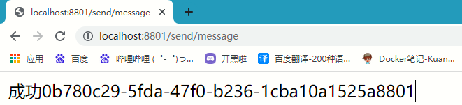  

         


- 消息持久化问题

  当服务器发送消息,客户端处于关闭的状态,接收到信息,此时消息就丢失了

  发送信息


​	此时2个消费者都处于关闭状态


​	启动客户端


信息丢失

#### 3、**生产实际案例**

比如在如下场景中，订单系统我们做集群部署，都会从RabbitMQ中获取订单信息，那如果一个订单同时被两个服务获取到，那么就会造成数据错误，我们得避免这种情况。这时我们就可以**使用Stream中的消息分组来解决**。


注意在Stream中处于同一个group中的多个消费者是竞争关系，就能够保证消息只会被其中一个应用消费一次。不同组是可以全面消费的(重复消费)。

### (十)、Stream之解决重复消费

#### 1、原理

访问:http://192.168.2.177:15672/#/exchanges/%2F/studyExchange


可以看出消费者1和消费者2分别在2个路由上,我们要做的是将他们合在一起,当消息进来的时候给一个路由发送消息,让消费者1和2争抢就行了

#### 2、具体实现

在yaml中添加group

```yaml
spring:
  application:
    name: cloud-stream-consumer
  rabbitmq:
    host: 192.168.2.177
    port: 5672
    username: admin
    password: 123
  cloud:
    stream:
      binders: # 在此处配置要绑定的rabbitmq的服务信息；
        defaultRabbit: # 表示定义的名称，用于于binding整合
          type: rabbit # 消息组件类型
      bindings: # 服务的整合处理
        input: # 这个名字是一个通道的名称
          destination: studyExchange # 表示要使用的Exchange名称定义
          content-type: application/json # 设置消息类型，本次为对象json，如果是文本则设置“text/plain”
          binder: defaultRabbit # 设置要绑定的消息服务的具体设置
          group: A_group        # 路由名为A_group
```

消费者1和消费者2保证路由名一致

#### 3、再次测试

重新启动8802,8803

发送信息:http://localhost:8801/send/message


此时只有8002接收到了信息,解决了重复消费

### (十一)、Stream之消息持久化

当加了Group属性后信息自动持久化

测试:

- 关闭8802,8803


- 发送4条信息


重新启动8802,8803


- 消息成功收到

## 十四、Sleuth

### (一)、zipkin的搭建

下载:https://mvnrepository.com/artifact/io.zipkin.java/zipkin-server/2.12.9

下载完在jar包的当前目录打开cmd

运行:java -jar zipkin-server-2.12.9-exec.jar

图形化界面:http://localhost:9411/zipkin/

#### (二)、**术语**

完整的调用链路

表示一请求链路，一条链路通过Trace ld唯一标识，Span标识发起的请求信息，各span通过parent id关联起来

—条链路通过Trace ld唯一标识，Span标识发起的请求信息，各span通过parent id关联起来。

整个链路的依赖关系如下：


名词解释

- Trace：类似于树结构的Span集合，表示一条调用链路，存在唯一标识
- span：表示调用链路来源，通俗的理解span就是一次请求信息

### (二)、Sleuth链路监控展现

#### 1、服务提供者 

- cloud-provider-payment8001

- POM


```xml
<!--包含了sleuth+zipkin-->
<dependency>
    <groupId>org.springframework.cloud</groupId>
    <artifactId>spring-cloud-starter-zipkin</artifactId>
</dependency>
```

- YML


```yaml
spring:
  application:
    name: cloud-payment-service

  zipkin: #<-------------------------------------关键 
      base-url: http://localhost:9411
  sleuth: #<-------------------------------------关键
    sampler:
    #采样率值介于 0 到 1 之间，1 则表示全部采集
    probability: 1
```

- 业务类PaymentController


    @RestController
    @Slf4j
    public class PaymentController {
    	
    	...
    
    	@GetMapping("/payment/zipkin")
    	public String paymentZipkin() {
        	return "hi ,i'am paymentzipkin server fall back，welcome to here, O(∩_∩)O哈哈~";
    	}    
    }
- 依次启动eureka7001/8001/80 - 80调用8001几次测试下

- 打开浏览器访问: http://localhost:9411

- 打开页面自己摸索吧,比较简单

## 十五、Cloud Alibaba简介

### (一)、**为什么会出现SpringCloud alibaba**

Spring Cloud Netflix项目进入维护模式

https://spring.io/blog/2018/12/12/spring-cloud-greenwich-rc1-available-now

什么是维护模式？

将模块置于维护模式，意味着Spring Cloud团队将不会再向模块添加新功能。

他们将修复block级别的 bug 以及安全问题，他们也会考虑并审查社区的小型pull request。

### (二)、是什么

官网:https://github.com/alibaba/spring-cloud-alibaba/blob/master/README-zh.md

Spring Cloud Alibaba 致力于提供微服务开发的一站式解决方案。此项目包含开发分布式应用微服务的必需组件，方便开发者通过 Spring Cloud 编程模型轻松使用这些组件来开发分布式应用服务。

依托 Spring Cloud Alibaba，您只需要添加一些注解和少量配置，就可以将 Spring Cloud 应用接入阿里微服务解决方案，通过阿里中间件来迅速搭建分布式应用系统。

诞生：2018.10.31，Spring Cloud Alibaba 正式入驻了Spring Cloud官方孵化器，并在Maven 中央库发布了第一个版本。

### (三)、能干嘛

- 服务限流降级：默认支持 WebServlet、WebFlux, OpenFeign、RestTemplate、Spring Cloud Gateway, Zuul, Dubbo 和 RocketMQ 限流降级功能的接入，可以在运行时通过控制台实时修改限流降级规则，还支持查看限流降级 Metrics 监控。
- 服务注册与发现：适配 Spring Cloud 服务注册与发现标准，默认集成了 Ribbon 的支持。
- 分布式配置管理：支持分布式系统中的外部化配置，配置更改时自动刷新。
- 消息驱动能力：基于 Spring Cloud Stream 为微服务应用构建消息驱动能力。
- 分布式事务：使用 @GlobalTransactional 注解， 高效并且对业务零侵入地解决分布式事务问题。
- 阿里云对象存储：阿里云提供的海量、安全、低成本、高可靠的云存储服务。支持在任何应用、任何时间、任何地点存储和访问任意类型的数据。
  分布式任务调度：提供秒级、精准、高可靠、高可用的定时（基于 Cron 表达式）任务调度服务。同时提供分布式的任务执行模型，如网格任务。网格任务支持海量子任务均匀分配到所有 Worker（schedulerx-client）上执行。
- 阿里云短信服务：覆盖全球的短信服务，友好、高效、智能的互联化通讯能力，帮助企业迅速搭建客户触达通道。

### (四)、**去哪下**

如果需要使用已发布的版本，在 `dependencyManagement` 中添加如下配置

```xml
<dependencyManagement>
    <dependencies>
        <dependency>
            <groupId>com.alibaba.cloud</groupId>
            <artifactId>spring-cloud-alibaba-dependencies</artifactId>
            <version>2.2.5.RELEASE</version>
            <type>pom</type>
            <scope>import</scope>
        </dependency>
    </dependencies>
</dependencyManagement>
```

然后在 `dependencies` 中添加自己所需使用的依赖即可使用。

### (五)、**怎么玩**

- Sentinel：把流量作为切入点，从流量控制、熔断降级、系统负载保护等多个维度保护服务的稳定性。
- Nacos：一个更易于构建云原生应用的动态服务发现、配置管理和服务管理平台。
- RocketMQ：一款开源的分布式消息系统，基于高可用分布式集群技术，提供低延时的、高可靠的消息发布与订阅服务。
- Dubbo：Apache Dubbo™ 是一款高性能 Java RPC 框架。
- Seata：阿里巴巴开源产品，一个易于使用的高性能微服务分布式事务解决方案。
- Alibaba Cloud OSS: 阿里云对象存储服务（Object Storage Service，简称 OSS），是阿里云提供的海量、安全、低成本、高可靠的云存储服务。您可以在任何应用、任何时间、任何地点存储和访问任意类型的数据。
- Alibaba Cloud SchedulerX: 阿里中间件团队开发的一款分布式任务调度产品，提供秒级、精准、高可靠、高可用的定时（基于 Cron 表达式）任务调度服务。
- Alibaba Cloud SMS: 覆盖全球的短信服务，友好、高效、智能的互联化通讯能力，帮助企业迅速搭建客户触达通道。

### (六)、Spring Cloud Alibaba学习资料获取

- 官网


- https://spring.io/projects/spring-cloud-alibaba#overview
  英文

- https://github.com/alibaba/spring-cloud-alibaba
  https://spring-cloud-alibaba-group.github.io/github-pages/greenwich/spring-cloud-alibaba.html

- 中文

  https://github.com/alibaba/spring-cloud-alibaba/blob/master/README-zh.md

## 十六、Nacos

### (一)、Nacos简介和下载

#### 1、**为什么叫Nacos**

- 前四个字母分别为Naming和Configuration的前两个字母，最后的s为Service。

#### 2、是什么

- 一个更易于构建云原生应用的动态服务发现、配置管理和服务管理平台。
- Nacos: Dynamic Naming and Configuration Service
- Nacos就是注册中心＋配置中心的组合 -> Nacos = Eureka+Config+Bus

#### 3、能干嘛

- 替代Eureka做服务注册中心
- 替代Config做服务配置中心

#### 4、去哪下

https://github.com/alibaba/nacos/releases

官网文档:https://spring-cloud-alibaba-group.github.io/github-pages/greenwich/spring-cloud-alibaba.html#_spring%20cloud%20alibaba%20nacos_discovery

#### 5、**各种注册中心比较**

| 服务注册与发现框架 | CAP模型 | 控制台管理 | 社区活跃度      |
| ------------------ | ------- | ---------- | --------------- |
| Eureka             | AP      | 支持       | 低(2.x版本闭源) |
| Zookeeper          | CP      | 不支持     | 中              |
| consul             | CP      | 支持       | 高              |
| Nacos              | AP      | 支持       | 高              |

据说Nacos在阿里巴巴内部有超过10万的实例运行，已经过了类似双十一等各种大型流量的考验。

### (二)、Nacos安装

- 本地Java8+Maven环境已经OK先
- 从[官网](https://github.com/alibaba/nacos/releases)下载Nacos:
- 解压安装包，在bin目录打开cmd输入命令            startup.cmd -m standalone
- 命令运行成功后直接访问http://localhost:8848/nacos，默认账号密码都是nacos
- 结果页面


### (三)、Nacos之服务提供者注册

#### 1、父pom要有依赖

```xml
<dependency>
  <groupId>com.alibaba.cloud</groupId>
  <artifactId>spring-cloud-alibaba-dependencies</artifactId>
  <version>2.1.0.RELEASE</version>
  <type>pom</type>
  <scope>import</scope>
</dependency>
```

#### 2、创建项目:cloudalibaba-provider-payment9001

#### 3、pom

```xml
<dependencies>
    <!--SpringCloud ailibaba nacos -->
    <dependency>
        <groupId>com.alibaba.cloud</groupId>
        <artifactId>spring-cloud-starter-alibaba-nacos-discovery</artifactId>
    </dependency>
    <!-- SpringBoot整合Web组件 -->
    <dependency>
        <groupId>org.springframework.boot</groupId>
        <artifactId>spring-boot-starter-web</artifactId>
    </dependency>
    <dependency>
        <groupId>org.springframework.boot</groupId>
        <artifactId>spring-boot-starter-actuator</artifactId>
    </dependency>
    <!--日常通用jar包配置-->
    <dependency>
        <groupId>org.projectlombok</groupId>
        <artifactId>lombok</artifactId>
        <optional>true</optional>
    </dependency>
    <dependency>
        <groupId>org.springframework.boot</groupId>
        <artifactId>spring-boot-starter-test</artifactId>
        <scope>test</scope>
    </dependency>
</dependencies>
```

#### 4、yaml

```yaml
server:
  port: 9001
spring:
  application:
    name: provider-payment
  cloud:
    nacos:
      discovery:
        server-addr: localhost:8848   #配置Nacos地址

# 暴露所有信息
management:
  endpoints:
    web:
      exposure:
        include: "*"
```

#### 5、主启动

```java
@EnableDiscoveryClient
@SpringBootApplication
public class PaymentRunMain9001 {
    public static void main(String[] args) {
        SpringApplication.run(PaymentRunMain9001.class, args);
    }
}
```

#### 6、controller

```java
@RestController
public class PaymentController {

    @Value("${server.port}")
    private String serverPort;

    @GetMapping("/payment/getPort/{id}")
    public String getServerPort(@PathVariable("id")Integer id){
        return "当前端口为:"+serverPort+",发送的id为:"+id;
    }
}
```

#### 7、测试

启动9001

访问:http://localhost:8848/nacos

账号:nacos

密码:nacos

服务管理--->服务列表

发现9001已注册到注册中心中 

访问:http://localhost:9001/payment/getPort/1


### (四)、负载均衡搭建

- 仿照9001搭建9002

- yaml

```yaml
server:
  port: 9002
spring:
  application:
    name: provider-payment
  cloud:
    nacos:
      discovery:
        server-addr: localhost:8848   #配置Nacos地址

# 暴露所有信息
management:
  endpoints:
    web:
      exposure:
        include: "*"
```

- 测试

启动8002

访问:nacos的服务列表


可以看出nacos集成群集

### (五)、Nacos之服务消费者注册

#### 1、新建模块:cloudalibaba-consumer-nacos-order83

#### 2、pom

```xml
<dependencies>
    <!--SpringCloud ailibaba nacos -->
    <dependency>
        <groupId>com.alibaba.cloud</groupId>
        <artifactId>spring-cloud-starter-alibaba-nacos-discovery</artifactId>
    </dependency>
    <!-- 引入自己定义的api通用包，可以使用Payment支付Entity -->
    <dependency>
        <groupId>org.cloud</groupId>
        <artifactId>cloud-api-commons</artifactId>
        <version>1.0-SNAPSHOT</version>
    </dependency>
    <!-- SpringBoot整合Web组件 -->
    <dependency>
        <groupId>org.springframework.boot</groupId>
        <artifactId>spring-boot-starter-web</artifactId>
    </dependency>
    <dependency>
        <groupId>org.springframework.boot</groupId>
        <artifactId>spring-boot-starter-actuator</artifactId>
    </dependency>
    <!--日常通用jar包配置-->
    <dependency>
        <groupId>org.projectlombok</groupId>
        <artifactId>lombok</artifactId>
        <optional>true</optional>
    </dependency>
    <dependency>
        <groupId>org.springframework.boot</groupId>
        <artifactId>spring-boot-starter-test</artifactId>
        <scope>test</scope>
    </dependency>
</dependencies>
```

#### 3、YML

```yaml
server:
  port: 83

spring:
  application:
    name: nacos-order-consumer
  cloud:
    nacos:
      discovery:
        server-addr: localhost:8848

#消费者将要去访问的微服务名称(注册成功进nacos的微服务提供者)
service-url: 
  nacos-user-service: http://provider-payment
```

#### 4、主启动 

```java
@SpringBootApplication
@EnableDiscoveryClient
public class OrderRunMain83 {
    public static void main(String[] args) {
        SpringApplication.run(OrderRunMain83.class, args);
    }
}
```

#### 5、config

```java
@Configuration
public class ApplicationContextConfig {

    @Bean
    @LoadBalanced
    public RestTemplate getRestTemplate(){
        return new RestTemplate();
    }
}
```

#### 6、controller

```java
@RestController
public class OrderController {

    @Value("${server.port}")
    private String serverPort;

    @Value("${service-url.nacos-payment-service}")
    private String paymentServiceUrl;

    @Autowired
    private RestTemplate restTemplate;

    @GetMapping("/consumer/payment/getPort/{id}")
    public String getServerPort(@PathVariable("id")Integer id){
        return restTemplate.getForObject(paymentServiceUrl+"/payment/getPort/"+id, String.class)+","+serverPort;
    }
}
```

#### 7、测试

启动9001,9002,83

访问:http://localhost:83/consumer/payment/getPort/3


发现nacos本身自带ribbon负载均衡 

### (六)、Nacos服务注册中心对比提升

#### 1、**Nacos和CAP**

Nacos与其他注册中心特性对比


#### 2、**Nacos服务发现实例模型**


#### 3、**Nacos支持AP和CP模式的切换**

C是所有节点在同一时间看到的数据是一致的;而A的定义是所有的请求都会收到响应。

何时选择使用何种模式?

—般来说，如果不需要存储服务级别的信息且服务实例是通过nacos-client注册，并能够保持心跳上报，那么就可以选择AP模式。当前主流的服务如Spring cloud和Dubbo服务，都适用于AP模式，AP模式为了服务的可能性而减弱了一致性，因此AP模式下只支持注册临时实例。

如果需要在服务级别编辑或者存储配置信息，那么CP是必须，K8S服务和DNS服务则适用于CP模式。CP模式下则支持注册持久化实例，此时则是以Raft协议为集群运行模式，该模式下注册实例之前必须先注册服务，如果服务不存在，则会返回错误。

切换命令：

```
curl -X PUT '$NACOS_SERVER:8848/nacos/v1/ns/operator/switches?entry=serverMode&value=CP
```

### (七)、Nacos之服务配置中心

#### 1、创项目:cloudalibaba-config-nacos-client3377

#### 2、pom

```xml
<dependencies>
    <!--nacos-config-->
    <dependency>
        <groupId>com.alibaba.cloud</groupId>
        <artifactId>spring-cloud-starter-alibaba-nacos-config</artifactId>
    </dependency>
    <!--nacos-discovery-->
    <dependency>
        <groupId>com.alibaba.cloud</groupId>
        <artifactId>spring-cloud-starter-alibaba-nacos-discovery</artifactId>
    </dependency>
    <!--web + actuator-->
    <dependency>
        <groupId>org.springframework.boot</groupId>
        <artifactId>spring-boot-starter-web</artifactId>
    </dependency>
    <dependency>
        <groupId>org.springframework.boot</groupId>
        <artifactId>spring-boot-starter-actuator</artifactId>
    </dependency>
    <!--一般基础配置-->
    <dependency>
        <groupId>org.projectlombok</groupId>
        <artifactId>lombok</artifactId>
        <optional>true</optional>
    </dependency>
    <dependency>
        <groupId>org.springframework.boot</groupId>
        <artifactId>spring-boot-starter-test</artifactId>
        <scope>test</scope>
    </dependency>
</dependencies>
```

#### 3、配置文件

Nacos同springcloud-config一样，在项目初始化时，要保证先从配置中心进行配置拉取，拉取配置之后，才能保证项目的正常启动。

springboot中配置文件的加载是存在优先级顺序的，bootstrap优先级高于application

- bootstrap.yaml

```yaml
# nacos配置
server:
  port: 3377

spring:
  application:
    name: nacos-config-client
  cloud:
    nacos:
      discovery:
        server-addr: localhost:8848 #Nacos服务注册中心地址
      config:
        server-addr: localhost:8848 #Nacos作为配置中心地址
        file-extension: yaml #指定yaml格式的配置
```

- application.yaml

```yaml
spring:
  profiles:
    active: dev   # 表示开发环境
```

#### 4、主启动

```java
@SpringBootApplication
@EnableDiscoveryClient
public class ConfigClientRunMain3377 {
    public static void main(String[] args) {
        SpringApplication.run(ConfigClientRunMain3377.class, args);
    }
}
```

#### 5、controller

```java
@RestController
@RefreshScope
public class ConfigClientController {

    @Value("${config.info}")
    private String configInfo;

    @GetMapping("/config/info")
    public String getConfigInfo() {
        return configInfo;
    }
}
```

#### 6、nacos配置中心创建文件


#### 7、测试

- 启动3377

- 访问:http://localhost:3377/config/info


- 修改配置中心文件刷新网页


#### 8、配置文件命名规范

```yaml
${prefix}-${spring-profile.active}.${file-extension}
```

- prefix默认为spring.application.name的值，也可以通过配置项spring.cloud.nacos.config.prefix来配置。
- spring.profile.active即为当前环境对应的 profile，详情可以参考 Spring Boot文档。注意：当spring.profile.active为空时，对应的连接符 - 也将不存在，datald 的拼接格式变成${prefix}.${file-extension}
- file-exetension为配置内容的数据格式，可以通过配置项spring .cloud.nacos.config.file-extension来配置。目前只支持properties和yaml类型。
- 通过Spring Cloud 原生注解@RefreshScope实现配置自动更新。

最后公式

```
${spring.application.name)}-${spring.profiles.active}.${spring.cloud.nacos.config.file-extension}
```

模块名-当前环境.什么文件


### (八)、Nacos之命名空间分组和DataID三者关系

#### 1、**多环境多项目管理**

- 问题1:


实际开发中，通常一个系统会准备

dev开发环境
test测试环境
prod生产环境。

如何保证指定环境启动时服务能正确读取到Nacos上相应环境的配置文件呢?

- 问题2:


一个大型分布式微服务系统会有很多微服务子项目，每个微服务项目又都会有相应的开发环境、测试环境、预发环境、正式环境…那怎么对这些微服务配置进行管理呢?

Nacos的图形化管理界面


#### 2、**Namespace+Group+Data lD三者关系？为什么这么设计？**

- 是什么

类似Java里面的package名和类名最外层的namespace是可以用于区分部署环境的，Group和DatalD逻辑上区分两个目标对象。

- 三者情况


默认情况：Namespace=public，Group=DEFAULT_GROUP，默认Cluster是DEFAULT

- Nacos默认的Namespace是public，Namespace主要用来实现隔离。
  - 比方说我们现在有三个环境：开发、测试、生产环境，我们就可以创建三个Namespace，不同的Namespace之间是隔离的。

- Group默认是DEFAULT_GROUP，Group可以把不同的微服务划分到同一个分组里面去
- Service就是微服务:一个Service可以包含多个Cluster (集群)，Nacos默认Cluster是DEFAULT，Cluster是对指定微服务的一个虚拟划分。
  - 比方说为了容灾，将Service微服务分别部署在了杭州机房和广州机房，这时就可以给杭州机房的Service微服务起一个集群名称(HZ) ，给广州机房的Service微服务起一个集群名称(GZ)，还可以尽量让同一个机房的微服务互相调用，以提升性能。
- 最后是Instance，就是微服务的实例。

#### (九)、Nacos之DataID配置

指定spring.profile.active和配置文件的DatalD来使不同环境下读取不同的配置

默认空间+默认分组+新建dev和test两个DatalD

- 新建dev配置DatalD


- 新建test配置DatalD


通过spring.profile.active属性就能进行多环境下配置文件的读取


**测试**

- http://localhost:3377/config/info
- 配置是什么就加载什么 test/dev

### (九)、Nacos之Group分组方案

通过Group实现环境区分 - 新建Group


在nacos图形界面控制台上面新建配置文件DatalD


bootstrap+application

在config下增加一条group的配置即可。可配置为DEV_GROUP或TEST GROUP


### (十)、Nacos之Namespace空间方案

新建dev/test的Namespace


回到服务管理-服务列表查看


按照域名配置填写


YML

```yaml
#nacos配置
server:
  port: 3377

spring:
  application:
    name: nacos-config-client
  cloud:
    nacos:
      discovery:
        server-addr: localhost:8848 #Nacos服务注册中心地址
      config:
        server-addr: localhost:8848 #Nacos作为配置中心地址
        file-extension: yaml #指定yaml格式的配置
        group: DEV_GROUP
        namespace: 7d8f0f5a-6a53-4785-9686-dd460158e5d4 #<------------指定namespace
```

### (十一)、Nacos集群_架构说明

- #### 官方架构图

集群部署架构图

因此开源的时候推荐用户把所有服务列表放到一个vip下面，然后挂到一个域名下面

http://ip1:port/openAPI直连ip模式，机器挂则需要修改ip才可以使用。

http://VIP:port/openAPI挂载VIP模式，直连vip即可，下面挂server真实ip，可读性不好。

http://nacos.com:port/openAPI域名＋VIP模式，可读性好，而且换ip方便，推荐模式


- #### **真实架构图**


按照上述，**我们需要mysql数据库**。

### (十二)、Nacos持久化切换配置

Nacos默认自带的是嵌入式数据库derby，nacos的pom.xml中可以看出。

derby到mysql切换配置步骤：

- nacos-server-1.1.4\nacos\conf录下找到nacos-mysql.sql文件，执行脚本。

```mysql
首先创建库并进入
CREATE DATABASE nacos_config;
USE nacos_config;
```


直接运行即可


- nacos-server-1.1.4\nacos\conf目录下找到application.properties，添加以下配置（按需修改对应值）。

```properties
spring.datasource.platform=mysql
db.num=1
db.url.0=jdbc:mysql://127.0.0.1:3306/nacos_config?characterEncoding=utf8&connectTimeout=1000&socketTimeout=3000&autoReconnect=true&useUnicode=true&useSSL=false&serverTimezone=UTC
db.user=root
db.password=Qwer1234
```

- 测试 

重新启动nacos服务

再次进入


添加一个yaml文件


查看数据库


成功添加数据

### (十二)、nacos集群搭建

#### 1、创建一台Centos7

- 安装java1.8环境

```shell
链接：https://pan.baidu.com/s/1tmbhwfUbaPd8nuhY3SEhRg 
提取码：0m47
下载完上传到系统
mkdir /usr/local/java/
tar -zxvf jdk-8u241-linux-x64.tar -C /usr/local/java/
vim /etc/profile
export JAVA_HOME=/usr/local/java/jdk1.8.0_171 
export JRE_HOME=${JAVA_HOME}/jre 
export CLASSPATH=.:${JAVA_HOME}/lib:${JRE_HOME}/lib 
export PATH=${JAVA_HOME}/bin:$PATH
source /etc/profile
java -version
```

- 安装Maven环境

```shell
yum -y install wget
wget http://mirrors.tuna.tsinghua.edu.cn/apache/maven/maven-3/3.6.3/binaries/apache-maven-3.6.3-bin.tar.gz
tar -xf apache-maven-3.6.3-bin.tar.gz -C /usr/local/mymaven
mv /usr/local/apache-maven-3.6.3/ /usr/local/maven3.6
vi /etc/profile
export PATH=$PATH:/usr/local/maven3.6/bin
source /etc/profile
mvn -version
```

- 安装mysql

  访问:https://dev.mysql.com/downloads/file/?id=509630

  下载


上传到服务器

```shell
# 解压
gzip mysql-5.7.37-1.el7.x86_64.rpm-bundle.tar 				
tar -zxvf mysql-5.7.37-1.el7.x86_64.rpm-bundle.tar.gz 
# 查看是否依赖重复
rpm -qa | grep postfix			
rpm -qa | grep mariadb		
# 删除依赖重复 
rpm -ev postfix-2.10.1-6.el7.x86_64			
rpm -ev mariadb-libs-5.5.56-2.el7.x86_64
# 安装
rpm -ivh mysql-community-common-5.7.37-1.el7.x86_64.rpm		
rpm -ivh mysql-community-libs-5.7.37-1.el7.x86_64.rpm		
rpm -ivh mysql-community-client-5.7.37-1.el7.x86_64.rpm 	
yum -y install libnuma*										
rpm -ivh --nodeps mysql-community-server-5.7.37-1.el7.x86_64.rpm
# 启动
systemctl start mysql
# 修改密码
grep 'temporary password' /var/log/mysqld.log		# 查看密码
2022-01-26T07:06:44.200825Z 1 [Note] A temporary password is generated for root@localhost: 4#adhZdeICvb
# 使用密码登录
mysql -uroot -p4#adhZdeICvb
# 关闭策略
set global validate_password_policy=LOW;
# 修改密码
ALTER USER 'root'@'localhost' IDENTIFIED BY 'Qwer1234';
# 开放远程连接
use mysql;
update user set user.Host='%' where user.User='root';
flush privileges;
# 设置开机自启
cp /usr/local/mysql/support-files/mysql.server /etc/init.d/mysqld	#将服务文件拷贝到init.d下，并重命名为mysql
chmod +x /etc/init.d/mysqld		# 赋予可执行权限
chkconfig --add mysqld			# 添加服务
chkconfig --list				# 显示服务列表
# 配置mysql默认编码为utf-8
vim /etc/my.cnf
[mysqld]

character_set_server=utf8
init_connect='SET NAMES utf8'
# 重启服务器
systemctl restart mysqld
# 查看编码
show variables like '%character%';
+--------------------------+----------------------------+
| Variable_name            | Value                      |
+--------------------------+----------------------------+
| character_set_client     | utf8                       |
| character_set_connection | utf8                       |
| character_set_database   | utf8                       |
| character_set_filesystem | binary                     |
| character_set_results    | utf8                       |
| character_set_server     | utf8                       |
| character_set_system     | utf8                       |
| character_sets_dir       | /usr/share/mysql/charsets/ |
+--------------------------+----------------------------+
8 rows in set (0.00 sec)
```

- 安装nacos


```
上传到服务器
# 解压
tar -zxvf nacos-server-2.0.4.tar.gz
# 移动到自己目录
mkdir /opt/mynacos
mv nacos /opt/mynacos/
```

- 安装nginx

  详见:https://ma2992455524.github.io/MyNote/HTML/Nginx/Nginx.html

  压缩包:

  链接：https://pan.baidu.com/s/1v_hcnAuhK2e-3jJOgJCBgw 
  提取码：6n4o

#### 2、群集配置

- #### 数据库配置


```mysql
# 进入数据库
mysql -uroot -pQwer1234
# 创建并进入数据库
create database nacos_config;
use nacos_config
# 导入数据库 
set names utf8;
source /opt/mynacos/nacos/conf/nacos-mysql.sql
```

- nacos配置文件设置

```shell
vim opt/mynacos/nacos/conf/application.properties
33 spring.datasource.platform=mysql
34 db.num=1
35 db.url.0=jdbc:mysql://127.0.0.1:3306/nacos_config?characterEncoding=utf8&connectTimeout=1000&socketTimeout=3000&autoReconnect=true&useUnicode=true&useSSL=fals    e&serverTimezone=UTC
36 db.user.0=nacos
37 db.password.0=Qwer1234
```

- 群集配置文件设置

```shell
cd opt/mynacos/nacos/conf/
cp cluster.conf.example cluster.conf
vi cluster.conf
192.168.2.177:3333
192.168.2.177:4444
192.168.2.177:5555
```

- nacos配置文件配置

```shell
vi /opt/mynacos/nacos/conf/application.properties

原来的8848改为

21 server.port=3333
22 server.port=4444
23 server.port=5555
```

- 启动各种端口的nacos

```shell
./startup.sh -p 3333
./startup.sh -p 4444
./startup.sh -p 5555
```

- Nginx配置文件设置

```shell
 vi  /usr/local/nginx/conf/nginx.conf

 17 http {
 18     include       mime.types;
 19     default_type  application/octet-streami;
 20 
 21 	###########################################
 22     upstream mynacos{
 23         server 192.168.2.177:3333;
 24         server 192.168.2.177:4444;
 25         server 192.168.2.177:5555;
 26     }
 27 	############################################
 28 
 29     sendfile        on;
 30 
 31     keepalive_timeout  65;
 32 
 33     server {
 			##################################
 34         listen       1111;
 			##################################
 35         server_name  localhost;
 36 
 37 
 38         location / {
 			####################################
 39                 proxy_pass http://mynacos;
 			####################################
 40         }
```


- 启动nginx

```
/usr/local/nginx/sbin/nginx -c /usr/local/nginx/conf/nginx.conf
```

- 测试

  访问:http://192.168.2.177:1111/nacos/#/login


​	创建yaml文件测试


​	Centos7数据库查看


## 十七、Sentinel

### (一)、Sentinel是什么

官方github:https://github.com/alibaba/Sentinel

官方文档:https://sentinelguard.io/zh-cn/docs/introduction.html

#### 1、**Sentinel 是什么？**

随着微服务的流行，服务和服务之间的稳定性变得越来越重要。Sentinel 以流量为切入点，从流量控制、熔断降级、系统负载保护等多个维度保护服务的稳定性。

Sentinel 具有以下特征:

- 丰富的应用场景：Sentinel 承接了阿里巴巴近 10 年的双十一大促流量的核心场景，例如秒杀（即突发流量控制在系统容量可以承受的范围）、消息削峰填谷、集群流量控制、实时熔断下游不可用应用等。
- 完备的实时监控：Sentinel 同时提供实时的监控功能。您可以在控制台中看到接入应用的单台机器秒级数据，甚至 500 台以下规模的集群的汇总运行情况。
- 广泛的开源生态：Sentinel 提供开箱即用的与其它开源框架/库的整合模块，例如与 Spring Cloud、Dubbo、gRPC 的整合。您只需要引入相应的依赖并进行简单的配置即可快速地接入 Sentinel。
- 完善的 SPI 扩展点：Sentinel 提供简单易用、完善的 SPI 扩展接口。您可以通过实现扩展接口来快速地定制逻辑。例如定制规则管理、适配动态数据源等。

Sentinel 的主要特性：


—句话解释，之前我们讲解过的Hystrix。

#### 2、Hystrix和Sentinel比较

- Hystrix
  1. 需要我们程序员自己手工搭建监控平台
  2. 没有一套web界面可以给我们进行更加细粒度化得配置流控、速率控制、服务熔断、服务降级
- Sentinel
  1. 单独一个组件，可以独立出来。
  2. 直接界面化的细粒度统一配置。

约定 > 配置 > 编码

都可以写在代码里面，但是我们本次还是大规模的学习使用配置和注解的方式，尽量少写代码

### (二)、Sentinel下载安装运行

下载地址:https://github.com/alibaba/Sentinel/releases

官方文档:https://spring-cloud-alibaba-group.github.io/github-pages/greenwich/spring-cloud-alibaba.html#_spring_cloud_alibaba_sentinel

服务使用中的各种问题：

- 服务雪崩
- 服务降级
- 服务熔断
- 服务限流

Sentinel 分为两个部分：

- 核心库（Java 客户端）不依赖任何框架/库，能够运行于所有 Java 运行时环境，同时对 Dubbo / Spring Cloud 等框架也有较好的支持。
- 控制台（Dashboard）基于 Spring Boot 开发，打包后可以直接运行，不需要额外的 Tomcat 等应用容器。

安装步骤：

- 下载
  - https://github.com/alibaba/Sentinel/releases
  - 下载到本地sentinel-dashboard-1.7.0.jar

运行命令

- 前提
  - Java 8 环境
  - 8080端口不能被占用

- 命令
  - java -jar sentinel-dashboard-1.7.0.jar

访问Sentinel管理界面

- localhost:8080
- 登录账号密码均为sentinel


### (三)、监控客户端搭建

#### 1、创项目:**cloudalibaba-sentinel-service8401**

#### 2、pom

```xml
<dependencies>
    <dependency><!-- 引入自己定义的api通用包，可以使用Payment支付Entity -->
        <groupId>org.cloud</groupId>
        <artifactId>cloud-api-commons</artifactId>
        <version>1.0-SNAPSHOT</version>
    </dependency>
    <!--SpringCloud ailibaba nacos -->
    <dependency>
        <groupId>com.alibaba.cloud</groupId>
        <artifactId>spring-cloud-starter-alibaba-nacos-discovery</artifactId>
    </dependency>
    <!--SpringCloud ailibaba sentinel-datasource-nacos 后续做持久化用到-->
    <dependency>
        <groupId>com.alibaba.csp</groupId>
        <artifactId>sentinel-datasource-nacos</artifactId>
    </dependency>
    <!--SpringCloud ailibaba sentinel -->
    <dependency>
        <groupId>com.alibaba.cloud</groupId>
        <artifactId>spring-cloud-starter-alibaba-sentinel</artifactId>
    </dependency>
    <!--openfeign-->
    <dependency>
        <groupId>org.springframework.cloud</groupId>
        <artifactId>spring-cloud-starter-openfeign</artifactId>
    </dependency>
    <!-- SpringBoot整合Web组件+actuator -->
    <dependency>
        <groupId>org.springframework.boot</groupId>
        <artifactId>spring-boot-starter-web</artifactId>
    </dependency>
    <dependency>
        <groupId>org.springframework.boot</groupId>
        <artifactId>spring-boot-starter-actuator</artifactId>
    </dependency>
    <!--日常通用jar包配置-->
    <dependency>
        <groupId>cn.hutool</groupId>
        <artifactId>hutool-all</artifactId>
        <version>4.6.3</version>
    </dependency>
    <dependency>
        <groupId>org.projectlombok</groupId>
        <artifactId>lombok</artifactId>
        <optional>true</optional>
    </dependency>
    <dependency>
        <groupId>org.springframework.boot</groupId>
        <artifactId>spring-boot-starter-test</artifactId>
        <scope>test</scope>
    </dependency>
</dependencies>
```

#### 3、yaml

```yaml
server:
  port: 8401

spring:
  application:
    name: cloudalibaba-sentinel-service
  cloud:
    nacos:
      discovery:
        server-addr: localhost:8848 #Nacos服务注册中心地址
    sentinel:
      transport:
        dashboard: localhost:8080 #配置Sentinel dashboard地址
        port: 8719

management:
  endpoints:
    web:
      exposure:
        include: '*'

feign:
  sentinel:
    enabled: true   # 激活Sentinel对Feign的支持
```

#### 4、主启动 

```java
@EnableDiscoveryClient
@SpringBootApplication
public class SentinelRunMain8401 {
    public static void main(String[] args) {
        SpringApplication.run(SentinelRunMain8401.class, args);
    }
}
```

#### 5、controller

```java
@RestController
@Slf4j
public class SentinelTestController {

    @GetMapping("/testA")
    public String testA() {
        return "------testA";
    }

    @GetMapping("/testB")
    public String testB() {
        log.info(Thread.currentThread().getName() + "\t" + "...testB");
        return "------testB";
    }
}

```

#### 6、测试

启动:cacos,sentinel,8401

访问:http://localhost:8080/#/dashboard/home


什么也没有 

- Sentinel采用的懒加载说明

  - 执行一次访问即可

    - http://localhost:8401/testA

      

    - http://localhost:8401/testB

      

  - 效果 - sentinel8080正在监控微服务8401


### (四)、Sentinel流控规则

#### 1、基本介绍


#### 2、进一步解释说明

- 资源名：唯一名称，默认请求路径。
- 针对来源：Sentinel可以针对调用者进行限流，填写微服务名，默认default（不区分来源）。
- 阈值类型/单机阈值：
  - QPS(每秒钟的请求数量)︰当调用该API的QPS达到阈值的时候，进行限流。
  - 线程数：当调用该API的线程数达到阈值的时候，进行限流。
- 是否集群：不需要集群。
- 流控模式：
  - 直接：API达到限流条件时，直接限流。
  - 关联：当关联的资源达到阈值时，就限流自己。
  - 链路：只记录指定链路上的流量（指定资源从入口资源进来的流量，如果达到阈值，就进行限流)【API级别的针对来源】。
- 流控效果：
  - 快速失败：直接失败，抛异常。
  - Warm up：根据Code Factor（冷加载因子，默认3）的值，从阈值/codeFactor，经过预热时长，才达到设置的QPS阈值。
  - 排队等待：匀速排队，让请求以匀速的速度通过，阈值类型必须设置为QPS，否则无效。

#### 3、Sentinel流控-QPS直接失败

**直接 -> 快速失败（系统默认）**

**配置及说明**

表示1秒钟内查询1次就是OK，若超过次数1，就直接->快速失败，报默认错误

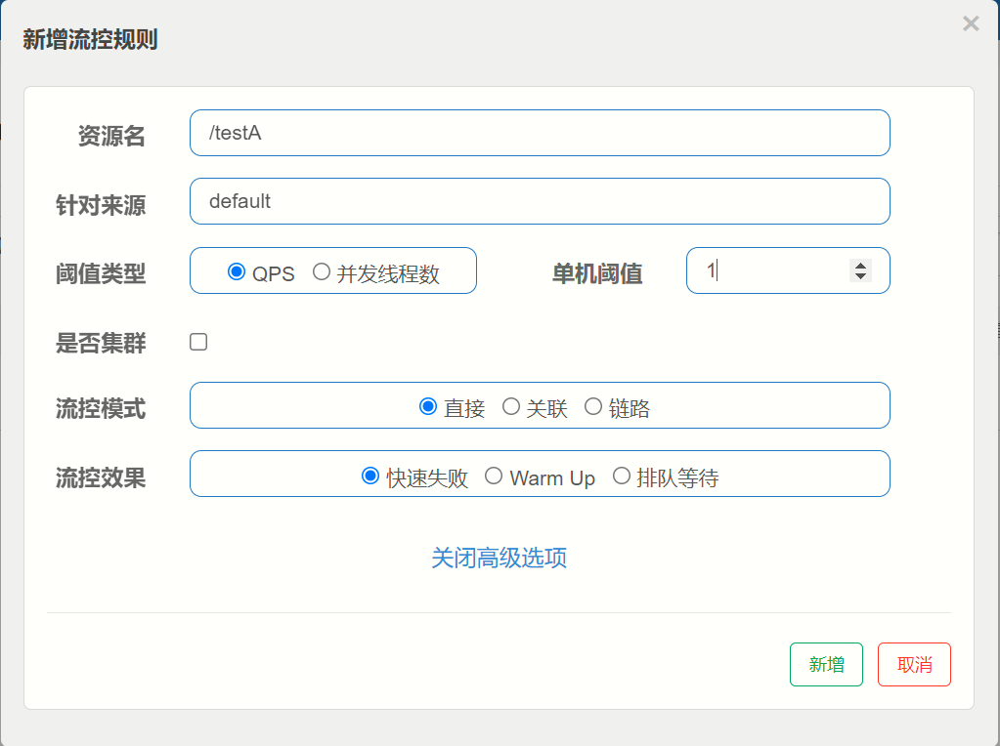

**测试**

​	快速多次点击访问http://localhost:8401/testA

**结果**

​	返回页面 Blocked by Sentinel (flow limiting)

#### 4、Sentinel流控-线程数直接失败

线程数：当访问的线程数量超过阈值时进失败


#### 5、Sentinel流控-关联

**是什么？**

- 当自己关联的资源达到阈值时，就限流自己
- 当与A关联的资源B达到阀值后，就限流A自己（B惹事，A挂了）

**设置testA**

那个/testB在一秒钟访问次数大于1时/testA关闭

常用与支付模块负载重,就暂时关闭订单模块以防更多的流量过来


#### 6、Sentinel流控-链路

例如有两条请求链路：

```
/test1      /common
/test2      /common
```

如果只希望统计从/test2进入到/common的请求，对/test2 进行限流，则可以这样配置：


当通过test2访问/common的时候如果一秒钟访问次数大于2则访问失败

#### 7、Sentinel流控-预热

- #### 概念 


即预热/冷启动方式。当系统长期处于低水位的情况下，当流量突然增加时，直接把系统拉升到高水位可能瞬间把系统压垮。通过"冷启动"，让通过的流量缓慢增加，在一定时间内逐渐增加到阈值上限，给冷系统一个预热的时间，避免冷系统被压垮。

默认coldFactor为3，即请求QPS 从 threshold / 3开始，经预热时长逐渐升至设定的QPS阈值。

- #### **WarmUp配置**


案例，阀值为10+预热时长设置5秒。

系统初始化的阀值为10/ 3约等于3,即阀值刚开始为3;然后过了5秒后阀值才慢慢升高恢复到10

此设置为：当首次访问/testA的时候，在五秒钟,1秒内只能访问10/3,如果超过3次则失败,如果5秒已过,则一秒可以访问10次,超过十次失败 


**测试**

多次快速点击http://localhost:8401/testB - 刚开始不行，后续慢慢OK

**应用场景**

如：秒杀系统在开启的瞬间，会有很多流量上来，很有可能把系统打死，预热方式就是把为了保护系统，可慢慢的把流量放进来,慢慢的把阀值增长到设置的阀值。

#### 8、Sentinel流控-排队等待

匀速排队，让请求以均匀的速度通过，阀值类型必须设成QPS，否则无效。

设置：/testA每秒1次请求，超过的话就排队等待，等待的超时时间为20000毫秒。


**匀速排队**

匀速排队（`RuleConstant.CONTROL_BEHAVIOR_RATE_LIMITER`）方式会严格控制请求通过的间隔时间，也即是让请求以均匀的速度通过，对应的是漏桶算法。


这种方式主要用于处理间隔性突发的流量，例如消息队列。想象一下这样的场景，在某一秒有大量的请求到来，而接下来的几秒则处于空闲状态，我们希望系统能够在接下来的空闲期间逐渐处理这些请求，而不是在第一秒直接拒绝多余的请求。

### (五)、Sentinel降级

#### 1、Sentinel降级简介

**熔断降级概述**

除了流量控制以外，对调用链路中不稳定的资源进行熔断降级也是保障高可用的重要措施之一。一个服务常常会调用别的模块，可能是另外的一个远程服务、数据库，或者第三方 API 等。例如，支付的时候，可能需要远程调用银联提供的 API；查询某个商品的价格，可能需要进行数据库查询。然而，这个被依赖服务的稳定性是不能保证的。如果依赖的服务出现了不稳定的情况，请求的响应时间变长，那么调用服务的方法的响应时间也会变长，线程会产生堆积，最终可能耗尽业务自身的线程池，服务本身也变得不可用。

现代微服务架构都是分布式的，由非常多的服务组成。不同服务之间相互调用，组成复杂的调用链路。以上的问题在链路调用中会产生放大的效果。复杂链路上的某一环不稳定，就可能会层层级联，最终导致整个链路都不可用。因此我们需要对不稳定的弱依赖服务调用进行熔断降级，暂时切断不稳定调用，避免局部不稳定因素导致整体的雪崩。熔断降级作为保护自身的手段，通常在客户端（调用端）进行配置。


- RT（平均响应时间，秒级）
  - 平均响应时间 超出阈值 且 在时间窗口内通过的请求>=5，两个条件同时满足后触发降级。
  - 窗口期过后关闭断路器。
  - RT最大4900（更大的需要通过-Dcsp.sentinel.statistic.max.rt=XXXX才能生效）。

- 异常比列（秒级）
  - QPS >= 5且异常比例（秒级统计）超过阈值时，触发降级;时间窗口结束后，关闭降级 。
- 异常数(分钟级)
  - 异常数(分钟统计）超过阈值时，触发降级;时间窗口结束后，关闭降级

Sentinel熔断降级会在调用链路中某个资源出现不稳定状态时（例如调用超时或异常比例升高)，对这个资源的调用进行限制，让请求快速失败，避免影响到其它的资源而导致级联错误。

当资源被降级后，在接下来的降级时间窗口之内，对该资源的调用都自动熔断（默认行为是抛出 DegradeException）。

Sentinei的断路器是没有类似Hystrix半开状态的。(Sentinei 1.8.0 已有半开状态)

半开的状态系统自动去检测是否请求有异常，没有异常就关闭断路器恢复使用，有异常则继续打开断路器不可用。

#### 2、Sentinel降级-慢调用比例

在10秒钟内当请求大于5以后,如果请求的响应时间超过200毫秒的百分之20则熔断10秒


**注意：**RT指的响应时间，Sentinel 默认统计的 RT 上限是 4900ms，超出此阈值的都会算作 4900ms，若需要
变更此上限可以通过启动配置项-Dcsp.sentinel.statistic.max.rt=xxx 来配置

修改响应时间方便测试

```java
@GetMapping("/demotion/slowcall")
public String doSlowCall() throws InterruptedException {
    //程序休眠 单位毫秒
    //Thread.sleep(200);
    try{
        TimeUnit.SECONDS.sleep(2);
    }catch (Exception e){
    }
    return "sentinel do slow call";
}
```
#### 3、Sentinel降级-异常比例

异常比例 (ERROR_RATIO)：当单位统计时长内请求数目大于设置的最小请求数目，并且异常的比例大于阈值，则接下来的熔断时长内请求会自动被熔断。经过熔断时长后熔断器会进入探测恢复状态（HALF-OPEN 状态），若接下来的一个请求成功完成（没有错误）则结束熔断，否则会再次被熔断。异常比率的阈值范围是 [0.0, 1.0]，代表 0% - 100%。

设置异常让程序100%报错


```java
@RestController
@Slf4j
public class FlowLimitController {
	...
	@GetMapping("/testD")
	public String testD() {
    	log.info("testD 异常比例");
    	int age = 10/0;
    	return "------testD";
	}
}
```
在10秒内请求数量大于5并且失败率超过百分之20进行熔断10秒


#### 4、Sentinel降级-异常数

异常数 (`ERROR_COUNT`)：当单位统计时长内的异常数目超过阈值之后会自动进行熔断。经过熔断时长后熔断器会进入探测恢复状态（HALF-OPEN 状态），若接下来的一个请求成功完成（没有错误）则结束熔断，否则会再次被熔断。

添加异常,使其100报错


```java
@RestController
@Slf4j
public class FlowLimitController{
	...
	@GetMapping("/testE")
	public String testE()
	{
    	log.info("testE 测试异常数");
    	int age = 10/0;
    	return "------testE 测试异常数";
	}
}
```
十秒内请求数大于5并且异常超过3个的话进行10秒熔断

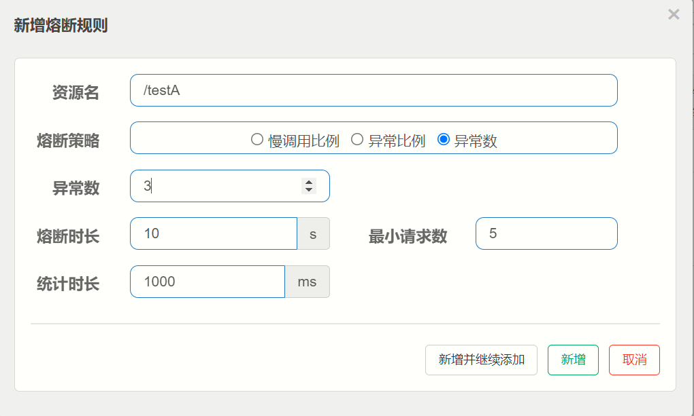

### (六)、Sentinel热点key

#### 1、**基本介绍**


何为热点？热点即经常访问的数据。很多时候我们希望统计某个热点数据中访问频次最高的 Top K 数据，并对其访问进行限制。比如：

- 商品 ID 为参数，统计一段时间内最常购买的商品 ID 并进行限制
- 用户 ID 为参数，针对一段时间内频繁访问的用户 ID 进行限制

热点参数限流会统计传入参数中的热点参数，并根据配置的限流阈值与模式，对包含热点参数的资源调用进行限流。热点参数限流可以看做是一种特殊的流量控制，仅对包含热点参数的资源调用生效。


Sentinel 利用 LRU 策略统计最近最常访问的热点参数，结合令牌桶算法来进行参数级别的流控。热点参数限流支持集群模式。

#### 2、根据参数限流

之前的case，限流出问题后，都是用sentinel系统默认的提示: Blocked by Sentinel (flow limiting)

使用@**SentinelResource**注解

- 代码

```java
@GetMapping("/testHotKey")
// value为网页设置的资源名  blockHandler为热点超出阈值回显的方法
@SentinelResource(value = "testHotKey",blockHandler = "deal_testHotKey")
public String testHotKey(@RequestParam(value = "p1",required = false) String p1,
                         @RequestParam(value = "p2",required = false) String p2) {
    //int age = 10/0;
    return "------testHotKey";
}

/*兜底方法*/
public String deal_testHotKey (String p1, String p2, BlockException exception) {
    return "------deal_testHotKey,o(╥﹏╥)o";  //sentinel系统默认的提示：Blocked by Sentinel (flow limiting)
}
```

- 网页设置

当@SentinelResource的value名为testHostkey方法,当访问路径中包含第一个参数,一秒钟如果超过1次就进行熔断,使用自己的兜底方法,如果不包含第一个参数的话就不发挥作用

- error
  - http://localhost:8401/testHotKey?p1=abc
  - http://localhost:8401/testHotKey?p1=abc&p2=33
- right
  - http://localhost:8401/testHotKey?p2=abc


#### 3、参数例外项

上述设置对p1参数进行了限流,这节设置当p1参数为某个值的时候进行特殊的限流

**配置**

当p1参数不等于5的时候一秒钟只能访问一次,当p1参数等于5的时候一秒可以访问200次

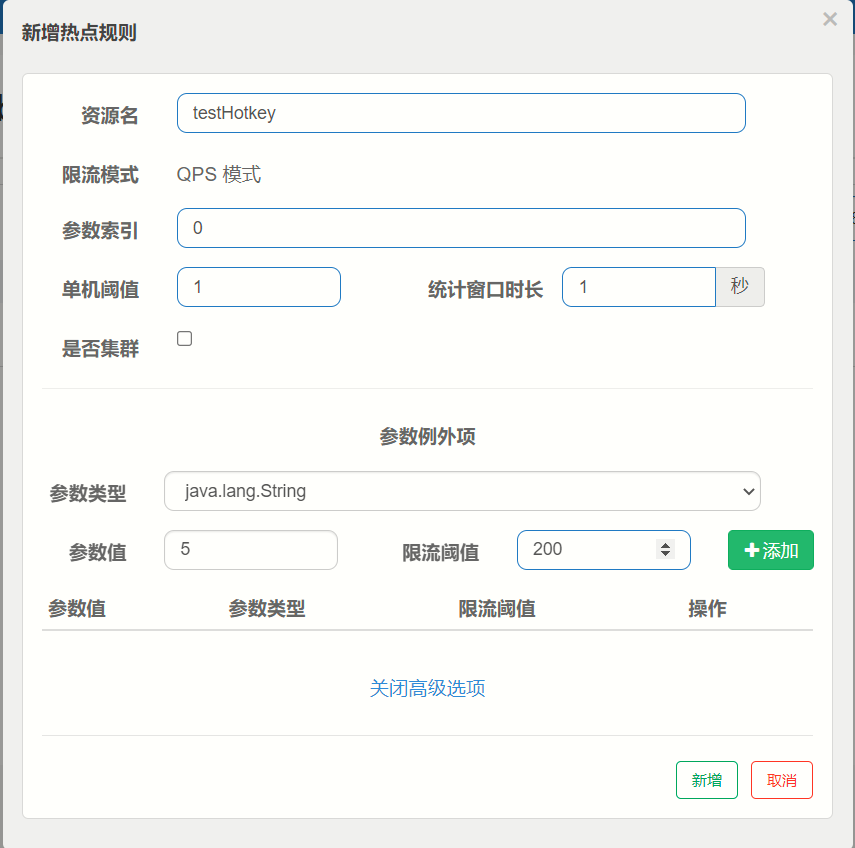

**测试**

- right - http://localhost:8401/testHotKey?p1=5
- error - http://localhost:8401/testHotKey?p1=3
- 当p1等于5的时候，阈值变为200
- 当p1不等于5的时候，阈值就是平常的1

如果@@SentinelResource没有blockHandler属性,超过阈值则报错


将会抛出Spring Boot 2的默认异常页面，而不是兜底方法。

@SentinelResource - 处理的是sentinel控制台配置的违规情况，有blockHandler方法配置的兜底处理;

RuntimeException int age = 10/0，或者其他异常,这个是java运行时报出的运行时异常RunTimeException，@SentinelResource不管

总结 - @SentinelResource主管配置出错，运行出错该走异常走异常

### (七)、Sentinel系统规则

#### 1、概念

Sentinel 系统自适应限流从整体维度对应用入口流量进行控制，结合应用的 Load、CPU 使用率、总体平均 RT、入口 QPS 和并发线程数等几个维度的监控指标，通过自适应的流控策略，让系统的入口流量和系统的负载达到一个平衡，让系统尽可能跑在最大吞吐量的同时保证系统整体的稳定性。

#### 2、系统规则

系统保护规则是从应用级别的入口流量进行控制，从单台机器的 load、CPU 使用率、平均 RT、入口 QPS 和并发线程数等几个维度监控应用指标，让系统尽可能跑在最大吞吐量的同时保证系统整体的稳定性。

系统保护规则是应用整体维度的，而不是资源维度的，并且仅对入口流量生效。入口流量指的是进入应用的流量（EntryType.IN），比如 Web 服务或 Dubbo 服务端接收的请求，都属于入口流量。

系统规则支持以下的模式:

- Load 自适应（仅对 Linux/Unix-like 机器生效）：系统的 load1 作为启发指标，进行自适应系统保护。当系统 load1 超过设定的启发值，且系统当前的并发线程数超过估算的系统容量时才会触发系统保护（BBR 阶段）。系统容量由系统的 maxQps * minRt 估算得出。设定参考值一般是 CPU cores * 2.5。
- CPU usage（1.5.0+ 版本）：当系统 CPU 使用率超过阈值即触发系统保护（取值范围 0.0-1.0），比较灵敏。
- 平均 RT：当单台机器上所有入口流量的平均 RT 达到阈值即触发系统保护，单位是毫秒。
- 并发线程数：当单台机器上所有入口流量的并发线程数达到阈值即触发系统保护。
- 入口 QPS：当单台机器上所有入口流量的 QPS 达到阈值即触发系统保护。

**人话:对整个资源进行全局控制,如果设置了对全部有效**


### (八)、根据不通规则限流

#### 1、按资源名称限流

- **启动Nacos成功**

- **启动Sentinel成功**

- **8041新建controller进行测试**

```java
@RestController
public class RateLimitController {

    @GetMapping("/byResource")
    @SentinelResource(value = "byResource",blockHandler = "handleException")
    public ReturnJson byResource() {
        return new ReturnJson(200,"按资源名称限流测试OK",new Payment(2020,"serial001"));
    }

    public ReturnJson handleException(BlockException exception) {
        return new ReturnJson(444,exception.getClass().getCanonicalName()+"\t 服务不可用");
    }
}
```

- **网页配置**

  当byResource资源1秒内访问数量大于1时进行限流


- 测试

访问:http://localhost:8401/byResource


#### 2、按照资源路径限流

- **启动Nacos成功**

- **启动Sentinel成功**

- **8401的controller添加**

```java
@GetMapping("/rateLimit/byUrl")
@SentinelResource(value = "byUrl")
public ReturnJson byUrl()
{
    return new ReturnJson(200,"按url限流测试OK",new Payment(2020,"serial002"));
}
```

- **网页配置**


- **测试**


### (九)、解决兜底方法冗余问题

#### 1、存在问题

- 系统默认的，没有体现我们自己的业务要求。

- 依照现有条件，我们自定义的处理方法又和业务代码耦合在一块，不直观。

- 每个业务方法都添加—个兜底的，那代码膨胀加剧。

- 全局统—的处理方法没有体现。

#### 2、创建自定义限流失败回显类

此方法设置了2个限流失败回显方法一个handlerException----1,一个handlerException----2

```java
public class CustomerBlockHandler {

    public static ReturnJson handlerException(BlockException exception) {
        return new ReturnJson(4444,"按客戶自定义,global handlerException----1");
    }

    public static ReturnJson handlerException2(BlockException exception) {
        return new ReturnJson(4444,"按客戶自定义,global handlerException----2");
    }
}
```

#### 3、controller添加代码

blockHandlerClass:指向自己定义的回显类

blockhandler:指向自己定义回显类中的方法

```java
@GetMapping("/rateLimit/customerBlockHandler")
@SentinelResource(value = "customerBlockHandler",
        blockHandlerClass = CustomerBlockHandler.class,//<-------- 自定义限流处理类
        blockHandler = "handlerException2")//<-----------
public ReturnJson customerBlockHandler()
{
    return new ReturnJson(200,"按客戶自定义",new Payment(2020L,"serial003"));
}
```

#### 4、网页设置


#### 5、测试

访问:http://localhost:8401/rateLimit/customerBlockHandler


成功使用自己回显类中的方法2

### (十)、**@SentinelResource**注解

注意：注解方式埋点不支持 private 方法。

@SentinelResource 用于定义资源名，并提供可选的异常处理和 fallback 配置项。 @SentinelResource 注解包含以下属性：

#### 1、value：

资源名称，必需项（不能为空）

2、entryType：

entry 类型，可选项（默认为 EntryType.OU

#### 3、blockHandler / blockHandlerClass: 

blockHandler 对应处理 BlockException 的函数名称，可选项。blockHandler 函数访问范围需要是 public，返回类型需要与原方法相匹配，参数类型需要和原方法相匹配并且最后加一个额外的参数，类型为 BlockException。blockHandler 函数默认需要和原方法在同一个类中。若希望使用其他类的函数，则可以指定 blockHandlerClass 为对应的类的 Class 对象，注意对应的函数必需为 static 函数，否则无法解析。

#### 4、fallback /fallbackClass：

fallback 函数名称，可选项，用于在抛出异常的时候提供 fallback 处理逻辑。fallback 函数可以针对所有类型的异常（除了exceptionsToIgnore里面排除掉的异常类型）进行处理。fallback 函数签名和位置要求：

- 返回值类型必须与原函数返回值类型一致；
- 方法参数列表需要和原函数一致，或者可以额外多一个 Throwable 类型的参数用于接收对应的异常。
- fallback 函数默认需要和原方法在同一个类中。若希望使用其他类的函数，则可以指定 fallbackClass 为对应的类的 Class 对象，注意对应的函数必需为 static 函数，否则无法解析。

#### 5、defaultFallback：

默认的 fallback 函数名称，可选项，通常用于通用的 fallback 逻辑（即可以用于很多服务或方法）。默认 fallback 函数可以针对所有类型的异常（除了exceptionsToIgnore里面排除掉的异常类型）进行处理。若同时配置了 fallback 和 defaultFallback，则只有 fallback 会生效。defaultFallback 函数签名要求：

- 返回值类型必须与原函数返回值类型一致；
- 方法参数列表需要为空，或者可以额外多一个 Throwable 类型的参数用于接收对应的异常。
- defaultFallback 函数默认需要和原方法在同一个类中。若希望使用其他类的函数，则可以指定 fallbackClass 为对应的类的 Class 对象，注意对应的函数必需为 static 函数，否则无法解析。

#### 6、exceptionsToIgnore：

用于指定哪些异常被排除掉，不会计入异常统计中，也不会进入 fallback 逻辑中，而是会原样抛出。

#### 7、Sentinel主要有三个核心Api：

- SphU定义资源
- Tracer定义统计
- ContextUtil定义了上下文

### (十一)、sentinel整合ribbon

#### 1、提供者模块

- 创项目:cloudalibaba-provider-payment9003/9004

- pom

```xml
<dependencies>
    <!--SpringCloud ailibaba nacos -->
    <dependency>
        <groupId>com.alibaba.cloud</groupId>
        <artifactId>spring-cloud-starter-alibaba-nacos-discovery</artifactId>
    </dependency>
    <dependency><!-- 引入自己定义的api通用包，可以使用Payment支付Entity -->
        <groupId>org.cloud</groupId>
        <artifactId>cloud-api-commons</artifactId>
        <version>1.0-SNAPSHOT</version>
    </dependency>
    <!-- SpringBoot整合Web组件 -->
    <dependency>
        <groupId>org.springframework.boot</groupId>
        <artifactId>spring-boot-starter-web</artifactId>
    </dependency>
    <dependency>
        <groupId>org.springframework.boot</groupId>
        <artifactId>spring-boot-starter-actuator</artifactId>
    </dependency>
    <!--日常通用jar包配置-->
    <dependency>
        <groupId>org.projectlombok</groupId>
        <artifactId>lombok</artifactId>
        <optional>true</optional>
    </dependency>
    <dependency>
        <groupId>org.springframework.boot</groupId>
        <artifactId>spring-boot-starter-test</artifactId>
        <scope>test</scope>
    </dependency>
</dependencies>
```

- yaml

```yaml
server:
  port: 9003/9004

spring:
  application:
    name: nacos-payment-provider
  cloud:
    nacos:
      discovery:
        server-addr: localhost:8848 #配置Nacos地址

management:
  endpoints:
    web:
      exposure:
        include: '*'
```

- 主启动

```java
@EnableDiscoveryClient
@SpringBootApplication
public class RunMain9004 {
    public static void main(String[] args) {
        SpringApplication.run(RunMain9004.class, args);
    }
}
```

- controller

```java
@RestController
public class PaymentController {
    @Value("${server.port}")
    private String serverPort;

    //模拟数据库
    public static HashMap<Integer,Payment> hashMap = new HashMap<>();
    static
    {
        hashMap.put(1L,new Payment(1,"28a8c1e3bc2742d8848569891fb42181"));
        hashMap.put(2L,new Payment(2,"bba8c1e3bc2742d8848569891ac32182"));
        hashMap.put(3L,new Payment(3,"6ua8c1e3bc2742d8848569891xt92183"));
    }

    @GetMapping(value = "/paymentSQL/{id}")
    public ReturnJson<Payment> paymentSQL(@PathVariable("id") Integer id)
    {
        Payment payment = hashMap.get(id);
        ReturnJson<Payment> result = new ReturnJson(200,"from mysql,serverPort:  "+serverPort,payment);
        return result;
    }
}
```

- 测试

启动9003,9004

分别访问:http://localhost:9003/paymentSQL/1               http://localhost:9004/paymentSQL/2


#### 2、服务消费者

- 创项目:cloudalibaba-consumer-nacos-order84

- pom

```xml
<dependencies>
    <!--SpringCloud ailibaba nacos -->
    <dependency>
        <groupId>com.alibaba.cloud</groupId>
        <artifactId>spring-cloud-starter-alibaba-nacos-discovery</artifactId>
    </dependency>
    <!--SpringCloud ailibaba sentinel -->
    <dependency>
        <groupId>com.alibaba.cloud</groupId>
        <artifactId>spring-cloud-starter-alibaba-sentinel</artifactId>
    </dependency>
    <!-- 引入自己定义的api通用包，可以使用Payment支付Entity -->
    <dependency>
        <groupId>org.cloud</groupId>
        <artifactId>cloud-api-commons</artifactId>
        <version>1.0-SNAPSHOT</version>
    </dependency>
    <!-- SpringBoot整合Web组件 -->
    <dependency>
        <groupId>org.springframework.boot</groupId>
        <artifactId>spring-boot-starter-web</artifactId>
    </dependency>
    <dependency>
        <groupId>org.springframework.boot</groupId>
        <artifactId>spring-boot-starter-actuator</artifactId>
    </dependency>
    <!--日常通用jar包配置-->
    <dependency>
        <groupId>org.projectlombok</groupId>
        <artifactId>lombok</artifactId>
        <optional>true</optional>
    </dependency>
    <dependency>
        <groupId>org.springframework.boot</groupId>
        <artifactId>spring-boot-starter-test</artifactId>
        <scope>test</scope>
    </dependency>
</dependencies>
```

- yaml

```yaml
server:
  port: 84

spring:
  application:
    name: nacos-order-consumer
  cloud:
    nacos:
      discovery:
        server-addr: localhost:8848
    sentinel:
      transport:
        #配置Sentinel dashboard地址
        dashboard: localhost:8080
        #默认8719端口，假如被占用会自动从8719开始依次+1扫描,直至找到未被占用的端口
        port: 8719

#消费者将要去访问的微服务名称(注册成功进nacos的微服务提供者)
service-url:
  nacos-user-service: http://nacos-payment-provider
```

- 主启动

```java
@SpringBootApplication
@EnableDiscoveryClient
public class RunMain84 {
    public static void main(String[] args) {
        SpringApplication.run(RunMain84.class, args);
    }
}
```

- config

```java
@Configuration
public class ApplicationContextConfig {

    @Bean
    @LoadBalanced
    public RestTemplate getRestTemplate(){
        return new RestTemplate();
    }
}
```

- controller

```java
@RestController
public class OrderController {

    @Autowired
    private RestTemplate restTemplate;

    @Value("${service-url.nacos-user-service}")
    private String serviceUrl;

    @RequestMapping("/consumer/fallback/{id}")
    @SentinelResource(value = "fallback")//没有配置
    public ReturnJson<Payment> fallback(@PathVariable Integer id)
    {
        ReturnJson<Payment> result = restTemplate.getForObject(serviceUrl + "/paymentSQL/"+id,ReturnJson.class,id);

        if (id == 4) {
            throw new IllegalArgumentException ("IllegalArgumentException,非法参数异常....");
        }else if (result.getData() == null) {
            throw new NullPointerException ("NullPointerException,该ID没有对应记录,空指针异常");
        }

        return result;
    }
}
```

- 测试

启动9003,9004,84

访问:http://localhost:84/consumer/fallback/1


### (十二)、Sentinel整合Openfeign

#### 1、**修改84模块**

- 84消费者调用提供者9003
- Feign组件一般是消费侧

#### 2、POM

```xml
<dependency>
    <groupId>org.springframework.cloud</groupId>
    <artifactId>spring-cloud-starter-openfeign</artifactId>
</dependency>
```

#### 3、yaml

```yaml
# 激活Sentinel对Feign的支持
feign:
  sentinel:
    enabled: true
```

#### 4、service

```java
@FeignClient(value = "nacos-payment-provider")
public interface ConsumerPaymentService {

    @GetMapping(value = "/paymentSQL/{id}")
    ReturnJson<Payment> paymentSQL(@PathVariable("id") Integer id);
}
```

#### 5、controller

```java
@RestController
public class OpenFeignController{

    @Resource
    private ConsumerPaymentService paymentService;

    @GetMapping(value = "/consumer/paymentSQL/{id}")
    public ReturnJson<Payment> paymentSQL(@PathVariable("id")Integer id) {
        return paymentService.paymentSQL(id);
    }
}
```

#### 6、主启动添加开启OpenFeign注解

```java
@SpringBootApplication
@EnableDiscoveryClient
@EnableFeignClients
public class RunMain84 {
    public static void main(String[] args) {
        SpringApplication.run(RunMain84.class, args);
    }
}
```

#### 7、测试

启动9003,9004,84

访问:http://localhost:84/consumer/paymentSQL/1


### (十三)、@SentinelResource注解属性配合

#### 1、无配置

添加测试资源url

```java
@RequestMapping("/consumer/fallback/{id}")
@SentinelResource(value = "fallback")//没有配置
public ReturnJson<Payment> fallback(@PathVariable Integer id)
{
    ReturnJson<Payment> result = paymentService.paymentSQL(id);
    if (id == 4) {
        throw new IllegalArgumentException ("IllegalArgumentException,非法参数异常....");
    }else if (result.getData() == null) {
        throw new NullPointerException ("NullPointerException,该ID没有对应记录,空指针异常");
    }
    return result;
}
```

访问:http://localhost:84/consumer/fallback/4				没有任何配置 - **给用户error页面，不友好**


#### 2、只配置fallback

添加测试fallback属性和兜底方法			

```java
@RestController
public class OpenFeignController{

    @Resource
    private ConsumerPaymentService paymentService;

    @RequestMapping("/consumer/fallback/{id}")
    @SentinelResource(value = "fallback",fallback = "handlerFallback")
    public ReturnJson<Payment> fallback(@PathVariable Integer id)
    {
        ReturnJson<Payment> result = paymentService.paymentSQL(id);
        if (id == 4) {
            throw new IllegalArgumentException ("IllegalArgumentException,非法参数异常....");
        }else if (result.getData() == null) {
            throw new NullPointerException ("NullPointerException,该ID没有对应记录,空指针异常");
        }
        return result;
    }

    //本例是fallback
    public ReturnJson handlerFallback(@PathVariable  Integer id,Throwable e) {
        Payment payment = new Payment(id,"null");
        return new ReturnJson<>(444,"兜底异常handlerFallback,exception内容  "+e.getMessage(),payment);
    }
}
```

访问:http://localhost:84/consumer/fallback/4														fallback只负责业务异常																


#### 3、只配置blockHandler

添加blockHandler属性,删除fallback属性

```java
@RestController
public class OpenFeignController{

    @Resource
    private ConsumerPaymentService paymentService;

    @RequestMapping("/consumer/fallback/{id}")
    @SentinelResource(value = "fallback",blockHandler = "blockHandler")
    public ReturnJson<Payment> fallback(@PathVariable Integer id)
    {
        ReturnJson<Payment> result = paymentService.paymentSQL(id);
        if (id == 4) {
            throw new IllegalArgumentException ("IllegalArgumentException,非法参数异常....");
        }else if (result.getData() == null) {
            throw new NullPointerException ("NullPointerException,该ID没有对应记录,空指针异常");
        }
        return result;
    }

    public ReturnJson blockHandler(@PathVariable  Integer id, BlockException blockException) {
        Payment payment = new Payment(id,"null");
        return new ReturnJson<>(445,"blockHandler-sentinel限流,无此流水: blockException  "+blockException.getMessage(),payment);
    }
}
```

网页设置


访问:http://localhost:84/consumer/fallback/4							blockHandler只负责**sentinel控制台配置违规**


#### 4、fallback和blockHandler都配置

添加属性和兜底方法

```java
@RestController
public class OpenFeignController{

    @Resource
    private ConsumerPaymentService paymentService;

    @RequestMapping("/consumer/fallback/{id}")
    @SentinelResource(value = "fallback",fallback = "handlerFallback",blockHandler = "blockHandler")
    public ReturnJson<Payment> fallback(@PathVariable Integer id)
    {
        ReturnJson<Payment> result = paymentService.paymentSQL(id);
        if (id == 4) {
            throw new IllegalArgumentException ("IllegalArgumentException,非法参数异常....");
        }else if (result.getData() == null) {
            throw new NullPointerException ("NullPointerException,该ID没有对应记录,空指针异常");
        }
        return result;
    }

    //本例是fallback
    public ReturnJson handlerFallback(@PathVariable  Integer id,Throwable e) {
        Payment payment = new Payment(id,"null");
        return new ReturnJson<>(444,"兜底异常handlerFallback,exception内容  "+e.getMessage(),payment);
    }
    //本例是blockHandler
    public ReturnJson blockHandler(@PathVariable  Integer id,BlockException blockException) {
        Payment payment = new Payment(id,"null");
        return new ReturnJson<>(445,"blockHandler-sentinel限流,无此流水: blockException  "+blockException.getMessage(),payment);
    }
}
```

访问:http://localhost:84/consumer/fallback/4				如果业务异常执行fallback,如果sentinel限流异常走blockHandler


### (十四)、Sentinel持久化规则

#### 1、**是什么**

一旦我们重启应用，sentinel规则将消失，生产环境需要将配置规则进行持久化。

#### 2、怎么玩

将限流配置规则持久化进Nacos保存，只要刷新8401某个rest地址，sentinel控制台的流控规则就能看到，只要Nacos里面的配置不删除，针对8401上sentinel上的流控规则持续有效。

#### 3、修改cloudalibaba-sentinel-service8401

- #### POM

```xml
<!--SpringCloud ailibaba sentinel-datasource-nacos 后续做持久化用到-->
<dependency>
    <groupId>com.alibaba.csp</groupId>
    <artifactId>sentinel-datasource-nacos</artifactId>
</dependency>
```

- #### YML

```yaml
server:
  port: 8401

spring:
  application:
    name: cloudalibaba-sentinel-service
  cloud:
    nacos:
      discovery:
        server-addr: localhost:8848 #Nacos服务注册中心地址
    sentinel:
      transport:
        dashboard: localhost:8080 #配置Sentinel dashboard地址
        port: 8719
      datasource: #<---------------------------关注点，添加Nacos数据源配置
        ds1:
          nacos:
            server-addr: localhost:8848
            dataId: cloudalibaba-sentinel-service
            groupId: DEFAULT_GROUP
            data-type: json
            rule-type: flow

management:
  endpoints:
    web:
      exposure:
        include: '*'

feign:
  sentinel:
    enabled: true # 激活Sentinel对Feign的支持
```

- 添加Nacos业务规则配置


- 配置内容解析

```json
[{
    "resource": "/rateLimit/byUrl",
    "IimitApp": "default",
    "grade": 1,
    "count": 1, 
    "strategy": 0,
    "controlBehavior": 0,
    "clusterMode": false
}]
```

resource：资源名称；
limitApp：来源应用；
grade：阈值类型，0表示线程数, 1表示QPS；
count：单机阈值；
strategy：流控模式，0表示直接，1表示关联，2表示链路；
controlBehavior：流控效果，0表示快速失败，1表示Warm Up，2表示排队等待；
clusterMode：是否集群。

- 启动8401后刷新sentinel发现业务规则有了


快速访问测试接口 - http://localhost:8401/rateLimit/byUrl - 页面返回`Blocked by Sentinel (flow limiting)`

停止8401再看sentinel - 停机后发现流控规则没有了


- 重新启动8401再看sentinel

  乍一看还是没有，稍等一会儿

  多次调用 - http://localhost:8401/rateLimit/byUrl

  重新配置出现了，持久化验证通过

## 十八、Seata

### (一)、分布式事务问题由来

#### 1、分布式前

- 单机单库没这个问题
- 从1:1 -> 1:N -> N:N

单体应用被拆分成微服务应用，原来的三个模块被拆分成三个独立的应用,分别使用三个独立的数据源，业务操作需要调用三三 个服务来完成。此时**每个服务内部的数据一致性由本地事务来保证， 但是全局的数据一致性问题没法保证**。

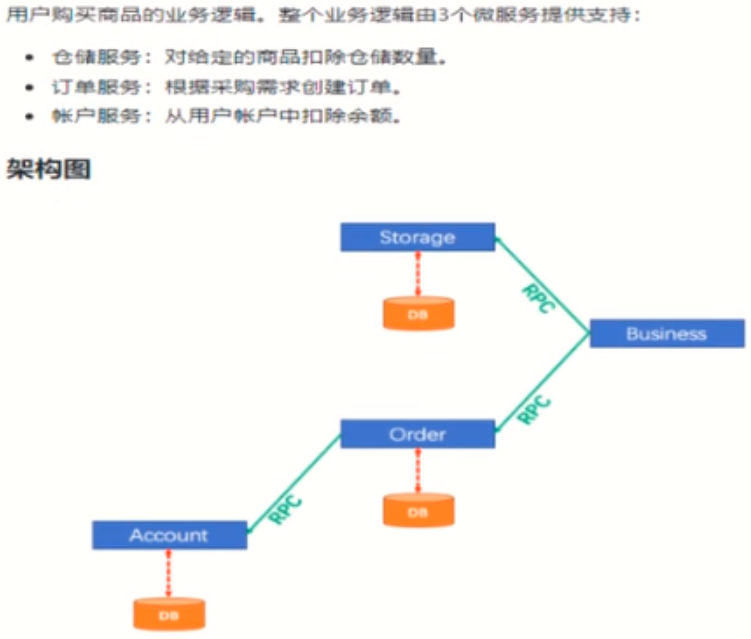

一句话：**一次业务操作需要跨多个数据源或需要跨多个系统进行远程调用，就会产生分布式事务问题**

### (二)、Seata简介

#### 1、**是什么**

Seata是一款开源的分布式事务解决方案，致力于在微服务架构下提供高性能和简单易用的分布式事务服务。

官网:http://seata.io/zh-cn/

#### 2、能干嘛

一个典型的分布式事务过程

分布式事务处理过程的一ID+三组件模型：

- Transaction ID XID 全局唯一的事务ID
- 三组件概念
  - TC (Transaction Coordinator) - 事务协调者：维护全局和分支事务的状态，驱动全局事务提交或回滚。
  - TM (Transaction Manager) - 事务管理器：定义全局事务的范围：开始全局事务、提交或回滚全局事务。
  - RM (Resource Manager) - 资源管理器：管理分支事务处理的资源，与TC交谈以注册分支事务和报告分支事务的状态，并驱动分支事务提交或回滚。
    

处理过程：

1. TM向TC申请开启一个全局事务，全局事务创建成功并生成一个全局唯一的XID；
2. XID在微服务调用链路的上下文中传播；
3. RM向TC注册分支事务，将其纳入XID对应全局事务的管辖；
4. TM向TC发起针对XID的全局提交或回滚决议；
5. TC调度XID下管辖的全部分支事务完成提交或回滚请求。


### (三)、Seata-Server安装

#### 1、**去哪下**

下载地址:https://github.com/seata/seata/releases

#### 2、这么玩

本地@Transactional

全局@GlobalTransactional

#### 3、**分布式交易解决方案**


我们只需要使用一个 `@GlobalTransactional` 注解在业务方法上:

#### 4、安装

1. #### 官网地址 - http://seata.io/zh-cn/

2. #### 下载版本:1.4.2

3. #### 解压后进入conf目录

4. #### 主要修改:自定义事务组名称+事务日志存储模式为db +数据库连接信息

5. #### 模式改为db,数据源改为自己的数据库地址

   

6. #### 创建数据库和表

   ```mysql
   CREATE DATABASE seata;
   USE seata;
   CREATE TABLE IF NOT EXISTS `global_table`
   (
       `xid`                       VARCHAR(128) NOT NULL,
       `transaction_id`            BIGINT,
       `status`                    TINYINT      NOT NULL,
       `application_id`            VARCHAR(32),
       `transaction_service_group` VARCHAR(32),
       `transaction_name`          VARCHAR(128),
       `timeout`                   INT,
       `begin_time`                BIGINT,
       `application_data`          VARCHAR(2000),
       `gmt_create`                DATETIME,
       `gmt_modified`              DATETIME,
       PRIMARY KEY (`xid`),
       KEY `idx_gmt_modified_status` (`gmt_modified`, `status`),
       KEY `idx_transaction_id` (`transaction_id`)
   ) ENGINE = INNODB
     DEFAULT CHARSET = utf8;
   
   -- the table to store BranchSession data
   CREATE TABLE IF NOT EXISTS `branch_table`
   (
       `branch_id`         BIGINT       NOT NULL,
       `xid`               VARCHAR(128) NOT NULL,
       `transaction_id`    BIGINT,
       `resource_group_id` VARCHAR(32),
       `resource_id`       VARCHAR(256),
       `branch_type`       VARCHAR(8),
       `status`            TINYINT,
       `client_id`         VARCHAR(64),
       `application_data`  VARCHAR(2000),
       `gmt_create`        DATETIME(6),
       `gmt_modified`      DATETIME(6),
       PRIMARY KEY (`branch_id`),
       KEY `idx_xid` (`xid`)
   ) ENGINE = INNODB
     DEFAULT CHARSET = utf8;
   
   -- the table to store lock data
   CREATE TABLE IF NOT EXISTS `lock_table`
   (
       `row_key`        VARCHAR(128) NOT NULL,
       `xid`            VARCHAR(128),
       `transaction_id` BIGINT,
       `branch_id`      BIGINT       NOT NULL,
       `resource_id`    VARCHAR(256),
       `table_name`     VARCHAR(32),
       `pk`             VARCHAR(36),
       `gmt_create`     DATETIME,
       `gmt_modified`   DATETIME,
       PRIMARY KEY (`row_key`),
       KEY `idx_branch_id` (`branch_id`)
   ) ENGINE = INNODB
     DEFAULT CHARSET = utf8;
   ```

7. #### 修改registry.conf

   ```json
   registry {
    # file 、nacos 、eureka、redis、zk、consul、etcd3、sofa
    type = "nacos"
    nacos {
     	application = "seata-server"
     	serverAddr = "127.0.0.1:8848"
     	group = "SEATA_GROUP"
     	namespace = ""
     	cluster = "default"
     	username = "nacos"
     	password = "nacos"
    }
   config {
     # file、nacos 、apollo、zk、consul、etcd3
     type = "file"
     file {
       name = "file.conf"
     }
   }
   ```

8. #### 根目录创建config.txt

   ```properties
   #For details about configuration items, see https://seata.io/zh-cn/docs/user/configurations.html
   #Transport configuration, for client and server
   transport.type=TCP
   transport.server=NIO
   transport.heartbeat=true
   transport.enableTmClientBatchSendRequest=false
   transport.enableRmClientBatchSendRequest=true
   transport.enableTcServerBatchSendResponse=false
   transport.rpcRmRequestTimeout=30000
   transport.rpcTmRequestTimeout=30000
   transport.rpcTcRequestTimeout=30000
   transport.threadFactory.bossThreadPrefix=NettyBoss
   transport.threadFactory.workerThreadPrefix=NettyServerNIOWorker
   transport.threadFactory.serverExecutorThreadPrefix=NettyServerBizHandler
   transport.threadFactory.shareBossWorker=false
   transport.threadFactory.clientSelectorThreadPrefix=NettyClientSelector
   transport.threadFactory.clientSelectorThreadSize=1
   transport.threadFactory.clientWorkerThreadPrefix=NettyClientWorkerThread
   transport.threadFactory.bossThreadSize=1
   transport.threadFactory.workerThreadSize=default
   transport.shutdown.wait=3
   transport.serialization=seata
   transport.compressor=none
   
   #Transaction routing rules configuration, only for the client
   service.vgroupMapping.default_tx_group=default
   #If you use a registry, you can ignore it
   service.default.grouplist=127.0.0.1:8091
   service.enableDegrade=false
   service.disableGlobalTransaction=false
   
   #Transaction rule configuration, only for the client
   client.rm.asyncCommitBufferLimit=10000
   client.rm.lock.retryInterval=10
   client.rm.lock.retryTimes=30
   client.rm.lock.retryPolicyBranchRollbackOnConflict=true
   client.rm.reportRetryCount=5
   client.rm.tableMetaCheckEnable=false
   client.rm.tableMetaCheckerInterval=60000
   client.rm.sqlParserType=druid
   client.rm.reportSuccessEnable=false
   client.rm.sagaBranchRegisterEnable=false
   client.rm.sagaJsonParser=fastjson
   client.rm.tccActionInterceptorOrder=-2147482648
   client.rm.sqlParserType=druid
   client.tm.commitRetryCount=5
   client.tm.rollbackRetryCount=5
   client.tm.defaultGlobalTransactionTimeout=60000
   client.tm.degradeCheck=false
   client.tm.degradeCheckAllowTimes=10
   client.tm.degradeCheckPeriod=2000
   client.tm.interceptorOrder=-2147482648
   client.undo.dataValidation=true
   client.undo.logSerialization=jackson
   client.undo.onlyCareUpdateColumns=true
   server.undo.logSaveDays=7
   server.undo.logDeletePeriod=86400000
   client.undo.logTable=undo_log
   client.undo.compress.enable=true
   client.undo.compress.type=zip
   client.undo.compress.threshold=64k
   #For TCC transaction mode
   tcc.fence.logTableName=tcc_fence_log
   tcc.fence.cleanPeriod=1h
   
   #Log rule configuration, for client and server
   log.exceptionRate=100
   
   #Transaction storage configuration, only for the server. The file, DB, and redis configuration values are optional.
   store.mode=file
   store.lock.mode=file
   store.session.mode=file
   #Used for password encryption
   store.publicKey=
   
   #If `store.mode,store.lock.mode,store.session.mode` are not equal to `file`, you can remove the configuration block.
   store.file.dir=file_store/data
   store.file.maxBranchSessionSize=16384
   store.file.maxGlobalSessionSize=512
   store.file.fileWriteBufferCacheSize=16384
   store.file.flushDiskMode=async
   store.file.sessionReloadReadSize=100
   
   #These configurations are required if the `store mode` is `db`. If `store.mode,store.lock.mode,store.session.mode` are not equal to `db`, you can remove the configuration block.
   store.db.datasource=druid
   store.db.dbType=mysql
   store.db.driverClassName=com.mysql.jdbc.Driver
   store.db.url=jdbc:mysql://127.0.0.1:3306/seata?useUnicode=true&rewriteBatchedStatements=true
   store.db.user=username
   store.db.password=password
   store.db.minConn=5
   store.db.maxConn=30
   store.db.globalTable=global_table
   store.db.branchTable=branch_table
   store.db.distributedLockTable=distributed_lock
   store.db.queryLimit=100
   store.db.lockTable=lock_table
   store.db.maxWait=5000
   
   #These configurations are required if the `store mode` is `redis`. If `store.mode,store.lock.mode,store.session.mode` are not equal to `redis`, you can remove the configuration block.
   store.redis.mode=single
   store.redis.single.host=127.0.0.1
   store.redis.single.port=6379
   store.redis.sentinel.masterName=
   store.redis.sentinel.sentinelHosts=
   store.redis.maxConn=10
   store.redis.minConn=1
   store.redis.maxTotal=100
   store.redis.database=0
   store.redis.password=
   store.redis.queryLimit=100
   
   #Transaction rule configuration, only for the server
   server.recovery.committingRetryPeriod=1000
   server.recovery.asynCommittingRetryPeriod=1000
   server.recovery.rollbackingRetryPeriod=1000
   server.recovery.timeoutRetryPeriod=1000
   server.maxCommitRetryTimeout=-1
   server.maxRollbackRetryTimeout=-1
   server.rollbackRetryTimeoutUnlockEnable=false
   server.distributedLockExpireTime=10000
   server.session.branchAsyncQueueSize=5000
   server.session.enableBranchAsyncRemove=true
   
   #Metrics configuration, only for the server
   metrics.enabled=false
   metrics.registryType=compact
   metrics.exporterList=prometheus
   metrics.exporterPrometheusPort=9898
   ```

9. #### 启动nacos       config目录创建nacos-config.sh并执行

   ```shell
   #!/bin/sh
   # Copyright 1999-2019 Seata.io Group.
   #
   # Licensed under the Apache License, Version 2.0 (the "License");
   # you may not use this file except in compliance with the License.
   # You may obtain a copy of the License at、
   #
   #    http://www.apache.org/licenses/LICENSE-2.0
   #
   # Unless required by applicable law or agreed to in writing, software
   # distributed under the License is distributed on an "AS IS" BASIS,
   # WITHOUT WARRANTIES OR CONDITIONS OF ANY KIND, either express or implied.
   # see the License for the specific language governing permissions and
   # limitations under the License.
   while getopts ":h:p:g:t:u:w:" opt
   do
    case $opt in
    h)
     host=$OPTARG
     ;;
    p)
     port=$OPTARG
     ;;
    g)
     group=$OPTARG
     ;;
    t)
     tenant=$OPTARG
     ;;
    u)
     username=$OPTARG
     ;;
    w)
     password=$OPTARG
     ;;
    ?)
     echo " USAGE OPTION: $0 [-h host] [-p port] [-g group] [-t tenant] [-u username] [-w password] "
     exit 1
     ;;
    esac
   done
   
   if [ -z ${host} ]; then
     host=localhost
   fi
   if [ -z ${port} ]; then
     port=8848
   fi
   if [ -z ${group} ]; then
     group="SEATA_GROUP"
   fi
   if [ -z ${tenant} ]; then
     tenant=""
   fi
   if [ -z ${username} ]; then
     username=""
   fi
   if [ -z ${password} ]; then
     password=""
   fi
   
   nacosAddr=$host:$port
   contentType="content-type:application/json;charset=UTF-8"
   
   echo "set nacosAddr=$nacosAddr"
   echo "set group=$group"
   
   urlencode() {
    length="${#1}"
    i=0
    while [ $length -gt $i ]; do
     char="${1:$i:1}"
     case $char in
     [a-zA-Z0-9.~_-]) printf $char ;;
     *) printf '%%%02X' "'$char" ;;
     esac
     i=`expr $i + 1`
    done
   }
   
   failCount=0
   tempLog=$(mktemp -u)
   function addConfig() {
    dataId=`urlencode $1`
    content=`urlencode $2`
    curl -X POST -H "${contentType}" "http://$nacosAddr/nacos/v1/cs/configs?dataId=$dataId&group=$group&content=$content&tenant=$tenant&username=$username&password=$password" >"${tempLog}" 2>/dev/null
    if [ -z $(cat "${tempLog}") ]; then
     echo " Please check the cluster status. "
     exit 1
    fi
    if [ "$(cat "${tempLog}")" == "true" ]; then
     echo "Set $1=$2 successfully "
    else
     echo "Set $1=$2 failure "
     failCount=`expr $failCount + 1`
    fi
   }
   
   count=0
   COMMENT_START="#"
   for line in $(cat $(dirname "$PWD")/config.txt | sed s/[[:space:]]//g); do
     if [[ "$line" =~ ^"${COMMENT_START}".*  ]]; then
      continue
     fi
     count=`expr $count + 1`
     key=${line%%=*}
     value=${line#*=}
     addConfig "${key}" "${value}"
   done
   
   echo "========================================================================="
   echo " Complete initialization parameters,  total-count:$count ,  failure-count:$failCount "
   echo "========================================================================="
   
   if [ ${failCount} -eq 0 ]; then
    echo " Init nacos config finished, please start seata-server. "
   else
    echo " init nacos config fail. "
   fi
   ```

10. #### **nacos添加配置**

dataID：service.vgroupMapping.SEATA_GROUP

GROUP：SEATA_GROUP

文件类型：txt

配置内容：default


### (四)、数据库环境搭建

这里我们会创建三个服务，一个订单服务，一个库存服务，一个账户服务。

当用户下单时,会在订单服务中创建一个订单, 然后通过远程调用库存服务来扣减下单商品的库存，再通过远程调用账户服务来扣减用户账户里面的余额，最后在订单服务中修改订单状态为已完成。

该操作跨越三个数据库，有两次远程调用，很明显会有分布式事务问题。

一言蔽之，下订单—>扣库存—>减账户(余额)—>修改订单状态。
#### 1、订单表

```mysql
CREATE DATABASE seata_order;
USE seata_order;
CREATE TABLE t_order(
    id BIGINT(11) NOT NULL AUTO_INCREMENT PRIMARY KEY ,
    user_id BIGINT(11) DEFAULT NULL COMMENT '用户id',
    product_id BIGINT(11) DEFAULT NULL COMMENT '产品id',
    order_id varchar(50) DEFAULT null COMMENT '订单id',
    count INT(11) DEFAULT NULL COMMENT '数量',
    money DECIMAL(11,0) DEFAULT NULL COMMENT '金额',
    status INT(1) DEFAULT NULL COMMENT '订单状态：0创建中，1已完结'
)ENGINE=InnoDB AUTO_INCREMENT=7 CHARSET=utf8;
```

#### 2、库存表

```mysql
CREATE DATABASE seata_storage;
USE seata_storage;
CREATE TABLE t_storage(
    id BIGINT(11) NOT NULL AUTO_INCREMENT PRIMARY KEY ,
    product_id BIGINT(11) DEFAULT NULL COMMENT '产品id',
    total INT(11) DEFAULT NULL COMMENT '总库存',
    used INT(11) DEFAULT NULL COMMENT '已用库存',
    residue INT(11) DEFAULT NULL COMMENT '剩余库存'
)ENGINE=InnoDB AUTO_INCREMENT=7 CHARSET=utf8;
INSERT INTO t_storage(id, product_id, total, used, residue) VALUES(1,1,100,0,100);
```

#### 3、用户表

```mysql
CREATE DATABASE seata_account;
USE seata_account;
CREATE TABLE t_account(
    id BIGINT(11) NOT NULL AUTO_INCREMENT PRIMARY KEY ,
    user_id BIGINT(11) DEFAULT NULL COMMENT '用户id',
    total DECIMAL(10,0) DEFAULT NULL COMMENT '总额度',
    used DECIMAL(10,0) DEFAULT NULL COMMENT '已用额度',
    residue DECIMAL(10,0) DEFAULT 0 COMMENT '剩余可用额度'
)ENGINE=InnoDB AUTO_INCREMENT=7 CHARSET=utf8;
INSERT INTO t_account(id, user_id, total, used, residue) VALUES(1,1,1000,0,1000);
```

#### 4、每个表添加undo_log日志记录

```mysql
CREATE TABLE `undo_log` (
  `id` bigint(20) NOT NULL AUTO_INCREMENT COMMENT 'increment id',
  `branch_id` bigint(20) NOT NULL COMMENT 'branch transaction id',
  `xid` varchar(100) NOT NULL COMMENT 'global transaction id',
  `context` varchar(128) NOT NULL COMMENT 'undo_log context,such as serialization',
  `rollback_info` longblob NOT NULL COMMENT 'rollback info',
  `log_status` int(11) NOT NULL COMMENT '0:normal status,1:defense status',
  `log_created` datetime NOT NULL COMMENT 'create datetime',
  `log_modified` datetime NOT NULL COMMENT 'modify datetime',
  `ext` varchar(100) DEFAULT NULL COMMENT 'reserved field',
  PRIMARY KEY (`id`),
  UNIQUE KEY `ux_undo_log` (`xid`,`branch_id`)
) ENGINE=InnoDB AUTO_INCREMENT=1 DEFAULT CHARSET=utf8 COMMENT='AT transaction mode undo table';
```

### (五)、订单模块搭建

#### 1、创项目:seata-order-service2001

- 订单完成2个功能:
  - 创建订单
  - 修改订单状态

#### 2、pom

父pom修改alibaba版本为2.2.0

```xml
<!--spring cloud alibaba 2.2.0.RELEASE-->
<dependency>
  <groupId>com.alibaba.cloud</groupId>
  <artifactId>spring-cloud-alibaba-dependencies</artifactId>
  <version>2.2.0.RELEASE</version>
  <type>pom</type>
  <scope>import</scope>
</dependency>
```

```xml
<dependencies>
        <!-- OpenFeign -->
        <dependency>
            <groupId>org.springframework.cloud</groupId>
            <artifactId>spring-cloud-starter-openfeign</artifactId>
        </dependency>
        <dependency>
            <groupId>org.cloud</groupId>
            <artifactId>cloud-api-commons</artifactId>
            <version>1.0-SNAPSHOT</version>
        </dependency>
        <!-- seata -->
        <!--seata-->
        <dependency>
            <groupId>io.seata</groupId>
            <artifactId>seata-spring-boot-starter</artifactId>
            <version>1.4.2</version>  <!--指定最新版本，当然要与seata-server版本一致-->
        </dependency>
        <dependency>
            <groupId>com.alibaba.cloud</groupId>
            <artifactId>spring-cloud-starter-alibaba-seata</artifactId>
            <exclusions>
                <exclusion>
                    <groupId>io.seata</groupId>
                    <artifactId>seata-spring-boot-starter</artifactId>
                </exclusion>
            </exclusions>
        </dependency>

        <!-- nacos -->
        <dependency>
            <groupId>com.alibaba.cloud</groupId>
            <artifactId>spring-cloud-starter-alibaba-nacos-discovery</artifactId>
        </dependency>

        <!--springboot-->
        <dependency>
            <groupId>org.springframework.boot</groupId>
            <artifactId>spring-boot-starter-web</artifactId>
        </dependency>
        <!--监控-->
        <dependency>
            <groupId>org.springframework.boot</groupId>
            <artifactId>spring-boot-starter-actuator</artifactId>
        </dependency>
        <!--mysql-druid-->
        <dependency>
            <groupId>mysql</groupId>
            <artifactId>mysql-connector-java</artifactId>
            <version>5.1.37</version>
        </dependency>
        <dependency>
            <groupId>com.alibaba</groupId>
            <artifactId>druid-spring-boot-starter</artifactId>
            <version>1.1.10</version>
        </dependency>
        <dependency>
            <groupId>org.mybatis.spring.boot</groupId>
            <artifactId>mybatis-spring-boot-starter</artifactId>
            <version>2.0.0</version>
        </dependency>
        <dependency>
            <groupId>org.springframework.boot</groupId>
            <artifactId>spring-boot-starter-test</artifactId>
            <scope>test</scope>
        </dependency>
        <dependency>
            <groupId>org.projectlombok</groupId>
            <artifactId>lombok</artifactId>
            <optional>true</optional>
        </dependency>
    </dependencies>
```

#### 3、YML

```yaml
server:
  port: 2001

spring:
  application:
    name: seata-order-service		# 微服务名字
  cloud:
    nacos:
      discovery:
        server-addr: localhost:8848			# nacos的地址为localhost:8848
  datasource:
    type: com.alibaba.druid.pool.DruidDataSource
    driver-class-name: com.mysql.jdbc.Driver               # mysql驱动包
    url: jdbc:mysql://localhost:3306/seata_order?useUnicode=true&characterEncoding=utf-8&useSSL=false
    username: root
    password: Qwer1234

seata:
  enabled: true
  application-id: ${spring.application.name}
  tx-service-group: SEATA_GROUP    			# 此处配置自定义的seata事务分组名称
  enable-auto-data-source-proxy: true    # 开启数据库代理
  service:
    vgroupMapping:
      SEATA_GROUP: default				
  registry:
    type: nacos
    nacos:
      application: seata-server
      server-addr: 127.0.0.1:8848
      namespace: ""
      cluster: default
      username: nacos
      password: nacos

feign:
  hystrix:
    enabled: false

logging:
  level:
    io:
      seata: info

mybatis:
  mapperLocations: classpath:mapper/*.xml
  # 下划线转为驼峰
  configuration:
    map-underscore-to-camel-case: true

```

#### 4、实体类

Order

```java
@Data
@AllArgsConstructor
@NoArgsConstructor
public class Order {

    private Integer id;				// 主键
    private Integer userId;			// 用户id	
    private Integer productId;		// 商品id
    private String orderId;			// 订单id
    private Integer count;			// 订单个数
    private BigDecimal money;		// 总金额
    private Integer status;			// 支付状态
}
```

#### 5、dao

```java
@Mapper
public interface OrderMapper {

	// 添加订单
    void create(Order order);
    // 更新订单状态
    void updateStatus(Map<String,Object> updateMap);
    // 获取总金额
    BigDecimal getMoney(Integer userId);
}
```

#### 6、mapper

```xml
<?xml version="1.0" encoding="UTF-8" ?>
<!DOCTYPE mapper PUBLIC "-//mybatis.org//DTD Mapper 3.0//EN" "http://mybatis.org/dtd/mybatis-3-mapper.dtd" >

<mapper namespace="com.springcloud.dao.OrderMapper">

	<!--添加订单-->
    <insert id="create" parameterType="com.springcloud.pojo.Order">
        insert into t_order (id,user_id,product_id,order_id,count,money,status)
        values (null,#{userId},#{productId},#{orderId},#{count},#{money},0);
    </insert>

    <!--更新状态-->
    <update id="updateStatus">
        update t_order set status = #{status} where order_id = #{orderId};
    </update>

    <!--获取金额-->
    <select id="getMoney" parameterType="integer" resultType="decimal">
        select money from t_order where user_id = #{userId};
    </select>
</mapper>
```

#### 7、OrderService

```java
@Service
public interface OrderService {

    // 添加订单
    void create(Order order);
    // 更新订单状态
    void updateStatus(Map<String,Object> updateMap);
    // 获取总金额
    BigDecimal getMoney(Integer userId);
}
```

#### 8、StorageFeignService

```java
@Service
@FeignClient("seata-storage-service")
public interface StorageFeignService {

    //获取商品价格
    @GetMapping("/getPrice/{productId}")
    public BigDecimal getPrice(@PathVariable("productId") Integer productId);

    //减库存
    @RequestMapping("/updateStorageTotal")
    public void updateStorageTotal(@RequestParam("count")Integer count,@RequestParam("productId")Integer productId);
}
```

#### 9、AccountFeignService

```java
@Service
@FeignClient("seata-account-service")
public interface AccountFeignService {

	//扣余额
    @RequestMapping("/updateResidue")
    public void updateResidue(@RequestParam("money") BigDecimal money, @RequestParam("userId")Integer userId);
}
```

#### 10、OrderService实体类

```java
@Component
public class OrderServiceImpl implements OrderService {

    //dao层
    @Autowired
    private OrderMapper orderMapper;

    //用户模块
    @Autowired
    private AccountFeignService accountFeignService;

    //商品信息
    @Autowired
    private StorageFeignService storageFeignService;

    //创建订单
    @Override
    public void createOrder(Order order) {
        //  生成设置订单的流水号
        String orderId = UUID.randomUUID().toString();
        order.setOrderId(orderId);
        // 通过库存模块查看物品价格
        BigDecimal price = storageFeignService.getPrice(order.getProductId());
        // 物品价格乘以个数
        BigDecimal totalPrice = price.multiply( new BigDecimal(order.getCount().toString()));
        // 添加总价格
        order.setMoney(totalPrice);
        orderMapper.create(order);
        //减库存
        Integer count = order.getCount();
        Integer productId = order.getProductId();
        storageFeignService.updateStorageTotal(count,productId);
        //获取花的钱扣账户余额
        BigDecimal money = this.getMoney(order.getUserId());
        accountFeignService.updateResidue(money, order.getUserId());
        //修改订单状态
        Map<String, Object> map = new HashMap<>();
        map.put("orderId", order.getOrderId());
        map.put("status", 1);
        this.updateStatus(map);
    }

    //更新订单状态
    @Override
    public void updateStatus(Map<String,Object> updateMap) {
        orderMapper.updateStatus(updateMap);
    }

    //获取支付的金额
    @Override
    public BigDecimal getMoney(Integer userId) {
        return orderMapper.getMoney(userId);
    }
}
```

#### 11、controller

```java
@RestController
public class OrderController {

    @Autowired
    private OrderService orderService;

    /**
     * 添加订单信息
     * @param order 订单信息
     */
    @GetMapping("/createOrder")
    public void createOrder(Order order){
        orderService.createOrder(order);

    }
}
```

#### 12、主启动

```java
@SpringBootApplication
@EnableDiscoveryClient
@EnableFeignClients
public class OrderRunMain {

    public static void main(String[] args) {
        SpringApplication.run(OrderRunMain.class, args);
    }
}
```

### (六)、库存模块搭建

#### 1、创项目

seata-storage-service2002

#### 2、pom

```xml
<dependencies>
    <!-- OpenFeign -->
    <dependency>
        <groupId>org.springframework.cloud</groupId>
        <artifactId>spring-cloud-starter-openfeign</artifactId>
    </dependency>
    <dependency>
        <groupId>org.cloud</groupId>
        <artifactId>cloud-api-commons</artifactId>
        <version>1.0-SNAPSHOT</version>
    </dependency>
    <!-- seata -->
    <!--seata-->
    <dependency>
        <groupId>io.seata</groupId>
        <artifactId>seata-spring-boot-starter</artifactId>
        <version>1.4.2</version>  <!--指定最新版本，当然要与seata-server版本一致-->
    </dependency>
    <dependency>
        <groupId>com.alibaba.cloud</groupId>
        <artifactId>spring-cloud-starter-alibaba-seata</artifactId>
        <exclusions>
            <exclusion>
                <groupId>io.seata</groupId>
                <artifactId>seata-spring-boot-starter</artifactId>
            </exclusion>
        </exclusions>
    </dependency>

    <!-- nacos -->
    <dependency>
        <groupId>com.alibaba.cloud</groupId>
        <artifactId>spring-cloud-starter-alibaba-nacos-discovery</artifactId>
    </dependency>

    <!--springboot-->
    <dependency>
        <groupId>org.springframework.boot</groupId>
        <artifactId>spring-boot-starter-web</artifactId>
    </dependency>
    <!--监控-->
    <dependency>
        <groupId>org.springframework.boot</groupId>
        <artifactId>spring-boot-starter-actuator</artifactId>
    </dependency>
    <!--mysql-druid-->
    <dependency>
        <groupId>mysql</groupId>
        <artifactId>mysql-connector-java</artifactId>
        <version>5.1.37</version>
    </dependency>
    <dependency>
        <groupId>com.alibaba</groupId>
        <artifactId>druid-spring-boot-starter</artifactId>
        <version>1.1.10</version>
    </dependency>
    <dependency>
        <groupId>org.mybatis.spring.boot</groupId>
        <artifactId>mybatis-spring-boot-starter</artifactId>
        <version>2.0.0</version>
    </dependency>
    <dependency>
        <groupId>org.springframework.boot</groupId>
        <artifactId>spring-boot-starter-test</artifactId>
        <scope>test</scope>
    </dependency>
    <dependency>
        <groupId>org.projectlombok</groupId>
        <artifactId>lombok</artifactId>
        <optional>true</optional>
    </dependency>
</dependencies>
```

#### 3、yaml

```yaml
server:
  port: 2002

spring:
  application:
    name: seata-storage-service
  cloud:
    nacos:
      discovery:
        server-addr: localhost:8848
  datasource:
    type: com.alibaba.druid.pool.DruidDataSource
    driver-class-name: com.mysql.jdbc.Driver               # mysql驱动包
    url: jdbc:mysql://localhost:3306/seata_storage?useUnicode=true&characterEncoding=utf-8&useSSL=false
    username: root
    password: Qwer1234

seata:
  enabled: true
  application-id: ${spring.application.name}
  tx-service-group: SEATA_GROUP    #此处配置自定义的seata事务分组名称
  enable-auto-data-source-proxy: true    #开启数据库代理
  service:
    vgroupMapping:
      SEATA_GROUP: default
  registry:
    type: nacos
    nacos:
      application: seata-server
      server-addr: 127.0.0.1:8848
      namespace: ""
      cluster: default
      username: nacos
      password: nacos

feign:
  hystrix:
    enabled: false

logging:
  level:
    io:
      seata: info

mybatis:
  mapperLocations: classpath:mapper/*.xml
  configuration:
    map-underscore-to-camel-case: true
```

#### 4、dao

```java
@Mapper
public interface StorageMapper {

    //根据id获取价格
    BigDecimal getPrice(Integer productId);

    //更新库存数量
    void updateStorageTotal(Map<String, Object> map);
}
```

#### 5、mapper

```xml
<?xml version="1.0" encoding="UTF-8" ?>
<!DOCTYPE mapper PUBLIC "-//mybatis.org//DTD Mapper 3.0//EN" "http://mybatis.org/dtd/mybatis-3-mapper.dtd" >

<mapper namespace="com.springcloud.dao.StorageMapper">

    <select id="getPrice" parameterType="integer" resultType="java.math.BigDecimal">
        select price from t_storage where product_id = #{productId};
    </select>

    <update id="updateStorageTotal">
        update t_storage set total = total - #{count} where product_id = #{productId}
    </update>
</mapper>
```

#### 6、service

```java
@Service
public interface StorageService {

    //根据id获取价格
    BigDecimal getPrice(Integer productId);

    //更新库存数量
    void updateStorageTotal(Map<String, Object> map);
}
```

#### 7、service实现类

```java
@Component
public class StorageServiceImpl implements StorageService {

    //dao层
    @Autowired
    private StorageMapper storageMapper;

    //获取价格
    @Override
    public BigDecimal getPrice(Integer productId) {
        return storageMapper.getPrice(productId);
    }

    //格局productId获取信息,count要减去的数量
    @Override
    public void updateStorageTotal(Integer count,Integer productId) {
        Map<String, Object> map = new HashMap<>();
        map.put("count",count);
        map.put("productId", productId);
        storageMapper.updateStorageTotal(map);
    }
}
```

#### 8、controller

```java
@RestController
public class StorageController {

    @Autowired
    private StorageService storageService;

    //获取价格
    @GetMapping("/getPrice/{productId}")
    public BigDecimal getPrice(@PathVariable("productId") Integer productId){
        return storageService.getPrice(productId);
    }

    //修改库存数量
    @RequestMapping("/updateStorageTotal")
    public void updateStorageTotal(@RequestParam("count")Integer count,@RequestParam("productId")Integer productId){
        storageService.updateStorageTotal(count,productId);
    }
}
```

#### 9、主启动

```java
@EnableDiscoveryClient
@SpringBootApplication
@EnableFeignClients
public class StorageRunMain {
    public static void main(String[] args) {
        SpringApplication.run(StorageRunMain.class, args);
    }
}
```

### (七)、账户模块构建

#### 1、创项目

seata-account-service2003

#### 2、pom

```xml
<dependencies>
    <!-- OpenFeign -->
    <dependency>
        <groupId>org.springframework.cloud</groupId>
        <artifactId>spring-cloud-starter-openfeign</artifactId>
    </dependency>
    <dependency>
        <groupId>org.cloud</groupId>
        <artifactId>cloud-api-commons</artifactId>
        <version>1.0-SNAPSHOT</version>
    </dependency>
    <!-- seata -->
    <!--seata-->
    <dependency>
        <groupId>io.seata</groupId>
        <artifactId>seata-spring-boot-starter</artifactId>
        <version>1.4.2</version>  <!--指定最新版本，当然要与seata-server版本一致-->
    </dependency>
    <dependency>
        <groupId>com.alibaba.cloud</groupId>
        <artifactId>spring-cloud-starter-alibaba-seata</artifactId>
        <exclusions>
            <exclusion>
                <groupId>io.seata</groupId>
                <artifactId>seata-spring-boot-starter</artifactId>
            </exclusion>
        </exclusions>
    </dependency>

    <!-- nacos -->
    <dependency>
        <groupId>com.alibaba.cloud</groupId>
        <artifactId>spring-cloud-starter-alibaba-nacos-discovery</artifactId>
    </dependency>

    <!--springboot-->
    <dependency>
        <groupId>org.springframework.boot</groupId>
        <artifactId>spring-boot-starter-web</artifactId>
    </dependency>
    <!--监控-->
    <dependency>
        <groupId>org.springframework.boot</groupId>
        <artifactId>spring-boot-starter-actuator</artifactId>
    </dependency>
    <!--mysql-druid-->
    <dependency>
        <groupId>mysql</groupId>
        <artifactId>mysql-connector-java</artifactId>
        <version>5.1.37</version>
    </dependency>
    <dependency>
        <groupId>com.alibaba</groupId>
        <artifactId>druid-spring-boot-starter</artifactId>
        <version>1.1.10</version>
    </dependency>
    <dependency>
        <groupId>org.mybatis.spring.boot</groupId>
        <artifactId>mybatis-spring-boot-starter</artifactId>
        <version>2.0.0</version>
    </dependency>
    <dependency>
        <groupId>org.springframework.boot</groupId>
        <artifactId>spring-boot-starter-test</artifactId>
        <scope>test</scope>
    </dependency>
    <dependency>
        <groupId>org.projectlombok</groupId>
        <artifactId>lombok</artifactId>
        <optional>true</optional>
    </dependency>
</dependencies>
```

#### 3、yaml

```yaml
server:
  port: 2003

spring:
  application:
    name: seata-account-service
  cloud:
    nacos:
      discovery:
        server-addr: localhost:8848
  datasource:
    type: com.alibaba.druid.pool.DruidDataSource
    driver-class-name: com.mysql.jdbc.Driver               # mysql驱动包
    url: jdbc:mysql://localhost:3306/seata_account?useUnicode=true&characterEncoding=utf-8&useSSL=false
    username: root
    password: Qwer1234

seata:
  enabled: true
  application-id: ${spring.application.name}
  tx-service-group: SEATA_GROUP    #此处配置自定义的seata事务分组名称
  enable-auto-data-source-proxy: true    #开启数据库代理
  service:
    vgroupMapping:
      SEATA_GROUP: default
  registry:
    type: nacos
    nacos:
      application: seata-server
      server-addr: 127.0.0.1:8848
      namespace: ""
      cluster: default
      username: nacos
      password: nacos

feign:
  hystrix:
    enabled: false

logging:
  level:
    io:
      seata: info

mybatis:
  mapperLocations: classpath:mapper/*.xml
  configuration:
    map-underscore-to-camel-case: true
```

#### 4、主启动

```java
@EnableDiscoveryClient
@EnableFeignClients
@SpringBootApplication
public class AccountRunMain {
    public static void main(String[] args) {
        SpringApplication.run(AccountRunMain.class, args);
    }
}
```

#### 5、dao

```java
@Mapper
public interface AccountMapper {

	//扣减账户余额
    void updateResidue(Map<String,Object> map);
}
```

#### 6、mapper

```xml
<?xml version="1.0" encoding="UTF-8" ?>
<!DOCTYPE mapper PUBLIC "-//mybatis.org//DTD Mapper 3.0//EN" "http://mybatis.org/dtd/mybatis-3-mapper.dtd" >

<mapper namespace="com.springcloud.dao.AccountMapper">

    <update id="updateResidue">
        update t_account set residue=residue - #{money},used = used + #{money} where user_id = #{userId}
    </update>

</mapper>
```

#### 7、service

```java
@Service
public interface AccountService {

    //扣减余额
    void updateResidue(BigDecimal money,Integer userId);
}
```

#### 8、实体类

```java
@Component
public class AccountServiceImpl implements AccountService {

    @Autowired
    private AccountMapper accountMapper;

    //扣减余额
    @Override
    public void updateResidue(BigDecimal money, Integer userId) {
        Map<String, Object> map = new HashMap<>();
        map.put("money", money);
        map.put("userId", userId);
        accountMapper.updateResidue(map);
    }
}
```

#### 9、controller

```java
@RestController
public class AccountController {

    @Autowired
    private AccountService accountService;

    //扣减余额
    @RequestMapping("/updateResidue")
    public void updateResidue(@RequestParam("money")BigDecimal money, @RequestParam("userId")Integer userId){
        accountService.updateResidue(money, userId);
    }
}
```

### (八)、测试

1. 启动nacos,seata

2. 启动订单、库存、账户模块

3. 查看数据库

   

4. 访问:http://localhost:2001/createOrder?userId=2222&productId=1&count=10

   

5. 生成订单并且状态是1(已支付)

   

6. 故意添加异常,在扣减金额后添加异常

   ```java
   //扣减金额
   accountFeignService.updateResidue(money, order.getUserId());
   Map<String, Object> map = new HashMap<>();
   map.put("orderId", order.getOrderId());
   map.put("status", 1);
   
   int a = 10/0;
   
   //修改状态
   this.updateStatus(map);
   ```

7. 查看用户余额

   

8. 再次访问:http://localhost:2001/createOrder?userId=2222&productId=1&count=10

   

9. 查看订单表,状态是0(未支付)

   

10. 查看账户表,用户的余额被扣

    

    

**问题:用户扣钱了,因为系统出错,订单不是已支付状态**

### (九)、**@GlobalTransactional**

想让多个库之间操作达到业务的效果只需要在入口方法上添加@GloblTransactional注解

- 修改数据库为默认的,账户余额1000


- 用@GlobalTransactional标注OrderServiceImpl的create()方法。

```java
@Override
@GlobalTransactional
public void createOrder(Order order) {
```

- 再次访问:http://localhost:2001/createOrder?userId=2222&productId=1&count=10		服务器报错


- 查看订单库,没有生成订单


- 查看用户余额,没有扣减,达到了原子性


### (十)、Seata原理

2019年1月份蚂蚁金服和阿里巴巴共同开源的分布式事务解决方案。

Simple Extensible Autonomous Transaction Architecture，简单可扩展自治事务框架。

2020起始，用1.0以后的版本。Alina Gingertail


#### 1、**分布式事务的执行流程**

- TM开启分布式事务(TM向TC注册全局事务记录) ;
- 按业务场景，编排数据库、服务等事务内资源(RM向TC汇报资源准备状态) ;
- TM结束分布式事务，事务一阶段结束(TM通知TC提交/回滚分布式事务) ;
- TC汇总事务信息，决定分布式事务是提交还是回滚；
- TC通知所有RM提交/回滚资源，事务二阶段结束。

#### 2、**如何做到保持原子性**

**前提**

- 基于支持本地 ACID 事务的关系型数据库。
- Java 应用，通过 JDBC 访问数据库。

**整体机制**

- 一阶段：业务数据和回滚日志记录在同一个本地事务中提交，释放本地锁和连接资源。
- 二阶段：
  - 提交异步化，非常快速地完成。
  - 回滚通过一阶段的回滚日志进行反向补偿。

#### 3、一阶段加载

在一阶段，Seata会拦截“业务SQL”

1. 解析SQL语义，找到“业务SQL" 要更新的业务数据，在业务数据被更新前，将其保存成"before image”
2. 执行“业务SQL" 更新业务数据，在业务数据更新之后,
3. 其保存成"after image”，最后生成行锁。

以上操作全部在一个数据库事务内完成, 这样保证了一阶段操作的原子性。


#### 4、二阶段提交

二阶段如果顺利提交的话，因为"业务SQL"在一阶段已经提交至数据库，所以Seata框架只需将一阶段保存的快照数据和行锁删掉，完成数据清理即可。


#### 5、二阶段回滚

二阶段如果是回滚的话，Seata 就需要回滚一阶段已经执行的 “业务SQL"，还原业务数据。

回滚方式便是用"before image"还原业务数据；但在还原前要首先要校验脏写，对比“数据库当前业务数据”和"after image"。

如果两份数据完全一致就说明没有脏写， 可以还原业务数据，如果不一致就说明有脏写, 出现脏写就需要转人工处理。


